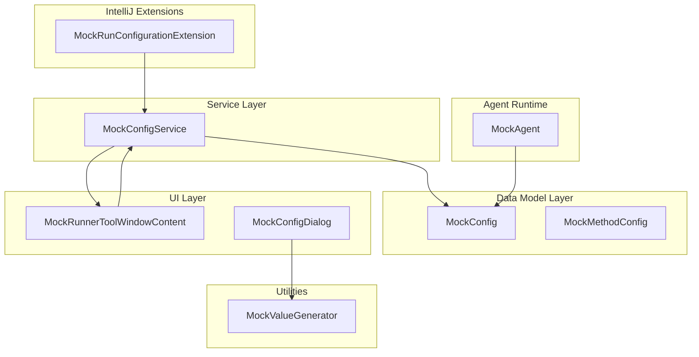
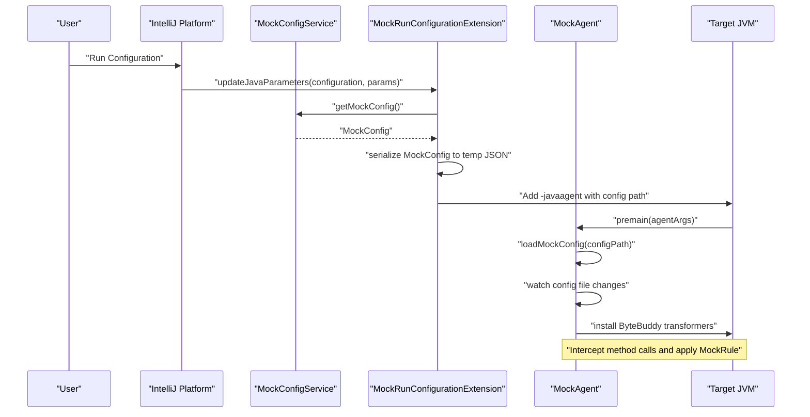
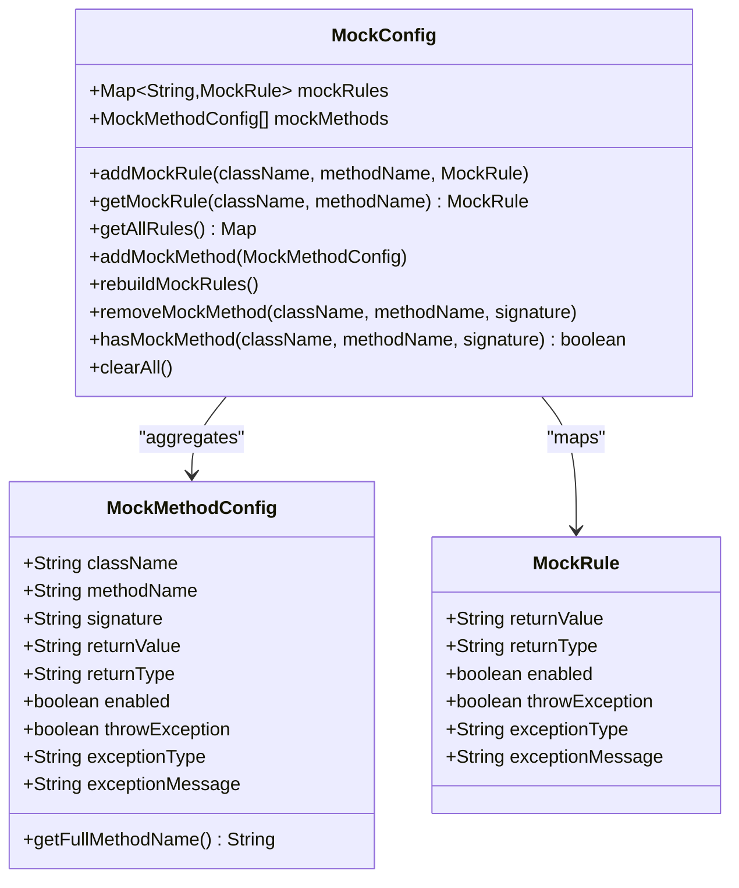
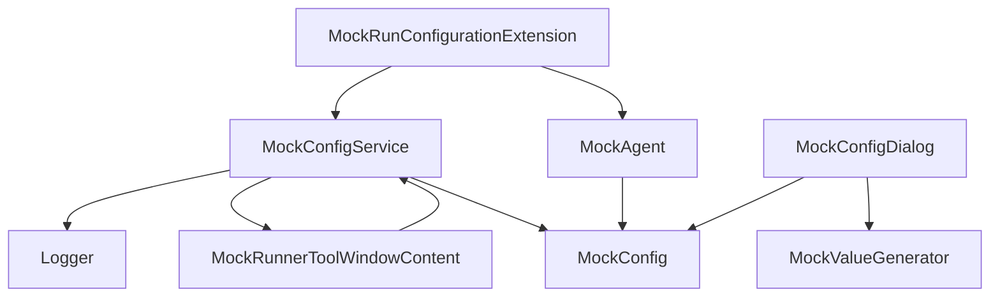

# API Reference

<cite>
**Referenced Files in This Document**
- [MockConfigService.java](file://src/main/java/io/github/lancelothuxi/idea/plugin/mock/service/MockConfigService.java)
- [MockConfig.java](file://src/main/java/io/github/lancelothuxi/idea/plugin/mock/mock/MockConfig.java)
- [MockMethodConfig.java](file://src/main/java/io/github/lancelothuxi/idea/plugin/mock/mock/MockMethodConfig.java)
- [MockRunConfigurationExtension.java](file://src/main/java/io/github/lancelothuxi/idea/plugin/mock/extension/MockRunConfigurationExtension.java)
- [MockAgent.java](file://src/main/java/io/github/lancelothuxi/idea/plugin/mock/agent/MockAgent.java)
- [MockRunnerToolWindowContent.java](file://src/main/java/io/github/lancelothuxi/idea/plugin/mock/ui/MockRunnerToolWindowContent.java)
- [MockConfigDialog.java](file://src/main/java/io/github/lancelothuxi/idea/plugin/mock/ui/MockConfigDialog.java)
- [MockValueGenerator.java](file://src/main/java/io/github/lancelothuxi/idea/plugin/mock/util/MockValueGenerator.java)
</cite>

## Table of Contents
1. [Introduction](#introduction)
2. [Project Structure](#project-structure)
3. [Core Components](#core-components)
4. [Architecture Overview](#architecture-overview)
5. [Detailed Component Analysis](#detailed-component-analysis)
6. [Dependency Analysis](#dependency-analysis)
7. [Performance Considerations](#performance-considerations)
8. [Troubleshooting Guide](#troubleshooting-guide)
9. [Conclusion](#conclusion)
10. [Appendices](#appendices)

## Introduction
This document provides a comprehensive API reference for Mock Runner’s public interfaces and internal APIs. It covers:
- Public methods of MockConfigService and related UI services
- Configuration management APIs for mock rules and method configs
- State manipulation interfaces for enabling/disabling mocks and persistence
- Data models MockConfig and MockMethodConfig with field semantics, validation rules, and serialization behavior
- Plugin extension points and IntelliJ Platform API integrations
- Custom UI component interfaces and their roles
- Method signatures, parameter descriptions, return value specifications, and exception handling patterns
- Usage examples, integration scenarios, thread safety considerations, performance implications, and best practices

## Project Structure
The project is organized around a plugin architecture integrating:
- Service layer for configuration management and persistence
- Data model layer for mock rules and method configurations
- Extension layer for IntelliJ run configuration integration
- Agent layer for runtime interception via Java agent and ByteBuddy
- UI layer for tool window and dialogs

**Diagram sources**
- [MockConfigService.java](file://src/main/java/io/github/lancelothuxi/idea/plugin/mock/service/MockConfigService.java#L23-L196)
- [MockConfig.java](file://src/main/java/io/github/lancelothuxi/idea/plugin/mock/mock/MockConfig.java#L12-L217)
- [MockMethodConfig.java](file://src/main/java/io/github/lancelothuxi/idea/plugin/mock/mock/MockMethodConfig.java#L5-L93)
- [MockRunConfigurationExtension.java](file://src/main/java/io/github/lancelothuxi/idea/plugin/mock/extension/MockRunConfigurationExtension.java#L24-L161)
- [MockAgent.java](file://src/main/java/io/github/lancelothuxi/idea/plugin/mock/agent/MockAgent.java#L21-L399)
- [MockRunnerToolWindowContent.java](file://src/main/java/io/github/lancelothuxi/idea/plugin/mock/ui/MockRunnerToolWindowContent.java#L22-L448)
- [MockConfigDialog.java](file://src/main/java/io/github/lancelothuxi/idea/plugin/mock/ui/MockConfigDialog.java#L27-L292)
- [MockValueGenerator.java](file://src/main/java/io/github/lancelothuxi/idea/plugin/mock/util/MockValueGenerator.java#L13-L288)

**Section sources**
- [MockConfigService.java](file://src/main/java/io/github/lancelothuxi/idea/plugin/mock/service/MockConfigService.java#L1-L197)
- [MockConfig.java](file://src/main/java/io/github/lancelothuxi/idea/plugin/mock/mock/MockConfig.java#L1-L218)
- [MockMethodConfig.java](file://src/main/java/io/github/lancelothuxi/idea/plugin/mock/mock/MockMethodConfig.java#L1-L94)
- [MockRunConfigurationExtension.java](file://src/main/java/io/github/lancelothuxi/idea/plugin/mock/extension/MockRunConfigurationExtension.java#L1-L162)
- [MockAgent.java](file://src/main/java/io/github/lancelothuxi/idea/plugin/mock/agent/MockAgent.java#L1-L400)
- [MockRunnerToolWindowContent.java](file://src/main/java/io/github/lancelothuxi/idea/plugin/mock/ui/MockRunnerToolWindowContent.java#L1-L449)
- [MockConfigDialog.java](file://src/main/java/io/github/lancelothuxi/idea/plugin/mock/ui/MockConfigDialog.java#L1-L293)
- [MockValueGenerator.java](file://src/main/java/io/github/lancelothuxi/idea/plugin/mock/util/MockValueGenerator.java#L1-L289)

## Core Components
This section documents the primary APIs and data models used to configure and manage mocks.

- MockConfigService
  - Purpose: Manages persistent mock configuration, persists to XML and temporary JSON, updates UI, and exposes CRUD-like operations for mock methods.
  - Key responsibilities:
    - Persist state to disk and to a temporary JSON file for agent consumption
    - Load and rebuild mock rules from method configs
    - Update tool window and editors after state changes
    - Provide add/remove/clear/get operations for mock methods
  - Persistence: Implements PersistentStateComponent with a State holder containing serialized MockConfig JSON.

- MockConfig
  - Purpose: Central registry of mock rules keyed by class.method and list of method configs.
  - Key responsibilities:
    - Maintain a map of MockRule per method
    - Sync from MockMethodConfig list to MockRule map
    - Infer return type from return value when not explicitly provided
    - Provide clearAll, remove, and lookup helpers

- MockMethodConfig
  - Purpose: Serializable representation of a single method’s mock configuration.
  - Key responsibilities:
    - Store class/method/signature, return value/type, enable flag, and exception behavior
    - Provide a composite key for uniqueness checks

- MockRunConfigurationExtension
  - Purpose: Extends IntelliJ run configurations to inject the Java agent with the current mock configuration.
  - Key responsibilities:
    - Locate plugin agent JAR
    - Serialize MockConfig to a temporary JSON file
    - Append -javaagent VM parameter with the config path

- MockAgent
  - Purpose: Runtime agent that intercepts method calls and applies mock rules.
  - Key responsibilities:
    - Load and watch mock configuration file
    - Transform classes with ByteBuddy to delegate to interceptors
    - Parse return values and throw exceptions according to MockRule

- UI Components
  - MockRunnerToolWindowContent: Tool window content with filtering, pagination, global enable/disable, and dirty-state tracking.
  - MockConfigDialog: Project-wide mock configuration dialog with smart value generation and JSON editor integration.

**Section sources**
- [MockConfigService.java](file://src/main/java/io/github/lancelothuxi/idea/plugin/mock/service/MockConfigService.java#L23-L196)
- [MockConfig.java](file://src/main/java/io/github/lancelothuxi/idea/plugin/mock/mock/MockConfig.java#L12-L217)
- [MockMethodConfig.java](file://src/main/java/io/github/lancelothuxi/idea/plugin/mock/mock/MockMethodConfig.java#L5-L93)
- [MockRunConfigurationExtension.java](file://src/main/java/io/github/lancelothuxi/idea/plugin/mock/extension/MockRunConfigurationExtension.java#L24-L161)
- [MockAgent.java](file://src/main/java/io/github/lancelothuxi/idea/plugin/mock/agent/MockAgent.java#L21-L399)
- [MockRunnerToolWindowContent.java](file://src/main/java/io/github/lancelothuxi/idea/plugin/mock/ui/MockRunnerToolWindowContent.java#L22-L448)
- [MockConfigDialog.java](file://src/main/java/io/github/lancelothuxi/idea/plugin/mock/ui/MockConfigDialog.java#L27-L292)

## Architecture Overview
The system integrates IntelliJ Platform APIs, a Java agent, and UI components to provide a seamless mock configuration and runtime interception experience.

**Diagram sources**
- [MockRunConfigurationExtension.java](file://src/main/java/io/github/lancelothuxi/idea/plugin/mock/extension/MockRunConfigurationExtension.java#L28-L92)
- [MockConfigService.java](file://src/main/java/io/github/lancelothuxi/idea/plugin/mock/service/MockConfigService.java#L37-L96)
- [MockAgent.java](file://src/main/java/io/github/lancelothuxi/idea/plugin/mock/agent/MockAgent.java#L26-L200)

## Detailed Component Analysis

### MockConfigService API
Public methods and behaviors:
- getInstance(Project): Returns the service instance bound to the project.
- getConfig(): Returns the current MockConfig object.
- saveConfig(): Serializes MockConfig to a temporary JSON file and logs the path.
- getState()/loadState(State): Implements PersistentStateComponent to persist MockConfig to XML.
- addMockMethod(...): Adds or updates a mock method, triggers UI refresh and editor restart.
- removeMockMethod(...): Removes a mock method and refreshes UI/editors.
- clearAll(): Clears all mocks, refreshes UI, and restarts editors.
- getAllMockMethods(): Returns the list of MockMethodConfig entries.
- isMocked(className, methodName): Checks if a method is configured to be mocked.
- Internal helpers:
  - updateToolWindowFromConfig(): Ensures tool window is initialized and refreshed.
  - refreshEditors(): Triggers daemon analyzer to refresh line markers.

Usage patterns:
- Add a mock method via UI or programmatic API, then call saveConfig() to propagate to the agent.
- Use clearAll() to reset state; UI will reflect cleared configuration.

Thread safety and concurrency:
- Uses IntelliJ application invokeLater for UI updates, ensuring EDT-safe operations.
- State mutations are not synchronized; callers should ensure UI and service operations occur on the EDT when interacting with UI components.

Exception handling:
- Logs errors during save/load operations and falls back to default state when deserialization fails.

Best practices:
- Always call saveConfig() after mutating mock methods to ensure the agent receives updated rules.
- Prefer using tool window actions for batch operations to maintain UI consistency.

**Section sources**
- [MockConfigService.java](file://src/main/java/io/github/lancelothuxi/idea/plugin/mock/service/MockConfigService.java#L33-L196)

### MockConfig API
Public methods and behaviors:
- addMockRule(className, methodName, MockRule): Adds a rule keyed by className.methodName.
- getMockRule(className, methodName): Retrieves a rule by key.
- getAllRules(): Returns the map of all rules.
- addMockMethod(MockMethodConfig): Adds a method config and synchronizes to MockRule map; infers return type if missing.
- rebuildMockRules(): Rebuilds MockRule map from MockMethodConfig list.
- removeMockMethod(className, methodName[, signature]): Removes a method config and corresponding rule.
- hasMockMethod(className, methodName, signature): Checks existence of a method configuration.
- clearAll(): Clears both rules and method configs.
- MockRule inner class:
  - Fields: returnValue, returnType, enabled, throwException, exceptionType, exceptionMessage.
  - Getters/setters for all fields.
  - Constructors supporting minimal and full initialization.

Validation and serialization:
- Serializable for persistence.
- Return type inference logic supports primitive types, String, List, and fallback to Object.

Complexity:
- Rule map operations are O(1) average-case lookups.
- rebuildMockRules() iterates over mockMethods; O(n) where n is number of methods.

**Section sources**
- [MockConfig.java](file://src/main/java/io/github/lancelothuxi/idea/plugin/mock/mock/MockConfig.java#L19-L217)

### MockMethodConfig API
Public methods and behaviors:
- Getters/setters for className, methodName, signature, returnValue, returnType, enabled, throwException, exceptionType, exceptionMessage.
- getFullMethodName(): Returns className.methodName + signature for display/comparison.

Validation and serialization:
- Serializable for persistence and transport across service/UI boundaries.

Usage:
- Used by MockConfig.addMockMethod(...) to populate MockRule map.
- Used by UI components to render and edit mock configurations.

**Section sources**
- [MockMethodConfig.java](file://src/main/java/io/github/lancelothuxi/idea/plugin/mock/mock/MockMethodConfig.java#L18-L93)

### MockRunConfigurationExtension API
Purpose and integration:
- Extends IntelliJ RunConfigurationExtension to inject the Java agent automatically for applicable run configurations.

Key behaviors:
- updateJavaParameters(...): Loads MockConfig from project service, ensures rules are rebuilt, serializes to a temp JSON file, locates agent JAR, and appends -javaagent with the config path.
- getAgentJarPath(): Discovers the agent JAR from the plugin’s lib directory.
- isApplicableFor(...): Applies to “Application” run types.
- createEditor(...)/getEditorTitle(): No custom editor UI.

Error handling:
- Logs errors when service is null, no methods configured, agent jar not found, or serialization fails.

Integration scenarios:
- Works with all Java Application run configurations.
- Automatically attaches the agent with the latest configuration on run.

**Section sources**
- [MockRunConfigurationExtension.java](file://src/main/java/io/github/lancelothuxi/idea/plugin/mock/extension/MockRunConfigurationExtension.java#L28-L161)

### MockAgent API
Runtime interception:
- premain(agentArgs, instrumentation): Loads configuration from agentArgs path, starts a file watcher, builds ByteBuddy transformers, and installs them.
- loadMockConfig(configPath): Deserializes MockConfig and rebuilds rules if needed.
- startConfigWatcher(configPath): Monitors file modification and reloads configuration.
- Interceptor and InterfaceInterceptor: Apply MockRule behavior for concrete classes and interfaces respectively.
- parseMockValue(value, type): Parses return values based on type, including generics like List<T>.
- createException(type, message): Instantiates exceptions by class name.

Thread safety:
- Uses a volatile static MockConfig to share state across threads.
- Watcher runs as a daemon thread; ensure safe access to shared mutable state.

Performance:
- ByteBuddy transformer installation occurs once per run session.
- Parsing logic handles primitive types, JSON strings, and generic collections.

**Section sources**
- [MockAgent.java](file://src/main/java/io/github/lancelothuxi/idea/plugin/mock/agent/MockAgent.java#L26-L399)

### UI Components API

#### MockRunnerToolWindowContent
Responsibilities:
- Renders a paginated, searchable table of mock methods with filtering and sorting.
- Provides global enable/disable toggle, save/discard/clear actions, and dirty-state tracking.
- Updates statistics and refreshes on demand.

Key methods:
- getContentPanel(): Returns the main panel for tool window.
- refresh(): Handles unsaved changes prompt, reloads data, updates pagination and stats.
- clearResults(): Clears all mocks via service and refreshes UI.
- addMockMethod(...): Triggers refresh on Swing thread.
- isDirty()/markDirty()/clearDirty(): Tracks unsaved changes.

Usage:
- Constructed via project service; used by tool window factory to present content.

**Section sources**
- [MockRunnerToolWindowContent.java](file://src/main/java/io/github/lancelothuxi/idea/plugin/mock/ui/MockRunnerToolWindowContent.java#L46-L338)

#### MockConfigDialog
Responsibilities:
- Presents a project-wide table of methods with smart mock value generation.
- Allows enabling/disabling, editing return values, and opening JSON editor for complex types.
- Generates smart mocks based on PSI return types.

Key methods:
- createCenterPanel(): Builds the table and toolbar.
- loadProjectMethods(): Scans project classes and methods, filters out JDK/test classes, and populates rows.
- generateSmartMocks(): Regenerates mock values for selected methods.
- clearAllMocks(): Resets selection and values.
- doOKAction(): Persists enabled and non-empty values into MockConfig as MockRule entries.

Integration:
- Uses MockValueGenerator for intelligent defaults.
- Opens JsonEditorDialog for JSON editing.

**Section sources**
- [MockConfigDialog.java](file://src/main/java/io/github/lancelothuxi/idea/plugin/mock/ui/MockConfigDialog.java#L44-L210)

#### MockValueGenerator
Responsibilities:
- Generates default mock values based on PSI return types.
- Supports primitives, arrays, collections, maps, and complex objects with cycle detection.

Key methods:
- generateMockValue(PsiType): Public entry point.
- generateMockValueInternal(...): Recursive generator with cycle prevention.
- generateListMockValue(...), generateMapMockValue(...), generateObjectJson(...): Specialized generators.
- getDefaultValueObject(...): Produces default values for basic types and nested structures.

**Section sources**
- [MockValueGenerator.java](file://src/main/java/io/github/lancelothuxi/idea/plugin/mock/util/MockValueGenerator.java#L18-L287)

### Data Models and Serialization Behavior

**Diagram sources**
- [MockConfig.java](file://src/main/java/io/github/lancelothuxi/idea/plugin/mock/mock/MockConfig.java#L144-L216)
- [MockMethodConfig.java](file://src/main/java/io/github/lancelothuxi/idea/plugin/mock/mock/MockMethodConfig.java#L5-L93)

Serialization and validation:
- Both MockConfig and MockMethodConfig are Serializable.
- MockConfig.inferReturnType(...) provides default return type when absent.
- MockConfig.addMockMethod(...) removes duplicates by composite key and updates MockRule map.

**Section sources**
- [MockConfig.java](file://src/main/java/io/github/lancelothuxi/idea/plugin/mock/mock/MockConfig.java#L33-L142)
- [MockMethodConfig.java](file://src/main/java/io/github/lancelothuxi/idea/plugin/mock/mock/MockMethodConfig.java#L5-L93)

## Dependency Analysis

**Diagram sources**
- [MockConfigService.java](file://src/main/java/io/github/lancelothuxi/idea/plugin/mock/service/MockConfigService.java#L23-L196)
- [MockRunConfigurationExtension.java](file://src/main/java/io/github/lancelothuxi/idea/plugin/mock/extension/MockRunConfigurationExtension.java#L24-L161)
- [MockAgent.java](file://src/main/java/io/github/lancelothuxi/idea/plugin/mock/agent/MockAgent.java#L21-L399)
- [MockRunnerToolWindowContent.java](file://src/main/java/io/github/lancelothuxi/idea/plugin/mock/ui/MockRunnerToolWindowContent.java#L22-L448)
- [MockConfigDialog.java](file://src/main/java/io/github/lancelothuxi/idea/plugin/mock/ui/MockConfigDialog.java#L27-L292)
- [MockValueGenerator.java](file://src/main/java/io/github/lancelothuxi/idea/plugin/mock/util/MockValueGenerator.java#L13-L288)

**Section sources**
- [MockConfigService.java](file://src/main/java/io/github/lancelothuxi/idea/plugin/mock/service/MockConfigService.java#L23-L196)
- [MockRunConfigurationExtension.java](file://src/main/java/io/github/lancelothuxi/idea/plugin/mock/extension/MockRunConfigurationExtension.java#L24-L161)
- [MockAgent.java](file://src/main/java/io/github/lancelothuxi/idea/plugin/mock/agent/MockAgent.java#L21-L399)
- [MockRunnerToolWindowContent.java](file://src/main/java/io/github/lancelothuxi/idea/plugin/mock/ui/MockRunnerToolWindowContent.java#L22-L448)
- [MockConfigDialog.java](file://src/main/java/io/github/lancelothuxi/idea/plugin/mock/ui/MockConfigDialog.java#L27-L292)
- [MockValueGenerator.java](file://src/main/java/io/github/lancelothuxi/idea/plugin/mock/util/MockValueGenerator.java#L13-L288)

## Performance Considerations
- UI rendering:
  - Filtering and sorting use TableRowSorter; keep datasets reasonable for responsive UI.
  - Pagination limits rows per page to reduce rendering overhead.
- Serialization:
  - Gson pretty-printing is used for human-readable XML persistence; consider disabling for bulk operations if needed.
- Agent runtime:
  - ByteBuddy transformer installation happens once per run; repeated loads are avoided.
  - Watcher polls every 2 seconds; acceptable for development but avoid excessive churn in CI.
- Value generation:
  - MockValueGenerator uses PSI resolution; avoid invoking on very large projects without filtering.

[No sources needed since this section provides general guidance]

## Troubleshooting Guide
Common issues and resolutions:
- Agent not attached:
  - Verify MockRunConfigurationExtension is applicable and that getAgentJarPath() finds the agent JAR in the plugin lib directory.
- No mocks applied:
  - Ensure MockConfigService.saveConfig() was called after adding methods; confirm temporary JSON exists and is readable.
- UI not updating:
  - Call refreshEditors() indirectly via service methods; ensure tool window is visible and initialized.
- Exceptions thrown unexpectedly:
  - Confirm MockMethodConfig.throwException is enabled and exceptionType is valid; otherwise default RuntimeException is used.
- Configuration not persisted:
  - Check PersistentStateComponent XML storage and handle loadState errors; service falls back to default state on failure.

**Section sources**
- [MockRunConfigurationExtension.java](file://src/main/java/io/github/lancelothuxi/idea/plugin/mock/extension/MockRunConfigurationExtension.java#L80-L129)
- [MockAgent.java](file://src/main/java/io/github/lancelothuxi/idea/plugin/mock/agent/MockAgent.java#L147-L200)
- [MockConfigService.java](file://src/main/java/io/github/lancelothuxi/idea/plugin/mock/service/MockConfigService.java#L75-L96)

## Conclusion
Mock Runner provides a cohesive API surface spanning configuration management, IntelliJ integration, runtime interception, and UI controls. By leveraging MockConfigService for state management, MockConfig for rule synchronization, and MockRunConfigurationExtension for seamless agent injection, developers can efficiently configure and apply mocks across applications. The UI components streamline discovery and editing, while the agent ensures robust runtime behavior with clear exception handling and value parsing.

[No sources needed since this section summarizes without analyzing specific files]

## Appendices

### API Usage Examples and Integration Scenarios
- Programmatic mock addition:
  - Obtain MockConfigService via getInstance(project), then call addMockMethod(...) with className, methodName, signature, returnValue, returnType, and exception flags. Finally, call saveConfig() to propagate to the agent.
- Run configuration integration:
  - Configure a Java Application run configuration; MockRunConfigurationExtension automatically injects the agent with the current mock configuration.
- UI-driven configuration:
  - Open Mock Runner tool window to enable/disable methods, edit values, and save changes. Use MockConfigDialog for project-wide scanning and smart value generation.

[No sources needed since this section provides general guidance]