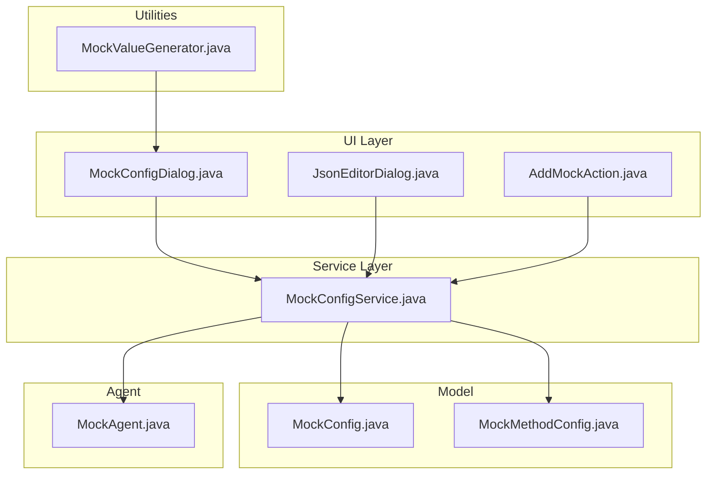
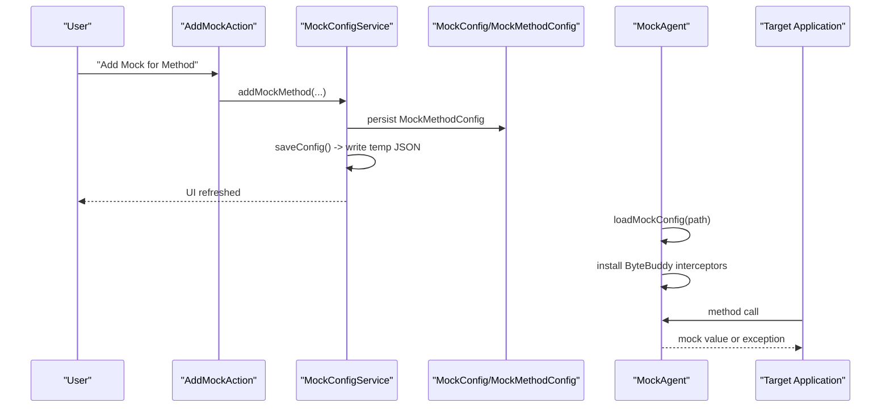
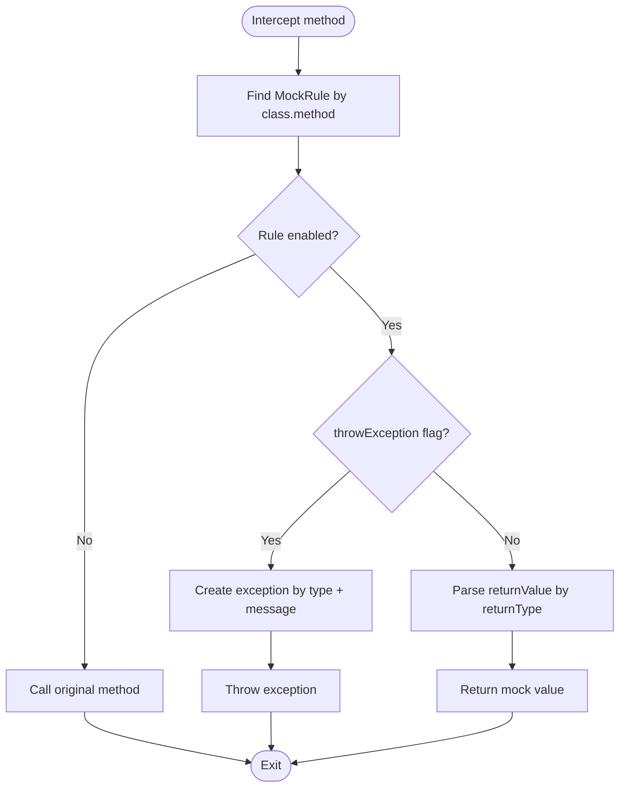
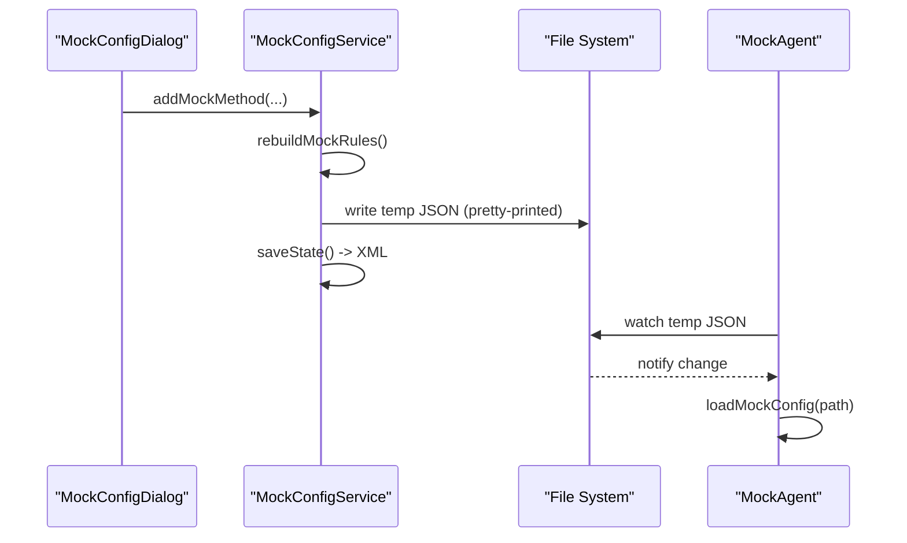
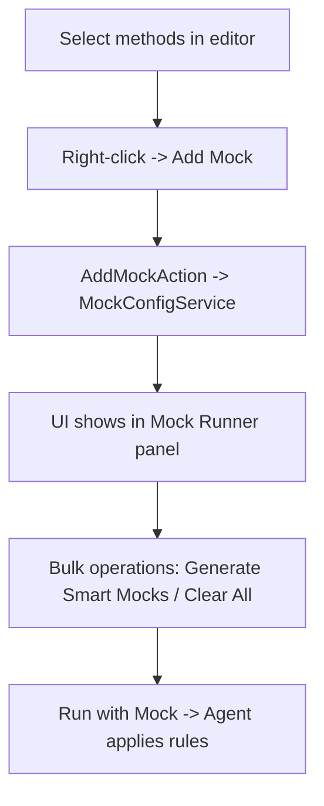
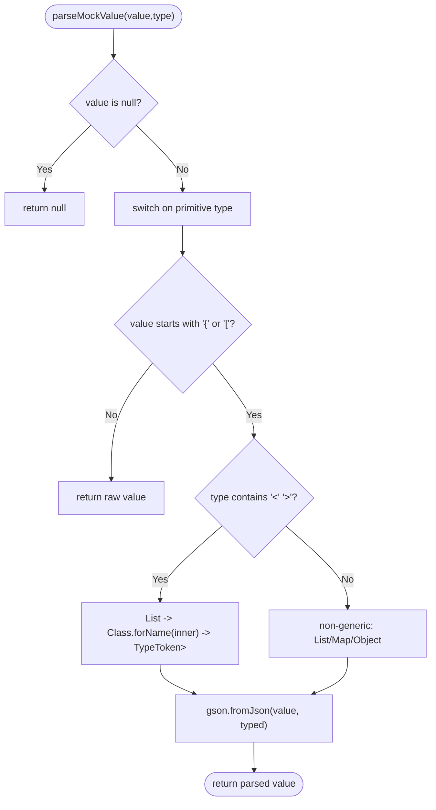
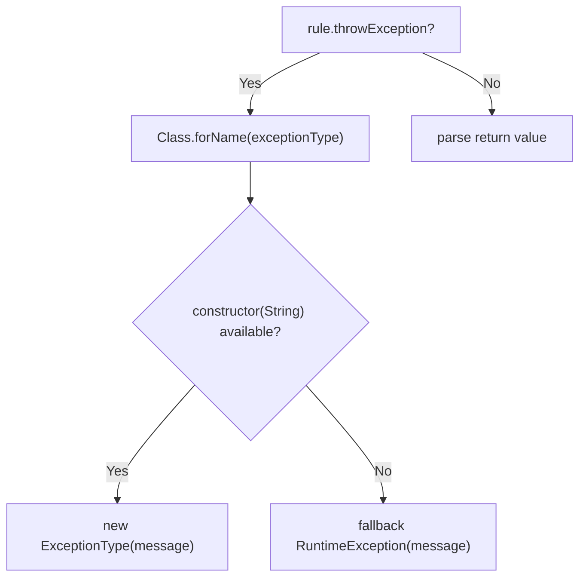
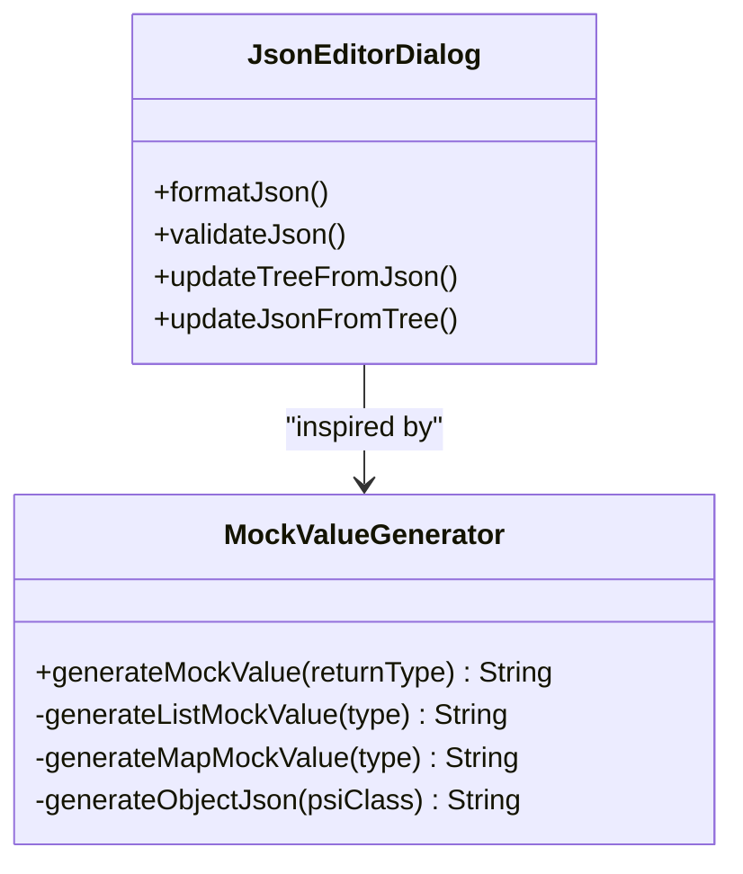
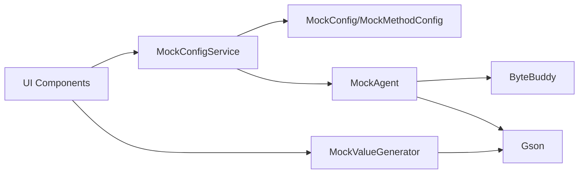

# Advanced Features

<cite>
**Referenced Files in This Document**
- [MOCK_RUNNER_README.md](file://MOCK_RUNNER_README.md)
- [README.md](file://README.md)
- [MockConfig.java](file://src/main/java/io/github/lancelothuxi/idea/plugin/mock/mock/MockConfig.java)
- [MockMethodConfig.java](file://src/main/java/io/github/lancelothuxi/idea/plugin/mock/mock/MockMethodConfig.java)
- [MockConfigService.java](file://src/main/java/io/github/lancelothuxi/idea/plugin/mock/service/MockConfigService.java)
- [MockAgent.java](file://src/main/java/io/github/lancelothuxi/idea/plugin/mock/agent/MockAgent.java)
- [MockConfigDialog.java](file://src/main/java/io/github/lancelothuxi/idea/plugin/mock/ui/MockConfigDialog.java)
- [JsonEditorDialog.java](file://src/main/java/io/github/lancelothuxi/idea/plugin/mock/ui/JsonEditorDialog.java)
- [MockValueGenerator.java](file://src/main/java/io/github/lancelothuxi/idea/plugin/mock/util/MockValueGenerator.java)
- [AddMockAction.java](file://src/main/java/io/github/lancelothuxi/idea/plugin/mock/action/AddMockAction.java)
- [MOCK_PERSISTENCE_GUIDE.md](file://docs/MOCK_PERSISTENCE_GUIDE.md)
- [MOCK_WORKFLOW_GUIDE.md](file://docs/MOCK_WORKFLOW_GUIDE.md)
- [ExceptionMockingTest.java](file://src/test/java/test/ExceptionMockingTest.java)
</cite>

## Table of Contents
1. [Introduction](#introduction)
2. [Project Structure](#project-structure)
3. [Core Components](#core-components)
4. [Architecture Overview](#architecture-overview)
5. [Detailed Component Analysis](#detailed-component-analysis)
6. [Dependency Analysis](#dependency-analysis)
7. [Performance Considerations](#performance-considerations)
8. [Troubleshooting Guide](#troubleshooting-guide)
9. [Conclusion](#conclusion)
10. [Appendices](#appendices)

## Introduction
This document provides expert-level documentation for Mock Runner’s advanced features and capabilities. It covers exception mocking (custom exception types, parameterized exceptions, and chaining scenarios), the persistent configuration system (XML serialization, version control integration, and team collaboration), advanced mock workflow patterns (bulk operations and configuration templates), generic type support (complex nested generics, type resolution, and collection handling), performance optimization and memory management, debugging capabilities, expert usage patterns, CI/CD integration, and advanced troubleshooting methodologies.

## Project Structure
The plugin is organized around a UI-driven configuration system, a persistent service layer, a JavaAgent for runtime interception, and utilities for value generation and JSON editing. Key areas:
- UI: Mock configuration dialogs, JSON editor, and tool window content
- Service: Persistent state management and synchronization
- Agent: Runtime interception and mock application
- Utilities: Value generation and logging

**Diagram sources**
- [MockConfigDialog.java](file://src/main/java/io/github/lancelothuxi/idea/plugin/mock/ui/MockConfigDialog.java#L1-L293)
- [JsonEditorDialog.java](file://src/main/java/io/github/lancelothuxi/idea/plugin/mock/ui/JsonEditorDialog.java#L1-L286)
- [AddMockAction.java](file://src/main/java/io/github/lancelothuxi/idea/plugin/mock/action/AddMockAction.java#L1-L106)
- [MockConfigService.java](file://src/main/java/io/github/lancelothuxi/idea/plugin/mock/service/MockConfigService.java#L1-L197)
- [MockConfig.java](file://src/main/java/io/github/lancelothuxi/idea/plugin/mock/mock/MockConfig.java#L1-L218)
- [MockMethodConfig.java](file://src/main/java/io/github/lancelothuxi/idea/plugin/mock/mock/MockMethodConfig.java#L1-L94)
- [MockAgent.java](file://src/main/java/io/github/lancelothuxi/idea/plugin/mock/agent/MockAgent.java#L1-L400)
- [MockValueGenerator.java](file://src/main/java/io/github/lancelothuxi/idea/plugin/mock/util/MockValueGenerator.java#L1-L289)

**Section sources**
- [MOCK_RUNNER_README.md](file://MOCK_RUNNER_README.md#L1-L192)
- [README.md](file://README.md#L1-L296)

## Core Components
- Mock configuration model: stores method-level rules and supports exception mode alongside return values.
- Persistent service: serializes configuration to XML, writes temporary JSON for agent reload, and updates UI.
- JavaAgent: loads configuration, watches for changes, and intercepts method calls to return mock values or throw exceptions.
- UI and utilities: provide visual configuration, JSON editing, and smart mock value generation.

**Section sources**
- [MockConfig.java](file://src/main/java/io/github/lancelothuxi/idea/plugin/mock/mock/MockConfig.java#L1-L218)
- [MockMethodConfig.java](file://src/main/java/io/github/lancelothuxi/idea/plugin/mock/mock/MockMethodConfig.java#L1-L94)
- [MockConfigService.java](file://src/main/java/io/github/lancelothuxi/idea/plugin/mock/service/MockConfigService.java#L1-L197)
- [MockAgent.java](file://src/main/java/io/github/lancelothuxi/idea/plugin/mock/agent/MockAgent.java#L1-L400)
- [MockValueGenerator.java](file://src/main/java/io/github/lancelothuxi/idea/plugin/mock/util/MockValueGenerator.java#L1-L289)

## Architecture Overview
The system integrates UI actions, persistent storage, and a JavaAgent for runtime behavior modification. The flow:
- User adds mocks via UI actions or dialogs
- Service persists configuration to XML and writes a temporary JSON for the agent
- Agent loads configuration, sets up ByteBuddy interceptors, and applies mocks during runtime
- UI updates reflect configuration changes and agent activity

**Diagram sources**
- [AddMockAction.java](file://src/main/java/io/github/lancelothuxi/idea/plugin/mock/action/AddMockAction.java#L1-L106)
- [MockConfigService.java](file://src/main/java/io/github/lancelothuxi/idea/plugin/mock/service/MockConfigService.java#L1-L197)
- [MockConfig.java](file://src/main/java/io/github/lancelothuxi/idea/plugin/mock/mock/MockConfig.java#L1-L218)
- [MockAgent.java](file://src/main/java/io/github/lancelothuxi/idea/plugin/mock/agent/MockAgent.java#L1-L400)

## Detailed Component Analysis

### Exception Mocking
Exception mocking supports:
- Custom exception types (fully qualified class names)
- Parameterized messages
- Exception chaining scenarios (agent constructs exceptions via constructor with message)

Key behaviors:
- Rule encapsulation includes exception flags and metadata
- Agent checks rule.isThrowException() and constructs exceptions dynamically
- Fallback to a default exception if instantiation fails

**Diagram sources**
- [MockAgent.java](file://src/main/java/io/github/lancelothuxi/idea/plugin/mock/agent/MockAgent.java#L202-L339)
- [MockConfig.java](file://src/main/java/io/github/lancelothuxi/idea/plugin/mock/mock/MockConfig.java#L144-L216)

**Section sources**
- [MockConfig.java](file://src/main/java/io/github/lancelothuxi/idea/plugin/mock/mock/MockConfig.java#L144-L216)
- [MockAgent.java](file://src/main/java/io/github/lancelothuxi/idea/plugin/mock/agent/MockAgent.java#L202-L339)
- [ExceptionMockingTest.java](file://src/test/java/test/ExceptionMockingTest.java)

### Persistent Configuration System
The service uses IntelliJ’s PersistentStateComponent to serialize configuration to XML and maintains a temporary JSON for agent hot reload:
- XML persistence: project-scoped file under .idea
- Temporary JSON: written to a temp directory for agent watcher
- Auto-save/load on add/remove/clear and project open/close
- UI synchronization via tool window refresh and editor daemon restart

**Diagram sources**
- [MockConfigService.java](file://src/main/java/io/github/lancelothuxi/idea/plugin/mock/service/MockConfigService.java#L41-L96)
- [MOCK_PERSISTENCE_GUIDE.md](file://docs/MOCK_PERSISTENCE_GUIDE.md#L1-L101)

**Section sources**
- [MockConfigService.java](file://src/main/java/io/github/lancelothuxi/idea/plugin/mock/service/MockConfigService.java#L1-L197)
- [MOCK_PERSISTENCE_GUIDE.md](file://docs/MOCK_PERSISTENCE_GUIDE.md#L1-L101)

### Advanced Mock Workflow Patterns
- Bulk operations: “Generate Smart Mocks” populates values for selected rows; “Clear All” resets selections and values
- Configuration templates: JSON editor supports structured editing and validation; smart generator produces representative values
- Workflow integration: right-click actions, gutter icons, and tool window centralization streamline mock creation and inspection

**Diagram sources**
- [AddMockAction.java](file://src/main/java/io/github/lancelothuxi/idea/plugin/mock/action/AddMockAction.java#L1-L106)
- [MockConfigDialog.java](file://src/main/java/io/github/lancelothuxi/idea/plugin/mock/ui/MockConfigDialog.java#L1-L293)
- [MOCK_WORKFLOW_GUIDE.md](file://docs/MOCK_WORKFLOW_GUIDE.md#L1-L132)

**Section sources**
- [MockConfigDialog.java](file://src/main/java/io/github/lancelothuxi/idea/plugin/mock/ui/MockConfigDialog.java#L1-L293)
- [MockValueGenerator.java](file://src/main/java/io/github/lancelothuxi/idea/plugin/mock/util/MockValueGenerator.java#L1-L289)
- [MOCK_WORKFLOW_GUIDE.md](file://docs/MOCK_WORKFLOW_GUIDE.md#L1-L132)

### Generic Type Support and Collection Handling
The agent parses mock values with awareness of generic types:
- Detects generic signatures (e.g., List<SomeClass>) and resolves inner types
- Uses reflection and Gson with TypeToken to deserialize into strongly-typed collections
- Falls back gracefully for unknown classes or non-generic types

**Diagram sources**
- [MockAgent.java](file://src/main/java/io/github/lancelothuxi/idea/plugin/mock/agent/MockAgent.java#L246-L326)

**Section sources**
- [MockAgent.java](file://src/main/java/io/github/lancelothuxi/idea/plugin/mock/agent/MockAgent.java#L246-L326)

### Exception Chaining Scenarios
The agent supports exception chaining by constructing exceptions with message parameters. If the specified exception class cannot be instantiated, it falls back to a default exception type. This ensures robustness while enabling realistic error simulation.

**Diagram sources**
- [MockAgent.java](file://src/main/java/io/github/lancelothuxi/idea/plugin/mock/agent/MockAgent.java#L328-L338)

**Section sources**
- [MockAgent.java](file://src/main/java/io/github/lancelothuxi/idea/plugin/mock/agent/MockAgent.java#L328-L338)

### JSON Editor and Smart Mock Generation
- JSON editor supports tree-view editing, formatting, validation, and synchronization hints
- Smart mock generation creates representative values based on PSI types, including collections and nested objects

**Diagram sources**
- [JsonEditorDialog.java](file://src/main/java/io/github/lancelothuxi/idea/plugin/mock/ui/JsonEditorDialog.java#L1-L286)
- [MockValueGenerator.java](file://src/main/java/io/github/lancelothuxi/idea/plugin/mock/util/MockValueGenerator.java#L1-L289)

**Section sources**
- [JsonEditorDialog.java](file://src/main/java/io/github/lancelothuxi/idea/plugin/mock/ui/JsonEditorDialog.java#L1-L286)
- [MockValueGenerator.java](file://src/main/java/io/github/lancelothuxi/idea/plugin/mock/util/MockValueGenerator.java#L1-L289)

## Dependency Analysis
The system exhibits clear separation of concerns:
- UI depends on service and model
- Service depends on model and Gson for serialization
- Agent depends on model and Gson for deserialization and ByteBuddy for interception
- Utilities depend on PSI and Gson

**Diagram sources**
- [MockConfigService.java](file://src/main/java/io/github/lancelothuxi/idea/plugin/mock/service/MockConfigService.java#L1-L197)
- [MockConfig.java](file://src/main/java/io/github/lancelothuxi/idea/plugin/mock/mock/MockConfig.java#L1-L218)
- [MockAgent.java](file://src/main/java/io/github/lancelothuxi/idea/plugin/mock/agent/MockAgent.java#L1-L400)
- [MockValueGenerator.java](file://src/main/java/io/github/lancelothuxi/idea/plugin/mock/util/MockValueGenerator.java#L1-L289)

**Section sources**
- [MockConfigService.java](file://src/main/java/io/github/lancelothuxi/idea/plugin/mock/service/MockConfigService.java#L1-L197)
- [MockAgent.java](file://src/main/java/io/github/lancelothuxi/idea/plugin/mock/agent/MockAgent.java#L1-L400)

## Performance Considerations
- Minimal overhead: agent only installs interceptors for classes with configured rules
- Lazy deserialization: Gson parsing occurs only when intercepting matched methods
- Efficient watchers: agent polls configuration file changes at intervals
- Memory management: temporary JSON is written once per change; avoid excessive rule churn
- UI responsiveness: UI refreshes are scheduled off the EDT where appropriate

[No sources needed since this section provides general guidance]

## Troubleshooting Guide
Common issues and resolutions:
- Agent not loading: verify the agent path and that the configuration file path is passed to the agent
- No mock rules applied: confirm rules are enabled and the class/method signature matches
- Generic parsing failures: ensure return type strings match actual classes on the classpath
- JSON editor validation errors: use the validator and formatter buttons to correct syntax
- Persistence not syncing: check XML file presence and permissions; ensure project reopen triggers load

**Section sources**
- [MockAgent.java](file://src/main/java/io/github/lancelothuxi/idea/plugin/mock/agent/MockAgent.java#L147-L200)
- [MockConfigService.java](file://src/main/java/io/github/lancelothuxi/idea/plugin/mock/service/MockConfigService.java#L75-L96)
- [JsonEditorDialog.java](file://src/main/java/io/github/lancelothuxi/idea/plugin/mock/ui/JsonEditorDialog.java#L203-L210)

## Conclusion
Mock Runner’s advanced features combine robust exception mocking, persistent configuration, sophisticated generic type handling, and a polished UI workflow. The architecture balances flexibility and performance, enabling expert workflows, team collaboration via version control, and reliable CI/CD integration.

[No sources needed since this section summarizes without analyzing specific files]

## Appendices

### Expert Usage Patterns
- Team collaboration: commit the XML configuration file to share mocks across developers
- CI/CD integration: pass the configuration path to the agent via JVM arguments; ensure the temp JSON is regenerated before runs
- Advanced debugging: leverage agent logs, UI tool window, and JSON editor validation to isolate issues

**Section sources**
- [MOCK_PERSISTENCE_GUIDE.md](file://docs/MOCK_PERSISTENCE_GUIDE.md#L81-L101)
- [README.md](file://README.md#L205-L213)