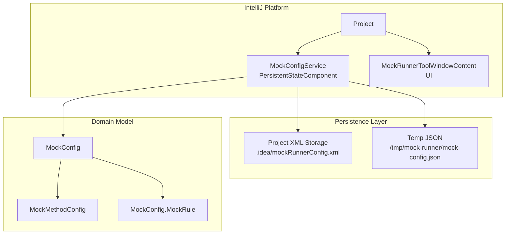
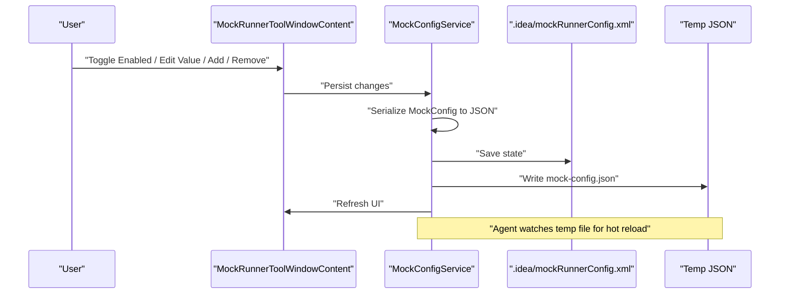
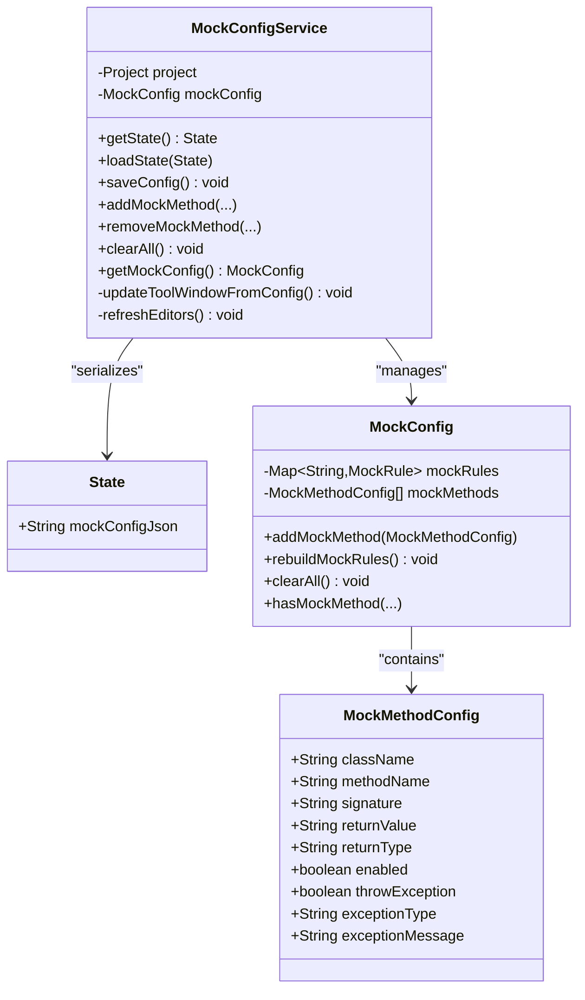
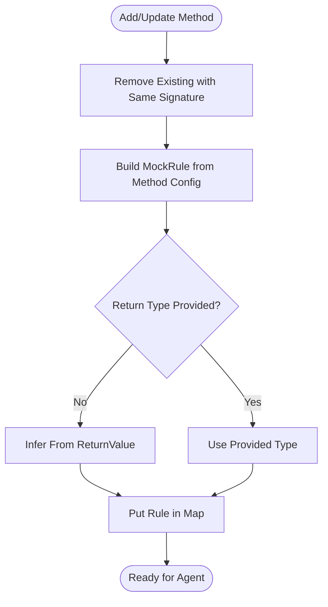
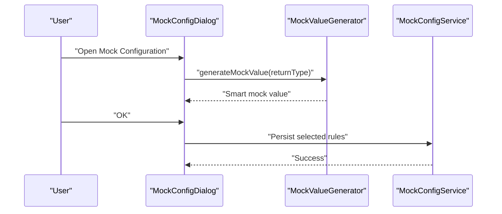
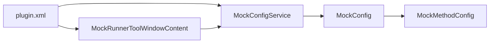

# Configuration Persistence

<cite>
**Referenced Files in This Document**
- [MOCK_PERSISTENCE_GUIDE.md](file://docs/MOCK_PERSISTENCE_GUIDE.md)
- [MOCK_RUNNER_UPDATES.md](file://docs/MOCK_RUNNER_UPDATES.md)
- [MockConfigService.java](file://src/main/java/io/github/lancelothuxi/idea/plugin/mock/service/MockConfigService.java)
- [MockConfig.java](file://src/main/java/io/github/lancelothuxi/idea/plugin/mock/mock/MockConfig.java)
- [MockMethodConfig.java](file://src/main/java/io/github/lancelothuxi/idea/plugin/mock/mock/MockMethodConfig.java)
- [MockRunnerToolWindowContent.java](file://src/main/java/io/github/lancelothuxi/idea/plugin/mock/ui/MockRunnerToolWindowContent.java)
- [MockConfigDialog.java](file://src/main/java/io/github/lancelothuxi/idea/plugin/mock/ui/MockConfigDialog.java)
- [MockValueGenerator.java](file://src/main/java/io/github/lancelothuxi/idea/plugin/mock/util/MockValueGenerator.java)
- [JsonEditorDialog.java](file://src/main/java/io/github/lancelothuxi/idea/plugin/mock/ui/JsonEditorDialog.java)
- [plugin.xml](file://src/main/resources/META-INF/plugin.xml)
</cite>

## Table of Contents
1. [Introduction](#introduction)
2. [Project Structure](#project-structure)
3. [Core Components](#core-components)
4. [Architecture Overview](#architecture-overview)
5. [Detailed Component Analysis](#detailed-component-analysis)
6. [Dependency Analysis](#dependency-analysis)
7. [Performance Considerations](#performance-considerations)
8. [Troubleshooting Guide](#troubleshooting-guide)
9. [Conclusion](#conclusion)
10. [Appendices](#appendices)

## Introduction
This document explains Mock Runner’s configuration persistence system. It covers how mock configurations are serialized and stored, where files are located, how state is managed and synchronized with the UI, and how version control integrates with the persistence model. It also documents collaboration workflows, sharing strategies, conflict resolution, backup and restore procedures, migration between projects, templates, and best practices for organizing complex configurations at scale.

## Project Structure
The persistence system centers around a project-scoped service that implements IntelliJ Platform persistence via a dedicated state component. Configuration is persisted to a project-level XML file under the IDE metadata directory and is automatically loaded when the project opens. A secondary temporary JSON file supports live reload for the Java agent.

**Diagram sources**
- [MockConfigService.java](file://src/main/java/io/github/lancelothuxi/idea/plugin/mock/service/MockConfigService.java#L19-L22)
- [plugin.xml](file://src/main/resources/META-INF/plugin.xml#L35-L37)

**Section sources**
- [MOCK_PERSISTENCE_GUIDE.md](file://docs/MOCK_PERSISTENCE_GUIDE.md#L18-L21)
- [plugin.xml](file://src/main/resources/META-INF/plugin.xml#L35-L37)

## Core Components
- MockConfigService: Implements persistent state for mock configurations, serializes to XML, and writes a temporary JSON for agent hot reload. It updates the UI after load and exposes CRUD operations for mock methods.
- MockConfig: Holds the in-memory configuration model with two collections: a list of method configs and a map of compiled rules for the agent.
- MockMethodConfig: Serializable DTO representing a single mocked method with return value, exception behavior, and enablement flag.
- MockRunnerToolWindowContent: UI service that displays, edits, filters, paginates, and persists mock configurations.
- MockConfigDialog and JsonEditorDialog: UI dialogs for bulk configuration and JSON editing with validation and formatting.
- MockValueGenerator: Utility to generate smart mock values based on PSI return types.

**Section sources**
- [MockConfigService.java](file://src/main/java/io/github/lancelothuxi/idea/plugin/mock/service/MockConfigService.java#L23-L35)
- [MockConfig.java](file://src/main/java/io/github/lancelothuxi/idea/plugin/mock/mock/MockConfig.java#L12-L218)
- [MockMethodConfig.java](file://src/main/java/io/github/lancelothuxi/idea/plugin/mock/mock/MockMethodConfig.java#L5-L94)
- [MockRunnerToolWindowContent.java](file://src/main/java/io/github/lancelothuxi/idea/plugin/mock/ui/MockRunnerToolWindowContent.java#L22-L160)
- [MockConfigDialog.java](file://src/main/java/io/github/lancelothuxi/idea/plugin/mock/ui/MockConfigDialog.java#L27-L108)
- [JsonEditorDialog.java](file://src/main/java/io/github/lancelothuxi/idea/plugin/mock/ui/JsonEditorDialog.java#L22-L67)
- [MockValueGenerator.java](file://src/main/java/io/github/lancelothuxi/idea/plugin/mock/util/MockValueGenerator.java#L13-L25)

## Architecture Overview
The persistence architecture follows IntelliJ Platform conventions:
- Project-level service registered in plugin.xml
- PersistentStateComponent with XML storage under .idea
- Automatic save/load lifecycle integrated with project events
- UI synchronization via service callbacks and daemon restarts
- Temporary JSON for agent-side hot reload

**Diagram sources**
- [MockConfigService.java](file://src/main/java/io/github/lancelothuxi/idea/plugin/mock/service/MockConfigService.java#L41-L58)
- [MockRunnerToolWindowContent.java](file://src/main/java/io/github/lancelothuxi/idea/plugin/mock/ui/MockRunnerToolWindowContent.java#L110-L122)
- [MOCK_PERSISTENCE_GUIDE.md](file://docs/MOCK_PERSISTENCE_GUIDE.md#L23-L31)

## Detailed Component Analysis

### MockConfigService: State Management, Change Detection, and Automatic Persistence
- State contract: Implements PersistentStateComponent with a nested State class holding a JSON string of the configuration.
- Serialization: Uses Gson to convert MockConfig to/from JSON for XML storage.
- Lifecycle hooks:
  - Save: Called by IntelliJ Platform when project state is saved; logs and persists to XML.
  - Load: Called on project open and service initialization; reconstructs MockConfig, rebuilds rules, and refreshes UI.
- Change detection and UI sync:
  - addMockMethod/removeMockMethod/clearAll trigger UI refresh and editor marker updates.
  - rebuildMockRules ensures the internal rule map matches the method list after load.
- Temporary JSON persistence:
  - Writes a pretty-printed JSON to a temp directory for agent hot reload.
  - Ensures directory creation and handles exceptions with logging.

**Diagram sources**
- [MockConfigService.java](file://src/main/java/io/github/lancelothuxi/idea/plugin/mock/service/MockConfigService.java#L61-L96)
- [MockConfig.java](file://src/main/java/io/github/lancelothuxi/idea/plugin/mock/mock/MockConfig.java#L12-L86)
- [MockMethodConfig.java](file://src/main/java/io/github/lancelothuxi/idea/plugin/mock/mock/MockMethodConfig.java#L5-L94)

**Section sources**
- [MockConfigService.java](file://src/main/java/io/github/lancelothuxi/idea/plugin/mock/service/MockConfigService.java#L19-L96)
- [MOCK_PERSISTENCE_GUIDE.md](file://docs/MOCK_PERSISTENCE_GUIDE.md#L23-L31)

### MockConfig and MockMethodConfig: Data Model and Rule Compilation
- MockConfig stores:
  - A list of MockMethodConfig entries.
  - A map of MockRule keyed by “fullyQualifiedClass.method” for agent consumption.
- Rule compilation:
  - addMockMethod removes duplicates and adds a corresponding MockRule.
  - rebuildMockRules reconstitutes the rule map from the method list after load.
- ReturnType inference:
  - If explicit return type is missing, inference derives a type from the return value string.

**Diagram sources**
- [MockConfig.java](file://src/main/java/io/github/lancelothuxi/idea/plugin/mock/mock/MockConfig.java#L33-L86)

**Section sources**
- [MockConfig.java](file://src/main/java/io/github/lancelothuxi/idea/plugin/mock/mock/MockConfig.java#L12-L142)

### UI Integration: MockRunnerToolWindowContent and Dialogs
- MockRunnerToolWindowContent:
  - Loads configuration from service, supports filtering, pagination, global enable/disable, and dirty-state tracking.
  - Saves via service and refreshes UI and editors.
- MockConfigDialog:
  - Scans project classes/methods, pre-fills mock values, supports bulk generation and clearing.
  - Converts table rows into MockConfig rules on OK.
- JsonEditorDialog:
  - Provides a split-pane editor with tree visualization and JSON formatting/validation.
- MockValueGenerator:
  - Generates realistic mock values based on PSI return types, including primitives, collections, arrays, and complex objects.

**Diagram sources**
- [MockConfigDialog.java](file://src/main/java/io/github/lancelothuxi/idea/plugin/mock/ui/MockConfigDialog.java#L162-L210)
- [MockValueGenerator.java](file://src/main/java/io/github/lancelothuxi/idea/plugin/mock/util/MockValueGenerator.java#L18-L100)
- [MockConfigService.java](file://src/main/java/io/github/lancelothuxi/idea/plugin/mock/service/MockConfigService.java#L109-L151)

**Section sources**
- [MockRunnerToolWindowContent.java](file://src/main/java/io/github/lancelothuxi/idea/plugin/mock/ui/MockRunnerToolWindowContent.java#L166-L334)
- [MockConfigDialog.java](file://src/main/java/io/github/lancelothuxi/idea/plugin/mock/ui/MockConfigDialog.java#L110-L210)
- [JsonEditorDialog.java](file://src/main/java/io/github/lancelothuxi/idea/plugin/mock/ui/JsonEditorDialog.java#L193-L225)
- [MockValueGenerator.java](file://src/main/java/io/github/lancelothuxi/idea/plugin/mock/util/MockValueGenerator.java#L138-L192)

### Version Control Integration Patterns
- Project-level persistence:
  - The XML file resides under .idea, enabling per-project version control.
  - Team members can commit and share mock configurations across the project.
- Automatic synchronization:
  - On project open, configurations are loaded automatically.
  - On changes, state is saved immediately to XML and to the temp JSON for agent hot reload.
- Best practices:
  - Commit .idea/mockRunnerConfig.xml to keep team configurations synchronized.
  - Treat mock configurations as part of the project’s testing assets.

**Section sources**
- [MOCK_PERSISTENCE_GUIDE.md](file://docs/MOCK_PERSISTENCE_GUIDE.md#L83-L85)
- [MOCK_PERSISTENCE_GUIDE.md](file://docs/MOCK_PERSISTENCE_GUIDE.md#L29-L31)

### Team Collaboration Workflows, Sharing, and Conflict Resolution
- Workflow:
  - One developer adds or modifies mocks in the UI; changes persist automatically.
  - Teammates pull the latest version; on project open, their local configuration is overwritten by the committed XML.
- Sharing strategies:
  - Commit .idea/mockRunnerConfig.xml to the repository.
  - Use branches to maintain environment-specific configurations if needed.
- Conflict resolution:
  - When conflicts occur in the XML, resolve by accepting the merged version and re-running tests to confirm mock behavior.
  - Prefer incremental changes and small commits to reduce merge conflicts.

**Section sources**
- [MOCK_PERSISTENCE_GUIDE.md](file://docs/MOCK_PERSISTENCE_GUIDE.md#L83-L85)

### Backup and Restore Procedures
- Backup:
  - Copy .idea/mockRunnerConfig.xml to a safe location.
- Restore:
  - Replace .idea/mockRunnerConfig.xml with the backed-up copy.
  - Reopen the project; configurations will be loaded automatically.
- Migration between projects:
  - Copy .idea/mockRunnerConfig.xml into another project’s .idea folder.
  - Open the target project; configurations will be loaded.

**Section sources**
- [MOCK_PERSISTENCE_GUIDE.md](file://docs/MOCK_PERSISTENCE_GUIDE.md#L87-L93)

### Configuration Template Systems
- Bulk configuration:
  - Use MockConfigDialog to scan project methods and generate smart mock values for eligible methods.
- JSON templates:
  - Use JsonEditorDialog to author structured return values and copy/paste them across methods.
- Organizing templates:
  - Group similar methods by feature area and apply templates in batches.
  - Keep frequently used return values in the JSON editor for reuse.

**Section sources**
- [MockConfigDialog.java](file://src/main/java/io/github/lancelothuxi/idea/plugin/mock/ui/MockConfigDialog.java#L162-L183)
- [JsonEditorDialog.java](file://src/main/java/io/github/lancelothuxi/idea/plugin/mock/ui/JsonEditorDialog.java#L193-L225)

### Best Practices for Large-Scale Usage
- Naming conventions:
  - Use clear class and method names; avoid generic names that are hard to distinguish.
  - Keep signatures explicit when applicable to prevent ambiguity.
- Organization patterns:
  - Separate mock configurations by feature or domain.
  - Use global enable/disable to quickly toggle environments.
- Maintenance:
  - Regularly review and prune unused mock methods.
  - Use pagination and filtering to manage large lists.
  - Leverage smart mock value generation to reduce manual effort.

**Section sources**
- [MockRunnerToolWindowContent.java](file://src/main/java/io/github/lancelothuxi/idea/plugin/mock/ui/MockRunnerToolWindowContent.java#L173-L181)
- [MockValueGenerator.java](file://src/main/java/io/github/lancelothuxi/idea/plugin/mock/util/MockValueGenerator.java#L18-L100)

## Dependency Analysis
The service depends on the UI service and IntelliJ Platform APIs for persistence and UI updates. The UI depends on the service for data and on PSI for smart value generation.

**Diagram sources**
- [plugin.xml](file://src/main/resources/META-INF/plugin.xml#L35-L37)
- [MockConfigService.java](file://src/main/java/io/github/lancelothuxi/idea/plugin/mock/service/MockConfigService.java#L23-L35)
- [MockRunnerToolWindowContent.java](file://src/main/java/io/github/lancelothuxi/idea/plugin/mock/ui/MockRunnerToolWindowContent.java#L336-L338)

**Section sources**
- [plugin.xml](file://src/main/resources/META-INF/plugin.xml#L35-L37)

## Performance Considerations
- Serialization cost:
  - Gson serialization occurs on save and load; keep configurations reasonably sized.
- UI refresh:
  - Daemon restarts and table refreshes are triggered on changes; avoid excessive rapid toggles.
- Temporary file I/O:
  - Writing to temp JSON is lightweight but ensure the temp directory is writable.

[No sources needed since this section provides general guidance]

## Troubleshooting Guide
- State load failures:
  - If loading fails, the service resets to a clean MockConfig and logs an error.
- UI not updating:
  - Ensure ToolWindow is refreshed and DaemonCodeAnalyzer is restarted after changes.
- JSON validation errors:
  - Use JsonEditorDialog to format and validate JSON before saving.
- Conflicts in version control:
  - Resolve XML conflicts by merging and retesting.

**Section sources**
- [MockConfigService.java](file://src/main/java/io/github/lancelothuxi/idea/plugin/mock/service/MockConfigService.java#L76-L96)
- [MockRunnerToolWindowContent.java](file://src/main/java/io/github/lancelothuxi/idea/plugin/mock/ui/MockRunnerToolWindowContent.java#L312-L334)
- [JsonEditorDialog.java](file://src/main/java/io/github/lancelothuxi/idea/plugin/mock/ui/JsonEditorDialog.java#L193-L210)

## Conclusion
Mock Runner’s configuration persistence leverages IntelliJ Platform’s PersistentStateComponent to provide seamless, project-scoped persistence of mock configurations. The system automatically saves and loads configurations, synchronizes the UI, and supports team collaboration via version control. By following the recommended workflows, templates, and best practices, teams can efficiently manage complex mock setups at scale.

[No sources needed since this section summarizes without analyzing specific files]

## Appendices

### XML Storage Location and Format
- Storage location: .idea/mockRunnerConfig.xml
- Format: XML containing a component with a JSON string property for the configuration.

**Section sources**
- [MOCK_PERSISTENCE_GUIDE.md](file://docs/MOCK_PERSISTENCE_GUIDE.md#L18-L21)
- [MOCK_PERSISTENCE_GUIDE.md](file://docs/MOCK_PERSISTENCE_GUIDE.md#L46-L65)

### Auto-save and Auto-load Timings
- Auto-save:
  - After adding/removing/clearing mock methods and on project close.
- Auto-load:
  - On project open and service initialization.

**Section sources**
- [MOCK_PERSISTENCE_GUIDE.md](file://docs/MOCK_PERSISTENCE_GUIDE.md#L23-L31)