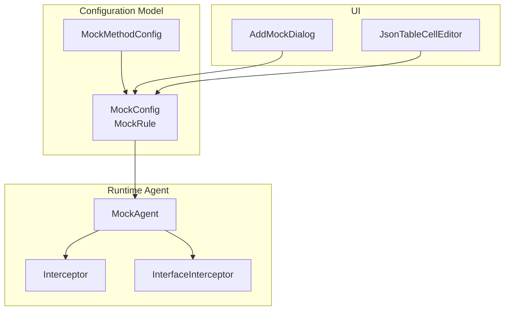
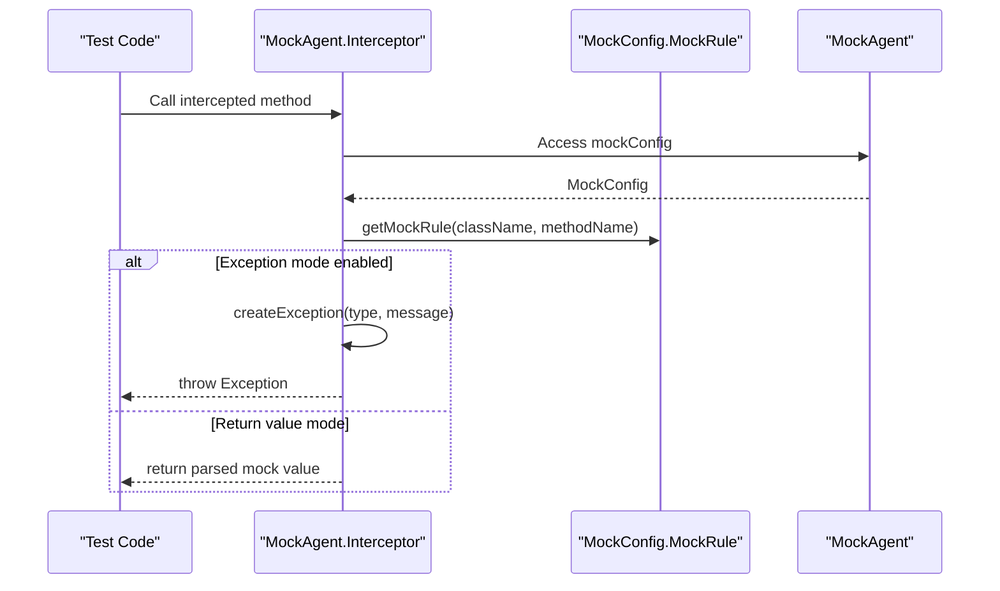
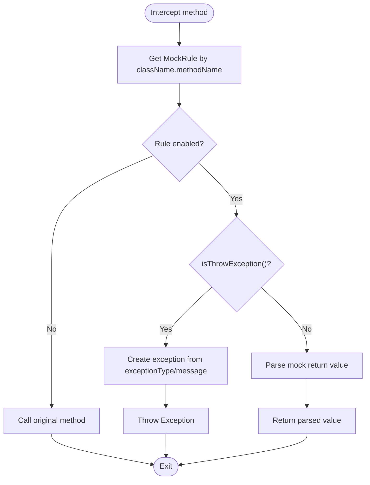
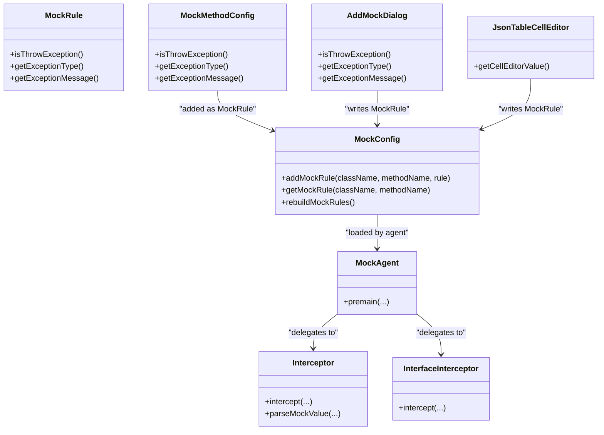

# Exception Mocking

<cite>
**Referenced Files in This Document**
- [ExceptionMockingTest.java](file://src/test/java/test/ExceptionMockingTest.java)
- [MockConfig.java](file://src/main/java/io/github/lancelothuxi/idea/plugin/mock/mock/MockConfig.java)
- [MockMethodConfig.java](file://src/main/java/io/github/lancelothuxi/idea/plugin/mock/mock/MockMethodConfig.java)
- [MockAgent.java](file://src/main/java/io/github/lancelothuxi/idea/plugin/mock/agent/MockAgent.java)
- [AddMockDialog.java](file://src/main/java/io/github/lancelothuxi/idea/plugin/mock/ui/AddMockDialog.java)
- [JsonTableCellEditor.java](file://src/main/java/io/github/lancelothuxi/idea/plugin/mock/ui/JsonTableCellEditor.java)
</cite>

## Table of Contents
1. [Introduction](#introduction)
2. [Project Structure](#project-structure)
3. [Core Components](#core-components)
4. [Architecture Overview](#architecture-overview)
5. [Detailed Component Analysis](#detailed-component-analysis)
6. [Dependency Analysis](#dependency-analysis)
7. [Performance Considerations](#performance-considerations)
8. [Troubleshooting Guide](#troubleshooting-guide)
9. [Conclusion](#conclusion)

## Introduction
This document explains Mock Runner’s exception mocking capabilities. It covers how to configure and inject exceptions at runtime, including custom exception types, parameterized exceptions with constructor arguments, and fallback behaviors. It also documents the configuration interface, validation mechanisms, and runtime injection via the Java agent. Practical examples demonstrate configuring exceptions with specific messages, causes, and stack traces, along with best practices, performance implications, and debugging techniques.

## Project Structure
The exception mocking feature spans three layers:
- Configuration model: defines how exceptions are described and stored
- UI: provides editors to define exception type and message
- Runtime agent: loads configuration and injects exceptions during method interception

**Diagram sources**
- [MockConfig.java](file://src/main/java/io/github/lancelothuxi/idea/plugin/mock/mock/MockConfig.java#L1-L218)
- [MockMethodConfig.java](file://src/main/java/io/github/lancelothuxi/idea/plugin/mock/mock/MockMethodConfig.java#L1-L94)
- [AddMockDialog.java](file://src/main/java/io/github/lancelothuxi/idea/plugin/mock/ui/AddMockDialog.java#L1-L184)
- [JsonTableCellEditor.java](file://src/main/java/io/github/lancelothuxi/idea/plugin/mock/ui/JsonTableCellEditor.java#L1-L298)
- [MockAgent.java](file://src/main/java/io/github/lancelothuxi/idea/plugin/mock/agent/MockAgent.java#L1-L400)

**Section sources**
- [MockConfig.java](file://src/main/java/io/github/lancelothuxi/idea/plugin/mock/mock/MockConfig.java#L1-L218)
- [MockMethodConfig.java](file://src/main/java/io/github/lancelothuxi/idea/plugin/mock/mock/MockMethodConfig.java#L1-L94)
- [AddMockDialog.java](file://src/main/java/io/github/lancelothuxi/idea/plugin/mock/ui/AddMockDialog.java#L1-L184)
- [JsonTableCellEditor.java](file://src/main/java/io/github/lancelothuxi/idea/plugin/mock/ui/JsonTableCellEditor.java#L1-L298)
- [MockAgent.java](file://src/main/java/io/github/lancelothuxi/idea/plugin/mock/agent/MockAgent.java#L1-L400)

## Core Components
- MockConfig and MockRule: store per-method mock rules, including whether to throw an exception, the exception type, and the exception message.
- MockMethodConfig: serializable representation of a method-level mock configuration, including exception fields.
- AddMockDialog: UI dialog to capture mock value or enable exception mode with type and message.
- JsonTableCellEditor: inline editor for table cells supporting either JSON values or exception configurations.
- MockAgent: loads configuration and injects exceptions at runtime using ByteBuddy instrumentation.

Key exception-related attributes:
- isThrowException(): toggles exception mode
- exceptionType: FQCN of the exception class
- exceptionMessage: message passed to the exception constructor

**Section sources**
- [MockConfig.java](file://src/main/java/io/github/lancelothuxi/idea/plugin/mock/mock/MockConfig.java#L144-L216)
- [MockMethodConfig.java](file://src/main/java/io/github/lancelothuxi/idea/plugin/mock/mock/MockMethodConfig.java#L14-L16)
- [AddMockDialog.java](file://src/main/java/io/github/lancelothuxi/idea/plugin/mock/ui/AddMockDialog.java#L128-L182)
- [JsonTableCellEditor.java](file://src/main/java/io/github/lancelothuxi/idea/plugin/mock/ui/JsonTableCellEditor.java#L159-L261)
- [MockAgent.java](file://src/main/java/io/github/lancelothuxi/idea/plugin/mock/agent/MockAgent.java#L202-L398)

## Architecture Overview
The runtime flow for exception injection:
1. Configuration is loaded by the agent from a JSON file into MockConfig.
2. During method interception, the agent checks the rule for the target method.
3. If exception mode is enabled, the agent constructs an exception instance and throws it.
4. If not in exception mode, normal mock value handling proceeds.

**Diagram sources**
- [MockAgent.java](file://src/main/java/io/github/lancelothuxi/idea/plugin/mock/agent/MockAgent.java#L202-L338)
- [MockConfig.java](file://src/main/java/io/github/lancelothuxi/idea/plugin/mock/mock/MockConfig.java#L24-L27)

**Section sources**
- [MockAgent.java](file://src/main/java/io/github/lancelothuxi/idea/plugin/mock/agent/MockAgent.java#L202-L338)
- [MockConfig.java](file://src/main/java/io/github/lancelothuxi/idea/plugin/mock/mock/MockConfig.java#L19-L31)

## Detailed Component Analysis

### Exception Configuration Interface
- MockRule fields for exceptions:
  - isThrowException(): enables exception mode
  - exceptionType: fully qualified exception class name
  - exceptionMessage: message passed to the exception constructor
- MockMethodConfig mirrors these fields for UI-driven configuration.

Validation and defaults:
- UI disables exception fields when not in exception mode.
- Defaults for exceptionType and exceptionMessage are provided in the model.

Practical configuration examples (paths):
- Configure an exception with a specific type and message: [ExceptionMockingTest.java](file://src/test/java/test/ExceptionMockingTest.java#L20-L35)
- Toggle exception mode and set fields in UI: [AddMockDialog.java](file://src/main/java/io/github/lancelothuxi/idea/plugin/mock/ui/AddMockDialog.java#L128-L182)
- Edit exception configuration in table cell: [JsonTableCellEditor.java](file://src/main/java/io/github/lancelothuxi/idea/plugin/mock/ui/JsonTableCellEditor.java#L159-L261)

**Section sources**
- [MockConfig.java](file://src/main/java/io/github/lancelothuxi/idea/plugin/mock/mock/MockConfig.java#L144-L216)
- [MockMethodConfig.java](file://src/main/java/io/github/lancelothuxi/idea/plugin/mock/mock/MockMethodConfig.java#L14-L16)
- [AddMockDialog.java](file://src/main/java/io/github/lancelothuxi/idea/plugin/mock/ui/AddMockDialog.java#L128-L182)
- [JsonTableCellEditor.java](file://src/main/java/io/github/lancelothuxi/idea/plugin/mock/ui/JsonTableCellEditor.java#L159-L261)
- [ExceptionMockingTest.java](file://src/test/java/test/ExceptionMockingTest.java#L20-L35)

### Runtime Exception Injection
- The agent inspects the rule for the intercepted method.
- If exception mode is enabled, it constructs an exception using the configured type and message.
- The agent falls back to a generic RuntimeException if construction fails.

**Diagram sources**
- [MockAgent.java](file://src/main/java/io/github/lancelothuxi/idea/plugin/mock/agent/MockAgent.java#L202-L338)

**Section sources**
- [MockAgent.java](file://src/main/java/io/github/lancelothuxi/idea/plugin/mock/agent/MockAgent.java#L202-L338)

### Supported Exception Types and Serialization
- Exception type resolution:
  - The agent resolves the exception class by name and instantiates it with a single String constructor.
  - If resolution fails, it logs a warning and falls back to a RuntimeException.
- Serialization:
  - MockConfig and MockMethodConfig are serializable, enabling persistence and reload via the agent’s config watcher.

Notes:
- The current implementation constructs exceptions using a String message constructor.
- Checked exceptions are supported as long as the class name is resolvable and assignable from Exception.

**Section sources**
- [MockAgent.java](file://src/main/java/io/github/lancelothuxi/idea/plugin/mock/agent/MockAgent.java#L328-L338)
- [MockConfig.java](file://src/main/java/io/github/lancelothuxi/idea/plugin/mock/mock/MockConfig.java#L144-L216)
- [MockMethodConfig.java](file://src/main/java/io/github/lancelothuxi/idea/plugin/mock/mock/MockMethodConfig.java#L1-L94)

### Parameterized Exceptions and Constructor Arguments
- Current behavior:
  - Exceptions are constructed with a single String argument (message).
- Extensibility:
  - To support additional constructors, modify the exception creation logic to inspect constructors and select an appropriate overload.
  - Consider adding a field for constructor arguments in MockRule/MockMethodConfig and passing them to the creation method.

[No sources needed since this section provides general guidance]

### Exception Chaining Scenarios
- Cause propagation:
  - The current runtime creation method passes only the message to the exception constructor.
  - To support cause chaining, extend the configuration to include a cause type/message and instantiate with a two-argument constructor where applicable.
- Stack trace control:
  - Throwing a new exception preserves the original stack trace from the agent’s interception point.
  - If precise stack trace control is required, consider constructing the exception inside the target method or using a dedicated exception factory.

[No sources needed since this section provides general guidance]

### Validation Mechanisms
- UI validation:
  - The table cell editor prevents saving empty exception types.
  - The dialog disables exception fields when not in exception mode.
- Runtime validation:
  - The agent validates class resolution and falls back gracefully.
  - Logging captures failures and continues execution where appropriate.

**Section sources**
- [JsonTableCellEditor.java](file://src/main/java/io/github/lancelothuxi/idea/plugin/mock/ui/JsonTableCellEditor.java#L224-L243)
- [AddMockDialog.java](file://src/main/java/io/github/lancelothuxi/idea/plugin/mock/ui/AddMockDialog.java#L161-L166)
- [MockAgent.java](file://src/main/java/io/github/lancelothuxi/idea/plugin/mock/agent/MockAgent.java#L387-L397)

### Practical Examples
- Configure an exception with a specific message:
  - Set exceptionType and exceptionMessage in MockRule/MockMethodConfig.
  - See example setup in tests: [ExceptionMockingTest.java](file://src/test/java/test/ExceptionMockingTest.java#L20-L35)
- Verify exception injection:
  - Call the mocked method and assert the thrown exception type and message.
  - See assertion in tests: [ExceptionMockingTest.java](file://src/test/java/test/ExceptionMockingTest.java#L37-L47)

**Section sources**
- [ExceptionMockingTest.java](file://src/test/java/test/ExceptionMockingTest.java#L20-L47)
- [MockConfig.java](file://src/main/java/io/github/lancelothuxi/idea/plugin/mock/mock/MockConfig.java#L161-L167)

## Dependency Analysis
The exception mocking pipeline connects UI, configuration, and runtime agent components.

**Diagram sources**
- [MockConfig.java](file://src/main/java/io/github/lancelothuxi/idea/plugin/mock/mock/MockConfig.java#L1-L218)
- [MockMethodConfig.java](file://src/main/java/io/github/lancelothuxi/idea/plugin/mock/mock/MockMethodConfig.java#L1-L94)
- [AddMockDialog.java](file://src/main/java/io/github/lancelothuxi/idea/plugin/mock/ui/AddMockDialog.java#L1-L184)
- [JsonTableCellEditor.java](file://src/main/java/io/github/lancelothuxi/idea/plugin/mock/ui/JsonTableCellEditor.java#L1-L298)
- [MockAgent.java](file://src/main/java/io/github/lancelothuxi/idea/plugin/mock/agent/MockAgent.java#L1-L400)

**Section sources**
- [MockConfig.java](file://src/main/java/io/github/lancelothuxi/idea/plugin/mock/mock/MockConfig.java#L1-L218)
- [MockMethodConfig.java](file://src/main/java/io/github/lancelothuxi/idea/plugin/mock/mock/MockMethodConfig.java#L1-L94)
- [AddMockDialog.java](file://src/main/java/io/github/lancelothuxi/idea/plugin/mock/ui/AddMockDialog.java#L1-L184)
- [JsonTableCellEditor.java](file://src/main/java/io/github/lancelothuxi/idea/plugin/mock/ui/JsonTableCellEditor.java#L1-L298)
- [MockAgent.java](file://src/main/java/io/github/lancelothuxi/idea/plugin/mock/agent/MockAgent.java#L1-L400)

## Performance Considerations
- Instrumentation overhead:
  - ByteBuddy-based interception adds minimal overhead; only methods with active rules are transformed.
- Exception creation cost:
  - Reflection-based instantiation occurs only when a method throws an exception.
- Logging impact:
  - Excessive logging can degrade performance; adjust log levels in production environments.
- Configuration reload:
  - The agent watches the configuration file and reloads periodically; keep the polling interval reasonable.

[No sources needed since this section provides general guidance]

## Troubleshooting Guide
Common issues and resolutions:
- Exception type not found:
  - Ensure the exception class name is fully qualified and resolvable at runtime.
  - The agent falls back to a generic RuntimeException if resolution fails.
- Empty exception type in UI:
  - The table cell editor prevents saving invalid entries; correct the type and retry.
- No effect when exception mode is enabled:
  - Verify the rule is enabled and matches the exact method signature.
  - Confirm the agent is properly attached and the configuration file is loaded.

**Section sources**
- [MockAgent.java](file://src/main/java/io/github/lancelothuxi/idea/plugin/mock/agent/MockAgent.java#L387-L397)
- [JsonTableCellEditor.java](file://src/main/java/io/github/lancelothuxi/idea/plugin/mock/ui/JsonTableCellEditor.java#L224-L243)
- [MockConfig.java](file://src/main/java/io/github/lancelothuxi/idea/plugin/mock/mock/MockConfig.java#L19-L31)

## Conclusion
Mock Runner’s exception mocking provides a flexible, UI-backed mechanism to inject exceptions at runtime. By configuring exception type and message, developers can simulate failure scenarios effectively. The design supports custom exception hierarchies and can be extended to handle additional constructors and cause chaining. With careful validation and logging, exception mocking integrates smoothly into testing workflows.