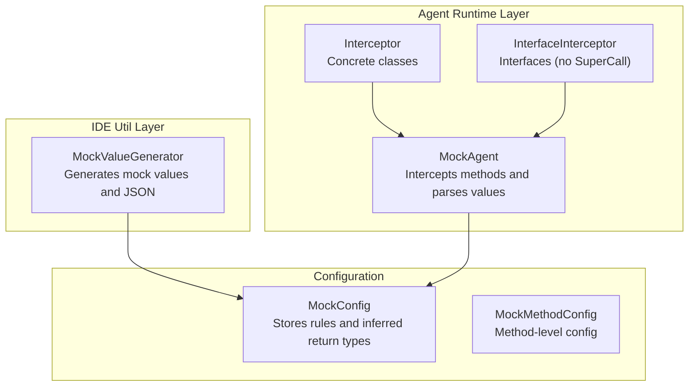
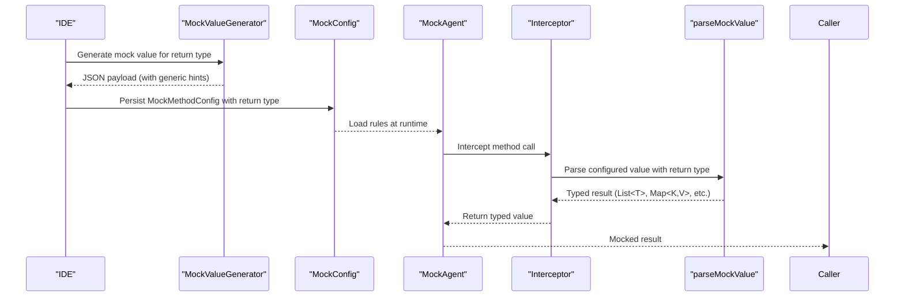
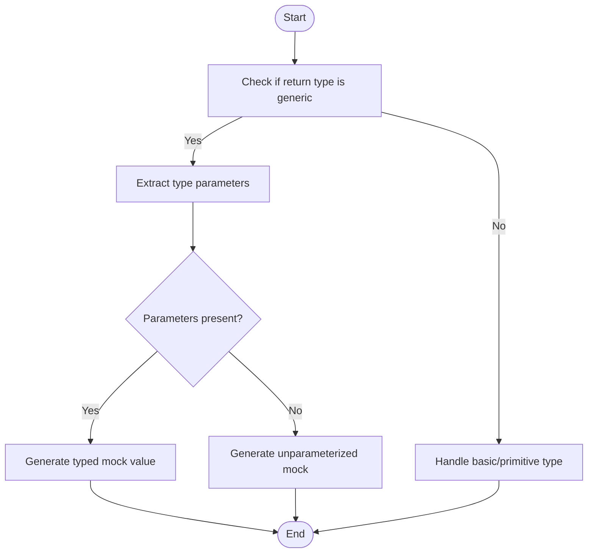
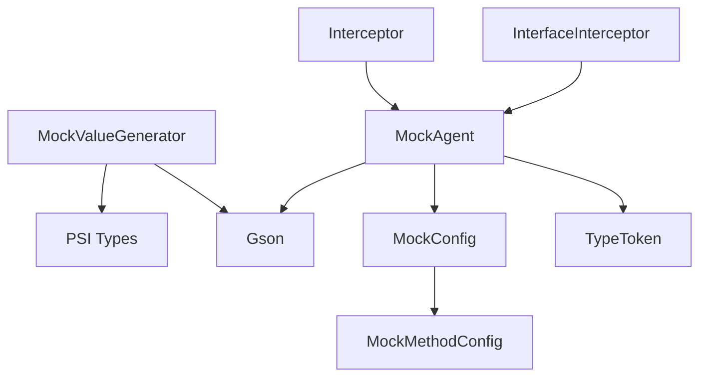

# Generic Type Support

<cite>
**Referenced Files in This Document**
- [MockValueGenerator.java](file://src/main/java/io/github/lancelothuxi/idea/plugin/mock/util/MockValueGenerator.java)
- [MockAgent.java](file://src/main/java/io/github/lancelothuxi/idea/plugin/mock/agent/MockAgent.java)
- [MockConfig.java](file://src/main/java/io/github/lancelothuxi/idea/plugin/mock/mock/MockConfig.java)
- [MockMethodConfig.java](file://src/main/java/io/github/lancelothuxi/idea/plugin/mock/mock/MockMethodConfig.java)
- [ARCHITECTURE_DIAGRAM.md](file://docs/ARCHITECTURE_DIAGRAM.md)
- [INTERFACE_MOCKING_SUMMARY.md](file://docs/INTERFACE_MOCKING_SUMMARY.md)
- [DYNAMIC_CLASS_MATCHING.md](file://docs/DYNAMIC_CLASS_MATCHING.md)
</cite>

## Table of Contents
1. [Introduction](#introduction)
2. [Project Structure](#project-structure)
3. [Core Components](#core-components)
4. [Architecture Overview](#architecture-overview)
5. [Detailed Component Analysis](#detailed-component-analysis)
6. [Dependency Analysis](#dependency-analysis)
7. [Performance Considerations](#performance-considerations)
8. [Troubleshooting Guide](#troubleshooting-guide)
9. [Conclusion](#conclusion)

## Introduction
This document explains Mock Runner’s advanced generic type support system. It covers how the system resolves generic type parameters at runtime, handles complex nested generics, and mocks collection types such as Lists, Maps, Sets, and custom generic containers. It also documents how wildcard types and type erasure scenarios are managed, along with bounded generics, multiple type parameters, and generic method return types. Practical examples illustrate mocking methods with complex return types, generic inheritance patterns, and type safety considerations.

## Project Structure
The generic type support spans two primary areas:
- Runtime value generation for return types and JSON serialization
- Agent-side parsing of mock values with awareness of generic signatures

**Diagram sources**
- [MockValueGenerator.java](file://src/main/java/io/github/lancelothuxi/idea/plugin/mock/util/MockValueGenerator.java#L18-L100)
- [MockAgent.java](file://src/main/java/io/github/lancelothuxi/idea/plugin/mock/agent/MockAgent.java#L202-L339)
- [MockConfig.java](file://src/main/java/io/github/lancelothuxi/idea/plugin/mock/mock/MockConfig.java#L19-L86)
- [MockMethodConfig.java](file://src/main/java/io/github/lancelothuxi/idea/plugin/mock/mock/MockMethodConfig.java#L18-L93)

**Section sources**
- [MockValueGenerator.java](file://src/main/java/io/github/lancelothuxi/idea/plugin/mock/util/MockValueGenerator.java#L18-L100)
- [MockAgent.java](file://src/main/java/io/github/lancelothuxi/idea/plugin/mock/agent/MockAgent.java#L202-L339)
- [MockConfig.java](file://src/main/java/io/github/lancelothuxi/idea/plugin/mock/mock/MockConfig.java#L19-L86)
- [MockMethodConfig.java](file://src/main/java/io/github/lancelothuxi/idea/plugin/mock/mock/MockMethodConfig.java#L18-L93)

## Core Components
- MockValueGenerator: Generates mock values for return types and serializes them to JSON. Handles generic collections (Lists, Maps, Sets) and custom objects, including nested structures and recursion prevention.
- MockAgent: Intercepts method calls and parses configured mock values. Supports generic types via reflection and Gson TypeToken to reconstruct typed collections.
- MockConfig and MockMethodConfig: Store and manage mock rules, including explicit return types and inferred types from JSON payloads.

Key responsibilities:
- Resolve generic type parameters at runtime for collections and custom objects
- Manage type erasure by leveraging raw type information and class metadata
- Support bounded generics and multiple type parameters via parameter extraction
- Provide robust fallbacks for unknown or missing classes during parsing

**Section sources**
- [MockValueGenerator.java](file://src/main/java/io/github/lancelothuxi/idea/plugin/mock/util/MockValueGenerator.java#L102-L136)
- [MockAgent.java](file://src/main/java/io/github/lancelothuxi/idea/plugin/mock/agent/MockAgent.java#L246-L326)
- [MockConfig.java](file://src/main/java/io/github/lancelothuxi/idea/plugin/mock/mock/MockConfig.java#L88-L105)

## Architecture Overview
The system integrates IDE-side generation with runtime interception and parsing.

**Diagram sources**
- [MockValueGenerator.java](file://src/main/java/io/github/lancelothuxi/idea/plugin/mock/util/MockValueGenerator.java#L18-L100)
- [MockAgent.java](file://src/main/java/io/github/lancelothuxi/idea/plugin/mock/agent/MockAgent.java#L202-L339)
- [MockConfig.java](file://src/main/java/io/github/lancelothuxi/idea/plugin/mock/mock/MockConfig.java#L46-L86)

## Detailed Component Analysis

### MockValueGenerator: Generic Collection and Object Handling
Responsibilities:
- Detect generic collections (List, Set, Map) and extract type parameters
- Generate representative JSON payloads with appropriate nesting
- Serialize custom objects with field-level defaults and getters fallback
- Prevent infinite recursion with a processing set

Key behaviors:
- For Lists and Sets, if a type parameter exists, generate a list containing one element of the parameterized type; if the element is a complex object, add a second example to demonstrate array structure.
- For Maps, require at least two type parameters; construct a single-entry map with defaulted key and value.
- For custom objects, iterate fields and skip static/final; if no fields, attempt to infer from getter methods.
- Arrays are handled by generating a single-element list with the component type’s default.

Complexity considerations:
- Field traversal and getter inference are linear in the number of declared members.
- Recursion prevention ensures O(n) per object graph with cycle detection.

Type safety:
- Uses IntelliJ PSI types to resolve raw and parameterized types.
- Avoids deep nesting for custom object fields to keep payloads concise.

**Section sources**
- [MockValueGenerator.java](file://src/main/java/io/github/lancelothuxi/idea/plugin/mock/util/MockValueGenerator.java#L102-L136)
- [MockValueGenerator.java](file://src/main/java/io/github/lancelothuxi/idea/plugin/mock/util/MockValueGenerator.java#L138-L192)
- [MockValueGenerator.java](file://src/main/java/io/github/lancelothuxi/idea/plugin/mock/util/MockValueGenerator.java#L194-L287)

### MockAgent: Runtime Parsing of Generic Values
Responsibilities:
- Intercepts method calls and returns configured mock values
- Parses JSON payloads into strongly-typed objects when the return type is generic
- Supports both concrete classes (with fallback to original method) and interfaces (strict return or exception)

Key behaviors:
- For generic types containing angle brackets (e.g., List<SomeClass>), extract the inner type, load the class, and use Gson TypeToken to deserialize into a parameterized type.
- Fallback gracefully when the inner class is not resolvable by falling back to raw List or Map parsing.
- For non-generic types, parse into raw collections or custom classes via Class.forName.
- Interface methods must return a mock value or throw an exception; no fallback is possible.

Type safety:
- Leverages Java reflection and Gson TypeToken to preserve generic type information during deserialization.
- Provides controlled fallbacks to avoid runtime exceptions.

**Section sources**
- [MockAgent.java](file://src/main/java/io/github/lancelothuxi/idea/plugin/mock/agent/MockAgent.java#L246-L326)

### MockConfig and MockMethodConfig: Type Inference and Storage
Responsibilities:
- Store mock rules keyed by fully-qualified method names
- Infer return types from JSON payloads when not explicitly provided
- Rebuild rules from persisted method configurations

Key behaviors:
- If return type is absent, infer from the shape of the JSON payload (e.g., arrays imply List, booleans imply boolean, integers imply int, otherwise String).
- Persist both explicit and inferred return types alongside mock values.

**Section sources**
- [MockConfig.java](file://src/main/java/io/github/lancelothuxi/idea/plugin/mock/mock/MockConfig.java#L46-L105)
- [MockMethodConfig.java](file://src/main/java/io/github/lancelothuxi/idea/plugin/mock/mock/MockMethodConfig.java#L18-L93)

### Generic Type Resolution Algorithms
This section outlines how the system resolves generic type parameters at runtime and manages type erasure.

- Parameter extraction from generic collections:
  - For List<T>, Map<K,V>, and similar, extract type parameters from the raw type and use them to generate representative values or to deserialize JSON payloads into typed structures.
- Wildcard handling:
  - The current implementation focuses on concrete inner types. Wildcards are not explicitly handled; if encountered, parsing falls back to raw collection types.
- Bounded generics and multiple parameters:
  - The system extracts and uses the first available type parameter(s) for generation and parsing. Additional parameters are ignored for simplicity but could be extended to support richer scenarios.
- Type erasure scenarios:
  - When the inner class cannot be resolved at runtime, the agent falls back to raw List or Map parsing. This preserves functionality while acknowledging erasure.

**Diagram sources**
- [MockValueGenerator.java](file://src/main/java/io/github/lancelothuxi/idea/plugin/mock/util/MockValueGenerator.java#L102-L136)
- [MockAgent.java](file://src/main/java/io/github/lancelothuxi/idea/plugin/mock/agent/MockAgent.java#L277-L296)

**Section sources**
- [MockValueGenerator.java](file://src/main/java/io/github/lancelothuxi/idea/plugin/mock/util/MockValueGenerator.java#L102-L136)
- [MockAgent.java](file://src/main/java/io/github/lancelothuxi/idea/plugin/mock/agent/MockAgent.java#L277-L296)

### Collection Type Mocking Capabilities
Supported collections:
- Lists: Single-element list with defaulted element; if element is an object, add a second example.
- Sets: Treated similarly to lists for simplicity.
- Maps: Require at least two type parameters; produce a single-entry map with defaulted key/value.
- Arrays: Represented as single-element lists with the component type’s default.

Custom generic containers:
- The system can serialize custom objects with field-level defaults and getter-derived fields.
- Recursion prevention avoids infinite loops during deep object graphs.

**Section sources**
- [MockValueGenerator.java](file://src/main/java/io/github/lancelothuxi/idea/plugin/mock/util/MockValueGenerator.java#L102-L136)
- [MockValueGenerator.java](file://src/main/java/io/github/lancelothuxi/idea/plugin/mock/util/MockValueGenerator.java#L138-L192)

### Practical Examples and Patterns
- Mocking a method returning List<User>:
  - Generate a JSON array with one User object; if User contains nested objects, include a second example to show structure.
  - At runtime, parse into a typed List using Gson TypeToken with User as the parameterized type.
- Mocking a method returning Map<String, Order>:
  - Generate a JSON object with a String key and an Order value.
  - At runtime, parse into a typed Map using Gson TypeToken with String and Order as key/value types.
- Generic inheritance patterns:
  - If a subclass overrides a method with a more specific return type, ensure the mock configuration specifies the concrete return type so the parser can reconstruct the correct generic structure.
- Type safety considerations:
  - Prefer explicit return types in mock configurations to avoid ambiguity.
  - When working with interfaces, ensure a mock value is configured; otherwise, an exception is thrown rather than attempting a fallback.

**Section sources**
- [MockAgent.java](file://src/main/java/io/github/lancelothuxi/idea/plugin/mock/agent/MockAgent.java#L277-L296)
- [MockConfig.java](file://src/main/java/io/github/lancelothuxi/idea/plugin/mock/mock/MockConfig.java#L46-L86)

## Dependency Analysis
The following diagram shows how components depend on each other to support generic type resolution and mocking.

**Diagram sources**
- [MockValueGenerator.java](file://src/main/java/io/github/lancelothuxi/idea/plugin/mock/util/MockValueGenerator.java#L15-L16)
- [MockAgent.java](file://src/main/java/io/github/lancelothuxi/idea/plugin/mock/agent/MockAgent.java#L4-L6)
- [MockConfig.java](file://src/main/java/io/github/lancelothuxi/idea/plugin/mock/mock/MockConfig.java#L12-L18)
- [MockMethodConfig.java](file://src/main/java/io/github/lancelothuxi/idea/plugin/mock/mock/MockMethodConfig.java#L5-L6)

**Section sources**
- [MockValueGenerator.java](file://src/main/java/io/github/lancelothuxi/idea/plugin/mock/util/MockValueGenerator.java#L15-L16)
- [MockAgent.java](file://src/main/java/io/github/lancelothuxi/idea/plugin/mock/agent/MockAgent.java#L4-L6)
- [MockConfig.java](file://src/main/java/io/github/lancelothuxi/idea/plugin/mock/mock/MockConfig.java#L12-L18)
- [MockMethodConfig.java](file://src/main/java/io/github/lancelothuxi/idea/plugin/mock/mock/MockMethodConfig.java#L5-L6)

## Performance Considerations
- Field traversal and getter inference scale with the number of declared members in custom objects. Keep DTOs and entities reasonably sized to minimize overhead.
- Recursion prevention ensures linear-time processing per object graph, avoiding exponential blow-up.
- Gson serialization is efficient for small to medium-sized payloads typical in tests.
- Avoid deeply nested generics in mock configurations to reduce parsing complexity at runtime.

## Troubleshooting Guide
Common issues and resolutions:
- Inner class not found during parsing:
  - Symptom: Warning logs indicating class not found; fallback to raw List/Map parsing.
  - Resolution: Ensure the inner class is on the classpath or specify a simpler return type.
- Ambiguous return type inference:
  - Symptom: Unexpected inferred type (e.g., String instead of int).
  - Resolution: Explicitly set the return type in the mock configuration.
- Interface methods without mock configuration:
  - Symptom: UnsupportedOperationException when no mock is configured.
  - Resolution: Configure a mock value or enable exception mode for the interface method.
- Wildcard or unbounded generics:
  - Symptom: Deserialization into raw collections.
  - Resolution: Specify concrete inner types; wildcards are not currently supported.

**Section sources**
- [MockAgent.java](file://src/main/java/io/github/lancelothuxi/idea/plugin/mock/agent/MockAgent.java#L291-L294)
- [MockAgent.java](file://src/main/java/io/github/lancelothuxi/idea/plugin/mock/agent/MockAgent.java#L309-L317)
- [MockConfig.java](file://src/main/java/io/github/lancelothuxi/idea/plugin/mock/mock/MockConfig.java#L88-L105)
- [INTERFACE_MOCKING_SUMMARY.md](file://docs/INTERFACE_MOCKING_SUMMARY.md#L52-L59)

## Conclusion
Mock Runner’s generic type support combines IDE-side generation with runtime parsing to provide robust mocking for complex return types. By extracting and using type parameters, handling type erasure gracefully, and supporting common collection types and custom objects, the system enables precise and safe mocking in diverse scenarios. For best results, explicitly configure return types, avoid unsupported wildcard constructs, and keep mock payloads concise.