# Mock Workflow Optimization

<cite>
**Referenced Files in This Document**
- [README.md](file://README.md)
- [MOCK_RUNNER_README.md](file://MOCK_RUNNER_README.md)
- [MockRunnerToolWindowContent.java](file://src/main/java/io/github/lancelothuxi/idea/plugin/mock/ui/MockRunnerToolWindowContent.java)
- [MockConfigDialog.java](file://src/main/java/io/github/lancelothuxi/idea/plugin/mock/ui/MockConfigDialog.java)
- [JsonTableCellRenderer.java](file://src/main/java/io/github/lancelothuxi/idea/plugin/mock/ui/JsonTableCellRenderer.java)
- [JsonTableCellEditor.java](file://src/main/java/io/github/lancelothuxi/idea/plugin/mock/ui/JsonTableCellEditor.java)
- [MockConfigService.java](file://src/main/java/io/github/lancelothuxi/idea/plugin/mock/service/MockConfigService.java)
- [MockConfig.java](file://src/main/java/io/github/lancelothuxi/idea/plugin/mock/mock/MockConfig.java)
- [MockMethodConfig.java](file://src/main/java/io/github/lancelothuxi/idea/plugin/mock/mock/MockMethodConfig.java)
- [MockValueGenerator.java](file://src/main/java/io/github/lancelothuxi/idea/plugin/mock/util/MockValueGenerator.java)
- [AddMockAction.java](file://src/main/java/io/github/lancelothuxi/idea/plugin/mock/action/AddMockAction.java)
- [RunnerToolWindowFactory.java](file://src/main/java/io/github/lancelothuxi/idea/plugin/mock/ui/RunnerToolWindowFactory.java)
- [MockAgent.java](file://src/main/java/io/github/lancelothuxi/idea/plugin/mock/agent/MockAgent.java)
</cite>

## Table of Contents
1. [Introduction](#introduction)
2. [Project Structure](#project-structure)
3. [Core Components](#core-components)
4. [Architecture Overview](#architecture-overview)
5. [Detailed Component Analysis](#detailed-component-analysis)
6. [Dependency Analysis](#dependency-analysis)
7. [Performance Considerations](#performance-considerations)
8. [Troubleshooting Guide](#troubleshooting-guide)
9. [Conclusion](#conclusion)
10. [Appendices](#appendices)

## Introduction
This document provides expert-level guidance for optimizing mock workflows in Mock Runner. It focuses on advanced techniques for bulk operations (mass configuration updates, batch application), pagination strategies for large datasets, search and filtering, performance optimization for complex configurations, automation patterns, testing framework integration, and CI/CD pipeline integration. It also covers advanced UI features such as keyboard shortcuts, drag-and-drop operations, and rapid configuration editing techniques, along with power-user patterns and team optimization strategies.

## Project Structure
Mock Runner is organized around a UI-driven configuration model, a persistent configuration service, and a JavaAgent-based runtime interceptor. The UI exposes two primary views:
- A project-wide configuration dialog for scanning and configuring methods across the project.
- A tool window for managing, filtering, paginating, and persisting mock configurations during development.

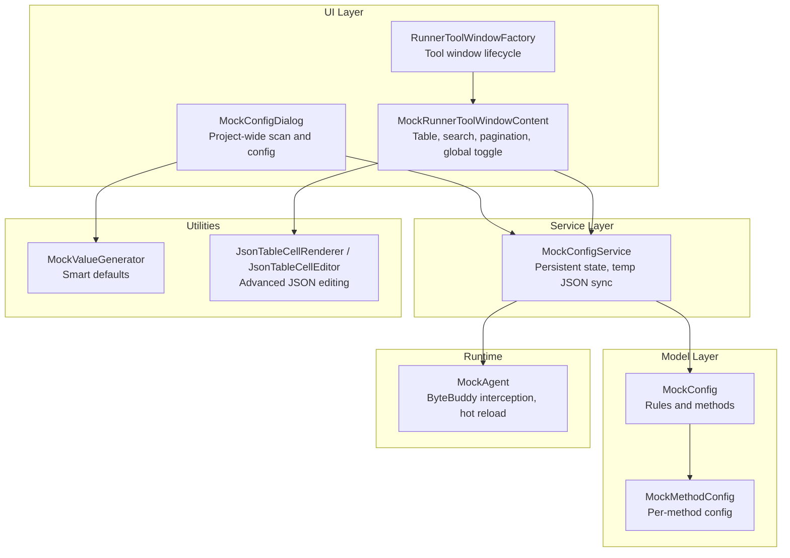

**Diagram sources**
- [MockConfigDialog.java](file://src/main/java/io/github/lancelothuxi/idea/plugin/mock/ui/MockConfigDialog.java#L1-L293)
- [MockRunnerToolWindowContent.java](file://src/main/java/io/github/lancelothuxi/idea/plugin/mock/ui/MockRunnerToolWindowContent.java#L1-L449)
- [RunnerToolWindowFactory.java](file://src/main/java/io/github/lancelothuxi/idea/plugin/mock/ui/RunnerToolWindowFactory.java#L1-L21)
- [MockConfigService.java](file://src/main/java/io/github/lancelothuxi/idea/plugin/mock/service/MockConfigService.java#L1-L197)
- [MockConfig.java](file://src/main/java/io/github/lancelothuxi/idea/plugin/mock/mock/MockConfig.java#L1-L218)
- [MockMethodConfig.java](file://src/main/java/io/github/lancelothuxi/idea/plugin/mock/mock/MockMethodConfig.java#L1-L94)
- [MockValueGenerator.java](file://src/main/java/io/github/lancelothuxi/idea/plugin/mock/util/MockValueGenerator.java#L1-L289)
- [JsonTableCellRenderer.java](file://src/main/java/io/github/lancelothuxi/idea/plugin/mock/ui/JsonTableCellRenderer.java#L1-L340)
- [JsonTableCellEditor.java](file://src/main/java/io/github/lancelothuxi/idea/plugin/mock/ui/JsonTableCellEditor.java#L1-L298)
- [MockAgent.java](file://src/main/java/io/github/lancelothuxi/idea/plugin/mock/agent/MockAgent.java#L1-L400)

**Section sources**
- [README.md](file://README.md#L1-L296)
- [MOCK_RUNNER_README.md](file://MOCK_RUNNER_README.md#L1-L192)

## Core Components
- Mock configuration model: stores per-method rules and reconstructs rules from method configs for runtime use.
- Configuration service: persists configuration to XML and writes a temporary JSON consumed by the agent; supports hot reload via file watching.
- UI dialogs and tool window: provide search, filtering, pagination, global toggles, and rapid editing with JSON rendering and editors.
- Utilities: generate smart defaults for complex return types and handle JSON editing with syntax highlighting and validation.
- Runtime agent: uses ByteBuddy to intercept method calls, parse return values according to declared or inferred types, and optionally throw exceptions.

**Section sources**
- [MockConfig.java](file://src/main/java/io/github/lancelothuxi/idea/plugin/mock/mock/MockConfig.java#L1-L218)
- [MockMethodConfig.java](file://src/main/java/io/github/lancelothuxi/idea/plugin/mock/mock/MockMethodConfig.java#L1-L94)
- [MockConfigService.java](file://src/main/java/io/github/lancelothuxi/idea/plugin/mock/service/MockConfigService.java#L1-L197)
- [MockRunnerToolWindowContent.java](file://src/main/java/io/github/lancelothuxi/idea/plugin/mock/ui/MockRunnerToolWindowContent.java#L1-L449)
- [MockConfigDialog.java](file://src/main/java/io/github/lancelothuxi/idea/plugin/mock/ui/MockConfigDialog.java#L1-L293)
- [MockValueGenerator.java](file://src/main/java/io/github/lancelothuxi/idea/plugin/mock/util/MockValueGenerator.java#L1-L289)
- [JsonTableCellRenderer.java](file://src/main/java/io/github/lancelothuxi/idea/plugin/mock/ui/JsonTableCellRenderer.java#L1-L340)
- [JsonTableCellEditor.java](file://src/main/java/io/github/lancelothuxi/idea/plugin/mock/ui/JsonTableCellEditor.java#L1-L298)
- [MockAgent.java](file://src/main/java/io/github/lancelothuxi/idea/plugin/mock/agent/MockAgent.java#L1-L400)

## Architecture Overview
The system integrates UI-driven configuration with a persistent service and a JavaAgent that applies mocks at runtime. The agent watches a temporary JSON file and reloads rules periodically, enabling rapid iteration during development.

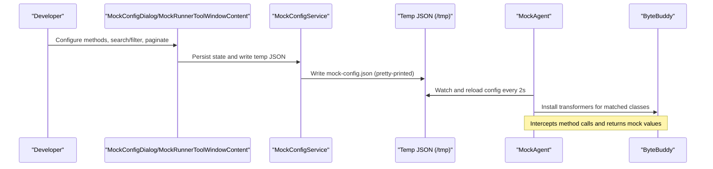

**Diagram sources**
- [MockConfigDialog.java](file://src/main/java/io/github/lancelothuxi/idea/plugin/mock/ui/MockConfigDialog.java#L1-L293)
- [MockRunnerToolWindowContent.java](file://src/main/java/io/github/lancelothuxi/idea/plugin/mock/ui/MockRunnerToolWindowContent.java#L1-L449)
- [MockConfigService.java](file://src/main/java/io/github/lancelothuxi/idea/plugin/mock/service/MockConfigService.java#L1-L197)
- [MockAgent.java](file://src/main/java/io/github/lancelothuxi/idea/plugin/mock/agent/MockAgent.java#L1-L400)

## Detailed Component Analysis

### Bulk Operations and Mass Configuration Updates
- Project-wide generation: the project-scoped dialog scans project classes and methods, generating smart defaults for return values based on types.
- Batch toggling: the tool window supports a global toggle to enable/disable all mocks at once.
- Batch editing: inline JSON editor supports editing values directly in the table; exception mode edits use a dedicated form.
- Bulk deletion: “Clear All” removes all mocks with confirmation and resets UI state.

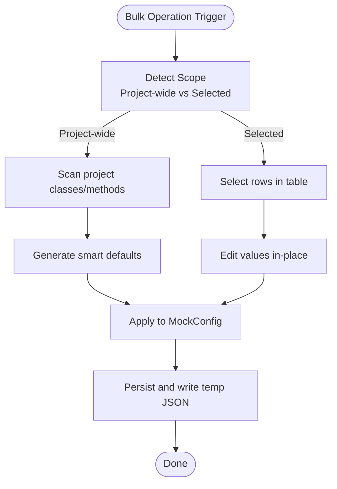

**Diagram sources**
- [MockConfigDialog.java](file://src/main/java/io/github/lancelothuxi/idea/plugin/mock/ui/MockConfigDialog.java#L110-L160)
- [MockRunnerToolWindowContent.java](file://src/main/java/io/github/lancelothuxi/idea/plugin/mock/ui/MockRunnerToolWindowContent.java#L183-L197)
- [MockConfigService.java](file://src/main/java/io/github/lancelothuxi/idea/plugin/mock/service/MockConfigService.java#L41-L58)

**Section sources**
- [MockConfigDialog.java](file://src/main/java/io/github/lancelothuxi/idea/plugin/mock/ui/MockConfigDialog.java#L162-L190)
- [MockRunnerToolWindowContent.java](file://src/main/java/io/github/lancelothuxi/idea/plugin/mock/ui/MockRunnerToolWindowContent.java#L183-L197)
- [MockConfigService.java](file://src/main/java/io/github/lancelothuxi/idea/plugin/mock/service/MockConfigService.java#L170-L181)

### Batch Mock Application and Template-Based Management
- Template-based configuration: the project dialog pre-fills values using a generator tailored to return types, reducing manual effort.
- Rule synchronization: the model rebuilds runtime rules from method configs, ensuring consistency between UI and agent consumption.
- Exception templates: exception mode supports structured editing with type and message fields.

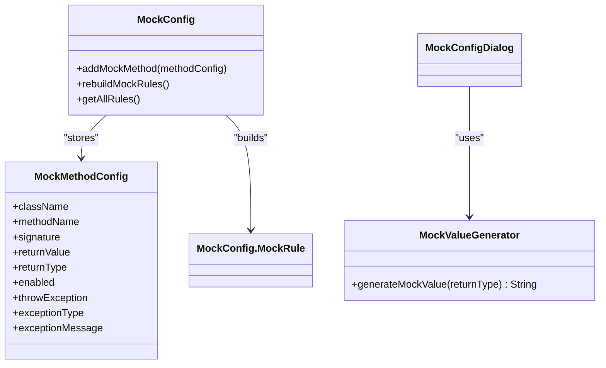

**Diagram sources**
- [MockConfig.java](file://src/main/java/io/github/lancelothuxi/idea/plugin/mock/mock/MockConfig.java#L33-L86)
- [MockMethodConfig.java](file://src/main/java/io/github/lancelothuxi/idea/plugin/mock/mock/MockMethodConfig.java#L1-L94)
- [MockValueGenerator.java](file://src/main/java/io/github/lancelothuxi/idea/plugin/mock/util/MockValueGenerator.java#L18-L100)

**Section sources**
- [MockConfig.java](file://src/main/java/io/github/lancelothuxi/idea/plugin/mock/mock/MockConfig.java#L67-L86)
- [MockValueGenerator.java](file://src/main/java/io/github/lancelothuxi/idea/plugin/mock/util/MockValueGenerator.java#L138-L192)

### Pagination Strategies for Large Datasets
- Fixed-size pagination: the tool window displays a fixed page size and navigation controls.
- Page-aware rendering: the table model and UI update page labels and navigation buttons dynamically.
- Filtering and sorting: the table supports sorting and regex-based filtering, which influence pagination totals.

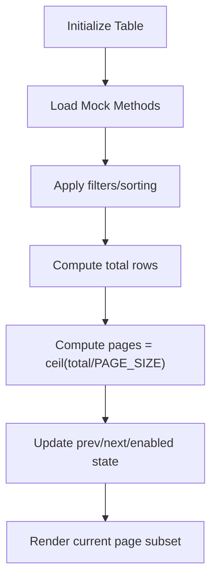

**Diagram sources**
- [MockRunnerToolWindowContent.java](file://src/main/java/io/github/lancelothuxi/idea/plugin/mock/ui/MockRunnerToolWindowContent.java#L228-L255)

**Section sources**
- [MockRunnerToolWindowContent.java](file://src/main/java/io/github/lancelothuxi/idea/plugin/mock/ui/MockRunnerToolWindowContent.java#L31-L40)
- [MockRunnerToolWindowContent.java](file://src/main/java/io/github/lancelothuxi/idea/plugin/mock/ui/MockRunnerToolWindowContent.java#L228-L255)

### Search and Filtering Capabilities
- Live filtering: a text field triggers a regex-based filter against all columns.
- Stats display: the UI shows counts of total and enabled mocks, updated after filtering.
- Sorting: the table supports sorting by clicking column headers.

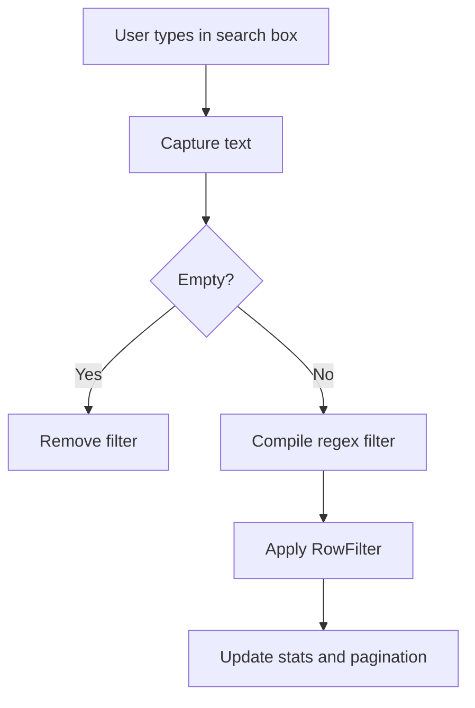

**Diagram sources**
- [MockRunnerToolWindowContent.java](file://src/main/java/io/github/lancelothuxi/idea/plugin/mock/ui/MockRunnerToolWindowContent.java#L173-L181)
- [MockRunnerToolWindowContent.java](file://src/main/java/io/github/lancelothuxi/idea/plugin/mock/ui/MockRunnerToolWindowContent.java#L257-L270)

**Section sources**
- [MockRunnerToolWindowContent.java](file://src/main/java/io/github/lancelothuxi/idea/plugin/mock/ui/MockRunnerToolWindowContent.java#L88-L98)
- [MockRunnerToolWindowContent.java](file://src/main/java/io/github/lancelothuxi/idea/plugin/mock/ui/MockRunnerToolWindowContent.java#L173-L181)

### Performance Optimization for Complex Configurations
- JSON rendering and caching: the renderer caches formatted JSON to reduce overhead for large values.
- Minification and pretty-printing: the renderer minifies JSON for compact display and pretty-prints for tooltips.
- Type-aware parsing: the agent parses values according to declared or inferred types, including generic containers.
- Hot reload with polling: the agent watches the temp JSON and reloads every 2 seconds, balancing responsiveness and CPU usage.

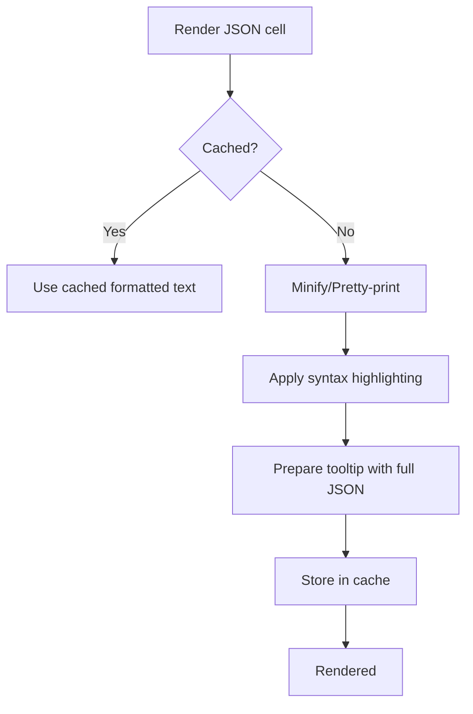

**Diagram sources**
- [JsonTableCellRenderer.java](file://src/main/java/io/github/lancelothuxi/idea/plugin/mock/ui/JsonTableCellRenderer.java#L63-L146)
- [JsonTableCellRenderer.java](file://src/main/java/io/github/lancelothuxi/idea/plugin/mock/ui/JsonTableCellRenderer.java#L173-L202)

**Section sources**
- [JsonTableCellRenderer.java](file://src/main/java/io/github/lancelothuxi/idea/plugin/mock/ui/JsonTableCellRenderer.java#L63-L146)
- [MockAgent.java](file://src/main/java/io/github/lancelothuxi/idea/plugin/mock/agent/MockAgent.java#L174-L200)

### Advanced UI Features: Keyboard Shortcuts, Drag-and-Drop, Rapid Editing
- Rapid editing: click to open a modal JSON editor for complex values; exception mode uses a structured form.
- Inline editing: enable/disable toggles, mode switching, and value editing directly in the table.
- Drag-and-drop: not implemented in the current codebase; consider extending the table model to support drag reorder if needed.

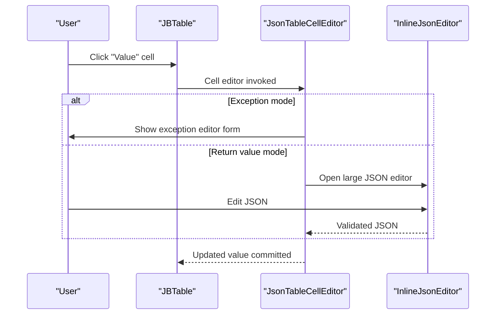

**Diagram sources**
- [JsonTableCellEditor.java](file://src/main/java/io/github/lancelothuxi/idea/plugin/mock/ui/JsonTableCellEditor.java#L75-L157)
- [JsonTableCellRenderer.java](file://src/main/java/io/github/lancelothuxi/idea/plugin/mock/ui/JsonTableCellRenderer.java#L75-L110)

**Section sources**
- [JsonTableCellEditor.java](file://src/main/java/io/github/lancelothuxi/idea/plugin/mock/ui/JsonTableCellEditor.java#L75-L157)
- [JsonTableCellRenderer.java](file://src/main/java/io/github/lancelothuxi/idea/plugin/mock/ui/JsonTableCellRenderer.java#L75-L110)

### Workflow Automation Patterns
- Action-driven creation: a dedicated action adds mocks for the method under the caret, opening a guided dialog.
- Tool window automation: global toggle and “Clear All” streamline bulk operations.
- Persistence and hot reload: writing to a temp JSON file and agent polling enables automated reapplication without restart.

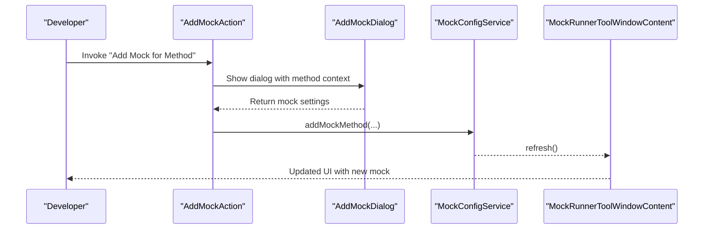

**Diagram sources**
- [AddMockAction.java](file://src/main/java/io/github/lancelothuxi/idea/plugin/mock/action/AddMockAction.java#L22-L82)
- [MockConfigService.java](file://src/main/java/io/github/lancelothuxi/idea/plugin/mock/service/MockConfigService.java#L109-L151)
- [RunnerToolWindowFactory.java](file://src/main/java/io/github/lancelothuxi/idea/plugin/mock/ui/RunnerToolWindowFactory.java#L12-L19)

**Section sources**
- [AddMockAction.java](file://src/main/java/io/github/lancelothuxi/idea/plugin/mock/action/AddMockAction.java#L22-L82)
- [MockConfigService.java](file://src/main/java/io/github/lancelothuxi/idea/plugin/mock/service/MockConfigService.java#L109-L151)

### Integration with Testing Frameworks and CI/CD Pipelines
- Local development: use the tool window to manage mocks; save persists to XML and writes temp JSON for the agent.
- CI/CD: include the plugin installation and ensure the temp JSON path is writable; configure jobs to run with the agent by passing the appropriate Java agent argument pointing to the built agent JAR.

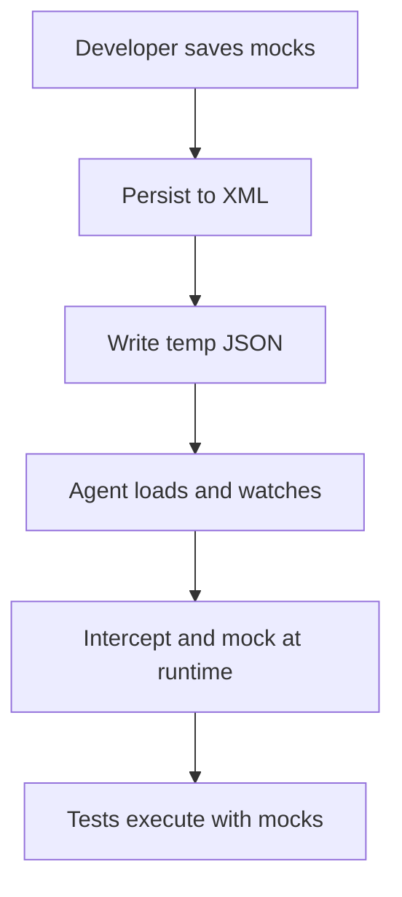

**Diagram sources**
- [MockConfigService.java](file://src/main/java/io/github/lancelothuxi/idea/plugin/mock/service/MockConfigService.java#L41-L58)
- [MockAgent.java](file://src/main/java/io/github/lancelothuxi/idea/plugin/mock/agent/MockAgent.java#L147-L168)

**Section sources**
- [MockConfigService.java](file://src/main/java/io/github/lancelothuxi/idea/plugin/mock/service/MockConfigService.java#L41-L58)
- [MockAgent.java](file://src/main/java/io/github/lancelothuxi/idea/plugin/mock/agent/MockAgent.java#L147-L168)

## Dependency Analysis
The following diagram shows key dependencies among components:

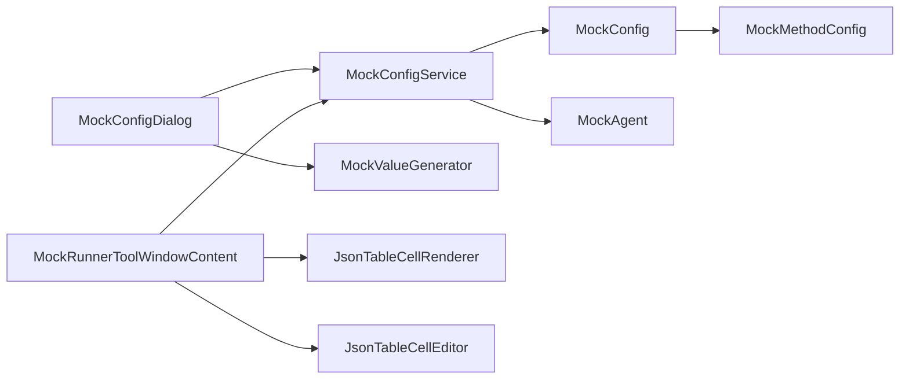

**Diagram sources**
- [MockConfigDialog.java](file://src/main/java/io/github/lancelothuxi/idea/plugin/mock/ui/MockConfigDialog.java#L1-L293)
- [MockRunnerToolWindowContent.java](file://src/main/java/io/github/lancelothuxi/idea/plugin/mock/ui/MockRunnerToolWindowContent.java#L1-L449)
- [MockConfigService.java](file://src/main/java/io/github/lancelothuxi/idea/plugin/mock/service/MockConfigService.java#L1-L197)
- [MockConfig.java](file://src/main/java/io/github/lancelothuxi/idea/plugin/mock/mock/MockConfig.java#L1-L218)
- [MockMethodConfig.java](file://src/main/java/io/github/lancelothuxi/idea/plugin/mock/mock/MockMethodConfig.java#L1-L94)
- [MockValueGenerator.java](file://src/main/java/io/github/lancelothuxi/idea/plugin/mock/util/MockValueGenerator.java#L1-L289)
- [JsonTableCellRenderer.java](file://src/main/java/io/github/lancelothuxi/idea/plugin/mock/ui/JsonTableCellRenderer.java#L1-L340)
- [JsonTableCellEditor.java](file://src/main/java/io/github/lancelothuxi/idea/plugin/mock/ui/JsonTableCellEditor.java#L1-L298)
- [MockAgent.java](file://src/main/java/io/github/lancelothuxi/idea/plugin/mock/agent/MockAgent.java#L1-L400)

**Section sources**
- [MockConfigService.java](file://src/main/java/io/github/lancelothuxi/idea/plugin/mock/service/MockConfigService.java#L1-L197)
- [MockConfig.java](file://src/main/java/io/github/lancelothuxi/idea/plugin/mock/mock/MockConfig.java#L1-L218)

## Performance Considerations
- Renderer caching: limit repeated formatting work by caching formatted JSON strings.
- Minification vs pretty-printing: use minified display for table cells and pretty-printed tooltips for readability.
- Type inference: rely on declared return types when available; fall back to inference for runtime rules reconstruction.
- Polling interval: the agent’s 2-second polling strikes a balance between responsiveness and CPU usage; adjust only if necessary.
- UI updates: batch table updates and avoid unnecessary repaints by updating stats and pagination after filtering.

[No sources needed since this section provides general guidance]

## Troubleshooting Guide
- Agent not loading: verify the temp JSON path and permissions; check logs for errors during config load.
- Mock not applied: confirm the mock is enabled, the method signature matches exactly, and the return type is correct.
- Generic type issues: ensure return types match the method signature; the agent attempts to resolve generic types but may fall back to generic containers.

**Section sources**
- [MockAgent.java](file://src/main/java/io/github/lancelothuxi/idea/plugin/mock/agent/MockAgent.java#L147-L168)
- [README.md](file://README.md#L214-L234)

## Conclusion
Mock Runner’s architecture combines a robust UI for configuration with a persistent service and a JavaAgent that applies mocks at runtime. Advanced bulk operations, pagination, search, and performance optimizations enable efficient workflows for both individual developers and teams. Integrating with testing frameworks and CI/CD pipelines is straightforward, leveraging the temp JSON mechanism and agent hot reload.

[No sources needed since this section summarizes without analyzing specific files]

## Appendices

### Expert-Level Usage Patterns
- Power users: leverage the project-wide dialog to generate initial configurations, then refine with the tool window’s search and pagination.
- Teams: commit the XML configuration to share mock setups; enforce consistent return types to improve agent parsing reliability.
- Rapid editing: use the inline JSON editor for complex objects and exception editor for exception mode.

**Section sources**
- [README.md](file://README.md#L148-L213)
- [MockRunnerToolWindowContent.java](file://src/main/java/io/github/lancelothuxi/idea/plugin/mock/ui/MockRunnerToolWindowContent.java#L73-L77)