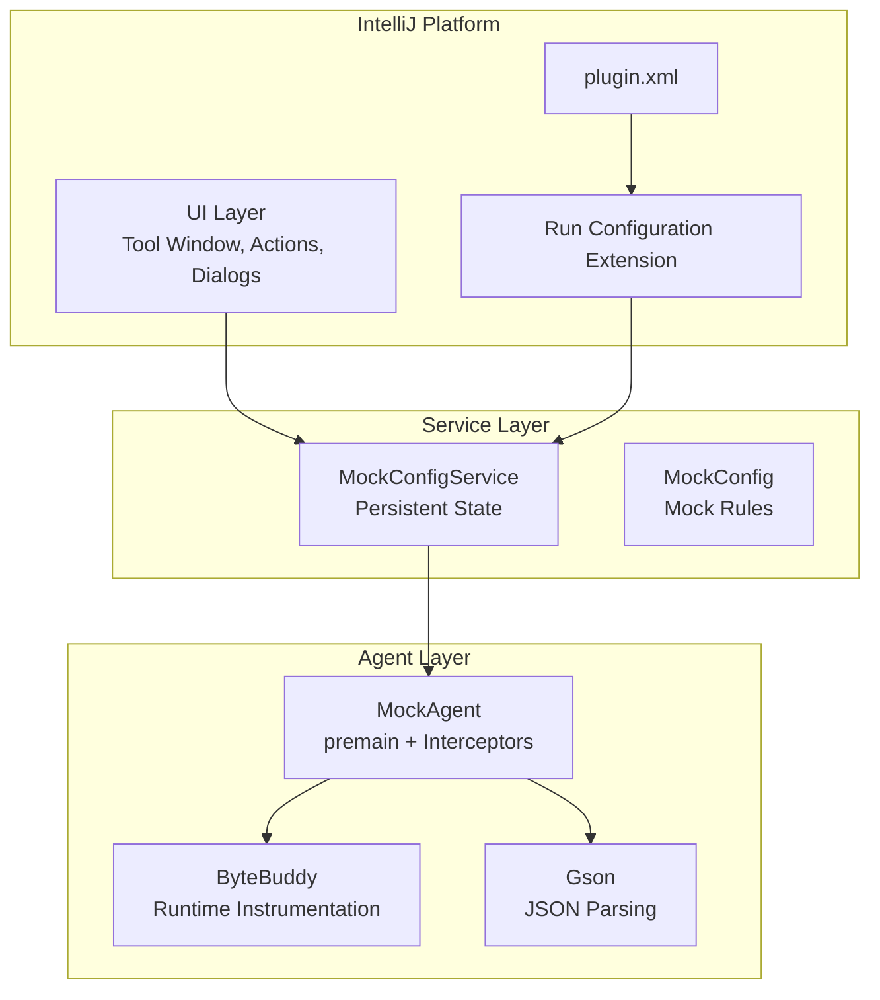
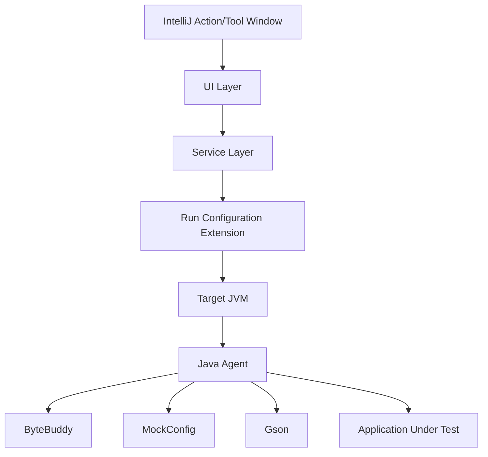
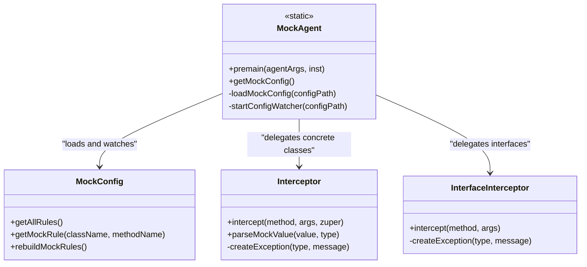
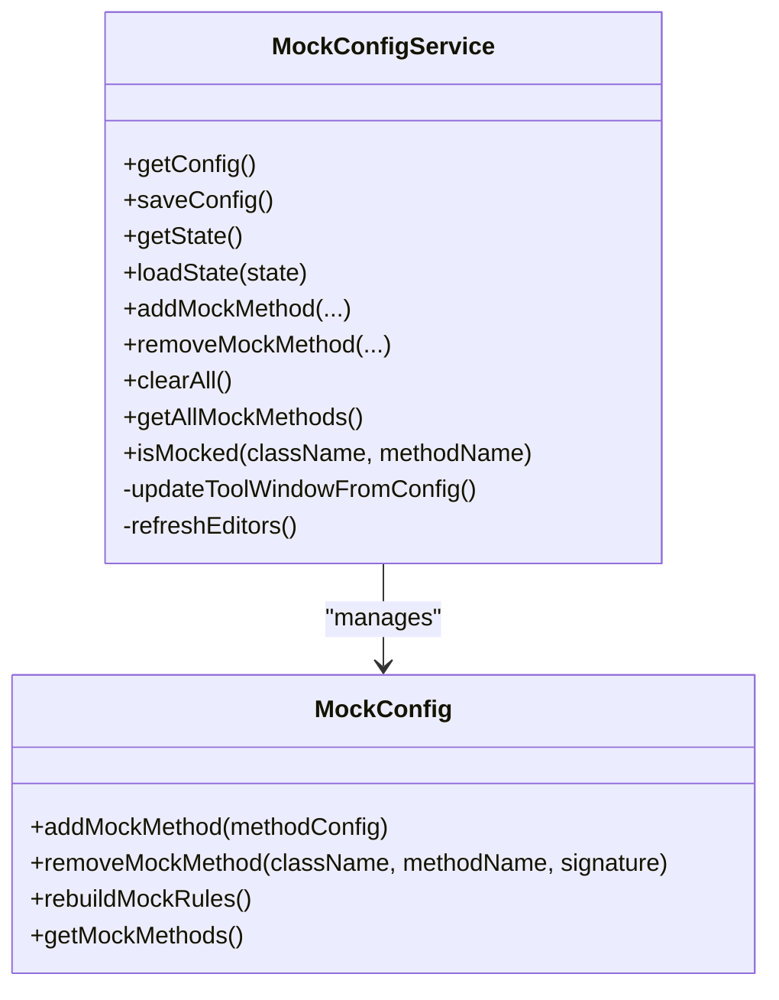
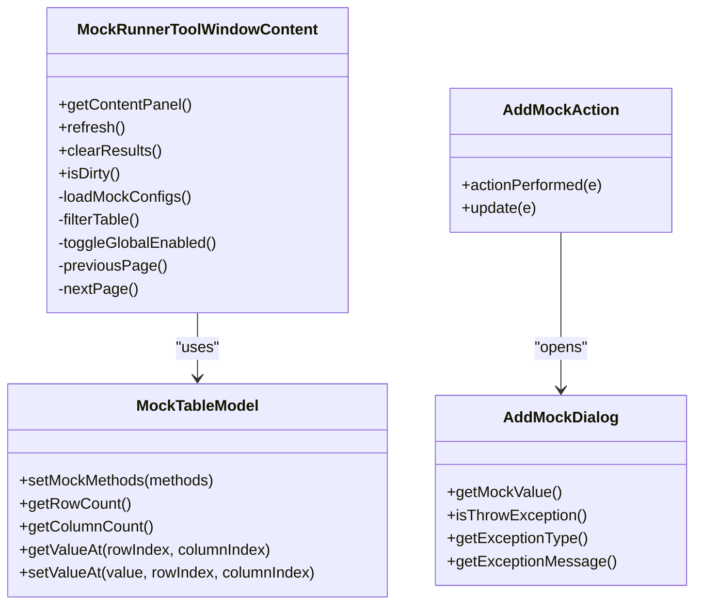
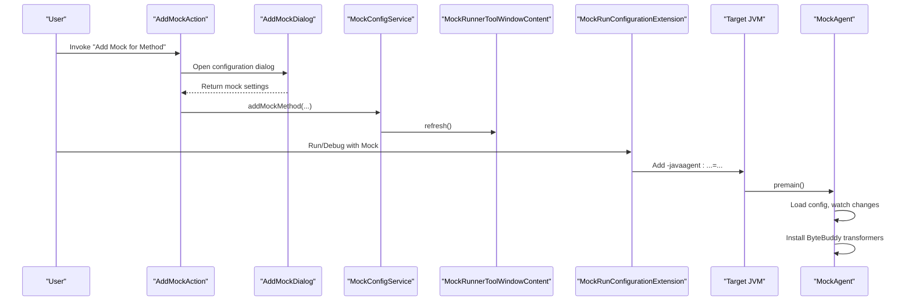
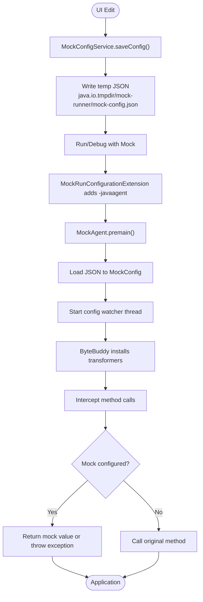
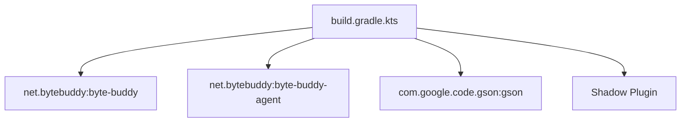
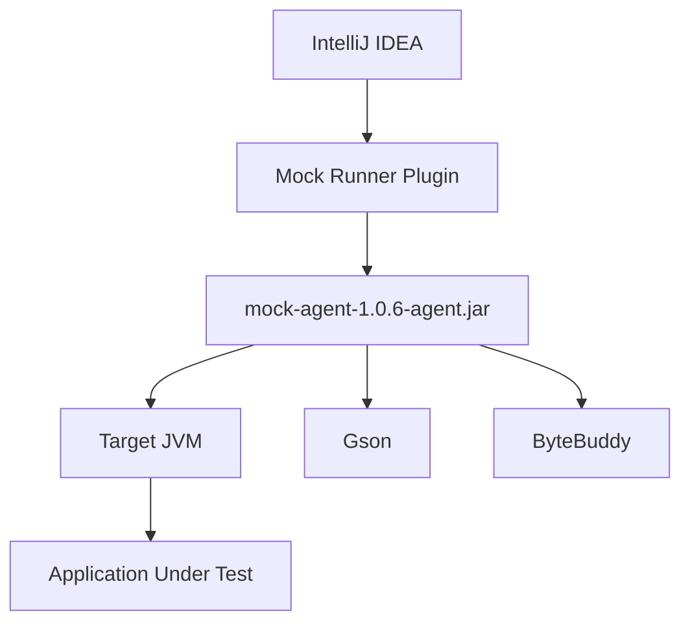

# Architecture and Design

<cite>
**Referenced Files in This Document**
- [README.md](file://README.md)
- [MOCK_RUNNER_README.md](file://MOCK_RUNNER_README.md)
- [ARCHITECTURE_DIAGRAM.md](file://docs/ARCHITECTURE_DIAGRAM.md)
- [build.gradle.kts](file://build.gradle.kts)
- [plugin.xml](file://src/main/resources/META-INF/plugin.xml)
- [MockAgent.java](file://src/main/java/io/github/lancelothuxi/idea/plugin/mock/agent/MockAgent.java)
- [MockRunConfigurationExtension.java](file://src/main/java/io/github/lancelothuxi/idea/plugin/mock/extension/MockRunConfigurationExtension.java)
- [MockConfig.java](file://src/main/java/io/github/lancelothuxi/idea/plugin/mock/mock/MockConfig.java)
- [MockConfigService.java](file://src/main/java/io/github/lancelothuxi/idea/plugin/mock/service/MockConfigService.java)
- [MockRunnerToolWindowContent.java](file://src/main/java/io/github/lancelothuxi/idea/plugin/mock/ui/MockRunnerToolWindowContent.java)
- [AddMockAction.java](file://src/main/java/io/github/lancelothuxi/idea/plugin/mock/action/AddMockAction.java)
- [AddMockDialog.java](file://src/main/java/io/github/lancelothuxi/idea/plugin/mock/ui/AddMockDialog.java)
- [RunnerToolWindowFactory.java](file://src/main/java/io/github/lancelothuxi/idea/plugin/mock/ui/RunnerToolWindowFactory.java)
- [MockedMethodLineMarkerProvider.java](file://src/main/java/io/github/lancelothuxi/idea/plugin/mock/marker/MockedMethodLineMarkerProvider.java)
</cite>

## Table of Contents
1. [Introduction](#introduction)
2. [Project Structure](#project-structure)
3. [Core Components](#core-components)
4. [Architecture Overview](#architecture-overview)
5. [Detailed Component Analysis](#detailed-component-analysis)
6. [Dependency Analysis](#dependency-analysis)
7. [Performance Considerations](#performance-considerations)
8. [Troubleshooting Guide](#troubleshooting-guide)
9. [Conclusion](#conclusion)
10. [Appendices](#appendices)

## Introduction
This document describes the architectural design of Mock Runner, an IntelliJ IDEA plugin that enables runtime method mocking using Java Agent technology. The system integrates tightly with the IntelliJ Platform to provide a visual UI for configuring mock rules, persists configuration per project, and injects a lightweight Java agent into the target JVM to intercept method calls and return configured values or throw exceptions. The architecture follows a layered pattern separating UI, service, and agent layers, with clear component interactions and robust error handling.

## Project Structure
The project is organized around three primary layers:
- UI Layer: IntelliJ Platform UI components, tool window, actions, and dialogs.
- Service Layer: Persistent configuration storage and synchronization between UI and agent.
- Agent Layer: Java Agent that performs runtime bytecode instrumentation using ByteBuddy.

**Diagram sources**
- [plugin.xml](file://src/main/resources/META-INF/plugin.xml#L25-L43)
- [MockRunConfigurationExtension.java](file://src/main/java/io/github/lancelothuxi/idea/plugin/mock/extension/MockRunConfigurationExtension.java#L24-L78)
- [MockConfigService.java](file://src/main/java/io/github/lancelothuxi/idea/plugin/mock/service/MockConfigService.java#L23-L31)
- [MockConfig.java](file://src/main/java/io/github/lancelothuxi/idea/plugin/mock/mock/MockConfig.java#L12-L218)
- [MockAgent.java](file://src/main/java/io/github/lancelothuxi/idea/plugin/mock/agent/MockAgent.java#L21-L145)

**Section sources**
- [README.md](file://README.md#L241-L246)
- [build.gradle.kts](file://build.gradle.kts#L25-L35)
- [plugin.xml](file://src/main/resources/META-INF/plugin.xml#L1-L55)

## Core Components
- MockAgent: Java agent entry point that loads configuration, watches for changes, and installs ByteBuddy transformers to intercept method calls.
- MockRunConfigurationExtension: Injects the Java agent into the target JVM’s VM arguments before launch.
- MockConfigService: Manages persistent configuration state and synchronizes UI updates.
- MockConfig: Data model for mock rules and methods.
- UI Components: Tool window, table model, JSON editor, and actions for adding mocks.
- Line Marker Provider: Visual indicator for mocked methods in the editor gutter.

**Section sources**
- [MockAgent.java](file://src/main/java/io/github/lancelothuxi/idea/plugin/mock/agent/MockAgent.java#L21-L145)
- [MockRunConfigurationExtension.java](file://src/main/java/io/github/lancelothuxi/idea/plugin/mock/extension/MockRunConfigurationExtension.java#L24-L78)
- [MockConfigService.java](file://src/main/java/io/github/lancelothuxi/idea/plugin/mock/service/MockConfigService.java#L23-L96)
- [MockConfig.java](file://src/main/java/io/github/lancelothuxi/idea/plugin/mock/mock/MockConfig.java#L12-L86)
- [MockRunnerToolWindowContent.java](file://src/main/java/io/github/lancelothuxi/idea/plugin/mock/ui/MockRunnerToolWindowContent.java#L22-L160)
- [MockedMethodLineMarkerProvider.java](file://src/main/java/io/github/lancelothuxi/idea/plugin/mock/marker/MockedMethodLineMarkerProvider.java#L19-L61)

## Architecture Overview
The system uses a layered architecture:
- UI Layer: Provides configuration UI, actions, and tool window.
- Service Layer: Persists configuration and exposes APIs for UI and agent.
- Agent Layer: Instruments classes at runtime using ByteBuddy and applies mock rules.

**Diagram sources**
- [plugin.xml](file://src/main/resources/META-INF/plugin.xml#L25-L43)
- [MockRunConfigurationExtension.java](file://src/main/java/io/github/lancelothuxi/idea/plugin/mock/extension/MockRunConfigurationExtension.java#L28-L78)
- [MockAgent.java](file://src/main/java/io/github/lancelothuxi/idea/plugin/mock/agent/MockAgent.java#L26-L145)
- [MockConfig.java](file://src/main/java/io/github/lancelothuxi/idea/plugin/mock/mock/MockConfig.java#L12-L31)

## Detailed Component Analysis

### Java Agent Layer
The agent is responsible for loading configuration, watching for changes, and installing ByteBuddy transformers. It distinguishes between interface and concrete class interception and supports exception mode.

**Diagram sources**
- [MockAgent.java](file://src/main/java/io/github/lancelothuxi/idea/plugin/mock/agent/MockAgent.java#L21-L145)
- [MockAgent.java](file://src/main/java/io/github/lancelothuxi/idea/plugin/mock/agent/MockAgent.java#L202-L339)
- [MockAgent.java](file://src/main/java/io/github/lancelothuxi/idea/plugin/mock/agent/MockAgent.java#L344-L398)
- [MockConfig.java](file://src/main/java/io/github/lancelothuxi/idea/plugin/mock/mock/MockConfig.java#L12-L31)

**Section sources**
- [MockAgent.java](file://src/main/java/io/github/lancelothuxi/idea/plugin/mock/agent/MockAgent.java#L26-L145)
- [MockAgent.java](file://src/main/java/io/github/lancelothuxi/idea/plugin/mock/agent/MockAgent.java#L174-L200)
- [MockAgent.java](file://src/main/java/io/github/lancelothuxi/idea/plugin/mock/agent/MockAgent.java#L202-L339)
- [MockAgent.java](file://src/main/java/io/github/lancelothuxi/idea/plugin/mock/agent/MockAgent.java#L344-L398)

### Service Layer
The service manages persistent configuration state, rebuilds mock rules from UI edits, and coordinates UI refreshes.

**Diagram sources**
- [MockConfigService.java](file://src/main/java/io/github/lancelothuxi/idea/plugin/mock/service/MockConfigService.java#L23-L96)
- [MockConfig.java](file://src/main/java/io/github/lancelothuxi/idea/plugin/mock/mock/MockConfig.java#L33-L86)

**Section sources**
- [MockConfigService.java](file://src/main/java/io/github/lancelothuxi/idea/plugin/mock/service/MockConfigService.java#L41-L58)
- [MockConfigService.java](file://src/main/java/io/github/lancelothuxi/idea/plugin/mock/service/MockConfigService.java#L65-L96)
- [MockConfig.java](file://src/main/java/io/github/lancelothuxi/idea/plugin/mock/mock/MockConfig.java#L67-L86)

### UI Layer
The UI provides a tool window with a table, search, pagination, and JSON editing capabilities. Actions allow adding mocks via context menu.

**Diagram sources**
- [MockRunnerToolWindowContent.java](file://src/main/java/io/github/lancelothuxi/idea/plugin/mock/ui/MockRunnerToolWindowContent.java#L22-L160)
- [MockRunnerToolWindowContent.java](file://src/main/java/io/github/lancelothuxi/idea/plugin/mock/ui/MockRunnerToolWindowContent.java#L341-L447)
- [AddMockAction.java](file://src/main/java/io/github/lancelothuxi/idea/plugin/mock/action/AddMockAction.java#L15-L82)
- [AddMockDialog.java](file://src/main/java/io/github/lancelothuxi/idea/plugin/mock/ui/AddMockDialog.java#L16-L183)

**Section sources**
- [MockRunnerToolWindowContent.java](file://src/main/java/io/github/lancelothuxi/idea/plugin/mock/ui/MockRunnerToolWindowContent.java#L82-L160)
- [AddMockAction.java](file://src/main/java/io/github/lancelothuxi/idea/plugin/mock/action/AddMockAction.java#L21-L82)
- [AddMockDialog.java](file://src/main/java/io/github/lancelothuxi/idea/plugin/mock/ui/AddMockDialog.java#L105-L183)

### Integration with IntelliJ Platform
The plugin registers a run configuration extension to inject the Java agent into VM arguments and declares a tool window and line marker provider for enhanced developer experience.

**Diagram sources**
- [plugin.xml](file://src/main/resources/META-INF/plugin.xml#L25-L43)
- [MockRunConfigurationExtension.java](file://src/main/java/io/github/lancelothuxi/idea/plugin/mock/extension/MockRunConfigurationExtension.java#L28-L78)
- [AddMockAction.java](file://src/main/java/io/github/lancelothuxi/idea/plugin/mock/action/AddMockAction.java#L21-L82)
- [MockConfigService.java](file://src/main/java/io/github/lancelothuxi/idea/plugin/mock/service/MockConfigService.java#L109-L151)
- [MockAgent.java](file://src/main/java/io/github/lancelothuxi/idea/plugin/mock/agent/MockAgent.java#L26-L145)

**Section sources**
- [plugin.xml](file://src/main/resources/META-INF/plugin.xml#L25-L43)
- [MockRunConfigurationExtension.java](file://src/main/java/io/github/lancelothuxi/idea/plugin/mock/extension/MockRunConfigurationExtension.java#L28-L78)

### Data Flow: From Configuration to Execution
The configuration flows from the UI to persistent state, then to temporary JSON, and finally to the agent for runtime interception.

**Diagram sources**
- [MockConfigService.java](file://src/main/java/io/github/lancelothuxi/idea/plugin/mock/service/MockConfigService.java#L41-L58)
- [MockRunConfigurationExtension.java](file://src/main/java/io/github/lancelothuxi/idea/plugin/mock/extension/MockRunConfigurationExtension.java#L80-L92)
- [MockAgent.java](file://src/main/java/io/github/lancelothuxi/idea/plugin/mock/agent/MockAgent.java#L26-L60)
- [MockAgent.java](file://src/main/java/io/github/lancelothuxi/idea/plugin/mock/agent/MockAgent.java#L147-L168)
- [MockAgent.java](file://src/main/java/io/github/lancelothuxi/idea/plugin/mock/agent/MockAgent.java#L174-L200)

**Section sources**
- [MockConfigService.java](file://src/main/java/io/github/lancelothuxi/idea/plugin/mock/service/MockConfigService.java#L41-L58)
- [MockRunConfigurationExtension.java](file://src/main/java/io/github/lancelothuxi/idea/plugin/mock/extension/MockRunConfigurationExtension.java#L80-L92)
- [MockAgent.java](file://src/main/java/io/github/lancelothuxi/idea/plugin/mock/agent/MockAgent.java#L147-L200)

## Dependency Analysis
The system relies on:
- ByteBuddy for bytecode instrumentation.
- Gson for JSON parsing and type-safe deserialization.
- IntelliJ Platform SDK for UI, actions, tool windows, and run configuration extensions.
- Shadow plugin for packaging the agent with relocated dependencies to avoid conflicts.

**Diagram sources**
- [build.gradle.kts](file://build.gradle.kts#L25-L35)
- [build.gradle.kts](file://build.gradle.kts#L84-L113)

**Section sources**
- [build.gradle.kts](file://build.gradle.kts#L25-L35)
- [build.gradle.kts](file://build.gradle.kts#L84-L113)

## Performance Considerations
- Minimal overhead: Only configured classes are transformed; non-mocked methods are unaffected.
- Efficient lookups: Mock rules are stored in a map keyed by fully qualified method names for O(1) retrieval.
- Lazy parsing: JSON parsing occurs only when a mock value is returned.
- Type detection caching: Determined once per class load.
- Memory management: Temporary JSON file is written to the system temp directory; watcher thread polls periodically to reload changes.

**Section sources**
- [ARCHITECTURE_DIAGRAM.md](file://docs/ARCHITECTURE_DIAGRAM.md#L240-L247)
- [MockAgent.java](file://src/main/java/io/github/lancelothuxi/idea/plugin/mock/agent/MockAgent.java#L112-L140)
- [MockAgent.java](file://src/main/java/io/github/lancelothuxi/idea/plugin/mock/agent/MockAgent.java#L246-L326)

## Troubleshooting Guide
Common issues and resolutions:
- Agent not loading: Ensure the plugin is installed and “Run with Mock” is used; verify the agent argument is present in VM options.
- Mock not applied: Confirm the method is enabled in the tool window and the signature matches exactly.
- Generic type parsing failures: Provide explicit return type in configuration; the agent attempts to infer types but may fall back to generic parsing.
- Configuration not reloading: The watcher thread polls every two seconds; modify the file timestamp to trigger reload.

**Section sources**
- [README.md](file://README.md#L214-L234)
- [MockAgent.java](file://src/main/java/io/github/lancelothuxi/idea/plugin/mock/agent/MockAgent.java#L174-L200)
- [MockAgent.java](file://src/main/java/io/github/lancelothuxi/idea/plugin/mock/agent/MockAgent.java#L274-L326)

## Conclusion
Mock Runner combines IntelliJ Platform integration with a lightweight Java Agent to deliver a seamless runtime mocking experience. The layered architecture cleanly separates UI, service, and agent concerns, while ByteBuddy ensures efficient and safe instrumentation. The observer pattern for configuration watching and the MVC-style UI components provide a responsive and maintainable design. Cross-cutting concerns such as performance, memory, and error handling are addressed through targeted strategies.

## Appendices

### System Context Diagrams
High-level context showing relationships with the IntelliJ IDE, Java runtime, and external frameworks.

**Diagram sources**
- [build.gradle.kts](file://build.gradle.kts#L84-L113)
- [MockRunConfigurationExtension.java](file://src/main/java/io/github/lancelothuxi/idea/plugin/mock/extension/MockRunConfigurationExtension.java#L94-L129)
- [MockAgent.java](file://src/main/java/io/github/lancelothuxi/idea/plugin/mock/agent/MockAgent.java#L21-L24)

### Technical Decisions Summary
- ByteBuddy: Chosen for robust, production-grade runtime instrumentation with minimal footprint.
- Observer Pattern: A dedicated watcher thread monitors configuration file changes and reloads rules.
- MVC Pattern: UI table model encapsulates data and presentation logic; actions coordinate service updates.
- JSON Editor: Inline JSON editor with syntax highlighting improves usability for complex return values.
- Dependency Relocation: Shadow plugin relocates Gson and ByteBuddy to prevent conflicts with user projects.

**Section sources**
- [README.md](file://README.md#L241-L246)
- [ARCHITECTURE_DIAGRAM.md](file://docs/ARCHITECTURE_DIAGRAM.md#L232-L255)
- [build.gradle.kts](file://build.gradle.kts#L94-L113)