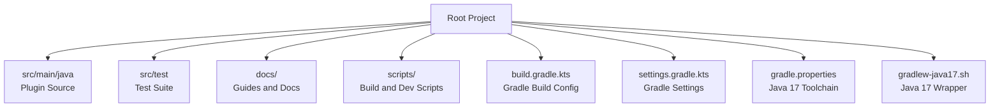
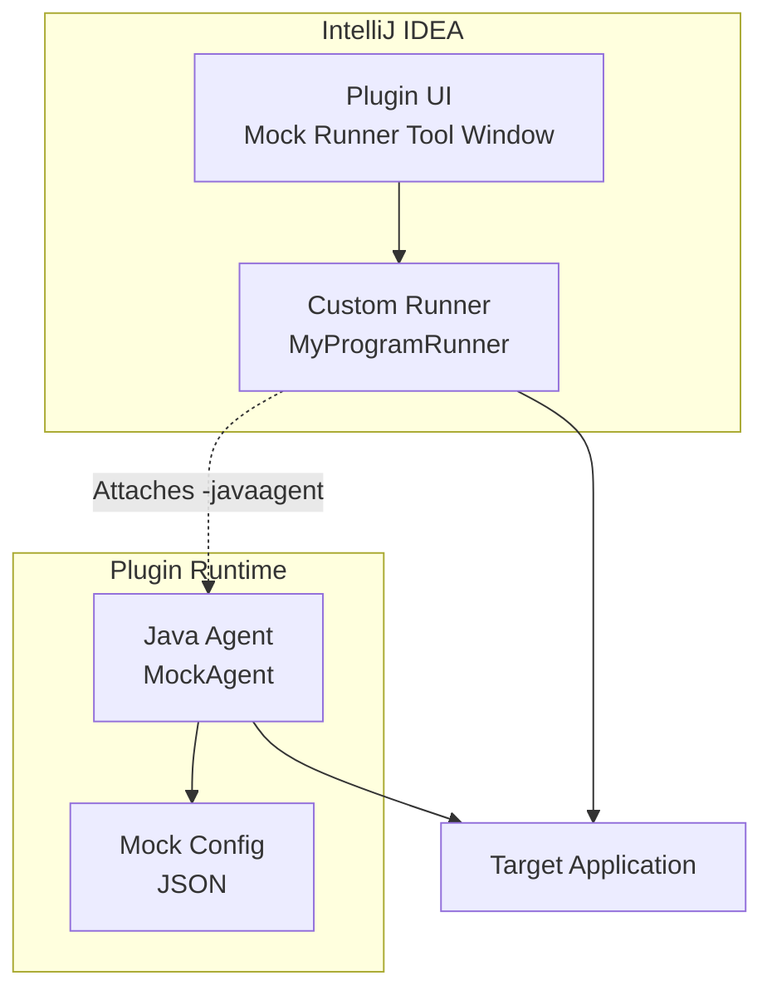
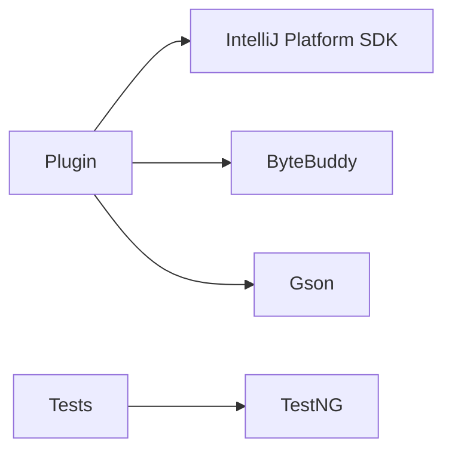

# Contributing Guidelines

<cite>
**Referenced Files in This Document**
- [README.md](file://README.md)
- [BUILD_INSTRUCTIONS.md](file://BUILD_INSTRUCTIONS.md)
- [GRADLE_SETUP.md](file://GRADLE_SETUP.md)
- [build.gradle.kts](file://build.gradle.kts)
- [settings.gradle.kts](file://settings.gradle.kts)
- [gradle.properties](file://gradle.properties)
- [src/test/README.md](file://src/test/README.md)
- [docs/TESTNG_GUIDE.md](file://docs/TESTNG_GUIDE.md)
- [docs/TOOLWINDOW_GUIDE.md](file://docs/TOOLWINDOW_GUIDE.md)
- [CHANGELOG.md](file://CHANGELOG.md)
- [LICENSE](file://LICENSE)
</cite>

## Table of Contents
1. [Introduction](#introduction)
2. [Project Structure](#project-structure)
3. [Core Components](#core-components)
4. [Architecture Overview](#architecture-overview)
5. [Detailed Component Analysis](#detailed-component-analysis)
6. [Dependency Analysis](#dependency-analysis)
7. [Performance Considerations](#performance-considerations)
8. [Troubleshooting Guide](#troubleshooting-guide)
9. [Conclusion](#conclusion)
10. [Appendices](#appendices)

## Introduction
Thank you for considering contributing to the Mock Runner IntelliJ IDEA Plugin. This document provides a comprehensive guide to setting up your development environment, understanding the project’s architecture, following code and documentation standards, and submitting high-quality contributions. It also covers testing requirements, quality assurance expectations, licensing, and community interaction guidelines.

## Project Structure
The project is a Gradle-based IntelliJ Platform plugin with a dedicated Java Agent for runtime method mocking. The repository includes:
- Plugin source code under src/main/java
- Test suite under src/test
- Build configuration in build.gradle.kts and settings.gradle.kts
- Documentation under docs/
- Scripts for quick builds and sandbox runs under scripts/

**Diagram sources**
- [build.gradle.kts](file://build.gradle.kts#L1-L146)
- [settings.gradle.kts](file://settings.gradle.kts#L1-L11)
- [gradle.properties](file://gradle.properties#L1-L13)

**Section sources**
- [build.gradle.kts](file://build.gradle.kts#L1-L146)
- [settings.gradle.kts](file://settings.gradle.kts#L1-L11)
- [gradle.properties](file://gradle.properties#L1-L13)

## Core Components
- IntelliJ Platform plugin with a custom runner and tool window
- Java Agent (ByteBuddy-based) that injects mock behavior at runtime
- TestNG-based test suite validating Dubbo and Feign interface mocking
- Gradle tasks for building the plugin, preparing the sandbox, and packaging the agent

Key capabilities:
- Runtime method interception and mocking without source code changes
- Visual mock configuration UI and persistent configuration storage
- Exception mocking mode and advanced JSON editing
- Pagination, search, and global toggles for mock configurations

**Section sources**
- [README.md](file://README.md#L1-L296)
- [CHANGELOG.md](file://CHANGELOG.md#L1-L131)

## Architecture Overview
The plugin integrates with IntelliJ IDEA to provide a “Run with Mock” experience. At runtime, the Java Agent attaches to the JVM, loads mock configurations, and intercepts method calls to return configured values or throw exceptions.

**Diagram sources**
- [README.md](file://README.md#L148-L173)
- [docs/TOOLWINDOW_GUIDE.md](file://docs/TOOLWINDOW_GUIDE.md#L1-L91)
- [build.gradle.kts](file://build.gradle.kts#L64-L82)

## Detailed Component Analysis

### Development Environment Setup
- Prerequisites
  - Java 17+ and Gradle 8.5 (via wrapper)
  - IntelliJ IDEA 2022.3+ with Java plugin
- Recommended setup
  - Use the provided Java 17 wrapper script for consistent builds
  - Ensure Gradle daemon, parallel, and caching are enabled
  - Optionally use Maven via mvnw if Gradle has network issues

Quick commands:
- Clean and build: ./gradlew-java17.sh clean build
- Run tests: ./gradlew-java17.sh test
- Launch sandbox IDE: ./gradlew-java17.sh runIde
- Build plugin distribution: ./gradlew-java17.sh buildPlugin

IDE configuration recommendations:
- Set up JDK 17 in IntelliJ and enable Gradle with Java 17 toolchain
- Use the Gradle wrapper scripts to avoid Java 8 compatibility issues
- Enable TestNG support in the IDE for running test suites

**Section sources**
- [BUILD_INSTRUCTIONS.md](file://BUILD_INSTRUCTIONS.md#L1-L163)
- [GRADLE_SETUP.md](file://GRADLE_SETUP.md#L1-L176)
- [gradle.properties](file://gradle.properties#L1-L13)
- [build.gradle.kts](file://build.gradle.kts#L139-L145)

### Build and Packaging
- The Gradle build defines:
  - Plugin metadata and IntelliJ platform version
  - Dependencies: ByteBuddy, Gson, TestNG
  - Custom task to build the shaded agent JAR with relocation
  - Task to prepare the sandbox and copy the agent JAR into the plugin lib folder
  - Test task that automatically attaches the agent and loads mock configs

Important tasks:
- agentJar: Builds the shaded agent JAR with relocated dependencies
- prepareSandbox: Ensures agent is built and copied into the sandbox
- test: Runs TestNG suite with agent attached
- runIde: Launches a sandboxed IDE with the plugin installed

**Section sources**
- [build.gradle.kts](file://build.gradle.kts#L25-L35)
- [build.gradle.kts](file://build.gradle.kts#L84-L123)
- [build.gradle.kts](file://build.gradle.kts#L57-L82)

### Testing Requirements and Quality Assurance
- Test framework: TestNG
- Test suite structure:
  - Dubbo interface tests validating various return types and exception handling
  - Feign HTTP client tests simulating REST endpoints
  - Automated mock configuration via mock-config-test.json during test execution
- Running tests:
  - From IntelliJ: right-click on test classes or testng.xml and run with TestNG
  - From CLI: ./gradlew-java17.sh test or ./gradlew-java17.sh test --tests "<package.Class>"
- Expected behavior:
  - The test task automatically builds the agent, attaches it to the JVM, and loads mock configurations
  - Detailed console output is produced to verify test outcomes

Best practices:
- Configure all required mocks before running tests
- Keep test priorities consistent to ensure deterministic execution order
- Use TestNG assertions and descriptions for clarity
- Enable exception tests separately when verifying error scenarios

**Section sources**
- [src/test/README.md](file://src/test/README.md#L1-L184)
- [docs/TESTNG_GUIDE.md](file://docs/TESTNG_GUIDE.md#L1-L426)
- [build.gradle.kts](file://build.gradle.kts#L57-L82)

### Code Standards and Contribution Workflow
- Branching strategy
  - Feature branches: git checkout -b feature/YourFeature
  - Commit messages: Use imperative mood and concise descriptions
  - Push to origin and open a Pull Request
- Pull request procedure
  - Ensure tests pass locally before opening PR
  - Update documentation and changelog as needed
  - Request review from maintainers
- Code review process
  - Maintainers will review PRs for correctness, performance, and adherence to standards
  - Address feedback promptly and update the PR accordingly

Documentation standards
- Update README.md and relevant docs/ files when adding features or changing behavior
- Keep changelog entries accurate and aligned with semantic versioning

Quality assurance expectations
- All changes must include passing tests
- Prefer minimal, focused commits that are easy to review
- Avoid introducing breaking changes without prior discussion

**Section sources**
- [README.md](file://README.md#L248-L260)
- [CHANGELOG.md](file://CHANGELOG.md#L1-L131)

### Debugging Setup
- Use the sandbox IDE launched by ./gradlew-java17.sh runIde to test plugin changes
- For agent-related issues, verify the agent JAR is built and copied into the sandbox
- Check IDE logs for agent loading messages and warnings
- When running tests, rely on the automatic agent attachment configured in the Gradle test task

**Section sources**
- [BUILD_INSTRUCTIONS.md](file://BUILD_INSTRUCTIONS.md#L99-L105)
- [build.gradle.kts](file://build.gradle.kts#L64-L82)

### Licensing and Intellectual Property
- License: MIT License
- By contributing, you agree that your contributions will be licensed under the project’s MIT License
- Ensure you have the right to license your contributions and that no third-party content is included without permission

**Section sources**
- [LICENSE](file://LICENSE#L1-L22)

### Community Interaction Guidelines
- Report issues and request features via GitHub Issues
- Use GitHub Discussions for general questions and collaboration
- Keep communication respectful and constructive
- Provide sufficient details when filing bugs (environment, steps to reproduce, expected vs actual behavior)

**Section sources**
- [README.md](file://README.md#L262-L266)

### Templates
Bug report template
- Environment: OS, IntelliJ version, Java version, Plugin version
- Steps to reproduce: Clear, numbered steps
- Expected behavior: What should happen
- Actual behavior: What actually happened
- Additional context: Logs, screenshots, or configuration excerpts

Feature request template
- Problem: What you want to achieve
- Proposed solution: How you imagine it working
- Alternatives considered: Other approaches you explored
- Impact: Benefits and potential drawbacks

Documentation contribution template
- Which document needs updating or adding
- What changes are proposed
- Why these changes improve clarity or completeness

**Section sources**
- [README.md](file://README.md#L262-L266)

## Dependency Analysis
The project relies on:
- IntelliJ Platform SDK (2022.3)
- ByteBuddy for Java Agent instrumentation
- Gson for JSON parsing and configuration
- TestNG for unit and integration tests

**Diagram sources**
- [build.gradle.kts](file://build.gradle.kts#L25-L35)

**Section sources**
- [build.gradle.kts](file://build.gradle.kts#L25-L35)

## Performance Considerations
- Use the Java 17 wrapper script to ensure consistent performance across environments
- Keep the agent shaded to avoid dependency conflicts and reduce classpath overhead
- Prefer incremental builds and leverage Gradle caching for faster iteration
- Avoid unnecessary logging in production builds to minimize overhead

[No sources needed since this section provides general guidance]

## Troubleshooting Guide
Common issues and resolutions:
- Java 8 compatibility errors: Use ./gradlew-java17.sh and ensure JAVA_HOME points to Java 17
- SSL/network errors: Use a VPN/proxy, configure gradle.properties, or switch to Maven
- Agent not loading: Verify plugin installation, use standard Run/Debug actions, and check IDE logs
- TestNG not found: Refresh dependencies with ./gradlew clean build --refresh-dependencies

**Section sources**
- [GRADLE_SETUP.md](file://GRADLE_SETUP.md#L1-L176)
- [BUILD_INSTRUCTIONS.md](file://BUILD_INSTRUCTIONS.md#L40-L139)
- [docs/TESTNG_GUIDE.md](file://docs/TESTNG_GUIDE.md#L329-L370)

## Conclusion
By following these guidelines, contributors can efficiently develop, test, and document changes to the Mock Runner plugin while maintaining high quality and consistency. Thank you for helping improve the project for the broader IntelliJ community.

[No sources needed since this section summarizes without analyzing specific files]

## Appendices

### Appendix A: Quick Reference
- Build: ./gradlew-java17.sh clean build
- Test: ./gradlew-java17.sh test
- Sandbox: ./gradlew-java17.sh runIde
- Agent build: ./gradlew-java17.sh agentJar
- Plugin build: ./gradlew-java17.sh buildPlugin

**Section sources**
- [BUILD_INSTRUCTIONS.md](file://BUILD_INSTRUCTIONS.md#L67-L105)