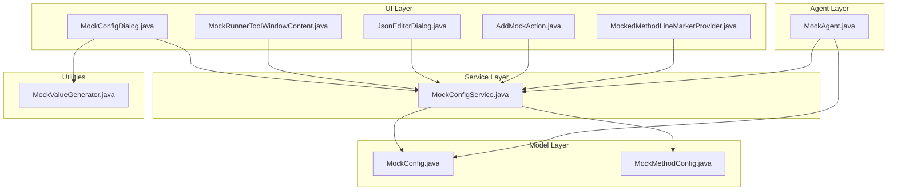
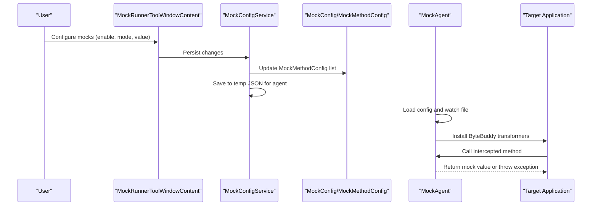
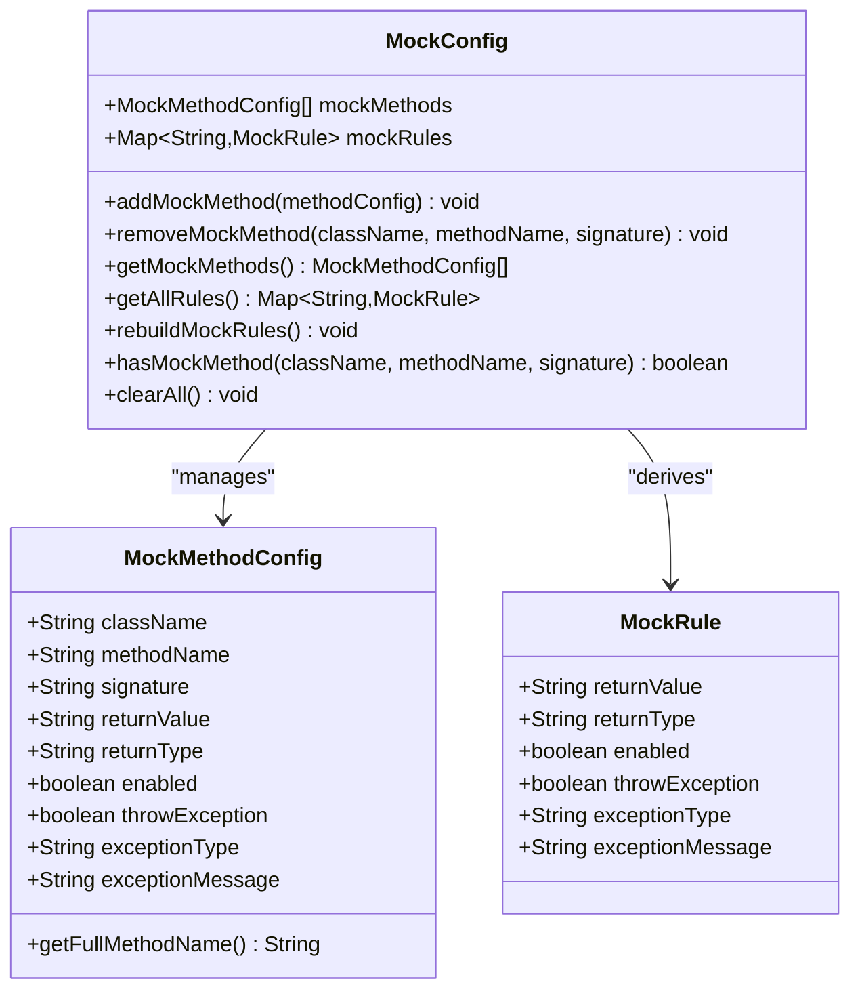
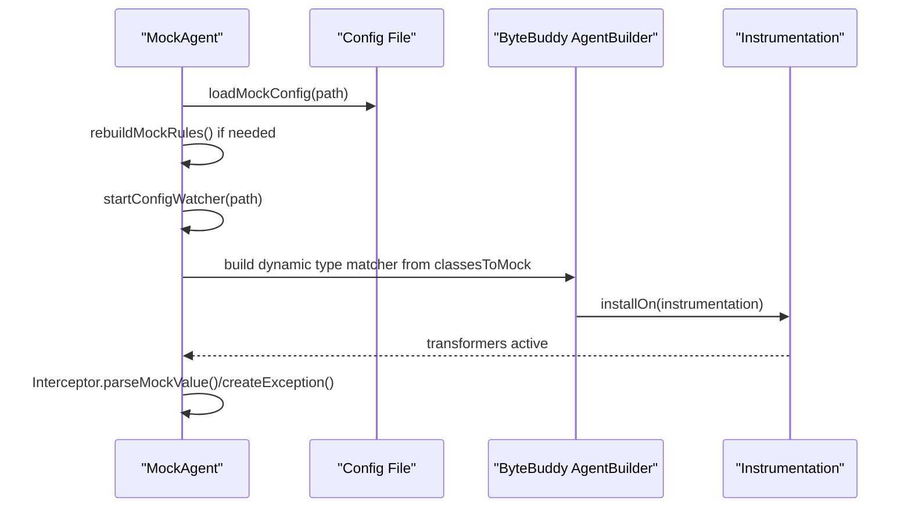
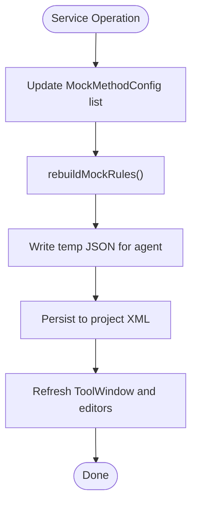
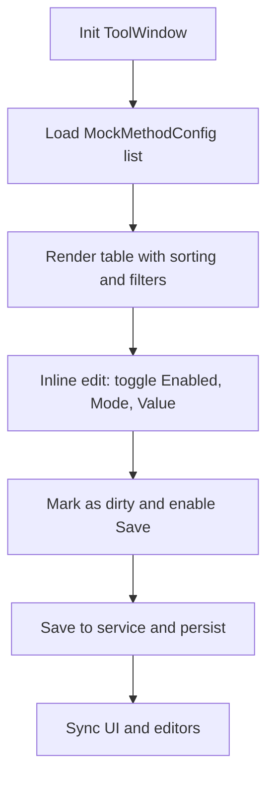
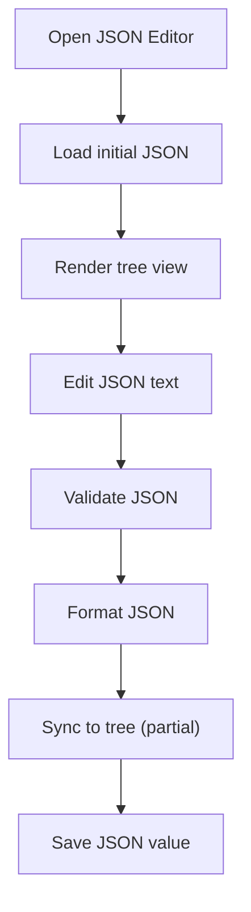
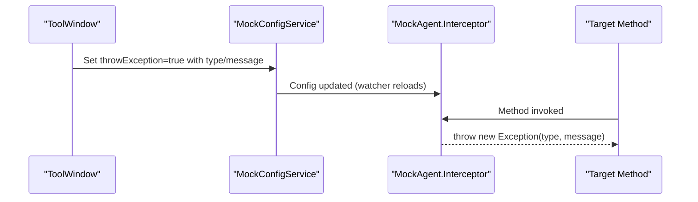
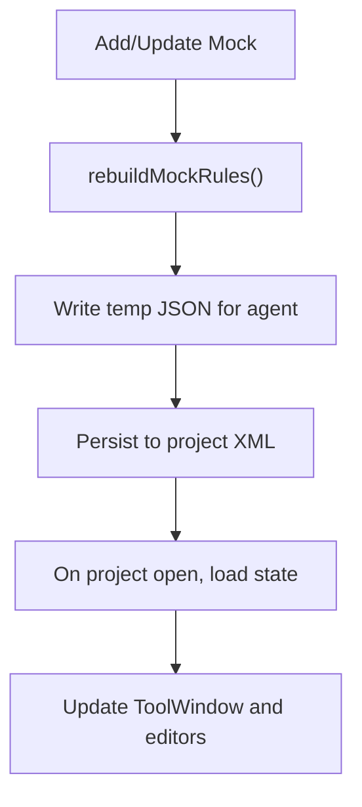
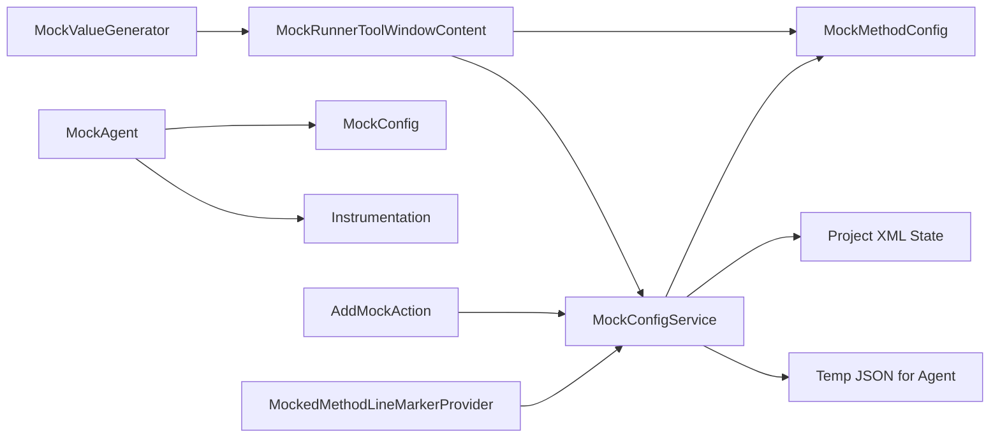

# Core Features

<cite>
**Referenced Files in This Document**
- [README.md](file://README.md)
- [MOCK_RUNNER_README.md](file://MOCK_RUNNER_README.md)
- [MockConfig.java](file://src/main/java/io/github/lancelothuxi/idea/plugin/mock/mock/MockConfig.java)
- [MockMethodConfig.java](file://src/main/java/io/github/lancelothuxi/idea/plugin/mock/mock/MockMethodConfig.java)
- [MockAgent.java](file://src/main/java/io/github/lancelothuxi/idea/plugin/mock/agent/MockAgent.java)
- [MockConfigService.java](file://src/main/java/io/github/lancelothuxi/idea/plugin/mock/service/MockConfigService.java)
- [MockConfigDialog.java](file://src/main/java/io/github/lancelothuxi/idea/plugin/mock/ui/MockConfigDialog.java)
- [MockRunnerToolWindowContent.java](file://src/main/java/io/github/lancelothuxi/idea/plugin/mock/ui/MockRunnerToolWindowContent.java)
- [JsonEditorDialog.java](file://src/main/java/io/github/lancelothuxi/idea/plugin/mock/ui/JsonEditorDialog.java)
- [MockValueGenerator.java](file://src/main/java/io/github/lancelothuxi/idea/plugin/mock/util/MockValueGenerator.java)
- [AddMockAction.java](file://src/main/java/io/github/lancelothuxi/idea/plugin/mock/action/AddMockAction.java)
- [MockedMethodLineMarkerProvider.java](file://src/main/java/io/github/lancelothuxi/idea/plugin/mock/marker/MockedMethodLineMarkerProvider.java)
- [MOCK_PERSISTENCE_GUIDE.md](file://docs/MOCK_PERSISTENCE_GUIDE.md)
- [DYNAMIC_CLASS_MATCHING.md](file://docs/DYNAMIC_CLASS_MATCHING.md)
</cite>

## Table of Contents
1. [Introduction](#introduction)
2. [Project Structure](#project-structure)
3. [Core Components](#core-components)
4. [Architecture Overview](#architecture-overview)
5. [Detailed Component Analysis](#detailed-component-analysis)
6. [Dependency Analysis](#dependency-analysis)
7. [Performance Considerations](#performance-considerations)
8. [Troubleshooting Guide](#troubleshooting-guide)
9. [Conclusion](#conclusion)
10. [Appendices](#appendices)

## Introduction
This document focuses on Mock Runner’s core features and the underlying architecture that powers runtime method mocking. It explains how the plugin enables:
- Runtime method mocking without changing source code
- A visual configuration system for managing mocks
- A robust JSON editor for complex return values
- Exception mocking for error scenario testing
- Persistent configuration storage across project sessions

It also details the mock configuration system (MockConfig and MockMethodConfig), the Java Agent implementation using ByteBuddy for runtime interception, the service layer and configuration management, and provides feature comparisons, limitations, best practices, and advanced usage patterns.

## Project Structure
The plugin is organized around a clear separation of concerns:
- UI layer: dialogs and tool window for configuration and editing
- Service layer: configuration persistence and synchronization
- Agent layer: runtime interception and method replacement
- Utilities: value generation and editor helpers

**Diagram sources**
- [MockConfigDialog.java](file://src/main/java/io/github/lancelothuxi/idea/plugin/mock/ui/MockConfigDialog.java#L1-L293)
- [MockRunnerToolWindowContent.java](file://src/main/java/io/github/lancelothuxi/idea/plugin/mock/ui/MockRunnerToolWindowContent.java#L1-L449)
- [JsonEditorDialog.java](file://src/main/java/io/github/lancelothuxi/idea/plugin/mock/ui/JsonEditorDialog.java#L1-L286)
- [AddMockAction.java](file://src/main/java/io/github/lancelothuxi/idea/plugin/mock/action/AddMockAction.java#L1-L106)
- [MockedMethodLineMarkerProvider.java](file://src/main/java/io/github/lancelothuxi/idea/plugin/mock/marker/MockedMethodLineMarkerProvider.java#L1-L63)
- [MockConfigService.java](file://src/main/java/io/github/lancelothuxi/idea/plugin/mock/service/MockConfigService.java#L1-L197)
- [MockConfig.java](file://src/main/java/io/github/lancelothuxi/idea/plugin/mock/mock/MockConfig.java#L1-L218)
- [MockMethodConfig.java](file://src/main/java/io/github/lancelothuxi/idea/plugin/mock/mock/MockMethodConfig.java#L1-L94)
- [MockAgent.java](file://src/main/java/io/github/lancelothuxi/idea/plugin/mock/agent/MockAgent.java#L1-L400)
- [MockValueGenerator.java](file://src/main/java/io/github/lancelothuxi/idea/plugin/mock/util/MockValueGenerator.java#L1-L289)

**Section sources**
- [README.md](file://README.md#L1-L296)
- [MOCK_RUNNER_README.md](file://MOCK_RUNNER_README.md#L1-L192)

## Core Components
This section introduces the five primary feature categories and how they are implemented.

- Runtime method mocking
  - Implemented via a Java Agent using ByteBuddy to intercept method calls at runtime and replace return values or throw exceptions based on configuration.
  - The agent dynamically matches classes from the mock configuration and installs transformers only for those classes.

- Visual configuration system
  - Provides a table-based UI in the Mock Runner tool window to manage mock methods, enable/disable them, switch modes (Return Value vs Exception), and edit values inline.
  - Includes search, pagination, and global enable/disable toggles.

- JSON editor capabilities
  - A dedicated JSON editor dialog supports visual editing, formatting, validation, and syncing between tree and text views.
  - Integrated into the tool window for inline editing of complex return values.

- Exception mocking
  - Allows configuring methods to throw exceptions instead of returning values, with configurable exception type and message.
  - Supported in both the visual UI and the agent interceptor logic.

- Persistent configuration storage
  - Mock configurations are persisted per project using IntelliJ’s PersistentStateComponent and stored in the project’s XML state.
  - Automatically synchronized to the UI and editor gutter icons.

**Section sources**
- [MockAgent.java](file://src/main/java/io/github/lancelothuxi/idea/plugin/mock/agent/MockAgent.java#L1-L400)
- [MockRunnerToolWindowContent.java](file://src/main/java/io/github/lancelothuxi/idea/plugin/mock/ui/MockRunnerToolWindowContent.java#L1-L449)
- [JsonEditorDialog.java](file://src/main/java/io/github/lancelothuxi/idea/plugin/mock/ui/JsonEditorDialog.java#L1-L286)
- [MockConfigService.java](file://src/main/java/io/github/lancelothuxi/idea/plugin/mock/service/MockConfigService.java#L1-L197)
- [MOCK_PERSISTENCE_GUIDE.md](file://docs/MOCK_PERSISTENCE_GUIDE.md#L1-L101)

## Architecture Overview
The system integrates UI, service, model, and agent layers to deliver runtime method mocking:

**Diagram sources**
- [MockRunnerToolWindowContent.java](file://src/main/java/io/github/lancelothuxi/idea/plugin/mock/ui/MockRunnerToolWindowContent.java#L1-L449)
- [MockConfigService.java](file://src/main/java/io/github/lancelothuxi/idea/plugin/mock/service/MockConfigService.java#L1-L197)
- [MockConfig.java](file://src/main/java/io/github/lancelothuxi/idea/plugin/mock/mock/MockConfig.java#L1-L218)
- [MockMethodConfig.java](file://src/main/java/io/github/lancelothuxi/idea/plugin/mock/mock/MockMethodConfig.java#L1-L94)
- [MockAgent.java](file://src/main/java/io/github/lancelothuxi/idea/plugin/mock/agent/MockAgent.java#L1-L400)

## Detailed Component Analysis

### Mock Configuration System: Data Models
The configuration system centers on two serializable models:
- MockMethodConfig: Encapsulates per-method configuration (class, method, signature, return value, return type, enabled flag, exception mode and details).
- MockConfig: Holds a list of MockMethodConfig entries and a derived map of MockRule for the agent. It also rebuilds MockRule entries from MockMethodConfig and infers return types when not specified.

**Diagram sources**
- [MockMethodConfig.java](file://src/main/java/io/github/lancelothuxi/idea/plugin/mock/mock/MockMethodConfig.java#L1-L94)
- [MockConfig.java](file://src/main/java/io/github/lancelothuxi/idea/plugin/mock/mock/MockConfig.java#L1-L218)

**Section sources**
- [MockMethodConfig.java](file://src/main/java/io/github/lancelothuxi/idea/plugin/mock/mock/MockMethodConfig.java#L1-L94)
- [MockConfig.java](file://src/main/java/io/github/lancelothuxi/idea/plugin/mock/mock/MockConfig.java#L1-L218)

### Java Agent Implementation with ByteBuddy
The agent loads mock configuration, watches for changes, and installs ByteBuddy transformers only for classes present in the configuration. It distinguishes between interface and concrete class methods and supports exception throwing and generic type parsing.

**Diagram sources**
- [MockAgent.java](file://src/main/java/io/github/lancelothuxi/idea/plugin/mock/agent/MockAgent.java#L1-L400)
- [DYNAMIC_CLASS_MATCHING.md](file://docs/DYNAMIC_CLASS_MATCHING.md#L1-L276)

**Section sources**
- [MockAgent.java](file://src/main/java/io/github/lancelothuxi/idea/plugin/mock/agent/MockAgent.java#L1-L400)
- [DYNAMIC_CLASS_MATCHING.md](file://docs/DYNAMIC_CLASS_MATCHING.md#L1-L276)

### Service Layer and Configuration Management
The service layer persists configurations to project state and synchronizes UI and editor gutter icons. It writes a temporary JSON file consumed by the agent and updates the tool window after loading state.

**Diagram sources**
- [MockConfigService.java](file://src/main/java/io/github/lancelothuxi/idea/plugin/mock/service/MockConfigService.java#L1-L197)
- [MOCK_PERSISTENCE_GUIDE.md](file://docs/MOCK_PERSISTENCE_GUIDE.md#L1-L101)

**Section sources**
- [MockConfigService.java](file://src/main/java/io/github/lancelothuxi/idea/plugin/mock/service/MockConfigService.java#L1-L197)
- [MOCK_PERSISTENCE_GUIDE.md](file://docs/MOCK_PERSISTENCE_GUIDE.md#L1-L101)

### Visual Configuration System
The tool window presents a paginated, searchable table of mocks with inline editing for mode and value. It supports global enable/disable, saving, clearing, and refresh operations.

**Diagram sources**
- [MockRunnerToolWindowContent.java](file://src/main/java/io/github/lancelothuxi/idea/plugin/mock/ui/MockRunnerToolWindowContent.java#L1-L449)

**Section sources**
- [MockRunnerToolWindowContent.java](file://src/main/java/io/github/lancelothuxi/idea/plugin/mock/ui/MockRunnerToolWindowContent.java#L1-L449)

### JSON Editor Capabilities
The JSON editor supports:
- Split-pane visual tree and text editor
- Formatting, validation, and syncing
- Adding/removing/editing fields
- Integration with the tool window for inline editing

**Diagram sources**
- [JsonEditorDialog.java](file://src/main/java/io/github/lancelothuxi/idea/plugin/mock/ui/JsonEditorDialog.java#L1-L286)

**Section sources**
- [JsonEditorDialog.java](file://src/main/java/io/github/lancelothuxi/idea/plugin/mock/ui/JsonEditorDialog.java#L1-L286)

### Exception Mocking
Exception mode allows specifying an exception type and message. The agent creates and throws the configured exception when the method is intercepted.

**Diagram sources**
- [MockRunnerToolWindowContent.java](file://src/main/java/io/github/lancelothuxi/idea/plugin/mock/ui/MockRunnerToolWindowContent.java#L1-L449)
- [MockAgent.java](file://src/main/java/io/github/lancelothuxi/idea/plugin/mock/agent/MockAgent.java#L1-L400)

**Section sources**
- [MockRunnerToolWindowContent.java](file://src/main/java/io/github/lancelothuxi/idea/plugin/mock/ui/MockRunnerToolWindowContent.java#L1-L449)
- [MockAgent.java](file://src/main/java/io/github/lancelothuxi/idea/plugin/mock/agent/MockAgent.java#L1-L400)

### Persistent Configuration Storage
Configurations are persisted per project and automatically loaded on project open. The service writes a temporary JSON file for the agent and stores a pretty-printed JSON in the project state.

**Diagram sources**
- [MockConfigService.java](file://src/main/java/io/github/lancelothuxi/idea/plugin/mock/service/MockConfigService.java#L1-L197)
- [MOCK_PERSISTENCE_GUIDE.md](file://docs/MOCK_PERSISTENCE_GUIDE.md#L1-L101)

**Section sources**
- [MockConfigService.java](file://src/main/java/io/github/lancelothuxi/idea/plugin/mock/service/MockConfigService.java#L1-L197)
- [MOCK_PERSISTENCE_GUIDE.md](file://docs/MOCK_PERSISTENCE_GUIDE.md#L1-L101)

## Dependency Analysis
The following diagram shows key dependencies among components:

**Diagram sources**
- [MockRunnerToolWindowContent.java](file://src/main/java/io/github/lancelothuxi/idea/plugin/mock/ui/MockRunnerToolWindowContent.java#L1-L449)
- [MockConfigService.java](file://src/main/java/io/github/lancelothuxi/idea/plugin/mock/service/MockConfigService.java#L1-L197)
- [MockConfig.java](file://src/main/java/io/github/lancelothuxi/idea/plugin/mock/mock/MockConfig.java#L1-L218)
- [MockMethodConfig.java](file://src/main/java/io/github/lancelothuxi/idea/plugin/mock/mock/MockMethodConfig.java#L1-L94)
- [MockAgent.java](file://src/main/java/io/github/lancelothuxi/idea/plugin/mock/agent/MockAgent.java#L1-L400)
- [MockValueGenerator.java](file://src/main/java/io/github/lancelothuxi/idea/plugin/mock/util/MockValueGenerator.java#L1-L289)
- [AddMockAction.java](file://src/main/java/io/github/lancelothuxi/idea/plugin/mock/action/AddMockAction.java#L1-L106)
- [MockedMethodLineMarkerProvider.java](file://src/main/java/io/github/lancelothuxi/idea/plugin/mock/marker/MockedMethodLineMarkerProvider.java#L1-L63)

**Section sources**
- [MockRunnerToolWindowContent.java](file://src/main/java/io/github/lancelothuxi/idea/plugin/mock/ui/MockRunnerToolWindowContent.java#L1-L449)
- [MockConfigService.java](file://src/main/java/io/github/lancelothuxi/idea/plugin/mock/service/MockConfigService.java#L1-L197)
- [MockAgent.java](file://src/main/java/io/github/lancelothuxi/idea/plugin/mock/agent/MockAgent.java#L1-L400)

## Performance Considerations
- Dynamic class matching: The agent builds a type matcher from configured classes, avoiding unnecessary transformations and improving performance compared to scanning entire packages.
- Config watcher: The agent polls the configuration file periodically to detect changes, enabling hot reload without restarting the application.
- Generic type parsing: The agent attempts to parse JSON into strongly-typed collections and objects, falling back gracefully when class types are not resolvable.
- UI pagination: The tool window limits visible rows to improve responsiveness with large mock sets.

[No sources needed since this section provides general guidance]

## Troubleshooting Guide
Common issues and resolutions:
- Agent not loading or no mocks applied
  - Ensure “Run with Mock” is used and the agent receives a valid configuration path.
  - Confirm the configuration file exists and is readable.
- Mock not working
  - Verify the method is enabled and the return type matches the configuration.
  - Check that the method signature is correct and the class is included in the agent’s dynamic matcher.
- Exception mode not throwing
  - Confirm exception mode is enabled and the exception type is valid; the agent falls back to a runtime exception if instantiation fails.
- Generic type parsing issues
  - Ensure the configured return type matches the method signature; the agent attempts to resolve inner types for generics.
- Persistence not restored
  - Confirm the project XML state file exists and is not corrupted; the service logs loading and updating actions.

**Section sources**
- [MockAgent.java](file://src/main/java/io/github/lancelothuxi/idea/plugin/mock/agent/MockAgent.java#L1-L400)
- [MockConfigService.java](file://src/main/java/io/github/lancelothuxi/idea/plugin/mock/service/MockConfigService.java#L1-L197)
- [MOCK_PERSISTENCE_GUIDE.md](file://docs/MOCK_PERSISTENCE_GUIDE.md#L1-L101)

## Conclusion
Mock Runner delivers a robust, developer-friendly solution for runtime method mocking:
- Runtime interception via ByteBuddy with dynamic class matching
- A comprehensive visual configuration system with search, pagination, and inline editing
- Powerful JSON editor for complex return values
- Exception mocking for error scenario testing
- Persistent configuration storage integrated with the project lifecycle

These features combine to provide a flexible, efficient, and maintainable approach to mocking in development and testing workflows.

[No sources needed since this section summarizes without analyzing specific files]

## Appendices

### Feature Comparison Matrix
- Runtime method mocking
  - Supports return value mocking and exception throwing
  - Uses ByteBuddy for safe, dynamic interception
- Visual configuration system
  - Table UI with search, pagination, global toggles, and inline editing
- JSON editor
  - Split-pane visual/text editing, formatting, validation, partial tree-to-text sync
- Exception mocking
  - Configurable exception type and message; agent instantiates and throws
- Persistent configuration storage
  - Per-project XML state and temporary JSON for agent consumption

[No sources needed since this section provides general guidance]

### Best Practices
- Keep return types precise in configuration to avoid parsing ambiguity
- Use the JSON editor for complex objects and collections
- Leverage exception mode to simulate error conditions during testing
- Persist configurations to share across team members
- Use the tool window’s search and pagination to manage large sets of mocks

[No sources needed since this section provides general guidance]

### Advanced Usage Patterns
- Combine exception mocking with return value mocking across different methods in the same project
- Use the JSON editor to generate representative data for domain objects and collections
- Dynamically switch between Return Value and Exception modes for the same method during testing
- Persist configurations to version control for reproducible test environments

[No sources needed since this section provides general guidance]