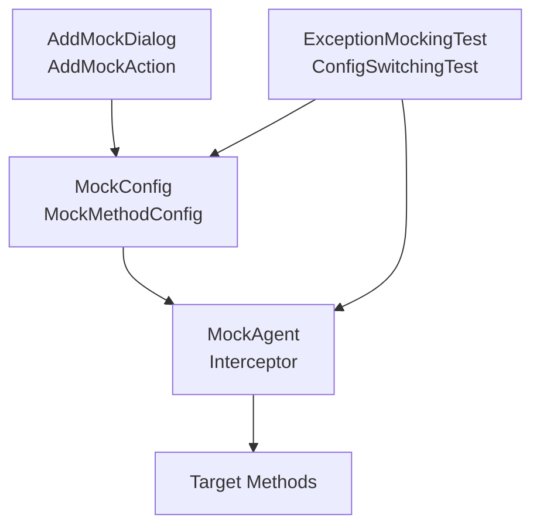
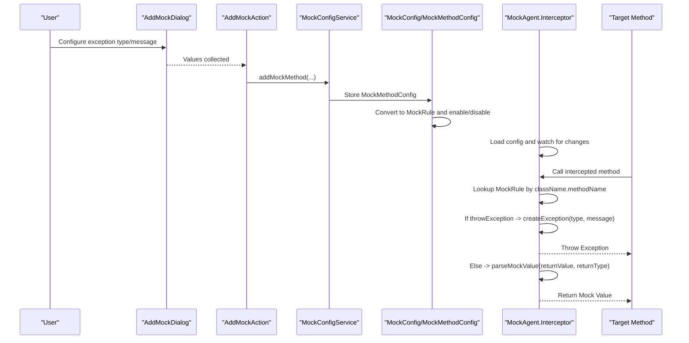
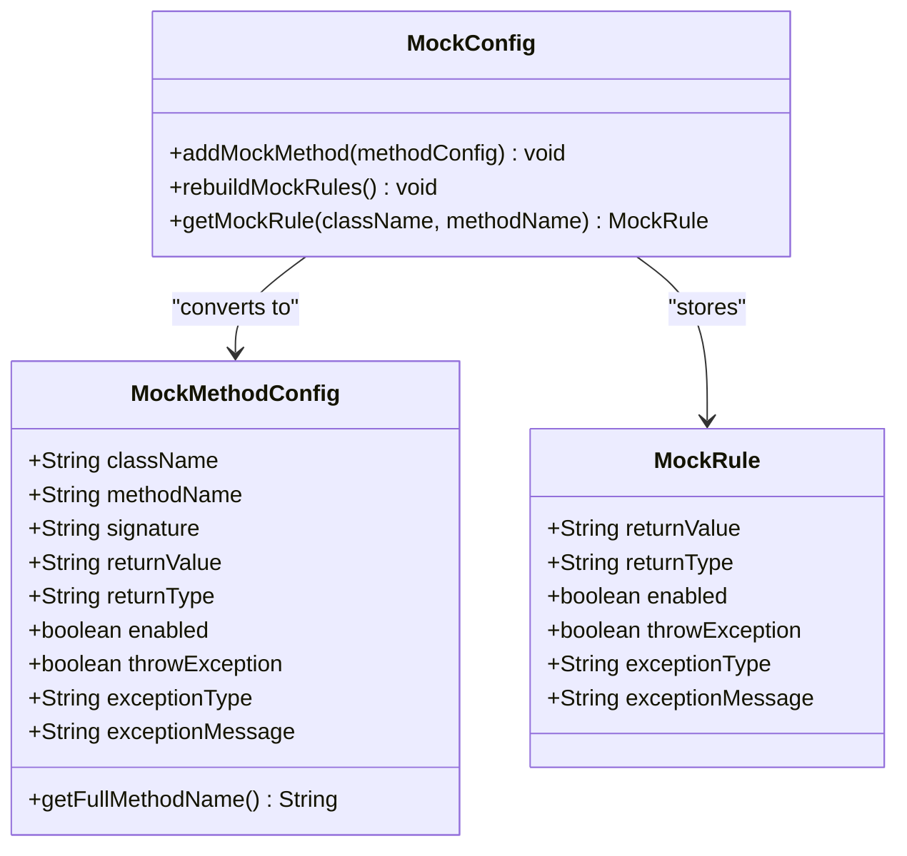
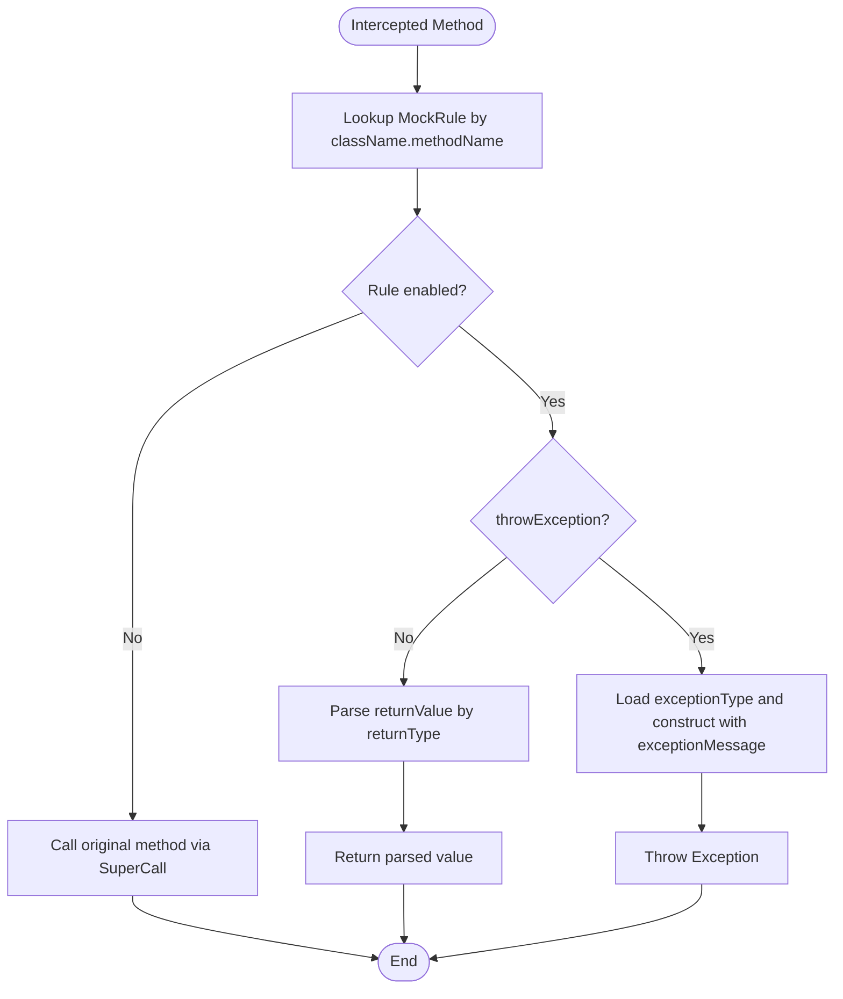
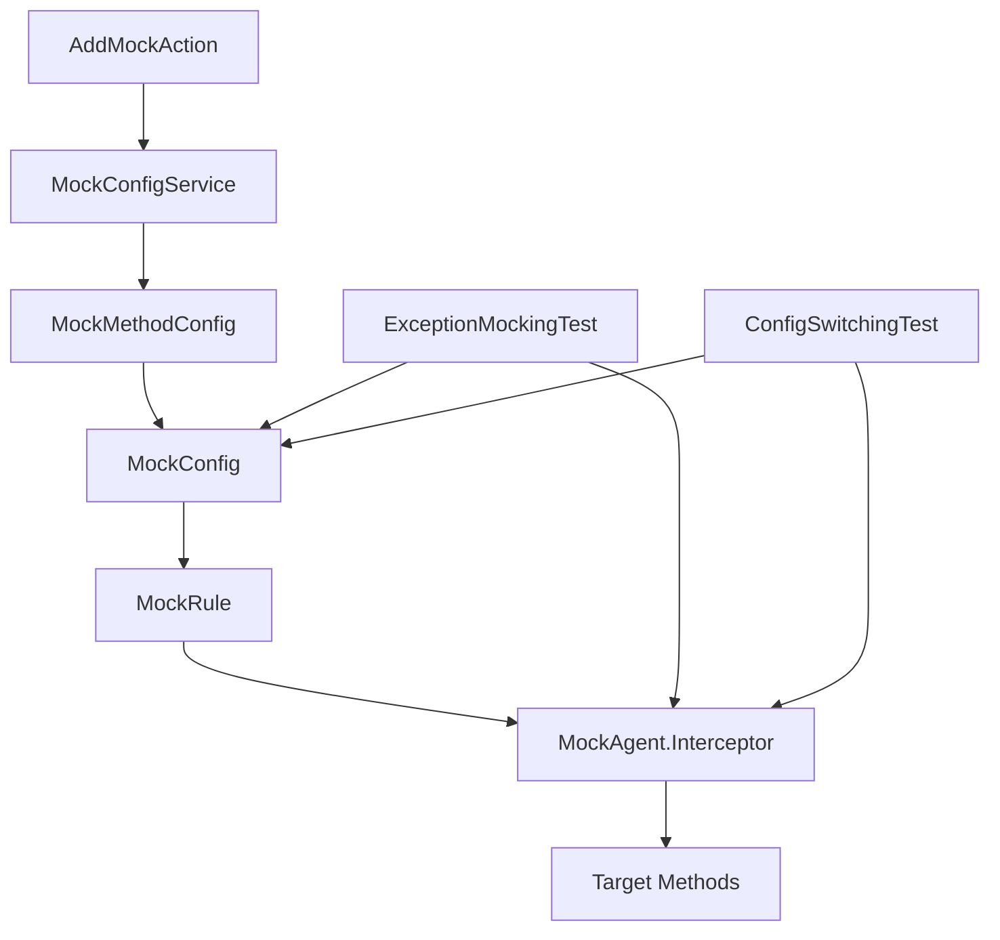

# Exception Mocking Capabilities

<cite>
**Referenced Files in This Document**
- [MockMethodConfig.java](file://src/main/java/io/github/lancelothuxi/idea/plugin/mock/mock/MockMethodConfig.java)
- [MockConfig.java](file://src/main/java/io/github/lancelothuxi/idea/plugin/mock/mock/MockConfig.java)
- [MockAgent.java](file://src/main/java/io/github/lancelothuxi/idea/plugin/mock/agent/MockAgent.java)
- [AddMockAction.java](file://src/main/java/io/github/lancelothuxi/idea/plugin/mock/action/AddMockAction.java)
- [AddMockDialog.java](file://src/main/java/io/github/lancelothuxi/idea/plugin/mock/ui/AddMockDialog.java)
- [ExceptionMockingTest.java](file://src/test/java/test/ExceptionMockingTest.java)
- [ConfigSwitchingTest.java](file://src/test/java/test/ConfigSwitchingTest.java)
</cite>

## Table of Contents
1. [Introduction](#introduction)
2. [Project Structure](#project-structure)
3. [Core Components](#core-components)
4. [Architecture Overview](#architecture-overview)
5. [Detailed Component Analysis](#detailed-component-analysis)
6. [Dependency Analysis](#dependency-analysis)
7. [Performance Considerations](#performance-considerations)
8. [Troubleshooting Guide](#troubleshooting-guide)
9. [Conclusion](#conclusion)
10. [Appendices](#appendices)

## Introduction
This document explains the exception mocking capabilities of the Mock Runner plugin. It focuses on how exceptions are configured, selected, instantiated, and propagated during method interception. The documentation covers the configuration model, the runtime interception pipeline, supported exception types, and practical scenarios for testing error conditions and simulating failure states.

## Project Structure
The exception mocking system spans configuration, UI, agent interception, and tests:
- Configuration model: MockMethodConfig and MockConfig define the exception fields and rule storage.
- Runtime interception: MockAgent transforms method calls and either returns mock values or throws configured exceptions.
- UI integration: AddMockAction and AddMockDialog collect user inputs for exception configuration.
- Tests: ExceptionMockingTest and ConfigSwitchingTest demonstrate usage and switching between exception and return-value modes.

**Diagram sources**
- [AddMockDialog.java](file://src/main/java/io/github/lancelothuxi/idea/plugin/mock/ui/AddMockDialog.java#L121-L156)
- [AddMockAction.java](file://src/main/java/io/github/lancelothuxi/idea/plugin/mock/action/AddMockAction.java#L60-L82)
- [MockConfig.java](file://src/main/java/io/github/lancelothuxi/idea/plugin/mock/mock/MockConfig.java#L14-L217)
- [MockMethodConfig.java](file://src/main/java/io/github/lancelothuxi/idea/plugin/mock/mock/MockMethodConfig.java#L1-L94)
- [MockAgent.java](file://src/main/java/io/github/lancelothuxi/idea/plugin/mock/agent/MockAgent.java#L202-L339)
- [ExceptionMockingTest.java](file://src/test/java/test/ExceptionMockingTest.java#L15-L111)
- [ConfigSwitchingTest.java](file://src/test/java/test/ConfigSwitchingTest.java#L12-L158)

**Section sources**
- [MockMethodConfig.java](file://src/main/java/io/github/lancelothuxi/idea/plugin/mock/mock/MockMethodConfig.java#L1-L94)
- [MockConfig.java](file://src/main/java/io/github/lancelothuxi/idea/plugin/mock/mock/MockConfig.java#L1-L218)
- [MockAgent.java](file://src/main/java/io/github/lancelothuxi/idea/plugin/mock/agent/MockAgent.java#L1-L400)
- [AddMockAction.java](file://src/main/java/io/github/lancelothuxi/idea/plugin/mock/action/AddMockAction.java#L1-L106)
- [AddMockDialog.java](file://src/main/java/io/github/lancelothuxi/idea/plugin/mock/ui/AddMockDialog.java#L121-L156)
- [ExceptionMockingTest.java](file://src/test/java/test/ExceptionMockingTest.java#L15-L111)
- [ConfigSwitchingTest.java](file://src/test/java/test/ConfigSwitchingTest.java#L12-L158)

## Core Components
This section documents the exception configuration system and the fields that influence method execution.

- MockMethodConfig exception fields
  - exceptionType: Fully qualified exception class name used for instantiation.
  - exceptionMessage: Message passed to the exception constructor.
  - throwException: Enables exception mode; when true, the agent throws an exception instead of returning a value.
  - returnValue/returnType: Define the mock return value and type when not throwing an exception.
  - enabled: Controls whether the rule applies.

- MockConfig.MockRule exception fields
  - exceptionType: Same as above.
  - exceptionMessage: Same as above.
  - throwException: Same as above.
  - returnValue/returnType: Same as above.
  - enabled: Same as above.

- Impact on method execution
  - If enabled is false, the original method executes.
  - If throwException is true, the agent instantiates and throws an exception of the specified type with the given message.
  - Otherwise, the agent parses and returns the configured mock value according to the declared return type.

**Section sources**
- [MockMethodConfig.java](file://src/main/java/io/github/lancelothuxi/idea/plugin/mock/mock/MockMethodConfig.java#L14-L88)
- [MockConfig.java](file://src/main/java/io/github/lancelothuxi/idea/plugin/mock/mock/MockConfig.java#L144-L216)

## Architecture Overview
The exception mocking pipeline consists of:
- UI capture: The dialog collects exception type and message and forwards them to the configuration service.
- Configuration storage: MockMethodConfig stores the rule; MockConfig converts it to MockRule and manages the rule map.
- Agent interception: MockAgent inspects each intercepted method call and decides whether to throw an exception or return a mock value.
- Exception creation: The interceptor dynamically loads the exception class and constructs it with a string message.

**Diagram sources**
- [AddMockDialog.java](file://src/main/java/io/github/lancelothuxi/idea/plugin/mock/ui/AddMockDialog.java#L121-L156)
- [AddMockAction.java](file://src/main/java/io/github/lancelothuxi/idea/plugin/mock/action/AddMockAction.java#L60-L82)
- [MockConfig.java](file://src/main/java/io/github/lancelothuxi/idea/plugin/mock/mock/MockConfig.java#L33-L86)
- [MockAgent.java](file://src/main/java/io/github/lancelothuxi/idea/plugin/mock/agent/MockAgent.java#L202-L339)

## Detailed Component Analysis

### Exception Configuration Model
The configuration model supports two complementary representations:
- MockMethodConfig: Used primarily by the UI and service layer to define per-method behavior, including exception settings.
- MockConfig.MockRule: The runtime representation stored in the rule map and consumed by the agent.

Key exception-related fields:
- exceptionType: Defaults to a standard runtime exception type; can be overridden to any subclass of Exception.
- exceptionMessage: Defaults to a generic message; can be customized.
- throwException: Defaults to false; toggles between exception mode and return-value mode.
- enabled: Defaults to true; disables the rule when false.

**Diagram sources**
- [MockMethodConfig.java](file://src/main/java/io/github/lancelothuxi/idea/plugin/mock/mock/MockMethodConfig.java#L5-L92)
- [MockConfig.java](file://src/main/java/io/github/lancelothuxi/idea/plugin/mock/mock/MockConfig.java#L14-L86)

**Section sources**
- [MockMethodConfig.java](file://src/main/java/io/github/lancelothuxi/idea/plugin/mock/mock/MockMethodConfig.java#L14-L88)
- [MockConfig.java](file://src/main/java/io/github/lancelothuxi/idea/plugin/mock/mock/MockConfig.java#L33-L86)

### Exception Throwing Mechanism
The agent’s interceptor implements the exception throwing logic:
- Rule lookup: For each intercepted method, the agent retrieves the rule by class+method key.
- Mode check: If the rule is enabled and throwException is true, the agent attempts to create and throw an exception.
- Exception creation: The agent dynamically loads the exception class by name and constructs it with a string message. If class loading fails, it falls back to a standard runtime exception.
- Propagation: The created exception propagates up the call stack, interrupting normal execution.

**Diagram sources**
- [MockAgent.java](file://src/main/java/io/github/lancelothuxi/idea/plugin/mock/agent/MockAgent.java#L202-L339)

**Section sources**
- [MockAgent.java](file://src/main/java/io/github/lancelothuxi/idea/plugin/mock/agent/MockAgent.java#L220-L230)
- [MockAgent.java](file://src/main/java/io/github/lancelothuxi/idea/plugin/mock/agent/MockAgent.java#L328-L338)

### Supported Exception Types and Custom Creation
- Supported exception types: Any class that is assignable to Exception and has a constructor accepting a single String argument can be used. The system dynamically loads the class by its fully qualified name.
- Fallback behavior: If the specified exception class cannot be loaded or is invalid, the agent falls back to a standard runtime exception.
- Custom exception messages: The configured message is passed to the exception constructor.

Practical examples (conceptual):
- IllegalArgumentException with a custom message.
- NullPointerException with a domain-specific message.
- Custom subclasses of Exception for domain-specific error handling.

**Section sources**
- [MockAgent.java](file://src/main/java/io/github/lancelothuxi/idea/plugin/mock/agent/MockAgent.java#L328-L338)
- [ExceptionMockingTest.java](file://src/test/java/test/ExceptionMockingTest.java#L74-L95)

### Exception Propagation Handling
- The interceptor throws the constructed exception directly, allowing the caller to handle it as needed.
- For interface methods (e.g., Dubbo/Feign), a dedicated interface interceptor follows the same pattern.
- If no rule is found or the rule is disabled, the agent calls the original method, preserving normal behavior.

**Section sources**
- [MockAgent.java](file://src/main/java/io/github/lancelothuxi/idea/plugin/mock/agent/MockAgent.java#L344-L398)

### Practical Scenarios and Examples
- Testing error conditions: Configure a method to throw a specific exception type and assert that downstream code handles it appropriately.
- Validating exception handling code: Ensure that catch blocks, fallback logic, and logging are executed under mocked failures.
- Simulating failure states: Replace real service calls with exceptions to exercise resilience and retry logic.

Examples from tests:
- ExceptionMockingTest demonstrates throwing a specific exception type with a custom message and verifying the message.
- ConfigSwitchingTest shows toggling between exception mode and return-value mode for the same method and verifying the updated behavior.

**Section sources**
- [ExceptionMockingTest.java](file://src/test/java/test/ExceptionMockingTest.java#L20-L62)
- [ConfigSwitchingTest.java](file://src/test/java/test/ConfigSwitchingTest.java#L14-L101)

### Parameterized Exceptions and Chained Exceptions
- Parameterized exceptions: The system constructs exceptions using a single-string constructor. To simulate parameterized exceptions, configure a message that embeds parameters and assert the message content.
- Chained exceptions: While the interceptor creates a single exception instance, you can configure a message that describes the causal chain and assert the presence of expected cause-related information in logs or higher-level handlers.

[No sources needed since this section provides conceptual guidance]

## Dependency Analysis
The exception mocking system exhibits clear separation of concerns:
- UI captures configuration and delegates to the service layer.
- MockConfig stores and transforms configurations into runtime rules.
- MockAgent consumes rules and enforces behavior at runtime.
- Tests validate both exception throwing and mode switching.

**Diagram sources**
- [AddMockAction.java](file://src/main/java/io/github/lancelothuxi/idea/plugin/mock/action/AddMockAction.java#L60-L82)
- [MockConfig.java](file://src/main/java/io/github/lancelothuxi/idea/plugin/mock/mock/MockConfig.java#L33-L86)
- [MockAgent.java](file://src/main/java/io/github/lancelothuxi/idea/plugin/mock/agent/MockAgent.java#L202-L339)
- [ExceptionMockingTest.java](file://src/test/java/test/ExceptionMockingTest.java#L15-L111)
- [ConfigSwitchingTest.java](file://src/test/java/test/ConfigSwitchingTest.java#L12-L158)

**Section sources**
- [MockConfig.java](file://src/main/java/io/github/lancelothuxi/idea/plugin/mock/mock/MockConfig.java#L19-L86)
- [MockAgent.java](file://src/main/java/io/github/lancelothuxi/idea/plugin/mock/agent/MockAgent.java#L202-L339)

## Performance Considerations
- Reflection overhead: Dynamic class loading occurs only when exception mode is triggered and a rule is matched. This minimizes overhead when no exceptions are configured.
- JSON parsing and rule rebuilding: When loading configuration from disk, the agent rebuilds rules; avoid frequent reloads in performance-sensitive environments.
- Generic type parsing: Complex return types incur JSON parsing costs; keep return values simple when possible.

[No sources needed since this section provides general guidance]

## Troubleshooting Guide
Common issues and resolutions:
- Invalid exception type: If the configured exception class cannot be loaded, the agent falls back to a standard runtime exception. Verify the fully qualified class name and ensure it is on the classpath.
- Empty or malformed messages: Ensure the exception message is set; otherwise, the default message is used.
- Rule not applied: Confirm that enabled is true and that the class+method key matches the intercepted call.
- Interface methods: For Dubbo/Feign, ensure the interface method is properly configured; missing rules result in an unsupported operation error.

**Section sources**
- [MockAgent.java](file://src/main/java/io/github/lancelothuxi/idea/plugin/mock/agent/MockAgent.java#L328-L338)
- [MockAgent.java](file://src/main/java/io/github/lancelothuxi/idea/plugin/mock/agent/MockAgent.java#L361-L384)

## Conclusion
The exception mocking system provides a flexible and robust mechanism to simulate failures in both unit and integration contexts. By configuring exception types, messages, and modes, developers can comprehensively test error handling, validate resilience, and simulate realistic failure states. The separation between UI-driven configuration and runtime enforcement ensures maintainability and ease of use.

[No sources needed since this section summarizes without analyzing specific files]

## Appendices

### Best Practices for Exception Mocking
- Prefer specific exception types that align with your domain to improve test clarity.
- Use descriptive exception messages to aid debugging and assertions.
- Keep exception rules scoped to targeted methods to avoid unintended side effects.
- Combine exception mocking with return-value mocking to test both success and failure paths.
- In integration tests, leverage the agent’s automatic rule reloading to iterate quickly on configurations.

[No sources needed since this section provides general guidance]