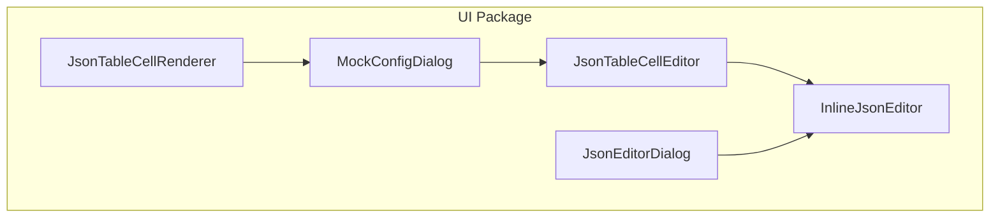
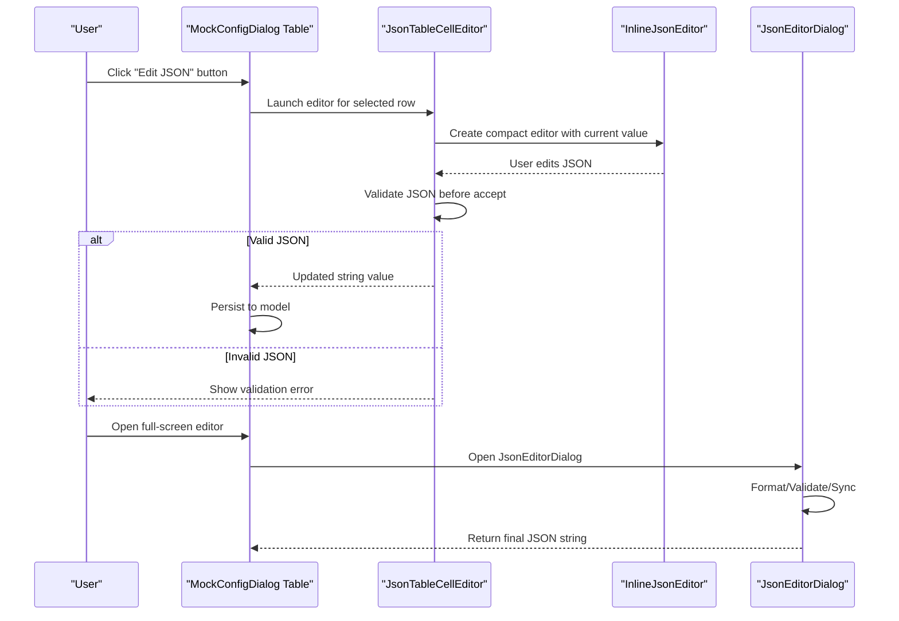
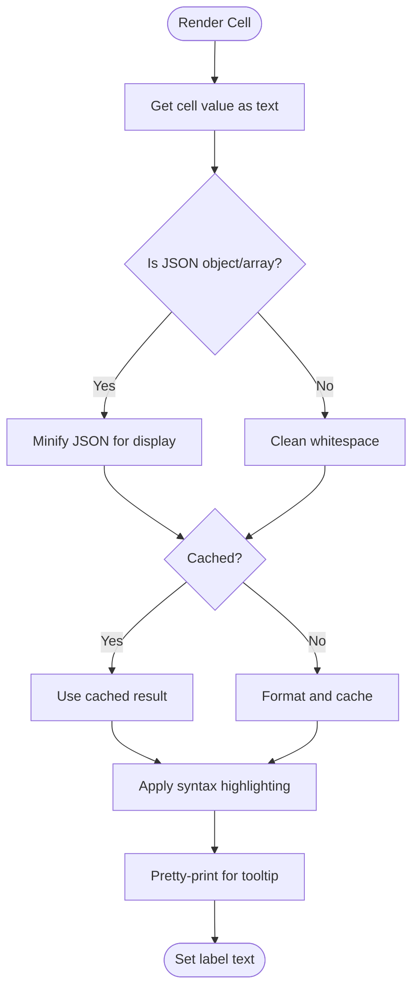
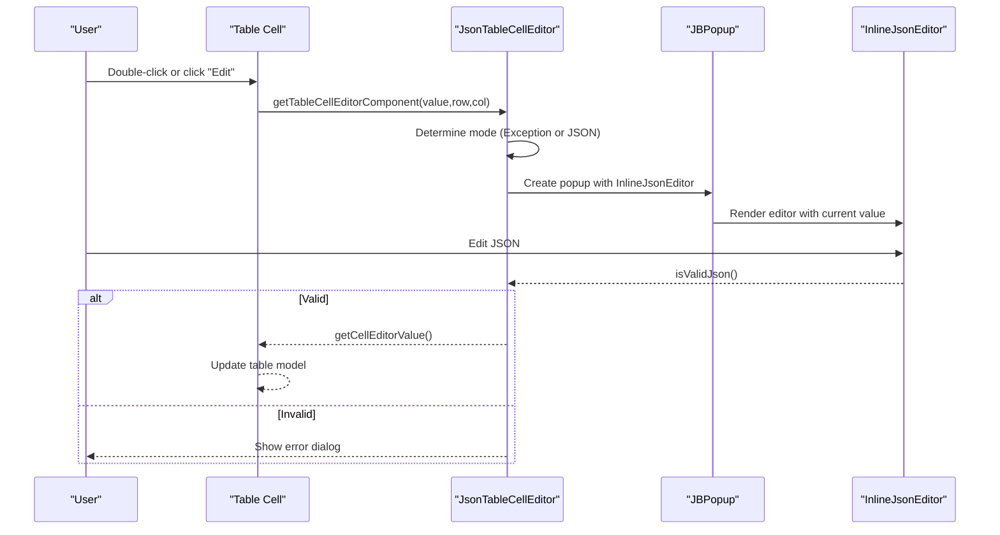
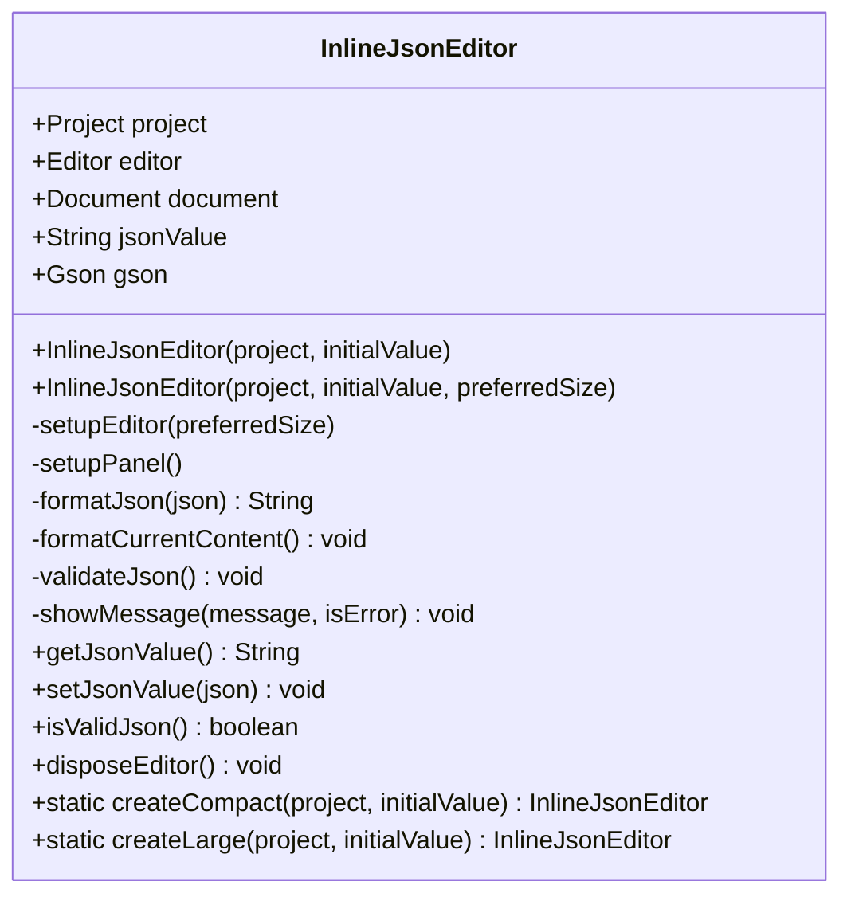
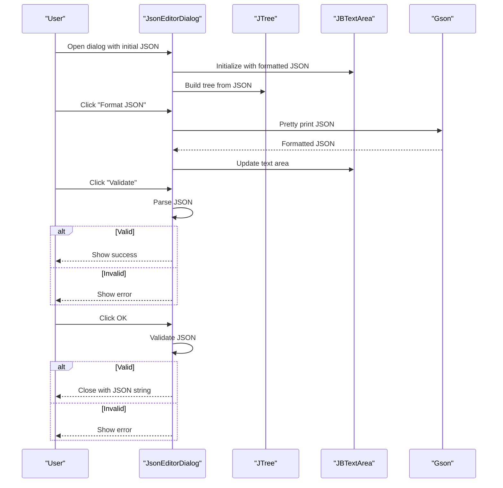
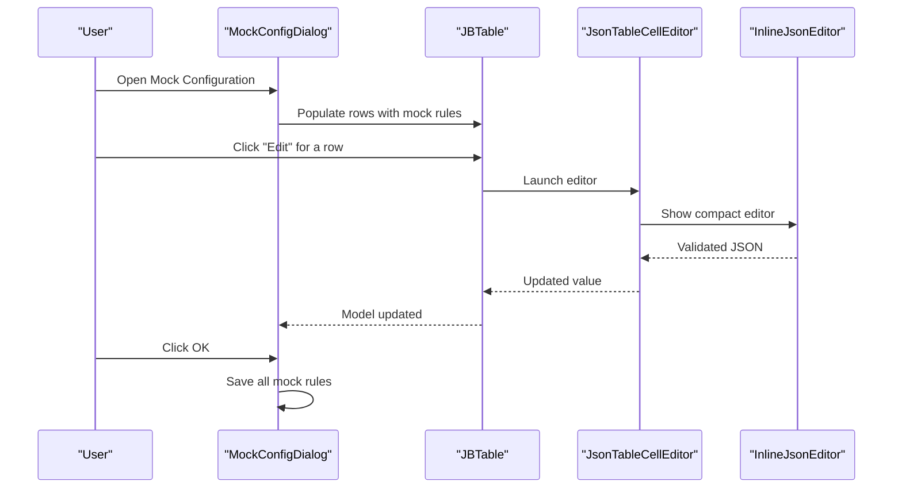
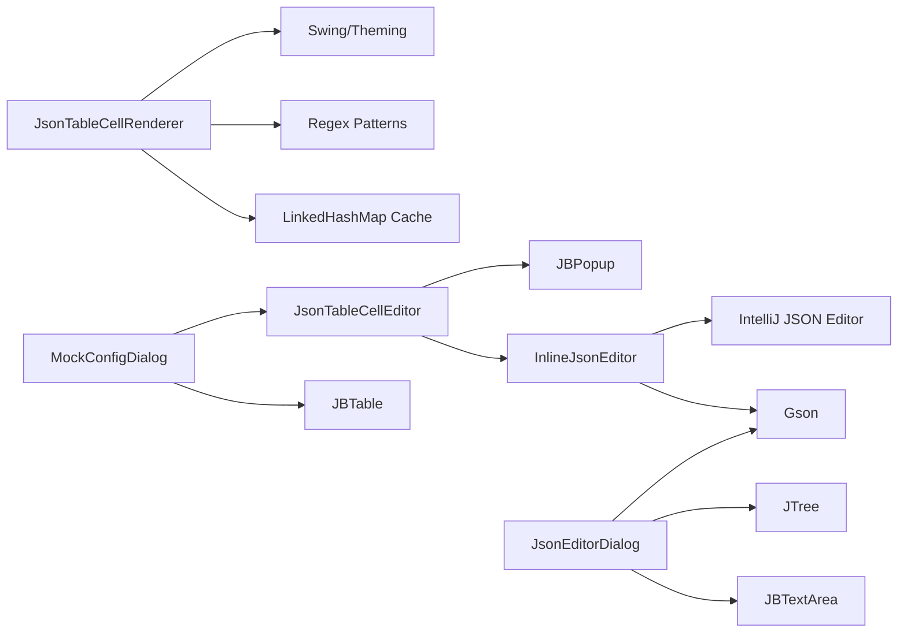

# JSON Editor System

<cite>
**Referenced Files in This Document**
- [JsonTableCellRenderer.java](file://src/main/java/io/github/lancelothuxi/idea/plugin/mock/ui/JsonTableCellRenderer.java)
- [JsonTableCellEditor.java](file://src/main/java/io/github/lancelothuxi/idea/plugin/mock/ui/JsonTableCellEditor.java)
- [JsonEditorDialog.java](file://src/main/java/io/github/lancelothuxi/idea/plugin/mock/ui/JsonEditorDialog.java)
- [InlineJsonEditor.java](file://src/main/java/io/github/lancelothuxi/idea/plugin/mock/ui/InlineJsonEditor.java)
- [MockConfigDialog.java](file://src/main/java/io/github/lancelothuxi/idea/plugin/mock/ui/MockConfigDialog.java)
- [JsonTableCellRendererDemo.java](file://src/main/java/io/github/lancelothuxi/idea/plugin/mock/demo/JsonTableCellRendererDemo.java)
- [JsonTableCellRenderer-使用指南.md](file://JsonTableCellRenderer-使用指南.md)
</cite>

## Table of Contents
1. [Introduction](#introduction)
2. [Project Structure](#project-structure)
3. [Core Components](#core-components)
4. [Architecture Overview](#architecture-overview)
5. [Detailed Component Analysis](#detailed-component-analysis)
6. [Dependency Analysis](#dependency-analysis)
7. [Performance Considerations](#performance-considerations)
8. [Troubleshooting Guide](#troubleshooting-guide)
9. [Conclusion](#conclusion)

## Introduction
This document describes the JSON editor system used in the mock configuration interface. It covers three complementary components:
- JsonTableCellRenderer: renders complex JSON in table cells with syntax highlighting and formatting.
- JsonTableCellEditor: enables inline JSON editing within the mock configuration table via a compact editor.
- JsonEditorDialog: provides a full-screen, split-pane dialog for advanced JSON editing with validation and tree visualization.

The system integrates with the mock configuration dialog, supports real-time validation, and serializes edited values back to string representations for persistence.

## Project Structure
The JSON editor system resides under the UI package and integrates with the mock configuration dialog:
- JsonTableCellRenderer: table cell rendering with syntax highlighting and tooltips.
- JsonTableCellEditor: table cell editor launching a compact inline editor.
- InlineJsonEditor: lightweight editor component leveraging IntelliJ's JSON editor infrastructure.
- JsonEditorDialog: advanced editor with split-pane text and tree views, plus validation controls.
- MockConfigDialog: hosts the mock configuration table and wires JSON editing into the workflow.

**Diagram sources**
- [JsonTableCellRenderer.java](file://src/main/java/io/github/lancelothuxi/idea/plugin/mock/ui/JsonTableCellRenderer.java#L1-L340)
- [JsonTableCellEditor.java](file://src/main/java/io/github/lancelothuxi/idea/plugin/mock/ui/JsonTableCellEditor.java#L1-L298)
- [InlineJsonEditor.java](file://src/main/java/io/github/lancelothuxi/idea/plugin/mock/ui/InlineJsonEditor.java#L1-L190)
- [JsonEditorDialog.java](file://src/main/java/io/github/lancelothuxi/idea/plugin/mock/ui/JsonEditorDialog.java#L1-L286)
- [MockConfigDialog.java](file://src/main/java/io/github/lancelothuxi/idea/plugin/mock/ui/MockConfigDialog.java#L1-L293)

**Section sources**
- [JsonTableCellRenderer.java](file://src/main/java/io/github/lancelothuxi/idea/plugin/mock/ui/JsonTableCellRenderer.java#L1-L340)
- [JsonTableCellEditor.java](file://src/main/java/io/github/lancelothuxi/idea/plugin/mock/ui/JsonTableCellEditor.java#L1-L298)
- [InlineJsonEditor.java](file://src/main/java/io/github/lancelothuxi/idea/plugin/mock/ui/InlineJsonEditor.java#L1-L190)
- [JsonEditorDialog.java](file://src/main/java/io/github/lancelothuxi/idea/plugin/mock/ui/JsonEditorDialog.java#L1-L286)
- [MockConfigDialog.java](file://src/main/java/io/github/lancelothuxi/idea/plugin/mock/ui/MockConfigDialog.java#L1-L293)

## Core Components
- JsonTableCellRenderer
  - Formats JSON for display and tooltips, applies syntax highlighting, and truncates long content.
  - Uses LRU caching to optimize repeated rendering.
  - Provides monospaced font and theme-aware colors.
- JsonTableCellEditor
  - Launches a compact inline editor in a popup when editing table cells.
  - Supports exception-mode editing for special configurations.
  - Validates JSON before accepting edits.
- InlineJsonEditor
  - A reusable component built on IntelliJ’s JSON editor infrastructure.
  - Offers format and validate actions, and auto-formatting on focus loss.
- JsonEditorDialog
  - Full-screen dialog with split-pane layout: tree view on the left, JSON text area on the right.
  - Provides buttons to format, validate, and synchronize between tree and text.
  - Validates JSON on OK and stores the final value.

**Section sources**
- [JsonTableCellRenderer.java](file://src/main/java/io/github/lancelothuxi/idea/plugin/mock/ui/JsonTableCellRenderer.java#L14-L340)
- [JsonTableCellEditor.java](file://src/main/java/io/github/lancelothuxi/idea/plugin/mock/ui/JsonTableCellEditor.java#L17-L298)
- [InlineJsonEditor.java](file://src/main/java/io/github/lancelothuxi/idea/plugin/mock/ui/InlineJsonEditor.java#L23-L190)
- [JsonEditorDialog.java](file://src/main/java/io/github/lancelothuxi/idea/plugin/mock/ui/JsonEditorDialog.java#L19-L286)

## Architecture Overview
The JSON editor system is layered:
- Rendering layer: JsonTableCellRenderer displays JSON in tables.
- Editing layer: JsonTableCellEditor triggers InlineJsonEditor for inline editing.
- Advanced editing layer: JsonEditorDialog provides a full-screen editor with tree/text synchronization.
- Integration layer: MockConfigDialog orchestrates the entire mock configuration workflow and injects JSON editing into the table.

**Diagram sources**
- [MockConfigDialog.java](file://src/main/java/io/github/lancelothuxi/idea/plugin/mock/ui/MockConfigDialog.java#L214-L256)
- [JsonTableCellEditor.java](file://src/main/java/io/github/lancelothuxi/idea/plugin/mock/ui/JsonTableCellEditor.java#L75-L157)
- [InlineJsonEditor.java](file://src/main/java/io/github/lancelothuxi/idea/plugin/mock/ui/InlineJsonEditor.java#L135-L172)
- [JsonEditorDialog.java](file://src/main/java/io/github/lancelothuxi/idea/plugin/mock/ui/JsonEditorDialog.java#L193-L285)

## Detailed Component Analysis

### JsonTableCellRenderer
Responsibilities:
- Detects JSON vs non-JSON content and formats accordingly.
- Applies syntax highlighting to keys, strings, numbers, booleans, and nulls.
- Generates tooltips with pretty-printed JSON for readability.
- Truncates long content and caches formatted results.

Key behaviors:
- Uses regex patterns to identify tokens and HTML-escape content safely.
- Minifies JSON for table display and pretty-prints for tooltips.
- Maintains an LRU cache keyed by original JSON string to reduce recomputation.

**Diagram sources**
- [JsonTableCellRenderer.java](file://src/main/java/io/github/lancelothuxi/idea/plugin/mock/ui/JsonTableCellRenderer.java#L112-L202)

**Section sources**
- [JsonTableCellRenderer.java](file://src/main/java/io/github/lancelothuxi/idea/plugin/mock/ui/JsonTableCellRenderer.java#L14-L340)
- [JsonTableCellRenderer-使用指南.md](file://JsonTableCellRenderer-使用指南.md#L1-L177)

### JsonTableCellEditor
Responsibilities:
- Converts a table cell into an interactive editor.
- Determines editing mode (standard JSON vs exception configuration).
- Launches a popup containing InlineJsonEditor for editing.
- Validates JSON before committing changes.

Integration:
- Reads the "Mode" column to decide editing mode.
- Uses JBPopup for modal-like editing near the triggering button.
- Emits editing events to notify the table of acceptance or cancellation.

**Diagram sources**
- [JsonTableCellEditor.java](file://src/main/java/io/github/lancelothuxi/idea/plugin/mock/ui/JsonTableCellEditor.java#L48-L157)

**Section sources**
- [JsonTableCellEditor.java](file://src/main/java/io/github/lancelothuxi/idea/plugin/mock/ui/JsonTableCellEditor.java#L17-L298)

### InlineJsonEditor
Responsibilities:
- Wraps IntelliJ’s JSON editor to provide a compact, validated editing experience.
- Auto-formats content on focus loss and exposes validation feedback.
- Offers programmatic APIs to get/set JSON values and check validity.

Usage:
- Used inside JsonTableCellEditor for inline editing.
- Also used inside JsonEditorDialog for larger editing sessions.

**Diagram sources**
- [InlineJsonEditor.java](file://src/main/java/io/github/lancelothuxi/idea/plugin/mock/ui/InlineJsonEditor.java#L26-L190)

**Section sources**
- [InlineJsonEditor.java](file://src/main/java/io/github/lancelothuxi/idea/plugin/mock/ui/InlineJsonEditor.java#L23-L190)

### JsonEditorDialog
Responsibilities:
- Provides a full-screen, split-pane editor with a tree view and JSON text area.
- Synchronizes between tree and text views (partial implementation).
- Offers format, validate, and sync actions with immediate feedback.

Workflow:
- On open, parses initial JSON and builds a tree preview.
- On OK, validates JSON and returns the final string.

**Diagram sources**
- [JsonEditorDialog.java](file://src/main/java/io/github/lancelothuxi/idea/plugin/mock/ui/JsonEditorDialog.java#L40-L285)

**Section sources**
- [JsonEditorDialog.java](file://src/main/java/io/github/lancelothuxi/idea/plugin/mock/ui/JsonEditorDialog.java#L19-L286)

### Integration with Mock Configuration System
The mock configuration dialog integrates JSON editing into the workflow:
- The table displays mock rules with a dedicated "Mock Value" column.
- An "Edit" column provides a button to open either JsonEditorDialog (full-screen) or JsonTableCellEditor (inline).
- Editing updates the table model, which is persisted when the dialog is confirmed.

**Diagram sources**
- [MockConfigDialog.java](file://src/main/java/io/github/lancelothuxi/idea/plugin/mock/ui/MockConfigDialog.java#L44-L108)
- [JsonTableCellEditor.java](file://src/main/java/io/github/lancelothuxi/idea/plugin/mock/ui/JsonTableCellEditor.java#L75-L157)

**Section sources**
- [MockConfigDialog.java](file://src/main/java/io/github/lancelothuxi/idea/plugin/mock/ui/MockConfigDialog.java#L27-L293)

## Dependency Analysis
- JsonTableCellRenderer depends on:
  - Swing for rendering and theming.
  - Regex patterns for tokenization.
  - A LinkedHashMap-based LRU cache for performance.
- JsonTableCellEditor depends on:
  - JBPopup for modal-like editing.
  - InlineJsonEditor for editing UX.
  - Table context to detect editing mode.
- InlineJsonEditor depends on:
  - IntelliJ’s EditorFactory and JSON editor infrastructure.
  - Gson for formatting.
- JsonEditorDialog depends on:
  - Gson for formatting.
  - JTree and JBTextArea for visualization and editing.
- MockConfigDialog depends on:
  - JBTable and custom renderers/editors to orchestrate JSON editing.

**Diagram sources**
- [JsonTableCellRenderer.java](file://src/main/java/io/github/lancelothuxi/idea/plugin/mock/ui/JsonTableCellRenderer.java#L1-L340)
- [JsonTableCellEditor.java](file://src/main/java/io/github/lancelothuxi/idea/plugin/mock/ui/JsonTableCellEditor.java#L1-L298)
- [InlineJsonEditor.java](file://src/main/java/io/github/lancelothuxi/idea/plugin/mock/ui/InlineJsonEditor.java#L1-L190)
- [JsonEditorDialog.java](file://src/main/java/io/github/lancelothuxi/idea/plugin/mock/ui/JsonEditorDialog.java#L1-L286)
- [MockConfigDialog.java](file://src/main/java/io/github/lancelothuxi/idea/plugin/mock/ui/MockConfigDialog.java#L1-L293)

**Section sources**
- [JsonTableCellRenderer.java](file://src/main/java/io/github/lancelothuxi/idea/plugin/mock/ui/JsonTableCellRenderer.java#L1-L340)
- [JsonTableCellEditor.java](file://src/main/java/io/github/lancelothuxi/idea/plugin/mock/ui/JsonTableCellEditor.java#L1-L298)
- [InlineJsonEditor.java](file://src/main/java/io/github/lancelothuxi/idea/plugin/mock/ui/InlineJsonEditor.java#L1-L190)
- [JsonEditorDialog.java](file://src/main/java/io/github/lancelothuxi/idea/plugin/mock/ui/JsonEditorDialog.java#L1-L286)
- [MockConfigDialog.java](file://src/main/java/io/github/lancelothuxi/idea/plugin/mock/ui/MockConfigDialog.java#L1-L293)

## Performance Considerations
- Rendering performance:
  - JsonTableCellRenderer uses an LRU cache keyed by the original JSON string to avoid repeated minification/pretty-printing.
  - Long JSON is truncated in the table for readability and responsiveness.
- Editing performance:
  - InlineJsonEditor auto-formats on focus loss to reduce manual work and prevent invalid states.
  - JsonEditorDialog performs parsing on demand (format/validate/sync) to keep UI responsive.
- Memory:
  - Cache size is bounded; older entries are evicted automatically.
- Large JSON handling:
  - Prefer JsonEditorDialog for very large documents to avoid table rendering overhead.
  - Consider lazy evaluation or pagination if extremely large payloads are common.

[No sources needed since this section provides general guidance]

## Troubleshooting Guide
Common issues and resolutions:
- JSON not highlighting:
  - Ensure the content starts with `{` or `[` and ends appropriately.
  - Verify the value is a string representation of JSON.
- Validation errors:
  - InlineJsonEditor and JsonEditorDialog show meaningful error messages when JSON is invalid.
  - Use the "Validate" button to confirm syntax before saving.
- Editing mode confusion:
  - JsonTableCellEditor checks the "Mode" column; if set to "Exception", editing switches to exception configuration mode.
- Popup/editor lifecycle:
  - JsonTableCellEditor disposes the editor and cancels popups on stop/cancel to prevent leaks.

**Section sources**
- [JsonTableCellEditor.java](file://src/main/java/io/github/lancelothuxi/idea/plugin/mock/ui/JsonTableCellEditor.java#L131-L139)
- [InlineJsonEditor.java](file://src/main/java/io/github/lancelothuxi/idea/plugin/mock/ui/InlineJsonEditor.java#L135-L142)
- [JsonEditorDialog.java](file://src/main/java/io/github/lancelothuxi/idea/plugin/mock/ui/JsonEditorDialog.java#L198-L210)

## Conclusion
The JSON editor system provides a cohesive, theme-aware, and performance-conscious solution for editing JSON within a mock configuration interface. It combines efficient rendering, inline editing, and a powerful full-screen editor with robust validation and integration into the broader mock configuration workflow. The modular design allows reuse across contexts while maintaining a consistent user experience.