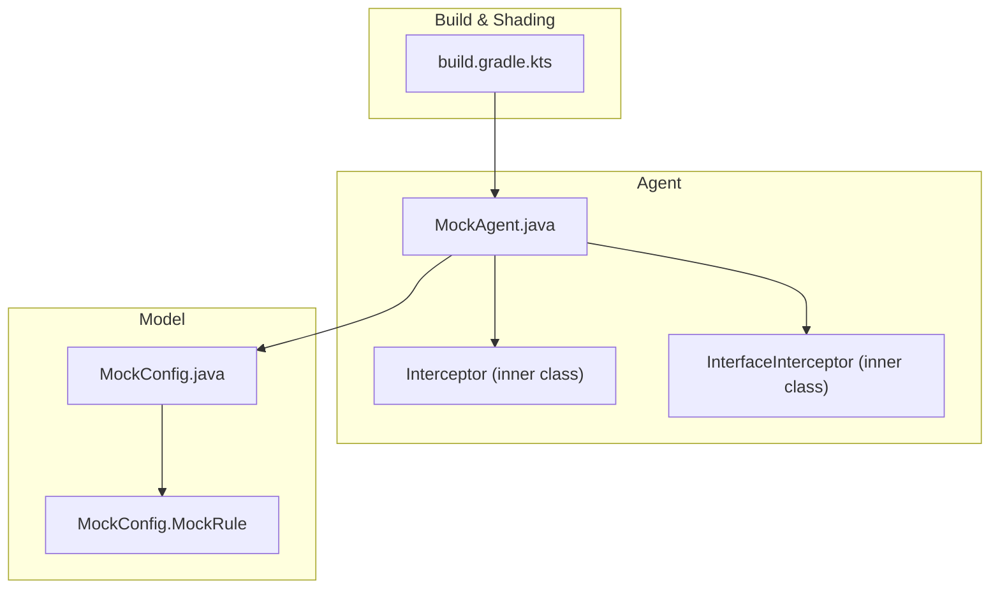
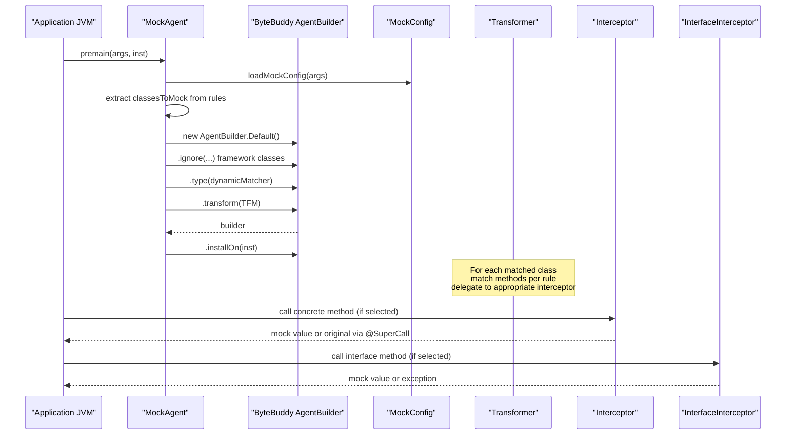
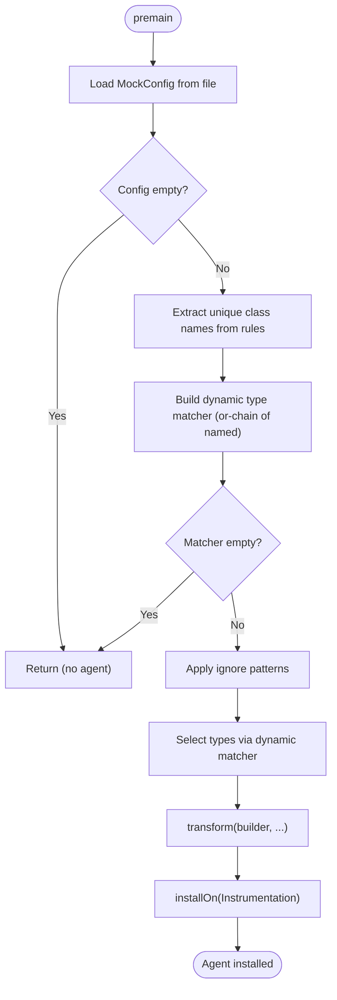
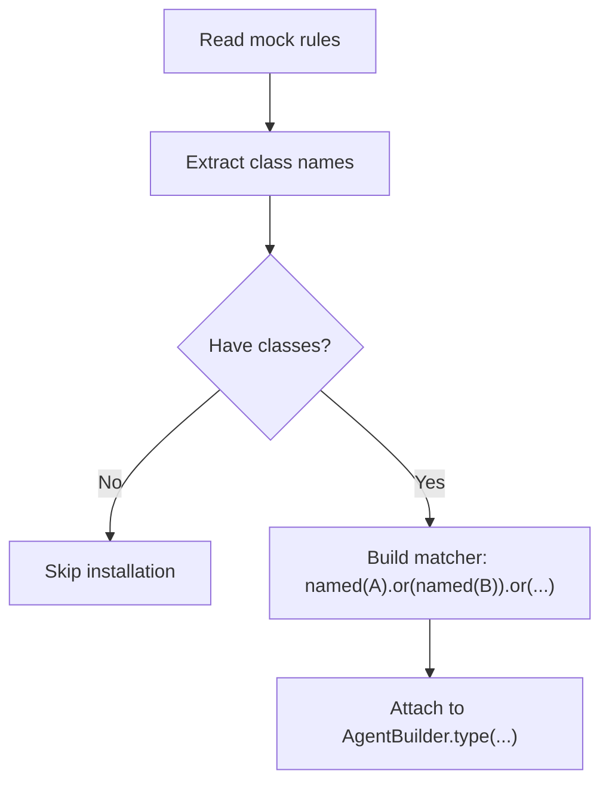
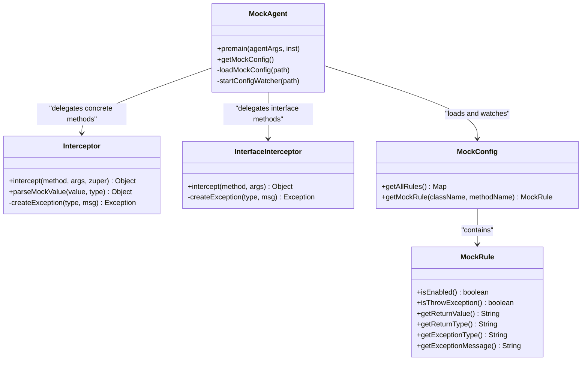
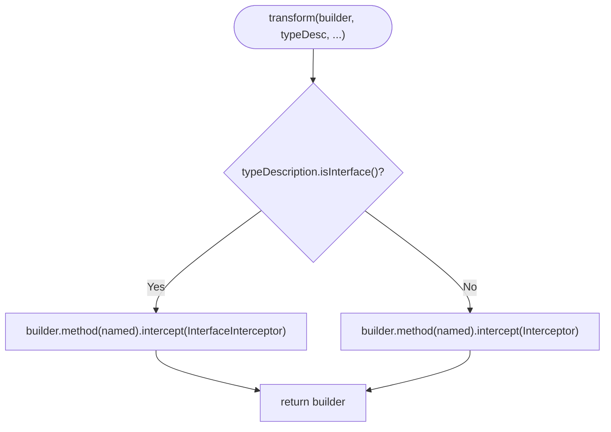
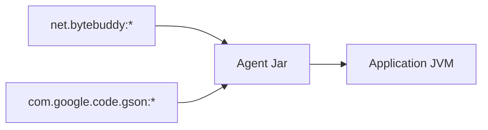
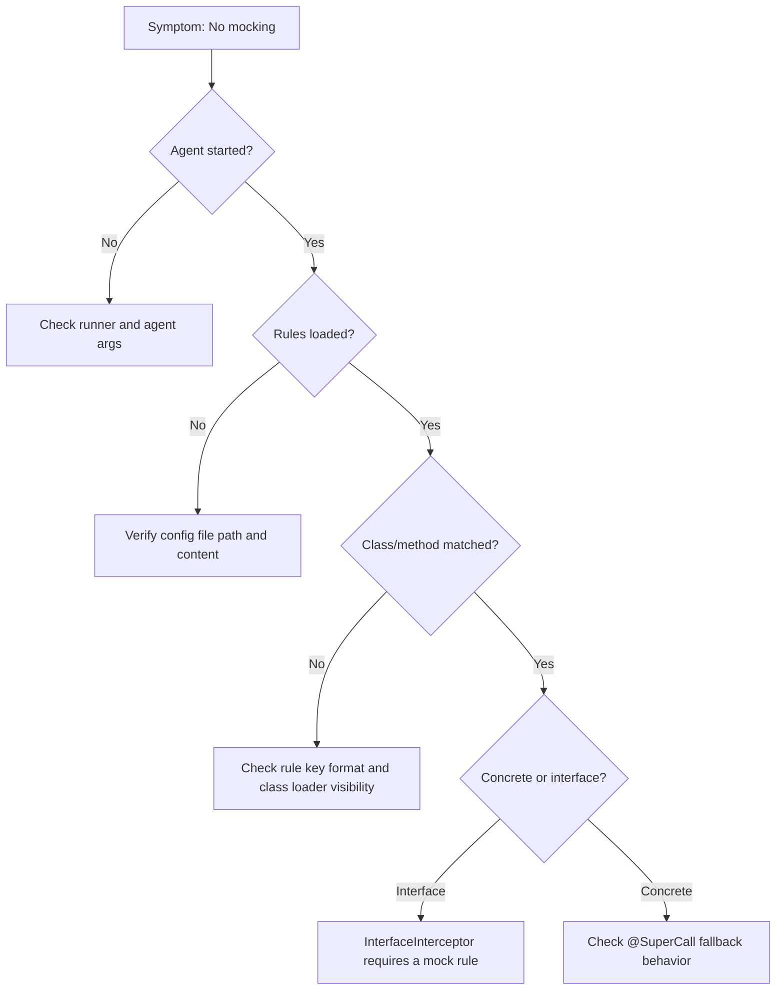

# ByteBuddy Integration

<cite>
**Referenced Files in This Document**
- [MockAgent.java](file://src/main/java/io/github/lancelothuxi/idea/plugin/mock/agent/MockAgent.java)
- [MockConfig.java](file://src/main/java/io/github/lancelothuxi/idea/plugin/mock/mock/MockConfig.java)
- [build.gradle.kts](file://build.gradle.kts)
- [DYNAMIC_CLASS_MATCHING.md](file://docs/DYNAMIC_CLASS_MATCHING.md)
- [ARCHITECTURE_DIAGRAM.md](file://docs/ARCHITECTURE_DIAGRAM.md)
- [INTERFACE_MOCKING_SUMMARY.md](file://docs/INTERFACE_MOCKING_SUMMARY.md)
- [MOCK_DEBUG_STEPS.md](file://docs/MOCK_DEBUG_STEPS.md)
</cite>

## Table of Contents
1. [Introduction](#introduction)
2. [Project Structure](#project-structure)
3. [Core Components](#core-components)
4. [Architecture Overview](#architecture-overview)
5. [Detailed Component Analysis](#detailed-component-analysis)
6. [Dependency Analysis](#dependency-analysis)
7. [Performance Considerations](#performance-considerations)
8. [Troubleshooting Guide](#troubleshooting-guide)
9. [Conclusion](#conclusion)

## Introduction
This document explains the ByteBuddy integration within the MockAgent implementation. It covers how the AgentBuilder is configured, how type and method matching strategies are applied, and how MethodDelegation is used to intercept both concrete classes and interfaces. It also documents the transformation pipeline, including ignore patterns for framework classes, selective class transformation, and the dual-interceptor pattern for concrete classes versus interfaces. Guidance on custom matchers, transformation builders, performance optimization, and debugging approaches is included.

## Project Structure
The ByteBuddy integration resides in the MockAgent class and leverages the MockConfig model for rule-driven selection. The build configuration shades dependencies to avoid conflicts with user applications.

**Diagram sources**
- [MockAgent.java](file://src/main/java/io/github/lancelothuxi/idea/plugin/mock/agent/MockAgent.java#L21-L145)
- [MockConfig.java](file://src/main/java/io/github/lancelothuxi/idea/plugin/mock/mock/MockConfig.java#L12-L217)
- [build.gradle.kts](file://build.gradle.kts#L25-L35)

**Section sources**
- [MockAgent.java](file://src/main/java/io/github/lancelothuxi/idea/plugin/mock/agent/MockAgent.java#L21-L145)
- [MockConfig.java](file://src/main/java/io/github/lancelothuxi/idea/plugin/mock/mock/MockConfig.java#L12-L217)
- [build.gradle.kts](file://build.gradle.kts#L25-L35)

## Core Components
- MockAgent: Initializes the Java agent, loads configuration, builds dynamic type matchers, applies ignore patterns, and installs ByteBuddy transformations.
- Interceptor (inner class): Handles concrete class interception with fallback to the original method via @SuperCall.
- InterfaceInterceptor (inner class): Handles interface interception without fallback; returns mock values or throws exceptions.
- MockConfig: Holds mock rules keyed by "className.methodName" and provides helpers to retrieve and rebuild rules.

Key ByteBuddy usage highlights:
- AgentBuilder.Default(): Creates the builder instance.
- ignore(...): Excludes framework and system classes from transformation.
- type(matcher): Restricts transformation to classes present in the mock configuration.
- method(name).intercept(MethodDelegation.to(...)): Delegates matched methods to interceptors.
- installOn(Instrumentation): Installs the transformer.

**Section sources**
- [MockAgent.java](file://src/main/java/io/github/lancelothuxi/idea/plugin/mock/agent/MockAgent.java#L26-L145)
- [MockConfig.java](file://src/main/java/io/github/lancelothuxi/idea/plugin/mock/mock/MockConfig.java#L19-L31)

## Architecture Overview
The transformation pipeline is rule-driven and class/interface-aware. It dynamically selects classes to transform based on the mock configuration and delegates method calls accordingly.

**Diagram sources**
- [MockAgent.java](file://src/main/java/io/github/lancelothuxi/idea/plugin/mock/agent/MockAgent.java#L26-L145)
- [MockConfig.java](file://src/main/java/io/github/lancelothuxi/idea/plugin/mock/mock/MockConfig.java#L19-L31)

## Detailed Component Analysis

### AgentBuilder Configuration and Transformation Pipeline
- Pre-main initialization: Loads configuration from a JSON file path passed as agent argument, starts a config watcher thread, and logs metadata from the agent JAR manifest.
- Rule extraction: Iterates mock rules to collect unique class names and constructs a disjunction of ElementMatchers named(...) to target only those classes.
- Ignore patterns: Excludes framework and system packages to minimize overhead and avoid interfering with the runtime.
- Type selection: Applies the dynamic type matcher to restrict transformation scope.
- Method selection and delegation: For each selected class, iterates rules and matches methods by name, delegating to either Interceptor (concrete) or InterfaceInterceptor (interface).
- Installation: Installs the transformer on the Instrumentation instance.

**Diagram sources**
- [MockAgent.java](file://src/main/java/io/github/lancelothuxi/idea/plugin/mock/agent/MockAgent.java#L26-L145)

**Section sources**
- [MockAgent.java](file://src/main/java/io/github/lancelothuxi/idea/plugin/mock/agent/MockAgent.java#L26-L145)
- [DYNAMIC_CLASS_MATCHING.md](file://docs/DYNAMIC_CLASS_MATCHING.md#L21-L64)

### Type Matching Strategies and ElementMatchers
- Dynamic class targeting: Builds a matcher chain combining ElementMatchers.named for each unique class name extracted from mock rules. This ensures ByteBuddy only transforms classes that require mocking.
- Framework exclusions: Uses ElementMatchers.nameStartsWith for common framework packages to avoid interference.
- Interface detection: During transformation, checks typeDescription.isInterface to route to the appropriate interceptor.

**Diagram sources**
- [MockAgent.java](file://src/main/java/io/github/lancelothuxi/idea/plugin/mock/agent/MockAgent.java#L62-L93)
- [DYNAMIC_CLASS_MATCHING.md](file://docs/DYNAMIC_CLASS_MATCHING.md#L25-L56)

**Section sources**
- [MockAgent.java](file://src/main/java/io/github/lancelothuxi/idea/plugin/mock/agent/MockAgent.java#L62-L111)
- [DYNAMIC_CLASS_MATCHING.md](file://docs/DYNAMIC_CLASS_MATCHING.md#L21-L64)

### Method Interception Patterns and MethodDelegation
- Concrete classes: Match methods by name and delegate to Interceptor, which can call the original method via @SuperCall if no mock is configured.
- Interfaces: Match methods by name and delegate to InterfaceInterceptor, which must return a mock value or throw an exception.
- Shared parsing: Both interceptors reuse parseMockValue to deserialize return values according to the declared return type.

**Diagram sources**
- [MockAgent.java](file://src/main/java/io/github/lancelothuxi/idea/plugin/mock/agent/MockAgent.java#L21-L145)
- [MockConfig.java](file://src/main/java/io/github/lancelothuxi/idea/plugin/mock/mock/MockConfig.java#L12-L217)

**Section sources**
- [MockAgent.java](file://src/main/java/io/github/lancelothuxi/idea/plugin/mock/agent/MockAgent.java#L112-L140)
- [INTERFACE_MOCKING_SUMMARY.md](file://docs/INTERFACE_MOCKING_SUMMARY.md#L24-L38)

### Selective Class Transformation and Dual Interceptor Pattern
- Transformation scope: Only classes present in mock rules are transformed, minimizing overhead.
- Concrete vs interface: Uses typeDescription.isInterface during transform to choose the right interceptor.
- Fallback behavior: Concrete methods can fall back to the original implementation via @SuperCall; interface methods must return a value or throw.

**Diagram sources**
- [MockAgent.java](file://src/main/java/io/github/lancelothuxi/idea/plugin/mock/agent/MockAgent.java#L112-L139)
- [ARCHITECTURE_DIAGRAM.md](file://docs/ARCHITECTURE_DIAGRAM.md#L27-L34)

**Section sources**
- [MockAgent.java](file://src/main/java/io/github/lancelothuxi/idea/plugin/mock/agent/MockAgent.java#L112-L139)
- [ARCHITECTURE_DIAGRAM.md](file://docs/ARCHITECTURE_DIAGRAM.md#L27-L34)

### Custom Matchers, Transformation Builders, and Performance Tips
- Custom matchers: The current implementation uses ElementMatchers.named for class names and method names. To extend, add additional ElementMatcher conditions (e.g., annotations, super types) before invoking transform.
- Builder composition: Chain ignore, type, and transform steps; keep the type matcher minimal by relying on rule-driven class selection.
- Performance tips:
  - Keep ignore patterns broad but precise to exclude heavy frameworks.
  - Limit transformation scope to only classes with mock rules.
  - Avoid expensive operations inside interceptors; cache parsed types when feasible.
  - Use the config watcher to reload rules without restarting the JVM.

**Section sources**
- [MockAgent.java](file://src/main/java/io/github/lancelothuxi/idea/plugin/mock/agent/MockAgent.java#L95-L140)
- [DYNAMIC_CLASS_MATCHING.md](file://docs/DYNAMIC_CLASS_MATCHING.md#L21-L64)

## Dependency Analysis
ByteBuddy and Gson are shaded into the agent JAR to prevent conflicts with user applications. The agent declares Premain-Class and capabilities for retransformation.

**Diagram sources**
- [build.gradle.kts](file://build.gradle.kts#L25-L35)
- [build.gradle.kts](file://build.gradle.kts#L94-L110)

**Section sources**
- [build.gradle.kts](file://build.gradle.kts#L25-L35)
- [build.gradle.kts](file://build.gradle.kts#L94-L110)

## Performance Considerations
- Minimal transformation scope: Only classes with mock rules are targeted, reducing class file scanning and transformation overhead.
- Efficient ignore patterns: Excluding framework packages avoids unnecessary instrumentation.
- Lightweight interceptors: Parsing and delegation are straightforward; avoid heavy reflection or IO in hot paths.
- Config watcher: Reloading rules without restart improves iteration speed during development.

[No sources needed since this section provides general guidance]

## Troubleshooting Guide
Common issues and debugging steps:
- Agent not installed: Verify the agent was started with a valid configuration path and that mock rules exist.
- No effect in application: Ensure the application runs with the agent attached and that the class/method keys match the configuration.
- Interface methods not mocked: Confirm the rule exists; InterfaceInterceptor throws if no mock is configured.
- Debug logging: Tail IDE logs for MockAgent and runner messages to confirm installation and rule application.

**Section sources**
- [MOCK_DEBUG_STEPS.md](file://docs/MOCK_DEBUG_STEPS.md#L32-L60)
- [MockAgent.java](file://src/main/java/io/github/lancelothuxi/idea/plugin/mock/agent/MockAgent.java#L26-L58)

## Conclusion
The MockAgent integrates ByteBuddy to provide a flexible, rule-driven mocking mechanism that targets only the necessary classes and methods. By leveraging dynamic type matching, selective ignore patterns, and a dual-interceptor strategy, it supports both concrete classes and interfaces. The configuration-driven approach, combined with a config watcher and shaded dependencies, enables safe and efficient mocking in diverse environments.