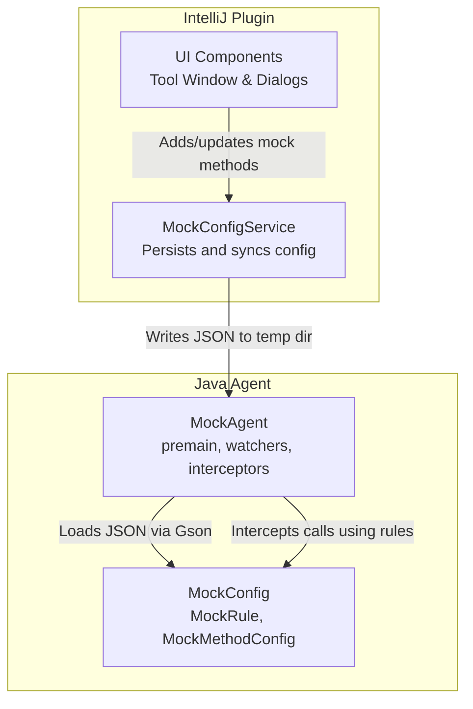
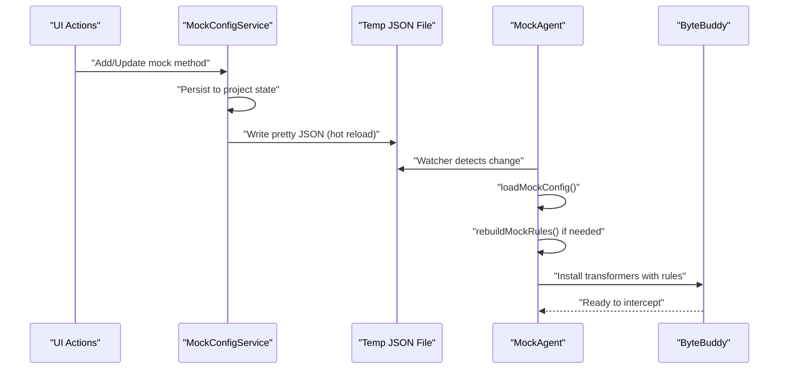
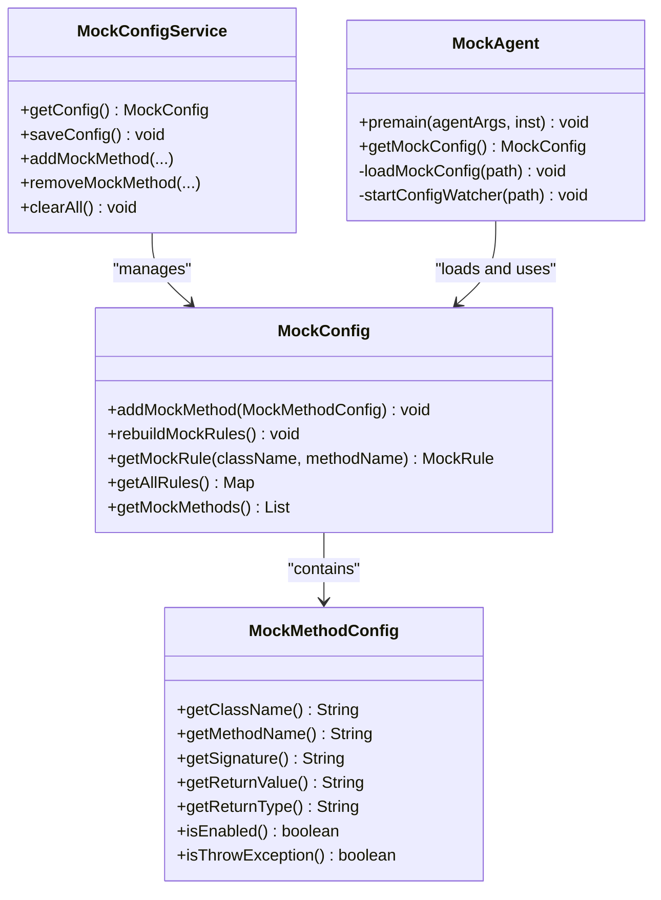
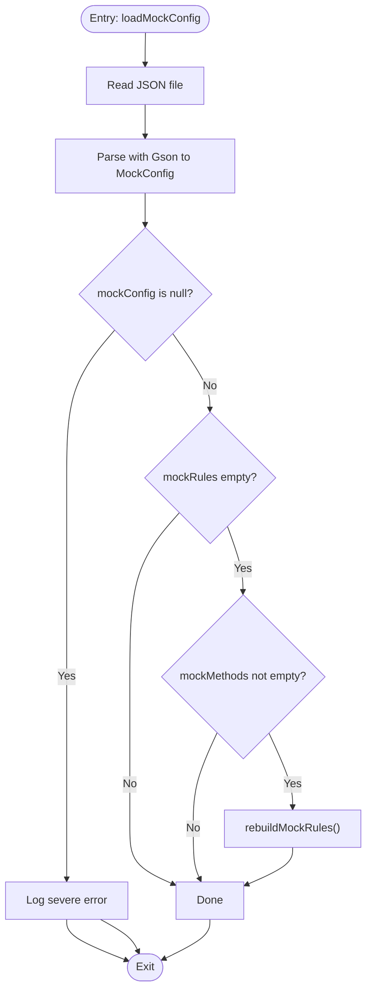
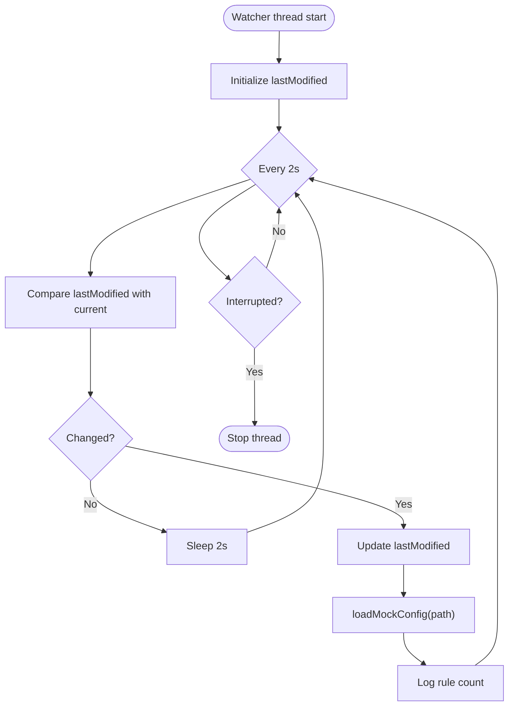
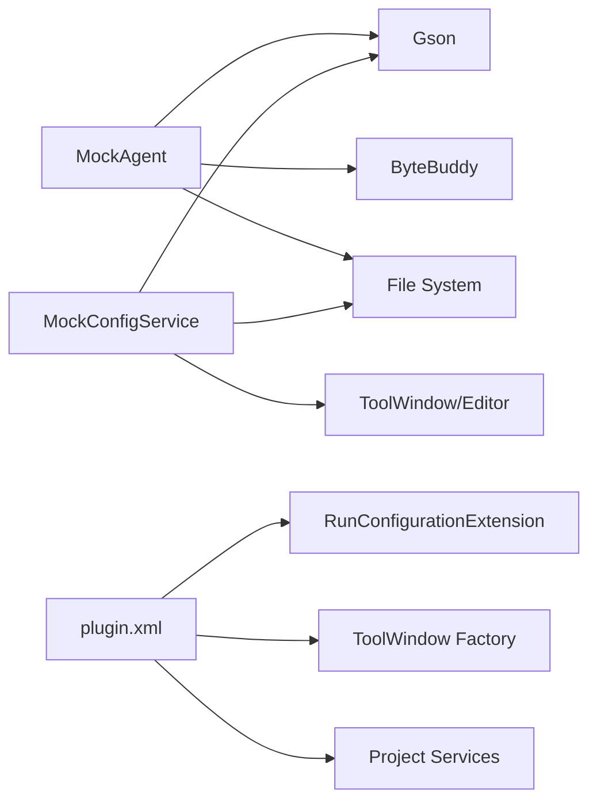

# Configuration Management

<cite>
**Referenced Files in This Document**
- [MockAgent.java](file://src/main/java/io/github/lancelothuxi/idea/plugin/mock/agent/MockAgent.java)
- [MockConfig.java](file://src/main/java/io/github/lancelothuxi/idea/plugin/mock/mock/MockConfig.java)
- [MockMethodConfig.java](file://src/main/java/io/github/lancelothuxi/idea/plugin/mock/mock/MockMethodConfig.java)
- [MockConfigService.java](file://src/main/java/io/github/lancelothuxi/idea/plugin/mock/service/MockConfigService.java)
- [plugin.xml](file://src/main/resources/META-INF/plugin.xml)
- [mock-config-test.json](file://src/test/resources/mock-config-test.json)
</cite>

## Table of Contents
1. [Introduction](#introduction)
2. [Project Structure](#project-structure)
3. [Core Components](#core-components)
4. [Architecture Overview](#architecture-overview)
5. [Detailed Component Analysis](#detailed-component-analysis)
6. [Dependency Analysis](#dependency-analysis)
7. [Performance Considerations](#performance-considerations)
8. [Troubleshooting Guide](#troubleshooting-guide)
9. [Conclusion](#conclusion)

## Introduction
This document explains the configuration management system of the Java Agent implementation. It covers how mock configurations are loaded from JSON files, validated, and applied at runtime; how the configuration watcher thread enables real-time updates; how MockConfig integrates with the agent and rebuilds rules; and how configuration persistence works within the IntelliJ Platform ecosystem. It also documents the agent startup sequence, dependency resolution, graceful degradation when configurations are missing, and practical troubleshooting steps.

## Project Structure
The configuration management spans three primary areas:
- Agent-side loader and interceptor logic
- In-memory configuration model and rule rebuilding
- IDE-side persistence and UI integration

**Diagram sources**
- [MockAgent.java](file://src/main/java/io/github/lancelothuxi/idea/plugin/mock/agent/MockAgent.java#L26-L145)
- [MockConfigService.java](file://src/main/java/io/github/lancelothuxi/idea/plugin/mock/service/MockConfigService.java#L41-L58)
- [MockConfig.java](file://src/main/java/io/github/lancelothuxi/idea/plugin/mock/mock/MockConfig.java#L12-L86)

**Section sources**
- [plugin.xml](file://src/main/resources/META-INF/plugin.xml#L25-L43)
- [MockAgent.java](file://src/main/java/io/github/lancelothuxi/idea/plugin/mock/agent/MockAgent.java#L26-L145)
- [MockConfigService.java](file://src/main/java/io/github/lancelothuxi/idea/plugin/mock/service/MockConfigService.java#L23-L58)

## Core Components
- MockAgent: Loads configuration, starts the watcher, installs ByteBuddy transformers, and handles interception.
- MockConfig: In-memory representation of mock rules and methods; supports rebuilding rules from persisted method configs.
- MockMethodConfig: Serializable DTO for individual mock method entries.
- MockConfigService: IDE-side service that persists configuration to XML and writes a JSON file for the agent watcher to consume.

Key responsibilities:
- LoadMockConfig: Reads JSON, validates presence of rules, rebuilds rules from method configs if needed.
- startConfigWatcher: Polls the JSON file and reloads when modified.
- Rule rebuilding: Ensures mockRules stay synchronized with mockMethods.
- Persistence: Writes pretty-printed JSON to a temp location for hot reload.

**Section sources**
- [MockAgent.java](file://src/main/java/io/github/lancelothuxi/idea/plugin/mock/agent/MockAgent.java#L147-L200)
- [MockConfig.java](file://src/main/java/io/github/lancelothuxi/idea/plugin/mock/mock/MockConfig.java#L67-L86)
- [MockConfigService.java](file://src/main/java/io/github/lancelothuxi/idea/plugin/mock/service/MockConfigService.java#L41-L58)

## Architecture Overview
The configuration lifecycle connects the IDE and the Java Agent:

**Diagram sources**
- [MockConfigService.java](file://src/main/java/io/github/lancelothuxi/idea/plugin/mock/service/MockConfigService.java#L41-L58)
- [MockAgent.java](file://src/main/java/io/github/lancelothuxi/idea/plugin/mock/agent/MockAgent.java#L174-L200)
- [MockAgent.java](file://src/main/java/io/github/lancelothuxi/idea/plugin/mock/agent/MockAgent.java#L147-L168)

## Detailed Component Analysis

### MockAgent.loadMockConfig
Purpose:
- Parse JSON configuration file into MockConfig.
- Rebuild mockRules from mockMethods if mockRules is empty but mockMethods is not.
- Log warnings and errors for missing or invalid configurations.

Processing logic:
- Uses Gson to deserialize the JSON file into MockConfig.
- Validates that mockConfig is not null.
- If mockRules is empty but mockMethods is populated, triggers rebuildMockRules.
- Catches exceptions during deserialization and logs severe errors.

Error handling:
- Logs severe error when config fails to load.
- Logs severe error if mockConfig remains null after loading.
- Returns gracefully if no rules are present.

Validation:
- Checks whether mockRules is empty and whether mockMethods contains entries.
- Ensures rule rebuilding occurs to keep in-memory state consistent.

**Section sources**
- [MockAgent.java](file://src/main/java/io/github/lancelothuxi/idea/plugin/mock/agent/MockAgent.java#L147-L168)
- [MockConfig.java](file://src/main/java/io/github/lancelothuxi/idea/plugin/mock/mock/MockConfig.java#L67-L86)

### startConfigWatcher Thread
Purpose:
- Monitor the configuration file for modifications and trigger reloads automatically.

Behavior:
- Creates a daemon thread that polls the file every 2 seconds.
- Compares lastModified timestamps; on change, calls loadMockConfig and logs the new rule count.
- Handles InterruptedException by stopping the loop.
- Catches and logs other exceptions encountered during polling.

Thread management:
- Daemon thread ensures it does not prevent JVM shutdown.
- Named thread for easier identification in logs.

Graceful degradation:
- If the watcher encounters errors, it continues polling.
- The agent continues operating with previously loaded configuration.

**Section sources**
- [MockAgent.java](file://src/main/java/io/github/lancelothuxi/idea/plugin/mock/agent/MockAgent.java#L174-L200)

### MockConfig Integration and Rule Rebuilding
Purpose:
- Maintain two complementary views of configuration:
  - mockMethods: ordered, serializable list of method-level configs.
  - mockRules: map keyed by "className.methodName" for fast lookup during interception.

Rebuilding process:
- When mockRules is empty, rebuildMockRules iterates mockMethods and constructs MockRule instances.
- Infers return types from return values when not explicitly provided.
- Applies per-method enablement flags to rules.

Data model:
- MockRule encapsulates return value, return type, exception mode, and enablement.
- MockMethodConfig stores method identity, return payload, type hints, and exception settings.

**Section sources**
- [MockConfig.java](file://src/main/java/io/github/lancelothuxi/idea/plugin/mock/mock/MockConfig.java#L12-L86)
- [MockMethodConfig.java](file://src/main/java/io/github/lancelothuxi/idea/plugin/mock/mock/MockMethodConfig.java#L5-L94)

### MockConfigService: Persistence and Hot Reload
Purpose:
- Persist configuration to project state (XML) and write a JSON file for the agent watcher.

Key operations:
- saveConfig: Pretty-prints MockConfig to a temp directory JSON file, ensuring the directory exists.
- loadState: Restores MockConfig from XML, rebuilds rules, and refreshes UI.
- addMockMethod/removeMockMethod/clearAll: Update in-memory config and UI.

Hot reload pipeline:
- UI actions update MockConfigService.getConfig().
- saveConfig writes JSON to a fixed temp path so the agent watcher can detect changes.
- The watcher triggers loadMockConfig, which rebuilds rules if needed.

**Section sources**
- [MockConfigService.java](file://src/main/java/io/github/lancelothuxi/idea/plugin/mock/service/MockConfigService.java#L41-L58)
- [MockConfigService.java](file://src/main/java/io/github/lancelothuxi/idea/plugin/mock/service/MockConfigService.java#L75-L96)

### Agent Startup Sequence and Dependency Resolution
Startup flow:
- premain reads agent arguments and determines the configuration path.
- If provided, loadMockConfig is invoked, followed by startConfigWatcher.
- The agent inspects mock rules to identify classes to intercept and builds ByteBuddy matchers accordingly.
- If no rules are present or classes are identified, the agent logs warnings and exits gracefully.

Dependencies:
- ByteBuddy for runtime method interception.
- Gson for JSON parsing and pretty-printing.
- Project services for UI integration and persistence.

Graceful degradation:
- Missing configuration path: logs severe warning and returns early.
- Empty mock rules: logs warning and does not install transformers.
- Null configuration after load: logs severe error and returns early.

**Section sources**
- [MockAgent.java](file://src/main/java/io/github/lancelothuxi/idea/plugin/mock/agent/MockAgent.java#L26-L60)
- [MockAgent.java](file://src/main/java/io/github/lancelothuxi/idea/plugin/mock/agent/MockAgent.java#L95-L145)

### Configuration File Formats
Example JSON structure (from tests):
- Root keys: mockRules (map), mockMethods (array).
- mockRules entries: key is "fullyQualifiedClassName.methodName"; value includes returnValue, returnType, enabled, throwException, and optional exceptionType/exceptionMessage.
- mockMethods entries: structured as MockMethodConfig objects.

Example reference:
- See [mock-config-test.json](file://src/test/resources/mock-config-test.json#L1-L72) for a complete example.

**Section sources**
- [mock-config-test.json](file://src/test/resources/mock-config-test.json#L1-L72)
- [MockConfig.java](file://src/main/java/io/github/lancelothuxi/idea/plugin/mock/mock/MockConfig.java#L12-L31)

## Architecture Overview

**Diagram sources**
- [MockConfigService.java](file://src/main/java/io/github/lancelothuxi/idea/plugin/mock/service/MockConfigService.java#L23-L196)
- [MockConfig.java](file://src/main/java/io/github/lancelothuxi/idea/plugin/mock/mock/MockConfig.java#L12-L218)
- [MockMethodConfig.java](file://src/main/java/io/github/lancelothuxi/idea/plugin/mock/mock/MockMethodConfig.java#L5-L94)
- [MockAgent.java](file://src/main/java/io/github/lancelothuxi/idea/plugin/mock/agent/MockAgent.java#L21-L200)

## Detailed Component Analysis

### loadMockConfig Flow

**Diagram sources**
- [MockAgent.java](file://src/main/java/io/github/lancelothuxi/idea/plugin/mock/agent/MockAgent.java#L147-L168)
- [MockConfig.java](file://src/main/java/io/github/lancelothuxi/idea/plugin/mock/mock/MockConfig.java#L67-L86)

**Section sources**
- [MockAgent.java](file://src/main/java/io/github/lancelothuxi/idea/plugin/mock/agent/MockAgent.java#L147-L168)
- [MockConfig.java](file://src/main/java/io/github/lancelothuxi/idea/plugin/mock/mock/MockConfig.java#L67-L86)

### startConfigWatcher Behavior

**Diagram sources**
- [MockAgent.java](file://src/main/java/io/github/lancelothuxi/idea/plugin/mock/agent/MockAgent.java#L174-L200)

**Section sources**
- [MockAgent.java](file://src/main/java/io/github/lancelothuxi/idea/plugin/mock/agent/MockAgent.java#L174-L200)

### MockAgent Interception and Value Parsing
- Interceptor and InterfaceInterceptor locate rules by "className.methodName".
- If enabled and not in exception mode, parseMockValue converts the returnValue string to the specified returnType.
- Supports primitive types, String, Lists (including generic List<T>), Maps, and arbitrary classes via reflection.
- On exception mode, creates and throws an exception of the specified type.

**Section sources**
- [MockAgent.java](file://src/main/java/io/github/lancelothuxi/idea/plugin/mock/agent/MockAgent.java#L202-L339)
- [MockAgent.java](file://src/main/java/io/github/lancelothuxi/idea/plugin/mock/agent/MockAgent.java#L344-L398)

## Dependency Analysis
- MockAgent depends on:
  - Gson for JSON parsing and pretty printing.
  - ByteBuddy for method interception.
  - File system for watcher and JSON file I/O.
- MockConfigService depends on:
  - Gson for serialization/deserialization.
  - IntelliJ Platform services for UI refresh and persistence.
- plugin.xml registers:
  - Run configuration extension for injecting the agent.
  - Tool window and project services for UI and persistence.

**Diagram sources**
- [MockAgent.java](file://src/main/java/io/github/lancelothuxi/idea/plugin/mock/agent/MockAgent.java#L3-L19)
- [MockConfigService.java](file://src/main/java/io/github/lancelothuxi/idea/plugin/mock/service/MockConfigService.java#L6-L15)
- [plugin.xml](file://src/main/resources/META-INF/plugin.xml#L25-L43)

**Section sources**
- [plugin.xml](file://src/main/resources/META-INF/plugin.xml#L25-L43)
- [MockAgent.java](file://src/main/java/io/github/lancelothuxi/idea/plugin/mock/agent/MockAgent.java#L3-L19)
- [MockConfigService.java](file://src/main/java/io/github/lancelothuxi/idea/plugin/mock/service/MockConfigService.java#L6-L15)

## Performance Considerations
- Watcher polling interval: 2 seconds balances responsiveness with minimal overhead.
- Rule rebuilding: O(n) over mockMethods; keep mockMethods reasonably sized.
- JSON parsing: Pretty-printed JSON is human-readable and acceptable for typical configuration sizes.
- Interception cost: Minimal overhead via ByteBuddy delegation; only matched methods are intercepted.

## Troubleshooting Guide
Common issues and resolutions:
- Configuration file not found or unreadable:
  - Verify the path passed to premain is correct.
  - Ensure the JSON file exists and is valid.
  - Check watcher thread logs for file modification events.
- Empty mock rules after load:
  - Confirm mockMethods contains entries; the agent will rebuild rules automatically.
  - Validate that each MockMethodConfig specifies a return type or a parsable return value.
- Exceptions during parsing:
  - Ensure returnValue matches the declared returnType.
  - For generics like List<SomeClass>, specify the full generic type.
- Watcher not triggering reloads:
  - Confirm the temp JSON file is being written to the expected path.
  - Check for filesystem permissions and antivirus interference.
- Agent not intercepting methods:
  - Verify the class name and method name keys match the expected "fullyQualified.Class.method" format.
  - Ensure the class is not ignored by the agent’s type matcher (framework classes are ignored by default).
- Graceful degradation:
  - If no rules are configured, the agent logs a warning and does not install transformers.

**Section sources**
- [MockAgent.java](file://src/main/java/io/github/lancelothuxi/idea/plugin/mock/agent/MockAgent.java#L42-L60)
- [MockAgent.java](file://src/main/java/io/github/lancelothuxi/idea/plugin/mock/agent/MockAgent.java#L174-L200)
- [MockConfig.java](file://src/main/java/io/github/lancelothuxi/idea/plugin/mock/mock/MockConfig.java#L67-L86)

## Conclusion
The configuration management system combines IDE-side persistence and UI updates with agent-side loading and real-time watching. MockConfigService ensures configuration is persisted and synchronized, while MockAgent loads and applies rules efficiently. The watcher thread enables seamless hot reloads, and graceful degradation prevents failures when configurations are missing. Together, these components deliver a robust, developer-friendly mocking experience.