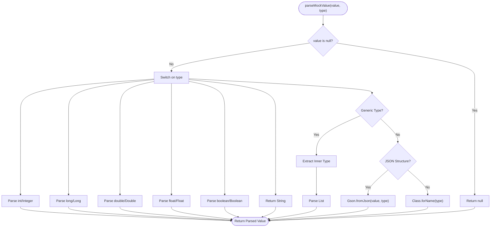

# Concrete Class Interceptor

<cite>
**Referenced Files in This Document**
- [MockAgent.java](file://src/main/java/io/github/lancelothuxi/idea/plugin/mock/agent/MockAgent.java)
- [MockConfig.java](file://src/main/java/io/github/lancelothuxi/idea/plugin/mock/mock/MockConfig.java)
- [MockMethodConfig.java](file://src/main/java/io/github/lancelothuxi/idea/plugin/mock/mock/MockMethodConfig.java)
- [TestService.java](file://src/test/java/test/TestService.java)
- [ExceptionMockingTest.java](file://src/test/java/test/ExceptionMockingTest.java)
- [mock-config-test.json](file://src/test/resources/mock-config-test.json)
</cite>

## Table of Contents
1. [Introduction](#introduction)
2. [Project Structure](#project-structure)
3. [Core Components](#core-components)
4. [Architecture Overview](#architecture-overview)
5. [Detailed Component Analysis](#detailed-component-analysis)
6. [Dependency Analysis](#dependency-analysis)
7. [Performance Considerations](#performance-considerations)
8. [Troubleshooting Guide](#troubleshooting-guide)
9. [Conclusion](#conclusion)

## Introduction
This document provides a comprehensive analysis of the concrete class interceptor implementation used by the Mock Runner agent. It focuses on the Interceptor class architecture, the @RuntimeType annotated intercept method and its parameters (@Origin, @AllArguments, @SuperCall), the method resolution process, rule lookup mechanism, value parsing logic, the SuperCall pattern for delegating to original methods, exception handling, logging strategies, and performance considerations. It also includes examples of concrete class method interception and a comparison with interface interception.

## Project Structure
The interceptor resides in the Mock Runner agent module alongside supporting configuration classes. The key files are:
- MockAgent.java: Contains the Interceptor class and the agent installation logic
- MockConfig.java: Defines the mock configuration model and rule storage
- MockMethodConfig.java: Defines method-level mock configuration
- TestService.java: Demonstrates a concrete class with methods to be intercepted
- ExceptionMockingTest.java: Tests exception-based mocking scenarios
- mock-config-test.json: Example JSON configuration for concrete class methods

**Diagram sources**
- [MockAgent.java](file://src/main/java/io/github/lancelothuxi/idea/plugin/mock/agent/MockAgent.java#L21-L145)
- [MockConfig.java](file://src/main/java/io/github/lancelothuxi/idea/plugin/mock/mock/MockConfig.java#L12-L218)
- [MockMethodConfig.java](file://src/main/java/io/github/lancelothuxi/idea/plugin/mock/mock/MockMethodConfig.java#L5-L94)
- [TestService.java](file://src/test/java/test/TestService.java#L6-L17)
- [ExceptionMockingTest.java](file://src/test/java/test/ExceptionMockingTest.java#L15-L111)
- [mock-config-test.json](file://src/test/resources/mock-config-test.json#L1-L72)

**Section sources**
- [MockAgent.java](file://src/main/java/io/github/lancelothuxi/idea/plugin/mock/agent/MockAgent.java#L21-L145)
- [MockConfig.java](file://src/main/java/io/github/lancelothuxi/idea/plugin/mock/mock/MockConfig.java#L12-L218)
- [MockMethodConfig.java](file://src/main/java/io/github/lancelothuxi/idea/plugin/mock/mock/MockMethodConfig.java#L5-L94)
- [TestService.java](file://src/test/java/test/TestService.java#L6-L17)
- [ExceptionMockingTest.java](file://src/test/java/test/ExceptionMockingTest.java#L15-L111)
- [mock-config-test.json](file://src/test/resources/mock-config-test.json#L1-L72)

## Core Components
- Interceptor: Handles concrete class method interception with @RuntimeType, @Origin, @AllArguments, and @SuperCall. It resolves mock rules, parses return values, and delegates to the original method via SuperCall when no rule applies.
- InterfaceInterceptor: Handles interface method interception without SuperCall, returning mock values or throwing exceptions as configured.
- MockConfig: Stores mock rules keyed by "className.methodName" and provides rule lookup and inference helpers.
- MockMethodConfig: Represents method-level configuration persisted to JSON, including return values, types, and exception settings.

Key responsibilities:
- Rule lookup: Uses MockConfig.getMockRule(className, methodName) to locate applicable rules.
- Value parsing: Converts string return values to typed objects based on configured return types, including support for generic collections.
- Exception creation: Dynamically instantiates exceptions by type when configured.
- Fallback behavior: Delegates to original method via @SuperCall when no rule is found or disabled.

**Section sources**
- [MockAgent.java](file://src/main/java/io/github/lancelothuxi/idea/plugin/mock/agent/MockAgent.java#L202-L339)
- [MockConfig.java](file://src/main/java/io/github/lancelothuxi/idea/plugin/mock/mock/MockConfig.java#L24-L27)
- [MockMethodConfig.java](file://src/main/java/io/github/lancelothuxi/idea/plugin/mock/mock/MockMethodConfig.java#L42-L88)

## Architecture Overview
The agent installs ByteBuddy transformers that detect concrete classes and interfaces. For concrete classes, the Interceptor is applied; for interfaces, InterfaceInterceptor is used. Both interceptors consult MockConfig to decide whether to return a mock value, throw an exception, or delegate to the original method.

**Diagram sources**
- [MockAgent.java](file://src/main/java/io/github/lancelothuxi/idea/plugin/mock/agent/MockAgent.java#L112-L140)
- [MockAgent.java](file://src/main/java/io/github/lancelothuxi/idea/plugin/mock/agent/MockAgent.java#L204-L244)
- [MockConfig.java](file://src/main/java/io/github/lancelothuxi/idea/plugin/mock/mock/MockConfig.java#L24-L27)

## Detailed Component Analysis

### Interceptor Class Architecture
The Interceptor is a static inner class within MockAgent designed for concrete class method interception. It uses ByteBuddy's @RuntimeType annotation to enable runtime method interception and receives three parameters:
- @Origin Method method: Provides metadata about the intercepted method
- @AllArguments Object[] args: Captures all arguments passed to the intercepted method
- @SuperCall java.util.concurrent.Callable<?> zuper: Enables delegation to the original method implementation

Processing flow:
1. Log method entry with class and method names
2. Retrieve MockConfig from MockAgent
3. Lookup rule using className.methodName
4. If rule exists and is enabled:
   - If exception mode: instantiate and throw exception by type
   - Else: parse return value to configured type and return
5. Otherwise: delegate to original method via zuper.call()

**Diagram sources**
- [MockAgent.java](file://src/main/java/io/github/lancelothuxi/idea/plugin/mock/agent/MockAgent.java#L21-L145)
- [MockAgent.java](file://src/main/java/io/github/lancelothuxi/idea/plugin/mock/agent/MockAgent.java#L202-L339)
- [MockConfig.java](file://src/main/java/io/github/lancelothuxi/idea/plugin/mock/mock/MockConfig.java#L144-L216)

**Section sources**
- [MockAgent.java](file://src/main/java/io/github/lancelothuxi/idea/plugin/mock/agent/MockAgent.java#L202-L244)

### Method Resolution Process
The agent determines whether a class is an interface or concrete class during transformation. For concrete classes, it installs the Interceptor with SuperCall support. The method resolution process inside the interceptor:
1. Extract className and methodName from the intercepted Method metadata
2. Construct key "className.methodName"
3. Lookup rule via MockConfig.getMockRule(className, methodName)
4. Apply rule if enabled; otherwise delegate to original method

**Diagram sources**
- [MockAgent.java](file://src/main/java/io/github/lancelothuxi/idea/plugin/mock/agent/MockAgent.java#L204-L244)
- [MockConfig.java](file://src/main/java/io/github/lancelothuxi/idea/plugin/mock/mock/MockConfig.java#L24-L27)

**Section sources**
- [MockAgent.java](file://src/main/java/io/github/lancelothuxi/idea/plugin/mock/agent/MockAgent.java#L112-L140)
- [MockAgent.java](file://src/main/java/io/github/lancelothuxi/idea/plugin/mock/agent/MockAgent.java#L204-L244)
- [MockConfig.java](file://src/main/java/io/github/lancelothuxi/idea/plugin/mock/mock/MockConfig.java#L24-L27)

### Rule Lookup Mechanism
Rules are stored in MockConfig with keys formatted as "className.methodName". The lookup mechanism:
- Key construction: className + "." + methodName
- Direct map retrieval via getMockRule
- Rule lifecycle: enabled flag controls applicability
- Rebuilding: rebuildMockRules synchronizes from persisted MockMethodConfig entries

**Diagram sources**
- [MockMethodConfig.java](file://src/main/java/io/github/lancelothuxi/idea/plugin/mock/mock/MockMethodConfig.java#L8-L94)
- [MockConfig.java](file://src/main/java/io/github/lancelothuxi/idea/plugin/mock/mock/MockConfig.java#L144-L216)

**Section sources**
- [MockConfig.java](file://src/main/java/io/github/lancelothuxi/idea/plugin/mock/mock/MockConfig.java#L19-L27)
- [MockConfig.java](file://src/main/java/io/github/lancelothuxi/idea/plugin/mock/mock/MockConfig.java#L67-L86)

### Value Parsing Logic
The parseMockValue method converts string return values to typed objects:
- Primitive and wrapper types: integer, long, double, float, boolean, string
- Generic collections: List<T> with inner type resolution using reflection
- JSON structures: Lists and Maps parsed via Gson
- Fallback: Class.forName-based deserialization or generic list/map parsing

**Diagram sources**
- [MockAgent.java](file://src/main/java/io/github/lancelothuxi/idea/plugin/mock/agent/MockAgent.java#L246-L326)

**Section sources**
- [MockAgent.java](file://src/main/java/io/github/lancelothuxi/idea/plugin/mock/agent/MockAgent.java#L246-L326)

### SuperCall Pattern and Fallback Behavior
For concrete classes, the Interceptor uses @SuperCall to delegate to the original method when no mock rule applies or when the rule is disabled. This ensures normal program behavior remains intact unless explicitly overridden by a mock configuration.

**Diagram sources**
- [MockAgent.java](file://src/main/java/io/github/lancelothuxi/idea/plugin/mock/agent/MockAgent.java#L204-L244)

**Section sources**
- [MockAgent.java](file://src/main/java/io/github/lancelothuxi/idea/plugin/mock/agent/MockAgent.java#L204-L244)

### Exception Handling and Logging Strategies
The Interceptor implements robust exception handling and logging:
- Logging: Extensive INFO/WARNING/SEVERE logs for method entry, rule lookup, parsing, and errors
- Exception creation: Dynamic instantiation of exceptions by type with fallback to RuntimeException
- Error propagation: Exceptions are logged and rethrown to preserve stack traces

**Diagram sources**
- [MockAgent.java](file://src/main/java/io/github/lancelothuxi/idea/plugin/mock/agent/MockAgent.java#L204-L244)
- [MockAgent.java](file://src/main/java/io/github/lancelothuxi/idea/plugin/mock/agent/MockAgent.java#L328-L338)

**Section sources**
- [MockAgent.java](file://src/main/java/io/github/lancelothuxi/idea/plugin/mock/agent/MockAgent.java#L204-L244)
- [MockAgent.java](file://src/main/java/io/github/lancelothuxi/idea/plugin/mock/agent/MockAgent.java#L328-L338)

### Examples of Concrete Class Method Interception
Practical examples demonstrate concrete class interception:
- TestService methods: getStudents() and getStudent(String) are candidates for mocking
- ExceptionMockingTest: Shows exception-based mocking for concrete classes
- mock-config-test.json: Provides JSON configurations for concrete class methods with various return types

Example references:
- Concrete class methods to intercept: [TestService.java](file://src/test/java/test/TestService.java#L8-L16)
- Exception-based mocking: [ExceptionMockingTest.java](file://src/test/java/test/ExceptionMockingTest.java#L25-L31)
- JSON configuration examples: [mock-config-test.json](file://src/test/resources/mock-config-test.json#L3-L68)

**Section sources**
- [TestService.java](file://src/test/java/test/TestService.java#L8-L16)
- [ExceptionMockingTest.java](file://src/test/java/test/ExceptionMockingTest.java#L25-L31)
- [mock-config-test.json](file://src/test/resources/mock-config-test.json#L3-L68)

### Comparison with Interface Interception
Interface interception differs from concrete class interception in several ways:
- InterfaceInterceptor does not use @SuperCall and must either return a mock value or throw an exception
- Regular Interceptor uses @SuperCall to delegate to the original method when no rule applies
- Interface methods are invoked through dynamic proxies (e.g., Dubbo/Feign), while concrete methods are invoked directly

Key differences:
- Parameter set: InterfaceInterceptor receives @Origin and @AllArguments but no @SuperCall
- Fallback behavior: InterfaceInterceptor cannot fall back to original method
- Error handling: InterfaceInterceptor throws UnsupportedOperationException when no mock is configured

**Section sources**
- [MockAgent.java](file://src/main/java/io/github/lancelothuxi/idea/plugin/mock/agent/MockAgent.java#L125-L133)
- [MockAgent.java](file://src/main/java/io/github/lancelothuxi/idea/plugin/mock/agent/MockAgent.java#L344-L398)

## Dependency Analysis
The Interceptor depends on MockConfig for rule lookup and value parsing. MockConfig encapsulates MockRule instances and provides convenience methods for rule management. The agent orchestrates transformations and selects the appropriate interceptor based on class type.

**Diagram sources**
- [MockAgent.java](file://src/main/java/io/github/lancelothuxi/idea/plugin/mock/agent/MockAgent.java#L21-L145)
- [MockAgent.java](file://src/main/java/io/github/lancelothuxi/idea/plugin/mock/agent/MockAgent.java#L202-L339)
- [MockConfig.java](file://src/main/java/io/github/lancelothuxi/idea/plugin/mock/mock/MockConfig.java#L144-L216)

**Section sources**
- [MockAgent.java](file://src/main/java/io/github/lancelothuxi/idea/plugin/mock/agent/MockAgent.java#L21-L145)
- [MockConfig.java](file://src/main/java/io/github/lancelothuxi/idea/plugin/mock/mock/MockConfig.java#L144-L216)

## Performance Considerations
- Rule lookup: O(1) map-based lookup via key construction
- Value parsing: Minimal overhead with primitive parsing and cached Gson usage
- Reflection: Limited to method metadata extraction and exception instantiation
- Logging: INFO/WARNING/SEVERE levels used; consider reducing log level in production environments
- SuperCall: Only invoked when no rule applies, minimizing overhead for mocked methods

## Troubleshooting Guide
Common issues and resolutions:
- Config null: If MockConfig is null, the interceptor falls back to original method execution
- No mock rules: When no rule is found or disabled, the interceptor delegates to the original method
- Exception creation failures: Falls back to RuntimeException if the specified exception type cannot be instantiated
- JSON parsing errors: Logs severe errors and returns null for unparsable values
- Interface methods without mocks: Throws UnsupportedOperationException indicating missing configuration

**Section sources**
- [MockAgent.java](file://src/main/java/io/github/lancelothuxi/idea/plugin/mock/agent/MockAgent.java#L212-L215)
- [MockAgent.java](file://src/main/java/io/github/lancelothuxi/idea/plugin/mock/agent/MockAgent.java#L235-L238)
- [MockAgent.java](file://src/main/java/io/github/lancelothuxi/idea/plugin/mock/agent/MockAgent.java#L334-L338)
- [MockAgent.java](file://src/main/java/io/github/lancelothuxi/idea/plugin/mock/agent/MockAgent.java#L376-L379)

## Conclusion
The Interceptor provides a robust mechanism for concrete class method interception with comprehensive rule lookup, value parsing, and fallback behavior. Its design leverages ByteBuddy's @RuntimeType and @SuperCall to seamlessly integrate with existing code while offering flexible mocking capabilities. Proper configuration through MockConfig and JSON enables precise control over method behavior, with clear logging and error handling for reliable operation.