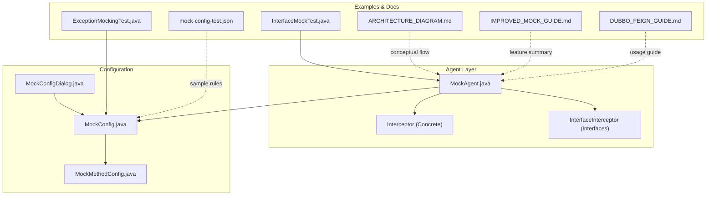
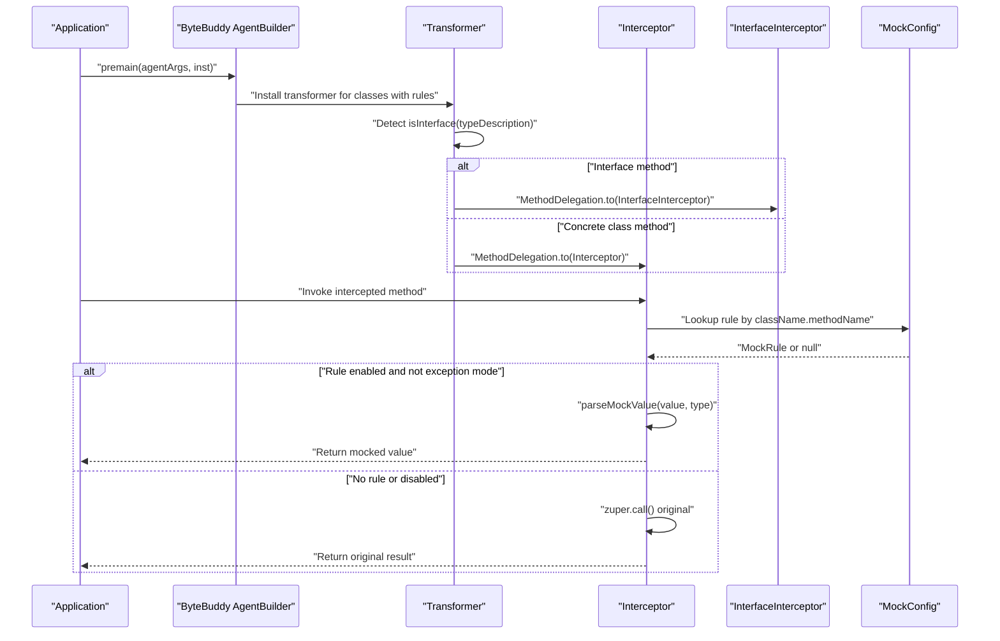
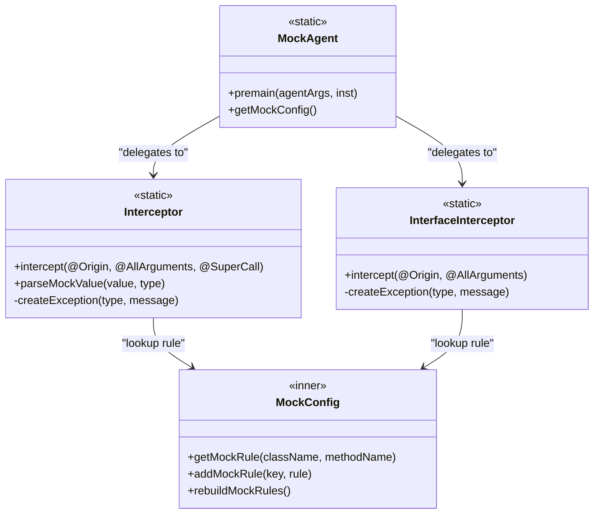
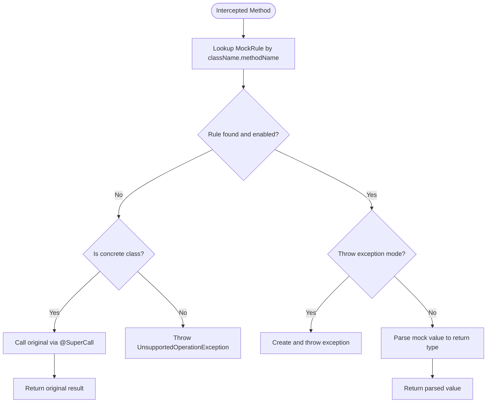
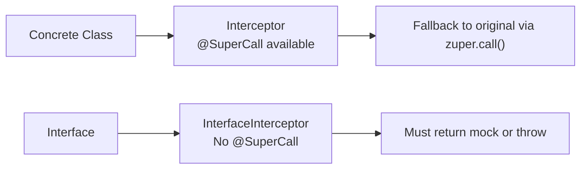
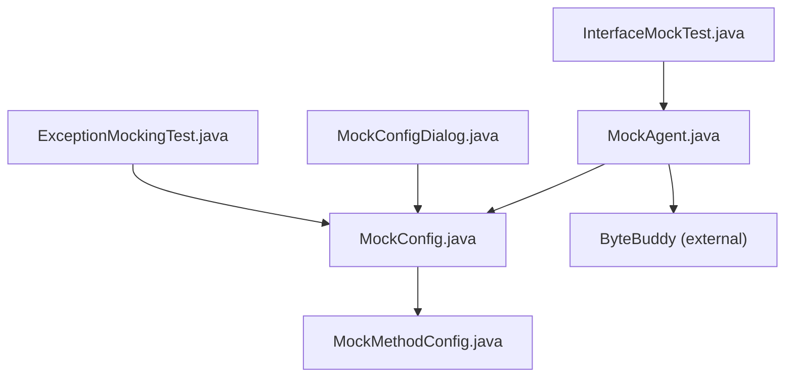

# Interceptor Patterns

<cite>
**Referenced Files in This Document**
- [MockAgent.java](file://src/main/java/io/github/lancelothuxi/idea/plugin/mock/agent/MockAgent.java)
- [MockConfig.java](file://src/main/java/io/github/lancelothuxi/idea/plugin/mock/mock/MockConfig.java)
- [MockMethodConfig.java](file://src/main/java/io/github/lancelothuxi/idea/plugin/mock/mock/MockMethodConfig.java)
- [ARCHITECTURE_DIAGRAM.md](file://docs/ARCHITECTURE_DIAGRAM.md)
- [IMPROVED_MOCK_GUIDE.md](file://docs/IMPROVED_MOCK_GUIDE.md)
- [DUBBO_FEIGN_GUIDE.md](file://docs/DUBBO_FEIGN_GUIDE.md)
- [InterfaceMockTest.java](file://src/test/java/test/InterfaceMockTest.java)
- [ExceptionMockingTest.java](file://src/test/java/test/ExceptionMockingTest.java)
- [mock-config-test.json](file://src/test/resources/mock-config-test.json)
- [MockConfigDialog.java](file://src/main/java/io/github/lancelothuxi/idea/plugin/mock/ui/MockConfigDialog.java)
</cite>

## Table of Contents
1. [Introduction](#introduction)
2. [Project Structure](#project-structure)
3. [Core Components](#core-components)
4. [Architecture Overview](#architecture-overview)
5. [Detailed Component Analysis](#detailed-component-analysis)
6. [Dependency Analysis](#dependency-analysis)
7. [Performance Considerations](#performance-considerations)
8. [Troubleshooting Guide](#troubleshooting-guide)
9. [Conclusion](#conclusion)
10. [Appendices](#appendices)

## Introduction
This document explains the interceptor architecture used for method mocking in the project. It focuses on the dual interceptor system (Interceptor vs InterfaceInterceptor), how ByteBuddy annotations are applied (@RuntimeType, @Origin, @AllArguments, @SuperCall), and the method interception lifecycle. It also clarifies the differences between concrete class methods (with SuperCall) and interface methods (without SuperCall), and provides guidance for implementing custom interceptors and advanced annotation usage patterns.

## Project Structure
The interceptor logic is primarily implemented in the agent module and supported by configuration models and UI components. Key areas:
- Agent and interceptors: bytecode instrumentation and delegation
- Configuration models: mock rules and method metadata
- UI: mock configuration dialog and JSON editor
- Tests and documentation: examples and guides for interface mocking

**Diagram sources**
- [MockAgent.java](file://src/main/java/io/github/lancelothuxi/idea/plugin/mock/agent/MockAgent.java#L95-L145)
- [MockConfig.java](file://src/main/java/io/github/lancelothuxi/idea/plugin/mock/mock/MockConfig.java#L1-L218)
- [MockMethodConfig.java](file://src/main/java/io/github/lancelothuxi/idea/plugin/mock/mock/MockMethodConfig.java#L1-L94)
- [MockConfigDialog.java](file://src/main/java/io/github/lancelothuxi/idea/plugin/mock/ui/MockConfigDialog.java#L1-L293)
- [InterfaceMockTest.java](file://src/test/java/test/InterfaceMockTest.java#L1-L76)
- [ExceptionMockingTest.java](file://src/test/java/test/ExceptionMockingTest.java#L1-L111)
- [mock-config-test.json](file://src/test/resources/mock-config-test.json#L1-L72)
- [ARCHITECTURE_DIAGRAM.md](file://docs/ARCHITECTURE_DIAGRAM.md#L1-L78)
- [IMPROVED_MOCK_GUIDE.md](file://docs/IMPROVED_MOCK_GUIDE.md#L1-L1)
- [DUBBO_FEIGN_GUIDE.md](file://docs/DUBBO_FEIGN_GUIDE.md#L1-L291)

**Section sources**
- [MockAgent.java](file://src/main/java/io/github/lancelothuxi/idea/plugin/mock/agent/MockAgent.java#L1-L400)
- [MockConfig.java](file://src/main/java/io/github/lancelothuxi/idea/plugin/mock/mock/MockConfig.java#L1-L218)
- [MockMethodConfig.java](file://src/main/java/io/github/lancelothuxi/idea/plugin/mock/mock/MockMethodConfig.java#L1-L94)
- [MockConfigDialog.java](file://src/main/java/io/github/lancelothuxi/idea/plugin/mock/ui/MockConfigDialog.java#L1-L293)

## Core Components
- MockAgent: Installs the ByteBuddy transformer, detects interface vs concrete class, and delegates to appropriate interceptors.
- Interceptor: Handles concrete class methods with @SuperCall fallback to original implementation.
- InterfaceInterceptor: Handles interface methods without @SuperCall, returning mock values or throwing exceptions.
- MockConfig and MockMethodConfig: Store and manage mock rules and method metadata.
- UI components: Dialog and JSON editor for configuring mocks.

Key annotation usage:
- @RuntimeType: Enables runtime method resolution for ByteBuddy advice.
- @Origin Method: Provides the actual invoked method for rule lookup.
- @AllArguments Object[]: Captures all method arguments for logging and potential filtering.
- @SuperCall java.util.concurrent.Callable<?>: Allows invoking the original method body for concrete classes.

Behavioral differences:
- Concrete classes: Interceptor can call zuper.call() to execute original implementation when no mock applies.
- Interfaces: InterfaceInterceptor must return a mock value or throw an exception; no fallback to original implementation.

**Section sources**
- [MockAgent.java](file://src/main/java/io/github/lancelothuxi/idea/plugin/mock/agent/MockAgent.java#L202-L398)
- [MockConfig.java](file://src/main/java/io/github/lancelothuxi/idea/plugin/mock/mock/MockConfig.java#L144-L216)
- [MockMethodConfig.java](file://src/main/java/io/github/lancelothuxi/idea/plugin/mock/mock/MockMethodConfig.java#L1-L94)

## Architecture Overview
The system installs a ByteBuddy transformer that:
- Ignores framework classes
- Matches only classes with configured mock rules
- Detects whether the matched type is an interface
- Delegates to Interceptor for concrete classes or InterfaceInterceptor for interfaces
- Applies method-level interception for configured methods

**Diagram sources**
- [MockAgent.java](file://src/main/java/io/github/lancelothuxi/idea/plugin/mock/agent/MockAgent.java#L95-L145)
- [MockAgent.java](file://src/main/java/io/github/lancelothuxi/idea/plugin/mock/agent/MockAgent.java#L202-L339)
- [MockAgent.java](file://src/main/java/io/github/lancelothuxi/idea/plugin/mock/agent/MockAgent.java#L344-L398)
- [MockConfig.java](file://src/main/java/io/github/lancelothuxi/idea/plugin/mock/mock/MockConfig.java#L24-L27)

## Detailed Component Analysis

### Dual Interceptor System
- Interceptor (concrete classes):
  - Receives @SuperCall and can call the original method if no mock applies.
  - Parses mock values and supports exception mode.
- InterfaceInterceptor (interfaces):
  - Does not receive @SuperCall; must return a value or throw an exception.
  - Throws UnsupportedOperationException if no mock is configured.

**Diagram sources**
- [MockAgent.java](file://src/main/java/io/github/lancelothuxi/idea/plugin/mock/agent/MockAgent.java#L26-L145)
- [MockAgent.java](file://src/main/java/io/github/lancelothuxi/idea/plugin/mock/agent/MockAgent.java#L202-L339)
- [MockAgent.java](file://src/main/java/io/github/lancelothuxi/idea/plugin/mock/agent/MockAgent.java#L344-L398)
- [MockConfig.java](file://src/main/java/io/github/lancelothuxi/idea/plugin/mock/mock/MockConfig.java#L19-L31)

**Section sources**
- [MockAgent.java](file://src/main/java/io/github/lancelothuxi/idea/plugin/mock/agent/MockAgent.java#L114-L139)
- [MockAgent.java](file://src/main/java/io/github/lancelothuxi/idea/plugin/mock/agent/MockAgent.java#L202-L339)
- [MockAgent.java](file://src/main/java/io/github/lancelothuxi/idea/plugin/mock/agent/MockAgent.java#L344-L398)

### Method Interception Lifecycle
1. Rule lookup: The interceptor resolves the invoked method via @Origin and looks up MockRule in MockConfig.
2. Value parsing: If a mock value is configured, parseMockValue converts the string representation to the declared return type, including generics.
3. Exception handling: If exception mode is enabled, createException constructs and throws the specified exception.
4. Fallback behavior:
   - Concrete classes: If no rule applies, call zuper.call() to execute the original method.
   - Interfaces: If no rule applies, throw UnsupportedOperationException.

**Diagram sources**
- [MockAgent.java](file://src/main/java/io/github/lancelothuxi/idea/plugin/mock/agent/MockAgent.java#L202-L339)
- [MockAgent.java](file://src/main/java/io/github/lancelothuxi/idea/plugin/mock/agent/MockAgent.java#L344-L398)
- [MockConfig.java](file://src/main/java/io/github/lancelothuxi/idea/plugin/mock/mock/MockConfig.java#L24-L27)

**Section sources**
- [MockAgent.java](file://src/main/java/io/github/lancelothuxi/idea/plugin/mock/agent/MockAgent.java#L202-L339)
- [MockAgent.java](file://src/main/java/io/github/lancelothuxi/idea/plugin/mock/agent/MockAgent.java#L344-L398)

### Parameter Binding and Annotation Usage
- @RuntimeType: Ensures the advice adapts to different method signatures at runtime.
- @Origin Method: Supplies the actual method object for rule key construction and logging.
- @AllArguments Object[]: Captures arguments for logging and future argument-aware filtering.
- @SuperCall java.util.concurrent.Callable<?>: Required for concrete classes to call the original implementation.

These annotations enable flexible and robust interception logic that works across diverse method signatures and invocation contexts.

**Section sources**
- [MockAgent.java](file://src/main/java/io/github/lancelothuxi/idea/plugin/mock/agent/MockAgent.java#L204-L207)
- [MockAgent.java](file://src/main/java/io/github/lancelothuxi/idea/plugin/mock/agent/MockAgent.java#L346-L348)

### Difference Between Concrete and Interface Methods
- Concrete class methods:
  - Interceptor receives @SuperCall and can delegate to the original method body.
  - Behavior: Return mocked value if configured; otherwise call original.
- Interface methods:
  - InterfaceInterceptor does not receive @SuperCall.
  - Behavior: Must return a mock value or throw an exception; otherwise unsupported operation.

**Diagram sources**
- [MockAgent.java](file://src/main/java/io/github/lancelothuxi/idea/plugin/mock/agent/MockAgent.java#L125-L133)
- [MockAgent.java](file://src/main/java/io/github/lancelothuxi/idea/plugin/mock/agent/MockAgent.java#L344-L398)
- [ARCHITECTURE_DIAGRAM.md](file://docs/ARCHITECTURE_DIAGRAM.md#L29-L42)

**Section sources**
- [MockAgent.java](file://src/main/java/io/github/lancelothuxi/idea/plugin/mock/agent/MockAgent.java#L125-L133)
- [MockAgent.java](file://src/main/java/io/github/lancelothuxi/idea/plugin/mock/agent/MockAgent.java#L344-L398)
- [ARCHITECTURE_DIAGRAM.md](file://docs/ARCHITECTURE_DIAGRAM.md#L29-L42)

### Examples and Advanced Usage Patterns
- Interface mocking with Dubbo/Feign-style interfaces:
  - Demonstrated by InterfaceMockTest and DUBBO_FEIGN_GUIDE.
  - Validates that InterfaceInterceptor returns mocked values or throws exceptions when configured.
- Exception mocking:
  - ExceptionMockingTest shows configuring exception mode via MockConfig.MockRule and verifying thrown exceptions.
- Configuration persistence and UI:
  - MockConfigDialog enables interactive configuration, JSON editing, and smart mock generation.
  - Sample mock-config-test.json illustrates structured rule definitions for complex return types.

**Section sources**
- [InterfaceMockTest.java](file://src/test/java/test/InterfaceMockTest.java#L1-L76)
- [DUBBO_FEIGN_GUIDE.md](file://docs/DUBBO_FEIGN_GUIDE.md#L1-L291)
- [ExceptionMockingTest.java](file://src/test/java/test/ExceptionMockingTest.java#L1-L111)
- [MockConfigDialog.java](file://src/main/java/io/github/lancelothuxi/idea/plugin/mock/ui/MockConfigDialog.java#L162-L183)
- [mock-config-test.json](file://src/test/resources/mock-config-test.json#L1-L72)

## Dependency Analysis
The agent depends on configuration models and uses ByteBuddy for instrumentation. The UI updates configuration that the agent consumes at runtime.

**Diagram sources**
- [MockAgent.java](file://src/main/java/io/github/lancelothuxi/idea/plugin/mock/agent/MockAgent.java#L95-L145)
- [MockConfig.java](file://src/main/java/io/github/lancelothuxi/idea/plugin/mock/mock/MockConfig.java#L1-L218)
- [MockMethodConfig.java](file://src/main/java/io/github/lancelothuxi/idea/plugin/mock/mock/MockMethodConfig.java#L1-L94)
- [MockConfigDialog.java](file://src/main/java/io/github/lancelothuxi/idea/plugin/mock/ui/MockConfigDialog.java#L193-L210)
- [InterfaceMockTest.java](file://src/test/java/test/InterfaceMockTest.java#L17-L56)
- [ExceptionMockingTest.java](file://src/test/java/test/ExceptionMockingTest.java#L20-L47)

**Section sources**
- [MockAgent.java](file://src/main/java/io/github/lancelothuxi/idea/plugin/mock/agent/MockAgent.java#L95-L145)
- [MockConfig.java](file://src/main/java/io/github/lancelothuxi/idea/plugin/mock/mock/MockConfig.java#L1-L218)
- [MockMethodConfig.java](file://src/main/java/io/github/lancelothuxi/idea/plugin/mock/mock/MockMethodConfig.java#L1-L94)
- [MockConfigDialog.java](file://src/main/java/io/github/lancelothuxi/idea/plugin/mock/ui/MockConfigDialog.java#L193-L210)

## Performance Considerations
- Minimal overhead: Advice methods are lightweight and only activate when rules exist for a class/method.
- Lazy rule evaluation: Rules are looked up per invocation; keep rule sets concise.
- Generic parsing cost: Complex JSON parsing and reflection are used sparingly; cache parsed types when feasible.
- Logging: Excessive logging can impact performance; adjust log levels in production environments.

## Troubleshooting Guide
Common issues and resolutions:
- No mock configured for interface:
  - Symptom: UnsupportedOperationException.
  - Resolution: Add mock configuration in the Mock Runner tool window.
- Mock not applied:
  - Verify the class and method name match exactly (including package).
  - Ensure the rule is enabled.
- Type mismatch:
  - Ensure mock JSON matches the declared return type (objects, arrays, primitives).
- Exception mode not working:
  - Confirm exception type is a subclass of Exception and constructor accepts a String message.
- Interface detection problems:
  - Check IDE logs for interface detection markers and verify the class is indeed an interface.

**Section sources**
- [MockAgent.java](file://src/main/java/io/github/lancelothuxi/idea/plugin/mock/agent/MockAgent.java#L376-L384)
- [DUBBO_FEIGN_GUIDE.md](file://docs/DUBBO_FEIGN_GUIDE.md#L211-L234)

## Conclusion
The interceptor architecture cleanly separates concerns between concrete classes and interfaces, leveraging ByteBuddy’s runtime capabilities and annotations to provide flexible, configurable method mocking. The dual interceptor system ensures robust behavior for both scenarios, while the configuration models and UI streamline mock authoring and maintenance.

## Appendices

### Advanced ByteBuddy Annotation Usage Patterns
- @RuntimeType: Use for advice methods that must adapt to varying method signatures.
- @Origin Method: Essential for constructing rule keys and logging.
- @AllArguments Object[]: Useful for argument-aware filtering and logging.
- @SuperCall java.util.concurrent.Callable<?>: Required for concrete classes to preserve original behavior when no mock is present.

Best practices:
- Keep advice methods small and focused.
- Use @Origin and @AllArguments for diagnostics and conditional logic.
- Prefer explicit exception creation via createException for consistent error handling.

**Section sources**
- [MockAgent.java](file://src/main/java/io/github/lancelothuxi/idea/plugin/mock/agent/MockAgent.java#L204-L207)
- [MockAgent.java](file://src/main/java/io/github/lancelothuxi/idea/plugin/mock/agent/MockAgent.java#L328-L338)