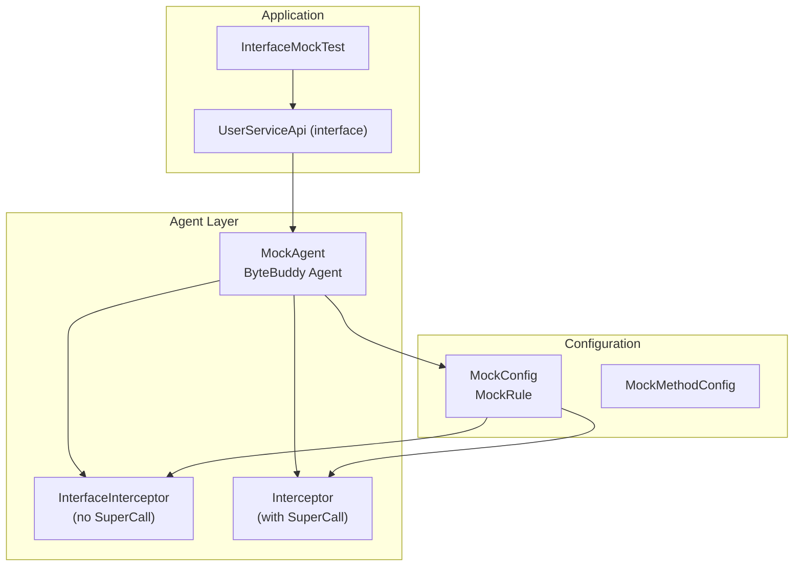
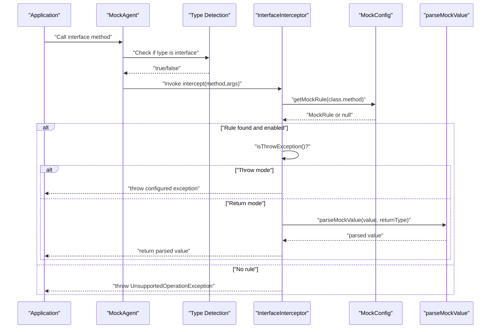
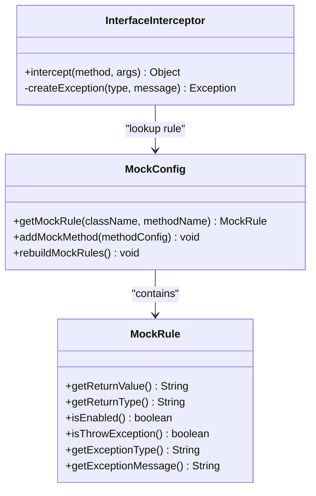
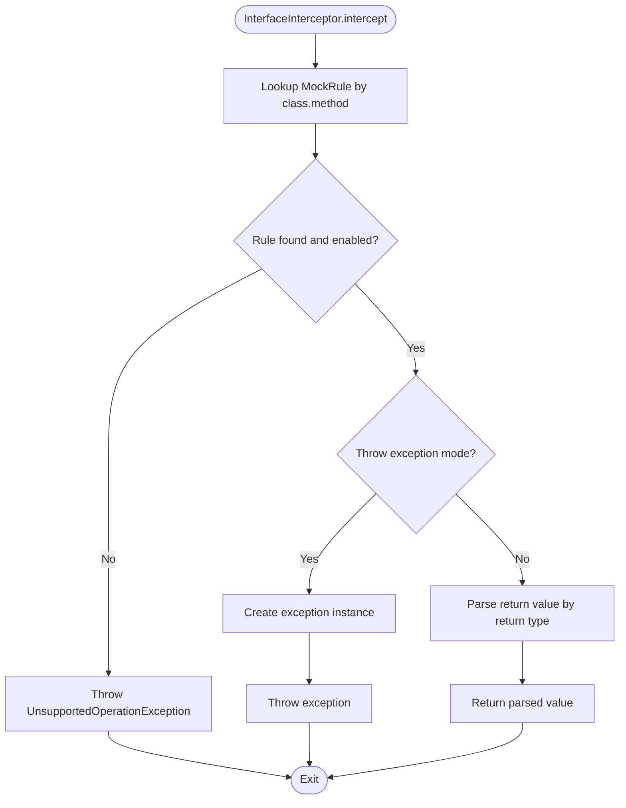
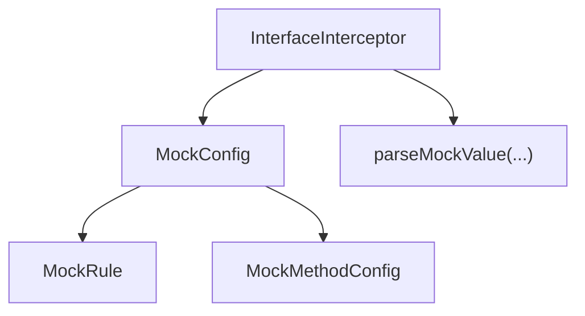

# Interface Interceptor

<cite>
**Referenced Files in This Document**
- [MockAgent.java](file://src/main/java/io/github/lancelothuxi/idea/plugin/mock/agent/MockAgent.java)
- [MockConfig.java](file://src/main/java/io/github/lancelothuxi/idea/plugin/mock/mock/MockConfig.java)
- [MockMethodConfig.java](file://src/main/java/io/github/lancelothuxi/idea/plugin/mock/mock/MockMethodConfig.java)
- [InterfaceMockTest.java](file://src/test/java/test/InterfaceMockTest.java)
- [UserServiceApi.java](file://src/test/java/test/UserServiceApi.java)
- [User.java](file://src/test/java/test/User.java)
- [ARCHITECTURE_DIAGRAM.md](file://docs/ARCHITECTURE_DIAGRAM.md)
- [INTERFACE_MOCKING_SUMMARY.md](file://docs/INTERFACE_MOCKING_SUMMARY.md)
- [DUBBO_FEIGN_GUIDE.md](file://docs/DUBBO_FEIGN_GUIDE.md)
</cite>

## Table of Contents
1. [Introduction](#introduction)
2. [Project Structure](#project-structure)
3. [Core Components](#core-components)
4. [Architecture Overview](#architecture-overview)
5. [Detailed Component Analysis](#detailed-component-analysis)
6. [Dependency Analysis](#dependency-analysis)
7. [Performance Considerations](#performance-considerations)
8. [Troubleshooting Guide](#troubleshooting-guide)
9. [Conclusion](#conclusion)
10. [Appendices](#appendices)

## Introduction
This document explains the interface interceptor implementation used to mock methods on interfaces (commonly used by RPC frameworks like Dubbo and Feign). It covers the design of the InterfaceInterceptor class, how it differs from the concrete class interceptor, why SuperCall is not used for interface methods, the rule lookup and value parsing mechanism, exception throwing behavior, limitations, use cases, and practical examples.

## Project Structure
The interface mocking feature spans several components:
- The agent that installs bytecode instrumentation and selects the appropriate interceptor based on whether the intercepted type is an interface or a concrete class
- The configuration model that stores per-method mock rules
- The interface interceptor implementation that handles method calls on interfaces
- Test examples demonstrating Dubbo/Feign-style interface usage

**Diagram sources**
- [MockAgent.java](file://src/main/java/io/github/lancelothuxi/idea/plugin/mock/agent/MockAgent.java#L124-L145)
- [MockAgent.java](file://src/main/java/io/github/lancelothuxi/idea/plugin/mock/agent/MockAgent.java#L344-L398)
- [MockConfig.java](file://src/main/java/io/github/lancelothuxi/idea/plugin/mock/mock/MockConfig.java#L144-L216)
- [MockMethodConfig.java](file://src/main/java/io/github/lancelothuxi/idea/plugin/mock/mock/MockMethodConfig.java#L1-L94)
- [InterfaceMockTest.java](file://src/test/java/test/InterfaceMockTest.java#L15-L75)
- [UserServiceApi.java](file://src/test/java/test/UserServiceApi.java#L9-L25)

**Section sources**
- [MockAgent.java](file://src/main/java/io/github/lancelothuxi/idea/plugin/mock/agent/MockAgent.java#L124-L145)
- [MockConfig.java](file://src/main/java/io/github/lancelothuxi/idea/plugin/mock/mock/MockConfig.java#L1-L218)
- [MockMethodConfig.java](file://src/main/java/io/github/lancelothuxi/idea/plugin/mock/mock/MockMethodConfig.java#L1-L94)
- [InterfaceMockTest.java](file://src/test/java/test/InterfaceMockTest.java#L1-L75)
- [UserServiceApi.java](file://src/test/java/test/UserServiceApi.java#L1-L25)

## Core Components
- InterfaceInterceptor: A ByteBuddy advice that intercepts interface method calls without SuperCall, returning mock values or throwing configured exceptions.
- MockConfig and MockRule: Store per-method mock configurations including return values, return types, exception modes, and enable/disable flags.
- MockMethodConfig: Serializable representation of a single method's mock configuration, used to populate MockConfig.
- MockAgent: Installs instrumentation and chooses between InterfaceInterceptor and the regular Interceptor depending on whether the target type is an interface.

Key differences:
- InterfaceInterceptor does not accept a SuperCall parameter and must either return a mock value or throw an exception.
- The regular Interceptor accepts SuperCall and can delegate to the original method when no mock is configured.

**Section sources**
- [MockAgent.java](file://src/main/java/io/github/lancelothuxi/idea/plugin/mock/agent/MockAgent.java#L124-L145)
- [MockAgent.java](file://src/main/java/io/github/lancelothuxi/idea/plugin/mock/agent/MockAgent.java#L344-L398)
- [MockConfig.java](file://src/main/java/io/github/lancelothuxi/idea/plugin/mock/mock/MockConfig.java#L144-L216)
- [MockMethodConfig.java](file://src/main/java/io/github/lancelothuxi/idea/plugin/mock/mock/MockMethodConfig.java#L1-L94)

## Architecture Overview
The agent detects whether a method belongs to an interface or a concrete class and routes to the appropriate interceptor. For interfaces, the InterfaceInterceptor performs rule lookup, parses return values, and either returns a mock value or throws an exception. If no rule exists, it throws an UnsupportedOperationException.

**Diagram sources**
- [MockAgent.java](file://src/main/java/io/github/lancelothuxi/idea/plugin/mock/agent/MockAgent.java#L124-L145)
- [MockAgent.java](file://src/main/java/io/github/lancelothuxi/idea/plugin/mock/agent/MockAgent.java#L352-L398)
- [MockConfig.java](file://src/main/java/io/github/lancelothuxi/idea/plugin/mock/mock/MockConfig.java#L24-L27)

**Section sources**
- [ARCHITECTURE_DIAGRAM.md](file://docs/ARCHITECTURE_DIAGRAM.md#L1-L78)
- [INTERFACE_MOCKING_SUMMARY.md](file://docs/INTERFACE_MOCKING_SUMMARY.md#L24-L38)

## Detailed Component Analysis

### InterfaceInterceptor Design
The InterfaceInterceptor is a ByteBuddy advice designed specifically for interface methods. It:
- Receives the invoked Method and arguments
- Logs the method call
- Looks up the mock rule in MockConfig
- Checks if the rule is enabled and whether it should throw an exception
- Parses the configured return value according to the declared return type
- Returns the parsed value or throws the configured exception
- Throws an UnsupportedOperationException if no rule is found

**Diagram sources**
- [MockAgent.java](file://src/main/java/io/github/lancelothuxi/idea/plugin/mock/agent/MockAgent.java#L344-L398)
- [MockConfig.java](file://src/main/java/io/github/lancelothuxi/idea/plugin/mock/mock/MockConfig.java#L144-L216)

**Section sources**
- [MockAgent.java](file://src/main/java/io/github/lancelothuxi/idea/plugin/mock/agent/MockAgent.java#L344-L398)
- [MockConfig.java](file://src/main/java/io/github/lancelothuxi/idea/plugin/mock/mock/MockConfig.java#L144-L216)

### Why SuperCall Is Not Used for Interface Methods
- Interfaces lack executable method bodies; there is no original implementation to call via SuperCall.
- Using SuperCall would require a concrete superclass method, which does not exist for interfaces.
- The InterfaceInterceptor must provide a deterministic return value or exception, ensuring predictable behavior during tests.

This design choice ensures that interface method calls are fully controlled by mock configuration, preventing accidental delegation to unimplemented runtime proxies.

**Section sources**
- [INTERFACE_MOCKING_SUMMARY.md](file://docs/INTERFACE_MOCKING_SUMMARY.md#L17-L21)
- [MockAgent.java](file://src/main/java/io/github/lancelothuxi/idea/plugin/mock/agent/MockAgent.java#L124-L133)

### Rule Lookup and Value Parsing
The rule lookup process:
- Extracts the declaring class and method name from the invoked Method
- Retrieves the MockRule from MockConfig using a composite key
- Validates that the rule is enabled
- If configured to throw an exception, constructs and throws the specified exception
- Otherwise, parses the return value using the declared return type and returns it

Value parsing:
- The parser converts the configured string value into the proper Java type based on the return type
- If parsing fails, the agent logs an error and returns null

**Diagram sources**
- [MockAgent.java](file://src/main/java/io/github/lancelothuxi/idea/plugin/mock/agent/MockAgent.java#L352-L398)
- [MockConfig.java](file://src/main/java/io/github/lancelothuxi/idea/plugin/mock/mock/MockConfig.java#L24-L27)

**Section sources**
- [MockAgent.java](file://src/main/java/io/github/lancelothuxi/idea/plugin/mock/agent/MockAgent.java#L352-L398)
- [MockConfig.java](file://src/main/java/io/github/lancelothuxi/idea/plugin/mock/mock/MockConfig.java#L88-L105)

### Exception Throwing Mechanism
The exception creation mechanism:
- Attempts to instantiate the configured exception class by name using reflection
- Validates that the class is assignable from Exception
- Falls back to RuntimeException if instantiation fails
- Throws the constructed exception to the caller

This ensures robustness when invalid exception types are configured while still allowing precise error simulation.

**Section sources**
- [MockAgent.java](file://src/main/java/io/github/lancelothuxi/idea/plugin/mock/agent/MockAgent.java#L387-L397)
- [MockAgent.java](file://src/main/java/io/github/lancelothuxi/idea/plugin/mock/agent/MockAgent.java#L328-L338)

### Differences Between InterfaceInterceptor and Concrete Interceptor
- InterfaceInterceptor: No SuperCall; must return or throw; used for interfaces
- Concrete Interceptor: Has SuperCall; can delegate to original method; used for classes with implementations

This difference enables interface mocking without requiring an original implementation while preserving fallback behavior for concrete classes.

**Section sources**
- [INTERFACE_MOCKING_SUMMARY.md](file://docs/INTERFACE_MOCKING_SUMMARY.md#L42-L59)
- [MockAgent.java](file://src/main/java/io/github/lancelothuxi/idea/plugin/mock/agent/MockAgent.java#L124-L133)

### Use Cases for Interface Method Mocking
- Microservice clients built on interfaces (e.g., Dubbo and Feign)
- Local development without external services
- Integration testing with varied response scenarios
- Error handling validation by simulating exceptions

Examples in this project:
- A Dubbo/Feign-style interface with three methods
- A test harness that creates a dynamic proxy and invokes interface methods under the agent’s interception

**Section sources**
- [DUBBO_FEIGN_GUIDE.md](file://docs/DUBBO_FEIGN_GUIDE.md#L68-L291)
- [InterfaceMockTest.java](file://src/test/java/test/InterfaceMockTest.java#L15-L75)
- [UserServiceApi.java](file://src/test/java/test/UserServiceApi.java#L9-L25)

### Examples of Interface Method Interception
- Demonstrates creating a dynamic proxy that simulates Dubbo/Feign behavior
- Calls interface methods that are intercepted by the agent
- Shows successful mocked returns and error handling when mocks are not configured

**Section sources**
- [InterfaceMockTest.java](file://src/test/java/test/InterfaceMockTest.java#L15-L75)
- [UserServiceApi.java](file://src/test/java/test/UserServiceApi.java#L9-L25)
- [User.java](file://src/test/java/test/User.java#L1-L64)

## Dependency Analysis
The InterfaceInterceptor depends on MockConfig for rule retrieval and on the parser to convert configured values into typed results. MockConfig encapsulates MockRule definitions and supports rebuilding rules from serialized method configs.

**Diagram sources**
- [MockAgent.java](file://src/main/java/io/github/lancelothuxi/idea/plugin/mock/agent/MockAgent.java#L352-L398)
- [MockConfig.java](file://src/main/java/io/github/lancelothuxi/idea/plugin/mock/mock/MockConfig.java#L1-L218)

**Section sources**
- [MockConfig.java](file://src/main/java/io/github/lancelothuxi/idea/plugin/mock/mock/MockConfig.java#L1-L218)
- [MockMethodConfig.java](file://src/main/java/io/github/lancelothuxi/idea/plugin/mock/mock/MockMethodConfig.java#L1-L94)

## Performance Considerations
- Rule lookup is O(1) using a hash map keyed by class.method
- Value parsing is lightweight and avoids heavy reflection
- Logging is performed at info/warning/severe levels; keep logging verbosity appropriate for test environments
- Exception creation uses reflection only when exception mode is enabled

[No sources needed since this section provides general guidance]

## Troubleshooting Guide
Common issues and resolutions:
- No mock configured: The interceptor throws an UnsupportedOperationException. Configure a mock in the tool window and ensure the rule is enabled.
- Incorrect method signature: Ensure the class and method names match exactly, including package names.
- Exception type not found: The agent falls back to RuntimeException. Verify the exception class name and availability on the classpath.
- Value parsing failure: Confirm the return type matches the configured value format; adjust the return type or value accordingly.
- Interface not detected: Verify the target is truly an interface and that the agent is properly injected.

**Section sources**
- [MockAgent.java](file://src/main/java/io/github/lancelothuxi/idea/plugin/mock/agent/MockAgent.java#L376-L378)
- [MockAgent.java](file://src/main/java/io/github/lancelothuxi/idea/plugin/mock/agent/MockAgent.java#L387-L397)
- [DUBBO_FEIGN_GUIDE.md](file://docs/DUBBO_FEIGN_GUIDE.md#L211-L291)

## Conclusion
The InterfaceInterceptor provides a focused, reliable mechanism for mocking interface methods used by RPC frameworks like Dubbo and Feign. By avoiding SuperCall and relying on explicit mock configuration, it ensures deterministic behavior in tests while supporting both return-value and exception modes. The design cleanly integrates with the broader agent and configuration system, enabling robust local development and integration testing.

[No sources needed since this section summarizes without analyzing specific files]

## Appendices

### Appendix A: Configuration Model Overview
- MockConfig maintains a map of rules and supports rebuilding from serialized method configs
- MockRule defines return values, return types, exception settings, and enablement
- MockMethodConfig is the serializable representation used to populate MockConfig

**Section sources**
- [MockConfig.java](file://src/main/java/io/github/lancelothuxi/idea/plugin/mock/mock/MockConfig.java#L1-L218)
- [MockMethodConfig.java](file://src/main/java/io/github/lancelothuxi/idea/plugin/mock/mock/MockMethodConfig.java#L1-L94)