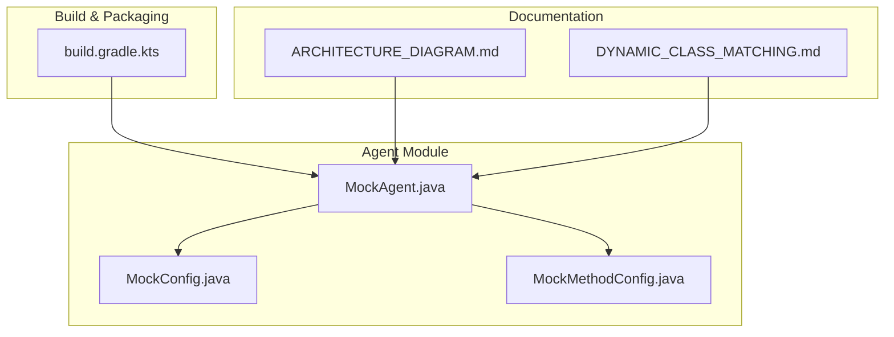
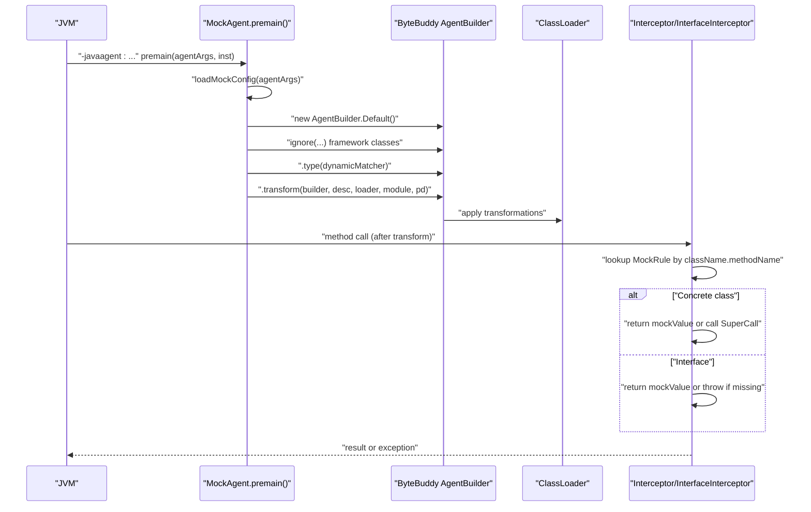
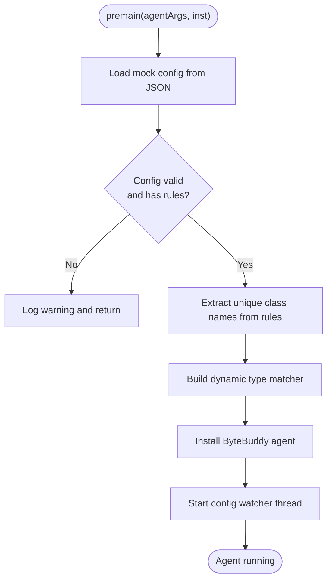
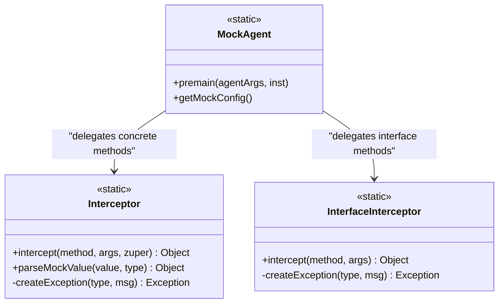
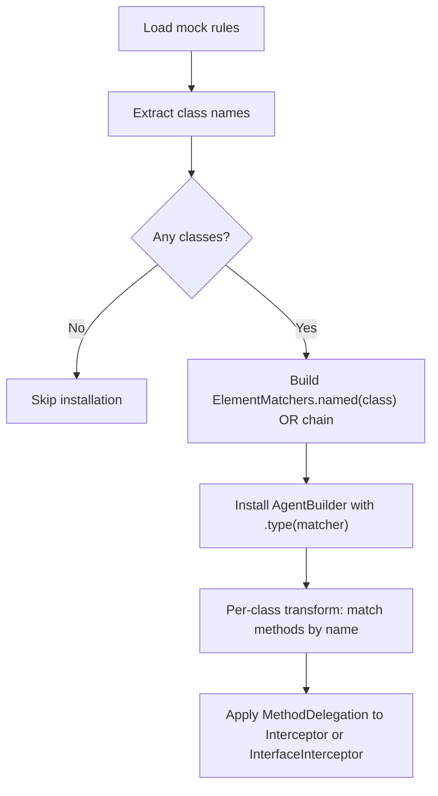
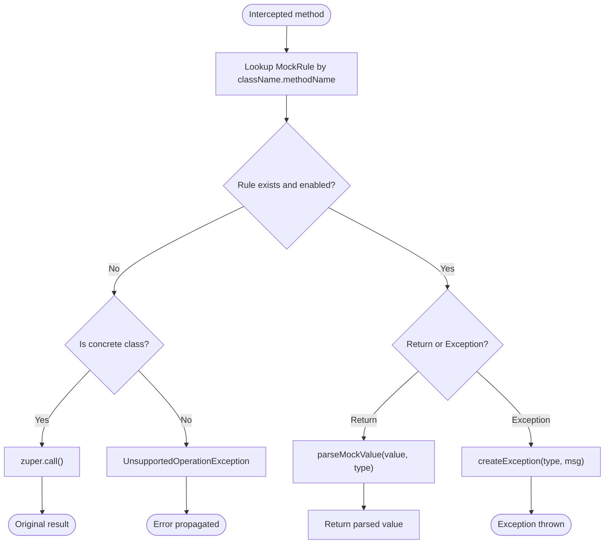
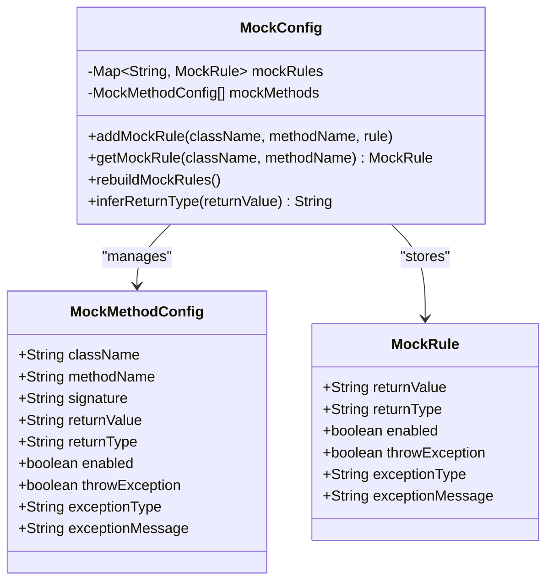
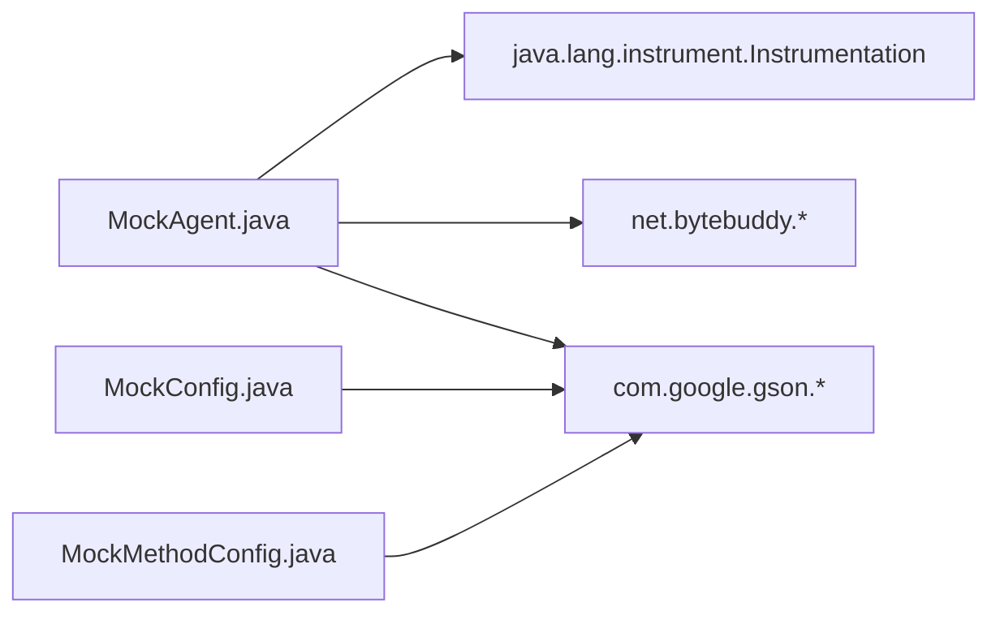

# Java Agent Implementation

<cite>
**Referenced Files in This Document**
- [MockAgent.java](file://src/main/java/io/github/lancelothuxi/idea/plugin/mock/agent/MockAgent.java)
- [MockConfig.java](file://src/main/java/io/github/lancelothuxi/idea/plugin/mock/mock/MockConfig.java)
- [MockMethodConfig.java](file://src/main/java/io/github/lancelothuxi/idea/plugin/mock/mock/MockMethodConfig.java)
- [ARCHITECTURE_DIAGRAM.md](file://docs/ARCHITECTURE_DIAGRAM.md)
- [DYNAMIC_CLASS_MATCHING.md](file://docs/DYNAMIC_CLASS_MATCHING.md)
- [build.gradle.kts](file://build.gradle.kts)
</cite>

## Table of Contents
1. [Introduction](#introduction)
2. [Project Structure](#project-structure)
3. [Core Components](#core-components)
4. [Architecture Overview](#architecture-overview)
5. [Detailed Component Analysis](#detailed-component-analysis)
6. [Dependency Analysis](#dependency-analysis)
7. [Performance Considerations](#performance-considerations)
8. [Troubleshooting Guide](#troubleshooting-guide)
9. [Conclusion](#conclusion)
10. [Appendices](#appendices)

## Introduction
This document explains the Java Agent implementation leveraging the ByteBuddy framework for runtime method interception. It covers agent initialization, JVM attachment, bytecode transformation, interceptor architecture for concrete classes versus interfaces, method matching strategies, return value injection, exception handling, performance and memory considerations, lifecycle and startup/shutdown behavior, and practical debugging/logging strategies. It also includes examples of custom interceptors and advanced ByteBuddy usage patterns grounded in the repository’s implementation.

## Project Structure
The agent resides under the mock plugin module and integrates with the IntelliJ platform. Key elements:
- Agent entry point and transformer logic
- Mock configuration model and rule storage
- Build configuration that packages the agent with shaded dependencies and sets the Premain-Class manifest attribute
- Documentation that illustrates architecture and dynamic class matching

**Diagram sources**
- [MockAgent.java](file://src/main/java/io/github/lancelothuxi/idea/plugin/mock/agent/MockAgent.java#L1-L400)
- [MockConfig.java](file://src/main/java/io/github/lancelothuxi/idea/plugin/mock/mock/MockConfig.java#L1-L218)
- [MockMethodConfig.java](file://src/main/java/io/github/lancelothuxi/idea/plugin/mock/mock/MockMethodConfig.java#L1-L94)
- [build.gradle.kts](file://build.gradle.kts#L89-L123)
- [ARCHITECTURE_DIAGRAM.md](file://docs/ARCHITECTURE_DIAGRAM.md#L1-L255)
- [DYNAMIC_CLASS_MATCHING.md](file://docs/DYNAMIC_CLASS_MATCHING.md#L1-L276)

**Section sources**
- [MockAgent.java](file://src/main/java/io/github/lancelothuxi/idea/plugin/mock/agent/MockAgent.java#L1-L400)
- [MockConfig.java](file://src/main/java/io/github/lancelothuxi/idea/plugin/mock/mock/MockConfig.java#L1-L218)
- [MockMethodConfig.java](file://src/main/java/io/github/lancelothuxi/idea/plugin/mock/mock/MockMethodConfig.java#L1-L94)
- [build.gradle.kts](file://build.gradle.kts#L89-L123)
- [ARCHITECTURE_DIAGRAM.md](file://docs/ARCHITECTURE_DIAGRAM.md#L1-L255)
- [DYNAMIC_CLASS_MATCHING.md](file://docs/DYNAMIC_CLASS_MATCHING.md#L1-L276)

## Core Components
- MockAgent: Provides the agent entry point, loads configuration, builds dynamic type matchers, installs ByteBuddy transformers, and manages a background config watcher.
- Interceptor and InterfaceInterceptor: Implement runtime interception logic for concrete classes and interfaces respectively, including fallback to original methods and exception injection.
- MockConfig and MockMethodConfig: Define the configuration model for mock rules and method-level configuration, including serialization and inference of return types.

Key responsibilities:
- Agent lifecycle: premain initializes, loads config, watches config, installs ByteBuddy transformations, logs lifecycle events.
- ByteBuddy integration: ignores framework classes, matches only configured classes, applies method-level interception per rule.
- Interception: concrete classes use MethodDelegation with SuperCall fallback; interfaces use MethodDelegation without SuperCall and require a mock rule.

**Section sources**
- [MockAgent.java](file://src/main/java/io/github/lancelothuxi/idea/plugin/mock/agent/MockAgent.java#L21-L145)
- [MockAgent.java](file://src/main/java/io/github/lancelothuxi/idea/plugin/mock/agent/MockAgent.java#L202-L339)
- [MockAgent.java](file://src/main/java/io/github/lancelothuxi/idea/plugin/mock/agent/MockAgent.java#L341-L398)
- [MockConfig.java](file://src/main/java/io/github/lancelothuxi/idea/plugin/mock/mock/MockConfig.java#L12-L218)
- [MockMethodConfig.java](file://src/main/java/io/github/lancelothuxi/idea/plugin/mock/mock/MockMethodConfig.java#L5-L94)

## Architecture Overview
The agent uses ByteBuddy to transform only those classes that appear in the mock configuration. At class-loading time, the agent detects whether a type is an interface or concrete class and routes to the appropriate interceptor. The interceptors consult the mock configuration and either return a mock value, throw a configured exception, or call the original method (for concrete classes).

**Diagram sources**
- [MockAgent.java](file://src/main/java/io/github/lancelothuxi/idea/plugin/mock/agent/MockAgent.java#L26-L145)
- [MockAgent.java](file://src/main/java/io/github/lancelothuxi/idea/plugin/mock/agent/MockAgent.java#L112-L140)
- [MockAgent.java](file://src/main/java/io/github/lancelothuxi/idea/plugin/mock/agent/MockAgent.java#L202-L339)
- [MockAgent.java](file://src/main/java/io/github/lancelothuxi/idea/plugin/mock/agent/MockAgent.java#L341-L398)

## Detailed Component Analysis

### MockAgent: Initialization, Transformation, and Lifecycle
- Initialization: premain reads agent manifest metadata, logs version/build info, validates agent arguments, loads configuration, starts a config watcher thread, and proceeds to install ByteBuddy transformations only for classes present in the mock rules.
- ByteBuddy installation: ignores framework and JDK classes, builds a dynamic type matcher from configured class names, and applies method-level interception per rule.
- Method interception: selects Interceptor for concrete classes (with SuperCall fallback) or InterfaceInterceptor for interfaces (no SuperCall).
- Configuration watcher: polls the config file every 2 seconds and reloads when modified.

**Diagram sources**
- [MockAgent.java](file://src/main/java/io/github/lancelothuxi/idea/plugin/mock/agent/MockAgent.java#L26-L145)
- [MockAgent.java](file://src/main/java/io/github/lancelothuxi/idea/plugin/mock/agent/MockAgent.java#L174-L200)

**Section sources**
- [MockAgent.java](file://src/main/java/io/github/lancelothuxi/idea/plugin/mock/agent/MockAgent.java#L26-L145)
- [MockAgent.java](file://src/main/java/io/github/lancelothuxi/idea/plugin/mock/agent/MockAgent.java#L174-L200)

### Interceptor Architecture: Concrete Classes vs Interfaces
- Concrete classes: Interceptor uses MethodDelegation with @SuperCall to call the original method as a fallback when no mock rule is found.
- Interfaces (e.g., Dubbo/Feign): InterfaceInterceptor does not use @SuperCall because there is no original implementation; it requires a mock rule and throws if absent.

**Diagram sources**
- [MockAgent.java](file://src/main/java/io/github/lancelothuxi/idea/plugin/mock/agent/MockAgent.java#L202-L339)
- [MockAgent.java](file://src/main/java/io/github/lancelothuxi/idea/plugin/mock/agent/MockAgent.java#L341-L398)

**Section sources**
- [MockAgent.java](file://src/main/java/io/github/lancelothuxi/idea/plugin/mock/agent/MockAgent.java#L112-L140)
- [MockAgent.java](file://src/main/java/io/github/lancelothuxi/idea/plugin/mock/agent/MockAgent.java#L202-L339)
- [MockAgent.java](file://src/main/java/io/github/lancelothuxi/idea/plugin/mock/agent/MockAgent.java#L341-L398)

### ByteBuddy Integration Patterns and Method Matching Strategies
- Ignoring framework classes: The agent ignores classes from common frameworks and JDK packages to minimize overhead and avoid interference.
- Dynamic type matching: The agent parses configured rules to extract class names and constructs a disjunction of named matchers to limit transformation scope.
- Method-level matching: For each matched class, the agent iterates configured rules and matches methods by name, applying delegation to the appropriate interceptor.

**Diagram sources**
- [MockAgent.java](file://src/main/java/io/github/lancelothuxi/idea/plugin/mock/agent/MockAgent.java#L62-L93)
- [MockAgent.java](file://src/main/java/io/github/lancelothuxi/idea/plugin/mock/agent/MockAgent.java#L112-L140)
- [DYNAMIC_CLASS_MATCHING.md](file://docs/DYNAMIC_CLASS_MATCHING.md#L30-L64)

**Section sources**
- [MockAgent.java](file://src/main/java/io/github/lancelothuxi/idea/plugin/mock/agent/MockAgent.java#L95-L140)
- [DYNAMIC_CLASS_MATCHING.md](file://docs/DYNAMIC_CLASS_MATCHING.md#L21-L64)

### Return Value Injection and Exception Handling
- Return value injection: The interceptor parses mock values according to declared return types, supporting primitives, Strings, Lists (including generic types), Maps, and arbitrary POJOs via JSON parsing.
- Exception injection: If a rule specifies exception mode, the agent instantiates an exception of the configured type (validated via reflection) or falls back to a runtime exception.
- Fallback behavior: For concrete classes without a mock rule, the agent invokes the original method via SuperCall; for interfaces without a mock rule, it throws an unsupported operation exception.

**Diagram sources**
- [MockAgent.java](file://src/main/java/io/github/lancelothuxi/idea/plugin/mock/agent/MockAgent.java#L202-L339)
- [MockAgent.java](file://src/main/java/io/github/lancelothuxi/idea/plugin/mock/agent/MockAgent.java#L341-L398)

**Section sources**
- [MockAgent.java](file://src/main/java/io/github/lancelothuxi/idea/plugin/mock/agent/MockAgent.java#L202-L339)
- [MockAgent.java](file://src/main/java/io/github/lancelothuxi/idea/plugin/mock/agent/MockAgent.java#L341-L398)

### Configuration Model and Rule Management
- MockConfig stores a map of fully qualified method keys to MockRule and a list of MockMethodConfig entries.
- MockMethodConfig captures method-level metadata including return value, return type, enablement, and exception configuration.
- The agent reconstructs mock rules from persisted method configs when needed.

**Diagram sources**
- [MockConfig.java](file://src/main/java/io/github/lancelothuxi/idea/plugin/mock/mock/MockConfig.java#L12-L218)
- [MockMethodConfig.java](file://src/main/java/io/github/lancelothuxi/idea/plugin/mock/mock/MockMethodConfig.java#L5-L94)

**Section sources**
- [MockConfig.java](file://src/main/java/io/github/lancelothuxi/idea/plugin/mock/mock/MockConfig.java#L12-L218)
- [MockMethodConfig.java](file://src/main/java/io/github/lancelothuxi/idea/plugin/mock/mock/MockMethodConfig.java#L5-L94)

### Advanced ByteBuddy Usage Patterns
- Self-contained agent: The build script shades Gson and ByteBuddy to avoid conflicts with user applications.
- Manifest setup: The agent declares itself as the Premain-Class and enables retransformation/redefinition for robustness.
- Dynamic scope: The agent limits transformations to only those classes present in the configuration, reducing overhead and risk.

Practical examples grounded in the code:
- Shading and manifest attributes: see the agent packaging configuration.
- Dynamic type matcher construction: see the class name extraction and matcher building logic.
- Conditional interception: see the per-method rule application inside the transform callback.

**Section sources**
- [build.gradle.kts](file://build.gradle.kts#L89-L123)
- [MockAgent.java](file://src/main/java/io/github/lancelothuxi/idea/plugin/mock/agent/MockAgent.java#L62-L93)
- [MockAgent.java](file://src/main/java/io/github/lancelothuxi/idea/plugin/mock/agent/MockAgent.java#L112-L140)

## Dependency Analysis
The agent depends on:
- ByteBuddy for instrumentation and method delegation
- Gson for JSON parsing of mock values and configuration
- Standard Java Instrumentation APIs for JVM attachment

**Diagram sources**
- [MockAgent.java](file://src/main/java/io/github/lancelothuxi/idea/plugin/mock/agent/MockAgent.java#L1-L20)
- [MockConfig.java](file://src/main/java/io/github/lancelothuxi/idea/plugin/mock/mock/MockConfig.java#L1-L10)
- [MockMethodConfig.java](file://src/main/java/io/github/lancelothuxi/idea/plugin/mock/mock/MockMethodConfig.java#L1-L10)

**Section sources**
- [MockAgent.java](file://src/main/java/io/github/lancelothuxi/idea/plugin/mock/agent/MockAgent.java#L1-L20)
- [MockConfig.java](file://src/main/java/io/github/lancelothuxi/idea/plugin/mock/mock/MockConfig.java#L1-L10)
- [MockMethodConfig.java](file://src/main/java/io/github/lancelothuxi/idea/plugin/mock/mock/MockMethodConfig.java#L1-L10)

## Performance Considerations
- Minimal transformation scope: Only classes present in the mock configuration are transformed, avoiding broad class scanning.
- Efficient lookup: Mock rules are stored in a HashMap keyed by fully qualified method names, enabling O(1) lookup.
- Lazy parsing: JSON parsing occurs only when a mock value is returned; otherwise, the interceptor exits early.
- Fallback efficiency: Concrete classes can fall back to the original method without additional overhead beyond the SuperCall invocation.
- Memory footprint: The agent maintains a single static configuration instance and a background watcher thread; the watcher is daemon and lightweight.

[No sources needed since this section provides general guidance]

## Troubleshooting Guide
Common issues and remedies:
- No configuration provided: The agent logs a severe warning when no config path is supplied and returns without installing.
- Empty or invalid configuration: The agent logs warnings and skips installation if no rules are found.
- Missing mock rule for interface: InterfaceInterceptor throws an unsupported operation exception when no mock is configured; ensure the rule exists.
- Exception creation failures: If the configured exception type cannot be instantiated, the agent falls back to a runtime exception and logs a warning.
- JSON parsing errors: If mock values cannot be parsed into the declared return type, the agent logs an error and returns null; verify JSON validity and type declarations.
- Class loading conflicts: The build shades Gson and ByteBuddy to prevent dependency conflicts; ensure the shaded artifacts are included in the packaged agent.

**Section sources**
- [MockAgent.java](file://src/main/java/io/github/lancelothuxi/idea/plugin/mock/agent/MockAgent.java#L42-L58)
- [MockAgent.java](file://src/main/java/io/github/lancelothuxi/idea/plugin/mock/agent/MockAgent.java#L328-L338)
- [MockAgent.java](file://src/main/java/io/github/lancelothuxi/idea/plugin/mock/agent/MockAgent.java#L387-L397)
- [MockAgent.java](file://src/main/java/io/github/lancelothuxi/idea/plugin/mock/agent/MockAgent.java#L322-L326)
- [build.gradle.kts](file://build.gradle.kts#L94-L99)

## Conclusion
The MockAgent demonstrates a production-ready Java agent built on ByteBuddy that dynamically targets only configured classes and methods. It supports both concrete classes (via SuperCall fallback) and interfaces (via mandatory mock rules), injects return values or exceptions, and provides robust configuration management and logging. The shading strategy and manifest setup ensure compatibility and reliability in diverse environments.

[No sources needed since this section summarizes without analyzing specific files]

## Appendices

### Agent Lifecycle and Startup Sequence
- JVM starts with -javaagent pointing to the packaged agent JAR with a configuration path argument.
- premain loads the manifest metadata, validates arguments, loads configuration, starts the config watcher, and installs ByteBuddy transformers.
- On shutdown, the agent does not register explicit shutdown hooks; transformations cease when the JVM terminates.

**Section sources**
- [MockAgent.java](file://src/main/java/io/github/lancelothuxi/idea/plugin/mock/agent/MockAgent.java#L26-L145)
- [build.gradle.kts](file://build.gradle.kts#L100-L110)

### Shutdown Procedures
- The agent does not implement explicit shutdown logic. Upon JVM termination, ByteBuddy transformations are released automatically by the JVM.

**Section sources**
- [MockAgent.java](file://src/main/java/io/github/lancelothuxi/idea/plugin/mock/agent/MockAgent.java#L174-L200)

### Debugging Techniques and Logging Strategies
- Enable verbose logging by adjusting the logger level in the agent; the agent logs version, configuration loading, class interception, and rule resolution.
- Use the config watcher to validate changes: the agent logs when it reloads configuration upon file modification.
- For ByteBuddy diagnostics, consider adding listener callbacks to the AgentBuilder if needed for deeper instrumentation insights.

**Section sources**
- [MockAgent.java](file://src/main/java/io/github/lancelothuxi/idea/plugin/mock/agent/MockAgent.java#L26-L40)
- [MockAgent.java](file://src/main/java/io/github/lancelothuxi/idea/plugin/mock/agent/MockAgent.java#L174-L200)