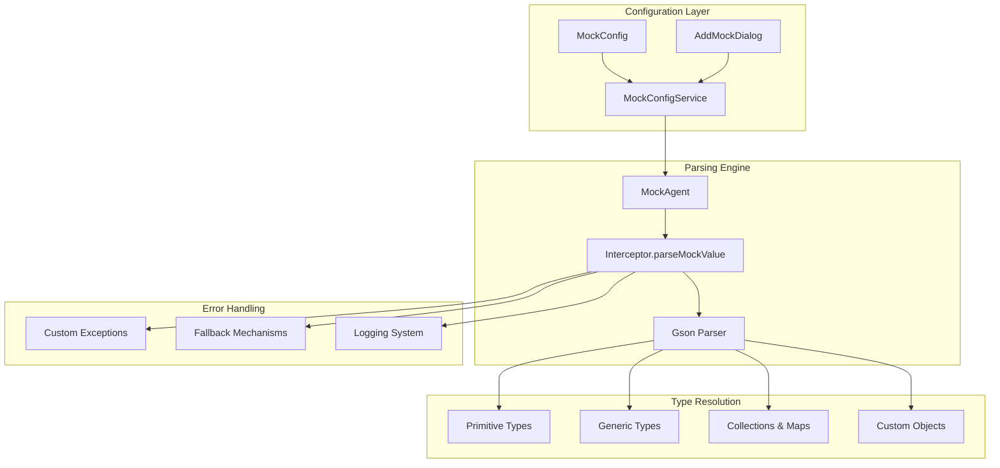
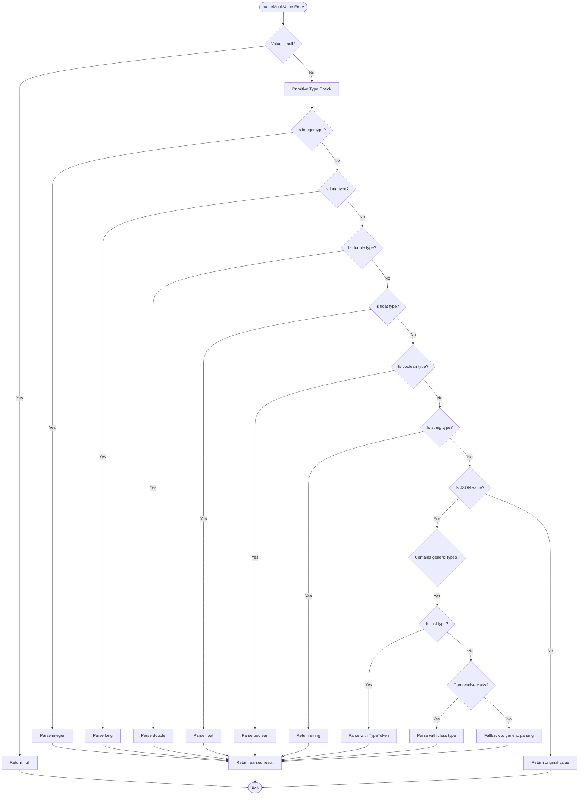
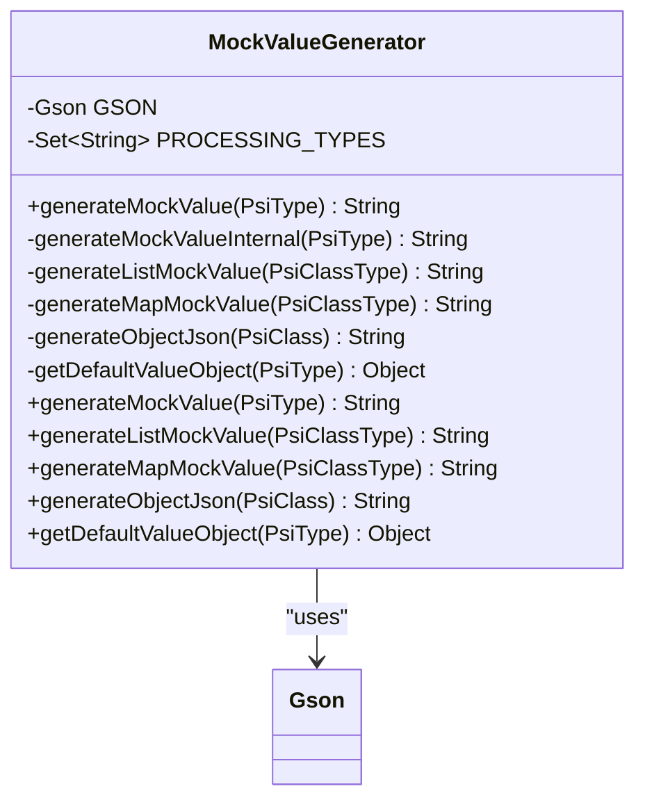
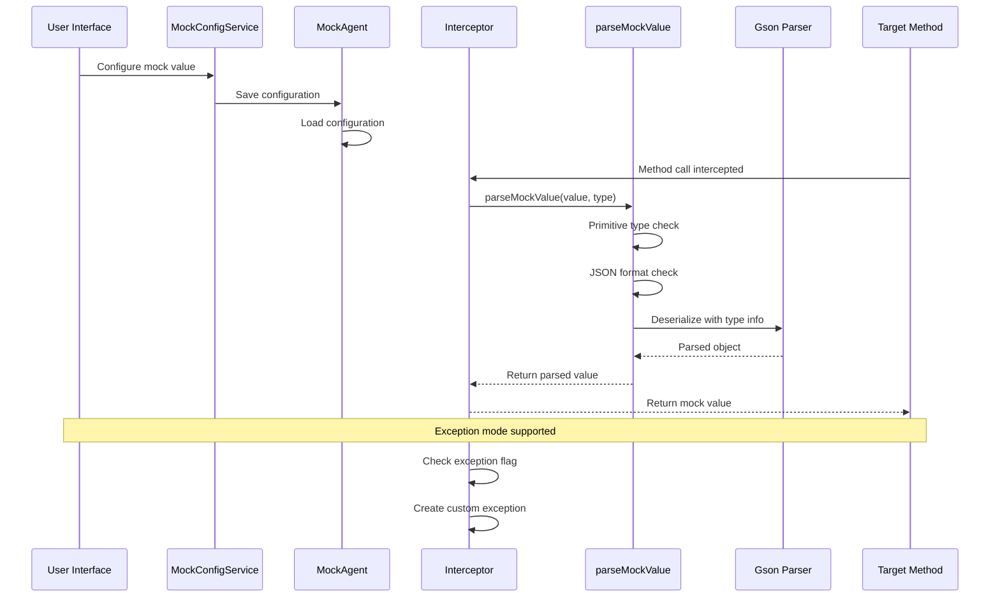
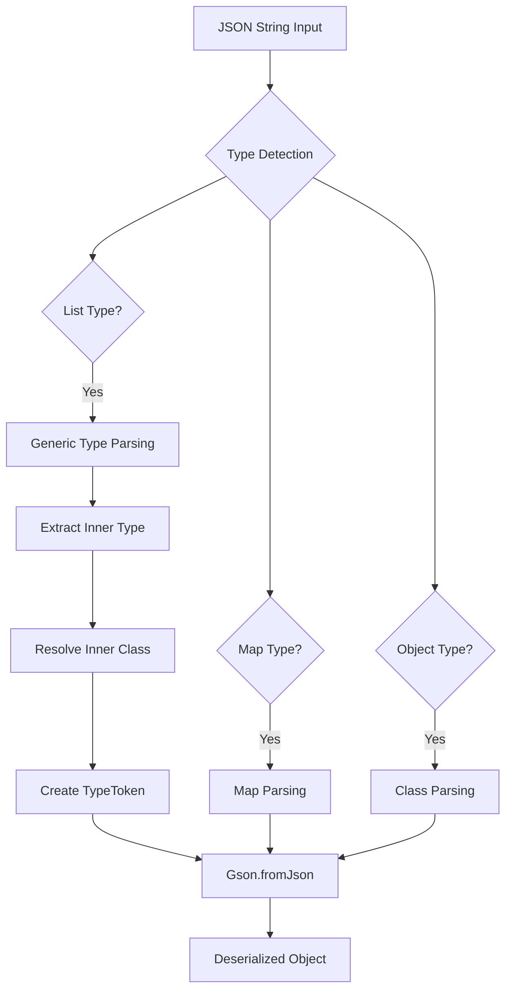
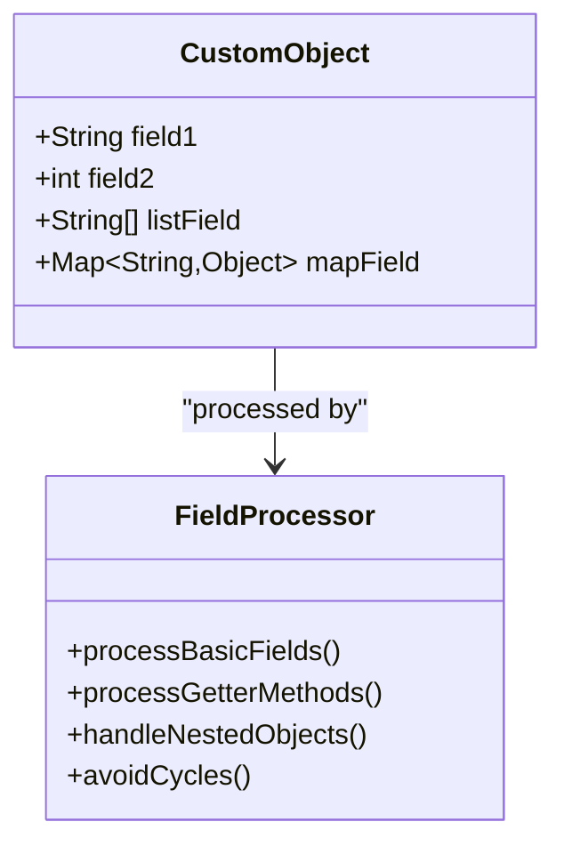
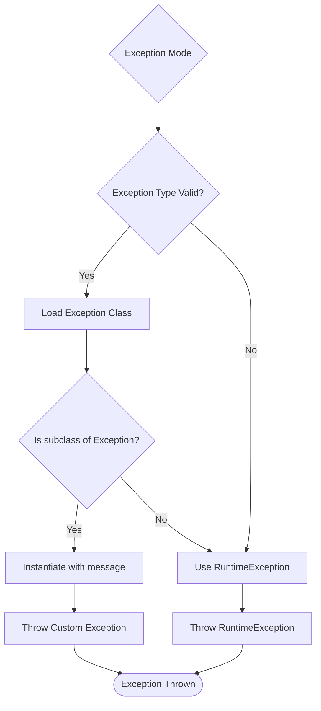
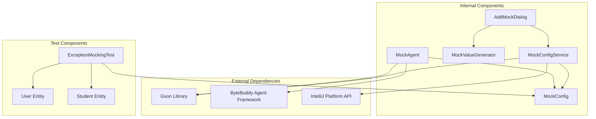

# Value Parsing System

<cite>
**Referenced Files in This Document**
- [MockAgent.java](file://src/main/java/io/github/lancelothuxi/idea/plugin/mock/agent/MockAgent.java)
- [MockValueGenerator.java](file://src/main/java/io/github/lancelothuxi/idea/plugin/mock/util/MockValueGenerator.java)
- [MockConfig.java](file://src/main/java/io/github/lancelothuxi/idea/plugin/mock/mock/MockConfig.java)
- [MockConfigService.java](file://src/main/java/io/github/lancelothuxi/idea/plugin/mock/service/MockConfigService.java)
- [AddMockDialog.java](file://src/main/java/io/github/lancelothuxi/idea/plugin/mock/ui/AddMockDialog.java)
- [ExceptionMockingTest.java](file://src/test/java/test/ExceptionMockingTest.java)
- [User.java](file://src/test/java/test/User.java)
- [Student.java](file://src/test/java/test/Student.java)
</cite>

## Table of Contents
1. [Introduction](#introduction)
2. [System Architecture](#system-architecture)
3. [Core Components](#core-components)
4. [Architecture Overview](#architecture-overview)
5. [Detailed Component Analysis](#detailed-component-analysis)
6. [Dependency Analysis](#dependency-analysis)
7. [Performance Considerations](#performance-considerations)
8. [Troubleshooting Guide](#troubleshooting-guide)
9. [Conclusion](#conclusion)

## Introduction

The mock value parsing system is a sophisticated component within the Mock Runner plugin that handles the conversion of mock configuration values into appropriate Java objects at runtime. This system bridges the gap between user-friendly JSON configuration and strongly-typed Java method return values, supporting primitive types, complex objects, collections, and generic types.

The system operates through a multi-layered approach that combines primitive type conversion, JSON deserialization using Gson, and intelligent type resolution for complex generics. It provides robust error handling, fallback mechanisms, and comprehensive support for custom exception creation.

## System Architecture

The value parsing system follows a layered architecture with clear separation of concerns:

**Diagram sources**
- [MockAgent.java](file://src/main/java/io/github/lancelothuxi/idea/plugin/mock/agent/MockAgent.java#L246-L326)
- [MockConfig.java](file://src/main/java/io/github/lancelothuxi/idea/plugin/mock/mock/MockConfig.java#L1-L218)
- [MockConfigService.java](file://src/main/java/io/github/lancelothuxi/idea/plugin/mock/service/MockConfigService.java#L1-L197)

## Core Components

### MockAgent.Interceptor.parseMockValue

The central parsing mechanism that handles all value conversions. This method implements a comprehensive type resolution strategy:

**Diagram sources**
- [MockAgent.java](file://src/main/java/io/github/lancelothuxi/idea/plugin/mock/agent/MockAgent.java#L246-L326)

### MockValueGenerator

The value generation component that creates mock data for UI and testing scenarios:

**Diagram sources**
- [MockValueGenerator.java](file://src/main/java/io/github/lancelothuxi/idea/plugin/mock/util/MockValueGenerator.java#L1-L289)

**Section sources**
- [MockAgent.java](file://src/main/java/io/github/lancelothuxi/idea/plugin/mock/agent/MockAgent.java#L246-L326)
- [MockValueGenerator.java](file://src/main/java/io/github/lancelothuxi/idea/plugin/mock/util/MockValueGenerator.java#L1-L289)

## Architecture Overview

The value parsing system integrates seamlessly with the broader Mock Runner architecture:

**Diagram sources**
- [MockAgent.java](file://src/main/java/io/github/lancelothuxi/idea/plugin/mock/agent/MockAgent.java#L202-L244)
- [MockConfigService.java](file://src/main/java/io/github/lancelothuxi/idea/plugin/mock/service/MockConfigService.java#L41-L58)

## Detailed Component Analysis

### Primitive Type Conversion

The system provides comprehensive support for Java primitive types and their wrapper classes:

| Type | Supported Formats | Example |
|------|-------------------|---------|
| int | Integer.parseInt() | "42", "-17" |
| long | Long.parseLong() | "123456789L" |
| double | Double.parseDouble() | "3.14159" |
| float | Float.parseFloat() | "2.718f" |
| boolean | Boolean.parseBoolean() | "true", "false" |
| String | Direct assignment | "hello world" |

**Section sources**
- [MockAgent.java](file://src/main/java/io/github/lancelothuxi/idea/plugin/mock/agent/MockAgent.java#L254-L272)

### JSON Deserialization with Gson

The Gson integration provides powerful object parsing capabilities:

**Diagram sources**
- [MockAgent.java](file://src/main/java/io/github/lancelothuxi/idea/plugin/mock/agent/MockAgent.java#L274-L318)

**Section sources**
- [MockAgent.java](file://src/main/java/io/github/lancelothuxi/idea/plugin/mock/agent/MockAgent.java#L274-L318)

### Generic Type Handling

The system excels at handling complex generic types:

#### List<T> Support
- **Pattern Recognition**: Detects `List<T>` and `java.util.List<T>` patterns
- **Inner Type Extraction**: Parses `<T>` portion to extract element type
- **TypeToken Creation**: Uses `TypeToken.getParameterized()` for proper type resolution
- **Fallback Mechanism**: Falls back to raw `List.class` if inner class not found

#### Map<K,V> Support  
- **Pattern Recognition**: Handles `Map<K,V>` and `java.util.Map<K,V>`
- **Parameter Extraction**: Extracts both key and value types
- **Type Safety**: Maintains type safety for both keys and values

**Section sources**
- [MockAgent.java](file://src/main/java/io/github/lancelothuxi/idea/plugin/mock/agent/MockAgent.java#L282-L295)

### Custom Object Parsing

The system supports parsing into custom classes with comprehensive field handling:

**Diagram sources**
- [MockValueGenerator.java](file://src/main/java/io/github/lancelothuxi/idea/plugin/mock/util/MockValueGenerator.java#L138-L192)

**Section sources**
- [MockValueGenerator.java](file://src/main/java/io/github/lancelothuxi/idea/plugin/mock/util/MockValueGenerator.java#L138-L192)

### Exception Creation System

The system provides robust exception handling with custom exception types:

**Diagram sources**
- [MockAgent.java](file://src/main/java/io/github/lancelothuxi/idea/plugin/mock/agent/MockAgent.java#L328-L338)

**Section sources**
- [MockAgent.java](file://src/main/java/io/github/lancelothuxi/idea/plugin/mock/agent/MockAgent.java#L328-L338)
- [ExceptionMockingTest.java](file://src/test/java/test/ExceptionMockingTest.java#L38-L47)

## Dependency Analysis

The value parsing system has well-defined dependencies that ensure modularity and maintainability:

**Diagram sources**
- [MockAgent.java](file://src/main/java/io/github/lancelothuxi/idea/plugin/mock/agent/MockAgent.java#L1-L20)
- [MockConfigService.java](file://src/main/java/io/github/lancelothuxi/idea/plugin/mock/service/MockConfigService.java#L1-L15)

**Section sources**
- [MockAgent.java](file://src/main/java/io/github/lancelothuxi/idea/plugin/mock/agent/MockAgent.java#L1-L20)
- [MockConfigService.java](file://src/main/java/io/github/lancelothuxi/idea/plugin/mock/service/MockConfigService.java#L1-L15)

## Performance Considerations

The value parsing system is designed with performance optimization in mind:

### Caching Strategies
- **Class Resolution Cache**: Prevents repeated Class.forName() calls
- **TypeToken Cache**: Reuses TypeToken instances for generic types
- **Gson Instance Management**: Creates Gson instances only when needed

### Lazy Evaluation
- **Conditional Parsing**: JSON parsing only occurs when value starts with `[` or `{`
- **Early Termination**: Primitive type checks short-circuit the parsing process
- **Minimal Object Creation**: Reuses existing objects where possible

### Memory Efficiency
- **Circular Reference Prevention**: Tracks processing types to prevent infinite recursion
- **Resource Cleanup**: Proper cleanup of temporary objects and collections

## Troubleshooting Guide

### Common Parsing Issues

#### Unknown Type Errors
**Symptoms**: Values not parsed correctly, returned as strings
**Causes**: 
- Unknown class names in generic types
- Incorrect type format in configuration
- Missing classpath entries

**Solutions**:
1. Verify class names in generic types (e.g., `List<com.student.Student>`)
2. Ensure classes are available in the classpath
3. Use fully qualified class names

#### JSON Parsing Failures
**Symptoms**: NullPointerException or ClassCastException
**Causes**:
- Malformed JSON syntax
- Type mismatch between JSON and expected type
- Missing fields in complex objects

**Solutions**:
1. Validate JSON syntax using online validators
2. Ensure JSON structure matches expected type
3. Check for missing required fields

#### Generic Type Resolution Issues
**Symptoms**: Runtime errors when parsing `List<T>` or `Map<K,V>`
**Causes**:
- Inner class not found
- Incorrect generic type syntax
- Missing type parameters

**Solutions**:
1. Verify inner class exists and is accessible
2. Use correct generic syntax: `List<com.example.User>`
3. Ensure all type parameters are specified

### Exception Handling Troubleshooting

#### Custom Exception Creation Failures
**Symptoms**: RuntimeException instead of expected exception type
**Causes**:
- Invalid exception class name
- Exception class not extending `java.lang.Exception`
- Missing constructor accepting String parameter

**Solutions**:
1. Verify exception class extends `java.lang.Exception`
2. Ensure constructor with String parameter exists
3. Use fully qualified class names

#### Configuration Switching Issues
**Symptoms**: Changes not taking effect immediately
**Causes**:
- Configuration not saved properly
- Agent not reloading configuration
- UI not refreshing state

**Solutions**:
1. Save configuration using the UI
2. Verify configuration file is written to temp directory
3. Restart IDE to force agent reload

**Section sources**
- [MockAgent.java](file://src/main/java/io/github/lancelothuxi/idea/plugin/mock/agent/MockAgent.java#L322-L326)
- [MockConfigService.java](file://src/main/java/io/github/lancelothuxi/idea/plugin/mock/service/MockConfigService.java#L41-L58)

## Conclusion

The mock value parsing system represents a sophisticated solution for converting user-friendly configuration into strongly-typed Java objects. Its multi-layered architecture provides comprehensive support for primitive types, complex objects, collections, and generic types, while maintaining robust error handling and performance characteristics.

The system's strength lies in its intelligent type resolution, particularly for generic types like `List<Student>`, and its flexible exception creation capabilities. The integration with Gson ensures reliable JSON deserialization while the careful error handling provides graceful fallback mechanisms.

Key benefits include:
- **Type Safety**: Maintains compile-time type checking
- **Flexibility**: Supports complex generic types and custom objects
- **Performance**: Optimized parsing with caching and lazy evaluation
- **Reliability**: Comprehensive error handling and fallback mechanisms
- **Extensibility**: Modular design allows for future enhancements

The system successfully bridges the gap between development convenience and production reliability, making mock configuration both powerful and safe to use in real-world applications.