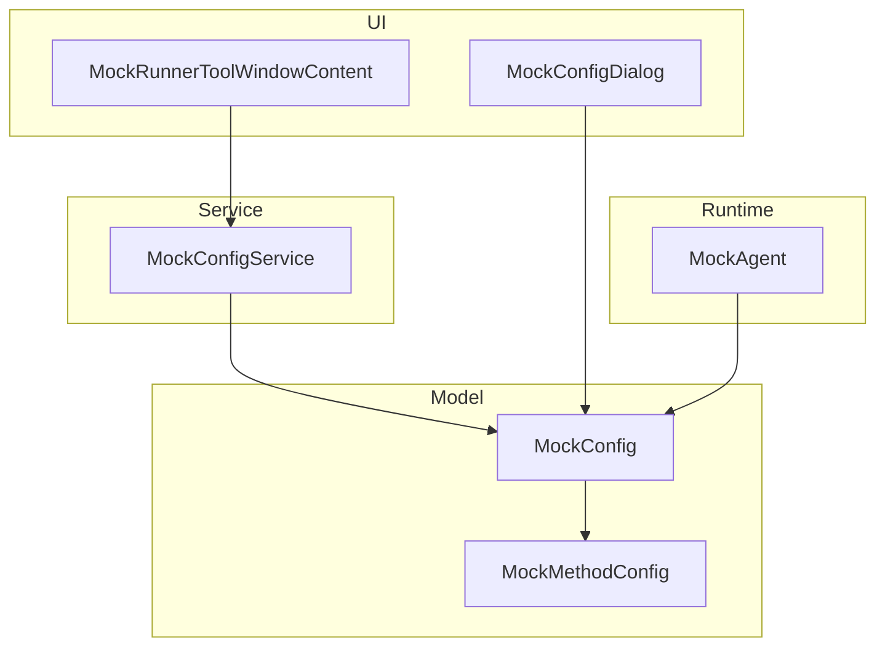
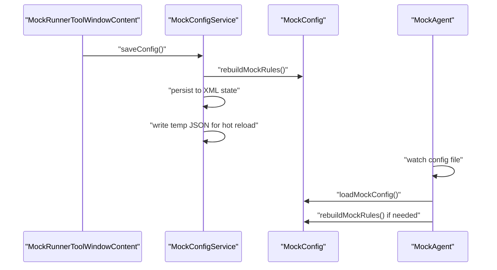
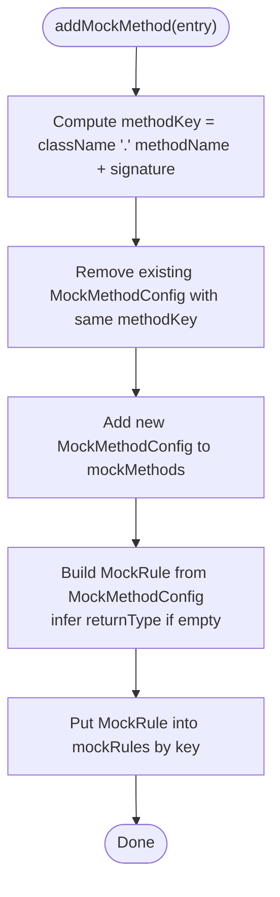
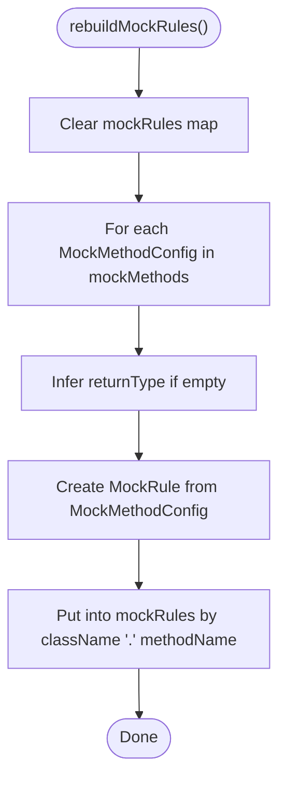
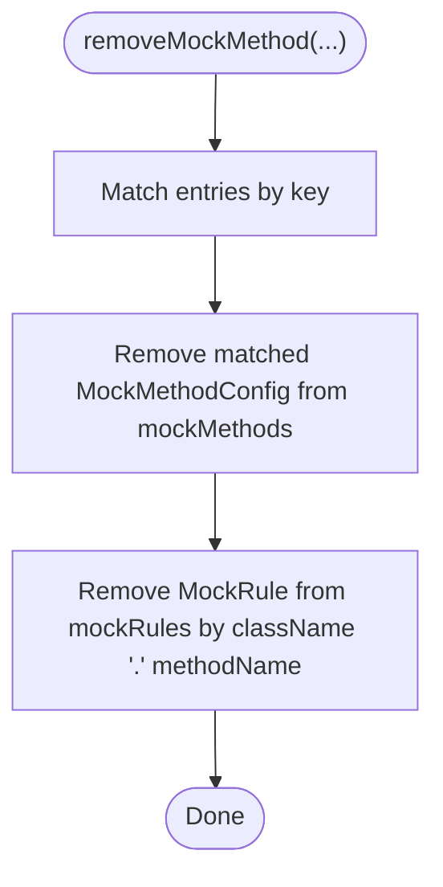
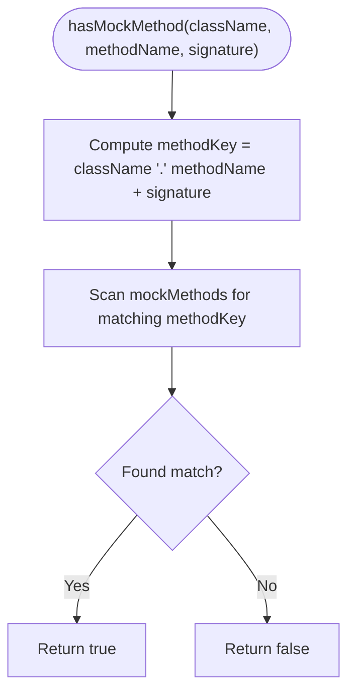
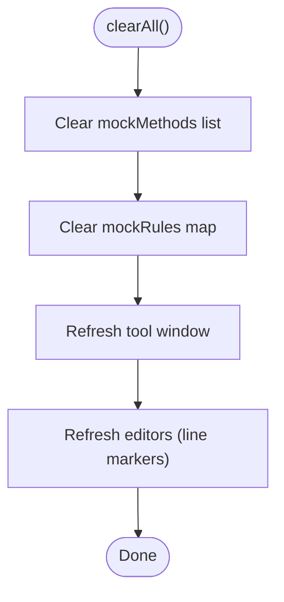
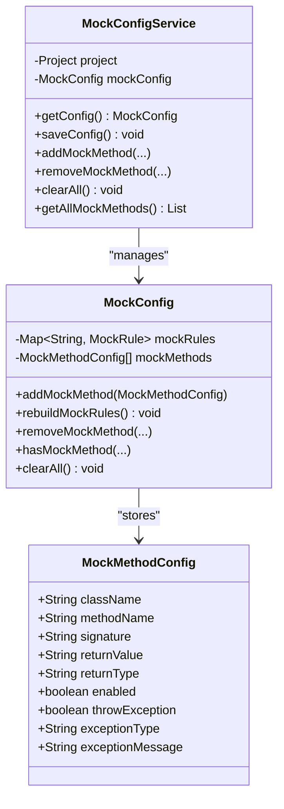
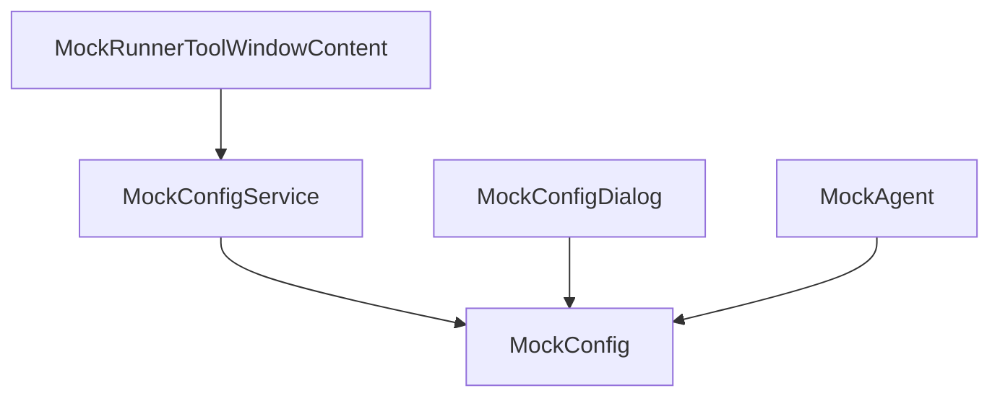

# Configuration Management

<cite>
**Referenced Files in This Document**
- [MockConfig.java](file://src/main/java/io/github/lancelothuxi/idea/plugin/mock/mock/MockConfig.java)
- [MockMethodConfig.java](file://src/main/java/io/github/lancelothuxi/idea/plugin/mock/mock/MockMethodConfig.java)
- [MockConfigService.java](file://src/main/java/io/github/lancelothuxi/idea/plugin/mock/service/MockConfigService.java)
- [MockRunnerToolWindowContent.java](file://src/main/java/io/github/lancelothuxi/idea/plugin/mock/ui/MockRunnerToolWindowContent.java)
- [MockConfigDialog.java](file://src/main/java/io/github/lancelothuxi/idea/plugin/mock/ui/MockConfigDialog.java)
- [MockAgent.java](file://src/main/java/io/github/lancelothuxi/idea/plugin/mock/agent/MockAgent.java)
- [ConfigSwitchingTest.java](file://src/test/java/test/ConfigSwitchingTest.java)
</cite>

## Table of Contents
1. [Introduction](#introduction)
2. [Project Structure](#project-structure)
3. [Core Components](#core-components)
4. [Architecture Overview](#architecture-overview)
5. [Detailed Component Analysis](#detailed-component-analysis)
6. [Dependency Analysis](#dependency-analysis)
7. [Performance Considerations](#performance-considerations)
8. [Troubleshooting Guide](#troubleshooting-guide)
9. [Conclusion](#conclusion)
10. [Appendices](#appendices)

## Introduction
This document explains the configuration management subsystem responsible for defining, persisting, synchronizing, and applying mock rules during runtime. It covers:
- The addMockMethod workflow including duplicate detection, replacement of existing configurations, and automatic MockRule creation
- The rebuildMockRules mechanism used to synchronize data after persistence operations
- The removeMockMethod functionality with both signature-aware and legacy removal methods
- The hasMockMethod duplicate detection system and conflict resolution strategies
- The clearAll operation for complete configuration reset
- Integration with MockConfigService for project-specific configuration management
- Practical examples for common scenarios such as adding exception mocks, updating return values, and managing configuration lifecycles
- Thread safety considerations and concurrent access patterns

## Project Structure
The configuration management spans several modules:
- Model layer: MockConfig and MockMethodConfig define the in-memory representation of mock rules and method-level configuration
- Service layer: MockConfigService manages persistence, UI synchronization, and project-scoped configuration lifecycle
- UI layer: MockRunnerToolWindowContent and MockConfigDialog provide user interfaces to view, edit, and apply configurations
- Runtime layer: MockAgent loads and watches configuration files for hot reload

**Diagram sources**
- [MockConfig.java](file://src/main/java/io/github/lancelothuxi/idea/plugin/mock/mock/MockConfig.java#L12-L218)
- [MockMethodConfig.java](file://src/main/java/io/github/lancelothuxi/idea/plugin/mock/mock/MockMethodConfig.java#L5-L94)
- [MockConfigService.java](file://src/main/java/io/github/lancelothuxi/idea/plugin/mock/service/MockConfigService.java#L23-L197)
- [MockRunnerToolWindowContent.java](file://src/main/java/io/github/lancelothuxi/idea/plugin/mock/ui/MockRunnerToolWindowContent.java#L22-L449)
- [MockConfigDialog.java](file://src/main/java/io/github/lancelothuxi/idea/plugin/mock/ui/MockConfigDialog.java#L27-L293)
- [MockAgent.java](file://src/main/java/io/github/lancelothuxi/idea/plugin/mock/agent/MockAgent.java#L151-L202)

**Section sources**
- [MockConfig.java](file://src/main/java/io/github/lancelothuxi/idea/plugin/mock/mock/MockConfig.java#L12-L218)
- [MockMethodConfig.java](file://src/main/java/io/github/lancelothuxi/idea/plugin/mock/mock/MockMethodConfig.java#L5-L94)
- [MockConfigService.java](file://src/main/java/io/github/lancelothuxi/idea/plugin/mock/service/MockConfigService.java#L23-L197)
- [MockRunnerToolWindowContent.java](file://src/main/java/io/github/lancelothuxi/idea/plugin/mock/ui/MockRunnerToolWindowContent.java#L22-L449)
- [MockConfigDialog.java](file://src/main/java/io/github/lancelothuxi/idea/plugin/mock/ui/MockConfigDialog.java#L27-L293)
- [MockAgent.java](file://src/main/java/io/github/lancelothuxi/idea/plugin/mock/agent/MockAgent.java#L151-L202)

## Core Components
- MockConfig: Stores method-level MockMethodConfig entries and maintains a derived map of MockRule for runtime use. Provides add/remove/clear operations and rebuildMockRules to synchronize state.
- MockMethodConfig: Encapsulates per-method configuration including class/method/signature, return value/type, enablement, and exception behavior.
- MockConfigService: Implements PersistentStateComponent to persist configuration to XML and to a temporary JSON file for hot reload. Manages UI refresh and project-scoped lifecycle.
- MockRunnerToolWindowContent: UI controller for the Mock Runner tool window, including search, pagination, global toggles, and save/clear/refresh actions.
- MockConfigDialog: Alternative UI for bulk configuration via a table, supporting JSON editing and smart mock generation.
- MockAgent: Loads configuration from disk, rebuilds rules when needed, and watches for file changes to hot-reload.

**Section sources**
- [MockConfig.java](file://src/main/java/io/github/lancelothuxi/idea/plugin/mock/mock/MockConfig.java#L12-L218)
- [MockMethodConfig.java](file://src/main/java/io/github/lancelothuxi/idea/plugin/mock/mock/MockMethodConfig.java#L5-L94)
- [MockConfigService.java](file://src/main/java/io/github/lancelothuxi/idea/plugin/mock/service/MockConfigService.java#L23-L197)
- [MockRunnerToolWindowContent.java](file://src/main/java/io/github/lancelothuxi/idea/plugin/mock/ui/MockRunnerToolWindowContent.java#L22-L449)
- [MockConfigDialog.java](file://src/main/java/io/github/lancelothuxi/idea/plugin/mock/ui/MockConfigDialog.java#L27-L293)
- [MockAgent.java](file://src/main/java/io/github/lancelothuxi/idea/plugin/mock/agent/MockAgent.java#L151-L202)

## Architecture Overview
The configuration lifecycle integrates UI, service, model, and runtime layers:

**Diagram sources**
- [MockConfigService.java](file://src/main/java/io/github/lancelothuxi/idea/plugin/mock/service/MockConfigService.java#L41-L58)
- [MockConfig.java](file://src/main/java/io/github/lancelothuxi/idea/plugin/mock/mock/MockConfig.java#L67-L86)
- [MockAgent.java](file://src/main/java/io/github/lancelothuxi/idea/plugin/mock/agent/MockAgent.java#L151-L202)

## Detailed Component Analysis

### addMockMethod Workflow: Duplicate Detection, Replacement, and Automatic MockRule Creation
The addMockMethod process ensures idempotent updates:
- Duplicate detection: Uses className.methodName + signature to compute a composite key
- Removal of existing configuration: Removes any prior MockMethodConfig with the same key
- Automatic MockRule creation: Builds a MockRule from MockMethodConfig (inferring return type if missing) and stores it under className.methodName
- Synchronization: The derived mockRules map is kept consistent with mockMethods

**Diagram sources**
- [MockConfig.java](file://src/main/java/io/github/lancelothuxi/idea/plugin/mock/mock/MockConfig.java#L33-L61)

**Section sources**
- [MockConfig.java](file://src/main/java/io/github/lancelothuxi/idea/plugin/mock/mock/MockConfig.java#L33-L61)

### rebuildMockRules Mechanism: Data Synchronization After Persistence
After loading persisted state or saving to temporary JSON, rebuildMockRules ensures consistency:
- Clears mockRules
- Iterates mockMethods
- Infers return type if not provided
- Creates MockRule instances and populates mockRules

**Diagram sources**
- [MockConfig.java](file://src/main/java/io/github/lancelothuxi/idea/plugin/mock/mock/MockConfig.java#L67-L86)

**Section sources**
- [MockConfig.java](file://src/main/java/io/github/lancelothuxi/idea/plugin/mock/mock/MockConfig.java#L67-L86)

### removeMockMethod: Signature-Aware and Legacy Removal
Two removal variants exist:
- Signature-aware: Removes by className.methodName + signature
- Legacy: Removes by className.methodName only (empty signature)

Both variants:
- Remove the corresponding MockMethodConfig from mockMethods
- Remove the derived MockRule from mockRules

**Diagram sources**
- [MockConfig.java](file://src/main/java/io/github/lancelothuxi/idea/plugin/mock/mock/MockConfig.java#L107-L122)

**Section sources**
- [MockConfig.java](file://src/main/java/io/github/lancelothuxi/idea/plugin/mock/mock/MockConfig.java#L107-L122)

### hasMockMethod Duplicate Detection and Conflict Resolution
hasMockMethod checks for duplicates using the same composite key scheme:
- Returns true if any MockMethodConfig matches className.methodName + signature
- Used by MockConfigService to log and handle updates

Conflict resolution:
- When adding a new MockMethodConfig, duplicates are removed before insertion
- The latest configuration takes effect immediately

**Diagram sources**
- [MockConfig.java](file://src/main/java/io/github/lancelothuxi/idea/plugin/mock/mock/MockConfig.java#L131-L137)
- [MockConfigService.java](file://src/main/java/io/github/lancelothuxi/idea/plugin/mock/service/MockConfigService.java#L111-L114)

**Section sources**
- [MockConfig.java](file://src/main/java/io/github/lancelothuxi/idea/plugin/mock/mock/MockConfig.java#L131-L137)
- [MockConfigService.java](file://src/main/java/io/github/lancelothuxi/idea/plugin/mock/service/MockConfigService.java#L111-L114)

### clearAll Operation: Complete Configuration Reset
clearAll clears both mockMethods and mockRules, then triggers UI refresh and editor refresh to reflect the reset state.

**Diagram sources**
- [MockConfig.java](file://src/main/java/io/github/lancelothuxi/idea/plugin/mock/mock/MockConfig.java#L139-L142)
- [MockConfigService.java](file://src/main/java/io/github/lancelothuxi/idea/plugin/mock/service/MockConfigService.java#L170-L181)

**Section sources**
- [MockConfig.java](file://src/main/java/io/github/lancelothuxi/idea/plugin/mock/mock/MockConfig.java#L139-L142)
- [MockConfigService.java](file://src/main/java/io/github/lancelothuxi/idea/plugin/mock/service/MockConfigService.java#L170-L181)

### Integration with MockConfigService: Project-Specific Configuration Management
MockConfigService provides:
- Project-scoped persistence via PersistentStateComponent
- Temporary JSON write for hot reload by MockAgent
- UI refresh and editor refresh after configuration changes
- Convenience methods to add/update/remove/clear configurations

**Diagram sources**
- [MockConfigService.java](file://src/main/java/io/github/lancelothuxi/idea/plugin/mock/service/MockConfigService.java#L23-L197)
- [MockConfig.java](file://src/main/java/io/github/lancelothuxi/idea/plugin/mock/mock/MockConfig.java#L12-L218)
- [MockMethodConfig.java](file://src/main/java/io/github/lancelothuxi/idea/plugin/mock/mock/MockMethodConfig.java#L5-L94)

**Section sources**
- [MockConfigService.java](file://src/main/java/io/github/lancelothuxi/idea/plugin/mock/service/MockConfigService.java#L23-L197)
- [MockConfig.java](file://src/main/java/io/github/lancelothuxi/idea/plugin/mock/mock/MockConfig.java#L12-L218)
- [MockMethodConfig.java](file://src/main/java/io/github/lancelothuxi/idea/plugin/mock/mock/MockMethodConfig.java#L5-L94)

### Practical Examples

#### Adding Exception Mocks
Steps:
- Create MockMethodConfig with throwException set to true and appropriate exceptionType/exceptionMessage
- Call MockConfigService.addMockMethod or MockConfig.addMockMethod
- The system removes any existing duplicate and creates a MockRule reflecting exception behavior

Verification:
- Tests demonstrate instant switching from exception to return value and vice versa

**Section sources**
- [ConfigSwitchingTest.java](file://src/test/java/test/ConfigSwitchingTest.java#L15-L101)
- [MockConfig.java](file://src/main/java/io/github/lancelothuxi/idea/plugin/mock/mock/MockConfig.java#L33-L61)

#### Updating Return Values
Steps:
- Prepare MockMethodConfig with desired returnValue and returnType
- Add via MockConfigService.addMockMethod
- The system replaces any existing entry for the same signature

**Section sources**
- [ConfigSwitchingTest.java](file://src/test/java/test/ConfigSwitchingTest.java#L104-L157)
- [MockConfigService.java](file://src/main/java/io/github/lancelothuxi/idea/plugin/mock/service/MockConfigService.java#L109-L151)

#### Managing Configuration Lifecycles
- UI-driven: Use MockRunnerToolWindowContent to toggle global enable/disable, search/filter, pagination, and save/clear/refresh
- Programmatic: Use MockConfigService methods to add/remove/clear and persist state
- Hot reload: MockAgent watches the temporary JSON and rebuilds rules when modified

**Section sources**
- [MockRunnerToolWindowContent.java](file://src/main/java/io/github/lancelothuxi/idea/plugin/mock/ui/MockRunnerToolWindowContent.java#L166-L197)
- [MockConfigService.java](file://src/main/java/io/github/lancelothuxi/idea/plugin/mock/service/MockConfigService.java#L41-L58)
- [MockAgent.java](file://src/main/java/io/github/lancelothuxi/idea/plugin/mock/agent/MockAgent.java#L174-L200)

## Dependency Analysis
Key relationships:
- MockConfigService depends on MockConfig for state management and delegates persistence and hot reload
- MockRunnerToolWindowContent depends on MockConfigService for data and UI refresh
- MockAgent depends on MockConfig for runtime application and rebuilds rules when needed
- MockConfigDialog provides an alternate UI path that writes directly to MockConfig

**Diagram sources**
- [MockConfigService.java](file://src/main/java/io/github/lancelothuxi/idea/plugin/mock/service/MockConfigService.java#L23-L197)
- [MockConfig.java](file://src/main/java/io/github/lancelothuxi/idea/plugin/mock/mock/MockConfig.java#L12-L218)
- [MockRunnerToolWindowContent.java](file://src/main/java/io/github/lancelothuxi/idea/plugin/mock/ui/MockRunnerToolWindowContent.java#L22-L449)
- [MockConfigDialog.java](file://src/main/java/io/github/lancelothuxi/idea/plugin/mock/ui/MockConfigDialog.java#L27-L293)
- [MockAgent.java](file://src/main/java/io/github/lancelothuxi/idea/plugin/mock/agent/MockAgent.java#L151-L202)

**Section sources**
- [MockConfigService.java](file://src/main/java/io/github/lancelothuxi/idea/plugin/mock/service/MockConfigService.java#L23-L197)
- [MockConfig.java](file://src/main/java/io/github/lancelothuxi/idea/plugin/mock/mock/MockConfig.java#L12-L218)
- [MockRunnerToolWindowContent.java](file://src/main/java/io/github/lancelothuxi/idea/plugin/mock/ui/MockRunnerToolWindowContent.java#L22-L449)
- [MockConfigDialog.java](file://src/main/java/io/github/lancelothuxi/idea/plugin/mock/ui/MockConfigDialog.java#L27-L293)
- [MockAgent.java](file://src/main/java/io/github/lancelothuxi/idea/plugin/mock/agent/MockAgent.java#L151-L202)

## Performance Considerations
- addMockMethod and removeMockMethod operate on lists and maps with O(n) scanning for duplicates and removal; acceptable for typical configuration sizes
- rebuildMockRules iterates all mockMethods; keep mockMethods reasonably sized for frequent saves
- UI refresh and editor restart occur on configuration changes; batching updates reduces overhead
- Hot reload watcher polls every 2 seconds; sufficient for interactive development, minimal CPU impact

[No sources needed since this section provides general guidance]

## Troubleshooting Guide
Common issues and resolutions:
- Rule not applied after save: Ensure MockConfigService.saveConfig is invoked and the temporary JSON is written; verify MockAgent is watching and has reloaded
- Duplicate entries observed: Confirm hasMockMethod checks and addMockMethod replacement logic; verify signature includes parameter types for uniqueness
- UI not updating: Trigger MockRunnerToolWindowContent.refresh or MockConfigService refresh; ensure tool window visibility and editor daemon restart
- Exception switching not taking effect: Validate MockMethodConfig.throwException flag and exceptionType/message; confirm MockConfig.addMockMethod replaced the previous entry

**Section sources**
- [MockConfigService.java](file://src/main/java/io/github/lancelothuxi/idea/plugin/mock/service/MockConfigService.java#L41-L58)
- [MockAgent.java](file://src/main/java/io/github/lancelothuxi/idea/plugin/mock/agent/MockAgent.java#L174-L200)
- [MockRunnerToolWindowContent.java](file://src/main/java/io/github/lancelothuxi/idea/plugin/mock/ui/MockRunnerToolWindowContent.java#L312-L329)

## Conclusion
The configuration management subsystem provides a robust, project-scoped mechanism for defining and applying mock rules. It supports idempotent updates, signature-aware duplicate handling, seamless persistence and hot reload, and a responsive UI. By leveraging MockConfigService, MockConfig, and MockAgent together, teams can efficiently manage mock configurations across development and testing workflows.

[No sources needed since this section summarizes without analyzing specific files]

## Appendices

### Thread Safety and Concurrent Access Patterns
- MockConfig uses in-memory structures (HashMap, ArrayList) without explicit synchronization; avoid concurrent modifications from multiple threads
- MockConfigService persists state via PersistentStateComponent and writes a temporary JSON file; ensure single-writer pattern for save operations
- UI updates are scheduled on the dispatch thread via invokeLater and ApplicationManager; avoid direct UI manipulation from background threads
- MockAgent runs a dedicated watcher thread; ensure safe access to shared MockConfig instance during reloads

**Section sources**
- [MockConfig.java](file://src/main/java/io/github/lancelothuxi/idea/plugin/mock/mock/MockConfig.java#L12-L218)
- [MockConfigService.java](file://src/main/java/io/github/lancelothuxi/idea/plugin/mock/service/MockConfigService.java#L41-L58)
- [MockRunnerToolWindowContent.java](file://src/main/java/io/github/lancelothuxi/idea/plugin/mock/ui/MockRunnerToolWindowContent.java#L98-L107)
- [MockAgent.java](file://src/main/java/io/github/lancelothuxi/idea/plugin/mock/agent/MockAgent.java#L174-L200)