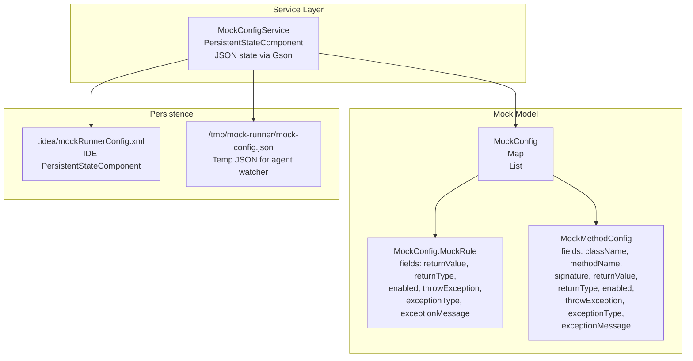
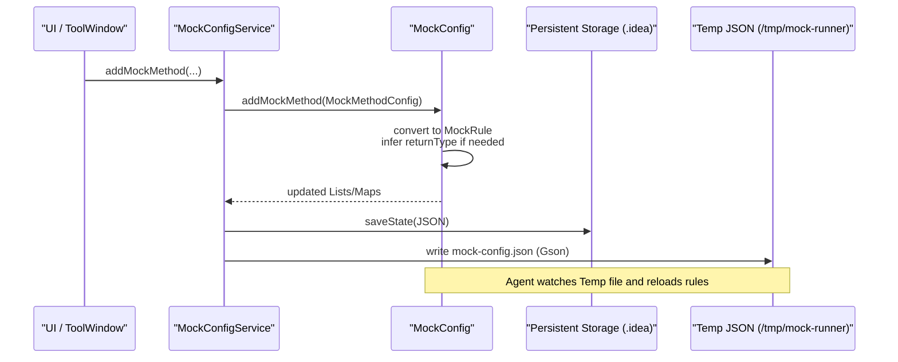
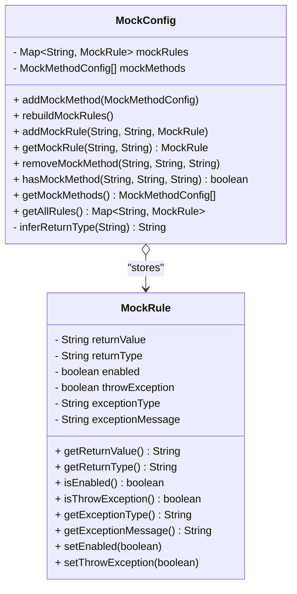
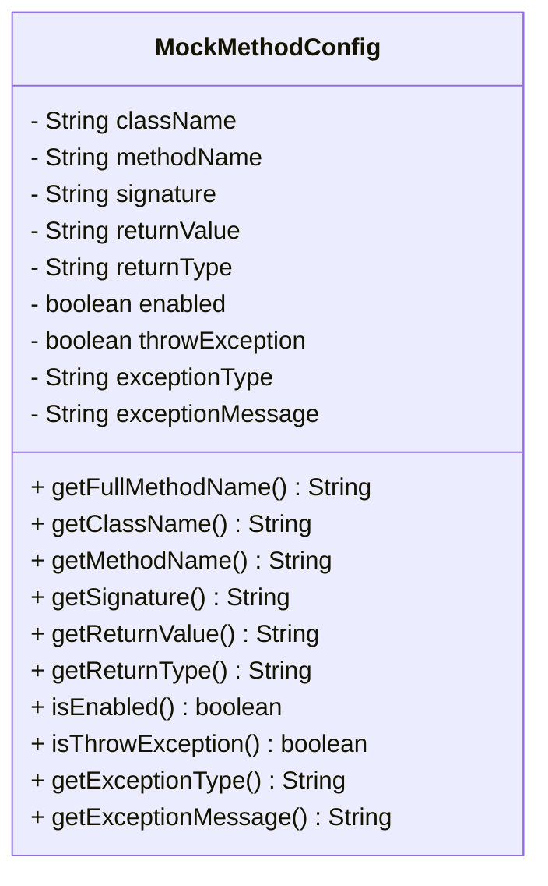
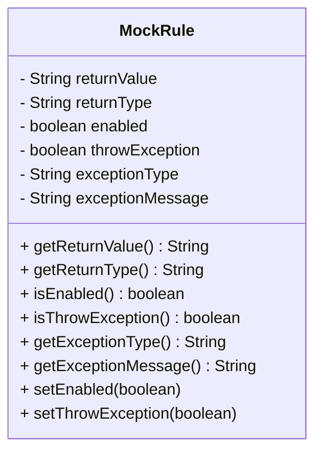
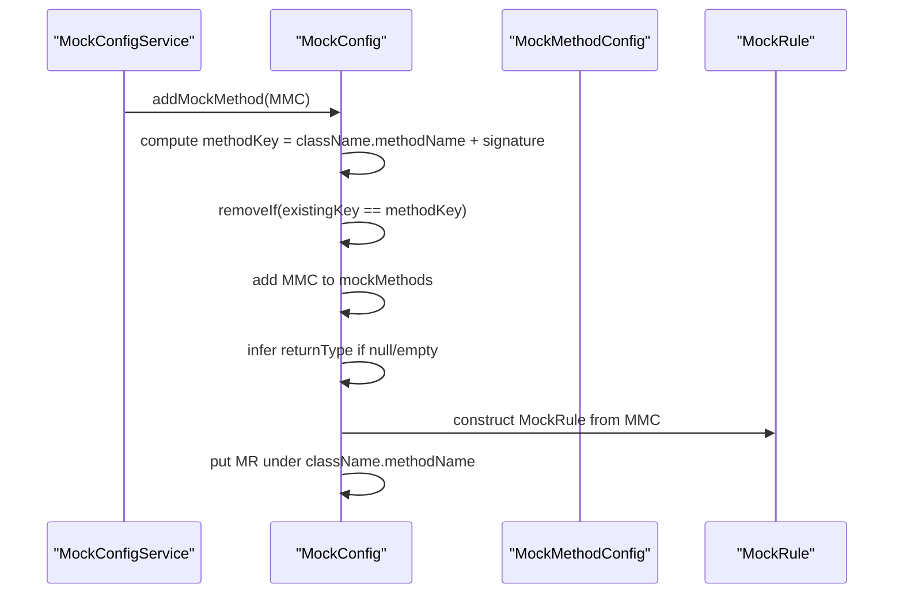
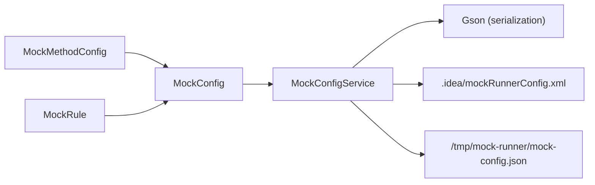

# Data Models

<cite>
**Referenced Files in This Document**
- [MockConfig.java](file://src/main/java/io/github/lancelothuxi/idea/plugin/mock/mock/MockConfig.java)
- [MockMethodConfig.java](file://src/main/java/io/github/lancelothuxi/idea/plugin/mock/mock/MockMethodConfig.java)
- [MockConfigService.java](file://src/main/java/io/github/lancelothuxi/idea/plugin/mock/service/MockConfigService.java)
- [MOCK_PERSISTENCE_GUIDE.md](file://docs/MOCK_PERSISTENCE_GUIDE.md)
- [ExceptionMockingTest.java](file://src/test/java/test/ExceptionMockingTest.java)
- [mock-config-test.json](file://src/test/resources/mock-config-test.json)
</cite>

## Table of Contents
1. [Introduction](#introduction)
2. [Project Structure](#project-structure)
3. [Core Components](#core-components)
4. [Architecture Overview](#architecture-overview)
5. [Detailed Component Analysis](#detailed-component-analysis)
6. [Dependency Analysis](#dependency-analysis)
7. [Performance Considerations](#performance-considerations)
8. [Troubleshooting Guide](#troubleshooting-guide)
9. [Conclusion](#conclusion)
10. [Appendices](#appendices)

## Introduction
This document explains the mock configuration data models that power the mock runner. It focuses on the MockConfig class and its Map-based mockRules storage, the List-based mockMethods collection, the MockRule inner class, and the MockMethodConfig class. It also covers how method signatures contribute to uniqueness, how MockMethodConfig is converted into agent-ready MockRule instances, and how serialization and persistence work across the project.

## Project Structure
The mock configuration data model lives under the mock package and is integrated with a service layer that persists and synchronizes configuration across the IDE lifecycle.

**Diagram sources**
- [MockConfig.java](file://src/main/java/io/github/lancelothuxi/idea/plugin/mock/mock/MockConfig.java#L12-L218)
- [MockMethodConfig.java](file://src/main/java/io/github/lancelothuxi/idea/plugin/mock/mock/MockMethodConfig.java#L5-L94)
- [MockConfigService.java](file://src/main/java/io/github/lancelothuxi/idea/plugin/mock/service/MockConfigService.java#L19-L197)
- [MOCK_PERSISTENCE_GUIDE.md](file://docs/MOCK_PERSISTENCE_GUIDE.md#L1-L101)

**Section sources**
- [MockConfig.java](file://src/main/java/io/github/lancelothuxi/idea/plugin/mock/mock/MockConfig.java#L12-L218)
- [MockMethodConfig.java](file://src/main/java/io/github/lancelothuxi/idea/plugin/mock/mock/MockMethodConfig.java#L5-L94)
- [MockConfigService.java](file://src/main/java/io/github/lancelothuxi/idea/plugin/mock/service/MockConfigService.java#L19-L197)
- [MOCK_PERSISTENCE_GUIDE.md](file://docs/MOCK_PERSISTENCE_GUIDE.md#L1-L101)

## Core Components
- MockConfig: Central configuration container holding:
  - A Map keyed by className.methodName for fast lookup of MockRule instances.
  - A List of MockMethodConfig entries for human-readable, serializable method-level configuration.
- MockMethodConfig: Serializable DTO capturing method identity and behavior (return value, return type, exception behavior, enablement).
- MockRule: Serializable inner class representing a single method’s mocking behavior for the agent runtime.

Key behaviors:
- Adding a MockMethodConfig automatically converts it into a MockRule and stores it under className.methodName.
- Signature-aware uniqueness ensures multiple overloads can coexist.
- Return type inference supports simple literal values when explicit return type is missing.
- Persistence uses JSON serialization via Gson, stored both in IDE state and a temporary file for agent hot reload.

**Section sources**
- [MockConfig.java](file://src/main/java/io/github/lancelothuxi/idea/plugin/mock/mock/MockConfig.java#L12-L218)
- [MockMethodConfig.java](file://src/main/java/io/github/lancelothuxi/idea/plugin/mock/mock/MockMethodConfig.java#L5-L94)

## Architecture Overview
The configuration flows from user actions through the service layer into persistent storage, and is consumed by the agent at runtime.

**Diagram sources**
- [MockConfigService.java](file://src/main/java/io/github/lancelothuxi/idea/plugin/mock/service/MockConfigService.java#L109-L151)
- [MockConfig.java](file://src/main/java/io/github/lancelothuxi/idea/plugin/mock/mock/MockConfig.java#L33-L86)
- [MOCK_PERSISTENCE_GUIDE.md](file://docs/MOCK_PERSISTENCE_GUIDE.md#L41-L100)

## Detailed Component Analysis

### MockConfig
Responsibilities:
- Maintain Map-based lookup of MockRule by className.methodName.
- Maintain List-based history/configuration of MockMethodConfig entries.
- Convert MockMethodConfig to MockRule for agent consumption.
- Infer return types from literal values when not explicitly provided.
- Provide helpers to add/remove/update configuration and to rebuild internal state after deserialization.

Key design points:
- Map key strategy: className.methodName ensures per-method uniqueness but does not incorporate signature. Overload resolution relies on the separate List of MockMethodConfig entries and the signature-aware uniqueness check during add.
- Signature-based uniqueness: When adding a MockMethodConfig, the composite key className.methodName + signature prevents duplicates and allows multiple overloads to coexist.
- Rule conversion: During addMockMethod, a MockRule is built from MockMethodConfig fields, using inferred return type if absent, and then stored under className.methodName for agent use.

**Diagram sources**
- [MockConfig.java](file://src/main/java/io/github/lancelothuxi/idea/plugin/mock/mock/MockConfig.java#L12-L218)

**Section sources**
- [MockConfig.java](file://src/main/java/io/github/lancelothuxi/idea/plugin/mock/mock/MockConfig.java#L12-L218)

### MockMethodConfig
Responsibilities:
- Capture method identity (className, methodName, signature).
- Capture behavior configuration (returnValue, returnType, enabled, throwException, exceptionType, exceptionMessage).
- Provide a full method name representation combining className.methodName + signature for uniqueness checks.

Design notes:
- Signature inclusion ensures distinct entries for overloaded methods.
- Serializable to support persistence and JSON transport.
- Provides a convenience method to compute the full method identifier used for equality checks.

**Diagram sources**
- [MockMethodConfig.java](file://src/main/java/io/github/lancelothuxi/idea/plugin/mock/mock/MockMethodConfig.java#L5-L94)

**Section sources**
- [MockMethodConfig.java](file://src/main/java/io/github/lancelothuxi/idea/plugin/mock/mock/MockMethodConfig.java#L5-L94)

### MockRule
Responsibilities:
- Represent a single method’s mock behavior for the agent runtime.
- Encapsulate return value, return type, enablement flag, and exception behavior (type and message).
- Serializable to support persistence and JSON transport.

Type safety and exception configuration:
- Return type is a string (fully-qualified or primitive-like) used by the agent to cast or interpret return values.
- Exception behavior is controlled by throwException flag and exceptionType/exceptionMessage fields.

**Diagram sources**
- [MockConfig.java](file://src/main/java/io/github/lancelothuxi/idea/plugin/mock/mock/MockConfig.java#L144-L216)

**Section sources**
- [MockConfig.java](file://src/main/java/io/github/lancelothuxi/idea/plugin/mock/mock/MockConfig.java#L144-L216)

### Relationship Between MockMethodConfig and MockRule
- MockMethodConfig is the user-facing, serializable representation of a method’s configuration.
- MockConfig.addMockMethod converts MockMethodConfig into a MockRule and stores it under className.methodName.
- MockConfig.rebuildMockRules iterates MockMethodConfig entries to reconstruct MockRule entries, ensuring consistency after loading persisted state.

**Diagram sources**
- [MockConfig.java](file://src/main/java/io/github/lancelothuxi/idea/plugin/mock/mock/MockConfig.java#L33-L86)
- [MockConfigService.java](file://src/main/java/io/github/lancelothuxi/idea/plugin/mock/service/MockConfigService.java#L109-L151)

**Section sources**
- [MockConfig.java](file://src/main/java/io/github/lancelothuxi/idea/plugin/mock/mock/MockConfig.java#L33-L86)
- [MockConfigService.java](file://src/main/java/io/github/lancelothuxi/idea/plugin/mock/service/MockConfigService.java#L109-L151)

### Key Generation Strategy and Uniqueness
- Per-method lookup key: className.methodName for MockRule map.
- Signature-based uniqueness: className.methodName + signature for MockMethodConfig entries to support overloads.
- Duplicate prevention: Before adding, existing entries with identical composite keys are removed to ensure only the latest configuration remains.

Practical implications:
- Multiple overloads can be configured independently.
- Enabling/disabling or changing exception behavior updates the same className.methodName entry in MockRule.

**Section sources**
- [MockConfig.java](file://src/main/java/io/github/lancelothuxi/idea/plugin/mock/mock/MockConfig.java#L33-L61)

### Return Type Inference
When return type is not explicitly provided in MockMethodConfig, MockConfig infers it from the returnValue literal:
- Empty/null becomes object fallback.
- Array/list-like literals become List.
- Boolean literals become boolean.
- Numeric literals become int.
- Other values become String.

This inference ensures the agent can handle basic return values without requiring explicit type specification.

**Section sources**
- [MockConfig.java](file://src/main/java/io/github/lancelothuxi/idea/plugin/mock/mock/MockConfig.java#L88-L105)

### Practical Examples
Below are example scenarios with precise file references. Replace the paths with your own to locate the code.

- Creating a MockMethodConfig and adding it via the service:
  - Build MockMethodConfig with className, methodName, signature, returnValue, returnType, and exception flags.
  - Call MockConfigService.addMockMethod(...) to persist and synchronize.
  - Reference: [MockConfigService.java](file://src/main/java/io/github/lancelothuxi/idea/plugin/mock/service/MockConfigService.java#L109-L151)

- Accessing a MockRule from MockConfig:
  - Use MockConfig.getMockRule(className, methodName) to retrieve a MockRule for agent use.
  - Reference: [MockConfig.java](file://src/main/java/io/github/lancelothuxi/idea/plugin/mock/mock/MockConfig.java#L24-L27)

- Removing a specific overload:
  - Use MockConfig.removeMockMethod(className, methodName, signature) to remove the exact overload.
  - Reference: [MockConfig.java](file://src/main/java/io/github/lancelothuxi/idea/plugin/mock/mock/MockConfig.java#L107-L117)

- Testing exception throwing behavior:
  - Configure MockRule with throwException enabled and a specific exceptionType/exceptionMessage.
  - Retrieve the rule in runtime and throw accordingly.
  - Reference: [ExceptionMockingTest.java](file://src/test/java/test/ExceptionMockingTest.java#L74-L95)

- Working with serialized configuration:
  - Load from IDE state JSON or temporary JSON for agent.
  - Reference: [MOCK_PERSISTENCE_GUIDE.md](file://docs/MOCK_PERSISTENCE_GUIDE.md#L46-L80)

**Section sources**
- [MockConfigService.java](file://src/main/java/io/github/lancelothuxi/idea/plugin/mock/service/MockConfigService.java#L109-L151)
- [MockConfig.java](file://src/main/java/io/github/lancelothuxi/idea/plugin/mock/mock/MockConfig.java#L24-L27)
- [ExceptionMockingTest.java](file://src/test/java/test/ExceptionMockingTest.java#L74-L95)
- [MOCK_PERSISTENCE_GUIDE.md](file://docs/MOCK_PERSISTENCE_GUIDE.md#L46-L80)

## Dependency Analysis
- MockConfig depends on:
  - MockMethodConfig for input configuration.
  - MockRule for agent-ready storage.
  - Gson for serialization/deserialization.
- MockConfigService depends on:
  - MockConfig for in-memory state.
  - Gson for JSON serialization.
  - IDE PersistentStateComponent infrastructure for .idea persistence.
  - Temporary filesystem for agent watcher.

**Diagram sources**
- [MockConfig.java](file://src/main/java/io/github/lancelothuxi/idea/plugin/mock/mock/MockConfig.java#L12-L218)
- [MockConfigService.java](file://src/main/java/io/github/lancelothuxi/idea/plugin/mock/service/MockConfigService.java#L19-L197)

**Section sources**
- [MockConfig.java](file://src/main/java/io/github/lancelothuxi/idea/plugin/mock/mock/MockConfig.java#L12-L218)
- [MockConfigService.java](file://src/main/java/io/github/lancelothuxi/idea/plugin/mock/service/MockConfigService.java#L19-L197)

## Performance Considerations
- Lookup complexity:
  - MockRule map lookup by className.methodName is O(1) average.
  - List iteration for equality checks is O(n); however, duplicates are prevented by composite key logic, keeping n small.
- Serialization cost:
  - Gson serialization occurs on add/remove/clear and on IDE save/load cycles; batching operations reduces overhead.
- Agent reload:
  - Temporary JSON writes trigger periodic file watching; avoid excessive rapid changes to minimize watcher churn.

[No sources needed since this section provides general guidance]

## Troubleshooting Guide
Common issues and resolutions:
- Duplicate overload entries:
  - Ensure signature is included when adding MockMethodConfig; the system removes existing entries with the same composite key.
  - Reference: [MockConfig.java](file://src/main/java/io/github/lancelothuxi/idea/plugin/mock/mock/MockConfig.java#L33-L61)

- Missing return type:
  - If returnType is empty, MockConfig infers it from returnValue. Verify inferred type matches expectations.
  - Reference: [MockConfig.java](file://src/main/java/io/github/lancelothuxi/idea/plugin/mock/mock/MockConfig.java#L88-L105)

- Persistence not taking effect:
  - Confirm IDE state is saved and temporary JSON is written. Check logs for save/load messages.
  - Reference: [MOCK_PERSISTENCE_GUIDE.md](file://docs/MOCK_PERSISTENCE_GUIDE.md#L67-L80)

- Agent not picking up changes:
  - Verify the temporary JSON path exists and is being watched. Confirm the watcher thread is running.
  - Reference: [MOCK_PERSISTENCE_GUIDE.md](file://docs/MOCK_PERSISTENCE_GUIDE.md#L19-L28)

**Section sources**
- [MockConfig.java](file://src/main/java/io/github/lancelothuxi/idea/plugin/mock/mock/MockConfig.java#L33-L105)
- [MOCK_PERSISTENCE_GUIDE.md](file://docs/MOCK_PERSISTENCE_GUIDE.md#L19-L80)

## Conclusion
The mock configuration data models provide a robust, serializable foundation for configuring method behavior across development and runtime. MockMethodConfig captures user intent, MockConfig orchestrates conversion and storage, and MockRule delivers agent-ready behavior. The combination of signature-aware uniqueness, return type inference, and dual persistence (IDE state and temporary JSON) ensures flexibility, correctness, and seamless integration with the agent.

[No sources needed since this section summarizes without analyzing specific files]

## Appendices

### Data Model Definitions
- MockConfig
  - Fields: mockRules (Map), mockMethods (List)
  - Methods: addMockMethod, rebuildMockRules, addMockRule, getMockRule, removeMockMethod, hasMockMethod, getMockMethods, getAllRules, clearAll, inferReturnType
- MockMethodConfig
  - Fields: className, methodName, signature, returnValue, returnType, enabled, throwException, exceptionType, exceptionMessage
  - Methods: getFullMethodName, getters/setters
- MockRule
  - Fields: returnValue, returnType, enabled, throwException, exceptionType, exceptionMessage
  - Methods: getters/setters

**Section sources**
- [MockConfig.java](file://src/main/java/io/github/lancelothuxi/idea/plugin/mock/mock/MockConfig.java#L12-L218)
- [MockMethodConfig.java](file://src/main/java/io/github/lancelothuxi/idea/plugin/mock/mock/MockMethodConfig.java#L5-L94)

### Example JSON Configuration
- Full mockRules JSON with multiple methods and return types:
  - Reference: [mock-config-test.json](file://src/test/resources/mock-config-test.json#L1-L72)

**Section sources**
- [mock-config-test.json](file://src/test/resources/mock-config-test.json#L1-L72)