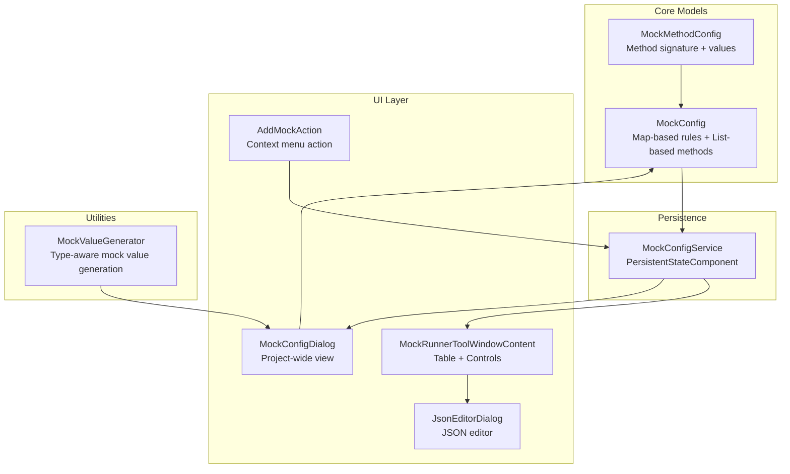
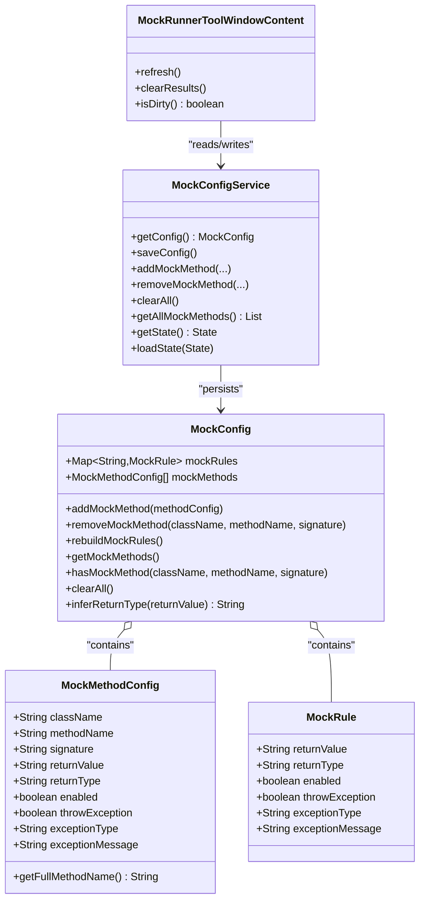
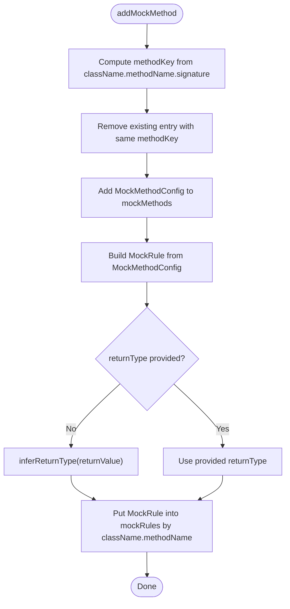
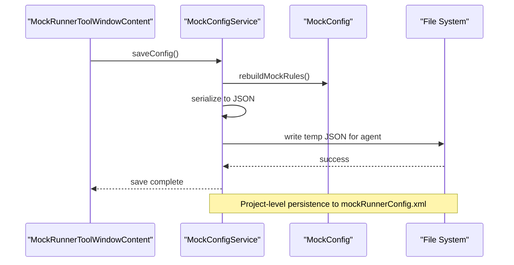
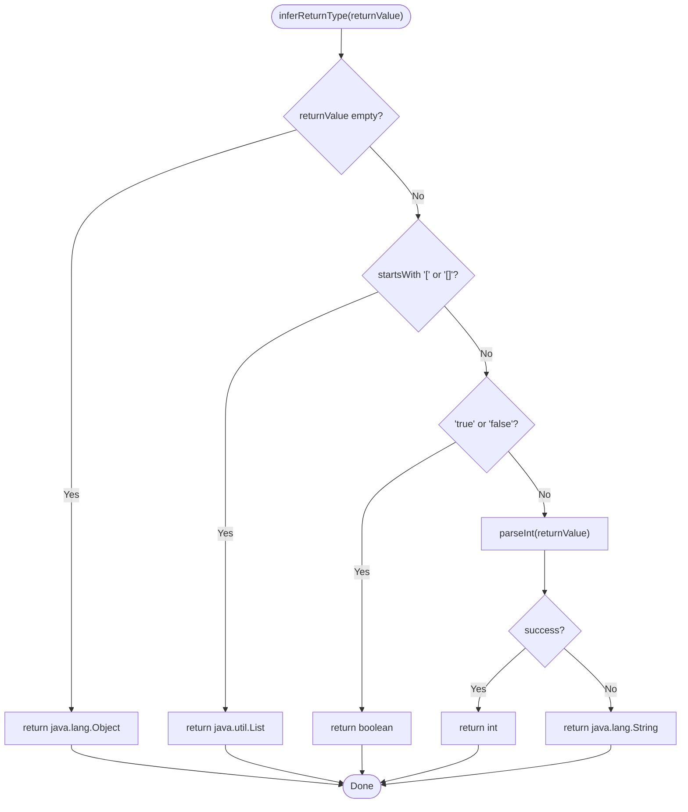
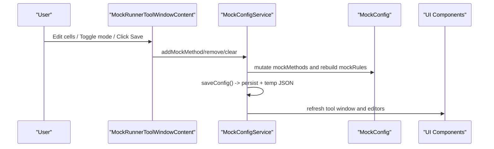
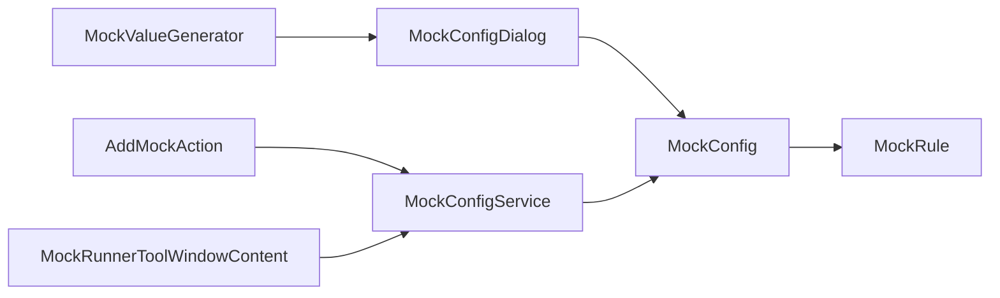

# Mock Configuration System

<cite>
**Referenced Files in This Document**
- [MockConfig.java](file://src/main/java/io/github/lancelothuxi/idea/plugin/mock/mock/MockConfig.java)
- [MockMethodConfig.java](file://src/main/java/io/github/lancelothuxi/idea/plugin/mock/mock/MockMethodConfig.java)
- [MockConfigService.java](file://src/main/java/io/github/lancelothuxi/idea/plugin/mock/service/MockConfigService.java)
- [MockRunnerToolWindowContent.java](file://src/main/java/io/github/lancelothuxi/idea/plugin/mock/ui/MockRunnerToolWindowContent.java)
- [MockConfigDialog.java](file://src/main/java/io/github/lancelothuxi/idea/plugin/mock/ui/MockConfigDialog.java)
- [AddMockAction.java](file://src/main/java/io/github/lancelothuxi/idea/plugin/mock/action/AddMockAction.java)
- [JsonEditorDialog.java](file://src/main/java/io/github/lancelothuxi/idea/plugin/mock/ui/JsonEditorDialog.java)
- [MockValueGenerator.java](file://src/main/java/io/github/lancelothuxi/idea/plugin/mock/util/MockValueGenerator.java)
- [plugin.xml](file://src/main/resources/META-INF/plugin.xml)
- [MOCK_PERSISTENCE_GUIDE.md](file://docs/MOCK_PERSISTENCE_GUIDE.md)
- [mock-config-test.json](file://src/test/resources/mock-config-test.json)
</cite>

## Table of Contents
1. [Introduction](#introduction)
2. [Project Structure](#project-structure)
3. [Core Components](#core-components)
4. [Architecture Overview](#architecture-overview)
5. [Detailed Component Analysis](#detailed-component-analysis)
6. [Dependency Analysis](#dependency-analysis)
7. [Performance Considerations](#performance-considerations)
8. [Troubleshooting Guide](#troubleshooting-guide)
9. [Conclusion](#conclusion)
10. [Appendices](#appendices)

## Introduction
This document describes the mock configuration system that powers runtime method mocking in the IDE. It covers the data model architecture, configuration persistence, type inference, UI integration, and operational workflows for adding, removing, and updating mock configurations. The system supports both return-value and exception-based mocking, with automatic return-type inference and JSON-based editors for complex return values.

## Project Structure
The mock configuration system spans several packages:
- mock: Core data models for mock configuration
- service: Persistence and synchronization with the IDE project lifecycle
- ui: Tool window, dialogs, and editors for user interaction
- action: IDE actions that trigger mock creation
- util: Utilities for generating mock values based on method signatures

**Diagram sources**
- [MockConfig.java](file://src/main/java/io/github/lancelothuxi/idea/plugin/mock/mock/MockConfig.java#L12-L218)
- [MockMethodConfig.java](file://src/main/java/io/github/lancelothuxi/idea/plugin/mock/mock/MockMethodConfig.java#L5-L94)
- [MockConfigService.java](file://src/main/java/io/github/lancelothuxi/idea/plugin/mock/service/MockConfigService.java#L19-L197)
- [MockRunnerToolWindowContent.java](file://src/main/java/io/github/lancelothuxi/idea/plugin/mock/ui/MockRunnerToolWindowContent.java#L22-L449)
- [MockConfigDialog.java](file://src/main/java/io/github/lancelothuxi/idea/plugin/mock/ui/MockConfigDialog.java#L27-L293)
- [JsonEditorDialog.java](file://src/main/java/io/github/lancelothuxi/idea/plugin/mock/ui/JsonEditorDialog.java#L22-L286)
- [AddMockAction.java](file://src/main/java/io/github/lancelothuxi/idea/plugin/mock/action/AddMockAction.java#L15-L106)
- [MockValueGenerator.java](file://src/main/java/io/github/lancelothuxi/idea/plugin/mock/util/MockValueGenerator.java#L13-L289)

**Section sources**
- [plugin.xml](file://src/main/resources/META-INF/plugin.xml#L25-L53)

## Core Components
This section documents the primary data structures and their roles.

- MockConfig
  - Stores mock rules keyed by "className.methodName".
  - Maintains a list of MockMethodConfig entries for UI and persistence.
  - Provides methods to add/remove/update mock methods and rebuild rules from method configs.
  - Includes a nested MockRule inner class encapsulating return value, return type, exception settings, and enable/disable state.

- MockMethodConfig
  - Represents a single method-level mock configuration with class name, method name, signature, return value, return type, and exception settings.
  - Supports enabling/disabling and toggling between return-value and exception modes.

- MockConfigService
  - Implements PersistentStateComponent to persist configuration to project storage.
  - Serializes/deserializes MockConfig to/from JSON.
  - Synchronizes configuration to temporary JSON for agent consumption and updates UI components.

- MockRunnerToolWindowContent
  - Manages the Mock Runner tool window, displaying and editing mock configurations.
  - Provides filtering, pagination, global enable/disable, and dirty-state tracking.
  - Integrates JSON cell rendering/editing for complex return values.

- MockConfigDialog
  - Project-wide mock configuration dialog, loading methods from the project and generating smart mock values.
  - Uses JSON editor for complex return types.

- AddMockAction
  - IDE action to add mocks for the method under the caret, validating non-void return types and invoking MockConfigService.

- JsonEditorDialog
  - Visual JSON editor with tree view and text area, supporting formatting and validation.

- MockValueGenerator
  - Generates representative mock values based on PSI return types, including primitives, collections, arrays, and complex objects.

**Section sources**
- [MockConfig.java](file://src/main/java/io/github/lancelothuxi/idea/plugin/mock/mock/MockConfig.java#L12-L218)
- [MockMethodConfig.java](file://src/main/java/io/github/lancelothuxi/idea/plugin/mock/mock/MockMethodConfig.java#L5-L94)
- [MockConfigService.java](file://src/main/java/io/github/lancelothuxi/idea/plugin/mock/service/MockConfigService.java#L19-L197)
- [MockRunnerToolWindowContent.java](file://src/main/java/io/github/lancelothuxi/idea/plugin/mock/ui/MockRunnerToolWindowContent.java#L22-L449)
- [MockConfigDialog.java](file://src/main/java/io/github/lancelothuxi/idea/plugin/mock/ui/MockConfigDialog.java#L27-L293)
- [AddMockAction.java](file://src/main/java/io/github/lancelothuxi/idea/plugin/mock/action/AddMockAction.java#L15-L106)
- [JsonEditorDialog.java](file://src/main/java/io/github/lancelothuxi/idea/plugin/mock/ui/JsonEditorDialog.java#L22-L286)
- [MockValueGenerator.java](file://src/main/java/io/github/lancelothuxi/idea/plugin/mock/util/MockValueGenerator.java#L13-L289)

## Architecture Overview
The system follows a layered architecture:
- Data layer: MockConfig and MockMethodConfig define the configuration model.
- Persistence layer: MockConfigService serializes/deserializes configuration and writes a temporary JSON for the agent.
- UI layer: Tool window and dialogs provide editing and visualization.
- Action layer: IDE actions integrate with the configuration service.
- Utility layer: MockValueGenerator assists in generating representative mock values.

**Diagram sources**
- [MockConfig.java](file://src/main/java/io/github/lancelothuxi/idea/plugin/mock/mock/MockConfig.java#L12-L218)
- [MockMethodConfig.java](file://src/main/java/io/github/lancelothuxi/idea/plugin/mock/mock/MockMethodConfig.java#L5-L94)
- [MockConfigService.java](file://src/main/java/io/github/lancelothuxi/idea/plugin/mock/service/MockConfigService.java#L19-L197)
- [MockRunnerToolWindowContent.java](file://src/main/java/io/github/lancelothuxi/idea/plugin/mock/ui/MockRunnerToolWindowContent.java#L22-L449)

## Detailed Component Analysis

### MockConfig Data Model
- Storage design:
  - Map-based mockRules: key is "className.methodName", value is MockRule. Used by the agent for fast lookup.
  - List-based mockMethods: ordered list of MockMethodConfig for UI, persistence, and validation.
- Operations:
  - addMockMethod: deduplicates by combining className.methodName.signature, adds to mockMethods, then constructs a MockRule (inferring return type if missing) and stores in mockRules.
  - rebuildMockRules: clears mockRules and reconstructs from current mockMethods, ensuring consistency after load or batch updates.
  - removeMockMethod: removes by exact signature match and deletes corresponding rule.
  - hasMockMethod: checks for duplicates using className.methodName.signature.
  - clearAll: clears both lists and rules.
- MockRule inner class:
  - Encapsulates return value, return type, enabled flag, and exception settings (type/message).
  - Provides getters/setters for all fields.

**Diagram sources**
- [MockConfig.java](file://src/main/java/io/github/lancelothuxi/idea/plugin/mock/mock/MockConfig.java#L33-L86)

**Section sources**
- [MockConfig.java](file://src/main/java/io/github/lancelothuxi/idea/plugin/mock/mock/MockConfig.java#L12-L218)

### MockMethodConfig Structure
- Fields:
  - className, methodName, signature (for disambiguation).
  - returnValue, returnType, enabled.
  - throwException, exceptionType, exceptionMessage.
- Behavior:
  - getFullMethodName concatenates className.methodName.signature for display and logging.
- Validation:
  - The system prevents adding void methods via AddMockAction.
  - Duplicate detection uses signature-aware key comparison.

**Section sources**
- [MockMethodConfig.java](file://src/main/java/io/github/lancelothuxi/idea/plugin/mock/mock/MockMethodConfig.java#L5-L94)
- [AddMockAction.java](file://src/main/java/io/github/lancelothuxi/idea/plugin/mock/action/AddMockAction.java#L50-L58)

### MockRule Inner Class
- Purpose:
  - Holds the runtime execution semantics for a mocked method: return value, return type, enable/disable, and exception behavior.
- Fields:
  - returnValue, returnType, enabled, throwException, exceptionType, exceptionMessage.
- Usage:
  - Constructed from MockMethodConfig during addMockMethod or rebuildMockRules.
  - Accessed by the agent for method interception.

**Section sources**
- [MockConfig.java](file://src/main/java/io/github/lancelothuxi/idea/plugin/mock/mock/MockConfig.java#L144-L216)

### Configuration Persistence Mechanism
- Persistence implementation:
  - MockConfigService implements PersistentStateComponent with storage in "mockRunnerConfig.xml" under the project directory.
  - State holds a JSON string of MockConfig.
- Serialization:
  - Uses Gson to serialize/deserialize MockConfig.
  - On save, rebuilds mockRules to ensure consistency, then writes a pretty-printed JSON to a temporary location for agent consumption.
- Loading:
  - On load, deserializes state into MockConfig, rebuilds mockRules, and refreshes UI.
- Project-specific storage:
  - Stored per-project in .idea/mockRunnerConfig.xml, enabling team sharing.

**Diagram sources**
- [MockConfigService.java](file://src/main/java/io/github/lancelothuxi/idea/plugin/mock/service/MockConfigService.java#L41-L96)

**Section sources**
- [MockConfigService.java](file://src/main/java/io/github/lancelothuxi/idea/plugin/mock/service/MockConfigService.java#L19-L197)
- [MOCK_PERSISTENCE_GUIDE.md](file://docs/MOCK_PERSISTENCE_GUIDE.md#L1-L101)

### Type Inference Algorithm
- Purpose:
  - Automatically determine return type when not explicitly provided.
- Algorithm:
  - If returnValue is empty, default to java.lang.Object.
  - If returnValue starts with "[" or is "[]", treat as java.util.List.
  - If returnValue is "true" or "false", treat as boolean.
  - Try parsing as integer; if successful, treat as int.
  - Otherwise, default to java.lang.String.

**Diagram sources**
- [MockConfig.java](file://src/main/java/io/github/lancelothuxi/idea/plugin/mock/mock/MockConfig.java#L88-L105)

**Section sources**
- [MockConfig.java](file://src/main/java/io/github/lancelothuxi/idea/plugin/mock/mock/MockConfig.java#L88-L105)

### Practical Examples: Adding, Removing, Updating Mock Configurations
- Adding a mock:
  - Via IDE action: Place caret on a method with a non-void return type, invoke "Add Mock for Method". The action computes the signature and delegates to MockConfigService.addMockMethod, which deduplicates and persists.
  - Via UI: Use MockRunnerToolWindowContent to edit rows and click Save; MockConfigService.saveConfig persists to disk and temp JSON.
- Removing a mock:
  - From Tool Window: Select and remove; MockConfigService.removeMockMethod updates both mockMethods and mockRules.
  - Bulk clear: Clear All triggers MockConfigService.clearAll and refreshes UI.
- Updating a mock:
  - Toggle Mode (Return Value vs Exception) and edit Value; MockRunnerToolWindowContent updates MockMethodConfig and marks dirty state.
  - Save to persist changes.

**Section sources**
- [AddMockAction.java](file://src/main/java/io/github/lancelothuxi/idea/plugin/mock/action/AddMockAction.java#L60-L82)
- [MockRunnerToolWindowContent.java](file://src/main/java/io/github/lancelothuxi/idea/plugin/mock/ui/MockRunnerToolWindowContent.java#L110-L123)
- [MockConfigService.java](file://src/main/java/io/github/lancelothuxi/idea/plugin/mock/service/MockConfigService.java#L109-L151)

### Relationship Between UI Components and Underlying Data Models
- MockRunnerToolWindowContent:
  - Owns a MockTableModel backed by MockMethodConfig list from MockConfigService.
  - Provides controls for filtering, pagination, global enable/disable, and saving.
  - Uses JsonTableCellRenderer/JsonTableCellEditor for JSON editing.
- MockConfigDialog:
  - Loads project methods via PSI, generates smart mock values using MockValueGenerator, and allows JSON editing via JsonEditorDialog.
- MockConfigService:
  - Acts as the bridge between UI and persistence, exposing add/remove/clear operations and delegating to MockConfig for storage.

**Diagram sources**
- [MockRunnerToolWindowContent.java](file://src/main/java/io/github/lancelothuxi/idea/plugin/mock/ui/MockRunnerToolWindowContent.java#L312-L334)
- [MockConfigService.java](file://src/main/java/io/github/lancelothuxi/idea/plugin/mock/service/MockConfigService.java#L109-L151)
- [MockConfig.java](file://src/main/java/io/github/lancelothuxi/idea/plugin/mock/mock/MockConfig.java#L67-L86)

**Section sources**
- [MockRunnerToolWindowContent.java](file://src/main/java/io/github/lancelothuxi/idea/plugin/mock/ui/MockRunnerToolWindowContent.java#L340-L447)
- [MockConfigDialog.java](file://src/main/java/io/github/lancelothuxi/idea/plugin/mock/ui/MockConfigDialog.java#L110-L160)
- [JsonEditorDialog.java](file://src/main/java/io/github/lancelothuxi/idea/plugin/mock/ui/JsonEditorDialog.java#L193-L210)

### Configuration Conflict Resolution and Duplicate Handling
- Duplicate handling:
  - addMockMethod computes a composite key className.methodName.signature and removes any existing entry before adding the new one.
  - hasMockMethod checks for duplicates using the same composite key.
- Conflict resolution:
  - Last-write-wins semantics apply when adding/updating; earlier entries are removed automatically.
  - Global enable/disable toggles in the Tool Window adjust all entries consistently.
- Validation:
  - Void methods are rejected by AddMockAction.
  - JSON editor validates JSON before accepting edits.

**Section sources**
- [MockConfig.java](file://src/main/java/io/github/lancelothuxi/idea/plugin/mock/mock/MockConfig.java#L33-L61)
- [MockConfig.java](file://src/main/java/io/github/lancelothuxi/idea/plugin/mock/mock/MockConfig.java#L129-L137)
- [AddMockAction.java](file://src/main/java/io/github/lancelothuxi/idea/plugin/mock/action/AddMockAction.java#L50-L58)

## Dependency Analysis
The system exhibits clear separation of concerns:
- MockConfigService depends on MockConfig and uses Gson for serialization.
- UI components depend on MockConfigService for state and on MockValueGenerator for smart defaults.
- Actions depend on MockConfigService to mutate configuration.
- The agent consumes the temporary JSON produced by MockConfigService.

**Diagram sources**
- [AddMockAction.java](file://src/main/java/io/github/lancelothuxi/idea/plugin/mock/action/AddMockAction.java#L72-L74)
- [MockConfigService.java](file://src/main/java/io/github/lancelothuxi/idea/plugin/mock/service/MockConfigService.java#L109-L151)
- [MockRunnerToolWindowContent.java](file://src/main/java/io/github/lancelothuxi/idea/plugin/mock/ui/MockRunnerToolWindowContent.java#L110-L123)
- [MockConfigDialog.java](file://src/main/java/io/github/lancelothuxi/idea/plugin/mock/ui/MockConfigDialog.java#L162-L182)
- [MockConfig.java](file://src/main/java/io/github/lancelothuxi/idea/plugin/mock/mock/MockConfig.java#L12-L218)
- [MockValueGenerator.java](file://src/main/java/io/github/lancelothuxi/idea/plugin/mock/util/MockValueGenerator.java#L13-L289)

**Section sources**
- [plugin.xml](file://src/main/resources/META-INF/plugin.xml#L25-L53)

## Performance Considerations
- Data structures:
  - Map-based mockRules provide O(1) lookup by method key.
  - List-based mockMethods enable ordered UI presentation but require linear-time removal by signature.
- Serialization:
  - Pretty-printed JSON improves readability but increases file size; consider compact serialization if needed.
- UI updates:
  - Batch refresh operations (refresh, clearAll) minimize UI thrashing.
- Type inference:
  - Simple heuristics avoid expensive reflection; keep inference lightweight for frequent UI updates.

## Troubleshooting Guide
- Configuration not persisting:
  - Verify project-level mockRunnerConfig.xml exists and is not ignored by version control.
  - Check logs for save/load errors emitted by MockConfigService.
- Temporary JSON not found:
  - Ensure the temp directory exists and is writable; MockConfigService creates the directory if missing.
- Mock not applied:
  - Confirm the method signature matches className.methodName(signature) exactly.
  - Verify the rule is enabled in the Tool Window.
- JSON editing issues:
  - Use the JSON editor’s Validate button to check syntax.
  - Use Format JSON to normalize formatting.

**Section sources**
- [MockConfigService.java](file://src/main/java/io/github/lancelothuxi/idea/plugin/mock/service/MockConfigService.java#L41-L58)
- [MOCK_PERSISTENCE_GUIDE.md](file://docs/MOCK_PERSISTENCE_GUIDE.md#L67-L80)
- [JsonEditorDialog.java](file://src/main/java/io/github/lancelothuxi/idea/plugin/mock/ui/JsonEditorDialog.java#L193-L210)

## Conclusion
The mock configuration system provides a robust, IDE-integrated solution for runtime method mocking. Its dual-storage model (Map for agent lookup, List for UI/persistence) balances performance and usability. Automatic type inference and JSON editing streamline configuration, while persistent state ensures seamless project continuity. The UI integrates tightly with the data model, enabling efficient creation, modification, and removal of mock configurations.

## Appendices

### Configuration Persistence Details
- Storage location: Project-level .idea/mockRunnerConfig.xml.
- Auto-save triggers: add, remove, clear, and refresh operations.
- Auto-load triggers: project open and service initialization.
- Example persisted structure: see mock-config-test.json for expected JSON shape.

**Section sources**
- [MOCK_PERSISTENCE_GUIDE.md](file://docs/MOCK_PERSISTENCE_GUIDE.md#L18-L32)
- [mock-config-test.json](file://src/test/resources/mock-config-test.json#L1-L72)