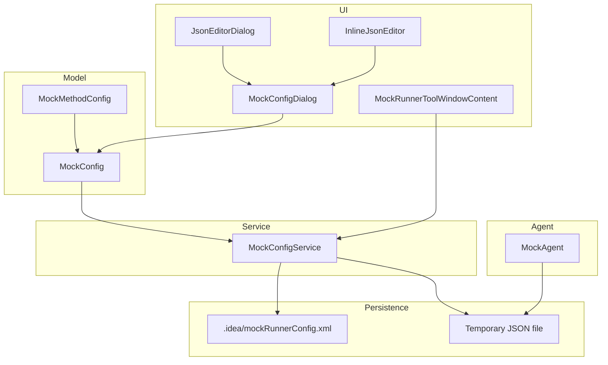
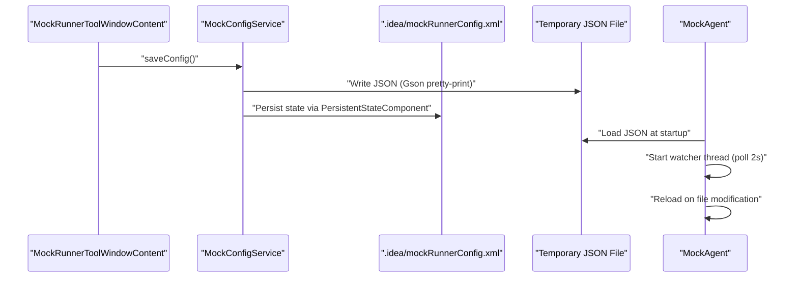
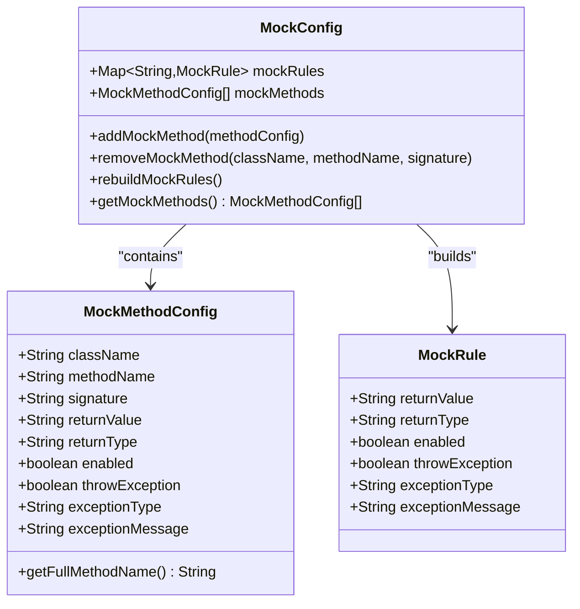
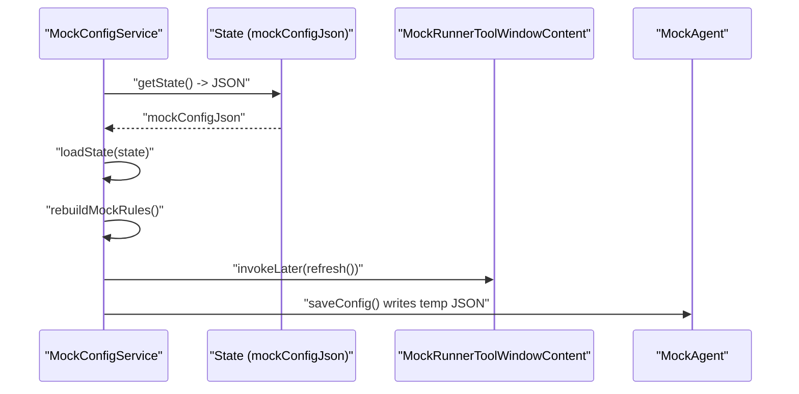
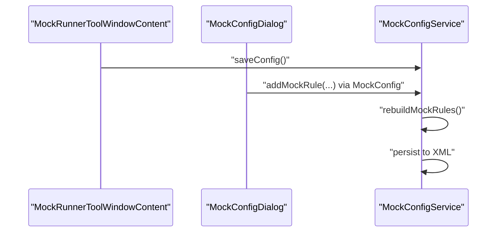
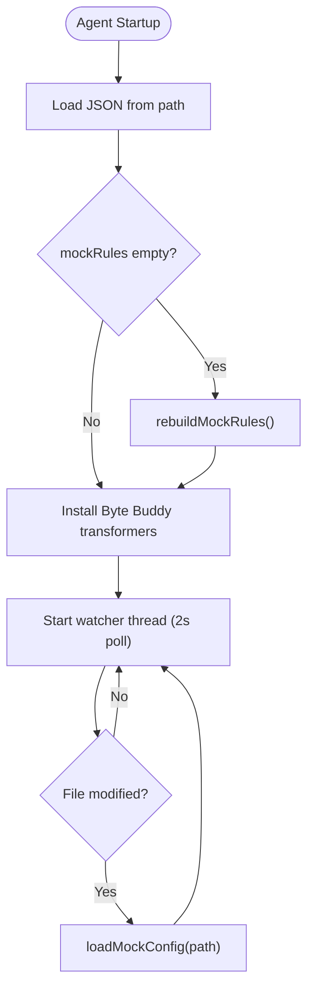
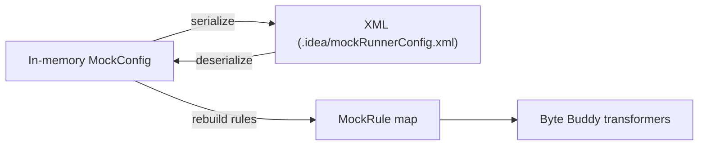
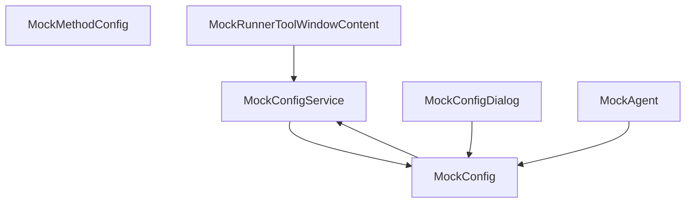

# Persistence Mechanism

<cite>
**Referenced Files in This Document**
- [MockConfig.java](file://src/main/java/io/github/lancelothuxi/idea/plugin/mock/mock/MockConfig.java)
- [MockMethodConfig.java](file://src/main/java/io/github/lancelothuxi/idea/plugin/mock/mock/MockMethodConfig.java)
- [MockConfigService.java](file://src/main/java/io/github/lancelothuxi/idea/plugin/mock/service/MockConfigService.java)
- [MockRunnerToolWindowContent.java](file://src/main/java/io/github/lancelothuxi/idea/plugin/mock/ui/MockRunnerToolWindowContent.java)
- [MockConfigDialog.java](file://src/main/java/io/github/lancelothuxi/idea/plugin/mock/ui/MockConfigDialog.java)
- [MockAgent.java](file://src/main/java/io/github/lancelothuxi/idea/plugin/mock/agent/MockAgent.java)
- [JsonEditorDialog.java](file://src/main/java/io/github/lancelothuxi/idea/plugin/mock/ui/JsonEditorDialog.java)
- [InlineJsonEditor.java](file://src/main/java/io/github/lancelothuxi/idea/plugin/mock/ui/InlineJsonEditor.java)
- [MockValueGenerator.java](file://src/main/java/io/github/lancelothuxi/idea/plugin/mock/util/MockValueGenerator.java)
- [MOCK_PERSISTENCE_GUIDE.md](file://docs/MOCK_PERSISTENCE_GUIDE.md)
</cite>

## Table of Contents
1. [Introduction](#introduction)
2. [Project Structure](#project-structure)
3. [Core Components](#core-components)
4. [Architecture Overview](#architecture-overview)
5. [Detailed Component Analysis](#detailed-component-analysis)
6. [Dependency Analysis](#dependency-analysis)
7. [Performance Considerations](#performance-considerations)
8. [Troubleshooting Guide](#troubleshooting-guide)
9. [Conclusion](#conclusion)
10. [Appendices](#appendices)

## Introduction
This document explains the configuration persistence system for MockConfig objects within the IntelliJ Platform plugin. It covers how MockConfig is serialized to XML via IntelliJ’s PersistentStateComponent, how project-specific configuration is stored under the .idea directory, and how the MockConfigService integrates with IntelliJ project services to manage the configuration lifecycle. It also documents the save and load mechanisms, including temporary file handling for agent synchronization, the relationship between in-memory state and persisted XML, error handling and recovery strategies, and practical examples for backup, restore, and migration. Finally, it provides performance considerations and optimization strategies for large configuration sets and frequent save operations.

## Project Structure
The persistence mechanism spans several modules:
- Model layer: MockConfig and MockMethodConfig define the in-memory configuration model.
- Service layer: MockConfigService implements PersistentStateComponent to persist MockConfig to XML.
- UI layer: MockRunnerToolWindowContent and MockConfigDialog provide user interaction and trigger saves.
- Agent layer: MockAgent reads the configuration file and watches for changes to synchronize runtime behavior.
- Utilities: MockValueGenerator and JSON editors support configuration authoring and validation.

**Diagram sources**
- [MockConfig.java](file://src/main/java/io/github/lancelothuxi/idea/plugin/mock/mock/MockConfig.java#L12-L218)
- [MockMethodConfig.java](file://src/main/java/io/github/lancelothuxi/idea/plugin/mock/mock/MockMethodConfig.java#L5-L94)
- [MockConfigService.java](file://src/main/java/io/github/lancelothuxi/idea/plugin/mock/service/MockConfigService.java#L19-L197)
- [MockRunnerToolWindowContent.java](file://src/main/java/io/github/lancelothuxi/idea/plugin/mock/ui/MockRunnerToolWindowContent.java#L46-L338)
- [MockConfigDialog.java](file://src/main/java/io/github/lancelothuxi/idea/plugin/mock/ui/MockConfigDialog.java#L27-L293)
- [MockAgent.java](file://src/main/java/io/github/lancelothuxi/idea/plugin/mock/agent/MockAgent.java#L21-L200)
- [MOCK_PERSISTENCE_GUIDE.md](file://docs/MOCK_PERSISTENCE_GUIDE.md#L1-L101)

**Section sources**
- [MOCK_PERSISTENCE_GUIDE.md](file://docs/MOCK_PERSISTENCE_GUIDE.md#L1-L101)
- [MockConfigService.java](file://src/main/java/io/github/lancelothuxi/idea/plugin/mock/service/MockConfigService.java#L19-L197)

## Core Components
- MockConfig: In-memory configuration container holding MockMethodConfig entries and a derived map of MockRule for agent usage. Provides methods to add, remove, and rebuild rules from persisted method configs.
- MockMethodConfig: Serializable DTO representing a single method-level mock configuration with fields for class/method/signature, return value/type, enablement, and exception mode.
- MockConfigService: Implements PersistentStateComponent to serialize MockConfig to XML and to a temporary JSON file for agent synchronization. Manages UI updates and editor refreshes.
- MockRunnerToolWindowContent: Project-scoped UI component that loads, displays, and edits MockMethodConfig entries and triggers saves.
- MockConfigDialog: Advanced dialog for bulk configuration with project-wide method discovery and JSON editing capabilities.
- MockAgent: Runtime agent that loads MockConfig from a temporary JSON file, watches for changes, and injects mock behavior via Byte Buddy.

**Section sources**
- [MockConfig.java](file://src/main/java/io/github/lancelothuxi/idea/plugin/mock/mock/MockConfig.java#L12-L218)
- [MockMethodConfig.java](file://src/main/java/io/github/lancelothuxi/idea/plugin/mock/mock/MockMethodConfig.java#L5-L94)
- [MockConfigService.java](file://src/main/java/io/github/lancelothuxi/idea/plugin/mock/service/MockConfigService.java#L19-L197)
- [MockRunnerToolWindowContent.java](file://src/main/java/io/github/lancelothuxi/idea/plugin/mock/ui/MockRunnerToolWindowContent.java#L46-L338)
- [MockConfigDialog.java](file://src/main/java/io/github/lancelothuxi/idea/plugin/mock/ui/MockConfigDialog.java#L27-L293)
- [MockAgent.java](file://src/main/java/io/github/lancelothuxi/idea/plugin/mock/agent/MockAgent.java#L21-L200)

## Architecture Overview
The persistence architecture follows IntelliJ Platform conventions:
- MockConfigService is annotated as a PersistentStateComponent with a project-scoped Storage targeting mockRunnerConfig.xml under the .idea directory.
- On state changes, MockConfigService serializes MockConfig to XML via Gson and logs the operation.
- Simultaneously, MockConfigService writes a temporary JSON file to facilitate real-time synchronization with the running agent.
- MockAgent loads the temporary JSON file at JVM startup and periodically polls for changes to keep runtime behavior in sync with the persisted configuration.

**Diagram sources**
- [MockConfigService.java](file://src/main/java/io/github/lancelothuxi/idea/plugin/mock/service/MockConfigService.java#L41-L96)
- [MockAgent.java](file://src/main/java/io/github/lancelothuxi/idea/plugin/mock/agent/MockAgent.java#L174-L200)
- [MOCK_PERSISTENCE_GUIDE.md](file://docs/MOCK_PERSISTENCE_GUIDE.md#L18-L31)

## Detailed Component Analysis

### MockConfig and MockMethodConfig
- MockConfig maintains two parallel structures: a list of MockMethodConfig entries and a map of MockRule keyed by className.methodName. Adding a MockMethodConfig automatically updates the MockRule map, enabling efficient runtime lookup by the agent.
- MockMethodConfig encapsulates method metadata and behavior configuration, including optional exception mode fields.
- Rebuilding rules ensures consistency when loading from persisted state.

**Diagram sources**
- [MockConfig.java](file://src/main/java/io/github/lancelothuxi/idea/plugin/mock/mock/MockConfig.java#L12-L218)
- [MockMethodConfig.java](file://src/main/java/io/github/lancelothuxi/idea/plugin/mock/mock/MockMethodConfig.java#L5-L94)

**Section sources**
- [MockConfig.java](file://src/main/java/io/github/lancelothuxi/idea/plugin/mock/mock/MockConfig.java#L19-L86)
- [MockMethodConfig.java](file://src/main/java/io/github/lancelothuxi/idea/plugin/mock/mock/MockMethodConfig.java#L18-L93)

### MockConfigService: Persistence and Lifecycle
- Implements PersistentStateComponent with a project-scoped Storage pointing to mockRunnerConfig.xml under .idea.
- Exposes getState() to serialize MockConfig to JSON and loadState() to deserialize and rebuild MockRule entries.
- Provides saveConfig() to write a temporary JSON file for agent synchronization and to log save events.
- Triggers UI refresh and editor daemon restart to reflect changes immediately.

**Diagram sources**
- [MockConfigService.java](file://src/main/java/io/github/lancelothuxi/idea/plugin/mock/service/MockConfigService.java#L65-L107)
- [MockAgent.java](file://src/main/java/io/github/lancelothuxi/idea/plugin/mock/agent/MockAgent.java#L174-L200)

**Section sources**
- [MockConfigService.java](file://src/main/java/io/github/lancelothuxi/idea/plugin/mock/service/MockConfigService.java#L19-L197)
- [MOCK_PERSISTENCE_GUIDE.md](file://docs/MOCK_PERSISTENCE_GUIDE.md#L18-L31)

### UI Integration and Save Triggers
- MockRunnerToolWindowContent loads MockMethodConfig entries from MockConfigService and supports manual save, clear, and refresh actions.
- MockConfigDialog discovers project methods, generates smart mock values, and writes back to MockConfig upon OK.
- Both components trigger MockConfigService.saveConfig() to persist and synchronize with the agent.

**Diagram sources**
- [MockRunnerToolWindowContent.java](file://src/main/java/io/github/lancelothuxi/idea/plugin/mock/ui/MockRunnerToolWindowContent.java#L110-L122)
- [MockConfigDialog.java](file://src/main/java/io/github/lancelothuxi/idea/plugin/mock/ui/MockConfigDialog.java#L192-L210)
- [MockConfigService.java](file://src/main/java/io/github/lancelothuxi/idea/plugin/mock/service/MockConfigService.java#L41-L96)

**Section sources**
- [MockRunnerToolWindowContent.java](file://src/main/java/io/github/lancelothuxi/idea/plugin/mock/ui/MockRunnerToolWindowContent.java#L110-L122)
- [MockConfigDialog.java](file://src/main/java/io/github/lancelothuxi/idea/plugin/mock/ui/MockConfigDialog.java#L192-L210)
- [MockConfigService.java](file://src/main/java/io/github/lancelothuxi/idea/plugin/mock/service/MockConfigService.java#L41-L96)

### Agent Configuration Synchronization
- MockAgent starts a watcher thread that polls the temporary JSON file every 2 seconds and reloads MockConfig when modified.
- On startup, MockAgent loads the initial configuration from the provided path and logs the number of loaded rules.
- If the loaded MockConfig lacks MockRule entries but contains MockMethodConfig entries, the agent rebuilds rules before installing Byte Buddy transformers.

**Diagram sources**
- [MockAgent.java](file://src/main/java/io/github/lancelothuxi/idea/plugin/mock/agent/MockAgent.java#L147-L200)

**Section sources**
- [MockAgent.java](file://src/main/java/io/github/lancelothuxi/idea/plugin/mock/agent/MockAgent.java#L147-L200)

### Relationship Between In-Memory State and Persisted XML
- In-memory MockConfig is the authoritative source of truth for UI and runtime behavior.
- XML persistence is a serialized snapshot of MockConfig at save time.
- On load, MockConfig is deserialized from XML, then MockRule entries are rebuilt from MockMethodConfig to ensure consistency.

**Diagram sources**
- [MockConfigService.java](file://src/main/java/io/github/lancelothuxi/idea/plugin/mock/service/MockConfigService.java#L65-L96)
- [MockConfig.java](file://src/main/java/io/github/lancelothuxi/idea/plugin/mock/mock/MockConfig.java#L67-L86)

**Section sources**
- [MockConfigService.java](file://src/main/java/io/github/lancelothuxi/idea/plugin/mock/service/MockConfigService.java#L65-L96)
- [MockConfig.java](file://src/main/java/io/github/lancelothuxi/idea/plugin/mock/mock/MockConfig.java#L67-L86)

### Error Handling During Persistence Operations
- Logging: Both save and load operations log informational and error messages to aid diagnostics.
- Recovery: On load failure, the service falls back to an empty MockConfig instance. On save failures, the agent watcher logs warnings and continues polling.
- UI safety: ToolWindow prompts users to resolve unsaved changes before refresh or clear operations.

**Section sources**
- [MockConfigService.java](file://src/main/java/io/github/lancelothuxi/idea/plugin/mock/service/MockConfigService.java#L76-L96)
- [MockAgent.java](file://src/main/java/io/github/lancelothuxi/idea/plugin/mock/agent/MockAgent.java#L174-L200)
- [MockRunnerToolWindowContent.java](file://src/main/java/io/github/lancelothuxi/idea/plugin/mock/ui/MockRunnerToolWindowContent.java#L312-L334)

### Examples: Backup, Restore, Migration
- Backup: Copy the project’s .idea/mockRunnerConfig.xml to a safe location.
- Restore: Replace the project’s .idea/mockRunnerConfig.xml with the backed-up file; reopen the project to load the restored configuration.
- Migration: To move configuration between projects, copy the XML file into the target project’s .idea folder and open the project.

**Section sources**
- [MOCK_PERSISTENCE_GUIDE.md](file://docs/MOCK_PERSISTENCE_GUIDE.md#L18-L44)

## Dependency Analysis
The following diagram shows key dependencies among components involved in persistence and synchronization.

**Diagram sources**
- [MockConfigService.java](file://src/main/java/io/github/lancelothuxi/idea/plugin/mock/service/MockConfigService.java#L19-L197)
- [MockConfig.java](file://src/main/java/io/github/lancelothuxi/idea/plugin/mock/mock/MockConfig.java#L12-L218)
- [MockRunnerToolWindowContent.java](file://src/main/java/io/github/lancelothuxi/idea/plugin/mock/ui/MockRunnerToolWindowContent.java#L46-L338)
- [MockConfigDialog.java](file://src/main/java/io/github/lancelothuxi/idea/plugin/mock/ui/MockConfigDialog.java#L27-L293)
- [MockAgent.java](file://src/main/java/io/github/lancelothuxi/idea/plugin/mock/agent/MockAgent.java#L21-L200)

**Section sources**
- [MockConfigService.java](file://src/main/java/io/github/lancelothuxi/idea/plugin/mock/service/MockConfigService.java#L19-L197)
- [MockConfig.java](file://src/main/java/io/github/lancelothuxi/idea/plugin/mock/mock/MockConfig.java#L12-L218)
- [MockRunnerToolWindowContent.java](file://src/main/java/io/github/lancelothuxi/idea/plugin/mock/ui/MockRunnerToolWindowContent.java#L46-L338)
- [MockConfigDialog.java](file://src/main/java/io/github/lancelothuxi/idea/plugin/mock/ui/MockConfigDialog.java#L27-L293)
- [MockAgent.java](file://src/main/java/io/github/lancelothuxi/idea/plugin/mock/agent/MockAgent.java#L21-L200)

## Performance Considerations
- Serialization overhead: Gson pretty-printing during save increases file size and write time. Consider disabling pretty printing for very large configurations if acceptable.
- Frequent saves: The UI triggers save on add/remove/clear operations and on manual save. Batch UI updates and avoid redundant saves by checking dirty state before saving.
- Temporary file I/O: The agent watcher polls every 2 seconds. This is lightweight but can be tuned if needed. Ensure the temporary file path is accessible and not on a slow network drive.
- Large configuration sets: Prefer incremental updates and avoid rebuilding rules unnecessarily. The current implementation rebuilds rules on save/load; consider optimizing rebuild logic if performance becomes a bottleneck.
- UI refresh cost: Refreshing the editor daemon restarts analysis. Limit unnecessary refresh calls and coalesce updates where possible.

[No sources needed since this section provides general guidance]

## Troubleshooting Guide
- XML corruption: If the .idea/mockRunnerConfig.xml appears corrupted, delete it and reopen the project to regenerate from memory.
- Agent not picking up changes: Verify the temporary JSON file exists and is writable. Check the agent watcher logs for errors and ensure the file path passed to the agent is correct.
- Missing mock behavior: Confirm that MockConfigService.saveConfig() was invoked and that the agent successfully reloaded the configuration.
- UI not reflecting changes: Trigger a refresh in the ToolWindow or restart the daemon to force UI updates.

**Section sources**
- [MockConfigService.java](file://src/main/java/io/github/lancelothuxi/idea/plugin/mock/service/MockConfigService.java#L41-L96)
- [MockAgent.java](file://src/main/java/io/github/lancelothuxi/idea/plugin/mock/agent/MockAgent.java#L174-L200)
- [MockRunnerToolWindowContent.java](file://src/main/java/io/github/lancelothuxi/idea/plugin/mock/ui/MockRunnerToolWindowContent.java#L312-L334)

## Conclusion
The persistence mechanism leverages IntelliJ’s PersistentStateComponent to store MockConfig in XML under the project’s .idea directory, while synchronizing a temporary JSON file for real-time agent updates. MockConfigService orchestrates serialization, deserialization, UI updates, and editor refreshes. The agent watches the temporary file to keep runtime behavior in sync with persisted state. Robust logging and fallbacks ensure reliability, and the system supports straightforward backup, restore, and migration workflows.

[No sources needed since this section summarizes without analyzing specific files]

## Appendices

### Configuration File Format
- XML component name: MockConfigService
- Option key: mockConfigJson
- Content: JSON representation of MockConfig

**Section sources**
- [MOCK_PERSISTENCE_GUIDE.md](file://docs/MOCK_PERSISTENCE_GUIDE.md#L46-L65)

### Save and Load Timings
- Automatic save triggers: Add mock, remove mock, clear all, project close.
- Automatic load triggers: Project open, service initialization.

**Section sources**
- [MOCK_PERSISTENCE_GUIDE.md](file://docs/MOCK_PERSISTENCE_GUIDE.md#L23-L31)