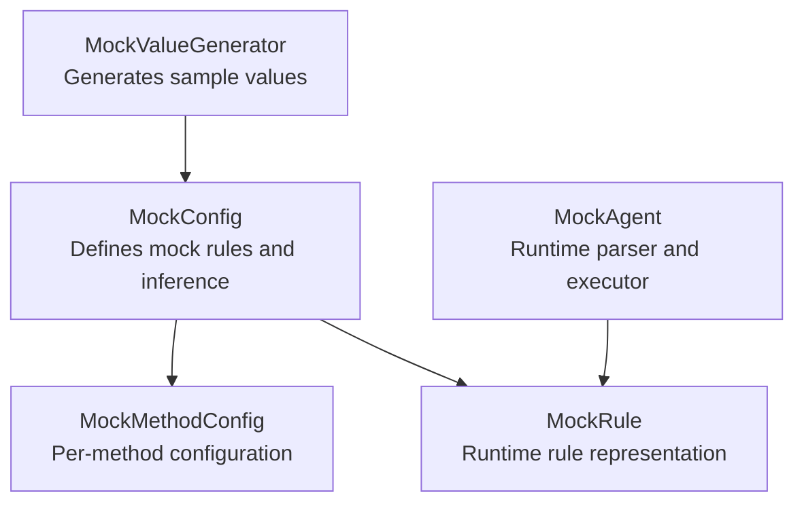
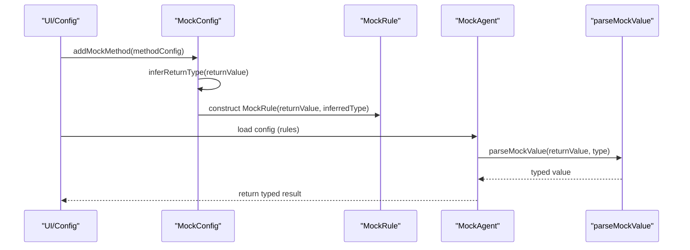
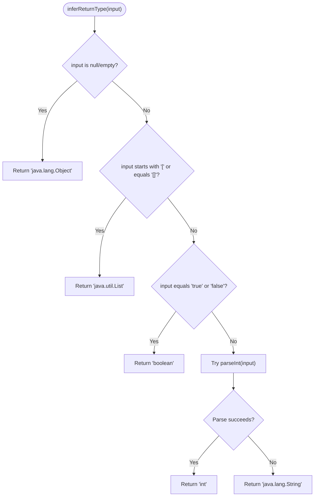
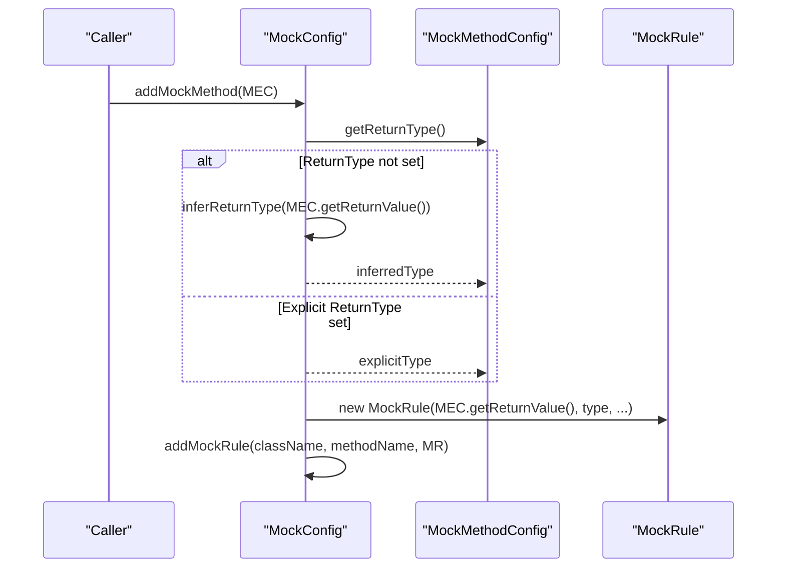
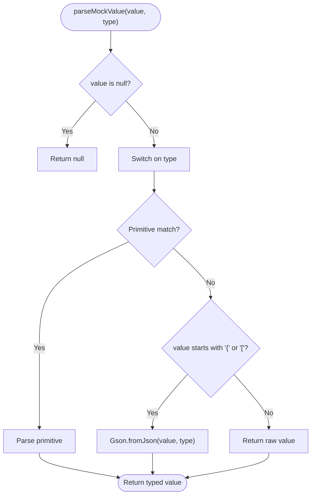
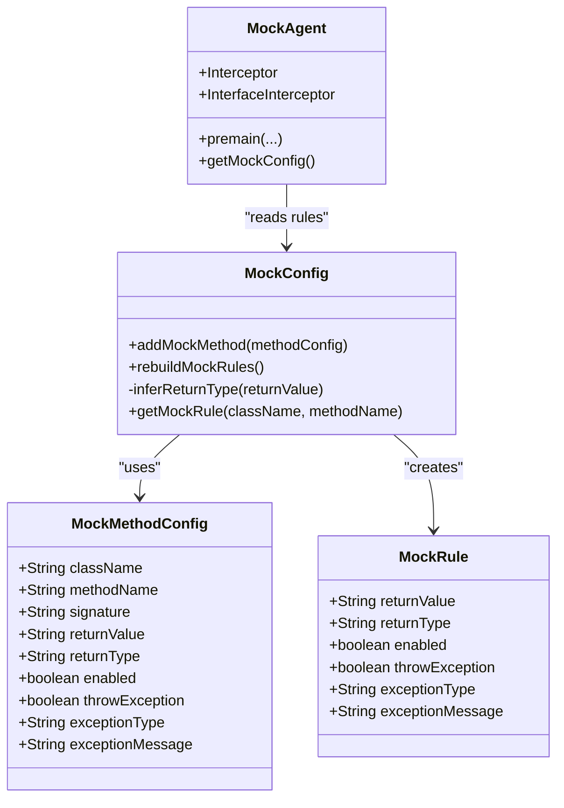

# Type Inference Engine

<cite>
**Referenced Files in This Document**
- [MockConfig.java](file://src/main/java/io/github/lancelothuxi/idea/plugin/mock/mock/MockConfig.java)
- [MockMethodConfig.java](file://src/main/java/io/github/lancelothuxi/idea/plugin/mock/mock/MockMethodConfig.java)
- [MockAgent.java](file://src/main/java/io/github/lancelothuxi/idea/plugin/mock/agent/MockAgent.java)
- [MockValueGenerator.java](file://src/main/java/io/github/lancelothuxi/idea/plugin/mock/util/MockValueGenerator.java)
- [README.md](file://README.md)
- [TEST_EXECUTION_SUMMARY.md](file://TEST_EXECUTION_SUMMARY.md)
</cite>

## Table of Contents
1. [Introduction](#introduction)
2. [Project Structure](#project-structure)
3. [Core Components](#core-components)
4. [Architecture Overview](#architecture-overview)
5. [Detailed Component Analysis](#detailed-component-analysis)
6. [Dependency Analysis](#dependency-analysis)
7. [Performance Considerations](#performance-considerations)
8. [Troubleshooting Guide](#troubleshooting-guide)
9. [Conclusion](#conclusion)

## Introduction
This document explains the automatic type inference engine responsible for determining Java return types from JSON string representations in the mock configuration system. It covers:
- The inferReturnType method implementation and its parsing logic for primitives, collections, and defaults
- How the engine integrates with MockMethodConfig and MockRule creation
- Developer overrides via explicit return types
- Edge cases and limitations
- Practical examples of inference behavior

## Project Structure
The type inference engine spans three primary areas:
- Mock configuration model: MockConfig and MockMethodConfig define the persisted configuration and inferred return types
- Runtime agent: MockAgent parses and converts mock values according to inferred or explicit types
- UI and utilities: MockValueGenerator assists in generating representative mock values for return types

**Diagram sources**
- [MockConfig.java](file://src/main/java/io/github/lancelothuxi/idea/plugin/mock/mock/MockConfig.java#L1-L218)
- [MockMethodConfig.java](file://src/main/java/io/github/lancelothuxi/idea/plugin/mock/mock/MockMethodConfig.java#L1-L94)
- [MockAgent.java](file://src/main/java/io/github/lancelothuxi/idea/plugin/mock/agent/MockAgent.java#L1-L400)
- [MockValueGenerator.java](file://src/main/java/io/github/lancelothuxi/idea/plugin/mock/util/MockValueGenerator.java#L1-L289)

**Section sources**
- [MockConfig.java](file://src/main/java/io/github/lancelothuxi/idea/plugin/mock/mock/MockConfig.java#L1-L218)
- [MockMethodConfig.java](file://src/main/java/io/github/lancelothuxi/idea/plugin/mock/mock/MockMethodConfig.java#L1-L94)
- [MockAgent.java](file://src/main/java/io/github/lancelothuxi/idea/plugin/mock/agent/MockAgent.java#L1-L400)
- [MockValueGenerator.java](file://src/main/java/io/github/lancelothuxi/idea/plugin/mock/util/MockValueGenerator.java#L1-L289)

## Core Components
- MockConfig: Stores mock rules, manages add/remove operations, and performs automatic return type inference when a return type is not explicitly set.
- MockMethodConfig: Per-method configuration container with fields for class/method/signature, raw return value, optional explicit return type, and exception settings.
- MockAgent: Runtime component that parses mock values into the correct Java types using the inferred or explicit return type.
- MockValueGenerator: Utility for generating sample JSON values based on PSI types; complements inference by providing representative samples.

Key responsibilities:
- Automatic inference: inferReturnType determines whether a JSON string represents a boolean, integer, list/array, or string, and falls back to Object/String otherwise.
- Rule creation: addMockMethod creates MockRule entries using either explicit return type or inferred type.
- Runtime parsing: parseMockValue converts string values to typed objects, supporting primitives, JSON objects/arrays, and generic collections.

**Section sources**
- [MockConfig.java](file://src/main/java/io/github/lancelothuxi/idea/plugin/mock/mock/MockConfig.java#L88-L105)
- [MockConfig.java](file://src/main/java/io/github/lancelothuxi/idea/plugin/mock/mock/MockConfig.java#L33-L61)
- [MockMethodConfig.java](file://src/main/java/io/github/lancelothuxi/idea/plugin/mock/mock/MockMethodConfig.java#L1-L94)
- [MockAgent.java](file://src/main/java/io/github/lancelothuxi/idea/plugin/mock/agent/MockAgent.java#L246-L326)

## Architecture Overview
The inference pipeline connects configuration, inference, and runtime parsing:

**Diagram sources**
- [MockConfig.java](file://src/main/java/io/github/lancelothuxi/idea/plugin/mock/mock/MockConfig.java#L33-L61)
- [MockConfig.java](file://src/main/java/io/github/lancelothuxi/idea/plugin/mock/mock/MockConfig.java#L88-L105)
- [MockAgent.java](file://src/main/java/io/github/lancelothuxi/idea/plugin/mock/agent/MockAgent.java#L246-L326)

## Detailed Component Analysis

### inferReturnType Implementation
The inference logic resides in MockConfig and evaluates the raw return value string to determine a Java type:
- Null/empty: returns Object
- Starts with “[” or equals “[]”: returns List
- Equals “true” or “false”: returns boolean
- Parses as integer: returns int
- Otherwise: returns String

**Diagram sources**
- [MockConfig.java](file://src/main/java/io/github/lancelothuxi/idea/plugin/mock/mock/MockConfig.java#L88-L105)

**Section sources**
- [MockConfig.java](file://src/main/java/io/github/lancelothuxi/idea/plugin/mock/mock/MockConfig.java#L88-L105)

### Integration with MockMethodConfig and MockRule Creation
When adding a mock method, MockConfig decides whether to use an explicitly set return type or infer one:
- If methodConfig.getReturnType() is null or empty, inferReturnType(methodConfig.getReturnValue()) is used
- A MockRule is constructed with the chosen return type and added to the registry

**Diagram sources**
- [MockConfig.java](file://src/main/java/io/github/lancelothuxi/idea/plugin/mock/mock/MockConfig.java#L33-L61)
- [MockMethodConfig.java](file://src/main/java/io/github/lancelothuxi/idea/plugin/mock/mock/MockMethodConfig.java#L1-L94)

**Section sources**
- [MockConfig.java](file://src/main/java/io/github/lancelothuxi/idea/plugin/mock/mock/MockConfig.java#L33-L61)
- [MockMethodConfig.java](file://src/main/java/io/github/lancelothuxi/idea/plugin/mock/mock/MockMethodConfig.java#L1-L94)

### Runtime Parsing and Type Conversion
MockAgent.parseMockValue converts the stored string value into the correct Java type:
- Primitive types: numeric and boolean conversion
- JSON objects/arrays: Gson parsing into generic or typed structures
- Collections: supports List and Map, including generic forms like List<SomeClass>
- Fallback: returns the raw string if parsing fails

**Diagram sources**
- [MockAgent.java](file://src/main/java/io/github/lancelothuxi/idea/plugin/mock/agent/MockAgent.java#L246-L326)

**Section sources**
- [MockAgent.java](file://src/main/java/io/github/lancelothuxi/idea/plugin/mock/agent/MockAgent.java#L246-L326)

### Parsing Algorithms for Different JSON Formats
- Arrays and Lists: If the return type indicates List or the value is a JSON array, Gson parses into List or typed List<List<Inner>> when generic inner types are present.
- Objects and Maps: JSON objects parse into Map or typed POJOs when the class is resolvable.
- Primitives: Direct conversion for int, long, double, float, boolean, and String.
- Strings: Returned as-is when not recognized as other types.

**Section sources**
- [MockAgent.java](file://src/main/java/io/github/lancelothuxi/idea/plugin/mock/agent/MockAgent.java#L274-L318)

### Examples of Inference Behavior
- Boolean: "true"/"false" → boolean
- Integer: "42" → int
- Array/List: "[1,2]" or "[]" → java.util.List
- Object: "{...}" → String (fallback) or parsed to Map/POJO at runtime depending on type resolution
- Empty/null: null/"" → java.lang.Object

These behaviors are validated by tests and documented usage examples.

**Section sources**
- [MockConfig.java](file://src/main/java/io/github/lancelothuxi/idea/plugin/mock/mock/MockConfig.java#L88-L105)
- [TEST_EXECUTION_SUMMARY.md](file://TEST_EXECUTION_SUMMARY.md#L18-L34)
- [README.md](file://README.md#L85-L146)

### Developer Override Mechanism
Developers can explicitly set the return type in MockMethodConfig to bypass inference:
- Set MockMethodConfig.setReturnType(...) before calling addMockMethod
- MockConfig.addMockMethod will use the explicit type instead of inferring

This ensures deterministic behavior when inference might be ambiguous (e.g., numeric strings that could be integers vs. identifiers).

**Section sources**
- [MockMethodConfig.java](file://src/main/java/io/github/lancelothuxi/idea/plugin/mock/mock/MockMethodConfig.java#L50-L56)
- [MockConfig.java](file://src/main/java/io/github/lancelothuxi/idea/plugin/mock/mock/MockConfig.java#L48-L51)

## Dependency Analysis
- MockConfig depends on:
  - MockMethodConfig for per-method configuration
  - MockRule for runtime representation
- MockAgent depends on:
  - MockConfig for rule lookup
  - Gson for JSON parsing
  - Reflection for generic type resolution
- MockValueGenerator complements inference by generating representative samples for UI and documentation.

**Diagram sources**
- [MockMethodConfig.java](file://src/main/java/io/github/lancelothuxi/idea/plugin/mock/mock/MockMethodConfig.java#L1-L94)
- [MockConfig.java](file://src/main/java/io/github/lancelothuxi/idea/plugin/mock/mock/MockConfig.java#L1-L218)
- [MockAgent.java](file://src/main/java/io/github/lancelothuxi/idea/plugin/mock/agent/MockAgent.java#L1-L400)

**Section sources**
- [MockConfig.java](file://src/main/java/io/github/lancelothuxi/idea/plugin/mock/mock/MockConfig.java#L1-L218)
- [MockMethodConfig.java](file://src/main/java/io/github/lancelothuxi/idea/plugin/mock/mock/MockMethodConfig.java#L1-L94)
- [MockAgent.java](file://src/main/java/io/github/lancelothuxi/idea/plugin/mock/agent/MockAgent.java#L1-L400)

## Performance Considerations
- Inference cost: inferReturnType is O(1) string checks and a single integer parse attempt.
- Runtime parsing cost: parseMockValue uses Gson for JSON structures; generic type resolution adds reflection overhead.
- Recommendations:
  - Prefer explicit return types for frequently used mocks to avoid repeated inference.
  - Keep JSON values concise to reduce parsing overhead.
  - Use List/Map types explicitly when nesting complex structures.

[No sources needed since this section provides general guidance]

## Troubleshooting Guide
Common issues and resolutions:
- Unexpected String return type:
  - Cause: inferReturnType fallback for unrecognized formats
  - Resolution: Set explicit return type in MockMethodConfig
- JSON parsed as generic Map/List:
  - Cause: Non-generic type strings or missing generic class resolution
  - Resolution: Provide explicit generic return type (e.g., List<SomeClass>) and ensure the class is resolvable
- Numeric strings misinterpreted:
  - Cause: Ambiguity between numeric identifiers and integers
  - Resolution: Set explicit return type to String or int as appropriate

**Section sources**
- [MockConfig.java](file://src/main/java/io/github/lancelothuxi/idea/plugin/mock/mock/MockConfig.java#L88-L105)
- [MockAgent.java](file://src/main/java/io/github/lancelothuxi/idea/plugin/mock/agent/MockAgent.java#L274-L318)

## Conclusion
The type inference engine provides robust automatic return type determination for mock configurations, covering primitives, collections, and sensible defaults. It integrates seamlessly with MockMethodConfig and MockRule creation and can be overridden by explicit return types. Developers can rely on inference for quick setups while retaining full control for precise scenarios.