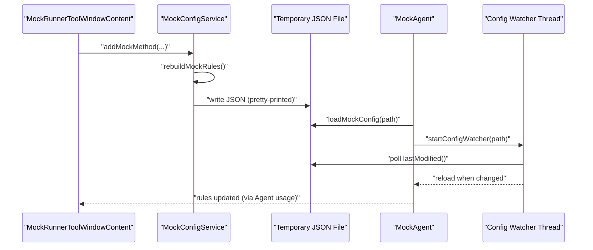
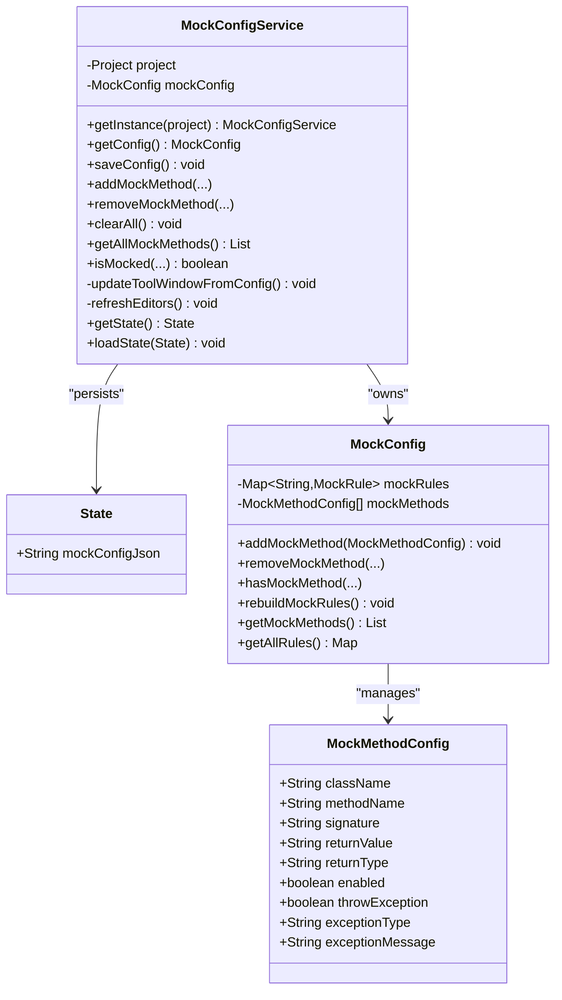
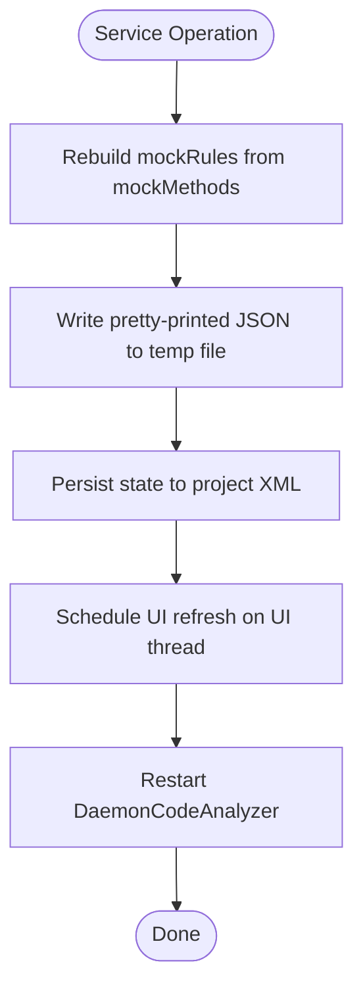
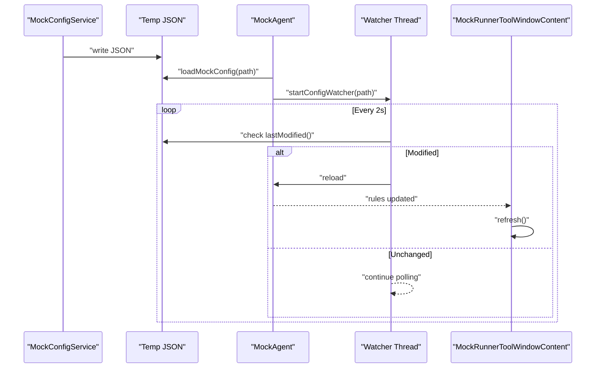
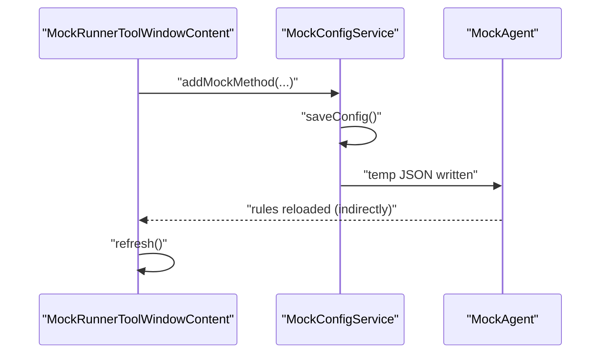
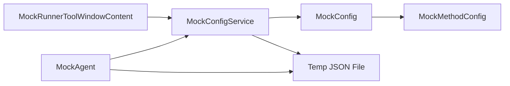

# Service Layer Architecture

<cite>
**Referenced Files in This Document**
- [MockConfigService.java](file://src/main/java/io/github/lancelothuxi/idea/plugin/mock/service/MockConfigService.java)
- [MockConfig.java](file://src/main/java/io/github/lancelothuxi/idea/plugin/mock/mock/MockConfig.java)
- [MockMethodConfig.java](file://src/main/java/io/github/lancelothuxi/idea/plugin/mock/mock/MockMethodConfig.java)
- [MockRunnerToolWindowContent.java](file://src/main/java/io/github/lancelothuxi/idea/plugin/mock/ui/MockRunnerToolWindowContent.java)
- [RunnerToolWindowFactory.java](file://src/main/java/io/github/lancelothuxi/idea/plugin/mock/ui/RunnerToolWindowFactory.java)
- [MockAgent.java](file://src/main/java/io/github/lancelothuxi/idea/plugin/mock/agent/MockAgent.java)
- [MOCK_PERSISTENCE_GUIDE.md](file://docs/MOCK_PERSISTENCE_GUIDE.md)
</cite>

## Table of Contents
1. [Introduction](#introduction)
2. [Project Structure](#project-structure)
3. [Core Components](#core-components)
4. [Architecture Overview](#architecture-overview)
5. [Detailed Component Analysis](#detailed-component-analysis)
6. [Dependency Analysis](#dependency-analysis)
7. [Performance Considerations](#performance-considerations)
8. [Troubleshooting Guide](#troubleshooting-guide)
9. [Conclusion](#conclusion)

## Introduction
This document describes the service layer architecture for configuration management in the Mock Runner plugin. It focuses on the MockConfigService singleton pattern implementation, configuration persistence, state synchronization, and the configuration watcher mechanism that triggers UI updates. It also explains how the service coordinates between UI components and the Java Agent, covers thread safety and concurrency considerations, and documents integration with IntelliJ Platform project services and file system APIs.

## Project Structure
The service layer centers around a project-scoped service that persists configuration to disk, exposes CRUD operations, and notifies UI components and the Java Agent of changes. The UI is a tool window that reflects the current configuration state, while the Java Agent watches a temporary configuration file for changes and reloads rules dynamically.

```mermaid
graph TB
subgraph "IntelliJ Platform"
Factory["RunnerToolWindowFactory"]
ToolWindow["MockRunnerToolWindowContent"]
Project["Project"]
end
subgraph "Service Layer"
Service["MockConfigService"]
Config["MockConfig"]
Rule["MockConfig.MockRule"]
end
subgraph "Agent"
Agent["MockAgent"]
Watcher["Config Watcher Thread"]
end
Factory --> ToolWindow
Project --> Service
Service --> Config
Config --> Rule
Service --> ToolWindow
Service --> Agent
Agent --> Watcher
```

**Diagram sources**
- [RunnerToolWindowFactory.java](file://src/main/java/io/github/lancelothuxi/idea/plugin/mock/ui/RunnerToolWindowFactory.java#L10-L20)
- [MockRunnerToolWindowContent.java](file://src/main/java/io/github/lancelothuxi/idea/plugin/mock/ui/MockRunnerToolWindowContent.java#L1-L60)
- [MockConfigService.java](file://src/main/java/io/github/lancelothuxi/idea/plugin/mock/service/MockConfigService.java#L19-L35)
- [MockConfig.java](file://src/main/java/io/github/lancelothuxi/idea/plugin/mock/mock/MockConfig.java#L12-L218)
- [MockAgent.java](file://src/main/java/io/github/lancelothuxi/idea/plugin/mock/agent/MockAgent.java#L23-L50)

**Section sources**
- [RunnerToolWindowFactory.java](file://src/main/java/io/github/lancelothuxi/idea/plugin/mock/ui/RunnerToolWindowFactory.java#L10-L20)
- [MockRunnerToolWindowContent.java](file://src/main/java/io/github/lancelothuxi/idea/plugin/mock/ui/MockRunnerToolWindowContent.java#L1-L60)
- [MockConfigService.java](file://src/main/java/io/github/lancelothuxi/idea/plugin/mock/service/MockConfigService.java#L19-L35)
- [MockConfig.java](file://src/main/java/io/github/lancelothuxi/idea/plugin/mock/mock/MockConfig.java#L12-L218)
- [MockAgent.java](file://src/main/java/io/github/lancelothuxi/idea/plugin/mock/agent/MockAgent.java#L23-L50)

## Core Components
- MockConfigService: A project-scoped service implementing persistent state management and UI notifications. It writes a temporary JSON configuration for the Agent and loads/saves project-level XML state.
- MockConfig: Holds the in-memory configuration model with methods to add/update/remove mock rules and reconstruct rule maps from method lists.
- MockMethodConfig: Serializable DTO representing a single mock method configuration with fields for class/method/signature, return value/type, and exception behavior.
- MockRunnerToolWindowContent: The UI tool window that displays, edits, filters, and paginates mock configurations and triggers service operations.
- MockAgent: The Java Agent that loads configuration from a file path and starts a file watcher thread to reload configuration when the file changes.

**Section sources**
- [MockConfigService.java](file://src/main/java/io/github/lancelothuxi/idea/plugin/mock/service/MockConfigService.java#L23-L35)
- [MockConfig.java](file://src/main/java/io/github/lancelothuxi/idea/plugin/mock/mock/MockConfig.java#L12-L86)
- [MockMethodConfig.java](file://src/main/java/io/github/lancelothuxi/idea/plugin/mock/mock/MockMethodConfig.java#L1-L93)
- [MockRunnerToolWindowContent.java](file://src/main/java/io/github/lancelothuxi/idea/plugin/mock/ui/MockRunnerToolWindowContent.java#L22-L60)
- [MockAgent.java](file://src/main/java/io/github/lancelothuxi/idea/plugin/mock/agent/MockAgent.java#L23-L50)

## Architecture Overview
The service layer follows a layered design:
- UI layer: Tool window listens for user actions and delegates to the service.
- Service layer: Manages configuration state, persists to XML, writes a temporary JSON for the Agent, and updates UI asynchronously.
- Model layer: MockConfig and MockMethodConfig encapsulate configuration data and rule reconstruction.
- Agent layer: Watches a temporary configuration file and reloads rules when modified.



**Diagram sources**
- [MockRunnerToolWindowContent.java](file://src/main/java/io/github/lancelothuxi/idea/plugin/mock/ui/MockRunnerToolWindowContent.java#L110-L122)
- [MockConfigService.java](file://src/main/java/io/github/lancelothuxi/idea/plugin/mock/service/MockConfigService.java#L41-L58)
- [MockAgent.java](file://src/main/java/io/github/lancelothuxi/idea/plugin/mock/agent/MockAgent.java#L174-L200)

## Detailed Component Analysis

### MockConfigService Singleton Pattern and Persistence
- Project-scoped service: Retrieved via project.getService(MockConfigService.class), ensuring a single instance per project.
- PersistentStateComponent: Implements state serialization/deserialization to/from XML under the project’s .idea directory.
- Temporary JSON write: On save, the service writes a pretty-printed JSON to a temporary location for the Agent to watch and hot-reload.
- UI synchronization: After state changes, the service schedules UI refresh on the UI thread and triggers editor daemon restart to update line markers.



**Diagram sources**
- [MockConfigService.java](file://src/main/java/io/github/lancelothuxi/idea/plugin/mock/service/MockConfigService.java#L23-L96)
- [MockConfig.java](file://src/main/java/io/github/lancelothuxi/idea/plugin/mock/mock/MockConfig.java#L12-L86)
- [MockMethodConfig.java](file://src/main/java/io/github/lancelothuxi/idea/plugin/mock/mock/MockMethodConfig.java#L1-L93)

**Section sources**
- [MockConfigService.java](file://src/main/java/io/github/lancelothuxi/idea/plugin/mock/service/MockConfigService.java#L23-L96)
- [MOCK_PERSISTENCE_GUIDE.md](file://docs/MOCK_PERSISTENCE_GUIDE.md#L9-L32)

### Configuration Management and State Persistence
- XML persistence: The service stores a JSON representation of MockConfig into the project’s XML state component. Loading reconstructs MockConfig and rebuilds the internal rule map.
- Temporary JSON: The service writes a separate JSON file to a temporary directory for the Agent to consume. This enables hot-reloading without restarting the JVM.
- Change notifications: After adding/removing/clearing, the service ensures the tool window is visible, refreshes UI, and triggers editor daemon restart to update icons/markers.



**Diagram sources**
- [MockConfigService.java](file://src/main/java/io/github/lancelothuxi/idea/plugin/mock/service/MockConfigService.java#L41-L58)
- [MockConfig.java](file://src/main/java/io/github/lancelothuxi/idea/plugin/mock/mock/MockConfig.java#L67-L86)
- [MockRunnerToolWindowContent.java](file://src/main/java/io/github/lancelothuxi/idea/plugin/mock/ui/MockRunnerToolWindowContent.java#L130-L150)

**Section sources**
- [MockConfigService.java](file://src/main/java/io/github/lancelothuxi/idea/plugin/mock/service/MockConfigService.java#L41-L96)
- [MockConfig.java](file://src/main/java/io/github/lancelothuxi/idea/plugin/mock/mock/MockConfig.java#L67-L86)
- [MOCK_PERSISTENCE_GUIDE.md](file://docs/MOCK_PERSISTENCE_GUIDE.md#L23-L31)

### Configuration Watcher System and UI Updates
- File watcher: The Agent starts a daemon thread that polls the configuration file every 2 seconds. On modification, it reloads the configuration and logs the number of loaded rules.
- UI update trigger: The service updates the tool window after loading state and after any mutation operation. The UI uses a table model with sorting, filtering, pagination, and dirty-state tracking to reflect changes immediately.



**Diagram sources**
- [MockAgent.java](file://src/main/java/io/github/lancelothuxi/idea/plugin/mock/agent/MockAgent.java#L174-L200)
- [MockRunnerToolWindowContent.java](file://src/main/java/io/github/lancelothuxi/idea/plugin/mock/ui/MockRunnerToolWindowContent.java#L312-L334)

**Section sources**
- [MockAgent.java](file://src/main/java/io/github/lancelothuxi/idea/plugin/mock/agent/MockAgent.java#L174-L200)
- [MockRunnerToolWindowContent.java](file://src/main/java/io/github/lancelothuxi/idea/plugin/mock/ui/MockRunnerToolWindowContent.java#L312-L334)

### Coordination Between UI and Java Agent
- UI-to-service: The tool window invokes service methods to add/remove/clear mock configurations and to save state.
- Service-to-agent: The service writes a JSON file consumed by the Agent. The Agent reloads rules automatically when the file changes.
- Service-to-UI: The service schedules UI refresh on the UI thread and restarts the code analyzer to update line markers.



**Diagram sources**
- [MockRunnerToolWindowContent.java](file://src/main/java/io/github/lancelothuxi/idea/plugin/mock/ui/MockRunnerToolWindowContent.java#L110-L122)
- [MockConfigService.java](file://src/main/java/io/github/lancelothuxi/idea/plugin/mock/service/MockConfigService.java#L41-L58)
- [MockAgent.java](file://src/main/java/io/github/lancelothuxi/idea/plugin/mock/agent/MockAgent.java#L174-L200)

**Section sources**
- [MockRunnerToolWindowContent.java](file://src/main/java/io/github/lancelothuxi/idea/plugin/mock/ui/MockRunnerToolWindowContent.java#L110-L122)
- [MockConfigService.java](file://src/main/java/io/github/lancelothuxi/idea/plugin/mock/service/MockConfigService.java#L41-L58)
- [MockAgent.java](file://src/main/java/io/github/lancelothuxi/idea/plugin/mock/agent/MockAgent.java#L174-L200)

### Thread Safety and Concurrency
- UI thread scheduling: The service uses the application’s invokeLater mechanism to update the tool window, ensuring UI updates occur on the UI thread.
- Daemon restart: The service triggers DaemonCodeAnalyzer.restart to refresh line markers, which is safe to call from any thread.
- Watcher thread: The Agent’s watcher runs as a daemon thread with periodic polling and interrupts handled gracefully.
- Immutable reads: The MockConfig data structures are accessed primarily for reads during rendering; mutations are serialized through the service.

**Section sources**
- [MockConfigService.java](file://src/main/java/io/github/lancelothuxi/idea/plugin/mock/service/MockConfigService.java#L98-L107)
- [MockRunnerToolWindowContent.java](file://src/main/java/io/github/lancelothuxi/idea/plugin/mock/ui/MockRunnerToolWindowContent.java#L312-L334)
- [MockAgent.java](file://src/main/java/io/github/lancelothuxi/idea/plugin/mock/agent/MockAgent.java#L174-L200)

### Integration with IntelliJ Platform Services and File System APIs
- Project services: The service is retrieved via project.getService and registered as a tool window content provider.
- File system: The service writes to a temporary directory using standard Java I/O. The Agent uses java.io.File APIs to poll lastModified and load configuration.
- Tool window lifecycle: The factory creates tool window content using the project-scoped service instance.

**Section sources**
- [RunnerToolWindowFactory.java](file://src/main/java/io/github/lancelothuxi/idea/plugin/mock/ui/RunnerToolWindowFactory.java#L10-L20)
- [MockConfigService.java](file://src/main/java/io/github/lancelothuxi/idea/plugin/mock/service/MockConfigService.java#L41-L58)
- [MockAgent.java](file://src/main/java/io/github/lancelothuxi/idea/plugin/mock/agent/MockAgent.java#L174-L200)

### Usage Patterns, Examples, and Error Handling
- Adding a mock configuration:
  - UI calls service.addMockMethod with class, method, signature, return value/type, and exception settings.
  - Service adds to MockConfig, rebuilds rules, writes temp JSON, ensures tool window visibility, refreshes UI, and restarts daemon.
- Removing a mock configuration:
  - Service removes from MockConfig and refreshes UI/editor markers.
- Clearing all:
  - Service clears MockConfig, saves, refreshes UI, and resets pagination/stats.
- Error handling:
  - XML load failures fall back to empty configuration and log errors.
  - Temp file write failures are logged.
  - Watcher thread catches exceptions and continues polling.

**Section sources**
- [MockRunnerToolWindowContent.java](file://src/main/java/io/github/lancelothuxi/idea/plugin/mock/ui/MockRunnerToolWindowContent.java#L110-L122)
- [MockConfigService.java](file://src/main/java/io/github/lancelothuxi/idea/plugin/mock/service/MockConfigService.java#L75-L96)
- [MockAgent.java](file://src/main/java/io/github/lancelothuxi/idea/plugin/mock/agent/MockAgent.java#L174-L200)

## Dependency Analysis
The service layer exhibits low coupling and high cohesion:
- MockConfigService depends on MockConfig and UI components for notifications.
- MockConfig manages MockMethodConfig and maintains rule maps for the Agent.
- UI components depend on the service for data and actions.
- The Agent depends on the file system and the service indirectly via the temp JSON.



**Diagram sources**
- [MockRunnerToolWindowContent.java](file://src/main/java/io/github/lancelothuxi/idea/plugin/mock/ui/MockRunnerToolWindowContent.java#L166-L171)
- [MockConfigService.java](file://src/main/java/io/github/lancelothuxi/idea/plugin/mock/service/MockConfigService.java#L41-L58)
- [MockConfig.java](file://src/main/java/io/github/lancelothuxi/idea/plugin/mock/mock/MockConfig.java#L33-L61)
- [MockAgent.java](file://src/main/java/io/github/lancelothuxi/idea/plugin/mock/agent/MockAgent.java#L174-L200)

**Section sources**
- [MockRunnerToolWindowContent.java](file://src/main/java/io/github/lancelothuxi/idea/plugin/mock/ui/MockRunnerToolWindowContent.java#L166-L171)
- [MockConfigService.java](file://src/main/java/io/github/lancelothuxi/idea/plugin/mock/service/MockConfigService.java#L41-L58)
- [MockConfig.java](file://src/main/java/io/github/lancelothuxi/idea/plugin/mock/mock/MockConfig.java#L33-L61)
- [MockAgent.java](file://src/main/java/io/github/lancelothuxi/idea/plugin/mock/agent/MockAgent.java#L174-L200)

## Performance Considerations
- JSON serialization: Pretty-printing improves readability but increases file size; consider balancing readability vs. IO overhead.
- Rule reconstruction: Rebuilding rules on save ensures consistency between method list and rule map; keep this O(n) and avoid unnecessary rebuilds outside save.
- UI updates: Using invokeLater prevents UI thread blocking; batch UI updates where possible.
- File polling: 2-second intervals are conservative; adjust based on workload and responsiveness needs.
- Editor daemon restart: Frequent restarts can impact performance; minimize unnecessary calls by gating updates when no changes occur.

[No sources needed since this section provides general guidance]

## Troubleshooting Guide
- Configuration not persisting:
  - Verify project XML storage path and permissions.
  - Check service logs for “Failed to save state” or “Failed to load state.”
- Agent not reloading:
  - Confirm temp JSON path exists and is writable.
  - Ensure the Agent received the path argument and watcher started.
  - Check watcher thread logs for polling and reload messages.
- UI not updating:
  - Confirm service scheduled UI refresh and editor daemon restart was invoked.
  - Verify tool window visibility and content manager registration.

**Section sources**
- [MOCK_PERSISTENCE_GUIDE.md](file://docs/MOCK_PERSISTENCE_GUIDE.md#L67-L80)
- [MockAgent.java](file://src/main/java/io/github/lancelothuxi/idea/plugin/mock/agent/MockAgent.java#L174-L200)
- [MockConfigService.java](file://src/main/java/io/github/lancelothuxi/idea/plugin/mock/service/MockConfigService.java#L98-L107)

## Conclusion
The service layer architecture cleanly separates concerns: the service manages configuration state and persistence, the UI renders and edits configurations, and the Agent monitors changes to keep runtime behavior synchronized. The singleton pattern scoped to the project ensures consistent access, while persistent state and temporary JSON enable seamless integration with the IntelliJ Platform and the Java Agent. Thread-safe UI updates and graceful error handling contribute to a robust and responsive user experience.