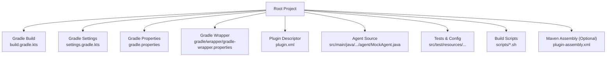
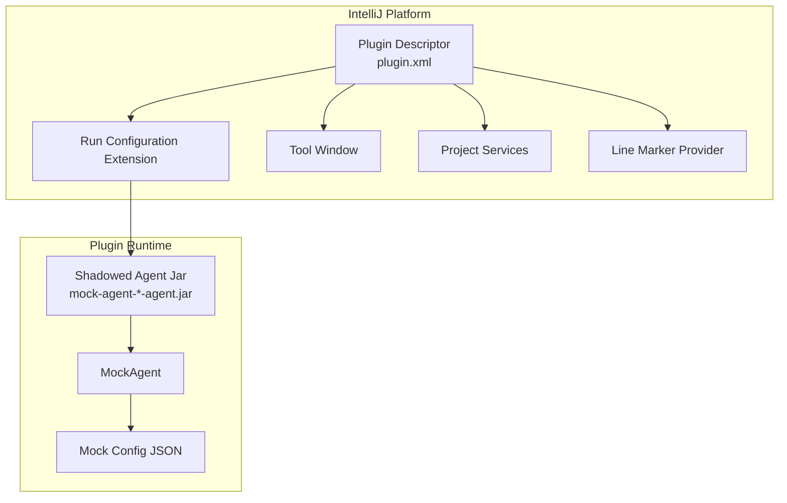
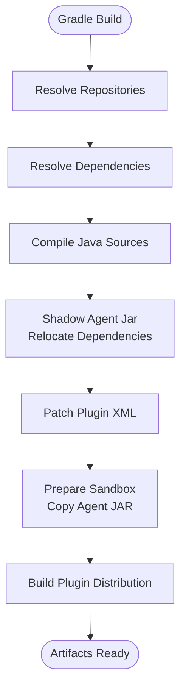
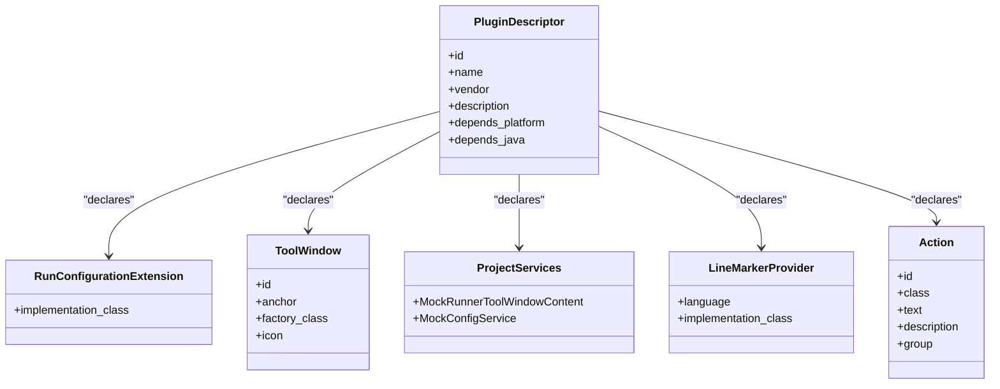
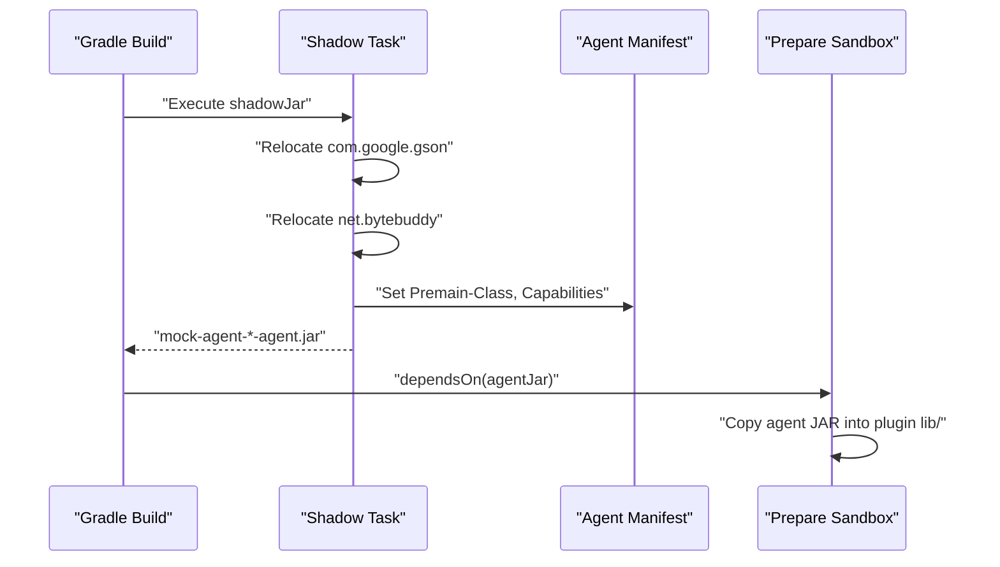
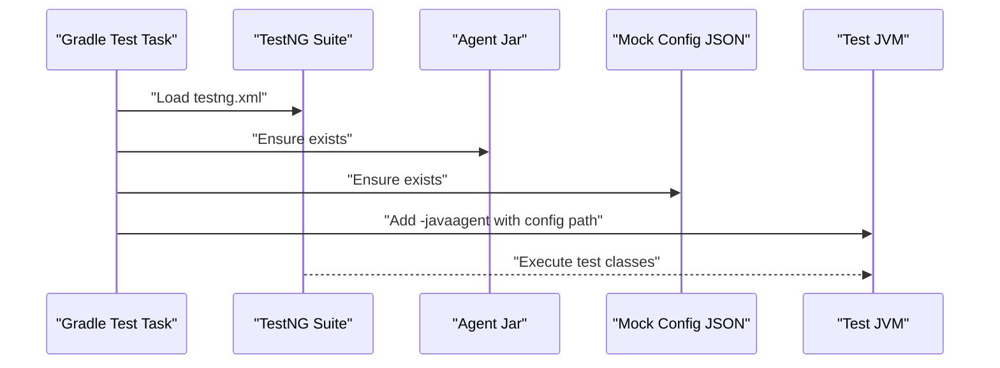
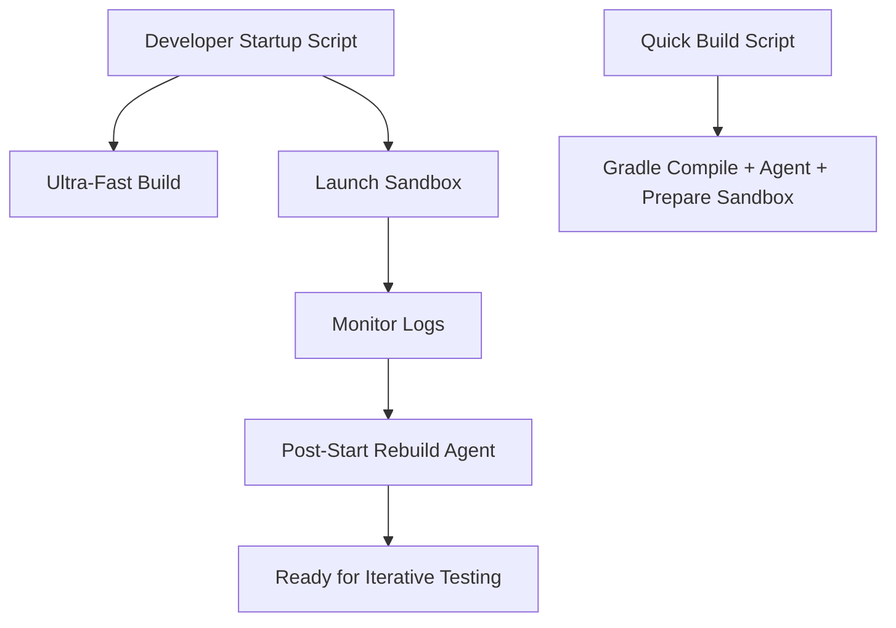
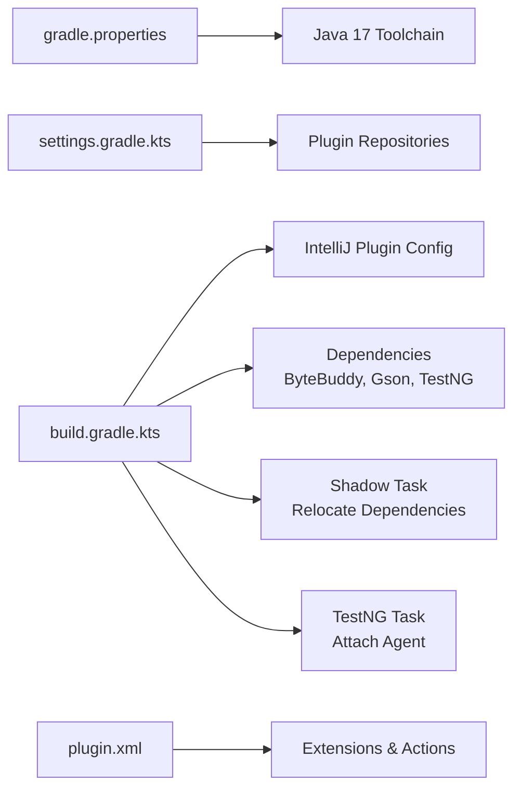

# Development and Build

<cite>
**Referenced Files in This Document**
- [build.gradle.kts](file://build.gradle.kts)
- [settings.gradle.kts](file://settings.gradle.kts)
- [gradle.properties](file://gradle.properties)
- [gradle/wrapper/gradle-wrapper.properties](file://gradle/wrapper/gradle-wrapper.properties)
- [GRADLE_SETUP.md](file://GRADLE_SETUP.md)
- [BUILD_INSTRUCTIONS.md](file://BUILD_INSTRUCTIONS.md)
- [src/main/resources/META-INF/plugin.xml](file://src/main/resources/META-INF/plugin.xml)
- [src/test/resources/testng.xml](file://src/test/resources/testng.xml)
- [src/test/resources/mock-config-test.json](file://src/test/resources/mock-config-test.json)
- [scripts/quick-build.sh](file://scripts/quick-build.sh)
- [scripts/ultra-fast-build.sh](file://scripts/ultra-fast-build.sh)
- [scripts/run-sandbox.sh](file://scripts/run-sandbox.sh)
- [scripts/start-plugin-dev.sh](file://scripts/start-plugin-dev.sh)
- [src/main/assembly/plugin-assembly.xml](file://src/main/assembly/plugin-assembly.xml)
- [docs/如何运行插件.md](file://docs/如何运行插件.md)
</cite>

## Table of Contents
1. [Introduction](#introduction)
2. [Project Structure](#project-structure)
3. [Core Components](#core-components)
4. [Architecture Overview](#architecture-overview)
5. [Detailed Component Analysis](#detailed-component-analysis)
6. [Dependency Analysis](#dependency-analysis)
7. [Performance Considerations](#performance-considerations)
8. [Troubleshooting Guide](#troubleshooting-guide)
9. [Conclusion](#conclusion)
10. [Appendices](#appendices)

## Introduction
This document explains how to develop, build, and deploy the Mock Runner IntelliJ Platform plugin. It covers the Gradle and Maven build configurations, dependency management, plugin packaging, development workflow, testing with TestNG, debugging techniques, and deployment processes. It also includes guidance for setting up the development environment, optimizing builds, and preparing for continuous integration and automated deployments.

## Project Structure
The project is organized as a standard IntelliJ Platform plugin with a dedicated Java agent that injects runtime method mocking capabilities. Key areas:
- Gradle build configuration and tasks
- IntelliJ Platform plugin descriptor
- Java agent implementation and shadowing
- Test framework configuration (TestNG) and mock configuration
- Development scripts for fast iteration and sandbox runs

**Diagram sources**
- [build.gradle.kts](file://build.gradle.kts#L1-L146)
- [settings.gradle.kts](file://settings.gradle.kts#L1-L11)
- [gradle.properties](file://gradle.properties#L1-L13)
- [gradle/wrapper/gradle-wrapper.properties](file://gradle/wrapper/gradle-wrapper.properties#L1-L8)
- [src/main/resources/META-INF/plugin.xml](file://src/main/resources/META-INF/plugin.xml#L1-L55)
- [src/test/resources/testng.xml](file://src/test/resources/testng.xml#L1-L20)
- [src/test/resources/mock-config-test.json](file://src/test/resources/mock-config-test.json#L1-L72)
- [scripts/quick-build.sh](file://scripts/quick-build.sh#L1-L24)
- [scripts/ultra-fast-build.sh](file://scripts/ultra-fast-build.sh#L1-L54)
- [src/main/assembly/plugin-assembly.xml](file://src/main/assembly/plugin-assembly.xml#L1-L19)

**Section sources**
- [build.gradle.kts](file://build.gradle.kts#L1-L146)
- [settings.gradle.kts](file://settings.gradle.kts#L1-L11)
- [gradle.properties](file://gradle.properties#L1-L13)
- [gradle/wrapper/gradle-wrapper.properties](file://gradle/wrapper/gradle-wrapper.properties#L1-L8)
- [src/main/resources/META-INF/plugin.xml](file://src/main/resources/META-INF/plugin.xml#L1-L55)
- [src/test/resources/testng.xml](file://src/test/resources/testng.xml#L1-L20)
- [src/test/resources/mock-config-test.json](file://src/test/resources/mock-config-test.json#L1-L72)
- [scripts/quick-build.sh](file://scripts/quick-build.sh#L1-L24)
- [scripts/ultra-fast-build.sh](file://scripts/ultra-fast-build.sh#L1-L54)
- [src/main/assembly/plugin-assembly.xml](file://src/main/assembly/plugin-assembly.xml#L1-L19)

## Core Components
- Gradle build with IntelliJ Platform plugin, shadow plugin, and Java 17 toolchain
- Shadowed Java agent packaged alongside the plugin for runtime injection
- TestNG-based test suite with a plugin-specific listener and JSON-driven mock configuration
- Development scripts for rapid agent rebuilds and sandbox orchestration

Key build and packaging highlights:
- Plugin descriptor declares run configuration extension, tool window, services, line markers, and actions.
- Shadow task relocates third-party libraries to avoid conflicts.
- Test task attaches the agent to the test JVM with a mock configuration file.
- Prepare sandbox copies the agent JAR into the plugin sandbox directory.

**Section sources**
- [build.gradle.kts](file://build.gradle.kts#L37-L137)
- [src/main/resources/META-INF/plugin.xml](file://src/main/resources/META-INF/plugin.xml#L25-L53)
- [src/test/resources/testng.xml](file://src/test/resources/testng.xml#L1-L20)
- [src/test/resources/mock-config-test.json](file://src/test/resources/mock-config-test.json#L1-L72)

## Architecture Overview
The plugin integrates with IntelliJ Platform and injects a Java agent at runtime to mock method calls. The agent is shaded to prevent classpath conflicts and is automatically included in the plugin sandbox during preparation.

**Diagram sources**
- [src/main/resources/META-INF/plugin.xml](file://src/main/resources/META-INF/plugin.xml#L25-L53)
- [build.gradle.kts](file://build.gradle.kts#L84-L123)
- [src/test/resources/mock-config-test.json](file://src/test/resources/mock-config-test.json#L1-L72)

## Detailed Component Analysis

### Gradle Build Configuration
- Plugins: Java, IntelliJ Platform, Shadow
- Repositories: Aliyun mirrors, JetBrains cache redirector, Gradle Plugin Portal, Maven Central
- Dependencies: ByteBuddy, Gson, TestNG
- Java Toolchain: Java 17
- Tasks:
  - Patch plugin XML for since/until builds
  - Disable searchable options generation
  - Configure TestNG suite and attach agent to test JVM
  - Shadow task relocates dependencies and sets agent manifest
  - Prepare sandbox depends on agent build and copies the agent JAR into the plugin sandbox lib folder

**Diagram sources**
- [build.gradle.kts](file://build.gradle.kts#L10-L20)
- [build.gradle.kts](file://build.gradle.kts#L25-L35)
- [build.gradle.kts](file://build.gradle.kts#L139-L145)
- [build.gradle.kts](file://build.gradle.kts#L43-L82)
- [build.gradle.kts](file://build.gradle.kts#L84-L123)

**Section sources**
- [build.gradle.kts](file://build.gradle.kts#L1-L146)

### IntelliJ Platform Plugin Descriptor
Defines plugin metadata, vendor, dependencies on platform and Java modules, and extension points:
- Run configuration extension for injecting the mock agent
- Tool window factory for the Mock Runner UI
- Project services for UI content and configuration
- Line marker provider for highlighting mocked methods
- Editor popup action for adding mocks

**Diagram sources**
- [src/main/resources/META-INF/plugin.xml](file://src/main/resources/META-INF/plugin.xml#L1-L55)

**Section sources**
- [src/main/resources/META-INF/plugin.xml](file://src/main/resources/META-INF/plugin.xml#L1-L55)

### Java Agent Packaging and Relocation
The shadow plugin packages the agent with relocated third-party dependencies to avoid conflicts with user projects. The agent manifest specifies premain class and instrumentation capabilities.

**Diagram sources**
- [build.gradle.kts](file://build.gradle.kts#L84-L123)

**Section sources**
- [build.gradle.kts](file://build.gradle.kts#L84-L123)

### TestNG-Based Testing and Mock Configuration
- TestNG suite defines test classes for Dubbo and Feign mocking scenarios
- Test task:
  - Uses TestNG suite XML
  - Attaches the agent JAR to the test JVM with a mock configuration file
  - Ensures the agent JAR is built before tests
- Mock configuration JSON defines method-level mock rules with return values and types

**Diagram sources**
- [src/test/resources/testng.xml](file://src/test/resources/testng.xml#L1-L20)
- [build.gradle.kts](file://build.gradle.kts#L57-L82)
- [src/test/resources/mock-config-test.json](file://src/test/resources/mock-config-test.json#L1-L72)

**Section sources**
- [src/test/resources/testng.xml](file://src/test/resources/testng.xml#L1-L20)
- [build.gradle.kts](file://build.gradle.kts#L57-L82)
- [src/test/resources/mock-config-test.json](file://src/test/resources/mock-config-test.json#L1-L72)

### Development Scripts and Workflows
- Ultra-fast agent build: compiles only agent sources and repackages with a minimal manifest
- Quick build: Gradle-based pipeline for incremental development
- Sandbox runner: starts the plugin sandbox and logs progress
- Developer startup: orchestrates agent rebuild, sandbox launch, and post-start agent reapplication

**Diagram sources**
- [scripts/start-plugin-dev.sh](file://scripts/start-plugin-dev.sh#L1-L80)
- [scripts/ultra-fast-build.sh](file://scripts/ultra-fast-build.sh#L1-L54)
- [scripts/quick-build.sh](file://scripts/quick-build.sh#L1-L24)
- [scripts/run-sandbox.sh](file://scripts/run-sandbox.sh#L1-L17)

**Section sources**
- [scripts/start-plugin-dev.sh](file://scripts/start-plugin-dev.sh#L1-L80)
- [scripts/ultra-fast-build.sh](file://scripts/ultra-fast-build.sh#L1-L54)
- [scripts/quick-build.sh](file://scripts/quick-build.sh#L1-L24)
- [scripts/run-sandbox.sh](file://scripts/run-sandbox.sh#L1-L17)

### Optional Maven Assembly
The project includes a Maven assembly descriptor that packages plugin classes into a ZIP suitable for manual distribution. While the primary build uses Gradle, this supports Maven-based environments.

**Section sources**
- [src/main/assembly/plugin-assembly.xml](file://src/main/assembly/plugin-assembly.xml#L1-L19)

## Dependency Analysis
- IntelliJ Platform plugin configuration pins the platform version and required modules
- Repositories include mirrors and JetBrains-hosted releases for reliable dependency resolution
- Shadow relocation ensures ByteBuddy and Gson do not conflict with user project dependencies
- TestNG is used for test execution with a custom listener and suite configuration

**Diagram sources**
- [gradle.properties](file://gradle.properties#L1-L13)
- [settings.gradle.kts](file://settings.gradle.kts#L1-L11)
- [build.gradle.kts](file://build.gradle.kts#L37-L41)
- [build.gradle.kts](file://build.gradle.kts#L25-L35)
- [build.gradle.kts](file://build.gradle.kts#L84-L123)
- [build.gradle.kts](file://build.gradle.kts#L57-L82)
- [src/main/resources/META-INF/plugin.xml](file://src/main/resources/META-INF/plugin.xml#L25-L53)

**Section sources**
- [gradle.properties](file://gradle.properties#L1-L13)
- [settings.gradle.kts](file://settings.gradle.kts#L1-L11)
- [build.gradle.kts](file://build.gradle.kts#L25-L35)
- [build.gradle.kts](file://build.gradle.kts#L37-L41)
- [build.gradle.kts](file://build.gradle.kts#L57-L82)
- [build.gradle.kts](file://build.gradle.kts#L84-L123)
- [src/main/resources/META-INF/plugin.xml](file://src/main/resources/META-INF/plugin.xml#L25-L53)

## Performance Considerations
- Use the ultra-fast agent build for iterative development cycles under three seconds
- Enable Gradle caching and parallelism via gradle.properties
- Prefer quick build for frequent incremental iterations
- Disable expensive tasks (e.g., searchable options) in the build configuration
- Keep shadow relocation minimal to reduce packaging overhead

[No sources needed since this section provides general guidance]

## Troubleshooting Guide
Common issues and resolutions:
- Java version mismatch: ensure Gradle uses Java 17; stop daemons and set JAVA_HOME if needed
- Network/SSL failures: use mirrors, proxies, or local IntelliJ SDK cache
- Daemon and cache problems: stop daemons, refresh dependencies, and clean caches
- Running in IDE: leverage the built-in Gradle runner and “runIde” task

**Section sources**
- [GRADLE_SETUP.md](file://GRADLE_SETUP.md#L1-L176)
- [BUILD_INSTRUCTIONS.md](file://BUILD_INSTRUCTIONS.md#L1-L163)
- [gradle.properties](file://gradle.properties#L1-L13)
- [gradle/wrapper/gradle-wrapper.properties](file://gradle/wrapper/gradle-wrapper.properties#L1-L8)

## Conclusion
The Mock Runner project combines a Gradle-based build with an IntelliJ Platform plugin and a shaded Java agent. Development is streamlined through targeted scripts and tasks that enable rapid iteration, while robust configuration ensures compatibility and reliable packaging. The included TestNG setup and mock configuration facilitate comprehensive testing of runtime method mocking across common frameworks.

[No sources needed since this section summarizes without analyzing specific files]

## Appendices

### Development Environment Setup
- Install Java 17 and configure JAVA_HOME
- Open the project in IntelliJ IDEA and use the built-in Gradle runner
- Use the “runIde” task to launch a sandbox instance with the plugin installed

**Section sources**
- [docs/如何运行插件.md](file://docs/如何运行插件.md#L1-L55)
- [BUILD_INSTRUCTIONS.md](file://BUILD_INSTRUCTIONS.md#L10-L32)

### Build Automation and Testing Procedures
- Full build: clean, build, test, and buildPlugin
- Quick iteration: ultra-fast agent build followed by sandbox restart
- Test execution: run all tests or filter by specific test class

**Section sources**
- [BUILD_INSTRUCTIONS.md](file://BUILD_INSTRUCTIONS.md#L67-L105)
- [scripts/ultra-fast-build.sh](file://scripts/ultra-fast-build.sh#L1-L54)
- [src/test/resources/testng.xml](file://src/test/resources/testng.xml#L1-L20)

### Debugging Tools and Techniques
- Monitor sandbox logs via the provided logging script
- Use the “runIde” task to debug plugin interactions
- Attach the agent with a mock configuration file for targeted debugging

**Section sources**
- [scripts/run-sandbox.sh](file://scripts/run-sandbox.sh#L1-L17)
- [build.gradle.kts](file://build.gradle.kts#L57-L82)
- [src/test/resources/mock-config-test.json](file://src/test/resources/mock-config-test.json#L1-L72)

### IntelliJ Platform SDK Integration and Plugin Lifecycle
- Plugin descriptor registers extensions, services, tool windows, and actions
- The run configuration extension injects the agent into all applicable run/debug configurations
- The tool window provides a UI for managing mock configurations

**Section sources**
- [src/main/resources/META-INF/plugin.xml](file://src/main/resources/META-INF/plugin.xml#L25-L53)

### Deployment Processes
- Build plugin distribution via the Gradle task to produce a ZIP artifact
- Alternatively, use Maven assembly to package plugin classes into a ZIP

**Section sources**
- [BUILD_INSTRUCTIONS.md](file://BUILD_INSTRUCTIONS.md#L61-L66)
- [src/main/assembly/plugin-assembly.xml](file://src/main/assembly/plugin-assembly.xml#L1-L19)

### Contribution Guidelines, Code Standards, and Release Management
- Follow the established Gradle and Java 17 toolchain configuration
- Keep shadow relocation minimal and documented
- Maintain TestNG tests and mock configuration examples
- Use the provided scripts for consistent development and testing workflows

[No sources needed since this section provides general guidance]

### Build Optimization, CI/CD, and Automated Deployment
- Optimize builds with Gradle caching, parallelism, and incremental compilation
- In CI environments, ensure Java 17 availability and use the Gradle wrapper
- Automate plugin distribution by publishing the generated ZIP artifact

**Section sources**
- [gradle.properties](file://gradle.properties#L1-L13)
- [BUILD_INSTRUCTIONS.md](file://BUILD_INSTRUCTIONS.md#L107-L119)