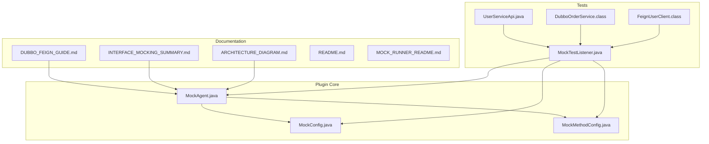
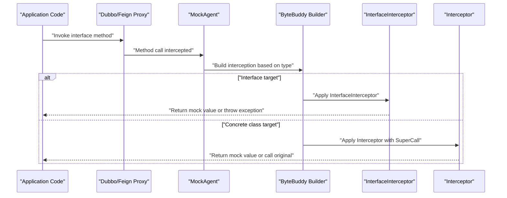
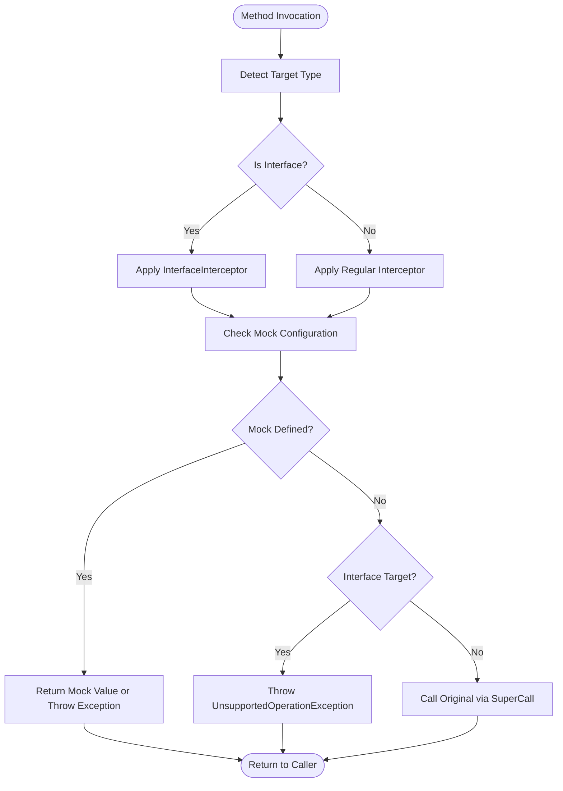
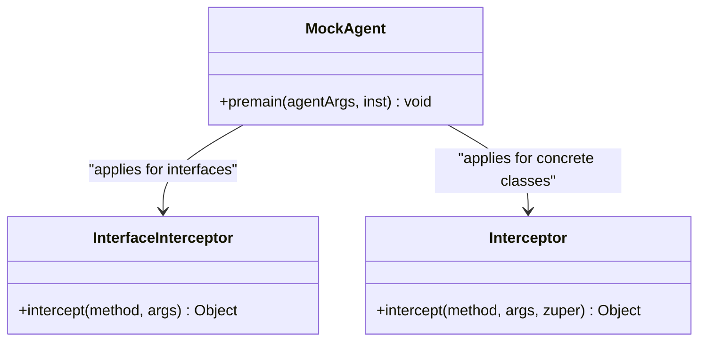
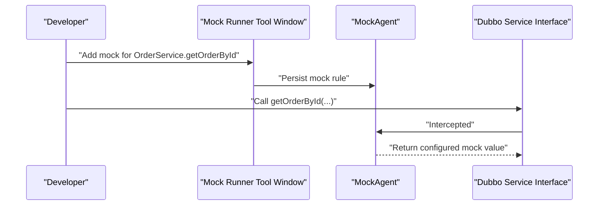
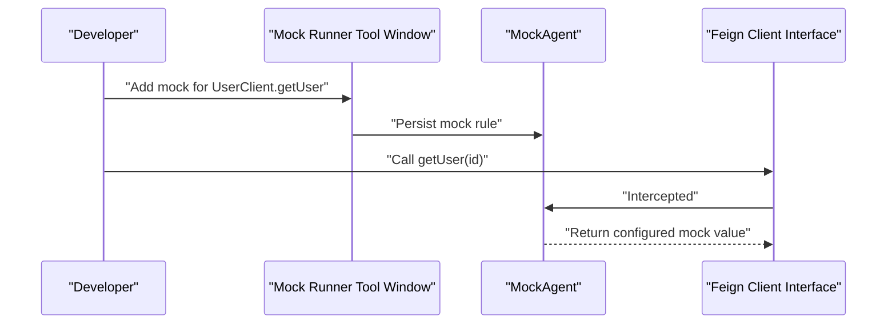
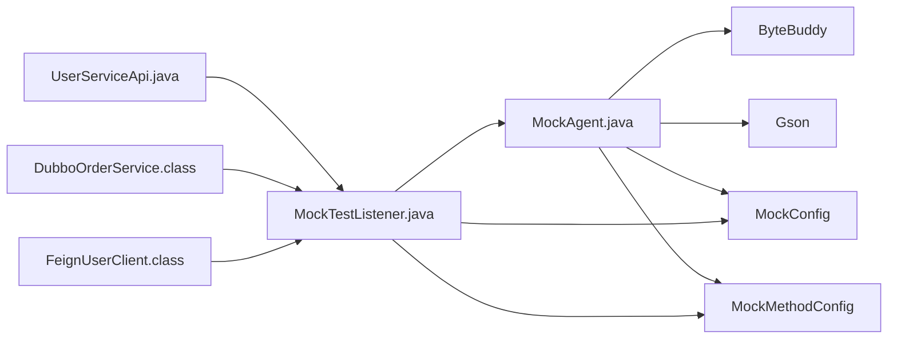

# Dubbo & Feign Integration

<cite>
**Referenced Files in This Document**
- [README.md](file://README.md)
- [MOCK_RUNNER_README.md](file://MOCK_RUNNER_README.md)
- [DUBBO_FEIGN_GUIDE.md](file://docs/DUBBO_FEIGN_GUIDE.md)
- [INTERFACE_MOCKING_SUMMARY.md](file://docs/INTERFACE_MOCKING_SUMMARY.md)
- [ARCHITECTURE_DIAGRAM.md](file://docs/ARCHITECTURE_DIAGRAM.md)
- [MockAgent.java](file://src/main/java/io/github/lancelothuxi/idea/plugin/mock/agent/MockAgent.java)
- [MockTestListener.java](file://src/test/java/test/MockTestListener.java)
- [UserServiceApi.java](file://src/test/java/test/UserServiceApi.java)
- [DubboOrderService.class](file://bin/test/test/dubbo/DubboOrderService.class)
- [FeignUserClient.class](file://bin/test/test/feign/FeignUserClient.class)
- [TEST_SUMMARY.md](file://docs/TEST_SUMMARY.md)
</cite>

## Table of Contents
1. [Introduction](#introduction)
2. [Project Structure](#project-structure)
3. [Core Components](#core-components)
4. [Architecture Overview](#architecture-overview)
5. [Detailed Component Analysis](#detailed-component-analysis)
6. [Dependency Analysis](#dependency-analysis)
7. [Performance Considerations](#performance-considerations)
8. [Troubleshooting Guide](#troubleshooting-guide)
9. [Conclusion](#conclusion)
10. [Appendices](#appendices)

## Introduction
This document explains how Mock Runner integrates with Dubbo and Feign interface-based RPC frameworks. These frameworks rely on interfaces and dynamic proxies at runtime, with no concrete implementation present in application code. Mock Runner supports this pattern by intelligently detecting interface methods and intercepting them directly using a specialized interceptor that does not require a fallback to a superclass implementation.

Key capabilities:
- Interface detection and interception for Dubbo and Feign clients
- Exception mocking for error scenario testing
- Zero-code-change operation during standard Run/Debug sessions
- Persistent configuration via the Mock Runner tool window

## Project Structure
The repository includes:
- Core plugin code under src/main/java/io/github/lancelothuxi/... with the Java Agent implementation
- Comprehensive documentation under docs/ covering architecture, usage, and troubleshooting
- Test artifacts under bin/test/ and src/test/ demonstrating Dubbo and Feign integration
- README files providing quick start, advanced features, and troubleshooting guidance

**Diagram sources**
- [MockAgent.java](file://src/main/java/io/github/lancelothuxi/idea/plugin/mock/agent/MockAgent.java#L23-L202)
- [DUBBO_FEIGN_GUIDE.md](file://docs/DUBBO_FEIGN_GUIDE.md#L1-L291)
- [INTERFACE_MOCKING_SUMMARY.md](file://docs/INTERFACE_MOCKING_SUMMARY.md#L1-L111)
- [ARCHITECTURE_DIAGRAM.md](file://docs/ARCHITECTURE_DIAGRAM.md#L1-L78)
- [MockTestListener.java](file://src/test/java/test/MockTestListener.java#L88-L109)
- [UserServiceApi.java](file://src/test/java/test/UserServiceApi.java#L1-L25)
- [DubboOrderService.class](file://bin/test/test/dubbo/DubboOrderService.class)
- [FeignUserClient.class](file://bin/test/test/feign/FeignUserClient.class)

**Section sources**
- [README.md](file://README.md#L1-L296)
- [MOCK_RUNNER_README.md](file://MOCK_RUNNER_README.md#L1-L192)

## Core Components
- MockAgent: The Java Agent that loads mock configurations, watches for updates, and applies ByteBuddy-based method interception. It selects the appropriate interceptor based on whether the target is an interface or a concrete class.
- InterfaceInterceptor: A specialized interceptor used for interfaces (Dubbo/Feign) that returns mock values or throws exceptions without attempting a fallback.
- MockConfig and MockMethodConfig: Data structures representing persistent mock rules and per-method configuration.
- Mock Runner Tool Window: UI for adding, editing, enabling/disabling, and organizing mock rules.

Key integration points:
- Interface detection using ByteBuddy’s type description
- Conditional interception using MethodDelegation
- Exception creation and fallback behavior

**Section sources**
- [MockAgent.java](file://src/main/java/io/github/lancelothuxi/idea/plugin/mock/agent/MockAgent.java#L23-L202)
- [MockAgent.java](file://src/main/java/io/github/lancelothuxi/idea/plugin/mock/agent/MockAgent.java#L124-L145)
- [INTERFACE_MOCKING_SUMMARY.md](file://docs/INTERFACE_MOCKING_SUMMARY.md#L24-L38)
- [DUBBO_FEIGN_GUIDE.md](file://docs/DUBBO_FEIGN_GUIDE.md#L211-L234)

## Architecture Overview
The integration leverages ByteBuddy to detect method targets and apply interceptors dynamically. For interfaces, Mock Runner uses InterfaceInterceptor; for concrete classes, it uses a regular Interceptor with a fallback capability.

**Diagram sources**
- [MockAgent.java](file://src/main/java/io/github/lancelothuxi/idea/plugin/mock/agent/MockAgent.java#L124-L145)
- [INTERFACE_MOCKING_SUMMARY.md](file://docs/INTERFACE_MOCKING_SUMMARY.md#L40-L59)
- [ARCHITECTURE_DIAGRAM.md](file://docs/ARCHITECTURE_DIAGRAM.md#L23-L77)

## Detailed Component Analysis

### Interface-Based Mocking Approach
- Pure interfaces (no implementation) are supported by detecting them at runtime and applying InterfaceInterceptor.
- InterfaceInterceptor returns a mock value or throws an exception if none is configured, avoiding the need for @SuperCall.
- For concrete classes, the regular Interceptor can optionally call the original implementation via @SuperCall.

**Diagram sources**
- [MockAgent.java](file://src/main/java/io/github/lancelothuxi/idea/plugin/mock/agent/MockAgent.java#L124-L145)
- [INTERFACE_MOCKING_SUMMARY.md](file://docs/INTERFACE_MOCKING_SUMMARY.md#L52-L59)
- [DUBBO_FEIGN_GUIDE.md](file://docs/DUBBO_FEIGN_GUIDE.md#L211-L234)

**Section sources**
- [INTERFACE_MOCKING_SUMMARY.md](file://docs/INTERFACE_MOCKING_SUMMARY.md#L24-L38)
- [DUBBO_FEIGN_GUIDE.md](file://docs/DUBBO_FEIGN_GUIDE.md#L14-L38)

### InterfaceInterceptor Mechanism
- Designed specifically for interfaces, it receives method metadata and arguments but does not accept a SuperCall parameter.
- Behavior:
  - If a mock is configured, it returns the configured mock value or throws the configured exception.
  - If no mock is configured, it throws an UnsupportedOperationException to signal that no fallback is available.

**Diagram sources**
- [MockAgent.java](file://src/main/java/io/github/lancelothuxi/idea/plugin/mock/agent/MockAgent.java#L124-L145)
- [INTERFACE_MOCKING_SUMMARY.md](file://docs/INTERFACE_MOCKING_SUMMARY.md#L52-L59)

**Section sources**
- [INTERFACE_MOCKING_SUMMARY.md](file://docs/INTERFACE_MOCKING_SUMMARY.md#L52-L59)
- [DUBBO_FEIGN_GUIDE.md](file://docs/DUBBO_FEIGN_GUIDE.md#L219-L226)

### Step-by-Step Integration Examples

#### Dubbo Service Interfaces
- Define a Dubbo interface annotated with the framework’s service annotation.
- Use the Mock Runner tool window to add mock rules for each method.
- Configure return values or exceptions as needed.
- Run your application normally; the agent injects interceptors automatically.

**Diagram sources**
- [DUBBO_FEIGN_GUIDE.md](file://docs/DUBBO_FEIGN_GUIDE.md#L41-L67)
- [MockAgent.java](file://src/main/java/io/github/lancelothuxi/idea/plugin/mock/agent/MockAgent.java#L124-L145)

**Section sources**
- [DUBBO_FEIGN_GUIDE.md](file://docs/DUBBO_FEIGN_GUIDE.md#L41-L67)

#### Feign Client Interfaces
- Define a Feign client interface with Spring Web annotations.
- Add mock rules in the Mock Runner tool window for each endpoint method.
- Configure JSON payloads aligned with the method’s return type.
- Run with standard Run/Debug; interceptors handle method calls transparently.

**Diagram sources**
- [DUBBO_FEIGN_GUIDE.md](file://docs/DUBBO_FEIGN_GUIDE.md#L68-L108)
- [MockAgent.java](file://src/main/java/io/github/lancelothuxi/idea/plugin/mock/agent/MockAgent.java#L124-L145)

**Section sources**
- [DUBBO_FEIGN_GUIDE.md](file://docs/DUBBO_FEIGN_GUIDE.md#L68-L108)

### Practical Use Cases
- Local development without remote services: Mock Dubbo inventory or order services to develop UI and workflows independently.
- Integration testing: Simulate Feign client responses for success, not-found, and error scenarios without hitting live APIs.
- Error handling testing: Configure exception mode to validate error paths and resilience logic.

**Section sources**
- [DUBBO_FEIGN_GUIDE.md](file://docs/DUBBO_FEIGN_GUIDE.md#L166-L210)

### JSON Configuration Patterns and Best Practices
- Align mock JSON with the method’s return type:
  - Object: Use a JSON object matching the DTO structure.
  - Array/List: Use a JSON array for collection-returning methods.
  - Primitives: Use primitive values directly.
- Keep configurations in version control for team consistency.
- Document each mock’s purpose and expected outcome.

**Section sources**
- [DUBBO_FEIGN_GUIDE.md](file://docs/DUBBO_FEIGN_GUIDE.md#L235-L241)

## Dependency Analysis
- MockAgent depends on ByteBuddy for runtime method interception and Gson for configuration parsing.
- The tool window persists MockConfig entries that the agent consumes at runtime.
- Tests demonstrate integration with both Dubbo and Feign by invoking interface methods and validating mock behavior.

**Diagram sources**
- [MockAgent.java](file://src/main/java/io/github/lancelothuxi/idea/plugin/mock/agent/MockAgent.java#L23-L202)
- [MockTestListener.java](file://src/test/java/test/MockTestListener.java#L88-L109)
- [UserServiceApi.java](file://src/test/java/test/UserServiceApi.java#L1-L25)
- [DubboOrderService.class](file://bin/test/test/dubbo/DubboOrderService.class)
- [FeignUserClient.class](file://bin/test/test/feign/FeignUserClient.class)

**Section sources**
- [MockAgent.java](file://src/main/java/io/github/lancelothuxi/idea/plugin/mock/agent/MockAgent.java#L23-L202)
- [TEST_SUMMARY.md](file://docs/TEST_SUMMARY.md#L226-L235)

## Performance Considerations
- Mock Runner operates via Java Agent and ByteBuddy, minimizing overhead by intercepting only configured methods.
- Configuration is loaded once and watched for changes, reducing repeated parsing costs.
- For large test suites, prefer targeted mock rules to avoid unnecessary interception checks.

[No sources needed since this section provides general guidance]

## Troubleshooting Guide
Common issues and resolutions:
- Mock not working:
  - Verify the mock is enabled in the tool window.
  - Ensure the method signature matches exactly, including package and parameter types.
  - Confirm interface detection by checking IDE logs for interface indicators.
- UnsupportedOperationException:
  - Occurs when an interface method is invoked without a configured mock.
  - Add a mock rule or configure exception mode in the tool window.
- ClassCastException:
  - Ensure mock JSON structure matches the method’s return type (object, array, or primitive).
- Agent not loading:
  - Confirm running with “Run with Mock” and check IDE logs for agent initialization messages.

**Section sources**
- [DUBBO_FEIGN_GUIDE.md](file://docs/DUBBO_FEIGN_GUIDE.md#L211-L234)
- [README.md](file://README.md#L214-L234)

## Conclusion
Mock Runner’s interface-based mocking enables seamless integration with Dubbo and Feign without requiring concrete implementations or code changes. By intelligently selecting the appropriate interceptor and supporting exception mocking, it facilitates local development, integration testing, and robust error handling validation.

[No sources needed since this section summarizes without analyzing specific files]

## Appendices

### Appendix A: Annotation-Based Configurations
- Dubbo service interfaces: Annotate with the framework’s service annotation and define method signatures.
- Feign client interfaces: Annotate with Feign client and Spring Web annotations; define HTTP endpoints and parameter bindings.

**Section sources**
- [DUBBO_FEIGN_GUIDE.md](file://docs/DUBBO_FEIGN_GUIDE.md#L41-L86)

### Appendix B: Test Artifacts and Examples
- InterfaceMockTest-like scenarios are demonstrated in the test suite with Dubbo and Feign client interfaces.
- MockTestListener shows how to programmatically add mock rules for Dubbo and Feign methods.

**Section sources**
- [MockTestListener.java](file://src/test/java/test/MockTestListener.java#L88-L109)
- [UserServiceApi.java](file://src/test/java/test/UserServiceApi.java#L1-L25)
- [DubboOrderService.class](file://bin/test/test/dubbo/DubboOrderService.class)
- [FeignUserClient.class](file://bin/test/test/feign/FeignUserClient.class)