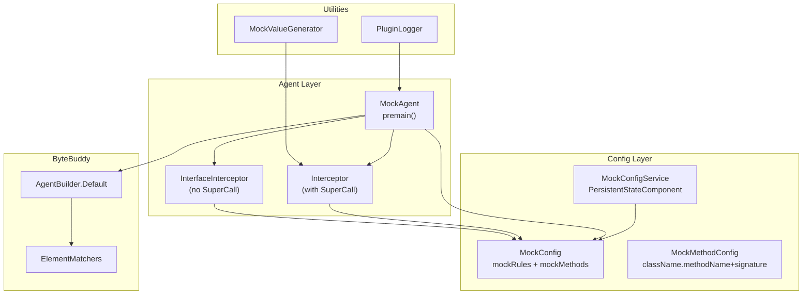
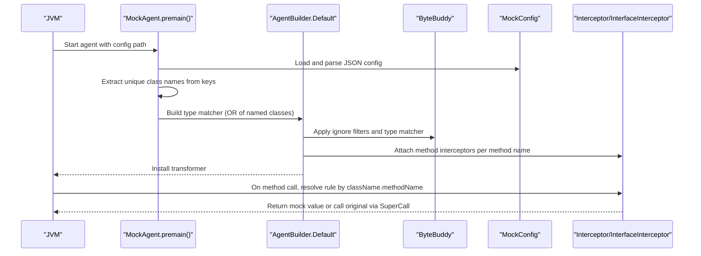
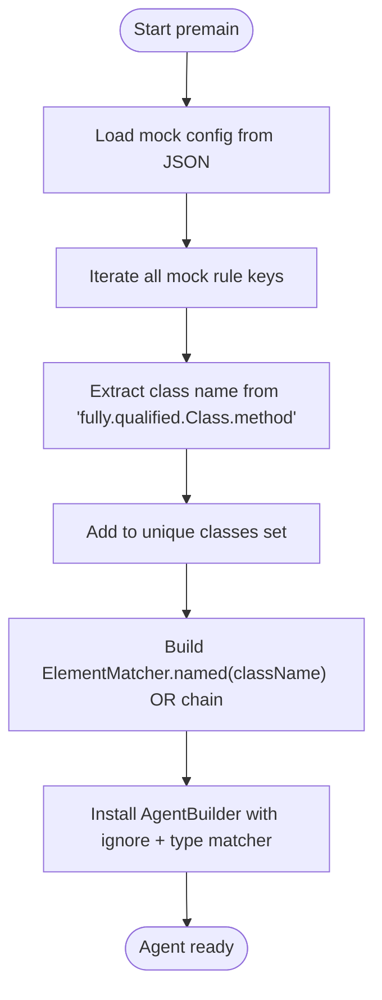
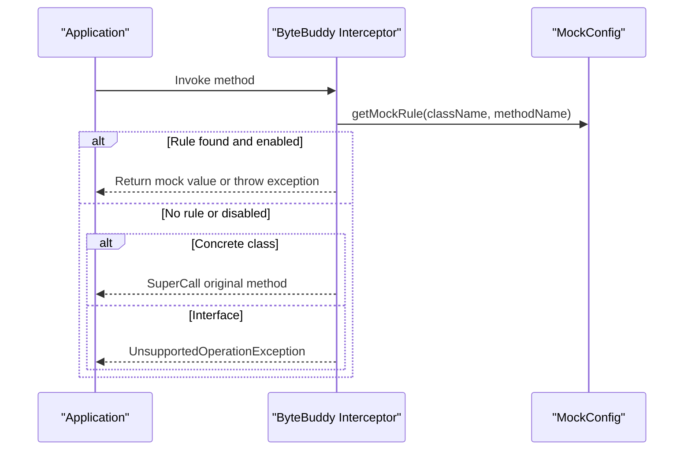
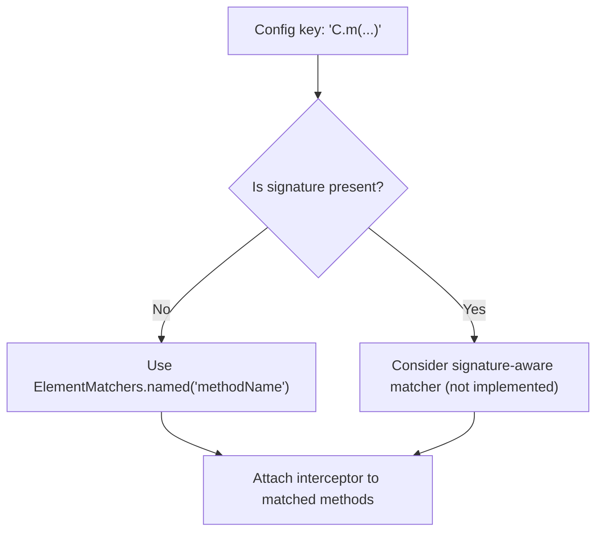
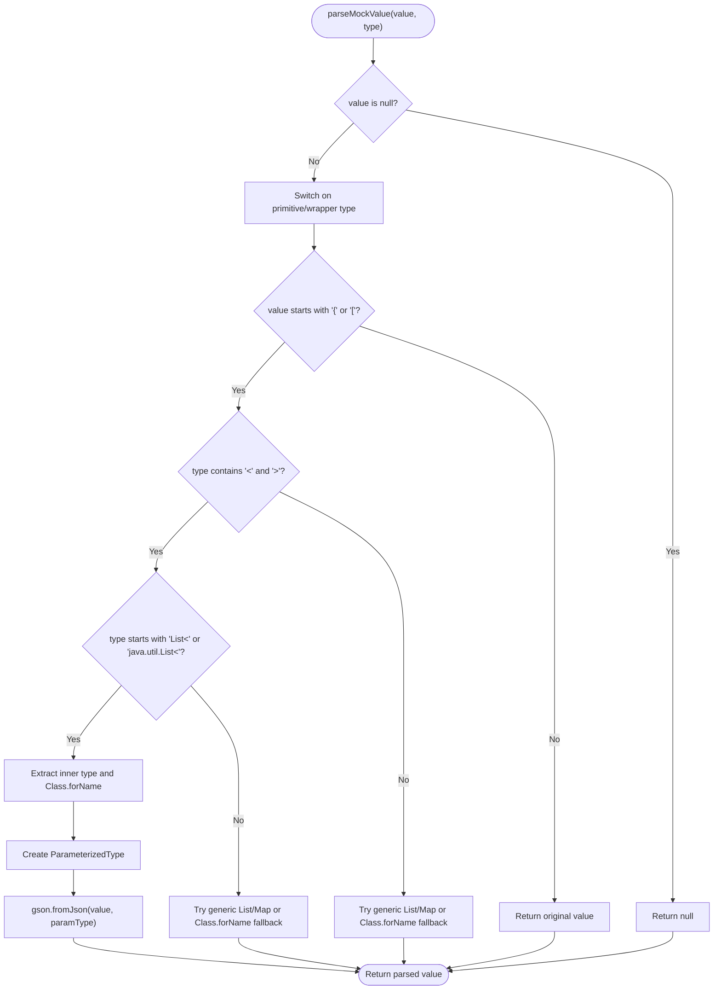
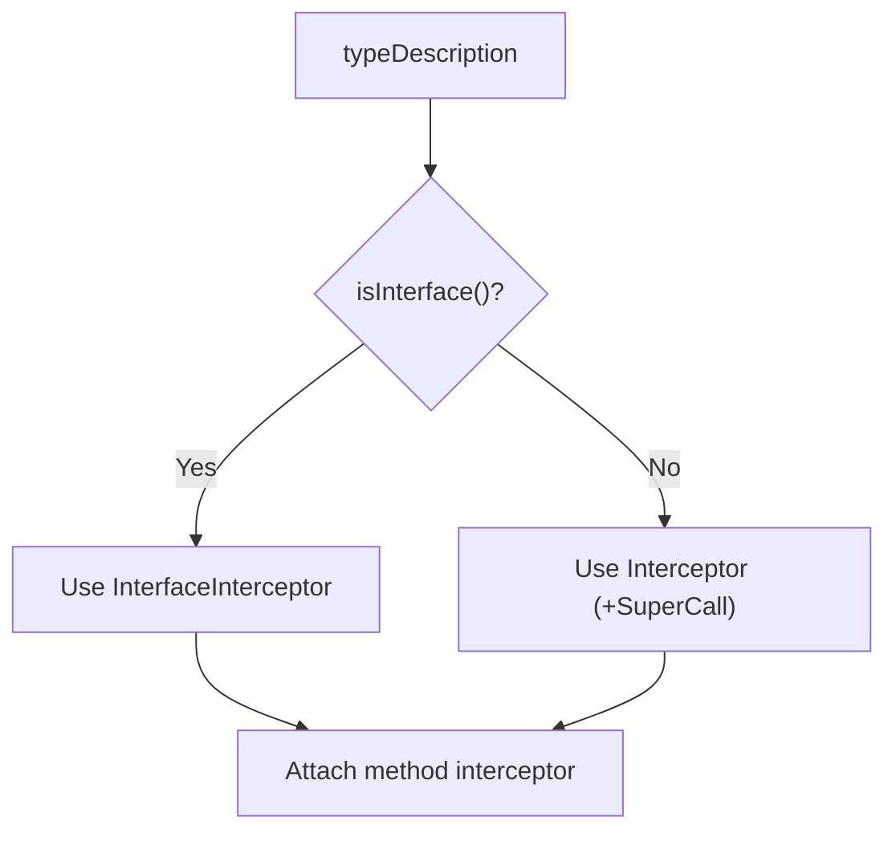
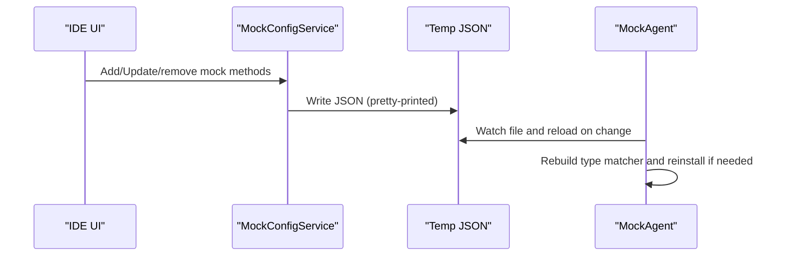
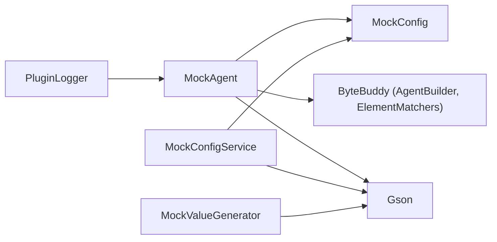
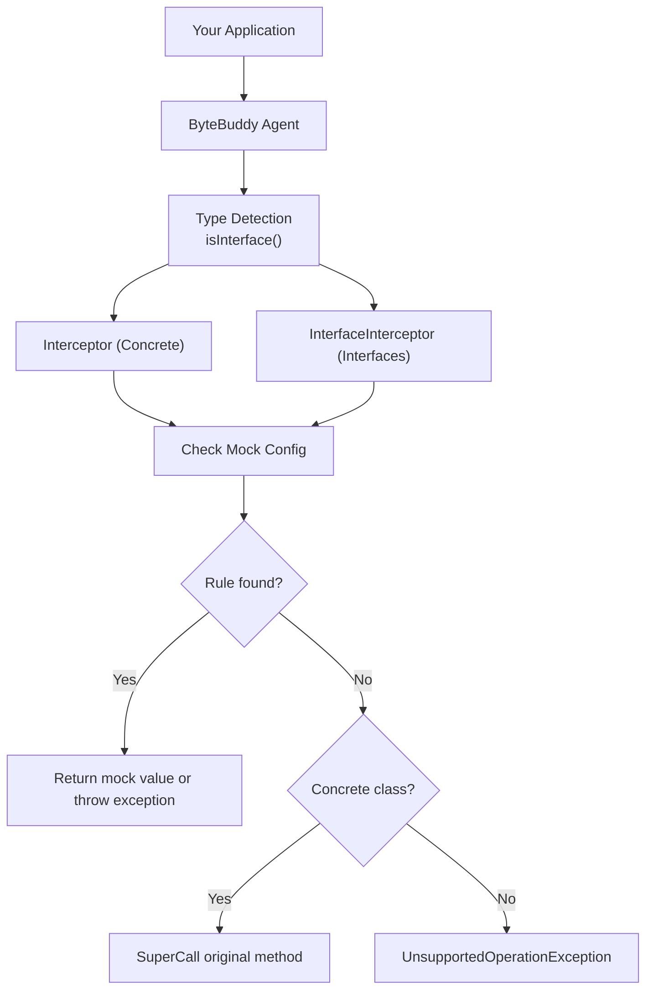

# Dynamic Class Matching Algorithms

<cite>
**Referenced Files in This Document**
- [MockAgent.java](file://src/main/java/io/github/lancelothuxi/idea/plugin/mock/agent/MockAgent.java)
- [MockConfig.java](file://src/main/java/io/github/lancelothuxi/idea/plugin/mock/mock/MockConfig.java)
- [MockMethodConfig.java](file://src/main/java/io/github/lancelothuxi/idea/plugin/mock/mock/MockMethodConfig.java)
- [MockConfigService.java](file://src/main/java/io/github/lancelothuxi/idea/plugin/mock/service/MockConfigService.java)
- [DYNAMIC_CLASS_MATCHING.md](file://docs/DYNAMIC_CLASS_MATCHING.md)
- [ARCHITECTURE_DIAGRAM.md](file://docs/ARCHITECTURE_DIAGRAM.md)
- [INTERFACE_MOCKING_SUMMARY.md](file://docs/INTERFACE_MOCKING_SUMMARY.md)
- [MockValueGenerator.java](file://src/main/java/io/github/lancelothuxi/idea/plugin/mock/util/MockValueGenerator.java)
- [PluginLogger.java](file://src/main/java/io/github/lancelothuxi/idea/plugin/mock/util/PluginLogger.java)
</cite>

## Table of Contents
1. [Introduction](#introduction)
2. [Project Structure](#project-structure)
3. [Core Components](#core-components)
4. [Architecture Overview](#architecture-overview)
5. [Detailed Component Analysis](#detailed-component-analysis)
6. [Dependency Analysis](#dependency-analysis)
7. [Performance Considerations](#performance-considerations)
8. [Troubleshooting Guide](#troubleshooting-guide)
9. [Conclusion](#conclusion)
10. [Appendices](#appendices)

## Introduction
This document explains Mock Runner’s dynamic class matching algorithms and method resolution strategies. It focuses on how the system identifies target classes and methods at runtime using ByteBuddy, how it builds efficient matchers from configuration, and how it resolves method targets during interception. It also covers matching criteria for method signatures, parameter types, and return types; strategies for handling generics, inheritance hierarchies, and method overloading; performance optimizations and caching; and practical troubleshooting techniques.

## Project Structure
The dynamic matching and interception logic centers around the agent and configuration model:
- The agent loads configuration, extracts targeted classes, builds a ByteBuddy type matcher, and installs transformations.
- The configuration model stores per-method rules keyed by fully qualified class and method names.
- A service persists and synchronizes configuration to a temporary JSON file for hot-reloading.
- Supporting utilities provide logging and value generation helpers.

**Diagram sources**
- [MockAgent.java](file://src/main/java/io/github/lancelothuxi/idea/plugin/mock/agent/MockAgent.java#L26-L145)
- [MockConfig.java](file://src/main/java/io/github/lancelothuxi/idea/plugin/mock/mock/MockConfig.java#L19-L86)
- [MockMethodConfig.java](file://src/main/java/io/github/lancelothuxi/idea/plugin/mock/mock/MockMethodConfig.java#L18-L93)
- [MockConfigService.java](file://src/main/java/io/github/lancelothuxi/idea/plugin/mock/service/MockConfigService.java#L41-L58)
- [MockValueGenerator.java](file://src/main/java/io/github/lancelothuxi/idea/plugin/mock/util/MockValueGenerator.java#L47-L80)
- [PluginLogger.java](file://src/main/java/io/github/lancelothuxi/idea/plugin/mock/util/PluginLogger.java#L10-L16)

**Section sources**
- [MockAgent.java](file://src/main/java/io/github/lancelothuxi/idea/plugin/mock/agent/MockAgent.java#L26-L145)
- [MockConfig.java](file://src/main/java/io/github/lancelothuxi/idea/plugin/mock/mock/MockConfig.java#L19-L86)
- [MockMethodConfig.java](file://src/main/java/io/github/lancelothuxi/idea/plugin/mock/mock/MockMethodConfig.java#L18-L93)
- [MockConfigService.java](file://src/main/java/io/github/lancelothuxi/idea/plugin/mock/service/MockConfigService.java#L41-L58)
- [DYNAMIC_CLASS_MATCHING.md](file://docs/DYNAMIC_CLASS_MATCHING.md#L1-L276)

## Core Components
- MockAgent: Loads configuration, extracts class names, constructs a ByteBuddy type matcher, and installs transformations. It selects between regular and interface interceptors based on whether the matched type is an interface.
- MockConfig: Stores per-method rules keyed by className.methodName and exposes lookup by class and method name. It can rebuild rules from persisted method configs.
- MockMethodConfig: Represents a single method configuration with optional signature, return type, and exception behavior.
- MockConfigService: Persists configuration to XML and writes a temporary JSON for hot-reloading by the agent.
- Utilities: PluginLogger centralizes logging; MockValueGenerator helps produce sample JSON for complex return types.

Key runtime interception behaviors:
- For interfaces, the agent uses InterfaceInterceptor (no SuperCall).
- For concrete classes, the agent uses Interceptor with SuperCall for fallback to original behavior.

**Section sources**
- [MockAgent.java](file://src/main/java/io/github/lancelothuxi/idea/plugin/mock/agent/MockAgent.java#L26-L145)
- [MockConfig.java](file://src/main/java/io/github/lancelothuxi/idea/plugin/mock/mock/MockConfig.java#L19-L86)
- [MockMethodConfig.java](file://src/main/java/io/github/lancelothuxi/idea/plugin/mock/mock/MockMethodConfig.java#L18-L93)
- [MockConfigService.java](file://src/main/java/io/github/lancelothuxi/idea/plugin/mock/service/MockConfigService.java#L41-L58)
- [INTERFACE_MOCKING_SUMMARY.md](file://docs/INTERFACE_MOCKING_SUMMARY.md#L24-L38)

## Architecture Overview
The system integrates configuration-driven class targeting with ByteBuddy’s transformation pipeline. At installation time, the agent:
- Reads configuration and enumerates unique classes requiring interception.
- Builds a disjunction of named matchers for those classes.
- Ignores framework classes and transforms only the selected types.
- Attaches method interceptors per configured method name.

**Diagram sources**
- [MockAgent.java](file://src/main/java/io/github/lancelothuxi/idea/plugin/mock/agent/MockAgent.java#L26-L145)
- [MockConfig.java](file://src/main/java/io/github/lancelothuxi/idea/plugin/mock/mock/MockConfig.java#L24-L27)
- [INTERFACE_MOCKING_SUMMARY.md](file://docs/INTERFACE_MOCKING_SUMMARY.md#L24-L38)

## Detailed Component Analysis

### Dynamic Class Matching Algorithm
The agent dynamically discovers classes to intercept by parsing the mock configuration keys. Each key encodes a fully qualified class and method name. The algorithm:
- Iterates all mock rules and extracts the class portion from the key.
- Collects unique class names and builds a ByteBuddy ElementMatcher that matches any of them.
- Installs the AgentBuilder with ignore filters and the constructed type matcher.

**Diagram sources**
- [MockAgent.java](file://src/main/java/io/github/lancelothuxi/idea/plugin/mock/agent/MockAgent.java#L62-L93)
- [DYNAMIC_CLASS_MATCHING.md](file://docs/DYNAMIC_CLASS_MATCHING.md#L25-L64)

**Section sources**
- [MockAgent.java](file://src/main/java/io/github/lancelothuxi/idea/plugin/mock/agent/MockAgent.java#L62-L93)
- [DYNAMIC_CLASS_MATCHING.md](file://docs/DYNAMIC_CLASS_MATCHING.md#L25-L64)

### Method Resolution Strategies
At runtime, when a method is invoked:
- The interceptor looks up a rule by className.methodName.
- If a rule exists and is enabled, it returns the configured mock value or throws an exception as configured.
- If no rule is found, concrete classes fall back to the original method via SuperCall; interface methods fail fast with an appropriate error.

**Diagram sources**
- [MockAgent.java](file://src/main/java/io/github/lancelothuxi/idea/plugin/mock/agent/MockAgent.java#L204-L244)
- [MockAgent.java](file://src/main/java/io/github/lancelothuxi/idea/plugin/mock/agent/MockAgent.java#L344-L398)
- [MockConfig.java](file://src/main/java/io/github/lancelothuxi/idea/plugin/mock/mock/MockConfig.java#L24-L27)

**Section sources**
- [MockAgent.java](file://src/main/java/io/github/lancelothuxi/idea/plugin/mock/agent/MockAgent.java#L204-L244)
- [MockAgent.java](file://src/main/java/io/github/lancelothuxi/idea/plugin/mock/agent/MockAgent.java#L344-L398)
- [MockConfig.java](file://src/main/java/io/github/lancelothuxi/idea/plugin/mock/mock/MockConfig.java#L24-L27)

### Matching Criteria and Overload Handling
- Current matching: The agent matches methods by exact name against the configuration key’s method segment. There is no explicit signature-based discrimination in the agent’s method selection.
- Signature awareness: The configuration model supports storing a signature for a method, but the agent’s method matcher uses ElementMatchers.named(methodName) and does not incorporate signature details at match time.
- Implication: Overloaded methods with the same name but different parameter types require distinct configuration entries keyed by different method names or by using a signature-aware mechanism if introduced.

**Diagram sources**
- [MockMethodConfig.java](file://src/main/java/io/github/lancelothuxi/idea/plugin/mock/mock/MockMethodConfig.java#L34-L40)
- [MockAgent.java](file://src/main/java/io/github/lancelothuxi/idea/plugin/mock/agent/MockAgent.java#L125-L134)

**Section sources**
- [MockMethodConfig.java](file://src/main/java/io/github/lancelothuxi/idea/plugin/mock/mock/MockMethodConfig.java#L34-L40)
- [MockAgent.java](file://src/main/java/io/github/lancelothuxi/idea/plugin/mock/agent/MockAgent.java#L125-L134)

### Generic Types and Return Type Resolution
The interceptor parses mock return values according to declared return types:
- Primitive wrappers and primitives are parsed directly.
- JSON values trigger Gson deserialization; for generic types like List<Inner>, it attempts to construct a ParameterizedType using the inner class and deserializes accordingly.
- Fallbacks handle missing classes or ambiguous cases by using generic collections or raw types.

**Diagram sources**
- [MockAgent.java](file://src/main/java/io/github/lancelothuxi/idea/plugin/mock/agent/MockAgent.java#L246-L326)

**Section sources**
- [MockAgent.java](file://src/main/java/io/github/lancelothuxi/idea/plugin/mock/agent/MockAgent.java#L246-L326)

### Inheritance Hierarchies and Interface Detection
- The agent detects whether a matched type is an interface and chooses the appropriate interceptor:
  - Concrete classes: Interceptor with SuperCall for fallback.
  - Interfaces: InterfaceInterceptor that must return a mock or throw an exception.
- This design ensures compatibility with proxy-based frameworks (e.g., Dubbo/Feign) that rely on interface contracts.

**Diagram sources**
- [MockAgent.java](file://src/main/java/io/github/lancelothuxi/idea/plugin/mock/agent/MockAgent.java#L112-L140)
- [INTERFACE_MOCKING_SUMMARY.md](file://docs/INTERFACE_MOCKING_SUMMARY.md#L24-L38)

**Section sources**
- [MockAgent.java](file://src/main/java/io/github/lancelothuxi/idea/plugin/mock/agent/MockAgent.java#L112-L140)
- [INTERFACE_MOCKING_SUMMARY.md](file://docs/INTERFACE_MOCKING_SUMMARY.md#L24-L38)

### Configuration Persistence and Hot Reloading
- The IDE service persists configuration to XML and periodically writes a temporary JSON file.
- The agent watches the JSON file and reloads configuration on change, keeping interception rules up-to-date without restarting the JVM.

**Diagram sources**
- [MockConfigService.java](file://src/main/java/io/github/lancelothuxi/idea/plugin/mock/service/MockConfigService.java#L41-L58)
- [MockAgent.java](file://src/main/java/io/github/lancelothuxi/idea/plugin/mock/agent/MockAgent.java#L174-L200)

**Section sources**
- [MockConfigService.java](file://src/main/java/io/github/lancelothuxi/idea/plugin/mock/service/MockConfigService.java#L41-L58)
- [MockAgent.java](file://src/main/java/io/github/lancelothuxi/idea/plugin/mock/agent/MockAgent.java#L174-L200)

## Dependency Analysis
- MockAgent depends on:
  - MockConfig for rule lookup.
  - ByteBuddy’s AgentBuilder and ElementMatchers for class/method targeting.
  - Gson for JSON parsing of mock values.
- MockConfigService depends on:
  - Gson for serialization/deserialization.
  - IntelliJ persistence APIs for state management.
- Utilities:
  - PluginLogger wraps IntelliJ logger.
  - MockValueGenerator assists with generating sample JSON for complex return types.

**Diagram sources**
- [MockAgent.java](file://src/main/java/io/github/lancelothuxi/idea/plugin/mock/agent/MockAgent.java#L1-L20)
- [MockConfig.java](file://src/main/java/io/github/lancelothuxi/idea/plugin/mock/mock/MockConfig.java#L1-L18)
- [MockConfigService.java](file://src/main/java/io/github/lancelothuxi/idea/plugin/mock/service/MockConfigService.java#L1-L16)
- [MockValueGenerator.java](file://src/main/java/io/github/lancelothuxi/idea/plugin/mock/util/MockValueGenerator.java#L1-L18)
- [PluginLogger.java](file://src/main/java/io/github/lancelothuxi/idea/plugin/mock/util/PluginLogger.java#L1-L18)

**Section sources**
- [MockAgent.java](file://src/main/java/io/github/lancelothuxi/idea/plugin/mock/agent/MockAgent.java#L1-L20)
- [MockConfig.java](file://src/main/java/io/github/lancelothuxi/idea/plugin/mock/mock/MockConfig.java#L1-L18)
- [MockConfigService.java](file://src/main/java/io/github/lancelothuxi/idea/plugin/mock/service/MockConfigService.java#L1-L16)
- [MockValueGenerator.java](file://src/main/java/io/github/lancelothuxi/idea/plugin/mock/util/MockValueGenerator.java#L1-L18)
- [PluginLogger.java](file://src/main/java/io/github/lancelothuxi/idea/plugin/mock/util/PluginLogger.java#L1-L18)

## Performance Considerations
- Targeted transformation: Only classes present in the configuration are transformed, minimizing overhead compared to scanning entire packages.
- Matcher construction: A disjunction of named matchers is built from unique class names, reducing repeated checks.
- Ignoring framework classes: ByteBuddy ignores known framework namespaces to avoid unnecessary instrumentation.
- Hot-reload efficiency: The agent watches a single JSON file and reloads configuration on change, avoiding full restarts.
- Logging: Extensive logging aids observability but can be tuned for production environments.

Optimization opportunities:
- Cache resolved ElementMatchers keyed by class name sets to avoid repeated matcher construction.
- Introduce signature-aware method matching to reduce redundant interceptors for overloaded methods.
- Add a small LRU cache for parsed return types and deserialized values to minimize repeated parsing.

**Section sources**
- [MockAgent.java](file://src/main/java/io/github/lancelothuxi/idea/plugin/mock/agent/MockAgent.java#L95-L111)
- [DYNAMIC_CLASS_MATCHING.md](file://docs/DYNAMIC_CLASS_MATCHING.md#L82-L90)

## Troubleshooting Guide
Common issues and resolutions:
- No classes to intercept:
  - Cause: Empty or missing mock rules.
  - Action: Verify configuration file path and content; ensure keys follow className.methodName format.
- No interception logged:
  - Cause: Class not included in configuration or ignored by ByteBuddy.
  - Action: Confirm class name extraction and that the class appears in “Classes to intercept” logs; check ignore filters.
- Interface method not mocked:
  - Cause: Interface methods require explicit mock configuration.
  - Action: Add a rule for the interface method; InterfaceInterceptor will enforce returning a mock or throwing an exception.
- Generic type parsing errors:
  - Cause: Inner type class not found or ambiguous JSON.
  - Action: Specify precise inner types (e.g., List<com.example.Inner>) and ensure the class is on the classpath.
- Exception creation failures:
  - Cause: Invalid exception class name or missing constructor.
  - Action: Use a subclass of Exception with a String constructor; the agent falls back to RuntimeException if needed.
- Hot reload not taking effect:
  - Cause: File watcher not triggered or permissions issue.
  - Action: Confirm the temp JSON path and that the agent thread is watching; check logs for reload events.

Debugging tips:
- Enable INFO logs to see the list of classes to intercept and interception events.
- Use the IDE tool window to verify active mock methods and their statuses.
- Temporarily simplify configuration to a single method to isolate issues.

**Section sources**
- [MockAgent.java](file://src/main/java/io/github/lancelothuxi/idea/plugin/mock/agent/MockAgent.java#L49-L58)
- [MockAgent.java](file://src/main/java/io/github/lancelothuxi/idea/plugin/mock/agent/MockAgent.java#L328-L338)
- [MockAgent.java](file://src/main/java/io/github/lancelothuxi/idea/plugin/mock/agent/MockAgent.java#L387-L397)
- [MockConfigService.java](file://src/main/java/io/github/lancelothuxi/idea/plugin/mock/service/MockConfigService.java#L41-L58)
- [PluginLogger.java](file://src/main/java/io/github/lancelothuxi/idea/plugin/mock/util/PluginLogger.java#L10-L16)

## Conclusion
Mock Runner’s dynamic class matching leverages configuration-driven discovery and ByteBuddy’s type matchers to efficiently target only the necessary classes. Method resolution relies on exact method name matching against configuration keys, with separate interceptors for interfaces and concrete classes. The system supports robust return type parsing, including generic collections, and provides hot-reload capabilities for rapid iteration. While current overload handling is name-based, future enhancements could introduce signature-aware matching and caching for improved performance and precision.

## Appendices

### Appendix A: Configuration Keys and Matching Semantics
- Keys: className.methodName
- Matching: ElementMatchers.named(methodName) per class; class names extracted from keys
- Overloading: Not currently discriminated by signature; consider adding signature-aware logic

**Section sources**
- [MockAgent.java](file://src/main/java/io/github/lancelothuxi/idea/plugin/mock/agent/MockAgent.java#L116-L136)
- [MockMethodConfig.java](file://src/main/java/io/github/lancelothuxi/idea/plugin/mock/mock/MockMethodConfig.java#L34-L40)

### Appendix B: Architecture Reference Diagram

**Diagram sources**
- [ARCHITECTURE_DIAGRAM.md](file://docs/ARCHITECTURE_DIAGRAM.md#L26-L66)