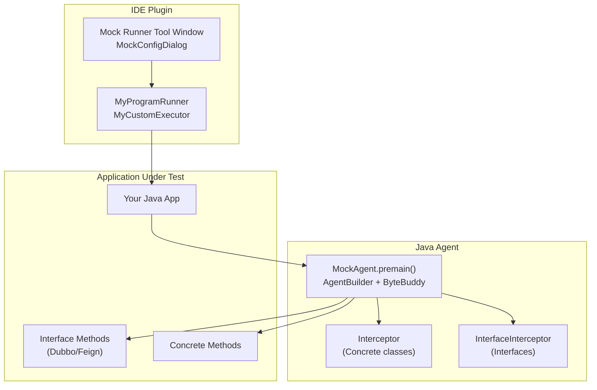
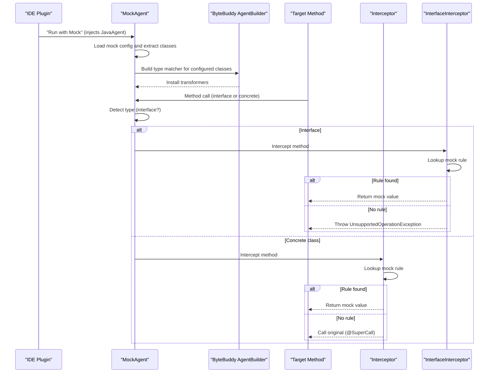
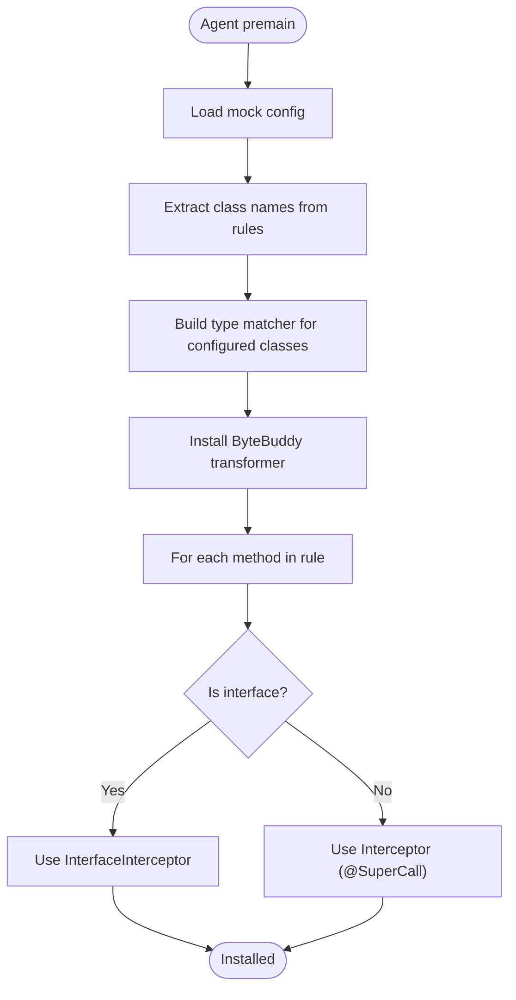
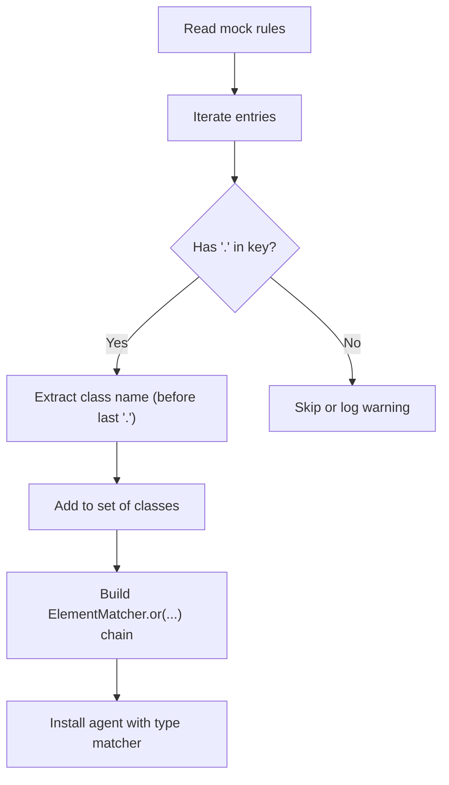
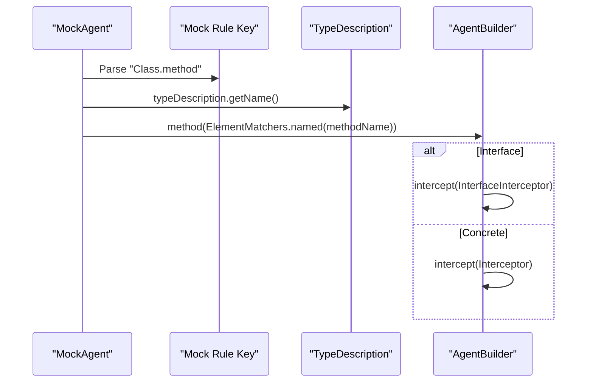
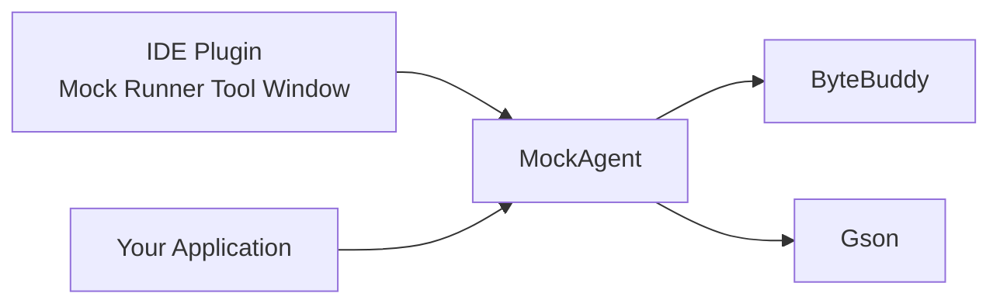
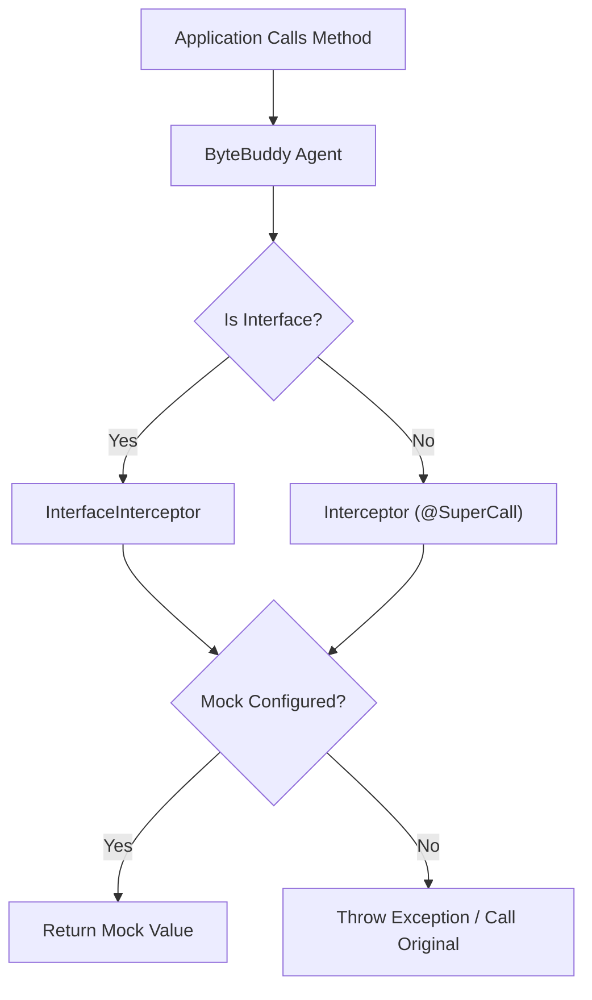

# Framework Integration

<cite>
**Referenced Files in This Document**
- [MockAgent.java](file://src/main/java/io/github/lancelothuxi/idea/plugin/mock/agent/MockAgent.java)
- [DUBBO_FEIGN_GUIDE.md](file://docs/DUBBO_FEIGN_GUIDE.md)
- [INTERFACE_MOCKING_SUMMARY.md](file://docs/INTERFACE_MOCKING_SUMMARY.md)
- [DYNAMIC_CLASS_MATCHING.md](file://docs/DYNAMIC_CLASS_MATCHING.md)
- [ARCHITECTURE_DIAGRAM.md](file://docs/ARCHITECTURE_DIAGRAM.md)
- [README.md](file://README.md)
- [MOCK_RUNNER_README.md](file://MOCK_RUNNER_README.md)
- [InterfaceMockTest.java](file://src/test/java/test/InterfaceMockTest.java)
- [MockTestListener.java](file://src/test/java/test/MockTestListener.java)
</cite>

## Table of Contents
1. [Introduction](#introduction)
2. [Project Structure](#project-structure)
3. [Core Components](#core-components)
4. [Architecture Overview](#architecture-overview)
5. [Detailed Component Analysis](#detailed-component-analysis)
6. [Dependency Analysis](#dependency-analysis)
7. [Performance Considerations](#performance-considerations)
8. [Troubleshooting Guide](#troubleshooting-guide)
9. [Conclusion](#conclusion)
10. [Appendices](#appendices)

## Introduction
This document explains Mock Runner’s framework integration capabilities with a focus on interface-based RPC frameworks such as Dubbo and Feign. It covers how the agent detects interfaces versus concrete classes, applies appropriate interceptors, resolves methods dynamically, and integrates with the IDE tool window to configure mocks at runtime. It also documents configuration requirements, common integration patterns, troubleshooting steps, and performance characteristics specific to framework integration.

## Project Structure
The framework integration spans several areas:
- Agent implementation that performs runtime interception and method resolution
- Documentation that explains Dubbo/Feign usage, configuration, and troubleshooting
- Test examples demonstrating interface mocking and framework-specific scenarios
- Architecture diagrams illustrating the interception flow

**Diagram sources**
- [MockAgent.java](file://src/main/java/io/github/lancelothuxi/idea/plugin/mock/agent/MockAgent.java#L26-L145)
- [README.md](file://README.md#L1-L296)

**Section sources**
- [README.md](file://README.md#L1-L296)
- [MOCK_RUNNER_README.md](file://MOCK_RUNNER_README.md#L1-L192)

## Core Components
- MockAgent: Loads configuration, builds a dynamic type matcher based on configured classes, installs ByteBuddy transformations, and selects either the regular Interceptor or InterfaceInterceptor depending on whether the target is an interface.
- Interceptor: Supports concrete classes, can return mocked values or delegate to the original implementation via @SuperCall.
- InterfaceInterceptor: Designed for interface methods (e.g., Dubbo/Feign), returns mocked values or throws exceptions when no mock is configured.
- Mock configuration: Stored per project and consumed by the agent at runtime.

Key integration behaviors:
- Interface detection via typeDescription.isInterface()
- Dynamic class matching from mock rules to minimize transformation scope
- Exception mode support for both interface and concrete methods
- Generic type parsing for complex return values

**Section sources**
- [MockAgent.java](file://src/main/java/io/github/lancelothuxi/idea/plugin/mock/agent/MockAgent.java#L26-L145)
- [MockAgent.java](file://src/main/java/io/github/lancelothuxi/idea/plugin/mock/agent/MockAgent.java#L202-L339)
- [MockAgent.java](file://src/main/java/io/github/lancelothuxi/idea/plugin/mock/agent/MockAgent.java#L344-L398)

## Architecture Overview
The agent uses ByteBuddy to instrument only the classes present in the mock configuration. At runtime, it decides which interceptor to apply based on whether the method belongs to an interface or a concrete class.

**Diagram sources**
- [MockAgent.java](file://src/main/java/io/github/lancelothuxi/idea/plugin/mock/agent/MockAgent.java#L112-L140)
- [MockAgent.java](file://src/main/java/io/github/lancelothuxi/idea/plugin/mock/agent/MockAgent.java#L202-L339)
- [MockAgent.java](file://src/main/java/io/github/lancelothuxi/idea/plugin/mock/agent/MockAgent.java#L344-L398)

## Detailed Component Analysis

### Interface Detection and Interceptor Selection
- The agent inspects each class targeted by mock rules and checks if it is an interface.
- For interfaces, it installs InterfaceInterceptor; for concrete classes, it installs Interceptor.
- This mechanism enables seamless mocking of Dubbo and Feign interfaces without requiring implementation classes.

**Diagram sources**
- [MockAgent.java](file://src/main/java/io/github/lancelothuxi/idea/plugin/mock/agent/MockAgent.java#L62-L93)
- [MockAgent.java](file://src/main/java/io/github/lancelothuxi/idea/plugin/mock/agent/MockAgent.java#L112-L140)

**Section sources**
- [MockAgent.java](file://src/main/java/io/github/lancelothuxi/idea/plugin/mock/agent/MockAgent.java#L112-L140)
- [INTERFACE_MOCKING_SUMMARY.md](file://docs/INTERFACE_MOCKING_SUMMARY.md#L24-L38)

### Dynamic Class Matching Algorithm
- The agent parses mock rule keys to extract class names and constructs a disjunction of ElementMatchers targeting only those classes.
- This avoids transforming unrelated classes and improves performance.
- The approach is resilient to arbitrary package structures and does not require hardcoded prefixes.

**Diagram sources**
- [MockAgent.java](file://src/main/java/io/github/lancelothuxi/idea/plugin/mock/agent/MockAgent.java#L62-L93)
- [DYNAMIC_CLASS_MATCHING.md](file://docs/DYNAMIC_CLASS_MATCHING.md#L32-L64)

**Section sources**
- [DYNAMIC_CLASS_MATCHING.md](file://docs/DYNAMIC_CLASS_MATCHING.md#L21-L64)
- [DYNAMIC_CLASS_MATCHING.md](file://docs/DYNAMIC_CLASS_MATCHING.md#L149-L184)

### Method Resolution Strategies
- Method-level matching is performed by matching the method name portion of the rule key against the intercepted method.
- For interface methods, the agent relies solely on configured mocks; for concrete methods, it can fall back to the original implementation via @SuperCall.

**Diagram sources**
- [MockAgent.java](file://src/main/java/io/github/lancelothuxi/idea/plugin/mock/agent/MockAgent.java#L116-L136)

**Section sources**
- [MockAgent.java](file://src/main/java/io/github/lancelothuxi/idea/plugin/mock/agent/MockAgent.java#L116-L136)

### Framework-Specific Integration Patterns

#### Dubbo Integration
- Interfaces annotated with service annotations are supported out of the box.
- The agent detects interfaces and applies InterfaceInterceptor, enabling mocking of remote service calls without running the actual service.

Integration steps:
- Define a Dubbo-style interface with method signatures.
- Configure mocks in the Mock Runner tool window for the interface methods.
- Run with “Run with Mock” to inject the agent and intercept calls.

Common patterns:
- Local development without remote services
- Integration testing with multiple response scenarios
- Error handling testing with exceptions

**Section sources**
- [DUBBO_FEIGN_GUIDE.md](file://docs/DUBBO_FEIGN_GUIDE.md#L41-L52)
- [DUBBO_FEIGN_GUIDE.md](file://docs/DUBBO_FEIGN_GUIDE.md#L166-L210)

#### Feign Integration
- Feign client interfaces are fully supported.
- The agent intercepts Feign-generated dynamic proxies and returns configured values or throws exceptions.

Integration steps:
- Define a Feign client interface with annotations.
- Configure mocks for each endpoint method.
- Use standard Run/Debug; the agent is injected automatically.

Common patterns:
- HTTP client stubbing
- Error simulation with framework-specific exceptions
- Complex payload mocking with JSON editor

**Section sources**
- [DUBBO_FEIGN_GUIDE.md](file://docs/DUBBO_FEIGN_GUIDE.md#L68-L86)
- [DUBBO_FEIGN_GUIDE.md](file://docs/DUBBO_FEIGN_GUIDE.md#L110-L123)

### Configuration Templates and Best Practices
- Use the Mock Runner tool window to add mocks for interface methods.
- Keep mock configurations in version control for team collaboration.
- Prefer realistic mock data structures aligned with production schemas.
- Test both success and failure modes using exception mode.

**Section sources**
- [DUBBO_FEIGN_GUIDE.md](file://docs/DUBBO_FEIGN_GUIDE.md#L235-L242)
- [README.md](file://README.md#L205-L213)

### Practical Examples
- InterfaceMockTest demonstrates creating a dynamic proxy (similar to Dubbo/Feign) and invoking interface methods that are intercepted by the agent.
- MockTestListener includes concrete examples of Dubbo and Feign mocks for multiple methods.

**Section sources**
- [InterfaceMockTest.java](file://src/test/java/test/InterfaceMockTest.java#L15-L75)
- [MockTestListener.java](file://src/test/java/test/MockTestListener.java#L88-L109)

## Dependency Analysis
The agent depends on ByteBuddy for instrumentation and Gson for JSON parsing. The IDE plugin manages configuration persistence and injection.

**Diagram sources**
- [MockAgent.java](file://src/main/java/io/github/lancelothuxi/idea/plugin/mock/agent/MockAgent.java#L1-L20)
- [README.md](file://README.md#L241-L247)

**Section sources**
- [MockAgent.java](file://src/main/java/io/github/lancelothuxi/idea/plugin/mock/agent/MockAgent.java#L1-L20)
- [README.md](file://README.md#L241-L247)

## Performance Considerations
- Dynamic class matching ensures ByteBuddy only instruments classes present in the mock configuration, reducing overhead compared to scanning entire packages.
- The agent ignores framework and JDK classes to avoid unnecessary transformations.
- Generic type parsing adds minimal overhead but enables accurate deserialization of complex return types.

Limitations:
- Final methods may be harder to intercept due to JVM optimizations.
- Excessive exception throwing during tests can impact throughput.

**Section sources**
- [DYNAMIC_CLASS_MATCHING.md](file://docs/DYNAMIC_CLASS_MATCHING.md#L82-L91)
- [MOCK_RUNNER_README.md](file://MOCK_RUNNER_README.md#L167-L173)

## Troubleshooting Guide
Common issues and resolutions:
- Mock not working: Verify the mock is enabled in the tool window, method signature matches exactly, and the agent is injected.
- UnsupportedOperationException for interface methods: Indicates no mock configured; add a mock in the tool window.
- ClassCastException: Ensure mock JSON matches the declared return type (objects, arrays, primitives).
- Agent not loading: Confirm the plugin is installed and “Run with Mock” is selected.

Logs to check:
- Agent initialization and rule loading messages
- “Classes to intercept” list
- “Intercepting … (interface: true/false)” entries

**Section sources**
- [DUBBO_FEIGN_GUIDE.md](file://docs/DUBBO_FEIGN_GUIDE.md#L211-L234)
- [README.md](file://README.md#L214-L234)
- [MockAgent.java](file://src/main/java/io/github/lancelothuxi/idea/plugin/mock/agent/MockAgent.java#L26-L58)

## Conclusion
Mock Runner provides robust, configuration-driven integration with interface-based frameworks like Dubbo and Feign. By intelligently detecting interfaces, dynamically matching classes, and applying the correct interceptor strategy, it enables seamless local development, integration testing, and error scenario validation without code changes. The documented patterns, templates, and troubleshooting steps help teams adopt and maintain effective mocking practices.

## Appendices

### Architecture Reference Diagram
This conceptual diagram summarizes the runtime interception flow for both interface and concrete methods.

**Diagram sources**
- [ARCHITECTURE_DIAGRAM.md](file://docs/ARCHITECTURE_DIAGRAM.md#L1-L78)