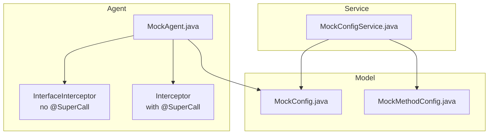
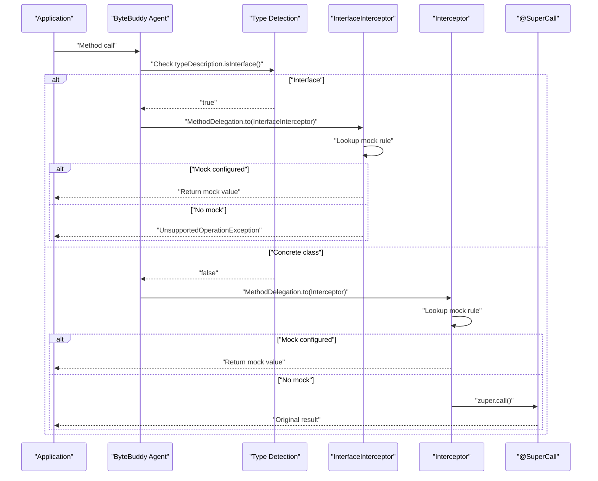
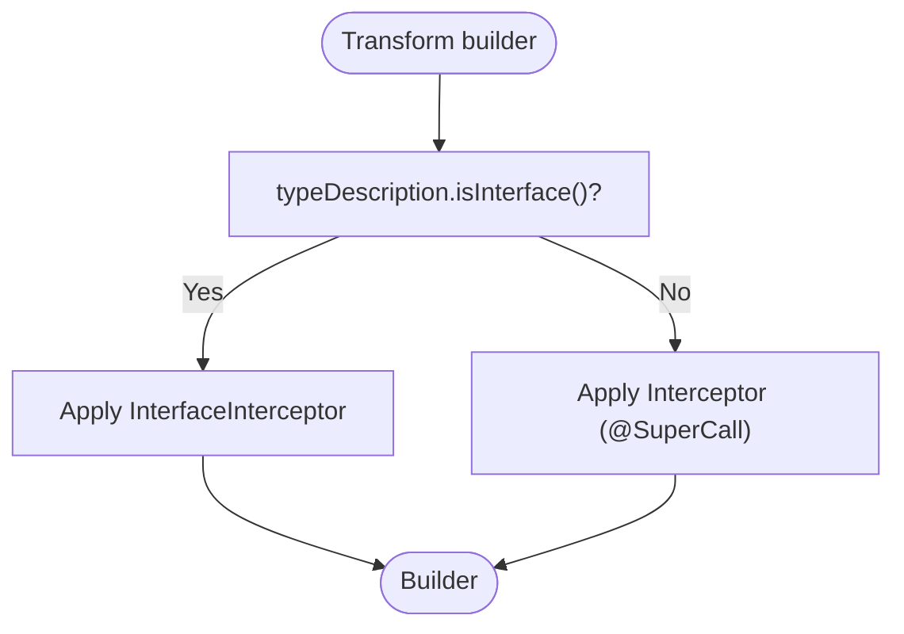
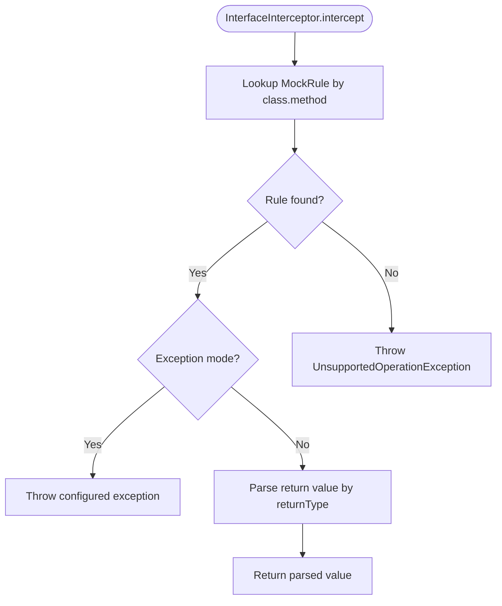
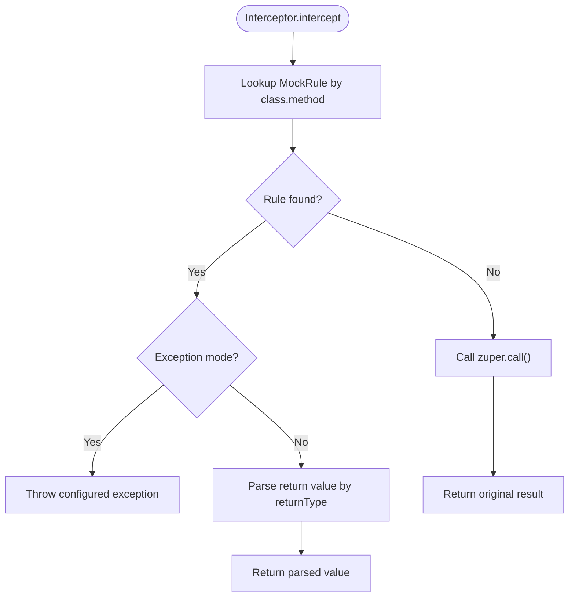
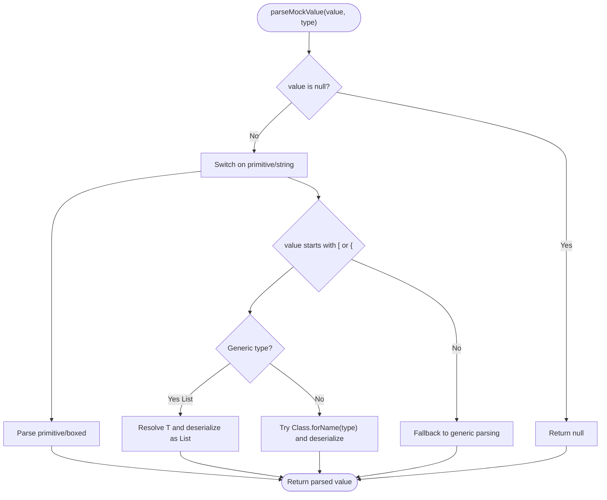
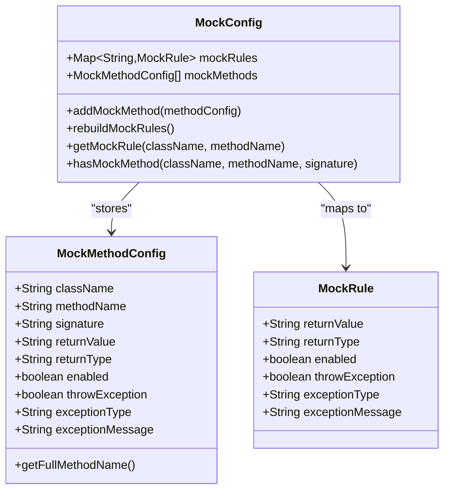
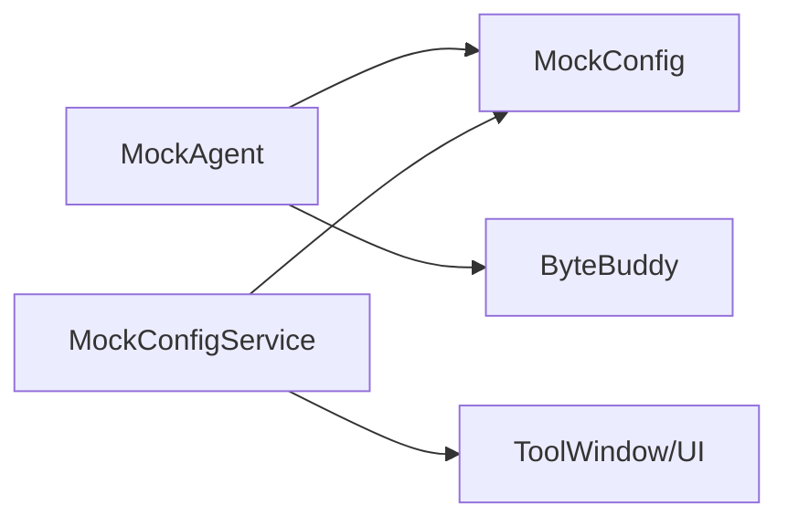

# Interface vs Concrete Class Mocking

<cite>
**Referenced Files in This Document**
- [MockAgent.java](file://src/main/java/io/github/lancelothuxi/idea/plugin/mock/agent/MockAgent.java)
- [MockConfig.java](file://src/main/java/io/github/lancelothuxi/idea/plugin/mock/mock/MockConfig.java)
- [MockMethodConfig.java](file://src/main/java/io/github/lancelothuxi/idea/plugin/mock/mock/MockMethodConfig.java)
- [MockConfigService.java](file://src/main/java/io/github/lancelothuxi/idea/plugin/mock/service/MockConfigService.java)
- [ARCHITECTURE_DIAGRAM.md](file://docs/ARCHITECTURE_DIAGRAM.md)
- [INTERFACE_MOCKING_SUMMARY.md](file://docs/INTERFACE_MOCKING_SUMMARY.md)
- [DYNAMIC_CLASS_MATCHING.md](file://docs/DYNAMIC_CLASS_MATCHING.md)
</cite>

## Table of Contents
1. [Introduction](#introduction)
2. [Project Structure](#project-structure)
3. [Core Components](#core-components)
4. [Architecture Overview](#architecture-overview)
5. [Detailed Component Analysis](#detailed-component-analysis)
6. [Dependency Analysis](#dependency-analysis)
7. [Performance Considerations](#performance-considerations)
8. [Troubleshooting Guide](#troubleshooting-guide)
9. [Conclusion](#conclusion)
10. [Appendices](#appendices)

## Introduction
This document compares two mocking strategies in Mock Runner: interface mocking and concrete class mocking. It explains how the agent detects whether a target is an interface or a concrete class, how interception differs between the two, and how method resolution and return value handling work. It also provides practical guidance on choosing between strategies, performance implications, limitations, and mixed scenarios.

## Project Structure
The relevant parts of the project for this comparison are:
- Agent-side interception logic and type detection
- Mock configuration model and rule storage
- Service layer that persists and exposes mock configuration to the UI

**Diagram sources**
- [MockAgent.java](file://src/main/java/io/github/lancelothuxi/idea/plugin/mock/agent/MockAgent.java#L114-L140)
- [MockConfig.java](file://src/main/java/io/github/lancelothuxi/idea/plugin/mock/mock/MockConfig.java#L1-L218)
- [MockMethodConfig.java](file://src/main/java/io/github/lancelothuxi/idea/plugin/mock/mock/MockMethodConfig.java#L1-L94)
- [MockConfigService.java](file://src/main/java/io/github/lancelothuxi/idea/plugin/mock/service/MockConfigService.java#L1-L197)

**Section sources**
- [MockAgent.java](file://src/main/java/io/github/lancelothuxi/idea/plugin/mock/agent/MockAgent.java#L1-L400)
- [MockConfig.java](file://src/main/java/io/github/lancelothuxi/idea/plugin/mock/mock/MockConfig.java#L1-L218)
- [MockMethodConfig.java](file://src/main/java/io/github/lancelothuxi/idea/plugin/mock/mock/MockMethodConfig.java#L1-L94)
- [MockConfigService.java](file://src/main/java/io/github/lancelothuxi/idea/plugin/mock/service/MockConfigService.java#L1-L197)

## Core Components
- MockAgent: Loads configuration, watches for updates, and installs ByteBuddy transformers. It distinguishes interfaces from concrete classes and applies different interceptors accordingly.
- Interceptor: For concrete classes, uses @SuperCall to delegate to the original method when no mock is configured, and parses return values according to configured types.
- InterfaceInterceptor: For interfaces, does not use @SuperCall and must return a mock value or throw an exception if no mock is configured.
- MockConfig and MockMethodConfig: Store mock rules keyed by class and method, including return types and exception modes.
- MockConfigService: Persists configuration to XML and a temporary JSON watched by the agent.

**Section sources**
- [MockAgent.java](file://src/main/java/io/github/lancelothuxi/idea/plugin/mock/agent/MockAgent.java#L114-L140)
- [MockAgent.java](file://src/main/java/io/github/lancelothuxi/idea/plugin/mock/agent/MockAgent.java#L202-L339)
- [MockAgent.java](file://src/main/java/io/github/lancelothuxi/idea/plugin/mock/agent/MockAgent.java#L344-L399)
- [MockConfig.java](file://src/main/java/io/github/lancelothuxi/idea/plugin/mock/mock/MockConfig.java#L1-L218)
- [MockMethodConfig.java](file://src/main/java/io/github/lancelothuxi/idea/plugin/mock/mock/MockMethodConfig.java#L1-L94)
- [MockConfigService.java](file://src/main/java/io/github/lancelothuxi/idea/plugin/mock/service/MockConfigService.java#L1-L197)

## Architecture Overview
The agent inspects the class type at transformation time and selects the appropriate interceptor:
- Interfaces: Use InterfaceInterceptor (no fallback to original implementation).
- Concrete classes: Use Interceptor (@SuperCall allows fallback to original method).

**Diagram sources**
- [MockAgent.java](file://src/main/java/io/github/lancelothuxi/idea/plugin/mock/agent/MockAgent.java#L114-L140)
- [MockAgent.java](file://src/main/java/io/github/lancelothuxi/idea/plugin/mock/agent/MockAgent.java#L344-L399)
- [MockAgent.java](file://src/main/java/io/github/lancelothuxi/idea/plugin/mock/agent/MockAgent.java#L202-L339)

## Detailed Component Analysis

### Type Detection and Interception Strategy
- Detection: The agent checks typeDescription.isInterface() during transformation to decide which interceptor to apply.
- Interface path: Uses InterfaceInterceptor, which does not attempt to call the original method.
- Concrete path: Uses Interceptor, which can fall back to the original via @SuperCall.

**Diagram sources**
- [MockAgent.java](file://src/main/java/io/github/lancelothuxi/idea/plugin/mock/agent/MockAgent.java#L114-L140)

**Section sources**
- [MockAgent.java](file://src/main/java/io/github/lancelothuxi/idea/plugin/mock/agent/MockAgent.java#L114-L140)
- [ARCHITECTURE_DIAGRAM.md](file://docs/ARCHITECTURE_DIAGRAM.md#L26-L38)

### InterfaceInterceptor Behavior
- Interception: No @SuperCall annotation; cannot call original method.
- Resolution: Looks up mock rule by class+method. If found, returns parsed mock value or throws configured exception. If not found, throws UnsupportedOperationException.
- Fallback: Not supported; absence of a mock rule leads to an explicit failure.

**Diagram sources**
- [MockAgent.java](file://src/main/java/io/github/lancelothuxi/idea/plugin/mock/agent/MockAgent.java#L344-L399)

**Section sources**
- [MockAgent.java](file://src/main/java/io/github/lancelothuxi/idea/plugin/mock/agent/MockAgent.java#L344-L399)
- [INTERFACE_MOCKING_SUMMARY.md](file://docs/INTERFACE_MOCKING_SUMMARY.md#L52-L59)

### Interceptor Behavior (Concrete Classes)
- Interception: Uses @SuperCall to capture the original method callable.
- Resolution: Same rule lookup. If mock configured, returns parsed value; otherwise calls zuper.call() to execute original method.
- Fallback: Guaranteed via @SuperCall when no mock is configured.

**Diagram sources**
- [MockAgent.java](file://src/main/java/io/github/lancelothuxi/idea/plugin/mock/agent/MockAgent.java#L202-L339)

**Section sources**
- [MockAgent.java](file://src/main/java/io/github/lancelothuxi/idea/plugin/mock/agent/MockAgent.java#L202-L339)

### Method Resolution and Return Type Handling
- Rule lookup: Keys are constructed from class name and method name. For concrete classes, the agent iterates configured rules and matches by class prefix.
- Return type parsing: The interceptor parses string-based mock values into the configured return type, including primitives, strings, and complex types (JSON). For generic types like List<InnerType>, it resolves the inner class and deserializes appropriately.
- Exception mode: When enabled, the interceptor throws a dynamically instantiated exception of the configured type.

**Diagram sources**
- [MockAgent.java](file://src/main/java/io/github/lancelothuxi/idea/plugin/mock/agent/MockAgent.java#L246-L326)

**Section sources**
- [MockAgent.java](file://src/main/java/io/github/lancelothuxi/idea/plugin/mock/agent/MockAgent.java#L246-L326)

### Configuration Model and Storage
- MockMethodConfig stores per-method configuration including class, method, signature, return value, return type, and exception settings.
- MockConfig maintains:
  - mockMethods: ordered list of method configs
  - mockRules: map keyed by class.method for agent consumption
  - rebuildMockRules synchronizes from mockMethods to mockRules, inferring return types when not provided
- MockConfigService persists configuration to XML and writes a temporary JSON file for the agent to watch.

**Diagram sources**
- [MockMethodConfig.java](file://src/main/java/io/github/lancelothuxi/idea/plugin/mock/mock/MockMethodConfig.java#L1-L94)
- [MockConfig.java](file://src/main/java/io/github/lancelothuxi/idea/plugin/mock/mock/MockConfig.java#L1-L218)

**Section sources**
- [MockMethodConfig.java](file://src/main/java/io/github/lancelothuxi/idea/plugin/mock/mock/MockMethodConfig.java#L1-L94)
- [MockConfig.java](file://src/main/java/io/github/lancelothuxi/idea/plugin/mock/mock/MockConfig.java#L1-L218)
- [MockConfigService.java](file://src/main/java/io/github/lancelothuxi/idea/plugin/mock/service/MockConfigService.java#L1-L197)

## Dependency Analysis
- MockAgent depends on:
  - MockConfig for rule retrieval and inference
  - ByteBuddy for type matching and delegation
- MockConfigService depends on:
  - MockConfig for persistence and synchronization
  - IntelliJ platform for UI refresh and tool window updates

**Diagram sources**
- [MockAgent.java](file://src/main/java/io/github/lancelothuxi/idea/plugin/mock/agent/MockAgent.java#L1-L400)
- [MockConfig.java](file://src/main/java/io/github/lancelothuxi/idea/plugin/mock/mock/MockConfig.java#L1-L218)
- [MockConfigService.java](file://src/main/java/io/github/lancelothuxi/idea/plugin/mock/service/MockConfigService.java#L1-L197)

**Section sources**
- [MockAgent.java](file://src/main/java/io/github/lancelothuxi/idea/plugin/mock/agent/MockAgent.java#L1-L400)
- [MockConfigService.java](file://src/main/java/io/github/lancelothuxi/idea/plugin/mock/service/MockConfigService.java#L1-L197)

## Performance Considerations
- Interface path avoids @SuperCall overhead and is slightly lighter for pure-interface targets.
- Concrete path adds minimal overhead via @SuperCall when no mock is present.
- JSON parsing and reflection-based type resolution occur only when a mock rule matches; otherwise, the concrete path still delegates minimally.
- The agent’s type matcher limits transformations to classes with configured rules, reducing unnecessary instrumentation.

[No sources needed since this section provides general guidance]

## Troubleshooting Guide
- Interface method without mock: Expect UnsupportedOperationException indicating no mock configured.
- Concrete method without mock: Should return the original method result via @SuperCall.
- Missing or misconfigured return type: Parsing may fall back to generic types; verify returnType in configuration.
- Agent not reloading config: Ensure the temporary JSON exists and is being watched; check logs for reload events.

**Section sources**
- [MockAgent.java](file://src/main/java/io/github/lancelothuxi/idea/plugin/mock/agent/MockAgent.java#L376-L379)
- [MockAgent.java](file://src/main/java/io/github/lancelothuxi/idea/plugin/mock/agent/MockAgent.java#L235-L238)
- [MockAgent.java](file://src/main/java/io/github/lancelothuxi/idea/plugin/mock/agent/MockAgent.java#L174-L200)

## Conclusion
- Choose interface mocking when targeting pure interfaces (e.g., RPC clients) where fallback to an original implementation is not applicable.
- Choose concrete class mocking when you need fallback behavior via @SuperCall and want to preserve original logic when no mock is configured.
- Mixed scenarios are supported: the agent applies the correct interceptor per class based on type detection, allowing both patterns to coexist.

[No sources needed since this section summarizes without analyzing specific files]

## Appendices

### Practical Guidance: When to Choose Each Approach
- Use interface mocking for:
  - Pure interfaces without implementation bodies (e.g., Feign, Dubbo proxies)
  - Scenarios where you intentionally avoid calling the original implementation
- Use concrete class mocking for:
  - Existing classes where you want to selectively override specific methods while preserving others via @SuperCall

**Section sources**
- [INTERFACE_MOCKING_SUMMARY.md](file://docs/INTERFACE_MOCKING_SUMMARY.md#L61-L79)
- [DYNAMIC_CLASS_MATCHING.md](file://docs/DYNAMIC_CLASS_MATCHING.md#L92-L147)

### Technical Notes: Parameter Matching and Return Type Handling
- Parameter matching: The agent matches by method name at transformation time; signature-specific matching is not implemented in the provided code.
- Return type handling: The interceptor parses values according to the configured return type, including primitives, strings, and complex JSON objects. For generics, it resolves inner types when possible.

**Section sources**
- [MockAgent.java](file://src/main/java/io/github/lancelothuxi/idea/plugin/mock/agent/MockAgent.java#L116-L136)
- [MockAgent.java](file://src/main/java/io/github/lancelothuxi/idea/plugin/mock/agent/MockAgent.java#L246-L326)