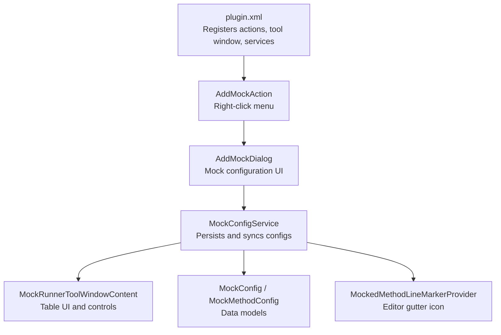
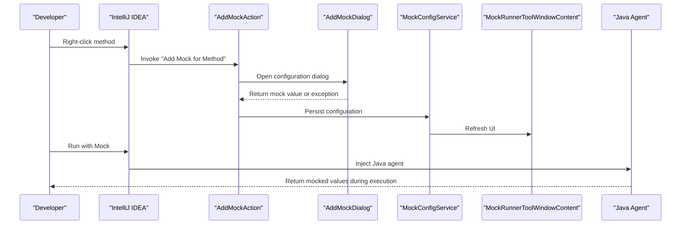
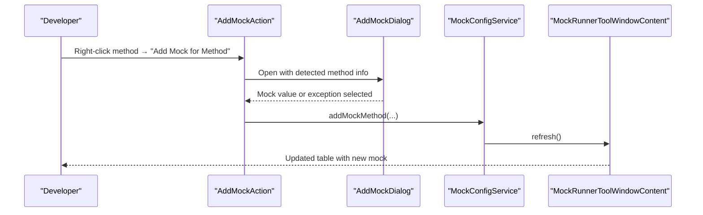
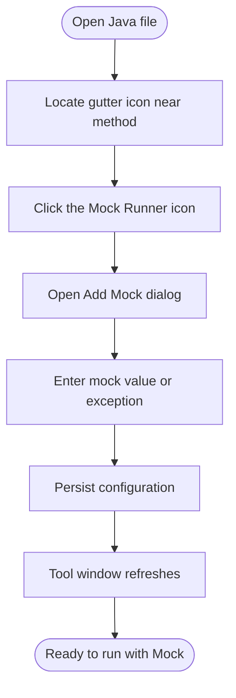
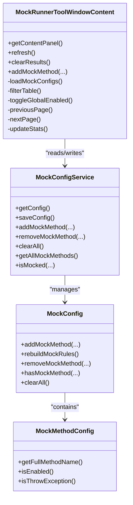
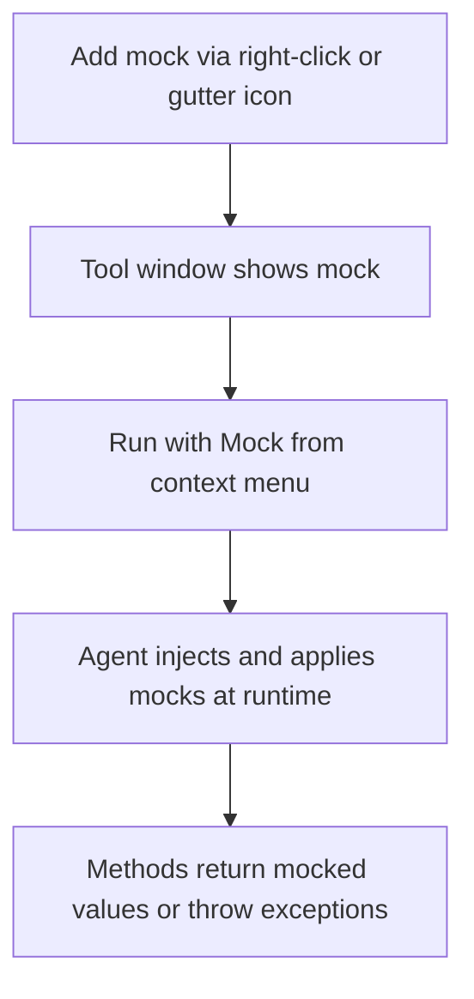
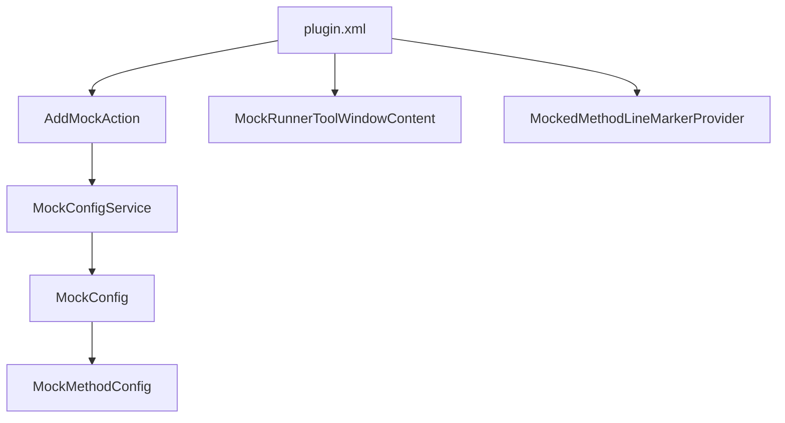

# Getting Started Guide

<cite>
**Referenced Files in This Document**
- [README.md](file://README.md)
- [MOCK_RUNNER_README.md](file://MOCK_RUNNER_README.md)
- [plugin.xml](file://src/main/resources/META-INF/plugin.xml)
- [AddMockAction.java](file://src/main/java/io/github/lancelothuxi/idea/plugin/mock/action/AddMockAction.java)
- [AddMockDialog.java](file://src/main/java/io/github/lancelothuxi/idea/plugin/mock/ui/AddMockDialog.java)
- [MockRunnerToolWindowContent.java](file://src/main/java/io/github/lancelothuxi/idea/plugin/mock/ui/MockRunnerToolWindowContent.java)
- [MockConfigService.java](file://src/main/java/io/github/lancelothuxi/idea/plugin/mock/service/MockConfigService.java)
- [MockedMethodLineMarkerProvider.java](file://src/main/java/io/github/lancelothuxi/idea/plugin/mock/marker/MockedMethodLineMarkerProvider.java)
- [MockConfig.java](file://src/main/java/io/github/lancelothuxi/idea/plugin/mock/mock/MockConfig.java)
- [MockMethodConfig.java](file://src/main/java/io/github/lancelothuxi/idea/plugin/mock/mock/MockMethodConfig.java)
- [TOOLWINDOW_GUIDE.md](file://docs/TOOLWINDOW_GUIDE.md)
- [MOCK_WORKFLOW_GUIDE.md](file://docs/MOCK_WORKFLOW_GUIDE.md)
</cite>

## Table of Contents
1. [Introduction](#introduction)
2. [Project Structure](#project-structure)
3. [Core Components](#core-components)
4. [Architecture Overview](#architecture-overview)
5. [Detailed Component Analysis](#detailed-component-analysis)
6. [Dependency Analysis](#dependency-analysis)
7. [Performance Considerations](#performance-considerations)
8. [Troubleshooting Guide](#troubleshooting-guide)
9. [Conclusion](#conclusion)
10. [Appendices](#appendices)

## Introduction
This guide helps you quickly install and use the Mock Runner plugin for IntelliJ IDEA. You will learn how to install the plugin from the IntelliJ Marketplace or manually, configure mock rules using three primary workflows (right-click method, gutter icon, and tool window), and run your application with mocked methods. Practical examples show before/after scenarios, and we explain the tool window interface, table operations, and basic configuration options. We also address common first-time user questions and provide troubleshooting tips.

## Project Structure
The plugin integrates with IntelliJ IDEA through actions, services, UI components, and a custom tool window. The key elements include:
- Plugin registration and extensions in plugin.xml
- Right-click action to add mock configurations
- Visual mock configuration dialog
- Tool window for managing mock configurations
- Service to persist and synchronize mock configurations
- Line marker provider to indicate mocked methods in the editor

**Diagram sources**
- [plugin.xml](file://src/main/resources/META-INF/plugin.xml#L25-L53)
- [AddMockAction.java](file://src/main/java/io/github/lancelothuxi/idea/plugin/mock/action/AddMockAction.java#L15-L106)
- [AddMockDialog.java](file://src/main/java/io/github/lancelothuxi/idea/plugin/mock/ui/AddMockDialog.java#L16-L184)
- [MockConfigService.java](file://src/main/java/io/github/lancelothuxi/idea/plugin/mock/service/MockConfigService.java#L23-L197)
- [MockRunnerToolWindowContent.java](file://src/main/java/io/github/lancelothuxi/idea/plugin/mock/ui/MockRunnerToolWindowContent.java#L22-L449)
- [MockedMethodLineMarkerProvider.java](file://src/main/java/io/github/lancelothuxi/idea/plugin/mock/marker/MockedMethodLineMarkerProvider.java#L19-L63)
- [MockConfig.java](file://src/main/java/io/github/lancelothuxi/idea/plugin/mock/mock/MockConfig.java#L12-L218)
- [MockMethodConfig.java](file://src/main/java/io/github/lancelothuxi/idea/plugin/mock/mock/MockMethodConfig.java#L5-L94)

**Section sources**
- [plugin.xml](file://src/main/resources/META-INF/plugin.xml#L1-L55)

## Core Components
- Right-click action: Adds mock configuration for the selected method.
- Mock configuration dialog: Provides JSON editor for return values and optional exception mode.
- Tool window: Centralized UI to manage, search, filter, paginate, and toggle mock configurations.
- Configuration service: Persists configurations per project and synchronizes with the agent.
- Line marker provider: Displays a gutter icon for mocked methods.

**Section sources**
- [AddMockAction.java](file://src/main/java/io/github/lancelothuxi/idea/plugin/mock/action/AddMockAction.java#L15-L106)
- [AddMockDialog.java](file://src/main/java/io/github/lancelothuxi/idea/plugin/mock/ui/AddMockDialog.java#L16-L184)
- [MockRunnerToolWindowContent.java](file://src/main/java/io/github/lancelothuxi/idea/plugin/mock/ui/MockRunnerToolWindowContent.java#L22-L449)
- [MockConfigService.java](file://src/main/java/io/github/lancelothuxi/idea/plugin/mock/service/MockConfigService.java#L23-L197)
- [MockedMethodLineMarkerProvider.java](file://src/main/java/io/github/lancelothuxi/idea/plugin/mock/marker/MockedMethodLineMarkerProvider.java#L19-L63)

## Architecture Overview
The plugin enables runtime method mocking without changing source code. It uses a Java agent to intercept method calls during execution and returns configured values or throws exceptions. The workflow spans UI actions, configuration persistence, and agent injection.

**Diagram sources**
- [AddMockAction.java](file://src/main/java/io/github/lancelothuxi/idea/plugin/mock/action/AddMockAction.java#L21-L82)
- [AddMockDialog.java](file://src/main/java/io/github/lancelothuxi/idea/plugin/mock/ui/AddMockDialog.java#L29-L82)
- [MockConfigService.java](file://src/main/java/io/github/lancelothuxi/idea/plugin/mock/service/MockConfigService.java#L109-L151)
- [MockRunnerToolWindowContent.java](file://src/main/java/io/github/lancelothuxi/idea/plugin/mock/ui/MockRunnerToolWindowContent.java#L166-L171)

## Detailed Component Analysis

### Installation
- From IntelliJ Marketplace (recommended):
  1. Open IntelliJ IDEA.
  2. Go to Settings/Preferences → Plugins.
  3. Search for "Mock Runner".
  4. Click Install.
  5. Restart IDE.
- Manual installation:
  1. Download the latest release from GitHub Releases.
  2. Open IntelliJ IDEA.
  3. Go to Settings/Preferences → Plugins → ⚙️ → Install Plugin from Disk...
  4. Select the downloaded zip file.
  5. Restart IDE.

After installation, the plugin registers:
- A right-click action to add mock configurations.
- A tool window named "Mock Runner".
- A line marker to indicate mocked methods in the editor.

**Section sources**
- [README.md](file://README.md#L21-L38)
- [plugin.xml](file://src/main/resources/META-INF/plugin.xml#L45-L53)

### Right-click Method Mocking
Workflow:
1. Open a Java file.
2. Right-click on any method.
3. Select "Add Mock for Method".
4. Configure the mock return value or choose exception mode.
5. Click OK.

What happens:
- The action detects the method signature and return type.
- A dialog opens with a JSON editor for return values and optional exception configuration.
- The configuration is persisted and the tool window updates.

**Diagram sources**
- [AddMockAction.java](file://src/main/java/io/github/lancelothuxi/idea/plugin/mock/action/AddMockAction.java#L21-L82)
- [AddMockDialog.java](file://src/main/java/io/github/lancelothuxi/idea/plugin/mock/ui/AddMockDialog.java#L29-L82)
- [MockConfigService.java](file://src/main/java/io/github/lancelothuxi/idea/plugin/mock/service/MockConfigService.java#L109-L151)
- [MockRunnerToolWindowContent.java](file://src/main/java/io/github/lancelothuxi/idea/plugin/mock/ui/MockRunnerToolWindowContent.java#L166-L171)

**Section sources**
- [AddMockAction.java](file://src/main/java/io/github/lancelothuxi/idea/plugin/mock/action/AddMockAction.java#L15-L106)
- [AddMockDialog.java](file://src/main/java/io/github/lancelothuxi/idea/plugin/mock/ui/AddMockDialog.java#L16-L184)
- [README.md](file://README.md#L39-L84)

### Gutter Icon Usage
- Look for the Mock Runner icon in the editor’s gutter next to methods.
- Click the icon to add mock configuration for that method.
- The tool window updates automatically.

**Diagram sources**
- [MockedMethodLineMarkerProvider.java](file://src/main/java/io/github/lancelothuxi/idea/plugin/mock/marker/MockedMethodLineMarkerProvider.java#L40-L58)
- [AddMockDialog.java](file://src/main/java/io/github/lancelothuxi/idea/plugin/mock/ui/AddMockDialog.java#L29-L82)
- [MockConfigService.java](file://src/main/java/io/github/lancelothuxi/idea/plugin/mock/service/MockConfigService.java#L109-L151)

**Section sources**
- [MockedMethodLineMarkerProvider.java](file://src/main/java/io/github/lancelothuxi/idea/plugin/mock/marker/MockedMethodLineMarkerProvider.java#L19-L63)
- [README.md](file://README.md#L50-L53)

### Tool Window Management
The "Mock Runner" tool window provides:
- Search/filter by class or method name.
- Enable/disable individual mocks.
- Edit values inline using a JSON editor.
- Delete or clear all configurations.
- Toggle between Return Value and Exception modes.
- Pagination for large lists (20 items per page).
- Global toggle to enable/disable all mocks.
- Statistics display: total and enabled counts.

**Diagram sources**
- [MockRunnerToolWindowContent.java](file://src/main/java/io/github/lancelothuxi/idea/plugin/mock/ui/MockRunnerToolWindowContent.java#L22-L449)
- [MockConfigService.java](file://src/main/java/io/github/lancelothuxi/idea/plugin/mock/service/MockConfigService.java#L23-L197)
- [MockConfig.java](file://src/main/java/io/github/lancelothuxi/idea/plugin/mock/mock/MockConfig.java#L12-L218)
- [MockMethodConfig.java](file://src/main/java/io/github/lancelothuxi/idea/plugin/mock/mock/MockMethodConfig.java#L5-L94)

**Section sources**
- [MockRunnerToolWindowContent.java](file://src/main/java/io/github/lancelothuxi/idea/plugin/mock/ui/MockRunnerToolWindowContent.java#L22-L449)
- [README.md](file://README.md#L148-L173)
- [TOOLWINDOW_GUIDE.md](file://docs/TOOLWINDOW_GUIDE.md#L26-L91)

### Quick Start Workflow
Step-by-step from adding mock configurations to running with mocked methods:
1. Add mock configuration:
   - Right-click method → "Add Mock for Method" → configure return value or exception → OK.
   - Or click the gutter icon → configure → OK.
2. Verify in the tool window:
   - Open the "Mock Runner" tool window (right sidebar).
   - Confirm your mock appears and is enabled.
3. Run with Mock:
   - Right-click your main class or test.
   - Choose "Run with Mock" or "Debug with Mock".
4. Observe results:
   - The application runs with mocked methods returning configured values or throwing exceptions.

**Diagram sources**
- [AddMockAction.java](file://src/main/java/io/github/lancelothuxi/idea/plugin/mock/action/AddMockAction.java#L21-L82)
- [MockRunnerToolWindowContent.java](file://src/main/java/io/github/lancelothuxi/idea/plugin/mock/ui/MockRunnerToolWindowContent.java#L166-L171)
- [README.md](file://README.md#L78-L84)

**Section sources**
- [README.md](file://README.md#L39-L84)
- [MOCK_WORKFLOW_GUIDE.md](file://docs/MOCK_WORKFLOW_GUIDE.md#L11-L57)

### Practical Examples: Before/After Scenarios
- Example 1: Mock a simple method returning an integer
  - Before: Method returns the actual computed value.
  - After: Method returns the configured mock value.
- Example 2: Mock a method returning a complex object
  - Before: Method returns a real object from a database or service.
  - After: Method returns the configured JSON object.
- Example 3: Mock a method to throw an exception
  - Before: Method executes normally.
  - After: Method throws the configured exception during execution.

These examples illustrate how the tool window displays and manages mocks, and how the agent applies them at runtime.

**Section sources**
- [README.md](file://README.md#L86-L147)
- [MOCK_RUNNER_README.md](file://MOCK_RUNNER_README.md#L81-L104)

## Dependency Analysis
The plugin relies on IntelliJ Platform SDK components and Gson for serialization. The tool window and actions are registered in plugin.xml, while services and UI components handle configuration persistence and display.

**Diagram sources**
- [plugin.xml](file://src/main/resources/META-INF/plugin.xml#L25-L53)
- [AddMockAction.java](file://src/main/java/io/github/lancelothuxi/idea/plugin/mock/action/AddMockAction.java#L15-L106)
- [MockRunnerToolWindowContent.java](file://src/main/java/io/github/lancelothuxi/idea/plugin/mock/ui/MockRunnerToolWindowContent.java#L22-L449)
- [MockedMethodLineMarkerProvider.java](file://src/main/java/io/github/lancelothuxi/idea/plugin/mock/marker/MockedMethodLineMarkerProvider.java#L19-L63)
- [MockConfigService.java](file://src/main/java/io/github/lancelothuxi/idea/plugin/mock/service/MockConfigService.java#L23-L197)
- [MockConfig.java](file://src/main/java/io/github/lancelothuxi/idea/plugin/mock/mock/MockConfig.java#L12-L218)
- [MockMethodConfig.java](file://src/main/java/io/github/lancelothuxi/idea/plugin/mock/mock/MockMethodConfig.java#L5-L94)

**Section sources**
- [plugin.xml](file://src/main/resources/META-INF/plugin.xml#L1-L55)
- [MockConfigService.java](file://src/main/java/io/github/lancelothuxi/idea/plugin/mock/service/MockConfigService.java#L19-L35)

## Performance Considerations
- The tool window supports pagination to handle large numbers of mock configurations efficiently.
- Filtering and sorting are applied client-side for responsiveness.
- Saving configurations writes to a temporary JSON file for agent consumption.

[No sources needed since this section provides general guidance]

## Troubleshooting Guide
Common first-time user questions and fixes:
- Mock not working:
  - Ensure the mock is enabled in the tool window.
  - Verify the method signature matches exactly.
  - Confirm the return type is correctly specified.
  - Review IDE logs for errors.
- ClassCastException with generics:
  - Ensure you are using the latest plugin version.
  - Verify the return type in the configuration matches the method signature.
- Agent not loading:
  - Verify the plugin is installed correctly.
  - Try restarting the IDE.
  - Ensure you are using "Run with Mock" and not the regular run option.
- Cannot mock void methods:
  - The plugin only supports methods with return values.

**Section sources**
- [README.md](file://README.md#L214-L234)
- [MOCK_RUNNER_README.md](file://MOCK_RUNNER_README.md#L174-L186)

## Conclusion
You now have the essentials to install the Mock Runner plugin, add mock configurations via right-click or gutter icons, manage them in the tool window, and run your application with mocked methods. Use the troubleshooting tips to resolve common issues and refer to the examples for before/after scenarios. Explore advanced features like exception mocking and JSON editing as you become more comfortable.

[No sources needed since this section summarizes without analyzing specific files]

## Appendices

### Installation Steps Recap
- Marketplace installation:
  1. Open IntelliJ IDEA.
  2. Go to Settings/Preferences → Plugins.
  3. Search for "Mock Runner".
  4. Click Install.
  5. Restart IDE.
- Manual installation:
  1. Download the latest release from GitHub Releases.
  2. Open IntelliJ IDEA.
  3. Go to Settings/Preferences → Plugins → ⚙️ → Install Plugin from Disk...
  4. Select the downloaded zip file.
  5. Restart IDE.

**Section sources**
- [README.md](file://README.md#L21-L38)

### Tool Window Features Summary
- Search and filter by class or method name.
- Enable/disable individual mocks and toggle all at once.
- Edit values inline using the JSON editor.
- Delete or clear all configurations with confirmation.
- Toggle between Return Value and Exception modes.
- Pagination for large lists (20 items per page).
- Statistics display: total and enabled counts.

**Section sources**
- [README.md](file://README.md#L148-L173)
- [MockRunnerToolWindowContent.java](file://src/main/java/io/github/lancelothuxi/idea/plugin/mock/ui/MockRunnerToolWindowContent.java#L82-L150)