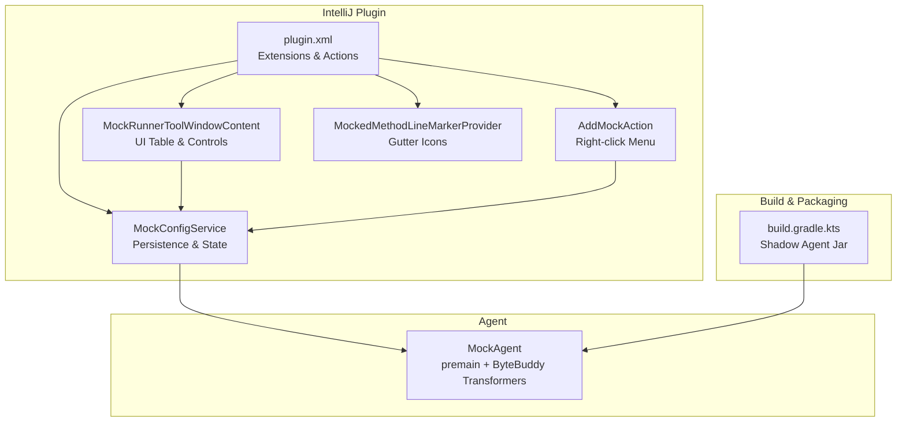
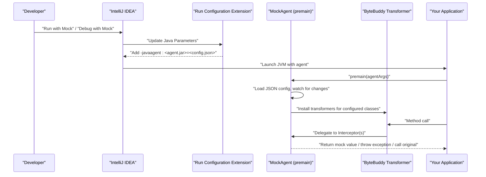
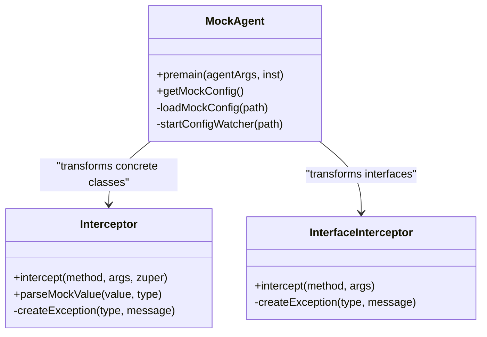
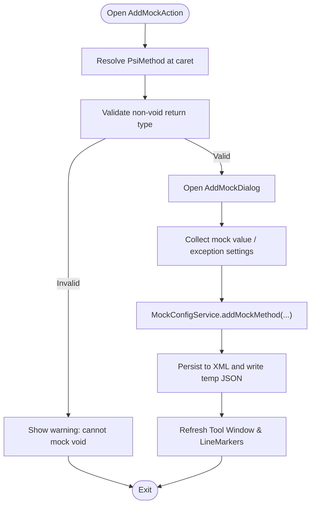
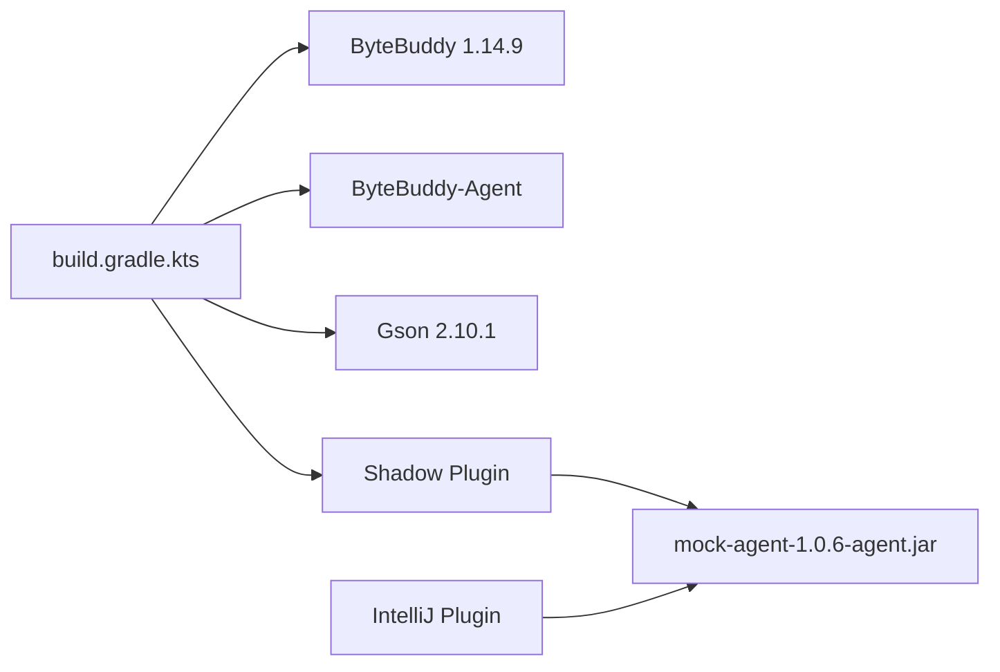

# Project Overview

<cite>
**Referenced Files in This Document**
- [README.md](file://README.md)
- [MOCK_RUNNER_README.md](file://MOCK_RUNNER_README.md)
- [CHANGELOG.md](file://CHANGELOG.md)
- [build.gradle.kts](file://build.gradle.kts)
- [src/main/resources/META-INF/plugin.xml](file://src/main/resources/META-INF/plugin.xml)
- [src/main/java/io/github/lancelothuxi/idea/plugin/mock/agent/MockAgent.java](file://src/main/java/io/github/lancelothuxi/idea/plugin/mock/agent/MockAgent.java)
- [src/main/java/io/github/lancelothuxi/idea/plugin/mock/service/MockConfigService.java](file://src/main/java/io/github/lancelothuxi/idea/plugin/mock/service/MockConfigService.java)
- [src/main/java/io/github/lancelothuxi/idea/plugin/mock/ui/MockRunnerToolWindowContent.java](file://src/main/java/io/github/lancelothuxi/idea/plugin/mock/ui/MockRunnerToolWindowContent.java)
- [src/main/java/io/github/lancelothuxi/idea/plugin/mock/action/AddMockAction.java](file://src/main/java/io/github/lancelothuxi/idea/plugin/mock/action/AddMockAction.java)
- [src/main/java/io/github/lancelothuxi/idea/plugin/mock/marker/MockedMethodLineMarkerProvider.java](file://src/main/java/io/github/lancelothuxi/idea/plugin/mock/marker/MockedMethodLineMarkerProvider.java)
- [src/main/java/io/github/lancelothuxi/idea/plugin/mock/ui/AddMockDialog.java](file://src/main/java/io/github/lancelothuxi/idea/plugin/mock/ui/AddMockDialog.java)
- [docs/ARCHITECTURE_DIAGRAM.md](file://docs/ARCHITECTURE_DIAGRAM.md)
- [docs/DUBBO_FEIGN_GUIDE.md](file://docs/DUBBO_FEIGN_GUIDE.md)
</cite>

## Table of Contents
1. [Introduction](#introduction)
2. [Project Structure](#project-structure)
3. [Core Components](#core-components)
4. [Architecture Overview](#architecture-overview)
5. [Detailed Component Analysis](#detailed-component-analysis)
6. [Dependency Analysis](#dependency-analysis)
7. [Performance Considerations](#performance-considerations)
8. [Troubleshooting Guide](#troubleshooting-guide)
9. [Conclusion](#conclusion)
10. [Appendices](#appendices)

## Introduction
Mock Runner is an IntelliJ IDEA plugin that enables runtime method mocking using Java Agent technology. It allows Java developers, testers, and QA engineers to mock any method’s return value or exception without changing source code. The plugin integrates seamlessly with IntelliJ’s Run/Debug workflows and provides a visual configuration UI, JSON editor for complex return values, and support for exception mocking and Dubbo/Feign interface-based RPC calls.

Key value propositions:
- Runtime mocking without code changes
- Visual configuration and JSON editor for complex return values
- Exception mocking for robust error scenario testing
- Support for interface-based RPC frameworks (Dubbo/Feign)
- Persistent per-project configuration and tool window management

Target audience:
- Java developers building or integrating with microservices
- Testers/QA engineers who need to simulate backend services or error conditions
- Teams practicing TDD/BDD who require controlled test environments

Common development challenges solved:
- Need to isolate components during integration testing
- Requirement to simulate slow or unreliable external services
- Desire to test error handling without setting up full infrastructure
- Want to prototype UI/API consumers against evolving backend contracts

## Project Structure
The project follows a layered structure:
- IntelliJ plugin core (actions, UI, services, extensions)
- Java Agent (ByteBuddy-based instrumentation)
- Build pipeline (Gradle, shadow plugin for agent packaging)

**Diagram sources**
- [src/main/resources/META-INF/plugin.xml](file://src/main/resources/META-INF/plugin.xml#L25-L43)
- [src/main/java/io/github/lancelothuxi/idea/plugin/mock/service/MockConfigService.java](file://src/main/java/io/github/lancelothuxi/idea/plugin/mock/service/MockConfigService.java#L19-L31)
- [src/main/java/io/github/lancelothuxi/idea/plugin/mock/ui/MockRunnerToolWindowContent.java](file://src/main/java/io/github/lancelothuxi/idea/plugin/mock/ui/MockRunnerToolWindowContent.java#L46-L80)
- [src/main/java/io/github/lancelothuxi/idea/plugin/mock/action/AddMockAction.java](file://src/main/java/io/github/lancelothuxi/idea/plugin/mock/action/AddMockAction.java#L15-L22)
- [src/main/java/io/github/lancelothuxi/idea/plugin/mock/marker/MockedMethodLineMarkerProvider.java](file://src/main/java/io/github/lancelothuxi/idea/plugin/mock/marker/MockedMethodLineMarkerProvider.java#L19-L42)
- [build.gradle.kts](file://build.gradle.kts#L84-L123)

**Section sources**
- [README.md](file://README.md#L1-L30)
- [build.gradle.kts](file://build.gradle.kts#L1-L50)
- [src/main/resources/META-INF/plugin.xml](file://src/main/resources/META-INF/plugin.xml#L1-L55)

## Core Components
- MockAgent: Java Agent entry point that loads configuration, watches for updates, and installs ByteBuddy transformers to intercept configured methods. It distinguishes between concrete classes (with fallback to original via @SuperCall) and interfaces (direct return or exception).
- MockConfigService: Manages persistent mock configuration per project, writes temporary JSON for the agent, and updates UI components.
- MockRunnerToolWindowContent: Central UI for viewing, filtering, paginating, enabling/disabling, and editing mock configurations with inline JSON editing.
- AddMockAction: Adds mock configuration via right-click context menu on methods, generating intelligent defaults.
- MockedMethodLineMarkerProvider: Displays gutter icons for methods that are currently mocked.
- AddMockDialog: Professional dialog for configuring return values (JSON) or exceptions, with inline JSON editor and smart mode switching.

**Section sources**
- [src/main/java/io/github/lancelothuxi/idea/plugin/mock/agent/MockAgent.java](file://src/main/java/io/github/lancelothuxi/idea/plugin/mock/agent/MockAgent.java#L26-L145)
- [src/main/java/io/github/lancelothuxi/idea/plugin/mock/service/MockConfigService.java](file://src/main/java/io/github/lancelothuxi/idea/plugin/mock/service/MockConfigService.java#L23-L60)
- [src/main/java/io/github/lancelothuxi/idea/plugin/mock/ui/MockRunnerToolWindowContent.java](file://src/main/java/io/github/lancelothuxi/idea/plugin/mock/ui/MockRunnerToolWindowContent.java#L22-L80)
- [src/main/java/io/github/lancelothuxi/idea/plugin/mock/action/AddMockAction.java](file://src/main/java/io/github/lancelothuxi/idea/plugin/mock/action/AddMockAction.java#L15-L40)
- [src/main/java/io/github/lancelothuxi/idea/plugin/mock/marker/MockedMethodLineMarkerProvider.java](file://src/main/java/io/github/lancelothuxi/idea/plugin/mock/marker/MockedMethodLineMarkerProvider.java#L19-L42)
- [src/main/java/io/github/lancelothuxi/idea/plugin/mock/ui/AddMockDialog.java](file://src/main/java/io/github/lancelothuxi/idea/plugin/mock/ui/AddMockDialog.java#L16-L40)

## Architecture Overview
The plugin integrates with IntelliJ’s run configuration lifecycle to inject a Java Agent that performs runtime method interception using ByteBuddy. The agent reads a JSON configuration file (persisted by the IDE) and applies mock rules to matching methods.

**Diagram sources**
- [src/main/resources/META-INF/plugin.xml](file://src/main/resources/META-INF/plugin.xml#L25-L43)
- [src/main/java/io/github/lancelothuxi/idea/plugin/mock/agent/MockAgent.java](file://src/main/java/io/github/lancelothuxi/idea/plugin/mock/agent/MockAgent.java#L26-L145)
- [build.gradle.kts](file://build.gradle.kts#L84-L123)

## Detailed Component Analysis

### MockAgent and Interceptors
- Type detection: Determines whether the target is an interface or concrete class and routes to the appropriate interceptor.
- Regular Interceptor: Supports fallback to original implementation via @SuperCall when no mock is configured.
- InterfaceInterceptor: Designed for Dubbo/Feign-style interfaces; returns mock value or throws exception if not configured.
- Configuration watcher: Monitors the JSON config file for changes and reloads rules dynamically.
- JSON parsing: Handles primitive types, generic collections, and complex objects using Gson with reflection-aware type parsing.

**Diagram sources**
- [src/main/java/io/github/lancelothuxi/idea/plugin/mock/agent/MockAgent.java](file://src/main/java/io/github/lancelothuxi/idea/plugin/mock/agent/MockAgent.java#L26-L145)
- [src/main/java/io/github/lancelothuxi/idea/plugin/mock/agent/MockAgent.java](file://src/main/java/io/github/lancelothuxi/idea/plugin/mock/agent/MockAgent.java#L202-L339)
- [src/main/java/io/github/lancelothuxi/idea/plugin/mock/agent/MockAgent.java](file://src/main/java/io/github/lancelothuxi/idea/plugin/mock/agent/MockAgent.java#L344-L398)

**Section sources**
- [src/main/java/io/github/lancelothuxi/idea/plugin/mock/agent/MockAgent.java](file://src/main/java/io/github/lancelothuxi/idea/plugin/mock/agent/MockAgent.java#L26-L200)
- [docs/ARCHITECTURE_DIAGRAM.md](file://docs/ARCHITECTURE_DIAGRAM.md#L80-L125)

### Mock Configuration Management
- Persistent state: Stores configuration in .idea/mockRunnerConfig.xml and syncs to a temporary JSON file for the agent.
- UI integration: Provides search, pagination, global enable/disable, and inline JSON editing.
- Action integration: Right-click “Add Mock for Method” captures method metadata and opens a dialog to configure return values or exceptions.

**Diagram sources**
- [src/main/java/io/github/lancelothuxi/idea/plugin/mock/action/AddMockAction.java](file://src/main/java/io/github/lancelothuxi/idea/plugin/mock/action/AddMockAction.java#L21-L82)
- [src/main/java/io/github/lancelothuxi/idea/plugin/mock/ui/AddMockDialog.java](file://src/main/java/io/github/lancelothuxi/idea/plugin/mock/ui/AddMockDialog.java#L16-L66)
- [src/main/java/io/github/lancelothuxi/idea/plugin/mock/service/MockConfigService.java](file://src/main/java/io/github/lancelothuxi/idea/plugin/mock/service/MockConfigService.java#L109-L151)

**Section sources**
- [src/main/java/io/github/lancelothuxi/idea/plugin/mock/service/MockConfigService.java](file://src/main/java/io/github/lancelothuxi/idea/plugin/mock/service/MockConfigService.java#L23-L60)
- [src/main/java/io/github/lancelothuxi/idea/plugin/mock/ui/MockRunnerToolWindowContent.java](file://src/main/java/io/github/lancelothuxi/idea/plugin/mock/ui/MockRunnerToolWindowContent.java#L82-L160)
- [src/main/java/io/github/lancelothuxi/idea/plugin/mock/action/AddMockAction.java](file://src/main/java/io/github/lancelothuxi/idea/plugin/mock/action/AddMockAction.java#L21-L82)

### UI and Tool Window
- Mock Runner tool window displays a searchable, paginated table of mock configurations with inline editing for values and mode switching between return value and exception.
- Global toggle enables/disables all mocks; statistics show total and enabled counts.
- Line markers indicate which methods are mocked in the editor gutter.

**Section sources**
- [src/main/java/io/github/lancelothuxi/idea/plugin/mock/ui/MockRunnerToolWindowContent.java](file://src/main/java/io/github/lancelothuxi/idea/plugin/mock/ui/MockRunnerToolWindowContent.java#L22-L160)
- [src/main/java/io/github/lancelothuxi/idea/plugin/mock/marker/MockedMethodLineMarkerProvider.java](file://src/main/java/io/github/lancelothuxi/idea/plugin/mock/marker/MockedMethodLineMarkerProvider.java#L19-L61)

### Installation and Compatibility
- Installation options:
  - IntelliJ Marketplace (recommended): Install from Settings → Plugins → Search “Mock Runner”
  - Manual installation: Download release zip from GitHub and install from disk
- System requirements:
  - IntelliJ IDEA 2022.3 or later
  - Java 11 or later
  - Gradle/Maven project (for Java applications)
- Compatibility matrix:
  - IntelliJ Platform: 2022.3 (sinceBuild 223, untilBuild 233.*)
  - Java: 17 (source/target/toolchain)
  - Dependencies: ByteBuddy 1.14.9, Gson 2.10.1

**Section sources**
- [README.md](file://README.md#L21-L40)
- [README.md](file://README.md#L235-L246)
- [build.gradle.kts](file://build.gradle.kts#L37-L41)
- [build.gradle.kts](file://build.gradle.kts#L139-L145)

### Evolution and Milestones
- Version 1.0.6 (2026-02-16):
  - Full support for Dubbo and Feign interface-based RPC calls
  - Separate InterfaceInterceptor for interfaces (no @SuperCall)
  - Enhanced documentation and logging
- Version 1.0.5 (2026-02-16):
  - Exception mocking mode with dedicated configuration
  - Improved JSON editor with inline editing
  - Fixed generic type parsing using Method.getGenericReturnType()
  - Package refactoring to io.github.lancelothuxi
- Version 1.0.4:
  - Pagination (20 items/page), search, enable/disable toggles, global toggle, statistics
- Version 1.0.3:
  - Inline JSON editor with syntax highlighting and validation
- Version 1.0.2:
  - Intelligent mock data generation for generic types (e.g., List<Student>)
- Version 1.0.1:
  - MockRunner and MockDebugRunner, tool window, line marker provider
- Version 1.0.0:
  - Initial release with basic method mocking, Java Agent integration, visual UI, and persistence

**Section sources**
- [CHANGELOG.md](file://CHANGELOG.md#L8-L47)
- [CHANGELOG.md](file://CHANGELOG.md#L48-L81)
- [CHANGELOG.md](file://CHANGELOG.md#L82-L103)
- [CHANGELOG.md](file://CHANGELOG.md#L104-L121)

### Practical Examples and Workflow Impact
- Mock database service: Configure a method to return a JSON object representing a user profile, enabling UI/API development without a live database.
- Mock list return: Return a JSON array for collection-returning methods, supporting integration tests for list-based endpoints.
- Mock exception: Configure exception mode to simulate downstream service failures and validate error handling paths.
- Dubbo/Feign interface mocking: Add mocks for interface methods (without concrete implementation) to develop and test microservice consumers locally.

**Section sources**
- [README.md](file://README.md#L86-L147)
- [docs/DUBBO_FEIGN_GUIDE.md](file://docs/DUBBO_FEIGN_GUIDE.md#L39-L164)

## Dependency Analysis
External dependencies and build integration:
- ByteBuddy and ByteBuddy-Agent for runtime instrumentation
- Gson for JSON serialization/deserialization of mock values
- IntelliJ Platform SDK for plugin framework, actions, UI, and run configuration extensions
- Shadow plugin to package agent with relocated dependencies to avoid conflicts

**Diagram sources**
- [build.gradle.kts](file://build.gradle.kts#L25-L35)
- [build.gradle.kts](file://build.gradle.kts#L84-L123)

**Section sources**
- [build.gradle.kts](file://build.gradle.kts#L25-L35)
- [build.gradle.kts](file://build.gradle.kts#L84-L123)

## Performance Considerations
- Minimal overhead: Agent only intercepts configured methods; non-mocked methods are unaffected.
- Efficient matching: Uses ByteBuddy type matchers scoped to classes with active rules.
- Lazy parsing: JSON deserialization occurs only when a mock is triggered.
- Memory footprint: Relocated dependencies in the agent jar reduce classpath conflicts.

[No sources needed since this section provides general guidance]

## Troubleshooting Guide
Common issues and resolutions:
- Mock not working:
  - Verify the mock is enabled in the Mock Runner tool window
  - Confirm method signature matches exactly (including package and parameters)
  - Check return type correctness
  - Review IDE logs for agent initialization and rule loading messages
- Agent not loading:
  - Ensure plugin is installed and “Run with Mock” is used (not standard Run)
  - Confirm the -javaagent VM option is present in run configuration
- ClassCastException with generics:
  - Ensure mock JSON matches the declared return type (object for POJOs, array for collections)
  - Use version 1.0.5+ for improved generic type parsing
- Interface method exceptions:
  - For interfaces without implementation, configure a mock; otherwise, UnsupportedOperationException indicates no mock configured

**Section sources**
- [README.md](file://README.md#L214-L234)
- [src/main/java/io/github/lancelothuxi/idea/plugin/mock/agent/MockAgent.java](file://src/main/java/io/github/lancelothuxi/idea/plugin/mock/agent/MockAgent.java#L174-L200)
- [docs/DUBBO_FEIGN_GUIDE.md](file://docs/DUBBO_FEIGN_GUIDE.md#L211-L227)

## Conclusion
Mock Runner delivers a powerful, non-invasive method mocking solution integrated into IntelliJ IDEA. By leveraging Java Agent technology and ByteBuddy, it enables teams to rapidly prototype, test, and debug applications without altering source code. Its visual configuration UI, JSON editor, exception mocking, and Dubbo/Feign support streamline development workflows, especially in microservices architectures. The plugin’s evolution demonstrates continuous enhancements in usability, reliability, and developer productivity.

[No sources needed since this section summarizes without analyzing specific files]

## Appendices

### Installation Options
- From IntelliJ Marketplace:
  - Open IntelliJ IDEA → Settings/Preferences → Plugins → Search “Mock Runner” → Install → Restart IDE
- Manual Installation:
  - Download the latest release zip from GitHub Releases → Install Plugin from Disk… → Select zip → Restart IDE

**Section sources**
- [README.md](file://README.md#L21-L38)

### System Requirements and Compatibility
- IntelliJ IDEA: 2022.3 or later (sinceBuild 223, untilBuild 233.*)
- Java: 17 (source/target/toolchain), minimum 11 recommended
- Project type: Gradle/Maven Java projects

**Section sources**
- [README.md](file://README.md#L235-L246)
- [build.gradle.kts](file://build.gradle.kts#L37-L41)
- [build.gradle.kts](file://build.gradle.kts#L139-L145)

### Technology Stack
- Java Agent: ByteBuddy and ByteBuddy-Agent
- JSON Processing: Gson
- UI Framework: IntelliJ Platform SDK
- Build Tool: Gradle with Shadow plugin for agent packaging

**Section sources**
- [README.md](file://README.md#L241-L246)
- [build.gradle.kts](file://build.gradle.kts#L25-L35)