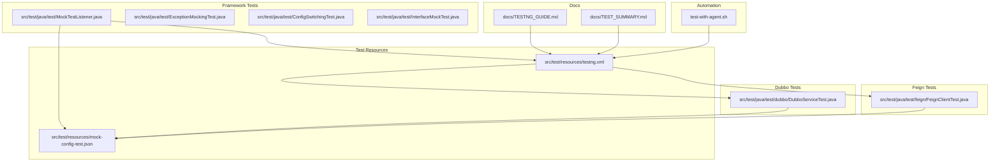
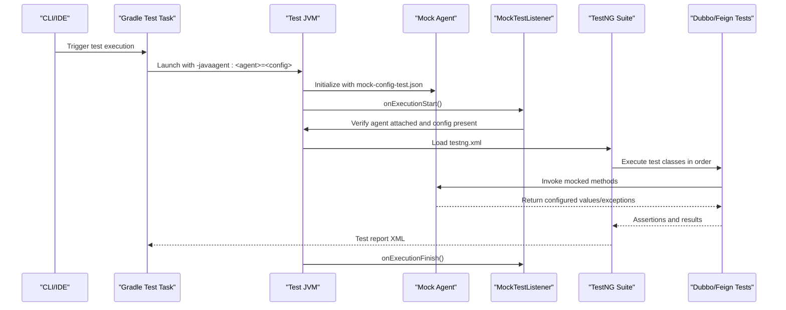
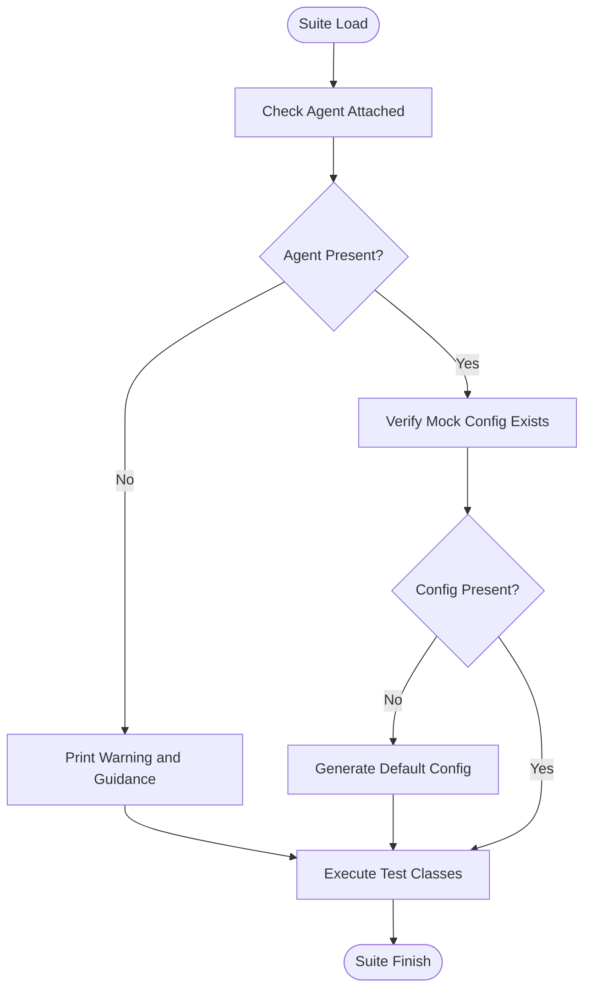
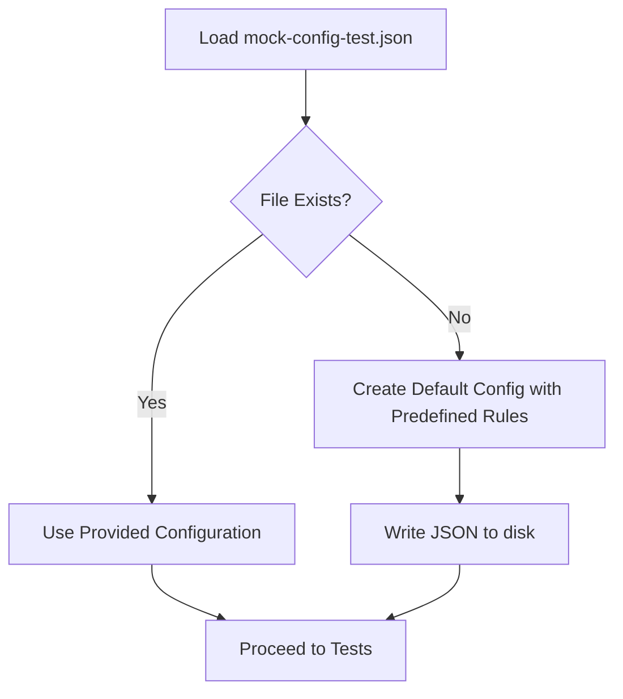
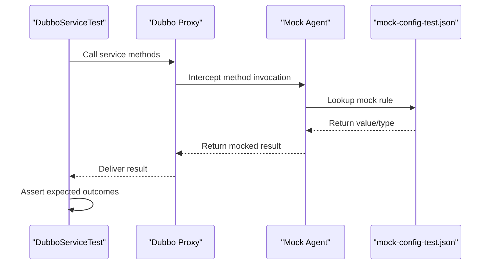
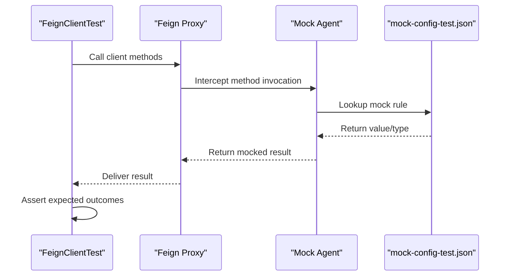
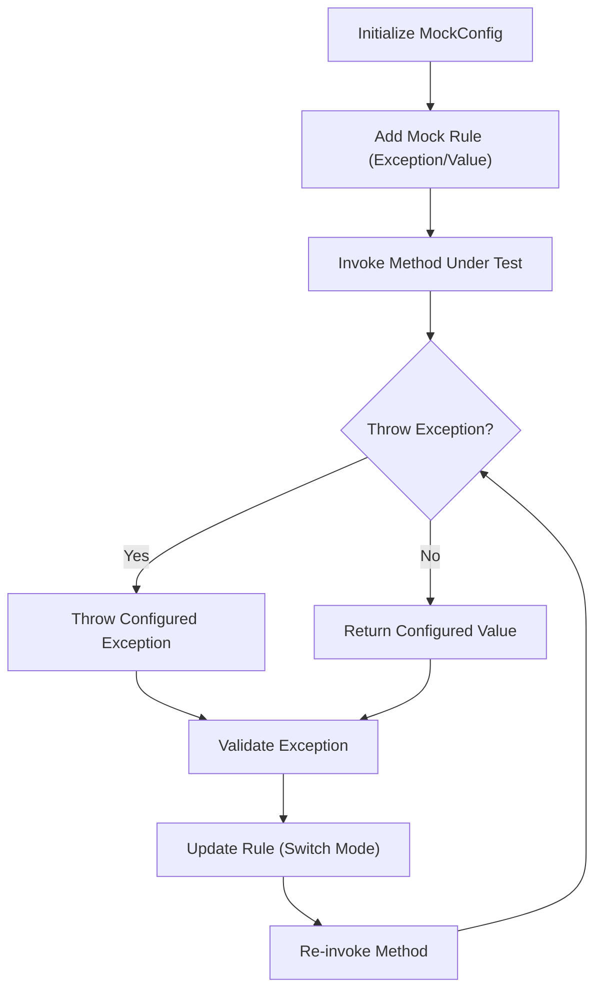
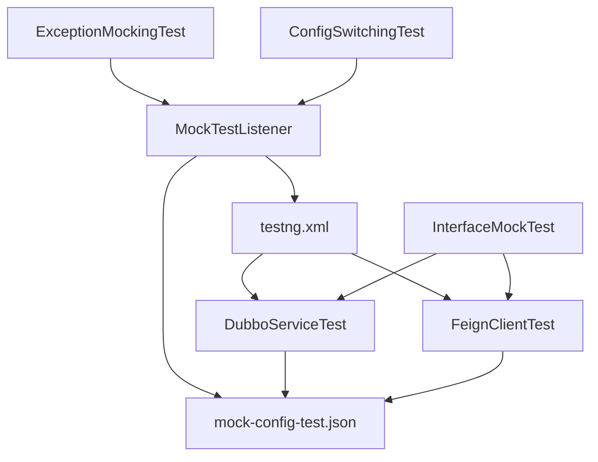

# Testing and Quality Assurance

<cite>
**Referenced Files in This Document**
- [testng.xml](file://src/test/resources/testng.xml)
- [MockTestListener.java](file://src/test/java/test/MockTestListener.java)
- [DubboServiceTest.java](file://src/test/java/test/dubbo/DubboServiceTest.java)
- [FeignClientTest.java](file://src/test/java/test/feign/FeignClientTest.java)
- [mock-config-test.json](file://src/test/resources/mock-config-test.json)
- [TESTNG_GUIDE.md](file://docs/TESTNG_GUIDE.md)
- [TEST_SUMMARY.md](file://docs/TEST_SUMMARY.md)
- [ExceptionMockingTest.java](file://src/test/java/test/ExceptionMockingTest.java)
- [ConfigSwitchingTest.java](file://src/test/java/test/ConfigSwitchingTest.java)
- [InterfaceMockTest.java](file://src/test/java/test/InterfaceMockTest.java)
- [test-with-agent.sh](file://test-with-agent.sh)
</cite>

## Table of Contents
1. [Introduction](#introduction)
2. [Project Structure](#project-structure)
3. [Core Components](#core-components)
4. [Architecture Overview](#architecture-overview)
5. [Detailed Component Analysis](#detailed-component-analysis)
6. [Dependency Analysis](#dependency-analysis)
7. [Performance Considerations](#performance-considerations)
8. [Troubleshooting Guide](#troubleshooting-guide)
9. [Conclusion](#conclusion)
10. [Appendices](#appendices)

## Introduction
This document describes Mock Runner’s testing framework and quality assurance processes. The framework is TestNG-based and includes unit tests, integration-style tests, and framework-specific test suites that validate Dubbo and Feign interface mocking. It explains the test structure, configuration via testng.xml, automated execution workflows, mock testing examples, agent-based interception, configuration validation, continuous integration setup, and practical guidance for writing effective tests, managing test data, debugging failures, and planning performance and regression testing.

## Project Structure
The testing workspace follows Maven-standard layout under src/test with:
- Java test sources organized by feature packages (e.g., dubbo, feign)
- Shared TestNG suite configuration
- Mock configuration for automated tests
- Utility and validation tests for exception and configuration switching
- Shell script to automate agent attachment and test execution

**Diagram sources**
- [testng.xml](file://src/test/resources/testng.xml#L1-L20)
- [MockTestListener.java](file://src/test/java/test/MockTestListener.java#L1-L162)
- [DubboServiceTest.java](file://src/test/java/test/dubbo/DubboServiceTest.java#L1-L250)
- [FeignClientTest.java](file://src/test/java/test/feign/FeignClientTest.java#L1-L309)
- [mock-config-test.json](file://src/test/resources/mock-config-test.json#L1-L72)
- [TESTNG_GUIDE.md](file://docs/TESTNG_GUIDE.md#L1-L426)
- [TEST_SUMMARY.md](file://docs/TEST_SUMMARY.md)
- [test-with-agent.sh](file://test-with-agent.sh#L1-L27)

**Section sources**
- [testng.xml](file://src/test/resources/testng.xml#L1-L20)
- [MockTestListener.java](file://src/test/java/test/MockTestListener.java#L1-L162)
- [DubboServiceTest.java](file://src/test/java/test/dubbo/DubboServiceTest.java#L1-L250)
- [FeignClientTest.java](file://src/test/java/test/feign/FeignClientTest.java#L1-L309)
- [mock-config-test.json](file://src/test/resources/mock-config-test.json#L1-L72)
- [TESTNG_GUIDE.md](file://docs/TESTNG_GUIDE.md#L1-L426)
- [TEST_SUMMARY.md](file://docs/TEST_SUMMARY.md)
- [test-with-agent.sh](file://test-with-agent.sh#L1-L27)

## Core Components
- TestNG Suite and Lifecycle Listener
  - The suite defines two primary test groups: Dubbo interface mock tests and Feign client mock tests.
  - A listener validates agent attachment and ensures mock configuration availability, generating defaults if missing.
- Mock Configuration
  - A centralized JSON configuration supplies return values and types for mocked methods, enabling deterministic test execution.
- Feature-Specific Test Classes
  - DubboServiceTest and FeignClientTest exercise CRUD-like workflows and exception scenarios using dynamic proxies to simulate framework behavior.
- Validation and Utility Tests
  - ExceptionMockingTest validates exception generation paths.
  - ConfigSwitchingTest verifies seamless transitions between exception and return-value modes.
  - InterfaceMockTest demonstrates generic interface mocking patterns.

**Section sources**
- [testng.xml](file://src/test/resources/testng.xml#L3-L19)
- [MockTestListener.java](file://src/test/java/test/MockTestListener.java#L18-L161)
- [mock-config-test.json](file://src/test/resources/mock-config-test.json#L1-L72)
- [DubboServiceTest.java](file://src/test/java/test/dubbo/DubboServiceTest.java#L86-L249)
- [FeignClientTest.java](file://src/test/java/test/feign/FeignClientTest.java#L112-L308)
- [ExceptionMockingTest.java](file://src/test/java/test/ExceptionMockingTest.java#L15-L111)
- [ConfigSwitchingTest.java](file://src/test/java/test/ConfigSwitchingTest.java#L12-L158)
- [InterfaceMockTest.java](file://src/test/java/test/InterfaceMockTest.java#L15-L76)

## Architecture Overview
The testing architecture combines TestNG orchestration with an agent-driven mock interception mechanism. The listener enforces prerequisites, the agent injects mocks at runtime, and tests validate outcomes deterministically.

**Diagram sources**
- [MockTestListener.java](file://src/test/java/test/MockTestListener.java#L24-L45)
- [testng.xml](file://src/test/resources/testng.xml#L3-L19)
- [mock-config-test.json](file://src/test/resources/mock-config-test.json#L1-L72)
- [DubboServiceTest.java](file://src/test/java/test/dubbo/DubboServiceTest.java#L90-L107)
- [FeignClientTest.java](file://src/test/java/test/feign/FeignClientTest.java#L116-L133)

## Detailed Component Analysis

### TestNG Suite and Execution Control
- Suite composition
  - Two named tests: “Dubbo Interface Mock Tests” and “Feign Client Mock Tests”, each containing a single test class.
- Execution lifecycle
  - The listener prints banners, checks agent presence, and validates configuration existence, optionally generating defaults.

**Diagram sources**
- [MockTestListener.java](file://src/test/java/test/MockTestListener.java#L24-L80)
- [testng.xml](file://src/test/resources/testng.xml#L3-L19)

**Section sources**
- [testng.xml](file://src/test/resources/testng.xml#L3-L19)
- [MockTestListener.java](file://src/test/java/test/MockTestListener.java#L24-L80)

### Mock Configuration Management
- Centralized JSON configuration
  - Defines mockRules keyed by fully qualified method signatures with fields for return value, return type, enablement, and exception toggles.
- Listener-generated defaults
  - If absent, the listener creates a default configuration file populated with pre-defined rules for Dubbo and Feign test targets.

**Diagram sources**
- [MockTestListener.java](file://src/test/java/test/MockTestListener.java#L67-L146)
- [mock-config-test.json](file://src/test/resources/mock-config-test.json#L1-L72)

**Section sources**
- [mock-config-test.json](file://src/test/resources/mock-config-test.json#L1-L72)
- [MockTestListener.java](file://src/test/java/test/MockTestListener.java#L82-L146)

### Dubbo Interface Mock Tests
- Purpose
  - Validate CRUD operations against a Dubbo-style service interface using dynamic proxies to simulate RPC behavior.
- Coverage
  - Single-object returns, list returns, complex object creation, primitive returns, and exception handling (optionally enabled).
- Assertions and output
  - Uses TestNG assertions and prints formatted console logs for readability.

**Diagram sources**
- [DubboServiceTest.java](file://src/test/java/test/dubbo/DubboServiceTest.java#L109-L228)
- [mock-config-test.json](file://src/test/resources/mock-config-test.json#L3-L32)

**Section sources**
- [DubboServiceTest.java](file://src/test/java/test/dubbo/DubboServiceTest.java#L86-L249)
- [mock-config-test.json](file://src/test/resources/mock-config-test.json#L3-L32)

### Feign Client Mock Tests
- Purpose
  - Validate HTTP-like client behavior against a Feign-style interface using dynamic proxies to simulate HTTP calls.
- Coverage
  - GET, POST, PUT, DELETE, and search operations, including void return handling and exception scenarios (optionally enabled).
- Assertions and output
  - Deterministic assertions and formatted console logs for traceability.

**Diagram sources**
- [FeignClientTest.java](file://src/test/java/test/feign/FeignClientTest.java#L135-L287)
- [mock-config-test.json](file://src/test/resources/mock-config-test.json#L33-L68)

**Section sources**
- [FeignClientTest.java](file://src/test/java/test/feign/FeignClientTest.java#L112-L308)
- [mock-config-test.json](file://src/test/resources/mock-config-test.json#L33-L68)

### Exception and Configuration Switching Tests
- ExceptionMockingTest
  - Validates that exception mocks are thrown with correct types and messages and that normal return values are honored when not throwing.
- ConfigSwitchingTest
  - Ensures seamless transitions between exception and return-value modes for the same method, verifying immediate rule updates.

**Diagram sources**
- [ExceptionMockingTest.java](file://src/test/java/test/ExceptionMockingTest.java#L15-L111)
- [ConfigSwitchingTest.java](file://src/test/java/test/ConfigSwitchingTest.java#L12-L158)

**Section sources**
- [ExceptionMockingTest.java](file://src/test/java/test/ExceptionMockingTest.java#L15-L111)
- [ConfigSwitchingTest.java](file://src/test/java/test/ConfigSwitchingTest.java#L12-L158)

### Interface Mocking Demonstration
- InterfaceMockTest
  - Demonstrates generic interface mocking using dynamic proxies and highlights the “UnsupportedOperationException” symptom when mocks are not configured.

**Section sources**
- [InterfaceMockTest.java](file://src/test/java/test/InterfaceMockTest.java#L15-L76)

## Dependency Analysis
The tests depend on:
- TestNG annotations and assertions for lifecycle and verification
- Dynamic proxies to simulate framework behavior
- Mock configuration JSON and the listener for agent validation and defaults
- Utility tests validating configuration switching and exception behavior

**Diagram sources**
- [testng.xml](file://src/test/resources/testng.xml#L3-L19)
- [MockTestListener.java](file://src/test/java/test/MockTestListener.java#L18-L80)
- [DubboServiceTest.java](file://src/test/java/test/dubbo/DubboServiceTest.java#L86-L107)
- [FeignClientTest.java](file://src/test/java/test/feign/FeignClientTest.java#L112-L133)
- [ExceptionMockingTest.java](file://src/test/java/test/ExceptionMockingTest.java#L15-L35)
- [ConfigSwitchingTest.java](file://src/test/java/test/ConfigSwitchingTest.java#L12-L38)
- [InterfaceMockTest.java](file://src/test/java/test/InterfaceMockTest.java#L15-L21)

**Section sources**
- [testng.xml](file://src/test/resources/testng.xml#L3-L19)
- [MockTestListener.java](file://src/test/java/test/MockTestListener.java#L18-L80)
- [DubboServiceTest.java](file://src/test/java/test/dubbo/DubboServiceTest.java#L86-L107)
- [FeignClientTest.java](file://src/test/java/test/feign/FeignClientTest.java#L112-L133)
- [ExceptionMockingTest.java](file://src/test/java/test/ExceptionMockingTest.java#L15-L35)
- [ConfigSwitchingTest.java](file://src/test/java/test/ConfigSwitchingTest.java#L12-L38)
- [InterfaceMockTest.java](file://src/test/java/test/InterfaceMockTest.java#L15-L21)

## Performance Considerations
- Deterministic Mocking
  - Using centralized mock configuration avoids network latency and external service variability, enabling fast, repeatable runs.
- Test Ordering and Parallelism
  - Tests are ordered via TestNG priorities; parallel execution is not configured in the suite, ensuring predictable resource usage.
- Agent Overhead
  - The agent intercepts method calls early; keep mock rules minimal and precise to reduce overhead during test runs.
- Reporting
  - TestNG generates XML reports suitable for CI consumption; ensure CI jobs publish artifacts for trend analysis.

[No sources needed since this section provides general guidance]

## Troubleshooting Guide
Common issues and resolutions:
- UnsupportedOperationException
  - Cause: Agent not attached or mock not configured.
  - Resolution: Ensure tests run via Gradle to auto-attach the agent; confirm mock-config-test.json exists or allow the listener to generate defaults.
- Agent Attached but Mocks Not Working
  - Cause: Signature mismatch or incorrect return type.
  - Resolution: Verify fully qualified class name, exact method name, and correct return type in the configuration.
- ClassCastException
  - Cause: Return type mismatch with configured value.
  - Resolution: Use appropriate JSON structures for objects/lists/primitives and empty string for void.
- TestNG Not Found
  - Resolution: Refresh dependencies and rebuild the project.
- CI/CD Integration
  - The Gradle test task auto-attaches the agent; CI can run ./gradlew test and publish test results from build/test-results.

**Section sources**
- [MockTestListener.java](file://src/test/java/test/MockTestListener.java#L47-L80)
- [TESTNG_GUIDE.md](file://docs/TESTNG_GUIDE.md#L329-L370)
- [TEST_SUMMARY.md](file://docs/TEST_SUMMARY.md)

## Conclusion
Mock Runner’s testing framework leverages TestNG with agent-driven mocking to deliver reliable, deterministic tests for Dubbo and Feign interfaces. The suite is structured for maintainability, supports exception and configuration-switching validations, and integrates cleanly with CI/CD. By following the provided guidelines, teams can write effective tests, manage configuration efficiently, and scale quality assurance practices.

[No sources needed since this section summarizes without analyzing specific files]

## Appendices

### Automated Execution Workflows
- Command-line execution with agent auto-attachment
  - Use the provided shell script to build the agent JAR and run tests in sequence.
- IDE execution
  - Right-click on test classes or testng.xml to run via TestNG; note that the agent is auto-attached only through Gradle tasks.

**Section sources**
- [test-with-agent.sh](file://test-with-agent.sh#L1-L27)
- [TESTNG_GUIDE.md](file://docs/TESTNG_GUIDE.md#L53-L72)

### Writing Effective Tests with Mock Runner
- Pre-configuration
  - Ensure all targeted methods have corresponding entries in mock-config-test.json or rely on the listener to generate defaults.
- Test structure
  - Use @BeforeClass/@AfterClass for setup/teardown, @Test with priority and description for clarity, and TestNG assertions for verifications.
- Exception testing
  - Keep exception tests disabled by default and enable selectively when validating error paths.
- Debugging
  - Rely on formatted console output and XML reports; verify agent presence and configuration validity.

**Section sources**
- [TESTNG_GUIDE.md](file://docs/TESTNG_GUIDE.md#L267-L307)
- [DubboServiceTest.java](file://src/test/java/test/dubbo/DubboServiceTest.java#L211-L228)
- [FeignClientTest.java](file://src/test/java/test/feign/FeignClientTest.java#L270-L287)

### Test Data Management
- Centralized JSON
  - Maintain mock rules in mock-config-test.json; update values and types to reflect evolving test needs.
- Listener defaults
  - Allow the listener to generate defaults for quick iteration; commit updated defaults to version control as needed.

**Section sources**
- [mock-config-test.json](file://src/test/resources/mock-config-test.json#L1-L72)
- [MockTestListener.java](file://src/test/java/test/MockTestListener.java#L82-L146)

### Continuous Integration Setup
- Recommended pipeline steps
  - Checkout code, set up JDK 17, run ./gradlew test, and publish test results from build/test-results.
- Reports
  - Use the published XML reports for visibility and trend analysis.

**Section sources**
- [TESTNG_GUIDE.md](file://docs/TESTNG_GUIDE.md#L394-L420)

### Performance and Regression Testing Strategies
- Performance testing
  - Use deterministic mocks to eliminate external variability; measure test execution time trends over time.
- Load testing
  - While not implemented in the current suite, the same mocking approach can be applied to stress scenarios by scaling test iterations and measuring throughput.
- Regression testing
  - Keep mock configurations aligned with feature changes; treat mock updates as part of regression coverage.

[No sources needed since this section provides general guidance]