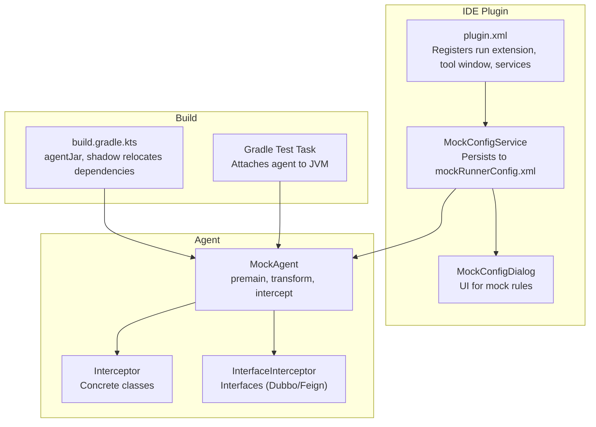
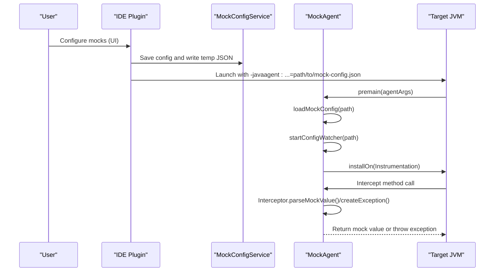
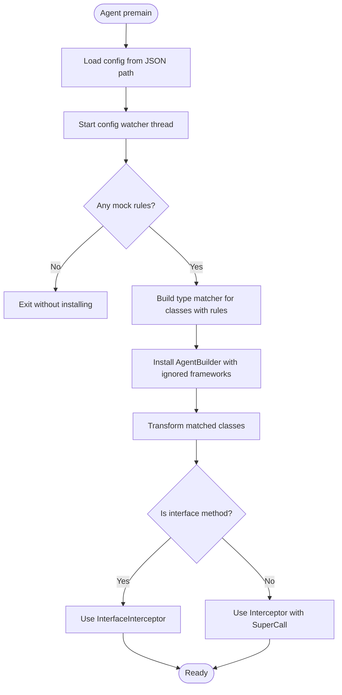
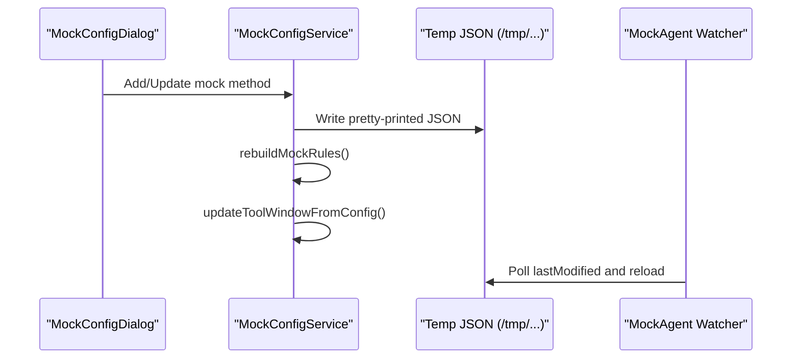
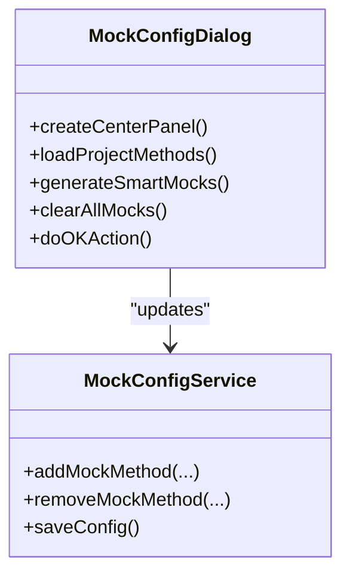
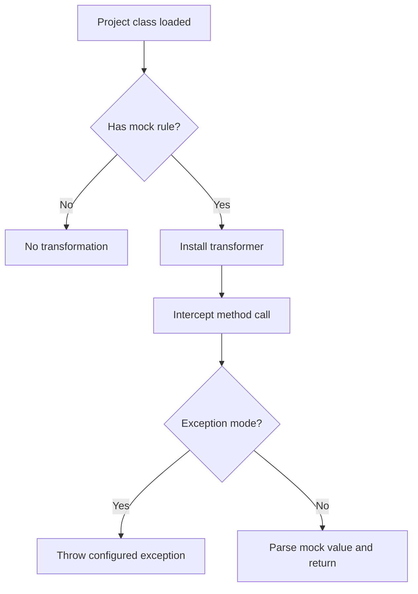
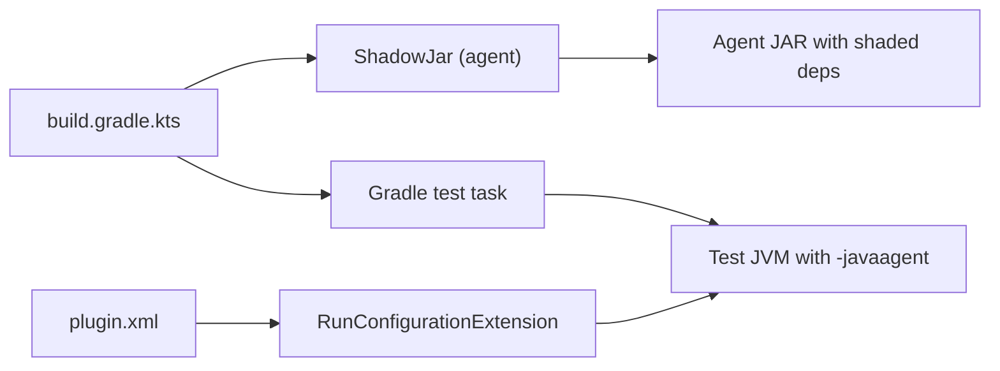

# Troubleshooting and FAQ

<cite>
**Referenced Files in This Document**
- [README.md](file://README.md)
- [MOCK_RUNNER_README.md](file://MOCK_RUNNER_README.md)
- [docs/MOCK_DEBUG_STEPS.md](file://docs/MOCK_DEBUG_STEPS.md)
- [docs/KNOWN_ISSUES.md](file://docs/KNOWN_ISSUES.md)
- [docs/DEBUG_RUN_IMPROVEMENTS.md](file://docs/DEBUG_RUN_IMPROVEMENTS.md)
- [docs/TESTNG_GUIDE.md](file://docs/TESTNG_GUIDE.md)
- [build.gradle.kts](file://build.gradle.kts)
- [settings.gradle.kts](file://settings.gradle.kts)
- [scripts/view-logs.sh](file://scripts/view-logs.sh)
- [scripts/run-sandbox.sh](file://scripts/run-sandbox.sh)
- [src/main/resources/META-INF/plugin.xml](file://src/main/resources/META-INF/plugin.xml)
- [src/main/java/io/github/lancelothuxi/idea/plugin/mock/agent/MockAgent.java](file://src/main/java/io/github/lancelothuxi/idea/plugin/mock/agent/MockAgent.java)
- [src/main/java/io/github/lancelothuxi/idea/plugin/mock/service/MockConfigService.java](file://src/main/java/io/github/lancelothuxi/idea/plugin/mock/service/MockConfigService.java)
- [src/main/java/io/github/lancelothuxi/idea/plugin/mock/ui/MockConfigDialog.java](file://src/main/java/io/github/lancelothuxi/idea/plugin/mock/ui/MockConfigDialog.java)
- [src/test/resources/mock-config-test.json](file://src/test/resources/mock-config-test.json)
</cite>

## Table of Contents
1. [Introduction](#introduction)
2. [Project Structure](#project-structure)
3. [Core Components](#core-components)
4. [Architecture Overview](#architecture-overview)
5. [Detailed Component Analysis](#detailed-component-analysis)
6. [Dependency Analysis](#dependency-analysis)
7. [Performance Considerations](#performance-considerations)
8. [Troubleshooting Guide](#troubleshooting-guide)
9. [FAQ](#faq)
10. [Conclusion](#conclusion)
11. [Appendices](#appendices)

## Introduction
This document provides comprehensive troubleshooting and frequently asked questions for Mock Runner users and developers. It covers common issues such as mocks not working, class casting exceptions with generics, agent loading problems, and configuration conflicts. It also includes systematic debugging approaches, log analysis techniques, error interpretation guides, performance troubleshooting, memory optimization, runtime conflict resolution, platform-specific issues, IDE compatibility, and integration challenges with Java frameworks.

## Project Structure
The project is an IntelliJ IDEA plugin that integrates a Java agent to intercept method calls at runtime. The key parts include:
- Plugin XML registration for run configuration extensions, tool window, services, and line markers
- Mock configuration service persisting and synchronizing mock rules to a temporary JSON file
- Mock agent that loads rules from JSON and applies ByteBuddy transformations
- UI dialogs for configuring mocks and generating JSON editors
- Gradle tasks to build and shade the agent JAR and inject it into test runs

**Diagram sources**
- [src/main/resources/META-INF/plugin.xml](file://src/main/resources/META-INF/plugin.xml#L25-L43)
- [src/main/java/io/github/lancelothuxi/idea/plugin/mock/service/MockConfigService.java](file://src/main/java/io/github/lancelothuxi/idea/plugin/mock/service/MockConfigService.java#L19-L31)
- [src/main/java/io/github/lancelothuxi/idea/plugin/mock/ui/MockConfigDialog.java](file://src/main/java/io/github/lancelothuxi/idea/plugin/mock/ui/MockConfigDialog.java#L24-L41)
- [src/main/java/io/github/lancelothuxi/idea/plugin/mock/agent/MockAgent.java](file://src/main/java/io/github/lancelothuxi/idea/plugin/mock/agent/MockAgent.java#L21-L145)
- [build.gradle.kts](file://build.gradle.kts#L84-L137)

**Section sources**
- [README.md](file://README.md#L1-L296)
- [MOCK_RUNNER_README.md](file://MOCK_RUNNER_README.md#L1-L192)
- [build.gradle.kts](file://build.gradle.kts#L1-L146)
- [src/main/resources/META-INF/plugin.xml](file://src/main/resources/META-INF/plugin.xml#L1-L55)

## Core Components
- Mock configuration persistence and synchronization:
  - MockConfigService persists to mockRunnerConfig.xml and writes a temporary JSON for the agent watcher
  - Ensures UI updates and editor markers refresh when configurations change
- Mock agent:
  - Loads configuration from JSON, watches for changes, ignores framework classes, and installs ByteBuddy transformers
  - Two interceptors: one for concrete classes (with SuperCall) and one for interfaces (without SuperCall)
- UI:
  - MockConfigDialog discovers project methods, supports JSON editor, and saves enabled rules
- Build and test:
  - Gradle agentJar task shades dependencies and sets agent manifest attributes
  - Test task attaches agent automatically and logs attachment

**Section sources**
- [src/main/java/io/github/lancelothuxi/idea/plugin/mock/service/MockConfigService.java](file://src/main/java/io/github/lancelothuxi/idea/plugin/mock/service/MockConfigService.java#L19-L96)
- [src/main/java/io/github/lancelothuxi/idea/plugin/mock/agent/MockAgent.java](file://src/main/java/io/github/lancelothuxi/idea/plugin/mock/agent/MockAgent.java#L21-L200)
- [src/main/java/io/github/lancelothuxi/idea/plugin/mock/ui/MockConfigDialog.java](file://src/main/java/io/github/lancelothuxi/idea/plugin/mock/ui/MockConfigDialog.java#L24-L108)
- [build.gradle.kts](file://build.gradle.kts#L84-L137)

## Architecture Overview
The runtime mocking pipeline involves:
- User adds mocks via UI or tool window
- MockConfigService persists and writes a temporary JSON
- Run/Debug configuration extension injects -javaagent with the JSON path
- Agent loads configuration, watches for changes, and installs ByteBuddy transformers
- On method invocation, interceptors return configured values or throw exceptions

**Diagram sources**
- [src/main/java/io/github/lancelothuxi/idea/plugin/mock/service/MockConfigService.java](file://src/main/java/io/github/lancelothuxi/idea/plugin/mock/service/MockConfigService.java#L41-L58)
- [src/main/java/io/github/lancelothuxi/idea/plugin/mock/agent/MockAgent.java](file://src/main/java/io/github/lancelothuxi/idea/plugin/mock/agent/MockAgent.java#L26-L145)
- [build.gradle.kts](file://build.gradle.kts#L63-L82)

## Detailed Component Analysis

### Mock Agent Interception Flow
The agent installs transformers for classes with configured rules and delegates to interceptors depending on whether the method belongs to an interface or a concrete class.

**Diagram sources**
- [src/main/java/io/github/lancelothuxi/idea/plugin/mock/agent/MockAgent.java](file://src/main/java/io/github/lancelothuxi/idea/plugin/mock/agent/MockAgent.java#L95-L145)

**Section sources**
- [src/main/java/io/github/lancelothuxi/idea/plugin/mock/agent/MockAgent.java](file://src/main/java/io/github/lancelothuxi/idea/plugin/mock/agent/MockAgent.java#L21-L200)

### Mock Configuration Persistence and Synchronization
MockConfigService writes a temporary JSON file for the agent watcher and persists to project storage. It also refreshes the UI and editor markers.

**Diagram sources**
- [src/main/java/io/github/lancelothuxi/idea/plugin/mock/service/MockConfigService.java](file://src/main/java/io/github/lancelothuxi/idea/plugin/mock/service/MockConfigService.java#L41-L58)
- [src/main/java/io/github/lancelothuxi/idea/plugin/mock/agent/MockAgent.java](file://src/main/java/io/github/lancelothuxi/idea/plugin/mock/agent/MockAgent.java#L174-L200)

**Section sources**
- [src/main/java/io/github/lancelothuxi/idea/plugin/mock/service/MockConfigService.java](file://src/main/java/io/github/lancelothuxi/idea/plugin/mock/service/MockConfigService.java#L19-L96)
- [src/main/java/io/github/lancelothuxi/idea/plugin/mock/agent/MockAgent.java](file://src/main/java/io/github/lancelothuxi/idea/plugin/mock/agent/MockAgent.java#L174-L200)

### UI Mock Configuration Dialog
The dialog discovers project methods, filters out JDK/test classes, and allows enabling/disabling and editing mock values with a JSON editor.

**Diagram sources**
- [src/main/java/io/github/lancelothuxi/idea/plugin/mock/ui/MockConfigDialog.java](file://src/main/java/io/github/lancelothuxi/idea/plugin/mock/ui/MockConfigDialog.java#L24-L108)
- [src/main/java/io/github/lancelothuxi/idea/plugin/mock/service/MockConfigService.java](file://src/main/java/io/github/lancelothuxi/idea/plugin/mock/service/MockConfigService.java#L109-L151)

**Section sources**
- [src/main/java/io/github/lancelothuxi/idea/plugin/mock/ui/MockConfigDialog.java](file://src/main/java/io/github/lancelothuxi/idea/plugin/mock/ui/MockConfigDialog.java#L24-L108)
- [src/main/java/io/github/lancelothuxi/idea/plugin/mock/service/MockConfigService.java](file://src/main/java/io/github/lancelothuxi/idea/plugin/mock/service/MockConfigService.java#L109-L151)

### Conceptual Overview
- Agent only affects project classes, not JDK classes
- Some JVM optimizations (e.g., final methods) may prevent interception
- For dynamic proxies (e.g., Dubbo/Feign), the agent cannot intercept proxy instances created after installation

[No sources needed since this diagram shows conceptual workflow, not actual code structure]

[No sources needed since this section doesn't analyze specific source files]

## Dependency Analysis
- Build-time dependencies:
  - ByteBuddy and ByteBuddy agent for instrumentation
  - Gson for JSON parsing
  - Shadow plugin to relocate dependencies and avoid conflicts
- Test-time injection:
  - Gradle test task automatically attaches the agent JAR with the mock configuration path
- Plugin runtime:
  - plugin.xml registers run configuration extension to inject -javaagent into all Run/Debug configurations

**Diagram sources**
- [build.gradle.kts](file://build.gradle.kts#L25-L35)
- [build.gradle.kts](file://build.gradle.kts#L84-L137)
- [src/main/resources/META-INF/plugin.xml](file://src/main/resources/META-INF/plugin.xml#L25-L28)

**Section sources**
- [build.gradle.kts](file://build.gradle.kts#L25-L35)
- [build.gradle.kts](file://build.gradle.kts#L84-L137)
- [src/main/resources/META-INF/plugin.xml](file://src/main/resources/META-INF/plugin.xml#L25-L28)

## Performance Considerations
- Minimize the number of transformed classes by ensuring only classes with active mock rules are targeted
- Avoid overly broad type matchers; the agent already narrows to classes with configured rules
- Keep mock configurations concise; large JSON payloads increase parsing overhead
- Use the config watcher responsibly; frequent changes trigger reloads
- Memory usage:
  - The agent parses JSON into objects; prefer primitive values or compact JSON where possible
  - For collections, specify generic types to avoid fallback parsing
- Avoid mocking methods that are heavily invoked in tight loops; consider selective enabling

[No sources needed since this section provides general guidance]

## Troubleshooting Guide

### Mock not working
- Verify the mock is enabled in the Mock Runner tool window
- Confirm the method signature matches exactly (class name, method name, parameter types)
- Ensure the return type is correctly specified in the configuration
- Use the correct runner:
  - For IDE runs, ensure the run configuration extension injects -javaagent
  - For tests, confirm the Gradle test task attaches the agent
- Check logs for agent loading and interception messages

**Section sources**
- [README.md](file://README.md#L214-L234)
- [docs/MOCK_DEBUG_STEPS.md](file://docs/MOCK_DEBUG_STEPS.md#L3-L60)
- [src/main/resources/META-INF/plugin.xml](file://src/main/resources/META-INF/plugin.xml#L25-L28)

### ClassCastException with generics
- The agent attempts to parse JSON into the specified return type, including generics
- Ensure the return type in the configuration matches the method signature
- For generic collections, specify the full generic type (e.g., List<SomeClass>) so the agent can parse into the correct parameterized type
- If the class cannot be resolved, the agent falls back to generic List/Map parsing

**Section sources**
- [src/main/java/io/github/lancelothuxi/idea/plugin/mock/agent/MockAgent.java](file://src/main/java/io/github/lancelothuxi/idea/plugin/mock/agent/MockAgent.java#L274-L326)

### Agent not loading
- Confirm the plugin is installed and the run configuration extension is registered
- Ensure you are using the plugin’s Run/Debug options, not standard ones
- Check that the agent JAR was built and copied into the plugin sandbox
- Verify the Gradle test task attaches the agent and prints attachment logs
- Review IDE logs for agent loading messages

**Section sources**
- [src/main/resources/META-INF/plugin.xml](file://src/main/resources/META-INF/plugin.xml#L25-L28)
- [build.gradle.kts](file://build.gradle.kts#L115-L123)
- [docs/MOCK_DEBUG_STEPS.md](file://docs/MOCK_DEBUG_STEPS.md#L32-L60)

### Configuration conflicts
- Temporary JSON conflicts:
  - Ensure only one IDE instance writes to the temp JSON path
  - The agent watcher polls lastModified; avoid external edits during a session
- Project vs. persistent storage:
  - mockRunnerConfig.xml persists across sessions; temporary JSON is for live watcher
- Framework class interference:
  - The agent ignores framework classes; if your project shadows or overrides framework classes, verify they are not mistakenly targeted

**Section sources**
- [src/main/java/io/github/lancelothuxi/idea/plugin/mock/service/MockConfigService.java](file://src/main/java/io/github/lancelothuxi/idea/plugin/mock/service/MockConfigService.java#L41-L58)
- [src/main/java/io/github/lancelothuxi/idea/plugin/mock/agent/MockAgent.java](file://src/main/java/io/github/lancelothuxi/idea/plugin/mock/agent/MockAgent.java#L95-L110)

### Dynamic proxy limitations (Dubbo/Feign)
- The agent transforms classes at load time; proxies created after installation cannot be intercepted
- Workarounds:
  - Use concrete test implementations for unit tests
  - Use real framework proxies in integration tests
  - Manually attach the agent before creating proxies (advanced)

**Section sources**
- [docs/KNOWN_ISSUES.md](file://docs/KNOWN_ISSUES.md#L3-L68)

### TestNG and automated test issues
- If tests fail with unsupported operation exceptions, ensure mocks are configured and enabled
- Verify the automated mock configuration JSON is present and correct
- Use the TestNG suite or individual test classes as documented

**Section sources**
- [docs/TESTNG_GUIDE.md](file://docs/TESTNG_GUIDE.md#L329-L370)
- [src/test/resources/mock-config-test.json](file://src/test/resources/mock-config-test.json#L1-L72)

### Logging and diagnostics
- View logs:
  - Use the provided script to check mock-agent.log, the temp JSON, and recent IDE logs
  - Tail IDE logs for MockRunner and MockAgent entries
- Expected logs:
  - Agent loading, rule count, interception events, and mock return values
- Debug modes:
  - Use “Debug with Mock Runner” to enable breakpoints and step-through debugging

**Section sources**
- [scripts/view-logs.sh](file://scripts/view-logs.sh#L1-L26)
- [docs/MOCK_DEBUG_STEPS.md](file://docs/MOCK_DEBUG_STEPS.md#L32-L60)
- [docs/DEBUG_RUN_IMPROVEMENTS.md](file://docs/DEBUG_RUN_IMPROVEMENTS.md#L9-L22)

### Performance troubleshooting
- Reduce the number of active mocks to minimize interception overhead
- Prefer primitive return values over complex JSON where possible
- Avoid excessive generic parsing by specifying precise types
- Monitor agent watcher activity; frequent reloads can impact performance

**Section sources**
- [src/main/java/io/github/lancelothuxi/idea/plugin/mock/agent/MockAgent.java](file://src/main/java/io/github/lancelothuxi/idea/plugin/mock/agent/MockAgent.java#L174-L200)

### Memory usage optimization
- Keep mock values minimal and avoid deeply nested structures
- Use compact JSON and avoid large arrays
- Clear unused mocks to reduce watcher reload scope

**Section sources**
- [src/main/java/io/github/lancelothuxi/idea/plugin/mock/agent/MockAgent.java](file://src/main/java/io/github/lancelothuxi/idea/plugin/mock/agent/MockAgent.java#L274-L326)

### Runtime conflict resolution
- Shade dependencies in the agent JAR to avoid conflicts with the target application
- Ensure the agent manifest includes required attributes for instrumentation
- Avoid conflicting agents or libraries that modify bytecode

**Section sources**
- [build.gradle.kts](file://build.gradle.kts#L94-L110)

### Platform-specific issues
- Java version:
  - The project targets Java 17; ensure your environment uses Java 17 for building and running
- IDE compatibility:
  - Requires IntelliJ IDEA 2022.3+ and Java module
- Sandbox and logs:
  - Use the provided scripts to launch and monitor the sandbox

**Section sources**
- [build.gradle.kts](file://build.gradle.kts#L139-L146)
- [README.md](file://README.md#L235-L240)
- [scripts/run-sandbox.sh](file://scripts/run-sandbox.sh#L1-L17)

### IDE compatibility and integration
- Integration with standard Run/Debug:
  - The plugin’s run configuration extension injects -javaagent into all configurations
- Integration with TestNG:
  - The Gradle test task automatically attaches the agent and loads mock configuration
- Integration with Dubbo/Feign:
  - Use concrete implementations for unit tests or real framework proxies for integration tests

**Section sources**
- [src/main/resources/META-INF/plugin.xml](file://src/main/resources/META-INF/plugin.xml#L25-L28)
- [docs/TESTNG_GUIDE.md](file://docs/TESTNG_GUIDE.md#L31-L78)
- [docs/KNOWN_ISSUES.md](file://docs/KNOWN_ISSUES.md#L23-L68)

## FAQ

### Why does my mock not take effect?
- Ensure you selected the plugin’s “Run with Mock Runner” or “Debug with Mock Runner”
- Verify the mock is enabled and the method signature matches
- Confirm the agent is attached and logs show interception

**Section sources**
- [docs/MOCK_DEBUG_STEPS.md](file://docs/MOCK_DEBUG_STEPS.md#L26-L60)
- [README.md](file://README.md#L214-L234)

### How do I fix ClassCastException with generic types?
- Specify the exact return type including generics (e.g., List<SomeClass>)
- Ensure the class can be resolved at runtime; otherwise, the agent falls back to generic parsing

**Section sources**
- [src/main/java/io/github/lancelothuxi/idea/plugin/mock/agent/MockAgent.java](file://src/main/java/io/github/lancelothuxi/idea/plugin/mock/agent/MockAgent.java#L274-L326)

### Why is the agent not loading?
- Confirm plugin installation and that the run configuration extension is active
- Check that you are using the plugin’s runners, not standard ones
- Verify the agent JAR exists and the Gradle test task attaches it

**Section sources**
- [src/main/resources/META-INF/plugin.xml](file://src/main/resources/META-INF/plugin.xml#L25-L28)
- [docs/MOCK_DEBUG_STEPS.md](file://docs/MOCK_DEBUG_STEPS.md#L32-L60)

### Can I mock JDK classes?
- No, the agent only modifies project classes, not JDK classes

**Section sources**
- [MOCK_RUNNER_README.md](file://MOCK_RUNNER_README.md#L169-L172)

### Why do dynamic proxies (Dubbo/Feign) not work?
- Proxies are created after the agent is installed; the agent cannot intercept them
- Use concrete implementations for unit tests or real framework proxies for integration tests

**Section sources**
- [docs/KNOWN_ISSUES.md](file://docs/KNOWN_ISSUES.md#L3-L68)

### How do I enable debugging with breakpoints?
- Use “Debug with Mock Runner” to start a debug session with full IDE debugging capabilities

**Section sources**
- [docs/DEBUG_RUN_IMPROVEMENTS.md](file://docs/DEBUG_RUN_IMPROVEMENTS.md#L9-L22)

### How do I view logs and diagnose issues?
- Use the provided script to inspect mock-agent.log, the temp JSON, and recent IDE logs
- Tail IDE logs for MockRunner and MockAgent entries

**Section sources**
- [scripts/view-logs.sh](file://scripts/view-logs.sh#L1-L26)
- [docs/MOCK_DEBUG_STEPS.md](file://docs/MOCK_DEBUG_STEPS.md#L32-L60)

### How do I run tests with mocks?
- Use the Gradle test task; it automatically builds and attaches the agent with the mock configuration
- Alternatively, configure mocks in the Mock Runner tool window and run via IDE

**Section sources**
- [docs/TESTNG_GUIDE.md](file://docs/TESTNG_GUIDE.md#L31-L78)
- [build.gradle.kts](file://build.gradle.kts#L63-L82)

### What Java and IDE versions are supported?
- IntelliJ IDEA 2022.3+ and Java 17+

**Section sources**
- [README.md](file://README.md#L235-L240)
- [build.gradle.kts](file://build.gradle.kts#L139-L146)

## Conclusion
This guide consolidates practical troubleshooting steps, logging techniques, and configuration best practices for Mock Runner. By following the diagnostic procedures and understanding the agent’s behavior, users and developers can resolve most issues quickly and confidently integrate runtime mocking into their development and testing workflows.

## Appendices

### Diagnostic Checklist
- [ ] Mock is enabled and signature matches
- [ ] Using “Run with Mock Runner” or “Debug with Mock Runner”
- [ ] Agent JAR built and copied into sandbox
- [ ] Temp JSON exists and is readable by the agent
- [ ] Logs show agent loading and interception
- [ ] Return type matches method signature, especially generics
- [ ] Framework proxy limitations considered (Dubbo/Feign)

**Section sources**
- [docs/MOCK_DEBUG_STEPS.md](file://docs/MOCK_DEBUG_STEPS.md#L3-L60)
- [src/main/java/io/github/lancelothuxi/idea/plugin/mock/agent/MockAgent.java](file://src/main/java/io/github/lancelothuxi/idea/plugin/mock/agent/MockAgent.java#L274-L326)
- [docs/KNOWN_ISSUES.md](file://docs/KNOWN_ISSUES.md#L3-L68)