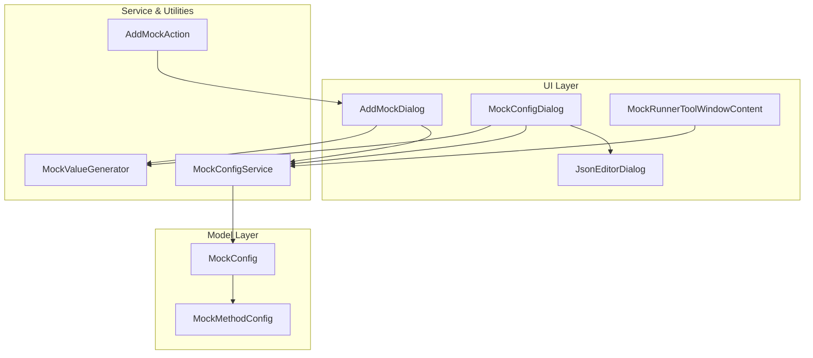
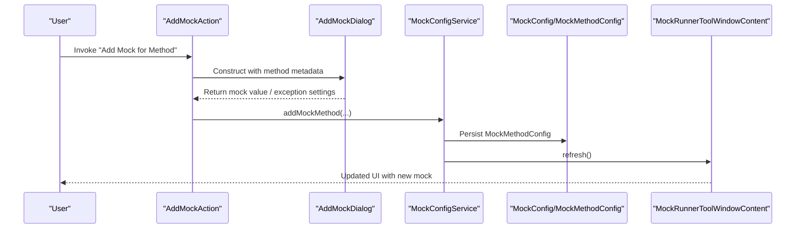
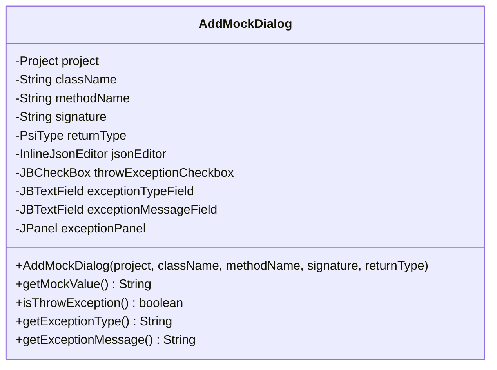
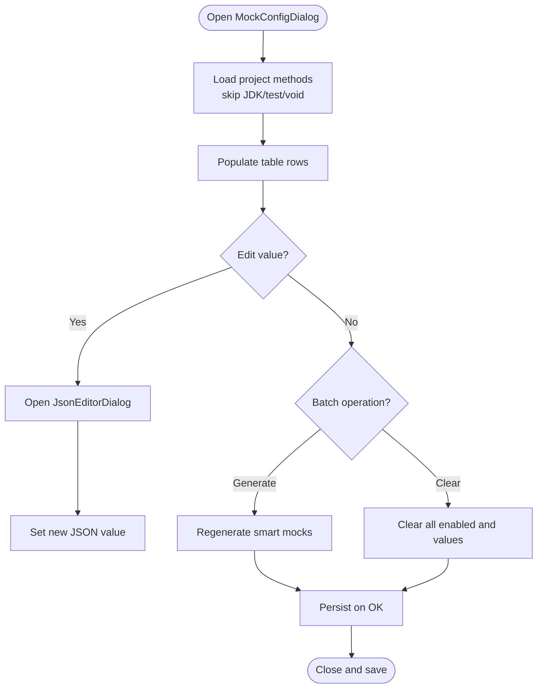
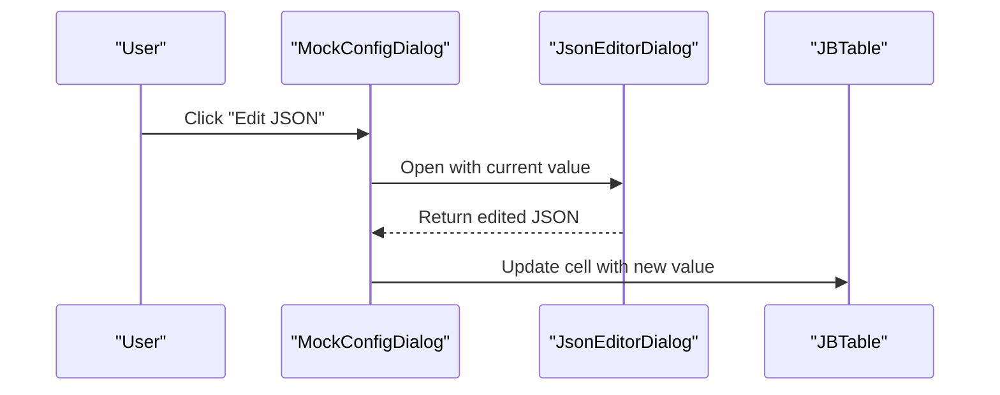
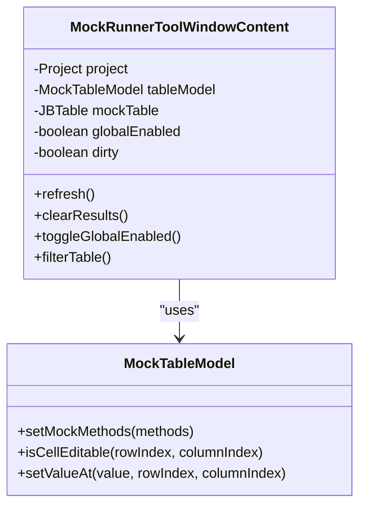
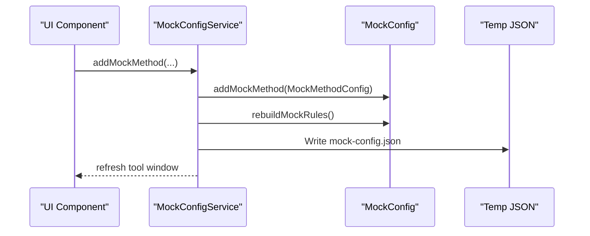
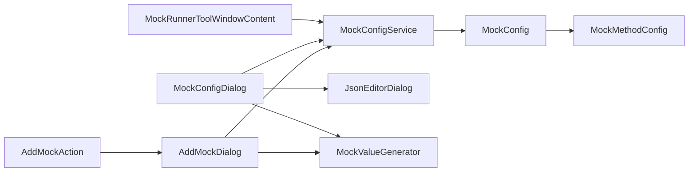

# Configuration Dialog Components

<cite>
**Referenced Files in This Document**
- [AddMockDialog.java](file://src/main/java/io/github/lancelothuxi/idea/plugin/mock/ui/AddMockDialog.java)
- [MockConfigDialog.java](file://src/main/java/io/github/lancelothuxi/idea/plugin/mock/ui/MockConfigDialog.java)
- [JsonEditorDialog.java](file://src/main/java/io/github/lancelothuxi/idea/plugin/mock/ui/JsonEditorDialog.java)
- [MockRunnerToolWindowContent.java](file://src/main/java/io/github/lancelothuxi/idea/plugin/mock/ui/MockRunnerToolWindowContent.java)
- [MockConfig.java](file://src/main/java/io/github/lancelothuxi/idea/plugin/mock/mock/MockConfig.java)
- [MockMethodConfig.java](file://src/main/java/io/github/lancelothuxi/idea/plugin/mock/mock/MockMethodConfig.java)
- [MockConfigService.java](file://src/main/java/io/github/lancelothuxi/idea/plugin/mock/service/MockConfigService.java)
- [MockValueGenerator.java](file://src/main/java/io/github/lancelothuxi/idea/plugin/mock/util/MockValueGenerator.java)
- [AddMockAction.java](file://src/main/java/io/github/lancelothuxi/idea/plugin/mock/action/AddMockAction.java)
</cite>

## Table of Contents
1. [Introduction](#introduction)
2. [Project Structure](#project-structure)
3. [Core Components](#core-components)
4. [Architecture Overview](#architecture-overview)
5. [Detailed Component Analysis](#detailed-component-analysis)
6. [Dependency Analysis](#dependency-analysis)
7. [Performance Considerations](#performance-considerations)
8. [Troubleshooting Guide](#troubleshooting-guide)
9. [Conclusion](#conclusion)
10. [Appendices](#appendices)

## Introduction
This document explains the configuration dialog components used for mock setup and management in the IDE plugin. It focuses on:
- AddMockDialog for adding new mock configurations with method selection, parameter input, and mock type configuration
- MockConfigDialog for comprehensive mock configuration management with validation, preview capabilities, and batch operations
- Dialog lifecycle, validation rules, error handling, and integration with the underlying mock configuration system
- User interface patterns, input validation, and data persistence workflows
- Examples of common dialog usage scenarios and integration with the main tool window interface

## Project Structure
The configuration dialogs are part of the UI layer and integrate with the mock configuration model and persistence service. The primary UI components are:
- AddMockDialog: single-method mock creation dialog
- MockConfigDialog: bulk configuration management dialog
- JsonEditorDialog: JSON value editor with tree/text synchronization
- MockRunnerToolWindowContent: main tool window panel for managing and persisting mock configurations
- MockConfigService: persistent state and temporary file export for runtime agent consumption
- MockConfig and MockMethodConfig: data models for mock rules and method-level configuration
- MockValueGenerator: intelligent default value generation based on return types
- AddMockAction: action that triggers AddMockDialog and persists results

**Diagram sources**
- [AddMockDialog.java](file://src/main/java/io/github/lancelothuxi/idea/plugin/mock/ui/AddMockDialog.java#L16-L184)
- [MockConfigDialog.java](file://src/main/java/io/github/lancelothuxi/idea/plugin/mock/ui/MockConfigDialog.java#L27-L293)
- [JsonEditorDialog.java](file://src/main/java/io/github/lancelothuxi/idea/plugin/mock/ui/JsonEditorDialog.java#L22-L286)
- [MockRunnerToolWindowContent.java](file://src/main/java/io/github/lancelothuxi/idea/plugin/mock/ui/MockRunnerToolWindowContent.java#L22-L449)
- [MockConfig.java](file://src/main/java/io/github/lancelothuxi/idea/plugin/mock/mock/MockConfig.java#L12-L218)
- [MockMethodConfig.java](file://src/main/java/io/github/lancelothuxi/idea/plugin/mock/mock/MockMethodConfig.java#L5-L94)
- [MockConfigService.java](file://src/main/java/io/github/lancelothuxi/idea/plugin/mock/service/MockConfigService.java#L23-L197)
- [MockValueGenerator.java](file://src/main/java/io/github/lancelothuxi/idea/plugin/mock/util/MockValueGenerator.java#L13-L289)
- [AddMockAction.java](file://src/main/java/io/github/lancelothuxi/idea/plugin/mock/action/AddMockAction.java#L15-L106)

**Section sources**
- [AddMockDialog.java](file://src/main/java/io/github/lancelothuxi/idea/plugin/mock/ui/AddMockDialog.java#L16-L184)
- [MockConfigDialog.java](file://src/main/java/io/github/lancelothuxi/idea/plugin/mock/ui/MockConfigDialog.java#L27-L293)
- [JsonEditorDialog.java](file://src/main/java/io/github/lancelothuxi/idea/plugin/mock/ui/JsonEditorDialog.java#L22-L286)
- [MockRunnerToolWindowContent.java](file://src/main/java/io/github/lancelothuxi/idea/plugin/mock/ui/MockRunnerToolWindowContent.java#L22-L449)
- [MockConfig.java](file://src/main/java/io/github/lancelothuxi/idea/plugin/mock/mock/MockConfig.java#L12-L218)
- [MockMethodConfig.java](file://src/main/java/io/github/lancelothuxi/idea/plugin/mock/mock/MockMethodConfig.java#L5-L94)
- [MockConfigService.java](file://src/main/java/io/github/lancelothuxi/idea/plugin/mock/service/MockConfigService.java#L23-L197)
- [MockValueGenerator.java](file://src/main/java/io/github/lancelothuxi/idea/plugin/mock/util/MockValueGenerator.java#L13-L289)
- [AddMockAction.java](file://src/main/java/io/github/lancelothuxi/idea/plugin/mock/action/AddMockAction.java#L15-L106)

## Core Components
- AddMockDialog: captures method metadata and mock configuration (return value or exception), generates defaults via MockValueGenerator, and persists via MockConfigService
- MockConfigDialog: enumerates project methods, allows enabling/disabling, editing return values via JsonEditorDialog, and batch operations (smart generation, clear all)
- JsonEditorDialog: validates and formats JSON, supports tree-based editing and synchronization
- MockRunnerToolWindowContent: main panel for viewing, filtering, paging, toggling global enablement, saving, and clearing mock configurations
- MockConfigService: manages persistent state, rebuilds mock rules, writes temporary JSON for agent consumption, and updates UI
- MockConfig/MockMethodConfig: stores method-level mock rules and inferred return types
- MockValueGenerator: produces sensible defaults for complex return types (objects, collections, primitives)
- AddMockAction: integrates dialogs with the editor context and triggers persistence

**Section sources**
- [AddMockDialog.java](file://src/main/java/io/github/lancelothuxi/idea/plugin/mock/ui/AddMockDialog.java#L16-L184)
- [MockConfigDialog.java](file://src/main/java/io/github/lancelothuxi/idea/plugin/mock/ui/MockConfigDialog.java#L27-L293)
- [JsonEditorDialog.java](file://src/main/java/io/github/lancelothuxi/idea/plugin/mock/ui/JsonEditorDialog.java#L22-L286)
- [MockRunnerToolWindowContent.java](file://src/main/java/io/github/lancelothuxi/idea/plugin/mock/ui/MockRunnerToolWindowContent.java#L22-L449)
- [MockConfigService.java](file://src/main/java/io/github/lancelothuxi/idea/plugin/mock/service/MockConfigService.java#L23-L197)
- [MockConfig.java](file://src/main/java/io/github/lancelothuxi/idea/plugin/mock/mock/MockConfig.java#L12-L218)
- [MockMethodConfig.java](file://src/main/java/io/github/lancelothuxi/idea/plugin/mock/mock/MockMethodConfig.java#L5-L94)
- [MockValueGenerator.java](file://src/main/java/io/github/lancelothuxi/idea/plugin/mock/util/MockValueGenerator.java#L13-L289)
- [AddMockAction.java](file://src/main/java/io/github/lancelothuxi/idea/plugin/mock/action/AddMockAction.java#L15-L106)

## Architecture Overview
The dialogs are tightly coupled with the mock configuration model and service layer. AddMockDialog and MockConfigDialog both write to MockConfigService, which persists state and synchronizes with the tool window and temporary JSON for the agent.

**Diagram sources**
- [AddMockAction.java](file://src/main/java/io/github/lancelothuxi/idea/plugin/mock/action/AddMockAction.java#L22-L82)
- [AddMockDialog.java](file://src/main/java/io/github/lancelothuxi/idea/plugin/mock/ui/AddMockDialog.java#L29-L40)
- [MockConfigService.java](file://src/main/java/io/github/lancelothuxi/idea/plugin/mock/service/MockConfigService.java#L109-L151)
- [MockRunnerToolWindowContent.java](file://src/main/java/io/github/lancelothuxi/idea/plugin/mock/ui/MockRunnerToolWindowContent.java#L312-L334)

## Detailed Component Analysis

### AddMockDialog
Purpose:
- Capture method metadata (class, method, signature, return type)
- Provide JSON editor for return value with intelligent defaults
- Optional exception configuration (type and message)
- Persist configuration via MockConfigService

UI Pattern:
- Top info panel displays class, method, and return type
- Center panel hosts InlineJsonEditor initialized with MockValueGenerator defaults
- Bottom panel toggles exception mode and controls availability of JSON editor

Validation and Error Handling:
- Prevents mocking void methods; warns user and aborts
- Exception mode enables/disables JSON editor and exception fields accordingly

Lifecycle:
- Constructor sets title and size, initializes UI
- createCenterPanel builds panels and delegates to helper methods
- Accessors return selected configuration

**Diagram sources**
- [AddMockDialog.java](file://src/main/java/io/github/lancelothuxi/idea/plugin/mock/ui/AddMockDialog.java#L16-L184)

**Section sources**
- [AddMockDialog.java](file://src/main/java/io/github/lancelothuxi/idea/plugin/mock/ui/AddMockDialog.java#L16-L184)
- [MockValueGenerator.java](file://src/main/java/io/github/lancelothuxi/idea/plugin/mock/util/MockValueGenerator.java#L18-L100)

### MockConfigDialog
Purpose:
- Bulk manage mock configurations across project methods
- Enable/disable per method, edit return values, and generate smart mocks
- Provide JSON editor per row via JsonEditorDialog

UI Pattern:
- Table with columns: Enabled, Class, Method, Return Type, Mock Value, Edit
- Edit column uses custom renderer/editor to open JsonEditorDialog
- Toolbar buttons: Generate Smart Mocks, Clear All
- Loads methods from PSI, filters JDK/test classes, skips void returns

Validation and Error Handling:
- doOKAction iterates rows and adds enabled, non-empty mock values to MockConfig
- Uses MockValueGenerator defaults when no existing rule exists

Lifecycle:
- createCenterPanel constructs table, loads methods, sets renderers/editors
- generateSmartMocks regenerates values for enabled rows
- clearAllMocks clears enabled flag and values
- doOKAction persists to MockConfig and calls super

**Diagram sources**
- [MockConfigDialog.java](file://src/main/java/io/github/lancelothuxi/idea/plugin/mock/ui/MockConfigDialog.java#L44-L210)
- [JsonEditorDialog.java](file://src/main/java/io/github/lancelothuxi/idea/plugin/mock/ui/JsonEditorDialog.java#L22-L286)

**Section sources**
- [MockConfigDialog.java](file://src/main/java/io/github/lancelothuxi/idea/plugin/mock/ui/MockConfigDialog.java#L27-L293)
- [JsonEditorDialog.java](file://src/main/java/io/github/lancelothuxi/idea/plugin/mock/ui/JsonEditorDialog.java#L22-L286)

### JsonEditorDialog
Purpose:
- Validate and format JSON
- Visual tree editor with add/remove/edit operations
- Sync between tree and text views

Validation and Error Handling:
- doOKAction validates JSON before accepting
- formatJson and validateJson provide user feedback
- updateTreeFromJson handles invalid JSON with error dialog

UI Pattern:
- Split pane: left tree view, right text area
- Buttons: Format JSON, Validate, Sync from Text, Sync to Text
- Simplified tree-to-text sync with informational message

**Diagram sources**
- [MockConfigDialog.java](file://src/main/java/io/github/lancelothuxi/idea/plugin/mock/ui/MockConfigDialog.java#L253-L273)
- [JsonEditorDialog.java](file://src/main/java/io/github/lancelothuxi/idea/plugin/mock/ui/JsonEditorDialog.java#L124-L286)

**Section sources**
- [JsonEditorDialog.java](file://src/main/java/io/github/lancelothuxi/idea/plugin/mock/ui/JsonEditorDialog.java#L22-L286)

### MockRunnerToolWindowContent
Purpose:
- Central panel for managing mock configurations
- Filtering, sorting, pagination, global enable/disable toggle
- Dirty state tracking and save/clear/refresh actions

UI Pattern:
- Search box filters rows
- Global toggle switches all mock enabled flags
- Save persists to MockConfigService and clears dirty flag
- Clear All prompts and clears all, then refreshes UI

Lifecycle:
- Initializes table model, sorters, editors/renderers
- loadMockConfigs fetches from MockConfigService and updates UI
- refresh handles unsaved changes and reloads data

**Diagram sources**
- [MockRunnerToolWindowContent.java](file://src/main/java/io/github/lancelothuxi/idea/plugin/mock/ui/MockRunnerToolWindowContent.java#L22-L449)

**Section sources**
- [MockRunnerToolWindowContent.java](file://src/main/java/io/github/lancelothuxi/idea/plugin/mock/ui/MockRunnerToolWindowContent.java#L22-L449)

### MockConfigService
Purpose:
- Persistent state management for mock configurations
- Rebuilds MockRule entries from MockMethodConfig
- Writes temporary JSON for agent consumption
- Updates tool window after load/save

Key Behaviors:
- getState/loadState serialize/deserialize MockConfig
- saveConfig rebuilds rules and writes JSON to temp directory
- addMockMethod/removeMockMethod/update UI and editors
- clearAll clears and refreshes UI

**Diagram sources**
- [MockConfigService.java](file://src/main/java/io/github/lancelothuxi/idea/plugin/mock/service/MockConfigService.java#L41-L58)
- [MockConfig.java](file://src/main/java/io/github/lancelothuxi/idea/plugin/mock/mock/MockConfig.java#L33-L86)

**Section sources**
- [MockConfigService.java](file://src/main/java/io/github/lancelothuxi/idea/plugin/mock/service/MockConfigService.java#L23-L197)
- [MockConfig.java](file://src/main/java/io/github/lancelothuxi/idea/plugin/mock/mock/MockConfig.java#L12-L218)

### MockValueGenerator
Purpose:
- Generate sensible default JSON values based on PSI return types
- Handles primitives, arrays, collections, and complex objects
- Prevents infinite recursion with a processing set

Usage:
- AddMockDialog initializes JSON editor with generated value
- MockConfigDialog pre-fills table cells with generated values

**Section sources**
- [MockValueGenerator.java](file://src/main/java/io/github/lancelothuxi/idea/plugin/mock/util/MockValueGenerator.java#L13-L289)
- [AddMockDialog.java](file://src/main/java/io/github/lancelothuxi/idea/plugin/mock/ui/AddMockDialog.java#L105-L117)
- [MockConfigDialog.java](file://src/main/java/io/github/lancelothuxi/idea/plugin/mock/ui/MockConfigDialog.java#L138-L144)

### AddMockAction
Purpose:
- Context-aware action to add mocks from the editor
- Validates method selection and return type
- Opens AddMockDialog and persists results

**Section sources**
- [AddMockAction.java](file://src/main/java/io/github/lancelothuxi/idea/plugin/mock/action/AddMockAction.java#L15-L106)

## Dependency Analysis
High-level dependencies:
- UI dialogs depend on MockConfigService for persistence and on MockValueGenerator for defaults
- MockRunnerToolWindowContent depends on MockConfigService for data and UI updates
- MockConfigService depends on MockConfig and MockMethodConfig for state representation
- MockConfigService writes to a temporary JSON file consumed by the agent

**Diagram sources**
- [AddMockAction.java](file://src/main/java/io/github/lancelothuxi/idea/plugin/mock/action/AddMockAction.java#L22-L82)
- [AddMockDialog.java](file://src/main/java/io/github/lancelothuxi/idea/plugin/mock/ui/AddMockDialog.java#L29-L40)
- [MockConfigDialog.java](file://src/main/java/io/github/lancelothuxi/idea/plugin/mock/ui/MockConfigDialog.java#L253-L273)
- [JsonEditorDialog.java](file://src/main/java/io/github/lancelothuxi/idea/plugin/mock/ui/JsonEditorDialog.java#L22-L286)
- [MockRunnerToolWindowContent.java](file://src/main/java/io/github/lancelothuxi/idea/plugin/mock/ui/MockRunnerToolWindowContent.java#L110-L122)
- [MockConfigService.java](file://src/main/java/io/github/lancelothuxi/idea/plugin/mock/service/MockConfigService.java#L109-L151)
- [MockConfig.java](file://src/main/java/io/github/lancelothuxi/idea/plugin/mock/mock/MockConfig.java#L12-L218)
- [MockMethodConfig.java](file://src/main/java/io/github/lancelothuxi/idea/plugin/mock/mock/MockMethodConfig.java#L5-L94)
- [MockValueGenerator.java](file://src/main/java/io/github/lancelothuxi/idea/plugin/mock/util/MockValueGenerator.java#L13-L289)

**Section sources**
- [MockConfigService.java](file://src/main/java/io/github/lancelothuxi/idea/plugin/mock/service/MockConfigService.java#L23-L197)
- [MockConfig.java](file://src/main/java/io/github/lancelothuxi/idea/plugin/mock/mock/MockConfig.java#L12-L218)
- [MockMethodConfig.java](file://src/main/java/io/github/lancelothuxi/idea/plugin/mock/mock/MockMethodConfig.java#L5-L94)

## Performance Considerations
- MockConfigDialog scans project classes and methods; avoid frequent re-invocation during large projects
- Smart mock generation recomputes values for enabled rows; batch operations are efficient but still iterate the table
- MockValueGenerator uses PSI resolution; caching within a session reduces repeated work
- Tool window pagination limits rendering overhead for large datasets

## Troubleshooting Guide
Common issues and resolutions:
- Cannot mock void methods: AddMockAction prevents mocking methods with void return type and shows a warning
- Invalid JSON in dialogs: JsonEditorDialog validates JSON on OK and shows error messages; use Format JSON and Validate to fix
- Conflicting mock configurations: MockConfigService.addMockMethod updates existing entries; verify uniqueness by class.method.signature
- Tool window not updating: Ensure MockRunnerToolWindowContent.refresh is called after changes; check for unsaved changes prompt
- Temporary JSON not written: Verify permissions and temp directory existence; check logs for errors during saveConfig

**Section sources**
- [AddMockAction.java](file://src/main/java/io/github/lancelothuxi/idea/plugin/mock/action/AddMockAction.java#L50-L58)
- [JsonEditorDialog.java](file://src/main/java/io/github/lancelothuxi/idea/plugin/mock/ui/JsonEditorDialog.java#L193-L210)
- [MockConfigService.java](file://src/main/java/io/github/lancelothuxi/idea/plugin/mock/service/MockConfigService.java#L41-L58)

## Conclusion
The configuration dialog components provide a cohesive workflow for adding and managing mock configurations:
- AddMockDialog streamlines single-method mock creation with intelligent defaults
- MockConfigDialog offers bulk management with validation and batch operations
- JsonEditorDialog ensures robust JSON editing and validation
- MockRunnerToolWindowContent delivers a full-featured management interface with persistence and UI updates
- MockConfigService bridges UI and persistence, ensuring reliable state and agent integration

## Appendices

### Dialog Lifecycle and Validation Rules
- AddMockDialog lifecycle: construct, show, collect inputs, persist via MockConfigService
- MockConfigDialog lifecycle: construct, load methods, edit rows, validate on OK, persist
- JsonEditorDialog lifecycle: construct, validate on OK, format/sync helpers
- Validation rules:
  - Void methods are rejected by AddMockAction
  - JSON must be valid before accepting in JsonEditorDialog
  - Only enabled, non-empty values are persisted by MockConfigDialog.doOKAction

**Section sources**
- [AddMockAction.java](file://src/main/java/io/github/lancelothuxi/idea/plugin/mock/action/AddMockAction.java#L50-L58)
- [JsonEditorDialog.java](file://src/main/java/io/github/lancelothuxi/idea/plugin/mock/ui/JsonEditorDialog.java#L275-L285)
- [MockConfigDialog.java](file://src/main/java/io/github/lancelothuxi/idea/plugin/mock/ui/MockConfigDialog.java#L192-L210)

### Integration Scenarios
- Adding a single method mock:
  - Invoke AddMockAction from editor context
  - Configure return value or exception in AddMockDialog
  - Persist via MockConfigService and observe in MockRunnerToolWindowContent
- Managing multiple methods:
  - Open MockConfigDialog
  - Enable desired methods, edit values via JSON editor
  - Use Generate Smart Mocks and Clear All for batch operations
  - Save via Tool Window toolbar

**Section sources**
- [AddMockAction.java](file://src/main/java/io/github/lancelothuxi/idea/plugin/mock/action/AddMockAction.java#L22-L82)
- [MockConfigDialog.java](file://src/main/java/io/github/lancelothuxi/idea/plugin/mock/ui/MockConfigDialog.java#L95-L103)
- [MockRunnerToolWindowContent.java](file://src/main/java/io/github/lancelothuxi/idea/plugin/mock/ui/MockRunnerToolWindowContent.java#L110-L122)