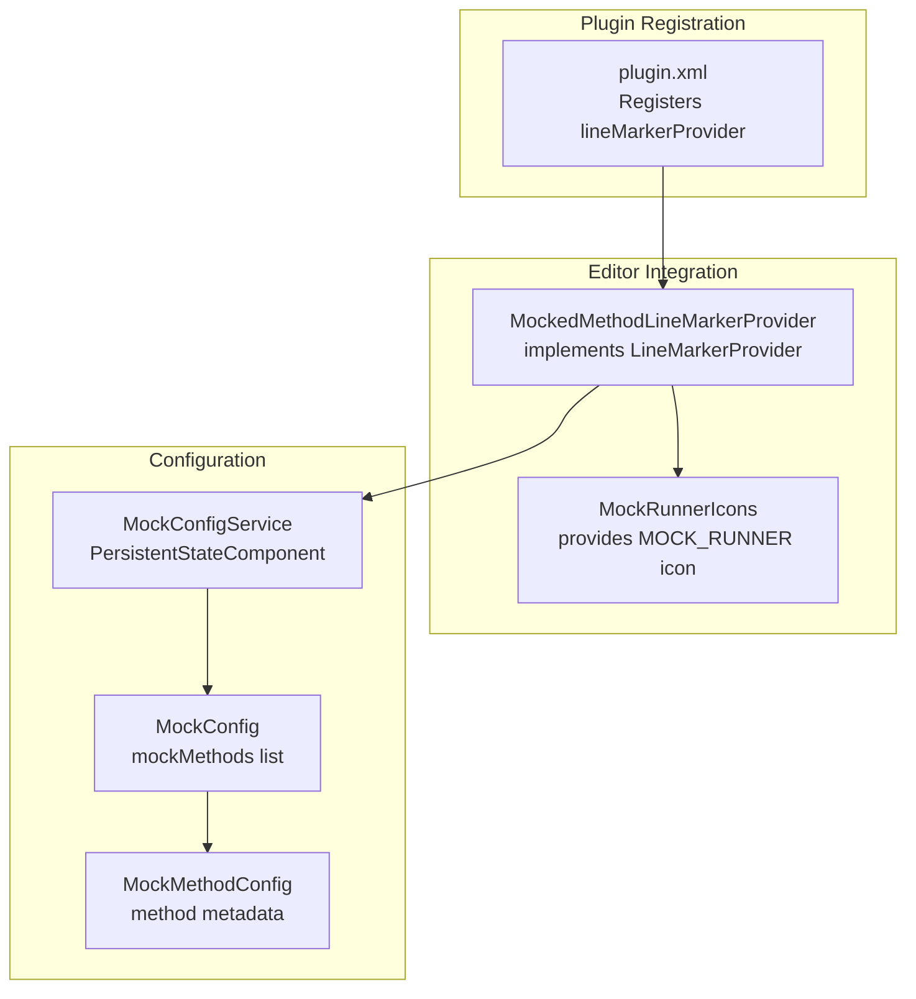
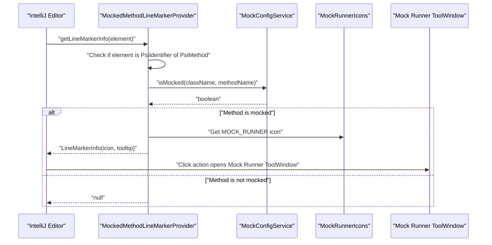
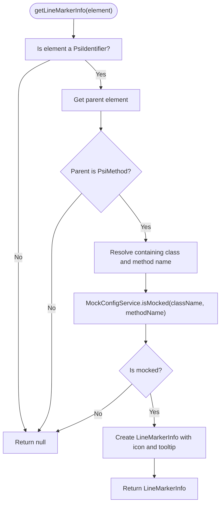
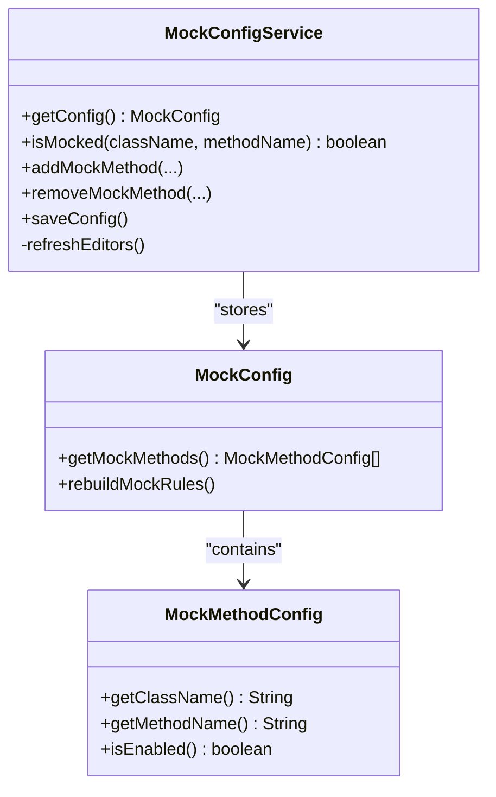
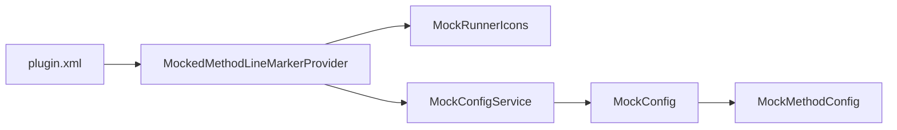

# Gutter Icons and Markers

<cite>
**Referenced Files in This Document**
- [MockedMethodLineMarkerProvider.java](file://src/main/java/io/github/lancelothuxi/idea/plugin/mock/marker/MockedMethodLineMarkerProvider.java)
- [MockRunnerIcons.java](file://src/main/java/io/github/lancelothuxi/idea/plugin/mock/MockRunnerIcons.java)
- [MockConfigService.java](file://src/main/java/io/github/lancelothuxi/idea/plugin/mock/service/MockConfigService.java)
- [MockConfig.java](file://src/main/java/io/github/lancelothuxi/idea/plugin/mock/mock/MockConfig.java)
- [MockMethodConfig.java](file://src/main/java/io/github/lancelothuxi/idea/plugin/mock/mock/MockMethodConfig.java)
- [plugin.xml](file://src/main/resources/META-INF/plugin.xml)
- [MOCK_PERSISTENCE_GUIDE.md](file://docs/MOCK_PERSISTENCE_GUIDE.md)
</cite>

## Table of Contents
1. [Introduction](#introduction)
2. [Project Structure](#project-structure)
3. [Core Components](#core-components)
4. [Architecture Overview](#architecture-overview)
5. [Detailed Component Analysis](#detailed-component-analysis)
6. [Dependency Analysis](#dependency-analysis)
7. [Performance Considerations](#performance-considerations)
8. [Troubleshooting Guide](#troubleshooting-guide)
9. [Conclusion](#conclusion)

## Introduction
This document explains the gutter icon system that highlights mocked methods in the IDE editor. It focuses on the MockedMethodLineMarkerProvider implementation, how it integrates with IntelliJ Platform’s line marker infrastructure, how icons are rendered, what tooltip information is shown, and how users can navigate to mock configuration from the editor. It also covers performance considerations for large codebases, customization options, and practical examples of gutter icon behavior.

## Project Structure
The gutter icon feature is implemented as part of the Mock Runner plugin. Key elements:
- Line marker provider registration via plugin.xml
- A line marker provider that inspects PSI elements and decides whether to show a gutter icon
- An icon resource loaded via MockRunnerIcons
- A configuration service that stores mock rules and exposes a method to check if a method is mocked
- Supporting configuration models that define mock method metadata

**Diagram sources**
- [plugin.xml](file://src/main/resources/META-INF/plugin.xml#L39-L43)
- [MockedMethodLineMarkerProvider.java](file://src/main/java/io/github/lancelothuxi/idea/plugin/mock/marker/MockedMethodLineMarkerProvider.java#L19-L62)
- [MockRunnerIcons.java](file://src/main/java/io/github/lancelothuxi/idea/plugin/mock/MockRunnerIcons.java#L7-L14)
- [MockConfigService.java](file://src/main/java/io/github/lancelothuxi/idea/plugin/mock/service/MockConfigService.java#L23-L36)
- [MockConfig.java](file://src/main/java/io/github/lancelothuxi/idea/plugin/mock/mock/MockConfig.java#L12-L218)
- [MockMethodConfig.java](file://src/main/java/io/github/lancelothuxi/idea/plugin/mock/mock/MockMethodConfig.java#L5-L94)

**Section sources**
- [plugin.xml](file://src/main/resources/META-INF/plugin.xml#L39-L43)
- [MockedMethodLineMarkerProvider.java](file://src/main/java/io/github/lancelothuxi/idea/plugin/mock/marker/MockedMethodLineMarkerProvider.java#L1-L62)
- [MockRunnerIcons.java](file://src/main/java/io/github/lancelothuxi/idea/plugin/mock/MockRunnerIcons.java#L1-L15)
- [MockConfigService.java](file://src/main/java/io/github/lancelothuxi/idea/plugin/mock/service/MockConfigService.java#L1-L197)
- [MockConfig.java](file://src/main/java/io/github/lancelothuxi/idea/plugin/mock/mock/MockConfig.java#L1-L218)
- [MockMethodConfig.java](file://src/main/java/io/github/lancelothuxi/idea/plugin/mock/mock/MockMethodConfig.java#L1-L94)

## Core Components
- MockedMethodLineMarkerProvider: Detects mocked methods and renders a gutter icon. It checks if a PsiIdentifier belongs to a PsiMethod, resolves the containing class, and queries MockConfigService to determine if the method is mocked. If so, it creates a LineMarkerInfo with the MockRunner icon and tooltip.
- MockRunnerIcons: Provides the icon resource used for the gutter marker.
- MockConfigService: Persistent state component that stores mock configuration and exposes isMocked to the line marker provider. It also triggers editor refreshes to update markers.
- MockConfig and MockMethodConfig: Define the data model for mock methods and rules.

Key responsibilities:
- Line marker detection and rendering
- Tooltip generation
- Navigation trigger (via click action)
- Persistence and refresh lifecycle

**Section sources**
- [MockedMethodLineMarkerProvider.java](file://src/main/java/io/github/lancelothuxi/idea/plugin/mock/marker/MockedMethodLineMarkerProvider.java#L19-L62)
- [MockRunnerIcons.java](file://src/main/java/io/github/lancelothuxi/idea/plugin/mock/MockRunnerIcons.java#L7-L14)
- [MockConfigService.java](file://src/main/java/io/github/lancelothuxi/idea/plugin/mock/service/MockConfigService.java#L187-L196)
- [MockConfig.java](file://src/main/java/io/github/lancelothuxi/idea/plugin/mock/mock/MockConfig.java#L124-L142)
- [MockMethodConfig.java](file://src/main/java/io/github/lancelothuxi/idea/plugin/mock/mock/MockMethodConfig.java#L18-L94)

## Architecture Overview
The gutter icon system integrates with IntelliJ Platform’s line marker infrastructure. The provider participates in the Java language scope and is invoked during code analysis. When a method identifier is encountered, the provider queries the mock configuration service. If the method is marked as mocked, a line marker is returned with an icon and tooltip. Clicking the icon triggers a click action that navigates to the mock configuration UI.

**Diagram sources**
- [MockedMethodLineMarkerProvider.java](file://src/main/java/io/github/lancelothuxi/idea/plugin/mock/marker/MockedMethodLineMarkerProvider.java#L21-L61)
- [MockRunnerIcons.java](file://src/main/java/io/github/lancelothuxi/idea/plugin/mock/MockRunnerIcons.java#L9-L9)
- [MockConfigService.java](file://src/main/java/io/github/lancelothuxi/idea/plugin/mock/service/MockConfigService.java#L187-L190)
- [plugin.xml](file://src/main/resources/META-INF/plugin.xml#L30-L33)

## Detailed Component Analysis

### MockedMethodLineMarkerProvider
Responsibilities:
- Inspect PSI elements to detect method identifiers
- Resolve containing class and method name
- Query MockConfigService.isMocked
- Create LineMarkerInfo with icon, tooltip, alignment, and optional click action

Behavior:
- Only activates for Java language scope via plugin.xml
- Filters to PsiIdentifier inside PsiMethod
- Uses left-aligned gutter icon renderer
- Tooltip indicates “This method is mocked”
- Click action is intentionally null in the provider; navigation is handled by the platform’s default click behavior associated with the line marker

**Diagram sources**
- [MockedMethodLineMarkerProvider.java](file://src/main/java/io/github/lancelothuxi/idea/plugin/mock/marker/MockedMethodLineMarkerProvider.java#L21-L61)

**Section sources**
- [MockedMethodLineMarkerProvider.java](file://src/main/java/io/github/lancelothuxi/idea/plugin/mock/marker/MockedMethodLineMarkerProvider.java#L19-L62)
- [plugin.xml](file://src/main/resources/META-INF/plugin.xml#L39-L43)

### Icon Rendering and Tooltip
- Icon: Loaded via MockRunnerIcons.MOCK_RUNNER from SVG resources
- Tooltip: Provided inline as a lambda returning a constant string
- Alignment: Left gutter
- Click action: Not defined in the provider; relies on platform default behavior

Customization:
- Replace the icon resource and update MockRunnerIcons
- Adjust tooltip text generation in the provider
- Change alignment by modifying the LineMarkerInfo constructor argument

**Section sources**
- [MockRunnerIcons.java](file://src/main/java/io/github/lancelothuxi/idea/plugin/mock/MockRunnerIcons.java#L7-L14)
- [MockedMethodLineMarkerProvider.java](file://src/main/java/io/github/lancelothuxi/idea/plugin/mock/marker/MockedMethodLineMarkerProvider.java#L48-L57)

### Mock Configuration Integration
- MockConfigService persists mock configuration and exposes isMocked
- isMocked checks mockMethods list for a matching class and method
- Adding/removing mock methods triggers editor refresh via DaemonCodeAnalyzer.restart
- Tool window updates are coordinated to reflect current mock state

**Diagram sources**
- [MockConfigService.java](file://src/main/java/io/github/lancelothuxi/idea/plugin/mock/service/MockConfigService.java#L23-L36)
- [MockConfigService.java](file://src/main/java/io/github/lancelothuxi/idea/plugin/mock/service/MockConfigService.java#L187-L196)
- [MockConfig.java](file://src/main/java/io/github/lancelothuxi/idea/plugin/mock/mock/MockConfig.java#L12-L218)
- [MockMethodConfig.java](file://src/main/java/io/github/lancelothuxi/idea/plugin/mock/mock/MockMethodConfig.java#L5-L94)

**Section sources**
- [MockConfigService.java](file://src/main/java/io/github/lancelothuxi/idea/plugin/mock/service/MockConfigService.java#L187-L196)
- [MockConfig.java](file://src/main/java/io/github/lancelothuxi/idea/plugin/mock/mock/MockConfig.java#L124-L142)
- [MockMethodConfig.java](file://src/main/java/io/github/lancelothuxi/idea/plugin/mock/mock/MockMethodConfig.java#L18-L94)

### Navigation to Mock Configuration
- The gutter icon is integrated with IntelliJ’s line marker system; clicking the icon triggers the platform’s default click action for line markers
- The Mock Runner ToolWindow is registered in plugin.xml and becomes the target for navigation
- Users can open the ToolWindow from the IDE tool window area and manage mock configurations

Practical example:
- After adding a mock via the UI, the editor immediately reflects the change because MockConfigService.refreshEditors invokes DaemonCodeAnalyzer.restart
- The ToolWindow shows the added mock and allows editing, enabling/disabling, and saving

**Section sources**
- [plugin.xml](file://src/main/resources/META-INF/plugin.xml#L30-L33)
- [MockConfigService.java](file://src/main/java/io/github/lancelothuxi/idea/plugin/mock/service/MockConfigService.java#L149-L151)

## Dependency Analysis
- Plugin registration depends on IntelliJ Platform extension points
- Line marker provider depends on PSI inspection and MockConfigService
- MockConfigService depends on MockConfig and MockMethodConfig
- Icons depend on resource loading via IconLoader

**Diagram sources**
- [plugin.xml](file://src/main/resources/META-INF/plugin.xml#L39-L43)
- [MockedMethodLineMarkerProvider.java](file://src/main/java/io/github/lancelothuxi/idea/plugin/mock/marker/MockedMethodLineMarkerProvider.java#L3-L13)
- [MockRunnerIcons.java](file://src/main/java/io/github/lancelothuxi/idea/plugin/mock/MockRunnerIcons.java#L9-L9)
- [MockConfigService.java](file://src/main/java/io/github/lancelothuxi/idea/plugin/mock/service/MockConfigService.java#L23-L36)
- [MockConfig.java](file://src/main/java/io/github/lancelothuxi/idea/plugin/mock/mock/MockConfig.java#L12-L218)
- [MockMethodConfig.java](file://src/main/java/io/github/lancelothuxi/idea/plugin/mock/mock/MockMethodConfig.java#L5-L94)

**Section sources**
- [plugin.xml](file://src/main/resources/META-INF/plugin.xml#L39-L43)
- [MockedMethodLineMarkerProvider.java](file://src/main/java/io/github/lancelothuxi/idea/plugin/mock/marker/MockedMethodLineMarkerProvider.java#L1-L62)
- [MockConfigService.java](file://src/main/java/io/github/lancelothuxi/idea/plugin/mock/service/MockConfigService.java#L1-L197)

## Performance Considerations
- Scope filtering: The provider runs only for Java language scope, minimizing overhead in other languages
- Lightweight PSI checks: The provider verifies element type and parent type before querying configuration
- Efficient lookup: isMocked performs a linear scan over mockMethods; for large projects, consider:
  - Indexing by className.methodName for O(1) lookup
  - Caching recent lookups per file session
  - Limiting marker computation to visible editor regions
- Editor refresh: refreshEditors triggers DaemonCodeAnalyzer.restart; avoid frequent calls by batching configuration updates
- Icon loading: Icons are loaded once and reused; keep icon assets small and vector-based for scalability

[No sources needed since this section provides general guidance]

## Troubleshooting Guide
Common issues and resolutions:
- Gutter icon not appearing
  - Verify plugin.xml registers the line marker provider for Java language
  - Confirm the method is present in MockConfigService.mockMethods
  - Ensure MockConfigService.refreshEditors was called after adding mocks
- Tooltip not visible
  - Tooltip text is provided inline; confirm the provider returns a LineMarkerInfo with tooltip
- Icon not displayed
  - Ensure MockRunnerIcons.MOCK_RUNNER loads correctly from resources
- ToolWindow not updating
  - Check MockRunnerToolWindowContent.refresh is invoked after configuration changes
- Persistence problems
  - Review MOCK_PERSISTENCE_GUIDE for expected XML location and state transitions

**Section sources**
- [plugin.xml](file://src/main/resources/META-INF/plugin.xml#L39-L43)
- [MockedMethodLineMarkerProvider.java](file://src/main/java/io/github/lancelothuxi/idea/plugin/mock/marker/MockedMethodLineMarkerProvider.java#L48-L57)
- [MockConfigService.java](file://src/main/java/io/github/lancelothuxi/idea/plugin/mock/service/MockConfigService.java#L187-L196)
- [MOCK_PERSISTENCE_GUIDE.md](file://docs/MOCK_PERSISTENCE_GUIDE.md#L18-L31)

## Conclusion
The gutter icon system provides a concise, visual indicator of mocked methods directly in the editor. It leverages IntelliJ’s line marker infrastructure, integrates with persistent mock configuration, and offers immediate feedback to developers. By combining lightweight PSI checks, efficient configuration lookups, and targeted editor refreshes, the system remains responsive even in large codebases. Users can quickly navigate to mock configuration via the ToolWindow, streamlining the development workflow.