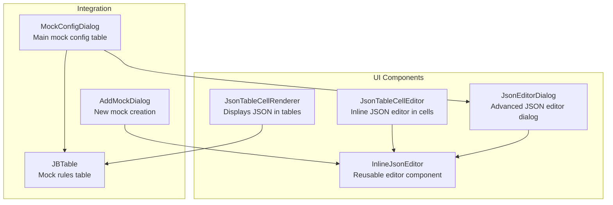
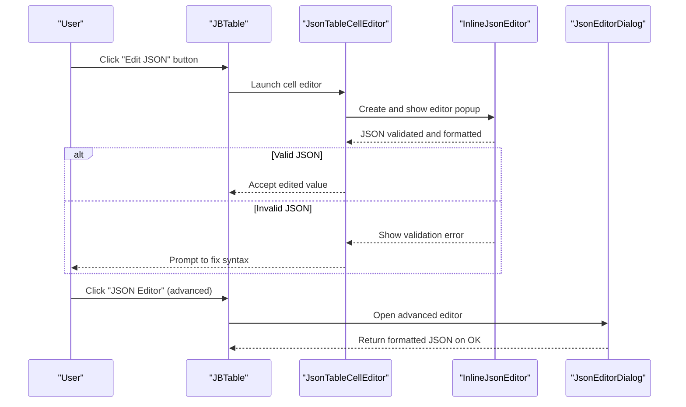
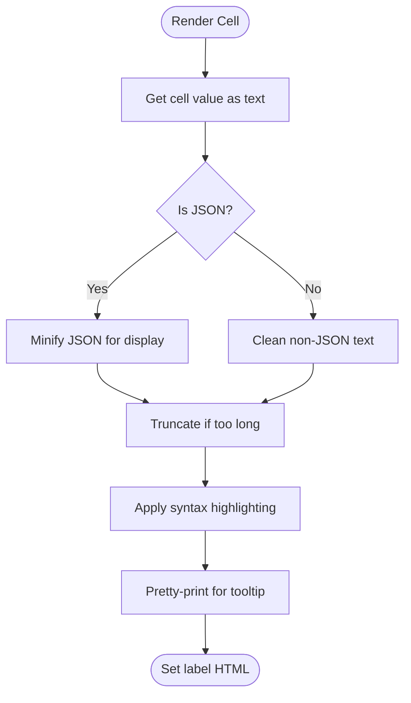
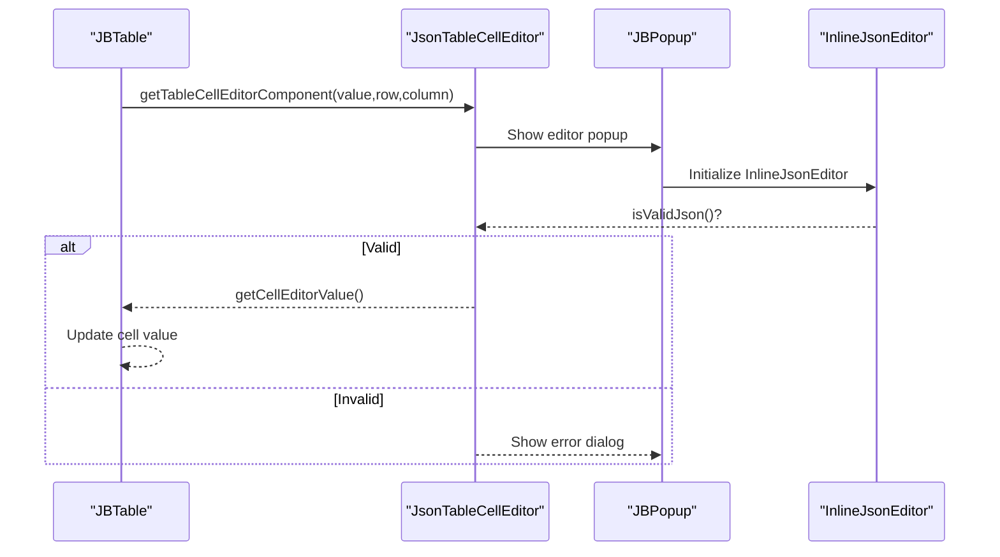
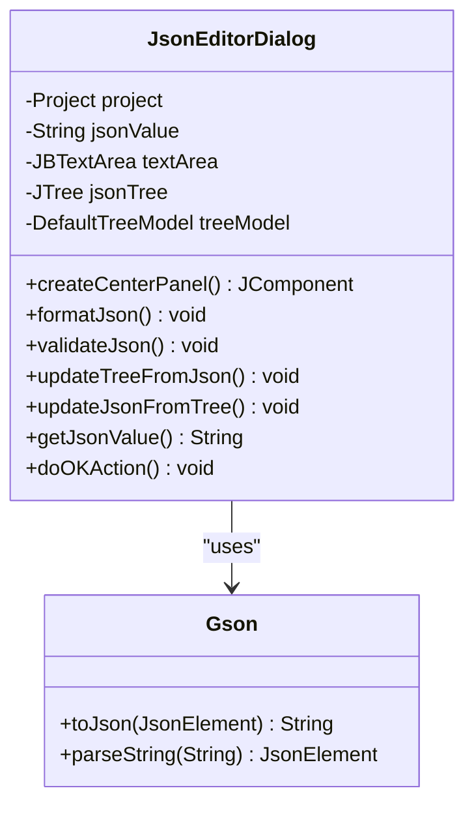
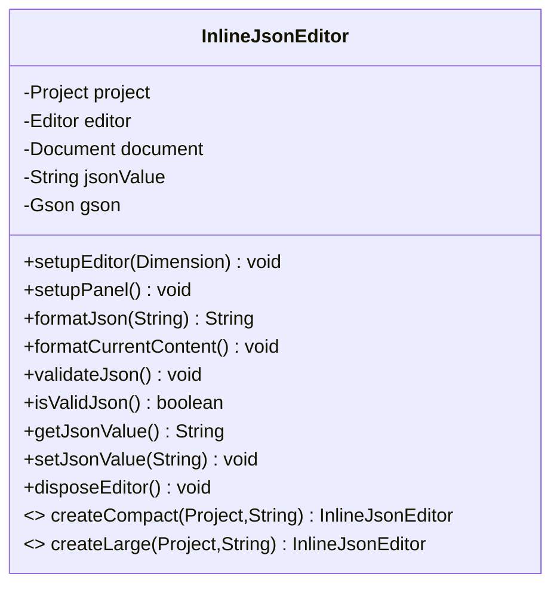
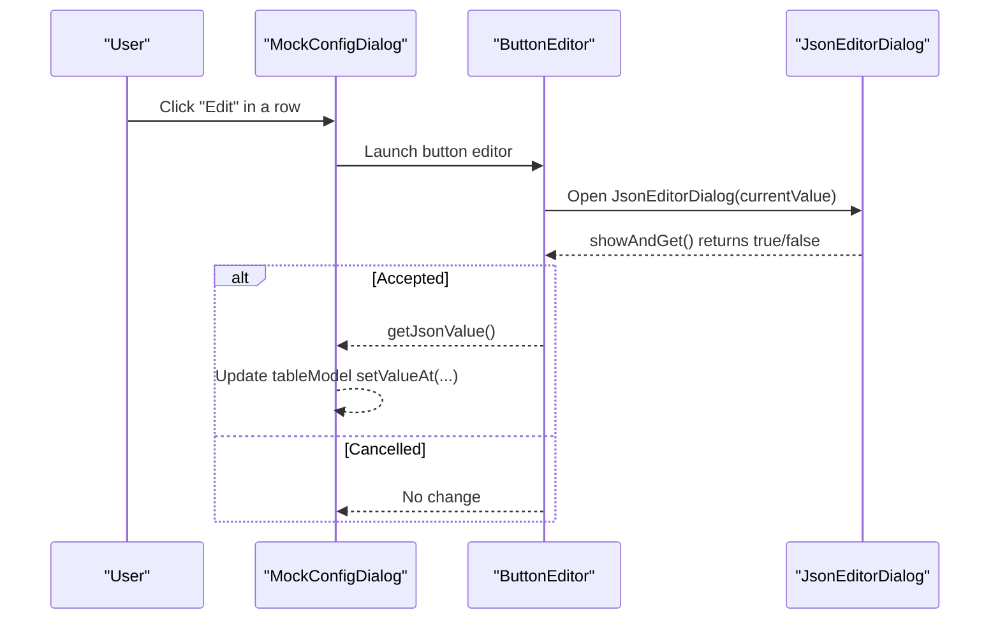
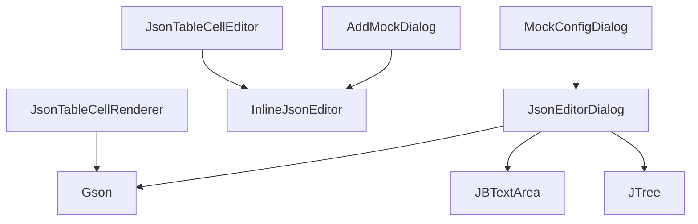

# JSON Editor System

<cite>
**Referenced Files in This Document**
- [JsonTableCellRenderer.java](file://src/main/java/io/github/lancelothuxi/idea/plugin/mock/ui/JsonTableCellRenderer.java)
- [JsonTableCellEditor.java](file://src/main/java/io/github/lancelothuxi/idea/plugin/mock/ui/JsonTableCellEditor.java)
- [JsonEditorDialog.java](file://src/main/java/io/github/lancelothuxi/idea/plugin/mock/ui/JsonEditorDialog.java)
- [InlineJsonEditor.java](file://src/main/java/io/github/lancelothuxi/idea/plugin/mock/ui/InlineJsonEditor.java)
- [MockConfigDialog.java](file://src/main/java/io/github/lancelothuxi/idea/plugin/mock/ui/MockConfigDialog.java)
- [AddMockDialog.java](file://src/main/java/io/github/lancelothuxi/idea/plugin/mock/ui/AddMockDialog.java)
- [JsonTableCellRendererDemo.java](file://src/main/java/io/github/lancelothuxi/idea/plugin/mock/demo/JsonTableCellRendererDemo.java)
- [JsonTableCellRenderer-使用指南.md](file://JsonTableCellRenderer-使用指南.md)
</cite>

## Table of Contents
1. [Introduction](#introduction)
2. [Project Structure](#project-structure)
3. [Core Components](#core-components)
4. [Architecture Overview](#architecture-overview)
5. [Detailed Component Analysis](#detailed-component-analysis)
6. [Dependency Analysis](#dependency-analysis)
7. [Performance Considerations](#performance-considerations)
8. [Troubleshooting Guide](#troubleshooting-guide)
9. [Conclusion](#conclusion)

## Introduction
This document describes the JSON editor system used for configuring complex return values in a mock testing framework integrated into an IntelliJ Platform plugin. The system consists of three primary UI components:
- JsonTableCellRenderer: renders formatted, syntax-highlighted JSON in table cells with tooltips for long content.
- JsonTableCellEditor: enables inline JSON editing via a compact editor with validation and auto-formatting, triggered from table cells.
- JsonEditorDialog: a full-screen dialog offering a split-pane visual editor (tree + text area) for advanced JSON editing scenarios.

These components integrate with the mock configuration system to support editing return values for methods with complex objects, collections, and generic types.

## Project Structure
The JSON editor system resides in the ui package and integrates with dialogs that manage mock configurations. The key files are:
- JsonTableCellRenderer.java: cell renderer for displaying JSON in tables.
- JsonTableCellEditor.java: cell editor enabling inline JSON editing with validation.
- JsonEditorDialog.java: advanced JSON editor dialog with tree and text views.
- InlineJsonEditor.java: lightweight editor component used by the table editor and dialog.
- MockConfigDialog.java: manages the main mock configuration table and triggers the JSON editor dialog.
- AddMockDialog.java: creates a new mock configuration with a JSON editor for return values.
- JsonTableCellRendererDemo.java: demonstrates the table renderer usage.
- JsonTableCellRenderer-使用指南.md: usage guide for the table renderer.

**Diagram sources**
- [JsonTableCellRenderer.java](file://src/main/java/io/github/lancelothuxi/idea/plugin/mock/ui/JsonTableCellRenderer.java#L1-L340)
- [JsonTableCellEditor.java](file://src/main/java/io/github/lancelothuxi/idea/plugin/mock/ui/JsonTableCellEditor.java#L1-L298)
- [JsonEditorDialog.java](file://src/main/java/io/github/lancelothuxi/idea/plugin/mock/ui/JsonEditorDialog.java#L1-L286)
- [InlineJsonEditor.java](file://src/main/java/io/github/lancelothuxi/idea/plugin/mock/ui/InlineJsonEditor.java#L1-L190)
- [MockConfigDialog.java](file://src/main/java/io/github/lancelothuxi/idea/plugin/mock/ui/MockConfigDialog.java#L1-L293)
- [AddMockDialog.java](file://src/main/java/io/github/lancelothuxi/idea/plugin/mock/ui/AddMockDialog.java#L1-L122)

**Section sources**
- [JsonTableCellRenderer.java](file://src/main/java/io/github/lancelothuxi/idea/plugin/mock/ui/JsonTableCellRenderer.java#L1-L340)
- [JsonTableCellEditor.java](file://src/main/java/io/github/lancelothuxi/idea/plugin/mock/ui/JsonTableCellEditor.java#L1-L298)
- [JsonEditorDialog.java](file://src/main/java/io/github/lancelothuxi/idea/plugin/mock/ui/JsonEditorDialog.java#L1-L286)
- [InlineJsonEditor.java](file://src/main/java/io/github/lancelothuxi/idea/plugin/mock/ui/InlineJsonEditor.java#L1-L190)
- [MockConfigDialog.java](file://src/main/java/io/github/lancelothuxi/idea/plugin/mock/ui/MockConfigDialog.java#L1-L293)
- [AddMockDialog.java](file://src/main/java/io/github/lancelothuxi/idea/plugin/mock/ui/AddMockDialog.java#L1-L122)
- [JsonTableCellRendererDemo.java](file://src/main/java/io/github/lancelothuxi/idea/plugin/mock/demo/JsonTableCellRendererDemo.java#L1-L140)
- [JsonTableCellRenderer-使用指南.md](file://JsonTableCellRenderer-使用指南.md#L1-L177)

## Core Components
- JsonTableCellRenderer
  - Purpose: Render JSON content in table cells with syntax highlighting, tooltips, and theme-aware styling.
  - Features: Minifies JSON for display, beautifies for tooltips, caches formatted results, escapes HTML, and applies color-coded syntax highlighting for keys, strings, numbers, booleans, and nulls.
  - Complexity: Formatting and highlighting are linear in the length of the input string; caching reduces repeated computation.

- JsonTableCellEditor
  - Purpose: Enable inline editing of JSON values directly in table cells.
  - Features: Shows a compact editor popup, validates JSON before accepting changes, supports exception-mode editing (special format "Type: message"), and gracefully handles cancellation and disposal.
  - Integration: Uses InlineJsonEditor for editing and communicates with the table via cell editor callbacks.

- JsonEditorDialog
  - Purpose: Provide a full-screen, advanced JSON editing experience with split-pane layout.
  - Features: Left-side tree view representing JSON structure, right-side text editor with JSON formatting/validation, buttons to sync between views, and OK/Cancel actions with validation.
  - Integration: Used by MockConfigDialog to edit complex return values.

- InlineJsonEditor
  - Purpose: Lightweight, reusable editor component based on IntelliJ's Editor and Document APIs.
  - Features: Syntax highlighting, auto-formatting on focus loss, manual format/validate actions, and JSON validation feedback.
  - Variants: Compact and Large constructors tailor the editor for table vs. dialog usage.

**Section sources**
- [JsonTableCellRenderer.java](file://src/main/java/io/github/lancelothuxi/idea/plugin/mock/ui/JsonTableCellRenderer.java#L14-L340)
- [JsonTableCellEditor.java](file://src/main/java/io/github/lancelothuxi/idea/plugin/mock/ui/JsonTableCellEditor.java#L17-L298)
- [JsonEditorDialog.java](file://src/main/java/io/github/lancelothuxi/idea/plugin/mock/ui/JsonEditorDialog.java#L19-L286)
- [InlineJsonEditor.java](file://src/main/java/io/github/lancelothuxi/idea/plugin/mock/ui/InlineJsonEditor.java#L23-L190)

## Architecture Overview
The JSON editor system follows a layered architecture:
- Rendering layer: JsonTableCellRenderer displays JSON in tables.
- Editing layer: JsonTableCellEditor bridges table cells to InlineJsonEditor for editing.
- Advanced editing layer: JsonEditorDialog provides a full-screen editor with tree/text synchronization.
- Integration layer: MockConfigDialog and AddMockDialog orchestrate JSON editing within the broader mock configuration workflow.

**Diagram sources**
- [MockConfigDialog.java](file://src/main/java/io/github/lancelothuxi/idea/plugin/mock/ui/MockConfigDialog.java#L225-L273)
- [JsonTableCellEditor.java](file://src/main/java/io/github/lancelothuxi/idea/plugin/mock/ui/JsonTableCellEditor.java#L75-L157)
- [InlineJsonEditor.java](file://src/main/java/io/github/lancelothuxi/idea/plugin/mock/ui/InlineJsonEditor.java#L135-L142)
- [JsonEditorDialog.java](file://src/main/java/io/github/lancelothuxi/idea/plugin/mock/ui/JsonEditorDialog.java#L193-L210)

## Detailed Component Analysis

### JsonTableCellRenderer
- Responsibilities
  - Format JSON for table display (minified) and tooltips (pretty-printed).
  - Apply syntax highlighting using theme-aware colors.
  - Escape HTML and limit display length with truncation.
  - Cache formatted results to improve performance.

- Key behaviors
  - Detects JSON boundaries by checking leading/trailing brackets.
  - Uses regex patterns to highlight keys, strings, numbers, booleans, and nulls.
  - Maintains an LRU cache keyed by original JSON string.

- Error handling
  - Gracefully falls back to plain text if JSON parsing fails.
  - Limits tooltip length to prevent UI slowdowns.

**Diagram sources**
- [JsonTableCellRenderer.java](file://src/main/java/io/github/lancelothuxi/idea/plugin/mock/ui/JsonTableCellRenderer.java#L112-L202)

**Section sources**
- [JsonTableCellRenderer.java](file://src/main/java/io/github/lancelothuxi/idea/plugin/mock/ui/JsonTableCellRenderer.java#L14-L340)
- [JsonTableCellRenderer-使用指南.md](file://JsonTableCellRenderer-使用指南.md#L1-L177)

### JsonTableCellEditor
- Responsibilities
  - Provide an inline JSON editing experience within a table cell.
  - Determine editing mode (standard JSON vs. exception configuration).
  - Validate JSON before committing changes.
  - Manage popup lifecycle and editor disposal.

- Key behaviors
  - Reads the "Mode" column to decide between standard JSON editing and exception editing.
  - Uses InlineJsonEditor for editing and shows a JBPopup near the cell.
  - On OK, checks validity and fires editing stopped; on Cancel, fires editing canceled.

- Integration with mock configuration
  - Triggered from MockConfigDialog's "Edit" column.
  - Supports exception-mode editing for special "Type: message" format.

**Diagram sources**
- [JsonTableCellEditor.java](file://src/main/java/io/github/lancelothuxi/idea/plugin/mock/ui/JsonTableCellEditor.java#L48-L157)
- [InlineJsonEditor.java](file://src/main/java/io/github/lancelothuxi/idea/plugin/mock/ui/InlineJsonEditor.java#L165-L172)

**Section sources**
- [JsonTableCellEditor.java](file://src/main/java/io/github/lancelothuxi/idea/plugin/mock/ui/JsonTableCellEditor.java#L17-L298)
- [MockConfigDialog.java](file://src/main/java/io/github/lancelothuxi/idea/plugin/mock/ui/MockConfigDialog.java#L225-L273)

### JsonEditorDialog
- Responsibilities
  - Provide a full-screen JSON editor with dual-pane UX.
  - Parse and visualize JSON structure in a tree.
  - Allow manual editing via a text area with format/validate/sync actions.
  - Validate JSON on OK and persist the result.

- Key behaviors
  - Left pane: JTree built from parsed JSON; supports add/remove/edit operations.
  - Right pane: JBTextArea with monospaced font for editing.
  - Buttons: Format JSON, Validate, Sync from Text, Sync to Text.
  - Validation: Uses Gson parser to detect syntax errors.

- Integration with mock configuration
  - Invoked from MockConfigDialog to edit complex return values.
  - Returns the final JSON string to replace the table cell value.

**Diagram sources**
- [JsonEditorDialog.java](file://src/main/java/io/github/lancelothuxi/idea/plugin/mock/ui/JsonEditorDialog.java#L22-L286)

**Section sources**
- [JsonEditorDialog.java](file://src/main/java/io/github/lancelothuxi/idea/plugin/mock/ui/JsonEditorDialog.java#L19-L286)
- [MockConfigDialog.java](file://src/main/java/io/github/lancelothuxi/idea/plugin/mock/ui/MockConfigDialog.java#L254-L262)

### InlineJsonEditor
- Responsibilities
  - Provide a lightweight, reusable editor component based on IntelliJ's Editor and Document APIs.
  - Offer syntax highlighting, auto-formatting on focus loss, and manual format/validate actions.

- Key behaviors
  - Creates an EditorEx with JSON-specific highlighter and global color scheme.
  - Formats JSON using Gson and updates the document safely on the EDT.
  - Validates JSON on demand and shows modal messages for success/error.

- Variants
  - createCompact: smaller editor for tight table layouts.
  - createLarge: larger editor for dialog usage.

**Diagram sources**
- [InlineJsonEditor.java](file://src/main/java/io/github/lancelothuxi/idea/plugin/mock/ui/InlineJsonEditor.java#L26-L190)

**Section sources**
- [InlineJsonEditor.java](file://src/main/java/io/github/lancelothuxi/idea/plugin/mock/ui/InlineJsonEditor.java#L23-L190)

### Integration with Mock Configuration System
- MockConfigDialog
  - Manages a table of methods with columns for enabling, class, method, return type, mock value, and an "Edit" action.
  - The "Edit" column uses a custom ButtonEditor that opens JsonEditorDialog for advanced editing.
  - On OK, persists enabled rules with their return values.

- AddMockDialog
  - Creates a new mock configuration dialog with a JSON editor for the return value.
  - Generates a default mock value based on the method's return type.

**Diagram sources**
- [MockConfigDialog.java](file://src/main/java/io/github/lancelothuxi/idea/plugin/mock/ui/MockConfigDialog.java#L225-L273)
- [JsonEditorDialog.java](file://src/main/java/io/github/lancelothuxi/idea/plugin/mock/ui/JsonEditorDialog.java#L275-L285)

**Section sources**
- [MockConfigDialog.java](file://src/main/java/io/github/lancelothuxi/idea/plugin/mock/ui/MockConfigDialog.java#L24-L293)
- [AddMockDialog.java](file://src/main/java/io/github/lancelothuxi/idea/plugin/mock/ui/AddMockDialog.java#L16-L122)

## Dependency Analysis
- Internal dependencies
  - JsonTableCellEditor depends on InlineJsonEditor for editing.
  - JsonEditorDialog uses Gson for parsing/formatting and JBTextArea/JTree for editing.
  - MockConfigDialog orchestrates JsonEditorDialog and updates table data.
  - AddMockDialog uses InlineJsonEditor to capture return values.

- External dependencies
  - Gson: JSON parsing/formatting.
  - IntelliJ Platform APIs: Editor, Document, JBPopup, JBTable, JBTextArea, JBScrollPane, JTree.

**Diagram sources**
- [JsonTableCellRenderer.java](file://src/main/java/io/github/lancelothuxi/idea/plugin/mock/ui/JsonTableCellRenderer.java#L1-L340)
- [JsonTableCellEditor.java](file://src/main/java/io/github/lancelothuxi/idea/plugin/mock/ui/JsonTableCellEditor.java#L1-L298)
- [JsonEditorDialog.java](file://src/main/java/io/github/lancelothuxi/idea/plugin/mock/ui/JsonEditorDialog.java#L1-L286)
- [InlineJsonEditor.java](file://src/main/java/io/github/lancelothuxi/idea/plugin/mock/ui/InlineJsonEditor.java#L1-L190)
- [MockConfigDialog.java](file://src/main/java/io/github/lancelothuxi/idea/plugin/mock/ui/MockConfigDialog.java#L1-L293)
- [AddMockDialog.java](file://src/main/java/io/github/lancelothuxi/idea/plugin/mock/ui/AddMockDialog.java#L1-L122)

**Section sources**
- [JsonTableCellRenderer.java](file://src/main/java/io/github/lancelothuxi/idea/plugin/mock/ui/JsonTableCellRenderer.java#L1-L340)
- [JsonTableCellEditor.java](file://src/main/java/io/github/lancelothuxi/idea/plugin/mock/ui/JsonTableCellEditor.java#L1-L298)
- [JsonEditorDialog.java](file://src/main/java/io/github/lancelothuxi/idea/plugin/mock/ui/JsonEditorDialog.java#L1-L286)
- [InlineJsonEditor.java](file://src/main/java/io/github/lancelothuxi/idea/plugin/mock/ui/InlineJsonEditor.java#L1-L190)
- [MockConfigDialog.java](file://src/main/java/io/github/lancelothuxi/idea/plugin/mock/ui/MockConfigDialog.java#L1-L293)
- [AddMockDialog.java](file://src/main/java/io/github/lancelothuxi/idea/plugin/mock/ui/AddMockDialog.java#L1-L122)

## Performance Considerations
- Caching
  - JsonTableCellRenderer maintains an LRU cache of formatted JSON to avoid repeated minification/pretty-printing.
- Truncation
  - Long JSON is truncated for display and tooltips to prevent UI slowdowns.
- Lightweight editing
  - InlineJsonEditor uses focus events to format content, minimizing unnecessary reformatting.
- Asynchronous UI updates
  - Document updates are scheduled on the Event Dispatch Thread to keep the UI responsive.

[No sources needed since this section provides general guidance]

## Troubleshooting Guide
- JSON not displaying syntax highlighting
  - Ensure the content starts with a JSON object or array delimiter.
  - Verify the renderer is applied to the correct column index.

- JSON validation errors during editing
  - InlineJsonEditor and JsonEditorDialog show modal dialogs indicating syntax errors.
  - Fix syntax errors before accepting changes.

- Exception-mode editing issues
  - When editing exceptions, ensure the format is "Type: message".
  - The editor enforces non-empty exception type.

- Memory/resource leaks
  - JsonTableCellEditor disposes the popup and InlineJsonEditor on stop/cancel.
  - InlineJsonEditor releases the editor instance on dispose.

**Section sources**
- [JsonTableCellRenderer.java](file://src/main/java/io/github/lancelothuxi/idea/plugin/mock/ui/JsonTableCellRenderer.java#L112-L146)
- [JsonTableCellEditor.java](file://src/main/java/io/github/lancelothuxi/idea/plugin/mock/ui/JsonTableCellEditor.java#L131-L139)
- [JsonEditorDialog.java](file://src/main/java/io/github/lancelothuxi/idea/plugin/mock/ui/JsonEditorDialog.java#L198-L210)
- [InlineJsonEditor.java](file://src/main/java/io/github/lancelothuxi/idea/plugin/mock/ui/InlineJsonEditor.java#L135-L142)

## Conclusion
The JSON editor system provides a cohesive, theme-aware solution for rendering and editing JSON within a table-based mock configuration interface. JsonTableCellRenderer delivers readable, syntax-highlighted previews; JsonTableCellEditor enables safe, validated inline editing; and JsonEditorDialog offers a powerful, full-screen editing experience. Together with MockConfigDialog and AddMockDialog, the system supports complex return value configuration for methods with objects, arrays, and generic types, ensuring robust validation and a smooth user experience.