# Main Tool Window Interface

<cite>
**Referenced Files in This Document**
- [MockRunnerToolWindowContent.java](file://src/main/java/io/github/lancelothuxi/idea/plugin/mock/ui/MockRunnerToolWindowContent.java)
- [MockConfigService.java](file://src/main/java/io/github/lancelothuxi/idea/plugin/mock/service/MockConfigService.java)
- [MockConfig.java](file://src/main/java/io/github/lancelothuxi/idea/plugin/mock/mock/MockConfig.java)
- [MockMethodConfig.java](file://src/main/java/io/github/lancelothuxi/idea/plugin/mock/mock/MockMethodConfig.java)
- [RunnerToolWindowFactory.java](file://src/main/java/io/github/lancelothuxi/idea/plugin/mock/ui/RunnerToolWindowFactory.java)
- [JsonTableCellRenderer.java](file://src/main/java/io/github/lancelothuxi/idea/plugin/mock/ui/JsonTableCellRenderer.java)
- [JsonTableCellEditor.java](file://src/main/java/io/github/lancelothuxi/idea/plugin/mock/ui/JsonTableCellEditor.java)
- [InlineJsonEditor.java](file://src/main/java/io/github/lancelothuxi/idea/plugin/mock/ui/InlineJsonEditor.java)
- [MockConfigDialog.java](file://src/main/java/io/github/lancelothuxi/idea/plugin/mock/ui/MockConfigDialog.java)
- [MockValueGenerator.java](file://src/main/java/io/github/lancelothuxi/idea/plugin/mock/util/MockValueGenerator.java)
</cite>

## Table of Contents
1. [Introduction](#introduction)
2. [Project Structure](#project-structure)
3. [Core Components](#core-components)
4. [Architecture Overview](#architecture-overview)
5. [Detailed Component Analysis](#detailed-component-analysis)
6. [Dependency Analysis](#dependency-analysis)
7. [Performance Considerations](#performance-considerations)
8. [Troubleshooting Guide](#troubleshooting-guide)
9. [Conclusion](#conclusion)

## Introduction
This document describes the main Mock Runner tool window interface, focusing on the MockRunnerToolWindowContent class as the central UI component. It explains the BorderLayout-based layout with a top toolbar, center scrollable table, and bottom pagination controls. It documents the custom MockTableModel with six columns (Enabled, Class, Method, Args, Mode, Value), table sorting and filtering via TableRowSorter, regex-based search, pagination with configurable page size, global enable/disable toggling, dirty state tracking for unsaved changes, and integration with MockConfigService for data persistence. Accessibility and user interaction patterns are also covered.

## Project Structure
The tool window integrates with IntelliJ Platform’s tool window system. The content panel is registered as a tool window content via RunnerToolWindowFactory and managed by MockRunnerToolWindowContent. Data is persisted and synchronized through MockConfigService, which maintains MockConfig and MockMethodConfig models.

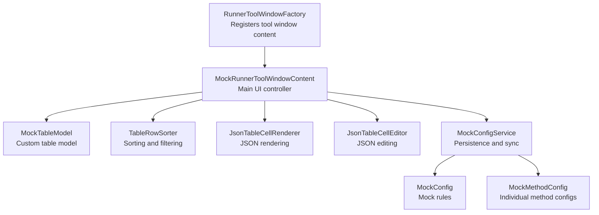

**Diagram sources**
- [RunnerToolWindowFactory.java](file://src/main/java/io/github/lancelothuxi/idea/plugin/mock/ui/RunnerToolWindowFactory.java#L10-L20)
- [MockRunnerToolWindowContent.java](file://src/main/java/io/github/lancelothuxi/idea/plugin/mock/ui/MockRunnerToolWindowContent.java#L22-L160)
- [MockConfigService.java](file://src/main/java/io/github/lancelothuxi/idea/plugin/mock/service/MockConfigService.java#L23-L40)
- [MockConfig.java](file://src/main/java/io/github/lancelothuxi/idea/plugin/mock/mock/MockConfig.java#L12-L218)
- [MockMethodConfig.java](file://src/main/java/io/github/lancelothuxi/idea/plugin/mock/mock/MockMethodConfig.java#L5-L94)

**Section sources**
- [RunnerToolWindowFactory.java](file://src/main/java/io/github/lancelothuxi/idea/plugin/mock/ui/RunnerToolWindowFactory.java#L10-L20)
- [MockRunnerToolWindowContent.java](file://src/main/java/io/github/lancelothuxi/idea/plugin/mock/ui/MockRunnerToolWindowContent.java#L46-L160)

## Core Components
- MockRunnerToolWindowContent: Central UI controller managing layout, toolbar actions, table model, sorting/filtering, pagination, global toggle, dirty state, and persistence integration.
- MockTableModel: Custom AbstractTableModel implementing six columns and editable cells for Enabled, Mode, and Value.
- TableRowSorter: Enables sorting and regex-based filtering across all columns.
- JsonTableCellRenderer/JsonTableCellEditor: Advanced JSON rendering and inline editing with syntax highlighting and validation.
- MockConfigService: Persists configuration to XML state and a temporary JSON file for runtime agent consumption, and updates UI on changes.
- MockConfig/MockMethodConfig: Data models representing mock rules and per-method configuration.

**Section sources**
- [MockRunnerToolWindowContent.java](file://src/main/java/io/github/lancelothuxi/idea/plugin/mock/ui/MockRunnerToolWindowContent.java#L22-L160)
- [MockRunnerToolWindowContent.java](file://src/main/java/io/github/lancelothuxi/idea/plugin/mock/ui/MockRunnerToolWindowContent.java#L341-L447)
- [MockConfigService.java](file://src/main/java/io/github/lancelothuxi/idea/plugin/mock/service/MockConfigService.java#L23-L96)
- [MockConfig.java](file://src/main/java/io/github/lancelothuxi/idea/plugin/mock/mock/MockConfig.java#L12-L86)
- [MockMethodConfig.java](file://src/main/java/io/github/lancelothuxi/idea/plugin/mock/mock/MockMethodConfig.java#L5-L94)

## Architecture Overview
The tool window follows a layered pattern:
- UI Layer: MockRunnerToolWindowContent orchestrates layout, events, and persistence triggers.
- Model Layer: MockTableModel exposes data from MockConfigService.getConfig().
- Persistence Layer: MockConfigService persists to project state and a temporary JSON file.
- Rendering/Editing Layer: JsonTableCellRenderer and JsonTableCellEditor provide rich JSON editing and display.

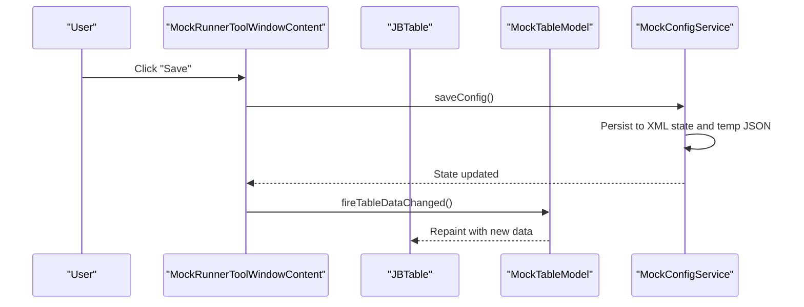

**Diagram sources**
- [MockRunnerToolWindowContent.java](file://src/main/java/io/github/lancelothuxi/idea/plugin/mock/ui/MockRunnerToolWindowContent.java#L110-L116)
- [MockConfigService.java](file://src/main/java/io/github/lancelothuxi/idea/plugin/mock/service/MockConfigService.java#L41-L58)
- [MockRunnerToolWindowContent.java](file://src/main/java/io/github/lancelothuxi/idea/plugin/mock/ui/MockRunnerToolWindowContent.java#L341-L447)

## Detailed Component Analysis

### Layout and Controls (BorderLayout)
- Top panel: Search field with real-time regex filtering and global enable/disable toggle.
- Center panel: Scrollable JBTable displaying mock configurations.
- Bottom panel: Previous/Next buttons and page label for pagination.

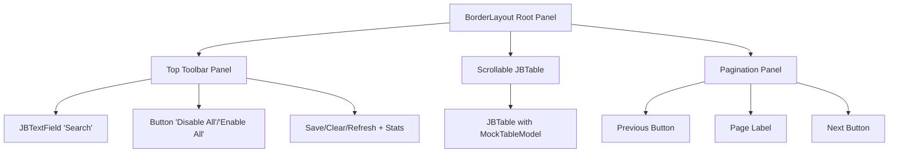

**Diagram sources**
- [MockRunnerToolWindowContent.java](file://src/main/java/io/github/lancelothuxi/idea/plugin/mock/ui/MockRunnerToolWindowContent.java#L48-L150)

**Section sources**
- [MockRunnerToolWindowContent.java](file://src/main/java/io/github/lancelothuxi/idea/plugin/mock/ui/MockRunnerToolWindowContent.java#L48-L150)

### MockTableModel (Six Columns)
Columns: Enabled, Class, Method, Args, Mode, Value
- Enabled: Boolean, editable; toggles method enablement.
- Class: Short class name display.
- Method: Method name.
- Args: Method signature.
- Mode: Dropdown with "Return Value" or "Exception".
- Value: JSON editor for return value or exception info.

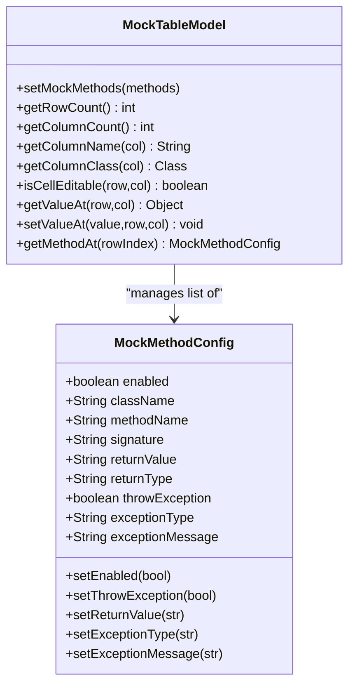

**Diagram sources**
- [MockRunnerToolWindowContent.java](file://src/main/java/io/github/lancelothuxi/idea/plugin/mock/ui/MockRunnerToolWindowContent.java#L341-L447)
- [MockMethodConfig.java](file://src/main/java/io/github/lancelothuxi/idea/plugin/mock/mock/MockMethodConfig.java#L5-L94)

**Section sources**
- [MockRunnerToolWindowContent.java](file://src/main/java/io/github/lancelothuxi/idea/plugin/mock/ui/MockRunnerToolWindowContent.java#L341-L447)
- [MockMethodConfig.java](file://src/main/java/io/github/lancelothuxi/idea/plugin/mock/mock/MockMethodConfig.java#L5-L94)

### Sorting and Filtering with TableRowSorter
- Real-time filtering via DocumentListener on the search field.
- Regex-based filtering applied to all visible rows.
- Case-insensitive matching using a regex filter.

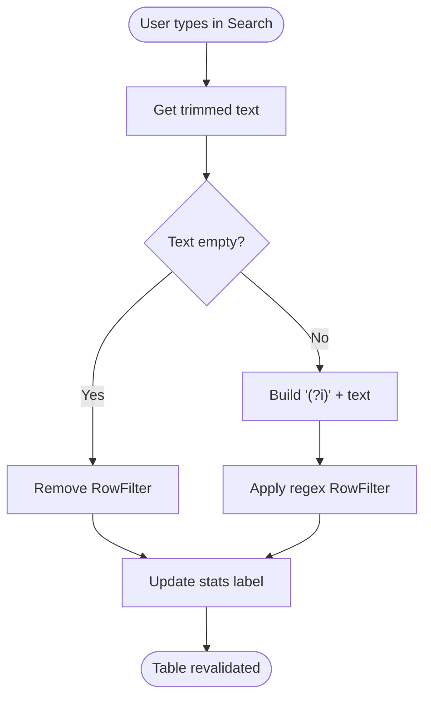

**Diagram sources**
- [MockRunnerToolWindowContent.java](file://src/main/java/io/github/lancelothuxi/idea/plugin/mock/ui/MockRunnerToolWindowContent.java#L89-L96)
- [MockRunnerToolWindowContent.java](file://src/main/java/io/github/lancelothuxi/idea/plugin/mock/ui/MockRunnerToolWindowContent.java#L173-L181)

**Section sources**
- [MockRunnerToolWindowContent.java](file://src/main/java/io/github/lancelothuxi/idea/plugin/mock/ui/MockRunnerToolWindowContent.java#L55-L57)
- [MockRunnerToolWindowContent.java](file://src/main/java/io/github/lancelothuxi/idea/plugin/mock/ui/MockRunnerToolWindowContent.java#L89-L96)
- [MockRunnerToolWindowContent.java](file://src/main/java/io/github/lancelothuxi/idea/plugin/mock/ui/MockRunnerToolWindowContent.java#L173-L181)

### Pagination System
- Fixed page size constant.
- Current page index tracked locally.
- Navigation updates page label and enables/disables buttons.
- Table model refreshes on navigation.

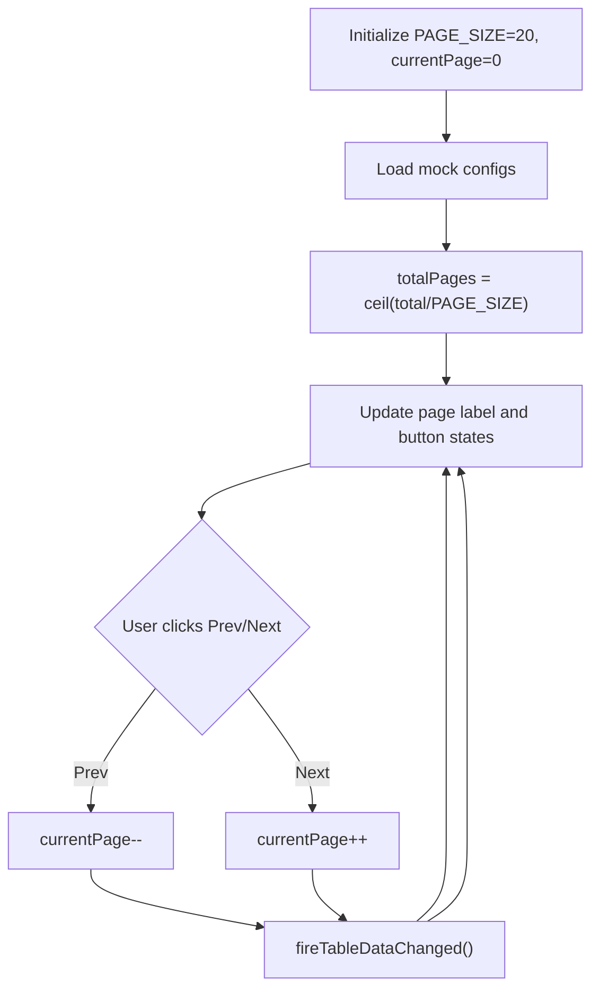

**Diagram sources**
- [MockRunnerToolWindowContent.java](file://src/main/java/io/github/lancelothuxi/idea/plugin/mock/ui/MockRunnerToolWindowContent.java#L31-L36)
- [MockRunnerToolWindowContent.java](file://src/main/java/io/github/lancelothuxi/idea/plugin/mock/ui/MockRunnerToolWindowContent.java#L228-L255)
- [MockRunnerToolWindowContent.java](file://src/main/java/io/github/lancelothuxi/idea/plugin/mock/ui/MockRunnerToolWindowContent.java#L245-L248)

**Section sources**
- [MockRunnerToolWindowContent.java](file://src/main/java/io/github/lancelothuxi/idea/plugin/mock/ui/MockRunnerToolWindowContent.java#L31-L36)
- [MockRunnerToolWindowContent.java](file://src/main/java/io/github/lancelothuxi/idea/plugin/mock/ui/MockRunnerToolWindowContent.java#L228-L255)
- [MockRunnerToolWindowContent.java](file://src/main/java/io/github/lancelothuxi/idea/plugin/mock/ui/MockRunnerToolWindowContent.java#L245-L248)

### Global Enable/Disable Toggle
- Single button switches all mock methods’ enabled state.
- Updates UI immediately and marks dirty.
- Persists changes on Save.

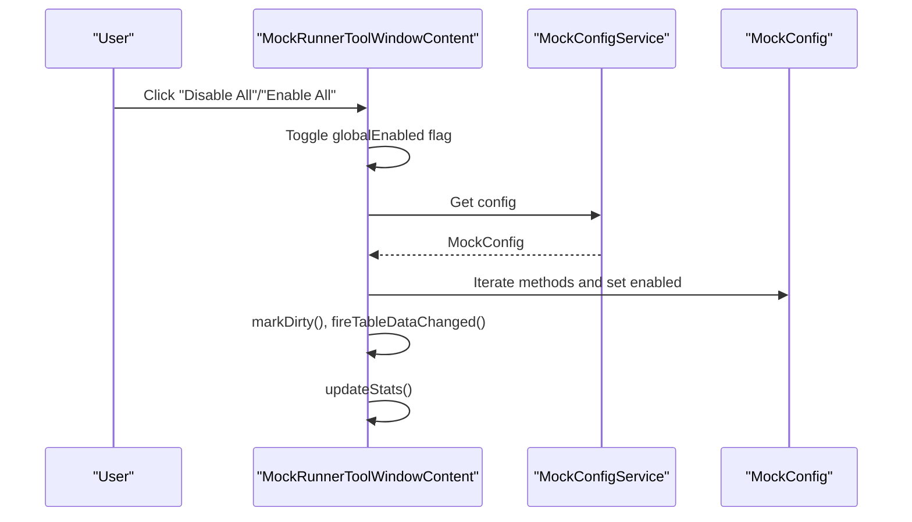

**Diagram sources**
- [MockRunnerToolWindowContent.java](file://src/main/java/io/github/lancelothuxi/idea/plugin/mock/ui/MockRunnerToolWindowContent.java#L183-L197)
- [MockConfigService.java](file://src/main/java/io/github/lancelothuxi/idea/plugin/mock/service/MockConfigService.java#L37-L39)

**Section sources**
- [MockRunnerToolWindowContent.java](file://src/main/java/io/github/lancelothuxi/idea/plugin/mock/ui/MockRunnerToolWindowContent.java#L183-L197)

### Dirty State Tracking and Save Behavior
- Dirty flag toggled when edits occur.
- Save button enabled only when dirty.
- Save writes to persistent state and clears dirty flag.

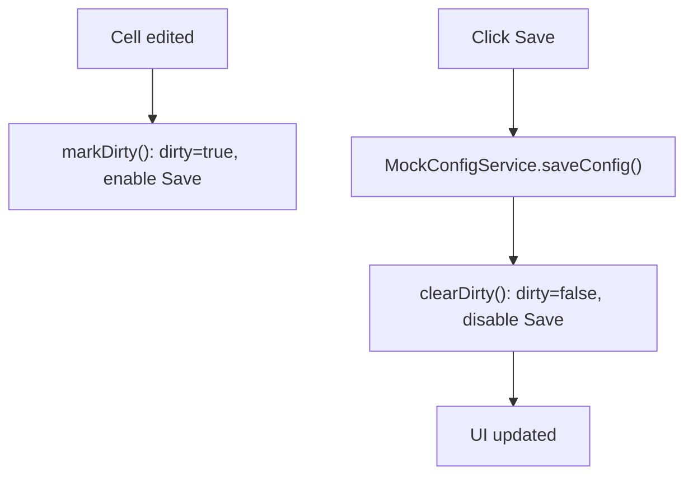

**Diagram sources**
- [MockRunnerToolWindowContent.java](file://src/main/java/io/github/lancelothuxi/idea/plugin/mock/ui/MockRunnerToolWindowContent.java#L296-L306)
- [MockRunnerToolWindowContent.java](file://src/main/java/io/github/lancelothuxi/idea/plugin/mock/ui/MockRunnerToolWindowContent.java#L110-L116)
- [MockConfigService.java](file://src/main/java/io/github/lancelothuxi/idea/plugin/mock/service/MockConfigService.java#L41-L58)

**Section sources**
- [MockRunnerToolWindowContent.java](file://src/main/java/io/github/lancelothuxi/idea/plugin/mock/ui/MockRunnerToolWindowContent.java#L296-L306)
- [MockRunnerToolWindowContent.java](file://src/main/java/io/github/lancelothuxi/idea/plugin/mock/ui/MockRunnerToolWindowContent.java#L110-L116)

### Integration with MockConfigService (Persistence)
- Loads initial data from MockConfigService.getConfig().
- On Save, persists to XML state and a temporary JSON file for agent consumption.
- On load, rebuilds mock rules and updates UI.

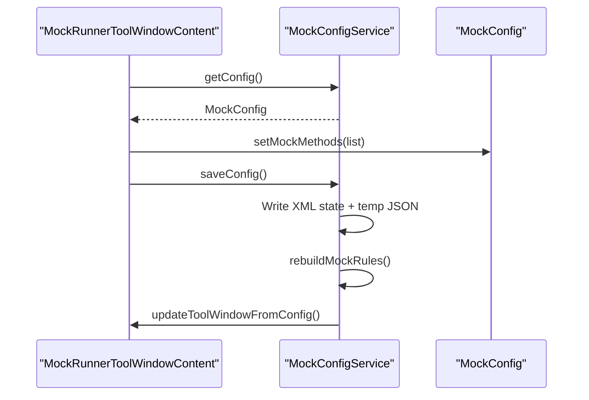

**Diagram sources**
- [MockRunnerToolWindowContent.java](file://src/main/java/io/github/lancelothuxi/idea/plugin/mock/ui/MockRunnerToolWindowContent.java#L166-L171)
- [MockConfigService.java](file://src/main/java/io/github/lancelothuxi/idea/plugin/mock/service/MockConfigService.java#L37-L58)
- [MockConfigService.java](file://src/main/java/io/github/lancelothuxi/idea/plugin/mock/service/MockConfigService.java#L98-L107)

**Section sources**
- [MockRunnerToolWindowContent.java](file://src/main/java/io/github/lancelothuxi/idea/plugin/mock/ui/MockRunnerToolWindowContent.java#L166-L171)
- [MockConfigService.java](file://src/main/java/io/github/lancelothuxi/idea/plugin/mock/service/MockConfigService.java#L37-L58)
- [MockConfigService.java](file://src/main/java/io/github/lancelothuxi/idea/plugin/mock/service/MockConfigService.java#L98-L107)

### JSON Editing Experience
- Value column uses JsonTableCellRenderer for formatted display with syntax highlighting.
- JsonTableCellEditor opens a modal editor supporting:
  - JSON editing with InlineJsonEditor (format/validate).
  - Exception editing with separate form parsing "Type: message".

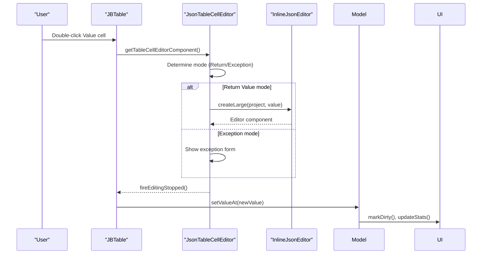

**Diagram sources**
- [MockRunnerToolWindowContent.java](file://src/main/java/io/github/lancelothuxi/idea/plugin/mock/ui/MockRunnerToolWindowContent.java#L73-L76)
- [JsonTableCellRenderer.java](file://src/main/java/io/github/lancelothuxi/idea/plugin/mock/ui/JsonTableCellRenderer.java#L75-L110)
- [JsonTableCellEditor.java](file://src/main/java/io/github/lancelothuxi/idea/plugin/mock/ui/JsonTableCellEditor.java#L75-L92)
- [JsonTableCellEditor.java](file://src/main/java/io/github/lancelothuxi/idea/plugin/mock/ui/JsonTableCellEditor.java#L94-L157)
- [JsonTableCellEditor.java](file://src/main/java/io/github/lancelothuxi/idea/plugin/mock/ui/JsonTableCellEditor.java#L159-L261)
- [InlineJsonEditor.java](file://src/main/java/io/github/lancelothuxi/idea/plugin/mock/ui/InlineJsonEditor.java#L34-L58)

**Section sources**
- [JsonTableCellRenderer.java](file://src/main/java/io/github/lancelothuxi/idea/plugin/mock/ui/JsonTableCellRenderer.java#L14-L110)
- [JsonTableCellEditor.java](file://src/main/java/io/github/lancelothuxi/idea/plugin/mock/ui/JsonTableCellEditor.java#L75-L92)
- [JsonTableCellEditor.java](file://src/main/java/io/github/lancelothuxi/idea/plugin/mock/ui/JsonTableCellEditor.java#L94-L157)
- [JsonTableCellEditor.java](file://src/main/java/io/github/lancelothuxi/idea/plugin/mock/ui/JsonTableCellEditor.java#L159-L261)
- [InlineJsonEditor.java](file://src/main/java/io/github/lancelothuxi/idea/plugin/mock/ui/InlineJsonEditor.java#L34-L58)

### Additional UI Patterns
- MockConfigDialog provides a project-wide configuration experience with smart mock value generation and JSON editing.
- MockValueGenerator creates representative JSON for complex return types.

**Section sources**
- [MockConfigDialog.java](file://src/main/java/io/github/lancelothuxi/idea/plugin/mock/ui/MockConfigDialog.java#L27-L108)
- [MockConfigDialog.java](file://src/main/java/io/github/lancelothuxi/idea/plugin/mock/ui/MockConfigDialog.java#L110-L160)
- [MockValueGenerator.java](file://src/main/java/io/github/lancelothuxi/idea/plugin/mock/util/MockValueGenerator.java#L18-L100)

## Dependency Analysis
The UI depends on the service layer for data and persistence. The service layer depends on data models for configuration representation and rebuilds mock rules for runtime use.

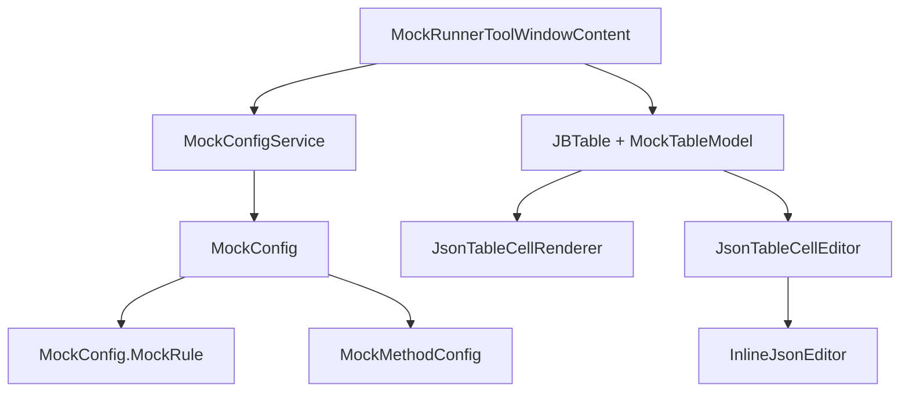

**Diagram sources**
- [MockRunnerToolWindowContent.java](file://src/main/java/io/github/lancelothuxi/idea/plugin/mock/ui/MockRunnerToolWindowContent.java#L22-L160)
- [MockConfigService.java](file://src/main/java/io/github/lancelothuxi/idea/plugin/mock/service/MockConfigService.java#L23-L96)
- [MockConfig.java](file://src/main/java/io/github/lancelothuxi/idea/plugin/mock/mock/MockConfig.java#L12-L86)
- [MockMethodConfig.java](file://src/main/java/io/github/lancelothuxi/idea/plugin/mock/mock/MockMethodConfig.java#L5-L94)

**Section sources**
- [MockRunnerToolWindowContent.java](file://src/main/java/io/github/lancelothuxi/idea/plugin/mock/ui/MockRunnerToolWindowContent.java#L22-L160)
- [MockConfigService.java](file://src/main/java/io/github/lancelothuxi/idea/plugin/mock/service/MockConfigService.java#L23-L96)
- [MockConfig.java](file://src/main/java/io/github/lancelothuxi/idea/plugin/mock/mock/MockConfig.java#L12-L86)

## Performance Considerations
- Column width initialization deferred until after table creation to avoid layout overhead.
- JSON rendering uses caching for formatted strings to reduce repeated computation.
- Pagination limits visible rows per page to manage large datasets efficiently.
- Filtering uses regex with case-insensitive flag; keep search terms concise for responsiveness.

[No sources needed since this section provides general guidance]

## Troubleshooting Guide
- Unsaved changes prompt: When navigating away, the UI prompts to save, discard, or cancel. Use Save to persist, Discard to proceed without saving, or Cancel to stay.
- Clear All confirmation: Requires explicit confirmation; unsaved changes are handled before clearing.
- Refresh conflicts: If unsaved changes exist, refresh prompts to save or discard before reloading data.
- JSON validation: Inline JSON editor validates syntax; invalid JSON prevents saving.
- Tool window visibility: Adding mock methods ensures the tool window is shown if not visible.

**Section sources**
- [MockRunnerToolWindowContent.java](file://src/main/java/io/github/lancelothuxi/idea/plugin/mock/ui/MockRunnerToolWindowContent.java#L199-L226)
- [MockRunnerToolWindowContent.java](file://src/main/java/io/github/lancelothuxi/idea/plugin/mock/ui/MockRunnerToolWindowContent.java#L312-L334)
- [JsonTableCellEditor.java](file://src/main/java/io/github/lancelothuxi/idea/plugin/mock/ui/JsonTableCellEditor.java#L124-L139)
- [MockConfigService.java](file://src/main/java/io/github/lancelothuxi/idea/plugin/mock/service/MockConfigService.java#L130-L137)

## Conclusion
The Mock Runner tool window provides a robust, editable interface for managing mock configurations. Its BorderLayout layout cleanly separates concerns, the custom table model offers precise control over data presentation and editing, and the integration with MockConfigService ensures reliable persistence and synchronization. Advanced JSON editing, filtering, sorting, and pagination deliver a productive developer experience while maintaining accessibility and usability.