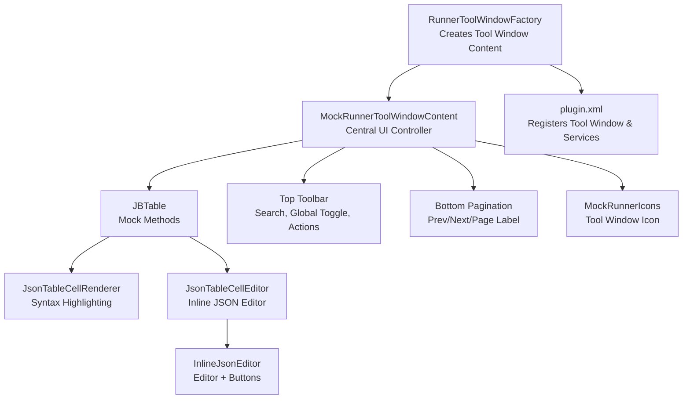
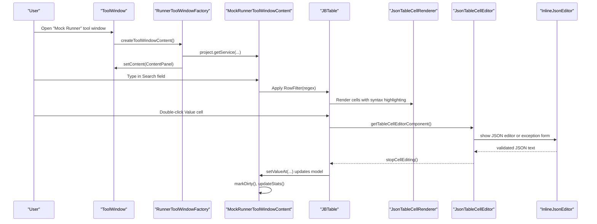
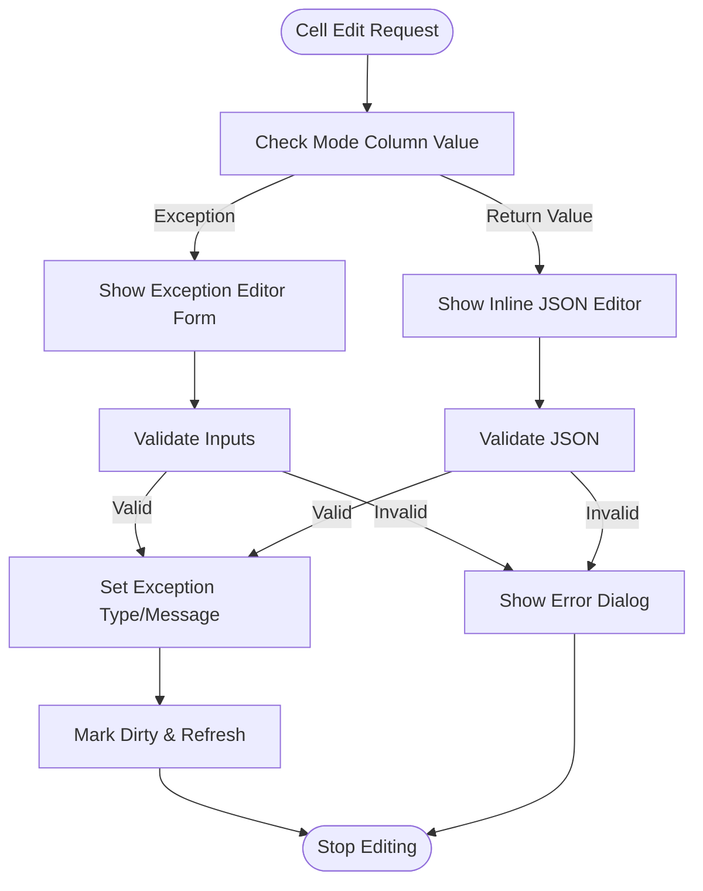
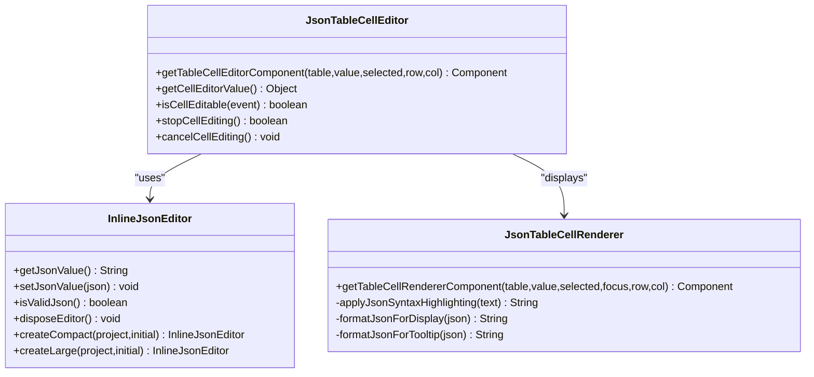
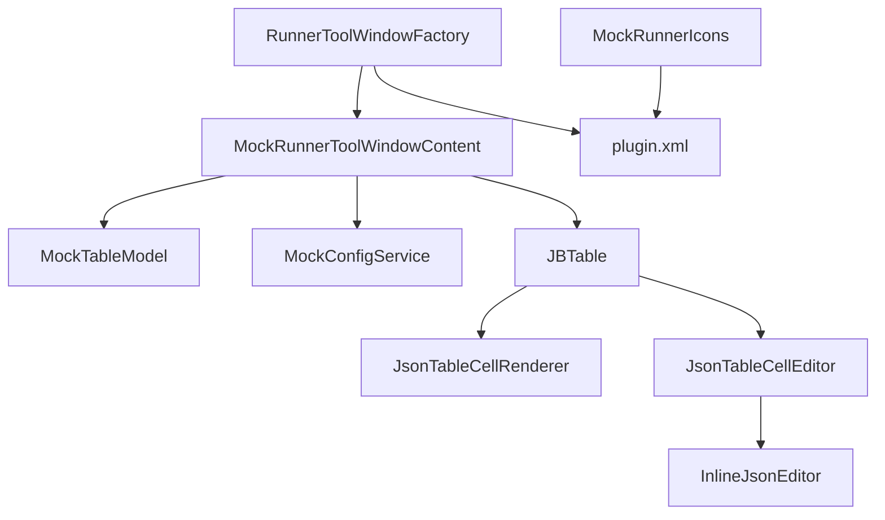

# User Interface Components

<cite>
**Referenced Files in This Document**
- [MockRunnerToolWindowContent.java](file://src/main/java/io/github/lancelothuxi/idea/plugin/mock/ui/MockRunnerToolWindowContent.java)
- [RunnerToolWindowFactory.java](file://src/main/java/io/github/lancelothuxi/idea/plugin/mock/ui/RunnerToolWindowFactory.java)
- [JsonTableCellRenderer.java](file://src/main/java/io/github/lancelothuxi/idea/plugin/mock/ui/JsonTableCellRenderer.java)
- [JsonTableCellEditor.java](file://src/main/java/io/github/lancelothuxi/idea/plugin/mock/ui/JsonTableCellEditor.java)
- [InlineJsonEditor.java](file://src/main/java/io/github/lancelothuxi/idea/plugin/mock/ui/InlineJsonEditor.java)
- [AddMockDialog.java](file://src/main/java/io/github/lancelothuxi/idea/plugin/mock/ui/AddMockDialog.java)
- [MockConfigDialog.java](file://src/main/java/io/github/lancelothuxi/idea/plugin/mock/ui/MockConfigDialog.java)
- [MockRunnerIcons.java](file://src/main/java/io/github/lancelothuxi/idea/plugin/mock/MockRunnerIcons.java)
- [plugin.xml](file://src/main/resources/META-INF/plugin.xml)
</cite>

## Table of Contents
1. [Introduction](#introduction)
2. [Project Structure](#project-structure)
3. [Core Components](#core-components)
4. [Architecture Overview](#architecture-overview)
5. [Detailed Component Analysis](#detailed-component-analysis)
6. [Dependency Analysis](#dependency-analysis)
7. [Performance Considerations](#performance-considerations)
8. [Troubleshooting Guide](#troubleshooting-guide)
9. [Conclusion](#conclusion)
10. [Appendices](#appendices)

## Introduction
This document describes the user interface components of Mock Runner, focusing on the central MockRunnerToolWindowContent as the hub for mock configuration management. It covers the table UI, pagination, search and filtering, global controls, and the sophisticated JSON editor system with inline editing, syntax highlighting, auto-formatting, and validation. It also explains the table column structure, cell rendering/editing mechanisms, and user interaction patterns. The gutter icon system for quick mock addition and the tool window factory implementation are documented, along with accessibility considerations, keyboard shortcuts, responsive design patterns, and guidelines for UI customization within the IntelliJ Platform framework.

## Project Structure
The UI layer is organized around a tool window that hosts a searchable, paginated table of mock configurations. Editing is performed inline via a JSON editor with validation and formatting. Supporting dialogs provide modal editing experiences for adding mocks and managing configurations.

**Diagram sources**
- [RunnerToolWindowFactory.java](file://src/main/java/io/github/lancelothuxi/idea/plugin/mock/ui/RunnerToolWindowFactory.java#L10-L20)
- [MockRunnerToolWindowContent.java](file://src/main/java/io/github/lancelothuxi/idea/plugin/mock/ui/MockRunnerToolWindowContent.java#L22-L160)
- [JsonTableCellRenderer.java](file://src/main/java/io/github/lancelothuxi/idea/plugin/mock/ui/JsonTableCellRenderer.java#L18-L110)
- [JsonTableCellEditor.java](file://src/main/java/io/github/lancelothuxi/idea/plugin/mock/ui/JsonTableCellEditor.java#L20-L92)
- [InlineJsonEditor.java](file://src/main/java/io/github/lancelothuxi/idea/plugin/mock/ui/InlineJsonEditor.java#L26-L110)
- [MockRunnerIcons.java](file://src/main/java/io/github/lancelothuxi/idea/plugin/mock/MockRunnerIcons.java#L7-L14)
- [plugin.xml](file://src/main/resources/META-INF/plugin.xml#L28-L43)

**Section sources**
- [RunnerToolWindowFactory.java](file://src/main/java/io/github/lancelothuxi/idea/plugin/mock/ui/RunnerToolWindowFactory.java#L10-L20)
- [plugin.xml](file://src/main/resources/META-INF/plugin.xml#L28-L43)

## Core Components
- MockRunnerToolWindowContent: Central UI controller managing the table model, toolbar actions, pagination, search/filtering, and global enable/disable toggle. It integrates with MockConfigService to load/save mock configurations.
- JsonTableCellRenderer: Renders JSON values with syntax highlighting, minified display, and tooltips with pretty-printed JSON. Includes caching and truncation for performance and readability.
- JsonTableCellEditor: Provides inline editing for the Value column, switching between JSON editor and exception configuration depending on the Mode column. Handles validation and updates the underlying model.
- InlineJsonEditor: Lightweight editor embedded in the table cell, offering auto-formatting on focus loss, manual format/validate buttons, and syntax highlighting.
- AddMockDialog: Modal dialog for adding new mock configurations, featuring a JSON editor and optional exception configuration.
- MockConfigDialog: Alternative configuration dialog with a broader table and per-method editing, including a smart generation feature.
- RunnerToolWindowFactory: Factory that creates and registers the tool window content with the IDE.
- MockRunnerIcons: Provides the tool window icon resource.

**Section sources**
- [MockRunnerToolWindowContent.java](file://src/main/java/io/github/lancelothuxi/idea/plugin/mock/ui/MockRunnerToolWindowContent.java#L22-L160)
- [JsonTableCellRenderer.java](file://src/main/java/io/github/lancelothuxi/idea/plugin/mock/ui/JsonTableCellRenderer.java#L18-L110)
- [JsonTableCellEditor.java](file://src/main/java/io/github/lancelothuxi/idea/plugin/mock/ui/JsonTableCellEditor.java#L20-L92)
- [InlineJsonEditor.java](file://src/main/java/io/github/lancelothuxi/idea/plugin/mock/ui/InlineJsonEditor.java#L26-L110)
- [AddMockDialog.java](file://src/main/java/io/github/lancelothuxi/idea/plugin/mock/ui/AddMockDialog.java#L16-L66)
- [MockConfigDialog.java](file://src/main/java/io/github/lancelothuxi/idea/plugin/mock/ui/MockConfigDialog.java#L27-L108)
- [RunnerToolWindowFactory.java](file://src/main/java/io/github/lancelothuxi/idea/plugin/mock/ui/RunnerToolWindowFactory.java#L10-L20)
- [MockRunnerIcons.java](file://src/main/java/io/github/lancelothuxi/idea/plugin/mock/MockRunnerIcons.java#L7-L14)

## Architecture Overview
The UI architecture follows a MVC-like pattern:
- Model: MockConfigService-backed data loaded into MockRunnerToolWindowContent’s MockTableModel.
- View: JBTable with custom renderer/editor components and toolbars.
- Controller: Event handlers for search, pagination, global toggle, save/clear/refresh, and cell edits.

**Diagram sources**
- [RunnerToolWindowFactory.java](file://src/main/java/io/github/lancelothuxi/idea/plugin/mock/ui/RunnerToolWindowFactory.java#L12-L19)
- [MockRunnerToolWindowContent.java](file://src/main/java/io/github/lancelothuxi/idea/plugin/mock/ui/MockRunnerToolWindowContent.java#L88-L181)
- [JsonTableCellRenderer.java](file://src/main/java/io/github/lancelothuxi/idea/plugin/mock/ui/JsonTableCellRenderer.java#L75-L110)
- [JsonTableCellEditor.java](file://src/main/java/io/github/lancelothuxi/idea/plugin/mock/ui/JsonTableCellEditor.java#L48-L92)
- [InlineJsonEditor.java](file://src/main/java/io/github/lancelothuxi/idea/plugin/mock/ui/InlineJsonEditor.java#L102-L142)

## Detailed Component Analysis

### MockRunnerToolWindowContent: Central Hub
Responsibilities:
- Hosts the main content panel with a top toolbar, a scrollable table, and a bottom pagination bar.
- Manages search/filtering via a DocumentListener and TableRowSorter with regex matching.
- Implements global enable/disable toggle that updates all mock entries and the table model.
- Implements save/clear/refresh actions with confirmation dialogs when dirty.
- Implements pagination with fixed page size and navigation controls.
- Tracks dirty state and updates save button and statistics label.

Key UI elements:
- Top toolbar: Search field, global toggle, Save, Clear All, Refresh, Stats label.
- Table: Columns Enabled, Class, Method, Args, Mode, Value.
- Pagination: Previous, Next, Page label.

User interactions:
- Editing Enabled/Mode/Value toggles the model and triggers stats updates.
- Clicking Save persists changes via MockConfigService.
- Clear All prompts confirmation and clears all mocks.
- Refresh reloads data with optional save/discard prompt.

Accessibility and responsiveness:
- Uses JBTextField/JBTable/JBScrollPane for consistent platform styling.
- Column widths are set after initialization to accommodate content.
- Pagination ensures usability for large datasets.

Keyboard shortcuts:
- No explicit keyboard shortcuts are implemented in this component.

**Section sources**
- [MockRunnerToolWindowContent.java](file://src/main/java/io/github/lancelothuxi/idea/plugin/mock/ui/MockRunnerToolWindowContent.java#L22-L160)
- [MockRunnerToolWindowContent.java](file://src/main/java/io/github/lancelothuxi/idea/plugin/mock/ui/MockRunnerToolWindowContent.java#L166-L334)
- [MockRunnerToolWindowContent.java](file://src/main/java/io/github/lancelothuxi/idea/plugin/mock/ui/MockRunnerToolWindowContent.java#L341-L447)

### Table Column Structure and Cell Rendering/Editing
Columns:
- Enabled: Boolean toggle; editable.
- Class: Short class name; non-editable.
- Method: Method name; non-editable.
- Args: Signature; non-editable.
- Mode: Dropdown with "Return Value" or "Exception"; editable.
- Value: JSON or exception info; editable via inline editor.

Rendering:
- Enabled uses default boolean renderer.
- Mode uses a dropdown editor.
- Value uses JsonTableCellRenderer for display and JsonTableCellEditor for editing.

Editing flow:
- Double-click opens JsonTableCellEditor.
- For "Return Value" mode, InlineJsonEditor is shown with format/validate buttons.
- For "Exception" mode, a small form appears to edit exception type and message.
- On validation success, the model is updated and dirty flag is set.

**Diagram sources**
- [JsonTableCellEditor.java](file://src/main/java/io/github/lancelothuxi/idea/plugin/mock/ui/JsonTableCellEditor.java#L75-L92)
- [JsonTableCellEditor.java](file://src/main/java/io/github/lancelothuxi/idea/plugin/mock/ui/JsonTableCellEditor.java#L94-L157)
- [JsonTableCellEditor.java](file://src/main/java/io/github/lancelothuxi/idea/plugin/mock/ui/JsonTableCellEditor.java#L159-L261)
- [InlineJsonEditor.java](file://src/main/java/io/github/lancelothuxi/idea/plugin/mock/ui/InlineJsonEditor.java#L135-L142)

**Section sources**
- [MockRunnerToolWindowContent.java](file://src/main/java/io/github/lancelothuxi/idea/plugin/mock/ui/MockRunnerToolWindowContent.java#L50-L77)
- [MockRunnerToolWindowContent.java](file://src/main/java/io/github/lancelothuxi/idea/plugin/mock/ui/MockRunnerToolWindowContent.java#L341-L447)
- [JsonTableCellRenderer.java](file://src/main/java/io/github/lancelothuxi/idea/plugin/mock/ui/JsonTableCellRenderer.java#L75-L110)
- [JsonTableCellEditor.java](file://src/main/java/io/github/lancelothuxi/idea/plugin/mock/ui/JsonTableCellEditor.java#L20-L92)

### JSON Editor System: Inline Editing, Formatting, Validation
InlineJsonEditor:
- Wraps an IntelliJ EditorEx with JSON syntax highlighting and a compact toolbar.
- Auto-formats content on focus lost and exposes manual Format/Validate actions.
- Validates JSON syntax and shows feedback messages.

JsonTableCellEditor:
- Switches between JSON editor and exception editor based on Mode.
- Truncates long values for display and shows tooltips with full content.
- Ensures validation before committing changes.

JsonTableCellRenderer:
- Minimizes JSON for compact display and pretty-prints for tooltips.
- Applies syntax highlighting for keys, strings, numbers, booleans, and nulls.
- Caches formatted results and limits display/tooltip lengths for performance.

**Diagram sources**
- [InlineJsonEditor.java](file://src/main/java/io/github/lancelothuxi/idea/plugin/mock/ui/InlineJsonEditor.java#L26-L190)
- [JsonTableCellEditor.java](file://src/main/java/io/github/lancelothuxi/idea/plugin/mock/ui/JsonTableCellEditor.java#L20-L92)
- [JsonTableCellRenderer.java](file://src/main/java/io/github/lancelothuxi/idea/plugin/mock/ui/JsonTableCellRenderer.java#L18-L110)

**Section sources**
- [InlineJsonEditor.java](file://src/main/java/io/github/lancelothuxi/idea/plugin/mock/ui/InlineJsonEditor.java#L26-L190)
- [JsonTableCellEditor.java](file://src/main/java/io/github/lancelothuxi/idea/plugin/mock/ui/JsonTableCellEditor.java#L20-L92)
- [JsonTableCellRenderer.java](file://src/main/java/io/github/lancelothuxi/idea/plugin/mock/ui/JsonTableCellRenderer.java#L18-L110)

### Search and Filter Capabilities
- Implemented via a DocumentListener on the search field.
- Uses TableRowSorter with a case-insensitive regex filter applied to all columns.
- Stats label reflects total and enabled counts after filtering.

**Section sources**
- [MockRunnerToolWindowContent.java](file://src/main/java/io/github/lancelothuxi/idea/plugin/mock/ui/MockRunnerToolWindowContent.java#L88-L181)
- [MockRunnerToolWindowContent.java](file://src/main/java/io/github/lancelothuxi/idea/plugin/mock/ui/MockRunnerToolWindowContent.java#L257-L270)

### Pagination System
- Fixed page size with navigation controls.
- Calculates total pages from row count and updates button states.
- Navigating pages refreshes the table model to reflect the current slice.

**Section sources**
- [MockRunnerToolWindowContent.java](file://src/main/java/io/github/lancelothuxi/idea/plugin/mock/ui/MockRunnerToolWindowContent.java#L31-L37)
- [MockRunnerToolWindowContent.java](file://src/main/java/io/github/lancelothuxi/idea/plugin/mock/ui/MockRunnerToolWindowContent.java#L228-L255)

### Global Controls
- Global toggle switches the Enabled state for all mock entries.
- Updates the table model and stats immediately upon toggle.

**Section sources**
- [MockRunnerToolWindowContent.java](file://src/main/java/io/github/lancelothuxi/idea/plugin/mock/ui/MockRunnerToolWindowContent.java#L183-L197)

### Gutter Icon System for Quick Mock Addition
- The plugin registers a line marker provider for Java methods, displaying a custom icon for mocked methods.
- The tool window icon is provided by MockRunnerIcons and registered in plugin.xml.

Integration points:
- Line marker provider implementation is registered in plugin.xml.
- Tool window icon is loaded via MockRunnerIcons.

**Section sources**
- [plugin.xml](file://src/main/resources/META-INF/plugin.xml#L39-L42)
- [MockRunnerIcons.java](file://src/main/java/io/github/lancelothuxi/idea/plugin/mock/MockRunnerIcons.java#L7-L14)

### Tool Window Factory Implementation
- RunnerToolWindowFactory creates the tool window content using project services.
- Registers the content with the tool window manager.

**Section sources**
- [RunnerToolWindowFactory.java](file://src/main/java/io/github/lancelothuxi/idea/plugin/mock/ui/RunnerToolWindowFactory.java#L10-L20)
- [plugin.xml](file://src/main/resources/META-INF/plugin.xml#L28-L33)

### Accessibility Considerations
- Uses JBTextField/JBTable/JBScrollPane for consistent platform styling and accessibility.
- Tooltips provide readable previews of JSON content.
- Focus listeners trigger auto-formatting to improve readability.
- No explicit keyboard shortcuts are defined in the UI components.

### Keyboard Shortcuts
- No dedicated keyboard shortcuts are implemented in the UI components. Users rely on mouse interactions and standard table navigation.

### Responsive Design Patterns
- Column widths are set post-initialization to fit content.
- Scroll panes ensure large tables remain usable.
- Tooltips and truncation prevent overwhelming displays.

## Dependency Analysis
The UI components depend on IntelliJ Platform APIs for UI, events, and services. The table relies on MockConfigService for data persistence and retrieval.

**Diagram sources**
- [MockRunnerToolWindowContent.java](file://src/main/java/io/github/lancelothuxi/idea/plugin/mock/ui/MockRunnerToolWindowContent.java#L22-L160)
- [JsonTableCellRenderer.java](file://src/main/java/io/github/lancelothuxi/idea/plugin/mock/ui/JsonTableCellRenderer.java#L18-L110)
- [JsonTableCellEditor.java](file://src/main/java/io/github/lancelothuxi/idea/plugin/mock/ui/JsonTableCellEditor.java#L20-L92)
- [InlineJsonEditor.java](file://src/main/java/io/github/lancelothuxi/idea/plugin/mock/ui/InlineJsonEditor.java#L26-L110)
- [RunnerToolWindowFactory.java](file://src/main/java/io/github/lancelothuxi/idea/plugin/mock/ui/RunnerToolWindowFactory.java#L10-L20)
- [plugin.xml](file://src/main/resources/META-INF/plugin.xml#L28-L43)
- [MockRunnerIcons.java](file://src/main/java/io/github/lancelothuxi/idea/plugin/mock/MockRunnerIcons.java#L7-L14)

**Section sources**
- [MockRunnerToolWindowContent.java](file://src/main/java/io/github/lancelothuxi/idea/plugin/mock/ui/MockRunnerToolWindowContent.java#L1-L449)
- [JsonTableCellRenderer.java](file://src/main/java/io/github/lancelothuxi/idea/plugin/mock/ui/JsonTableCellRenderer.java#L1-L340)
- [JsonTableCellEditor.java](file://src/main/java/io/github/lancelothuxi/idea/plugin/mock/ui/JsonTableCellEditor.java#L1-L298)
- [InlineJsonEditor.java](file://src/main/java/io/github/lancelothuxi/idea/plugin/mock/ui/InlineJsonEditor.java#L1-L190)
- [RunnerToolWindowFactory.java](file://src/main/java/io/github/lancelothuxi/idea/plugin/mock/ui/RunnerToolWindowFactory.java#L1-L21)
- [plugin.xml](file://src/main/resources/META-INF/plugin.xml#L28-L54)
- [MockRunnerIcons.java](file://src/main/java/io/github/lancelothuxi/idea/plugin/mock/MockRunnerIcons.java#L1-L15)

## Performance Considerations
- JsonTableCellRenderer caches formatted JSON to avoid repeated processing.
- Long JSON values are truncated for display and tooltips are capped to prevent excessive memory usage.
- Auto-formatting occurs on focus loss to minimize real-time overhead.
- Pagination limits visible rows to keep UI responsive for large datasets.

## Troubleshooting Guide
Common issues and resolutions:
- JSON validation failures: The inline editor shows an error dialog; fix syntax before saving.
- Unsaved changes prompt: Save or discard before refresh/clear operations.
- Exception editor requires a non-empty type: Ensure exception type is provided.
- Large JSON content: Use tooltips for full preview; consider shortening values for readability.

**Section sources**
- [JsonTableCellEditor.java](file://src/main/java/io/github/lancelothuxi/idea/plugin/mock/ui/JsonTableCellEditor.java#L131-L139)
- [JsonTableCellEditor.java](file://src/main/java/io/github/lancelothuxi/idea/plugin/mock/ui/JsonTableCellEditor.java#L228-L236)
- [InlineJsonEditor.java](file://src/main/java/io/github/lancelothuxi/idea/plugin/mock/ui/InlineJsonEditor.java#L135-L151)
- [MockRunnerToolWindowContent.java](file://src/main/java/io/github/lancelothuxi/idea/plugin/mock/ui/MockRunnerToolWindowContent.java#L312-L334)

## Conclusion
Mock Runner’s UI provides a robust, IntelliJ-integrated experience for managing mock configurations. The central tool window combines a searchable, paginated table with powerful inline JSON editing, syntax highlighting, and validation. The architecture cleanly separates concerns between model, view, and controller, enabling maintainability and extensibility. The gutter icon system and tool window factory integrate seamlessly with the platform, while accessibility and responsiveness are addressed through platform components and thoughtful UI design.

## Appendices

### UI Customization Guidelines
- Use JBTable/JBTextField/JBScrollPane for consistent look-and-feel.
- Leverage TableRowSorter for client-side filtering and sorting.
- Employ custom renderers/editors for specialized cell behaviors.
- Utilize JBPopup for modal editors and ensure proper lifecycle management.
- Register tool windows and icons via plugin.xml for platform integration.

### Integration with IntelliJ Platform UI Frameworks
- Tool window creation and registration handled by RunnerToolWindowFactory and plugin.xml.
- Line markers for gutter icons are registered via plugin.xml.
- Services are exposed as project services for single-instance access.

**Section sources**
- [RunnerToolWindowFactory.java](file://src/main/java/io/github/lancelothuxi/idea/plugin/mock/ui/RunnerToolWindowFactory.java#L10-L20)
- [plugin.xml](file://src/main/resources/META-INF/plugin.xml#L28-L54)
- [MockRunnerIcons.java](file://src/main/java/io/github/lancelothuxi/idea/plugin/mock/MockRunnerIcons.java#L7-L14)