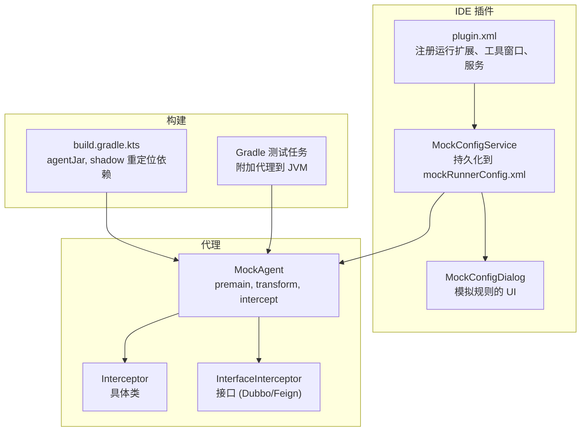
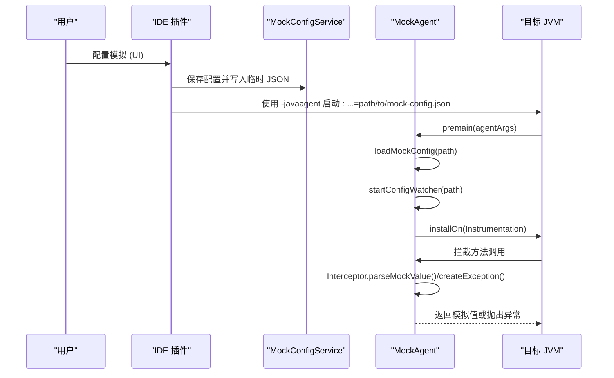
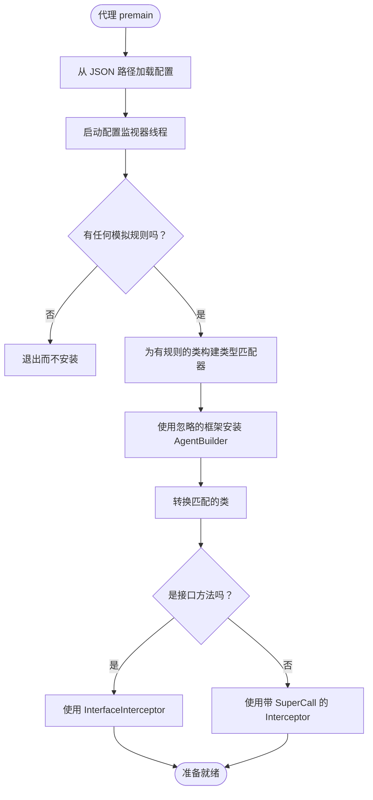
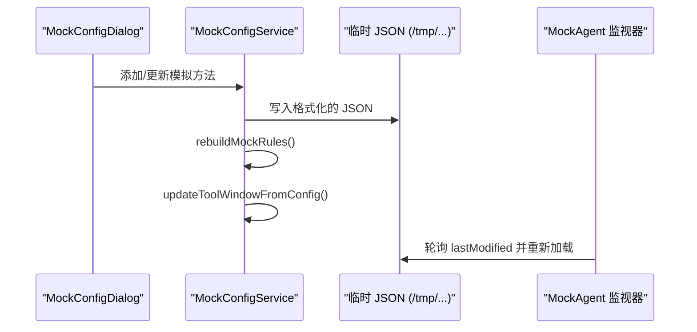
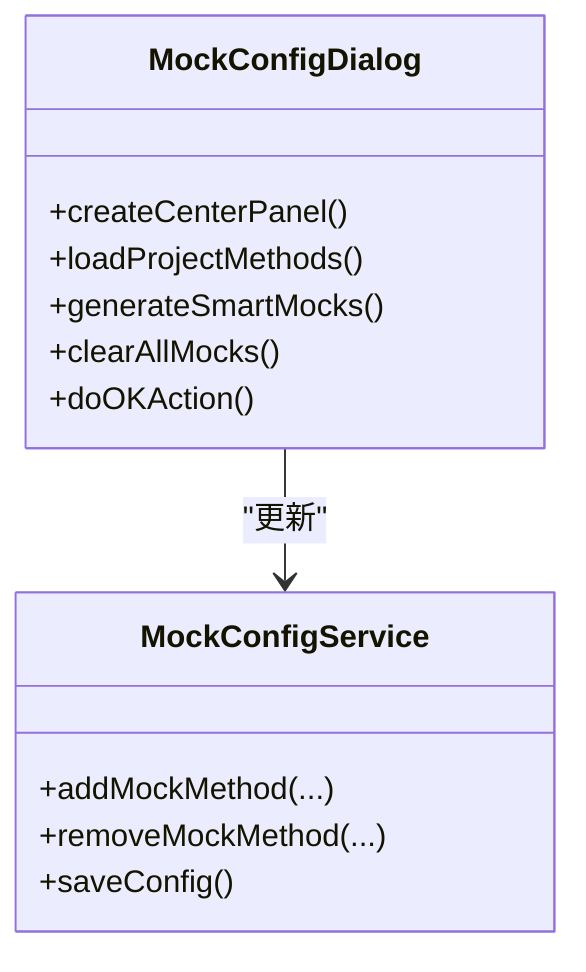
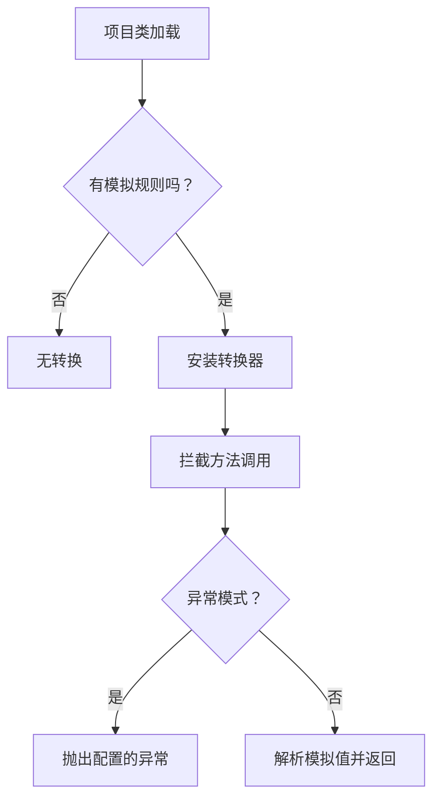
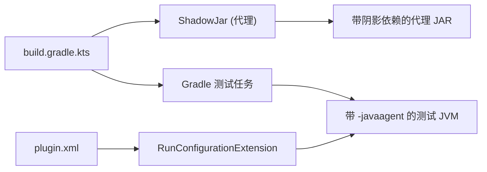

# 故障排除和常见问题解答

<cite>
**本文档引用的文件**
- [README.md](file://README.md)
- [MOCK_RUNNER_README.md](file://MOCK_RUNNER_README.md)
- [docs/MOCK_DEBUG_STEPS.md](file://docs/MOCK_DEBUG_STEPS.md)
- [docs/KNOWN_ISSUES.md](file://docs/KNOWN_ISSUES.md)
- [docs/DEBUG_RUN_IMPROVEMENTS.md](file://docs/DEBUG_RUN_IMPROVEMENTS.md)
- [docs/TESTNG_GUIDE.md](file://docs/TESTNG_GUIDE.md)
- [build.gradle.kts](file://build.gradle.kts)
- [settings.gradle.kts](file://settings.gradle.kts)
- [scripts/view-logs.sh](file://scripts/view-logs.sh)
- [scripts/run-sandbox.sh](file://scripts/run-sandbox.sh)
- [src/main/resources/META-INF/plugin.xml](file://src/main/resources/META-INF/plugin.xml)
- [src/main/java/io/github/lancelothuxi/idea/plugin/mock/agent/MockAgent.java](file://src/main/java/io/github/lancelothuxi/idea/plugin/mock/agent/MockAgent.java)
- [src/main/java/io/github/lancelothuxi/idea/plugin/mock/service/MockConfigService.java](file://src/main/java/io/github/lancelothuxi/idea/plugin/mock/service/MockConfigService.java)
- [src/main/java/io/github/lancelothuxi/idea/plugin/mock/ui/MockConfigDialog.java](file://src/main/java/io/github/lancelothuxi/idea/plugin/mock/ui/MockConfigDialog.java)
- [src/test/resources/mock-config-test.json](file://src/test/resources/mock-config-test.json)
</cite>

## 目录
1. [介绍](#介绍)
2. [项目结构](#项目结构)
3. [核心组件](#核心组件)
4. [架构概述](#架构概述)
5. [详细组件分析](#详细组件分析)
6. [依赖分析](#依赖分析)
7. [性能考虑](#性能考虑)
8. [故障排除指南](#故障排除指南)
9. [常见问题](#常见问题)
10. [结论](#结论)
11. [附录](#附录)

## 介绍
本文档为 Mock Runner 用户和开发者提供了全面的故障排除和常见问题解答。它涵盖了常见的问题，如模拟不工作、泛型的类转换异常、代理加载问题和配置冲突。还包含了系统的调试方法、日志分析技术、错误解释指南、性能故障排除、内存优化、运行时冲突解决、平台特定问题、IDE 兼容性和与 Java 框架的集成挑战。

## 项目结构
该项目是一个 IntelliJ IDEA 插件，它集成了一个 Java 代理，在运行时拦截方法调用。关键部分包括：
- 插件 XML 注册，用于运行配置扩展、工具窗口、服务和行标记
- 模拟配置服务，将模拟规则持久化并同步到临时 JSON 文件
- 加载规则的模拟代理和应用 ByteBuddy 转换
- 配置模拟和生成 JSON 编辑器的 UI 对话框
- 构建和重定位代理 JAR 并将其注入测试运行的 Gradle 任务

**图表来源**
- [src/main/resources/META-INF/plugin.xml](file://src/main/resources/META-INF/plugin.xml#L25-L43)
- [src/main/java/io/github/lancelothuxi/idea/plugin/mock/service/MockConfigService.java](file://src/main/java/io/github/lancelothuxi/idea/plugin/mock/service/MockConfigService.java#L19-L31)
- [src/main/java/io/github/lancelothuxi/idea/plugin/mock/ui/MockConfigDialog.java](file://src/main/java/io/github/lancelothuxi/idea/plugin/mock/ui/MockConfigDialog.java#L24-L41)
- [src/main/java/io/github/lancelothuxi/idea/plugin/mock/agent/MockAgent.java](file://src/main/java/io/github/lancelothuxi/idea/plugin/mock/agent/MockAgent.java#L21-L145)
- [build.gradle.kts](file://build.gradle.kts#L84-L137)

**章节来源**
- [README.md](file://README.md#L1-L296)
- [MOCK_RUNNER_README.md](file://MOCK_RUNNER_README.md#L1-L192)
- [build.gradle.kts](file://build.gradle.kts#L1-L146)
- [src/main/resources/META-INF/plugin.xml](file://src/main/resources/META-INF/plugin.xml#L1-L55)

## 核心组件
- 模拟配置持久化和同步：
  - MockConfigService 持久化到 mockRunnerConfig.xml 并为代理监视器写入临时 JSON
  - 确保配置更改时 UI 更新和编辑器标记刷新
- 模拟代理：
  - 从 JSON 加载配置，监视更改，忽略框架类，并安装 ByteBuddy 转换器
  - 两个拦截器：一个用于具体类（带 SuperCall），一个用于接口（无 SuperCall）
- UI：
  - MockConfigDialog 发现项目方法，支持 JSON 编辑器，并保存启用的规则
- 构建和测试：
  - Gradle agentJar 任务重定位依赖并设置代理清单属性
  - 测试任务自动附加代理并记录附加信息

**章节来源**
- [src/main/java/io/github/lancelothuxi/idea/plugin/mock/service/MockConfigService.java](file://src/main/java/io/github/lancelothuxi/idea/plugin/mock/service/MockConfigService.java#L19-L96)
- [src/main/java/io/github/lancelothuxi/idea/plugin/mock/agent/MockAgent.java](file://src/main/java/io/github/lancelothuxi/idea/plugin/mock/agent/MockAgent.java#L21-L200)
- [src/main/java/io/github/lancelothuxi/idea/plugin/mock/ui/MockConfigDialog.java](file://src/main/java/io/github/lancelothuxi/idea/plugin/mock/ui/MockConfigDialog.java#L24-L108)
- [build.gradle.kts](file://build.gradle.kts#L84-L137)

## 架构概述
运行时模拟管道涉及：
- 用户通过 UI 或工具窗口添加模拟
- MockConfigService 持久化并写入临时 JSON
- 运行/调试配置扩展注入带有 JSON 路径的 -javaagent
- 代理加载配置，监视更改，并安装 ByteBuddy 转换器
- 在方法调用时，拦截器返回配置的值或抛出异常

**图表来源**
- [src/main/java/io/github/lancelothuxi/idea/plugin/mock/service/MockConfigService.java](file://src/main/java/io/github/lancelothuxi/idea/plugin/mock/service/MockConfigService.java#L41-L58)
- [src/main/java/io/github/lancelothuxi/idea/plugin/mock/agent/MockAgent.java](file://src/main/java/io/github/lancelothuxi/idea/plugin/mock/agent/MockAgent.java#L26-L145)
- [build.gradle.kts](file://build.gradle.kts#L63-L82)

## 详细组件分析

### 模拟代理拦截流程
代理为配置了规则的类安装转换器，并根据方法属于接口还是具体类委托给不同的拦截器。

**图表来源**
- [src/main/java/io/github/lancelothuxi/idea/plugin/mock/agent/MockAgent.java](file://src/main/java/io/github/lancelothuxi/idea/plugin/mock/agent/MockAgent.java#L95-L145)

**章节来源**
- [src/main/java/io/github/lancelothuxi/idea/plugin/mock/agent/MockAgent.java](file://src/main/java/io/github/lancelothuxi/idea/plugin/mock/agent/MockAgent.java#L21-L200)

### 模拟配置持久化和同步
MockConfigService 为代理监视器写入临时 JSON 文件，并持久化到项目存储。它还会刷新 UI 和编辑器标记。

**图表来源**
- [src/main/java/io/github/lancelothuxi/idea/plugin/mock/service/MockConfigService.java](file://src/main/java/io/github/lancelothuxi/idea/plugin/mock/service/MockConfigService.java#L41-L58)
- [src/main/java/io/github/lancelothuxi/idea/plugin/mock/agent/MockAgent.java](file://src/main/java/io/github/lancelothuxi/idea/plugin/mock/agent/MockAgent.java#L174-L200)

**章节来源**
- [src/main/java/io/github/lancelothuxi/idea/plugin/mock/service/MockConfigService.java](file://src/main/java/io/github/lancelothuxi/idea/plugin/mock/service/MockConfigService.java#L19-L96)
- [src/main/java/io/github/lancelothuxi/idea/plugin/mock/agent/MockAgent.java](file://src/main/java/io/github/lancelothuxi/idea/plugin/mock/agent/MockAgent.java#L174-L200)

### UI 模拟配置对话框
该对话框发现项目方法，过滤掉 JDK/测试类，并允许启用/禁用和编辑具有 JSON 编辑器的模拟值。

**图表来源**
- [src/main/java/io/github/lancelothuxi/idea/plugin/mock/ui/MockConfigDialog.java](file://src/main/java/io/github/lancelothuxi/idea/plugin/mock/ui/MockConfigDialog.java#L24-L108)
- [src/main/java/io/github/lancelothuxi/idea/plugin/mock/service/MockConfigService.java](file://src/main/java/io/github/lancelothuxi/idea/plugin/mock/service/MockConfigService.java#L109-L151)

**章节来源**
- [src/main/java/io/github/lancelothuxi/idea/plugin/mock/ui/MockConfigDialog.java](file://src/main/java/io/github/lancelothuxi/idea/plugin/mock/ui/MockConfigDialog.java#L24-L108)
- [src/main/java/io/github/lancelothuxi/idea/plugin/mock/service/MockConfigService.java](file://src/main/java/io/github/lancelothuxi/idea/plugin/mock/service/MockConfigService.java#L109-L151)

### 概念概述
- 代理仅影响项目类，不影响 JDK 类
- 某些 JVM 优化（例如，final 方法）可能阻止拦截
- 对于动态代理（例如，Dubbo/Feign），代理无法拦截安装后创建的代理实例

[无需源代码，因为此图显示概念工作流程，而非实际代码结构]

[无需源代码，因为此节不分析特定源文件]

## 依赖分析
- 构建时依赖：
  - ByteBuddy 和 ByteBuddy 代理用于检测
  - Gson 用于 JSON 解析
  - Shadow 插件用于重定位依赖并避免冲突
- 测试时注入：
  - Gradle 测试任务自动附加代理 JAR 和模拟配置路径
- 插件运行时：
  - plugin.xml 注册运行配置扩展，将 -javaagent 注入所有运行/调试配置

**图表来源**
- [build.gradle.kts](file://build.gradle.kts#L25-L35)
- [build.gradle.kts](file://build.gradle.kts#L84-L137)
- [src/main/resources/META-INF/plugin.xml](file://src/main/resources/META-INF/plugin.xml#L25-L28)

**章节来源**
- [build.gradle.kts](file://build.gradle.kts#L25-L35)
- [build.gradle.kts](file://build.gradle.kts#L84-L137)
- [src/main/resources/META-INF/plugin.xml](file://src/main/resources/META-INF/plugin.xml#L25-L28)

## 性能考虑
- 通过确保只有具有活动模拟规则的类被转换来最小化转换类的数量
- 避免过于广泛的类型匹配器；代理已经缩小到有配置规则的类
- 保持模拟配置简洁；大型 JSON 载荷会增加解析开销
- 负责任地使用配置监视器；频繁更改会触发重新加载
- 内存使用：
  - 代理将 JSON 解析为对象；尽可能选择基本值或紧凑的 JSON
  - 对于集合，指定泛型类型以避免回退解析
- 避免模拟在紧密循环中被大量调用的方法；考虑选择性启用

[无需源代码，因为此节提供一般指导]

## 故障排除指南

### 模拟不工作
- 在 Mock Runner 工具窗口中验证模拟是否已启用
- 确认方法签名完全匹配（类名、方法名、参数类型）
- 确保在配置中正确指定了返回类型
- 使用正确的运行器：
  - 对于 IDE 运行，请确保运行配置扩展注入 -javaagent
  - 对于测试，请确认 Gradle 测试任务附加了代理
- 检查日志以获取代理加载和拦截消息

**章节来源**
- [README.md](file://README.md#L214-L234)
- [docs/MOCK_DEBUG_STEPS.md](file://docs/MOCK_DEBUG_STEPS.md#L3-L60)
- [src/main/resources/META-INF/plugin.xml](file://src/main/resources/META-INF/plugin.xml#L25-L28)

### 泛型的 ClassCastException
- 代理尝试将 JSON 解析为指定的返回类型，包括泛型
- 确保配置中的返回类型与方法签名匹配
- 对于泛型集合，指定完整的泛型类型（例如，List<SomeClass>），以便代理可以解析为正确的参数化类型
- 如果类无法解析，代理会回退到通用 List/Map 解析

**章节来源**
- [src/main/java/io/github/lancelothuxi/idea/plugin/mock/agent/MockAgent.java](file://src/main/java/io/github/lancelothuxi/idea/plugin/mock/agent/MockAgent.java#L274-L326)

### 代理未加载
- 确认插件已安装并且运行配置扩展已注册
- 确保您使用的是插件的运行/调试选项，而不是标准选项
- 检查代理 JAR 是否已构建并复制到插件沙箱中
- 验证 Gradle 测试任务附加了代理并打印附加日志
- 查看 IDE 日志以获取代理加载消息

**章节来源**
- [src/main/resources/META-INF/plugin.xml](file://src/main/resources/META-INF/plugin.xml#L25-L28)
- [build.gradle.kts](file://build.gradle.kts#L115-L123)
- [docs/MOCK_DEBUG_STEPS.md](file://docs/MOCK_DEBUG_STEPS.md#L32-L60)

### 配置冲突
- 临时 JSON 冲突：
  - 确保只有一个 IDE 实例写入临时 JSON 路径
  - 代理监视器轮询 lastModified；避免在会话期间进行外部编辑
- 项目与持久存储：
  - mockRunnerConfig.xml 跨会话持久化；临时 JSON 用于实时监视器
- 框架类干扰：
  - 代理忽略框架类；如果您的项目影子或覆盖框架类，请验证它们没有被错误地定位

**章节来源**
- [src/main/java/io/github/lancelothuxi/idea/plugin/mock/service/MockConfigService.java](file://src/main/java/io/github/lancelothuxi/idea/plugin/mock/service/MockConfigService.java#L41-L58)
- [src/main/java/io/github/lancelothuxi/idea/plugin/mock/agent/MockAgent.java](file://src/main/java/io/github/lancelothuxi/idea/plugin/mock/agent/MockAgent.java#L95-L110)

### 动态代理限制（Dubbo/Feign）
- 代理在加载时转换类；安装后创建的代理无法被拦截
- 解决方案：
  - 为单元测试使用具体测试实现
  - 在集成测试中使用真实框架代理
  - 在创建代理之前手动附加代理（高级）

**章节来源**
- [docs/KNOWN_ISSUES.md](file://docs/KNOWN_ISSUES.md#L3-L68)

### TestNG 和自动化测试问题
- 如果测试因不支持的操作异常而失败，请确保模拟已配置和启用
- 验证自动化模拟配置 JSON 是否存在且正确
- 按文档使用 TestNG 套件或单独的测试类

**章节来源**
- [docs/TESTNG_GUIDE.md](file://docs/TESTNG_GUIDE.md#L329-L370)
- [src/test/resources/mock-config-test.json](file://src/test/resources/mock-config-test.json#L1-L72)

### 日志和诊断
- 查看日志：
  - 使用提供的脚本检查 mock-agent.log、临时 JSON 和最近的 IDE 日志
  - 尾随 IDE 日志以获取 MockRunner 和 MockAgent 条目
- 预期日志：
  - 代理加载、规则计数、拦截事件和模拟返回值
- 调试模式：
  - 使用“调试与 Mock Runner”以启用断点和单步调试

**章节来源**
- [scripts/view-logs.sh](file://scripts/view-logs.sh#L1-L26)
- [docs/MOCK_DEBUG_STEPS.md](file://docs/MOCK_DEBUG_STEPS.md#L32-L60)
- [docs/DEBUG_RUN_IMPROVEMENTS.md](file://docs/DEBUG_RUN_IMPROVEMENTS.md#L9-L22)

### 性能故障排除
- 减少活动模拟的数量以最小化拦截开销
- 尽可能优先使用基本返回值而不是复杂 JSON
- 通过指定精确类型避免过度泛型解析
- 监控代理监视器活动；频繁重新加载会影响性能

**章节来源**
- [src/main/java/io/github/lancelothuxi/idea/plugin/mock/agent/MockAgent.java](file://src/main/java/io/github/lancelothuxi/idea/plugin/mock/agent/MockAgent.java#L174-L200)

### 内存使用优化
- 保持模拟值最小，避免深度嵌套结构
- 使用紧凑 JSON 并避免大数组
- 清除未使用的模拟以减少监视器重新加载范围

**章节来源**
- [src/main/java/io/github/lancelothuxi/idea/plugin/mock/agent/MockAgent.java](file://src/main/java/io/github/lancelothuxi/idea/plugin/mock/agent/MockAgent.java#L274-L326)

### 运行时冲突解决
- 在代理 JAR 中重定位依赖项以避免与目标应用程序冲突
- 确保代理清单包含检测所需的属性
- 避免修改字节码的冲突代理或库

**章节来源**
- [build.gradle.kts](file://build.gradle.kts#L94-L110)

### 平台特定问题
- Java 版本：
  - 项目目标 Java 17；确保您的环境使用 Java 17 进行构建和运行
- IDE 兼容性：
  - 需要 IntelliJ IDEA 2022.3+ 和 Java 模块
- 沙箱和日志：
  - 使用提供的脚本来启动和监视沙箱

**章节来源**
- [build.gradle.kts](file://build.gradle.kts#L139-L146)
- [README.md](file://README.md#L235-L240)
- [scripts/run-sandbox.sh](file://scripts/run-sandbox.sh#L1-L17)

### IDE 兼容性和集成
- 与标准运行/调试的集成：
  - 插件的运行配置扩展将 -javaagent 注入所有配置
- 与 TestNG 的集成：
  - Gradle 测试任务自动附加代理并加载模拟配置
- 与 Dubbo/Feign 的集成：
  - 为单元测试使用具体实现，或为集成测试使用真实框架代理

**章节来源**
- [src/main/resources/META-INF/plugin.xml](file://src/main/resources/META-INF/plugin.xml#L25-L28)
- [docs/TESTNG_GUIDE.md](file://docs/TESTNG_GUIDE.md#L31-L78)
- [docs/KNOWN_ISSUES.md](file://docs/KNOWN_ISSUES.md#L23-L68)

## 常见问题

### 为什么我的模拟不起作用？
- 确保您选择了插件的"使用 Mock Runner 运行"或"使用 Mock Runner 调试"
- 验证模拟已启用且方法签名匹配
- 确认代理已附加且日志显示拦截

**章节来源**
- [docs/MOCK_DEBUG_STEPS.md](file://docs/MOCK_DEBUG_STEPS.md#L26-L60)
- [README.md](file://README.md#L214-L234)

### 如何修复泛型类型的 ClassCastException？
- 指定确切的返回类型，包括泛型（例如，List<SomeClass>）
- 确保类在运行时可以解析；否则，代理会回退到通用解析

**章节来源**
- [src/main/java/io/github/lancelothuxi/idea/plugin/mock/agent/MockAgent.java](file://src/main/java/io/github/lancelothuxi/idea/plugin/mock/agent/MockAgent.java#L274-L326)

### 为什么代理未加载？
- 确认插件安装以及运行配置扩展处于活动状态
- 检查您是否使用插件的运行器，而不是标准运行器
- 验证代理 JAR 存在且 Gradle 测试任务附加了它

**章节来源**
- [src/main/resources/META-INF/plugin.xml](file://src/main/resources/META-INF/plugin.xml#L25-L28)
- [docs/MOCK_DEBUG_STEPS.md](file://docs/MOCK_DEBUG_STEPS.md#L32-L60)

### 我可以模拟 JDK 类吗？
- 不可以，代理只修改项目类，不修改 JDK 类

**章节来源**
- [MOCK_RUNNER_README.md](file://MOCK_RUNNER_README.md#L169-L172)

### 为什么动态代理（Dubbo/Feign）不起作用？
- 代理在代理创建后安装；代理无法拦截它们
- 为单元测试使用具体实现，或为集成测试使用真实框架代理

**章节来源**
- [docs/KNOWN_ISSUES.md](file://docs/KNOWN_ISSUES.md#L3-L68)

### 如何启用调试和断点？
- 使用"使用 Mock Runner 调试"启动具有完整 IDE 调试功能的调试会话

**章节来源**
- [docs/DEBUG_RUN_IMPROVEMENTS.md](file://docs/DEBUG_RUN_IMPROVEMENTS.md#L9-L22)

### 如何查看日志和诊断问题？
- 使用提供的脚本检查 mock-agent.log、临时 JSON 和最近的 IDE 日志
- 尾随 IDE 日志以获取 MockRunner 和 MockAgent 条目

**章节来源**
- [scripts/view-logs.sh](file://scripts/view-logs.sh#L1-L26)
- [docs/MOCK_DEBUG_STEPS.md](file://docs/MOCK_DEBUG_STEPS.md#L32-L60)

### 如何使用模拟运行测试？
- 使用 Gradle 测试任务；它会自动构建并附加带有模拟配置的代理
- 或者，在 Mock Runner 工具窗口中配置模拟并通过 IDE 运行

**章节来源**
- [docs/TESTNG_GUIDE.md](file://docs/TESTNG_GUIDE.md#L31-L78)
- [build.gradle.kts](file://build.gradle.kts#L63-L82)

### 支持哪些 Java 和 IDE 版本？
- IntelliJ IDEA 2022.3+ 和 Java 17+

**章节来源**
- [README.md](file://README.md#L235-L240)
- [build.gradle.kts](file://build.gradle.kts#L139-L146)

## 结论
本指南汇编了 Mock Runner 的实用故障排除步骤、日志技术以及配置最佳实践。通过遵循诊断程序并了解代理的行为，用户和开发人员可以快速解决问题，并自信地将运行时模拟集成到他们的开发和测试工作流中。

## 附录

### 诊断检查表
- [ ] 模拟已启用且签名匹配
- [ ] 使用"使用 Mock Runner 运行"或"使用 Mock Runner 调试"
- [ ] 代理 JAR 已构建并复制到沙箱中
- [ ] 临时 JSON 存在且代理可读
- [ ] 日志显示代理加载和拦截
- [ ] 返回类型与方法签名匹配，特别是泛型
- [ ] 考虑框架代理限制（Dubbo/Feign）

**章节来源**
- [docs/MOCK_DEBUG_STEPS.md](file://docs/MOCK_DEBUG_STEPS.md#L3-L60)
- [src/main/java/io/github/lancelothuxi/idea/plugin/mock/agent/MockAgent.java](file://src/main/java/io/github/lancelothuxi/idea/plugin/mock/agent/MockAgent.java#L274-L326)
- [docs/KNOWN_ISSUES.md](file://docs/KNOWN_ISSUES.md#L3-L68)